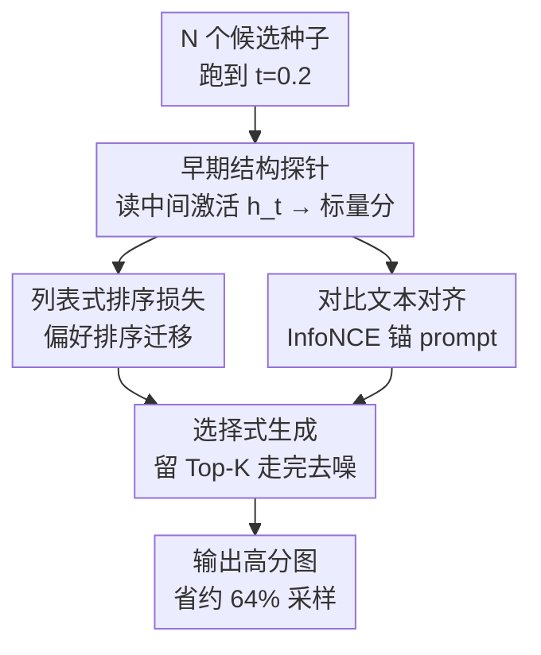

# Toward Early Quality Assessment of Text-to-Image Diffusion Models

**会议**: CVPR 2026  
**论文**: [CVF Open Access](https://openaccess.thecvf.com/content/CVPR2026/html/Guo_Toward_Early_Quality_Assessment_of_Text-to-Image_Diffusion_Models_CVPR_2026_paper.html)  
**代码**: https://github.com/Guhuary/ProbeSelect （有）  
**领域**: 扩散模型 / 图像生成  
**关键词**: 早期质量评估, 文生图扩散, 中间激活探针, 选择式生成, 采样加速

## 一句话总结
本文提出 Probe-Select，一个挂在扩散去噪器中间激活上的轻量探针：只跑到生成轨迹的 20% 就能预测一张图最终的质量分，从而提前砍掉没希望的随机种子，把"先生成一堆再挑"流程的采样开销砍掉约 64%，同时被保留图像的质量反而更高。

## 研究背景与动机
**领域现状**：当下用文生图（T2I）扩散 / flow-matching 模型时，实际工程里普遍是"generate-then-select"模式——对同一个 prompt 撒很多随机种子（seed）各生成一张候选图，再用 CLIPScore、ImageReward、PickScore、HPS 这类自动评测器打分，只留下最好的一两张。

**现有痛点**：这套流程极度浪费算力。每张候选图都要走完几十到上百步去噪才算生成完，而所有质量评测器（CLIPScore / ImageReward / HPS…）都是**事后（post-hoc）**的——它们只能吃"完全去噪后的成品图"。于是大量算力被砸在那些注定要被淘汰的低质候选上：你必须先把一张烂图完整画完，才知道它是烂图。

**核心矛盾**：质量信号只在轨迹**终点**才可读，但淘汰决策最划算的时机却在轨迹**起点**。事后评测器天然无法消费"还很噪"的中间潜变量或中间激活，所以无法在早期就剪枝。已有工作 HEaD 尝试用交叉注意力图预测物体幻觉、做二值的"继续/停止"决策，但仍偏粗。

**本文目标**：定义并解决 **早期质量评估（Early Quality Assessment, EQA）**——只用前一小段去噪步数后的部分生成状态，就预估这条轨迹最终的图像质量，从而及时中断没希望的路径。

**切入角度**：作者的关键观察（Fig. 1 / Fig. 3）是：尽管早期潜变量 $z_t$ 还很噪，去噪器**内部**的某些中间激活其实**已经**编码了稳定的粗结构——物体布局、空间排布、语义分组——而且这些结构出现得很早（轨迹 20% 处）、随时间变化很慢。既然最终质量很大程度由这些粗结构决定，那从早期激活预测最终质量就是可行的。

**核心 idea**：用一个轻量探针读早期去噪器激活，把它的输出对齐到外部评测器分数，从而"未卜先知"地预测成品质量——不改生成器、不改采样器、不改调度，纯插件式地给"先生成再挑选"装上一个提前剪枝的闸门。

## 方法详解

### 整体框架
Probe-Select 是一个挂在冻结扩散去噪器 $f_\theta$ 上的**插件式评估器**。训练阶段（Fig. 2）：对 MS-COCO 的每个 caption 撒 5 个种子各生成一张图，缓存早期某个时间点 $t$（如 0.2）的去噪器中间激活 $h_t$，并用 8 个离线评测器给成品图打"真值"分；探针读 $h_t$ + 时间步 $t$，输出一个标量预测分 $\hat y_t$，用排序损失对齐评测器的相对偏好、用对比损失对齐 prompt 语义。推理阶段：对 $N$ 个候选种子只跑到早期检查点 $t=0.2$，提取激活、用探针打分，只让 Top-$K$ 名继续走完去噪，其余直接丢弃。

整条管线分三块：**早期结构探针**（怎么从噪声激活里读出质量信号）、**双目标训练**（怎么让这个分既符合评测器排序、又对 prompt 敏感）、**选择式生成**（推理时怎么用这个分省算力）。

### 关键设计

**1. 早期结构探针：从还很噪的中间激活里读出最终质量**

痛点在于事后评测器只能吃成品图。Probe-Select 反其道而行：在去噪器 $f_\theta$ 的若干选定 block 上、在一个早期检查点 $t$（如总步数的 20%）挂上轻量探针。它由三件套组成：**特征抽头（feature taps）**从选定 block 取出中间激活 $h_t \in \mathbb{R}^{C\times H\times W}$；**探针编码器 $g_\phi$**——一个微型视觉编码器，吃 $h_t$ 和时间步嵌入，经全局池化产出 $u_t = g_\phi(h_t, t) \in \mathbb{R}^{d_h}$；**投影头 $p_\phi$**——一个小 MLP，把 $u_t$ 映射成标量分 $\hat y_t = p_\phi(u_t)$。形式上学一个预测器使 $E_\phi(h_t, t) = p_\phi(g_\phi(h_t,t)) \to \hat y_{t,m} \approx R_m(x_1)$，即用早期状态逼近外部评测器 $R_m$ 在成品图 $x_1$ 上的打分。

之所以可行，是因为作者通过 PCA 可视化（Fig. 3）发现 SD2 去噪器中**中后层**（尤其第 3 个上采样块 Up-3）即使上游输入被严重污染，仍稳定保留可辨识的形状与边界——粗布局"出现得早、变化得慢"。探针正好挑这种稳定层当默认抽头。整个探针参数极少、不动 $f_\theta$ 也不动采样器，因此**与 backbone 和调度无关**，可即插到 SD2 / SD3 / FLUX 等各种生成器上。

**2. 列表式排序损失：把评测器的"相对偏好"迁移给探针，而不是死磕绝对分值**

如果直接让 $u_t$ 回归评测器的绝对分，训练不稳，且容易忽略文本语义。但我们真正需要的其实只是**排序**——在 5 个候选里挑出最好的那个，绝对分值多少并不重要。于是作者用一个 softmax 列表式损失（Eq. 5）：对一个 batch 内 $B$ 个样本，让早期预测 $\hat y_t^i$ 产生与评测器真值 $y_i$ 一致的排序，

$$\mathcal{L}_{\text{list}} = -\frac{1}{B}\sum_i^B \log \frac{\exp(\hat y_t^i / \tau_{\text{list}})}{\sum_{j:\, y_j + \alpha < y_i} \exp(\hat y_t^j / \tau_{\text{list}})}$$

分母只对"真值明显比 $i$ 差（$y_j + \alpha < y_i$）"的样本求和，等于教探针把好种子排到差种子前面。温度 $\tau_{\text{list}} = \tau_{\text{list,max}}\cdot \max(1 - e/E, 0.1)$ 和间隔 $\alpha = \alpha_{\max}\cdot(1 - e/E)$ 都随训练 epoch $e$（最大 $E$）退火：前期大温度、大间隔，关注粗排序；后期收紧，精修。这个损失只在乎相对次序，迫使探针聚焦于"区分好坏种子"的判别性结构线索，而不是去拟合噪声很大的绝对分数。

**3. 对比文本对齐（InfoNCE）：把探针表征锚到 prompt，防止它无视语义**

只学排序还不够——探针可能学到一个跟文本无关的"通用美感"分，对同一张图无论配什么 prompt 都给一样的分。为保持 prompt 敏感性，作者把探针嵌入 $u_t$ 与 prompt 嵌入 $e_p = W_p E_{\text{text}}(p)$（来自冻结文本编码器如 CLIP）对齐，用 InfoNCE 损失（Eq. 6）让匹配对 $(u_t, e_p)$ 的余弦相似度高、不匹配对低：

$$\mathcal{L}_{\text{Align}} = -\frac{1}{B}\sum_{i=1}^B \log \frac{\exp(\cos(u_i, e_p^i)/\tau_{\text{Align}})}{\sum_{j=1}^B \exp(\cos(u_i, e_p^j)/\tau_{\text{Align}})}$$

总损失 $\mathcal{L} = \mathcal{L}_{\text{list}} + \lambda_{\text{Align}}\mathcal{L}_{\text{Align}}$，取 $\lambda_{\text{Align}}=10$。这一项让探针表征"知道这张图是为哪句话生成的"，从而预测的质量分能反映 prompt-图像对齐度，而不只是孤立的画面好看与否——这也解释了为什么像 ImageReward、BLIP-ITM 这类重视整体构图与语义对齐的指标，探针对它们的预测相关性能逼近 1.0。

**4. 选择式生成：推理时只让早期高分种子走完去噪**

有了能在 $t=0.2$ 就打分的探针，推理就变成一道剪枝题。对每个 prompt 撒 $N$ 个种子，全部只跑到早期检查点 $t_e=0.2$ 提取激活、探针打分 $\{\hat y_t^i\}$，只保留 Top-$K$（$K \ll N$）继续完整去噪，其余直接终止。期望算力开销近似

$$\text{Cost Ratio} \approx \eta + (1-\eta)\frac{K}{N}$$

其中 $\eta$ 是早期检查点占总步数的比例（这里 0.2）。代入 $K=1, N=5$：$0.2 + 0.8\times \frac{1}{5} = 0.36$，即只花原本 36% 的算力、省约 64%。这套机制不改架构，同一套早期分还能延伸出自适应停止（质量饱和就停）或质量条件引导，是一个面向"算力感知"生成的通用底座。

### 损失函数 / 训练策略
训练在 4 张 A100-40GB 上跑最多 200 epoch，batch size 480，AdamW（lr $1\text{e}{-5}$、weight decay $1\text{e}{-2}$），余弦退火 $\eta_{\min}=1\text{e}{-6}$，参数维护 EMA（decay 0.999）。每 epoch 在验证集上监控 Spearman 相关，patience 20 早停。关键超参：$\lambda_{\text{Align}}=10$，$\tau_{\text{list,max}}=\tau_{\text{Align,max}}=1.0$，$\alpha_{\max}=0.4\sigma$（$\sigma$ 为训练集目标评测器分数的标准差）。每个 backbone 用 MS-COCO 10 万 caption × 5 种子 = 50 万张图，90% 训练 / 10% 验证。

## 实验关键数据

### 主实验
**早期预测 vs 最终质量的 Spearman 相关（Table 1，节选 $t=0.2$）**：在四个 backbone 上，探针只用 20% 轨迹的激活预测最终分，与真值的秩相关已经很高，且 $t=0.2 \to 0.6$ 几乎不变。

| Backbone | CLIPScore | PickScore | BLIP-ITM | ImageReward | HPSv2.1 |
|----------|-----------|-----------|----------|-------------|---------|
| SD2 | 0.71 | 0.79 | **0.99** | **0.99** | 0.64 |
| SD3-M | 0.78 | 0.84 | **0.99** | **0.99** | 0.79 |
| SD3-L | 0.79 | 0.84 | **0.99** | **0.99** | 0.77 |
| FLUX.1-dev | 0.75 | 0.86 | **0.99** | **0.99** | 0.78 |

BLIP-ITM 与 ImageReward 这类重整体构图/语义对齐的指标相关性逼近 1.0；CLIPScore、HPS 更吃后期才稳定的高频纹理，故略低。

**选择式生成（Table 2，节选）**：用早期分挑 Top-1（$K=1,N=5$）走完去噪，对比"5 个全跑完取平均"的 baseline。`-IR` 表示用预测 ImageReward 挑选。

| 配置 | ImageReward | HPSv2.1 | CLIPScore |
|------|-------------|---------|-----------|
| SD2（baseline 平均） | 0.49 | 26.95 | 31.95 |
| SD2-IR | **1.59** | **29.03** | 33.50 |
| SD3-M（baseline） | 1.12 | 29.64 | 32.43 |
| SD3-M-IR | **1.83** | 31.17 | 34.15 |
| SD3-L-IR | **1.83** | **31.81** | 34.12 |
| FLUX.1-dev（baseline） | 0.92 | 29.14 | 30.92 |
| FLUX.1-dev-IR | **1.79** | 31.47 | **33.04** |

四个 backbone 全线提升，且分布级质量也变好：SD3-M 的 FID 25.26→25.01、SD3-L 23.72→23.64。算力上选择式续算把期望去噪开销降到约 0.36，省约 64%。

### 消融实验
论文没有传统"去掉模块掉几个点"的消融表，而是用两组分析验证设计有效性：

| 分析 | 关键指标 | 说明 |
|------|---------|------|
| 时间稳定性（Table 1） | Spearman $t=0.1\to0.6$ | $t=0.1$ 信号偏弱（SD2 IR 0.70），$t=0.2$ 起跳到 0.99 并保持，证明 20% 是性价比拐点 |
| 候选/续算权衡（Fig. 5, FLUX, 1000 caption） | Top-K 平均 IR | 固定 $K$ 时质量随 $N$ 升后饱和（Top-1: $N{=}10$ 约 1.36 → $N{=}100$ 约 1.45，$N\approx50$ 已收益见顶）；无选择 baseline 恒在 ~0.95，证明增益来自"早排序"而非"多撒种子" |

### 关键发现
- **20% 是黄金拐点**：$t=0.1$ 信号还不够稳，但到 $t=0.2$ 秩相关就跳到接近饱和，再往后到 $t=0.6$ 几乎不涨——说明粗结构在轨迹五分之一处就基本定型，这是整篇方法的实证基石。
- **评测器之间差异有讲究**：BLIP-ITM / ImageReward 相关性接近 1.0，因为它们看整体构图与语义对齐，这些在早期激活里已大体成形；CLIPScore / HPS 偏向细纹理与高频细节，要到后期才可靠，所以相关性偏低。此外分数分布更宽更不饱和的指标（BLIP-ITM、ImageReward）排序更稳，窄分布指标容易产生并列、拉低秩相关。
- **增益来自排序不是堆量**：无选择 baseline 无论撒多少种子都停在 ~0.95，而 Top-1 随 $N$ 提升，说明价值在于"早期就能把好种子排出来"。实用配方：要单张图时 $K=1\text{–}3$、$N\approx50$ 是质量-成本甜点。

## 亮点与洞察
- **把"评测"从事后变成在线过程**：这是范式转换——以前质量分是终点的裁判，现在变成生成途中的导航仪。一旦质量可以在 20% 处读出，"先生成再挑选"就能从"全画完再淘汰"变成"早淘汰"，这个视角可迁移到任何迭代式生成（视频扩散、3D 扩散、长序列采样）。
- **复用扩散内部表征的新用途**：以往工作把扩散中间特征用于分割、对应、检索等下游视觉任务，本文首次把它们用于"在线质量预测"，挖出了 U-Net 激活"早出现、慢变化"这一被忽视的时序性质。
- **排序损失 + 退火温度的小技巧**：放弃回归绝对分、只学相对排序，配合温度/间隔随 epoch 退火（先粗排后精修），是处理"目标分数噪声大但只需 Top-1"任务的可复用范式，可迁到任何"撒一堆候选挑最好"的场景（如 RLHF best-of-N、检索重排）。
- **真正的零侵入插件**：不改生成器、采样器、调度，跨 SD2/SD3/FLUX 即插即用——工程落地门槛极低。

## 局限与展望
- **依赖逐 backbone 训练 + 海量缓存**：每个生成器要单独跑 50 万张图缓存激活、训练专属探针，迁移到新模型成本不低；论文也没给"一个探针跨 backbone 泛化"的结果。
- **细节敏感指标预测偏弱**：CLIPScore、HPS 这类吃高频纹理的指标早期相关性只到 0.6–0.8，说明对"细节决定成败"的 prompt（如精细文字、复杂手部），20% 处的早期剪枝可能误杀后期才翻盘的种子。
- **选择粒度仅在种子级**：方法是在"哪个种子值得继续"上做文章，没触及单条轨迹内部的自适应步数控制；作者把动态时间步控制、自适应引导、与强化/主动采样闭环列为未来方向。
- **评测仍以自动指标为主**：质量真值全靠 ImageReward/HPS 等自动评测器，未做人类偏好的直接验证，存在"探针对齐到了评测器的偏见"的风险。

## 相关工作与启发
- **vs 扩散加速方法（蒸馏 / flow-matching / DeeDiff / AutoDiffusion）**: 它们都在"减步数 / 降单步开销"上做文章，改的是采样器本身；本文走互补路线——不动采样器，而是**高效评估**，靠早期预测把烂种子整条砍掉。两者可叠加。
- **vs 事后评测器（CLIPScore / ImageReward / PickScore / HPS）**: 这些只能吃成品图、无法消费噪声潜变量；Probe-Select 把它们的"偏好"蒸馏进一个能读中间激活的探针，相当于给事后指标装上"提前量"。
- **vs HEaD**: HEaD 也用中间信号（交叉注意力图）预测物体幻觉，但做的是二值的"继续/停止"决策；本文输出连续质量分、支持 Top-K 排序剪枝，并系统验证了 8 个评测器上的相关性与跨 backbone 稳定性，粒度与覆盖面都更广。
- **vs 扩散特征用于下游视觉任务**: 前人用扩散中间特征做分割/检索/对应等，本文把同一类特征首次用于"生成过程中的在线质量评估"，是对扩散表征"可复用性"的新延伸。

## 评分
- 新颖性: ⭐⭐⭐⭐ 把质量评测从事后改为在线过程、首次用早期去噪激活做质量预测，范式新颖；但底层"扩散中间特征有用"已有不少先例。
- 实验充分度: ⭐⭐⭐⭐ 覆盖 4 个 backbone、8 个评测器、时间稳定性 + N/K 权衡分析齐全；略欠传统消融与人类评测、跨 backbone 泛化。
- 写作质量: ⭐⭐⭐⭐ 动机清晰、图示（PCA 可视化、训练总览）有力，公式与流程交代完整。
- 价值: ⭐⭐⭐⭐ 省 64% 采样且质量更高、零侵入即插即用，对"先生成再挑选"的工程流水线有直接落地价值。

<!-- RELATED:START -->

## 相关论文

- [\[CVPR 2026\] Erasing Thousands of Concepts: Towards Scalable and Practical Concept Erasure for Text-to-Image Diffusion Models](erasing_thousands_of_concepts_towards_scalable_and_practical_concept_erasure_for.md)
- [\[CVPR 2026\] DBMSolver: A Training-free Diffusion Bridge Sampler for High-Quality Image-to-Image Translation](dbmsolver_a_training-free_diffusion_bridge_sampler_for_high-quality_image-to-ima.md)
- [\[CVPR 2026\] TINA: Text-Free Inversion Attack for Unlearned Text-to-Image Diffusion Models](tina_text-free_inversion_attack_for_unlearned_text-to-image_diffusion_models.md)
- [\[CVPR 2026\] Test-Time Alignment of Text-to-Image Diffusion Models via Null-Text Embedding Optimisation](test-time_alignment_of_text-to-image_diffusion_models_via_null-text_embedding_op.md)
- [\[CVPR 2026\] Frequency-Aware Flow Matching for High-Quality Image Generation](freqflow_frequency_aware_flow_matching.md)

<!-- RELATED:END -->
