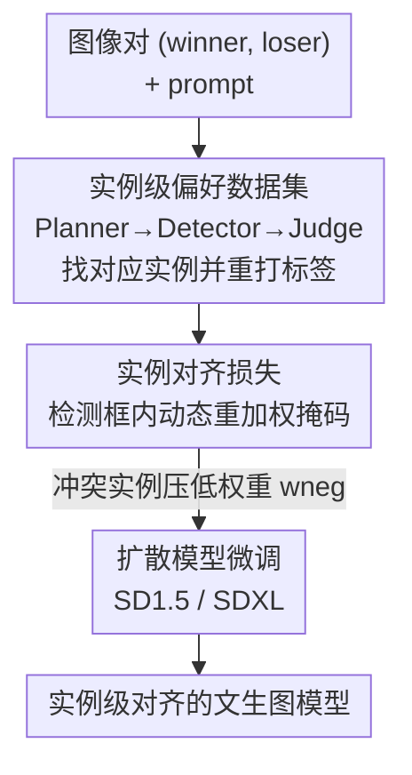

# Towards Fine-Grained Attribution: Instance-Aware Preference Optimization for Aligning Diffusion Models

**会议**: CVPR 2026  
**论文**: [CVF Open Access](https://openaccess.thecvf.com/content/CVPR2026/html/Sun_Towards_Fine-Grained_Attribution_Instance-Aware_Preference_Optimization_for_Aligning_Diffusion_Models_CVPR_2026_paper.html)  
**领域**: 扩散模型 / 偏好对齐  
**关键词**: 扩散模型对齐, DPO, 实例级信用分配, 偏好优化, 空间稀疏奖励

## 一句话总结
针对扩散模型 DPO 对齐里「一张图只有一个偏好标签」导致的空间稀疏奖励问题，IAPO 用 VLM + 检测器自动标注出实例级偏好数据集，再用一个带动态重加权掩码的实例对齐损失，把信用分配从整图粒度细化到单个物体粒度，在多个 benchmark 上达到 SOTA 且训练效率比 InPO 高 3.27 倍。

## 研究背景与动机

**领域现状**：用人类反馈对齐文生图扩散模型，目前主流是 Direct Preference Optimization（DPO）这条线。给定一个 prompt 和一对图 $(x_0^w, x_0^l)$（人类偏好 winner / loser），DPO 把 Bradley-Terry 偏好模型套进扩散损失，直接在偏好数据上优化模型，省掉了显式训练奖励模型的环节，简洁有效，催生了 Diffusion-DPO、KTO、InPO 等一系列方法。

**现有痛点**：DPO 的监督信号是**整图级**的——一对图只有一个 win/lose 标签。但一张「整体被偏好」的图，局部完全可能有质量糟糕的实例；反过来，一张「整体被嫌弃」的图，某个物体反而画得更好。论文给的例子很直白：winning 图整体构图更好被判为 winner，但里面那只鹰多长了一组爪子（四只爪），单看「鹰」这个实例其实是 losing 图画得对。把整图的正向偏好均匀地铺到所有像素上，等于在奖励画错的鹰、惩罚画对的鹰，信用分配是错位的。

**核心矛盾**：这是一个**空间维度上的稀疏奖励**问题。已有的改进几乎都在做**时间维度**的信用分配——想办法把整图分数摊到扩散的各个 timestep 上（训练 latent 奖励模型、或 training-free 地评估中间 latent）。但它们都漏掉了图像独有的空间稀疏：奖励信号在像素/实例之间是错配的。统计上，作者发现整图偏好与实例偏好相互冲突的实例对占到了全数据的约 **46.3%**——近一半的监督信号方向是有问题的。

**本文目标**：把对齐目标从 image-level 推进到 instance-level，让每个实例拿到与自己真实质量匹配的偏好信号。这要解决两个子问题：（1）哪来的实例级偏好标签？（2）有了标签怎么改 DPO 损失，才能既照顾不同大小的实例又不引入训练偏差？

**核心 idea**：构建第一个实例级偏好数据集（自动标注），再用一个**动态重加权掩码**在检测框内调制损失权重——对「实例偏好与整图偏好冲突」的区域压低权重，把模型注意力引向真正决定人类偏好的实例特征。

## 方法详解

### 整体框架
IAPO 是一个两阶段框架。**第一阶段**：在 Pick-a-Pic v2 上跑一条自动标注流水线，用 Planner / Detector / Judge 三个角色，把每对图里相互对应的实例找出来、定位成边界框、并重新打上实例级偏好标签，构建出实例级偏好数据集。**第二阶段**：基于这个细粒度数据集，设计一个实例对齐损失——用动态重加权掩码在检测框内调制扩散 DPO 损失的逐像素权重，放大关键实例的学习信号、压制干扰实例的影响。

### 关键设计

**1. 实例级偏好数据集：用 VLM+检测器自动把整图标签拆到单个实例**

整图标签的根本毛病是「信用分配模糊」——一个全局信号被均匀铺到所有视觉元素上。作者的解决办法是把数据集从 $\mathcal{D}=\{(x_0^w, x_0^l, c)\}$ 扩充成 $\mathcal{D}=\{(x_0^w, x_0^l, c, \{(b_n^w, b_n^l, \rho_n)\}_{n=1}^N)\}$，其中 $b_n^w, b_n^l$ 是第 $n$ 个实例在 winner / loser 图里的边界框，$\rho_n$ 是实例级偏好：$\rho_n=0$ 表示 winner 里这个实例更好，$\rho_n=1$ 表示 loser 里这个实例反而更好（即与整图偏好冲突）。

标注由三个角色协作完成。**Planner**（VLM）负责找出一对图共有的显著实例，例如两张图都有鹰时，它产出指令 `Matched Instance:[Eagle]`。**Detector**（Grounding-DINO）接收实例描述，在两张图里各自定位出对应区域、输出成对的边界框；同一描述匹配到多个物体时只保留检测置信度最高的那个，匹配不到就跳过。**Judge**（VLM）对检测出的实例对做偏好比较：先按实例中心把原图裁成 patch、统一 resize 以排除背景干扰和尺度差异，再用精心设计的 prompt 输出离散判断 `Image A/B is better`，编码成 $\rho_n$。实现上 Planner 和 Judge 都用 Qwen2.5-VL-7B，Detector 用 Grounding-DINO。整条流水线在 Pick-a-Pic v2 上自动标注了 **959,040** 对图，产出 **1,205,593** 个实例偏好对，其中整图偏好与实例偏好冲突的有 558,352 对（约 46.3%）——这个比例本身就证明了整图监督的错位有多普遍。

**2. 动态重加权掩码：在检测框内压低「冲突实例」的损失权重**

有了实例标签，怎么改损失？最朴素的做法是给 image-level 和 instance-level 各写一个损失项，但实例大小差异巨大——给极小的实例和大实例施加同等强度的引导，会引入训练偏差。作者改用**空间自适应加权**：构造与图同尺寸的掩码 $M^w, M^l \in \mathbb{R}^{H\times W}$，引入超参 $w_{neg}\ (\le 1)$。对于「第 $n$ 个实例偏好与整图偏好冲突」（即更偏好 loser 里那个实例，$\rho_n=1$）的区域，把 winner / loser 两个框 $b_n^w, b_n^l$ 内的权重设成 $w_{neg}$ 来惩罚这种错配；其余区域权重为 1：

$$M_n^*(i,j) = \begin{cases} w_{neg} & \text{if } (i,j)\in b_n^* \text{ and } \rho_n=1 \\ 1 & \text{otherwise} \end{cases}$$

多个实例区域重叠时权重取平均 $M^* = \frac{1}{N}\sum_{n=1}^N M_n^*$；再把掩码归一化到单位均值 $M^* = M^*/\mathbb{E}[M^*]$，避免 winner / loser 因分辨率不同导致损失尺度错配，最后 resize 到 latent 的空间分辨率。这套设计的精髓在于：它不是粗暴地丢掉冲突样本，而是**逐像素地调制学习方向**——让画错的鹰那块区域权重显著降低，从而把梯度从「奖励错误实例」扭回到真正反映人类偏好的实例上。

**3. 实例级信用分配的损失：把掩码逐元素乘进扩散 DPO 损失**

要在扩散模型上做 DPO，需要从 $p_\theta(x_{1:T}^*|x_0^*)$ 采样中间状态。作者沿用 InPO 的做法，用少于 10 步的 DDIM 求逆得到中间态 $x_t^*$ 的精确近似，再按 Diffusion-DPO 把目标简化成可微的噪声预测形式。最终把掩码 $M^w, M^l$ 逐元素（$\odot$）乘进损失：

$$\mathcal{L}(\theta) = -\mathbb{E}\,\log\sigma\Big(-\beta T\omega(\lambda_t)\big[(\|\epsilon^w-\epsilon_\theta(x_t^w,t)\|_2^2-\|\epsilon^w-\epsilon_{ref}(x_t^w,t)\|_2^2)\odot M^w - (\|\epsilon^l-\epsilon_\theta(x_t^l,t)\|_2^2-\|\epsilon^l-\epsilon_{ref}(x_t^l,t)\|_2^2)\odot M^l\big]\Big)$$

相比原始 Diffusion-DPO 损失，唯一改动就是这两个 $\odot M^*$，但效果是把整图级的 Bradley-Terry 偏好范式直接延伸到了实例级。这也是它和 PatchDPO 等已有实例级方法的本质区别：PatchDPO 是面向参考图个性化、靠参考图相似度和加权 MSE；IAPO 不需要预定义参考，做的是通用的人类偏好对齐。

### 损失函数 / 训练策略
backbone 为 SD1.5 和 SDXL，都在 Pick-a-Pic v2（过滤约 12% 后剩 851,293 图文对、58,960 个唯一 prompt）上训练。SDXL 用 Adafactor 优化器、DDIM 求逆（CFG=0、求逆 10 步）拿目标噪声、梯度累积 128 步（有效 batch 1024 对）；SD1.5 因建模能力有限、DDIM 求逆得不到语义忠实的 latent，改成直接采样 $\epsilon^*$、梯度累积 256 步。$\beta$ 在 SD1.5 / SDXL 上分别为 2000 / 5000，固定随机种子 42，训练 200（SD1.5）/ 300（SDXL）步，8 张 H800。

## 实验关键数据

### 主实验
在 Parti-Prompts、HPD v2、Pick-a-Pic v2 三个测试集上，用 Aesthetic / PickScore / HPS / CLIP 四个评估器对比。IAPO 在 SD1.5 和 SDXL 上几乎所有指标、所有数据集都超过 baseline。

| 数据集 / 指标 (mean) | SD1.5 base | DPO | KTO | InPO | IAPO (本文) |
|--------|------|------|------|------|------|
| HPD v2 · Aesthetic | 5.4338 | 5.5856 | 5.7249 | 5.8064 | **5.9261** |
| HPD v2 · PickScore | 20.8424 | 21.2972 | 21.5833 | 21.9131 | **22.0227** |
| HPD v2 · HPS | 26.8804 | 27.3898 | 28.3047 | 28.5003 | **28.6379** |
| Pick-a-Pic v2 · Aesthetic | 5.3211 | 5.4690 | 5.5845 | 5.6566 | **5.7842** |
| Parti-Prompts · Aesthetic | 5.3112 | 5.4524 | 5.5094 | 5.5681 | **5.7270** |

SDXL 上相对 InPO 也稳定领先（如 HPD v2 Aesthetic 6.1797→**6.2580**、PickScore 23.2761→**23.3230**），但提升幅度小于 SD1.5——作者解释 SDXL 本身已强于 Pick-a-Pic 数据集生成所用的模型，数据集对它来说偏弱（与 Diffusion-DPO 的观察一致）。

### 训练效率与消融
训练效率是 IAPO 的一大卖点：单卡 H800 只需 17.6 小时就能训出 SOTA 模型。

| 模型 | DPO | KTO | InPO | IAPO |
|------|------|------|------|------|
| PickScore ↑ | 21.05 | 21.20 | 21.49 | **21.58** |
| GPU 小时 ↓ | ~204.8 | ~1056.0 | ~57.6 | **~17.6** |

即比 KTO 快 60.0×、比 DPO 快 11.64×、比 InPO 快 3.27×，且图像质量还更高。

消融针对 $w_{neg}$（Pick-a-Pic v2，mean）：$w_{neg}=1.0$ 等价于完全不用实例级数据集。

| $w_{neg}$ | Aesthetic | PickScore | HPS | CLIP |
|------|------|------|------|------|
| 1.0 (无实例) | 5.73 | 21.52 | 27.76 | 34.66 |
| 0.8 | 5.73 | 21.52 | 27.77 | 34.71 |
| 0.5 | 5.76 | 21.53 | 27.75 | 34.75 |
| 0.2 | 5.77 | 21.55 | 27.79 | 34.65 |
| 0.0 | **5.78** | **21.58** | **27.85** | 34.70 |

### 关键发现
- 随 $w_{neg}$ 减小，Aesthetic / PickScore / HPS 单调上升，$w_{neg}=0$（即对冲突实例区域完全清零权重）时质量最好——直接印证了实例级数据集和实例对齐损失都在起作用。
- 效率提升的根源是细粒度标签让学习信号更精准：不再把梯度浪费在错配的实例区域上，因此用更少的训练就达到更好效果。
- SDXL 提升幅度受限，瓶颈在数据集本身而非方法——作者把「让 Pick-a-Pic 适配更强的 T2I 模型」列为未来工作。

## 亮点与洞察
- **把「空间稀疏奖励」从时间维度信用分配里单独拎出来**：以前的工作都在沿 timestep 摊分数，这篇第一次明确指出图像独有的空间错位，并用 46.3% 的冲突比例量化了它有多普遍——问题定义本身就很有价值。
- **改动极小但定位精准**：方法对损失的修改本质上只是两个 $\odot M^*$ 掩码乘法，却把 Bradley-Terry 范式干净地延伸到实例级，是那种「看完会觉得理应如此」的设计。
- **自动标注流水线可迁移**：Planner/Detector/Judge（VLM+检测器）这套「找对应实例→定位→重判偏好」的范式，不限于扩散对齐，凡是需要把整图/整段标签细化到局部的偏好任务都能借用。
- **效率反直觉地变好**：细粒度通常意味着更贵，但这里因为不再在错配区域上空耗梯度，反而把训练时间压到 InPO 的 1/3、DPO 的 1/12，质量还更高。

## 局限与展望
- **数据集天花板**：Pick-a-Pic v2 由偏弱的模型生成，对 SDXL 这种更强的 backbone 增益有限，方法收益被数据质量卡住；作者也承认需要重做适配更强模型的数据集。
- **标注质量依赖外部模型**：整条流水线的实例偏好标签由 Qwen2.5-VL-7B 和 Grounding-DINO 决定，VLM 的判断偏差、检测器的漏检/误检都会直接污染 $\rho_n$，论文没有量化标注本身的噪声率。
- **只覆盖前景显著实例**：Planner 只抽取一对图共有的显著实例，背景、纹理、风格类的细粒度偏好不在框内，掩码外区域仍是整图级监督。
- **$w_{neg}$ 最优值为 0 略显极端**：直接把冲突区域权重清零，等于完全不学这些区域，是否在更难的数据上会丢失有用信号、负值方案（增大对齐实例权重）效果如何，正文只放进补充材料，主文交代不足。

## 相关工作与启发
- **vs Diffusion-DPO / InPO**：它们都只做整图级偏好（InPO 还在 timestep 上做时间信用分配），IAPO 在它们的损失框架上加一层空间掩码，把信用分配细到实例；IAPO 复用了 InPO 的 DDIM 求逆采样，可以理解为 InPO 的实例级扩展。
- **vs Diffusion-KTO**：KTO 改的是偏好建模的算法形式（无需成对），IAPO 改的是监督粒度（数据+掩码），两者正交，且 IAPO 训练效率高出 60×。
- **vs PatchDPO**：同样用实例级精炼，但 PatchDPO 面向参考图个性化、靠参考相似度和加权 MSE，需要预定义参考；IAPO 面向通用人类偏好对齐、无需参考，把 Bradley-Terry 直接推到实例级。

## 评分
- 新颖性: ⭐⭐⭐⭐ 首次明确空间稀疏奖励并构建第一个实例级偏好数据集，问题定义和数据集都是实打实的增量。
- 实验充分度: ⭐⭐⭐⭐ 三数据集四指标、两 backbone、效率对比 + $w_{neg}$ 消融较完整，但标注噪声、负 $w_{neg}$、模块级消融多在补充材料。
- 写作质量: ⭐⭐⭐⭐ 动机清晰、用鹰长四爪的例子把抽象问题讲得很具象，公式与流水线交代到位。
- 价值: ⭐⭐⭐⭐ 既给社区一个可复用的实例级偏好数据集与标注范式，又把训练成本压到 InPO 的 1/3，实用性强。

<!-- RELATED:START -->

## 相关论文

- [\[AAAI 2026\] Margin-aware Preference Optimization for Aligning Diffusion Models without Reference](../../AAAI2026/image_generation/margin-aware_preference_optimization_for_aligning_diffusion_models_without_refer.md)
- [\[ICML 2025\] Smoothed Preference Optimization via ReNoise Inversion for Aligning Diffusion Models with Varied Human Preferences](../../ICML2025/image_generation/smoothed_preference_optimization_via_renoise_inversion_for_aligning_diffusion_mo.md)
- [\[CVPR 2026\] Fine-Grained GRPO for Precise Preference Alignment in Flow Models](fine-grained_grpo_for_precise_preference_alignment_in_flow_models.md)
- [\[CVPR 2026\] CRAFT: Aligning Diffusion Models with Fine-Tuning Is Easier Than You Think](craft_aligning_diffusion_models_with_finetuning_is_easier_than_you_think.md)
- [\[CVPR 2026\] CogniEdit: Dense Gradient Flow Optimization for Fine-Grained Image Editing](cogniedit_dense_gradient_flow_optimization_for_fine-grained_image_editing.md)

<!-- RELATED:END -->
