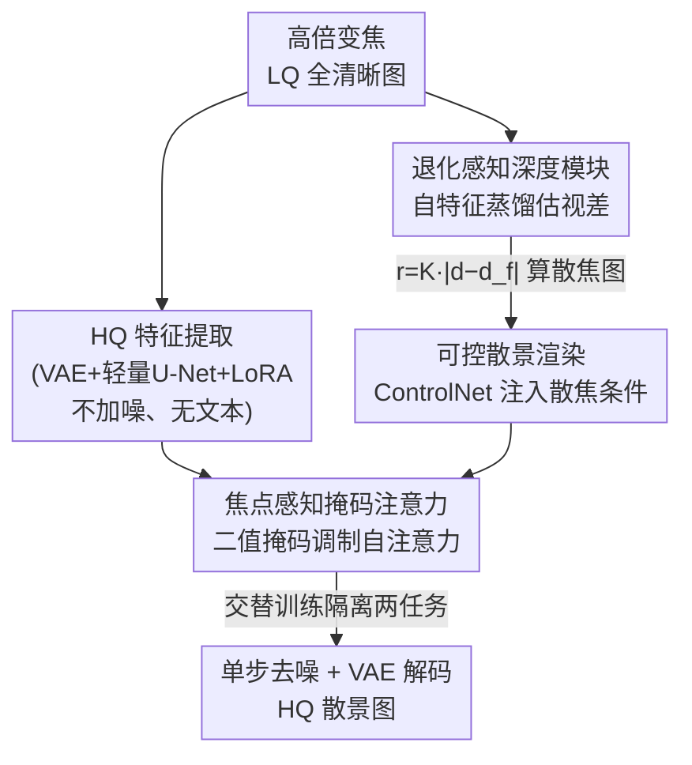

# Towards Photorealistic and Efficient Bokeh Rendering via Diffusion Framework

**会议**: CVPR 2026  
**arXiv**: [2605.07429](https://arxiv.org/abs/2605.07429)  
**代码**: 有（论文称 code and models available，链接待确认）  
**领域**: 扩散模型 / 计算摄影 / 图像生成  
**关键词**: 散景渲染、单步扩散、超分辨率、焦点感知注意力、深度估计

## 一句话总结
MagicBokeh 用一个单步扩散框架把"高倍数字变焦下的超分辨率"和"散景（虚化）渲染"统一在同一个模型里，通过交替训练策略 + 焦点感知掩码注意力解决两任务的优化冲突，再配一个退化感知深度模块从低质输入估出可靠视差图，在低分辨率真实手机照片上以 0.1s 级速度做出比"先超分再虚化"两阶段流水线更逼真的散景。

## 研究背景与动机
**领域现状**：手机受限于小光圈的紧凑光学设计，硬件上拍不出自然的大光圈虚化，所以散景靠计算摄影来"渲染"。现有散景渲染方法分两类：基于物理光学模型模拟光线散射（如 Dr.Bokeh、BokehMe），以及从大规模数据学习（如 MPIB、EBokehNet、BokehDiff）。它们都能产出视觉上还不错的虚化，也已落地手机。

**现有痛点**：这些方法有一个共同的隐含假设——输入是全清晰（all-in-focus）的高质量（HQ）图。可一旦把它们用在**手机高倍数字变焦**拍出来的照片上，输入本身就分辨率低、细节糊、噪声大，结果就出现噪声被放大、主体边界模糊、纹理合成不真实等问题；而且被虚化前那块"该清晰的焦内区域"自己就糊，整张照片的观感被拖垮。

**核心矛盾**：一个直觉的补救是搭两阶段流水线——先做真实场景超分（Real-ISR）把图修清楚，再做散景渲染。但这条路有两个硬伤：(1) Real-ISR 的输出不可能完美，它的误差会在后续散景渲染里被进一步放大，形成误差累积；(2) 两阶段要跑两次独立模型推理，效率差。本质矛盾是：**超分（要恢复焦内主体的高频细节）和散景（要把背景抹糊）是一对目标冲突的任务**，强行拼在一条链上既慢又互相伤害。

**切入角度**：作者注意到一个关键现象——扩散生成模型（如 Stable Diffusion）产出的图像里本身就**自带散景信息**，说明这类模型有"散景先验"；同时单步扩散在 Real-ISR 上已经很强。两件事合起来提示：能不能用一个统一的扩散框架，让超分和散景在同一个模型里一次性完成，既消掉误差累积又只跑一次推理？

**核心 idea**：把 Real-ISR 和散景渲染**统一进一个单步扩散模型**，用交替训练 + 焦点感知掩码注意力让两个目标冲突的任务在同一网络里互不打架，再用退化感知深度模块保证低质输入也能拿到靠谱的视差条件。

## 方法详解

### 整体框架
MagicBokeh 的输入是一张高倍变焦的低质（LQ）全清晰照片，输出是一张高质（HQ）的散景照片；整个网络基于 SD2.1，但做成**单步、无文本条件**的轻量扩散。框架分两大块：**HQ 特征提取**（把 LQ 图里的高频细节恢复出来，即内置的 Real-ISR）和**可控散景渲染**（在恢复出的特征上、按用户指定焦点把背景虚化）。

一张图怎么走完全程：LQ 图**不加噪**直接喂进 HQ 特征提取模块（VAE 编码器 + 裁剪过的轻量 U-Net，都注入 LoRA）；与此同时，退化感知深度模块从这张 LQ 图估出视差图，按散景物理公式算出 defocus map（散焦图，逐像素的模糊半径），作为 ControlNet 的结构条件注入；U-Net 的自注意力层再被焦点感知掩码注意力按"焦内/焦外"二值掩码调制，让超分只管焦内主体、散景只管焦外背景；单步去噪后经 VAE 解码出最终散景图。

之所以能把两个冲突任务塞进一个网络而不打架，关键在训练侧：用**交替训练策略**把超分和散景拆成两个相位轮流训，每个相位只解冻各自的 LoRA，彼此参数隔离。下图按"自上而下 = 推理时数据流动顺序"画出四个贡献组件如何串联：

### 关键设计

**1. 统一单步扩散框架：一个模型同时做超分和散景，消掉两阶段的误差累积与二次推理**

针对"两阶段先超分再虚化"的误差累积 + 低效痛点，作者把 Real-ISR 直接吸进散景渲染管线。具体做法上有三个为效率服务的取舍：其一，LQ 图**不加噪声**直接当输入——近期扩散 ISR 工作发现，几乎不加噪能消掉随机采样带来的不确定性、最大程度保住语义内容，于是这里完全不引入噪声，只靠注入 VAE 编码器和 U-Net 的 LoRA 微调来恢复 HQ 特征；其二，因为观察到文本提示在"提取 HQ 特征"上收益有限却带来大量算力开销，作者把文本编码器和所有 cross-attention 层都删了，做成**无 prompt 依赖**；其三，参照已有工作把 U-Net 的整个 mid-stage 模块也剪掉（block pruning），在几乎不损感知质量的前提下显著提速。最终单张 512×512 推理只要 0.1062s，比两阶段方法（动辄 0.3–3s）快一个量级。

**2. 交替训练策略：把目标冲突的超分与散景拆成两相位轮流训，参数隔离破解互相伤害**

如果直接端到端地在"LQ-HQ 散景配对数据"上联合训，作者观察到主体区域的超分质量明显退化——因为 Real-ISR（恢复焦内高频）和散景渲染（抹糊焦外）目标本就冲突，加上两任务训练样本不均衡，网络会偏向其中一个而牺牲另一个。解决办法是把训练解耦成循环交替的两相位，并在进入交替前先做一次超分预训练给网络一个强的 Real-ISR 起点。**散景相位**：用 LQ 全清晰图作输入、散焦图作条件去生成 HQ 散景图，此时冻住原始扩散模型和已预训练的 HQ 特征提取模型，**只训** ControlNet 和焦点感知掩码注意力里的 bokeh LoRA；**Real-ISR 相位**：换成 LQ-HQ 配对图，把散焦图设成**全零**（代表全清晰条件），**只训** U-Net 里的 SR LoRA。两相位交替进行，靠"各自只解冻各自的 LoRA"实现参数级隔离，从而显著降低任务间干扰。

**3. 焦点感知掩码注意力：用焦点线索调制自注意力，让焦内和焦外在注意力层就被切开**

即便有交替训练缓解冲突，把散景条件直接塞进生成过程仍会损伤焦内区域的恢复质量，细节上还残留错误的控制。作者利用 SD 自注意力层负责维持全局一致性、且适当调制自注意力能增强可控性这一点，用从散焦图得到的焦点线索去调制注意力图：

$$\text{Attention}=\text{softmax}\!\left(\frac{\mathbf{Q}\mathbf{K}^{\top}+\mathcal{M}}{\sqrt{d}}\right)\mathbf{V}$$

其中焦点注意力掩码 $\mathcal{M}_{(x,y)}=0$ 当二值掩码 $\mathbf{M}_{(x,y)}=1$，否则为 $-\infty$。这里 $\mathbf{M}$ 是把散焦图里焦区主体信息抽出、再对"同区/异区"做二值化得到的（同区为 1、异区为 0），并 resize 到注意力层所需分辨率。其效果是：把视差图切成"前景焦内 / 背景焦外"两块，约束自注意力**只在各自区域内部**运作——ISR 分量被引导去优先重建焦内主体，散景分量被引导去强化背景虚化，两者在注意力层就被干净地分开。注意在 Real-ISR 相位里 $\mathcal{M}$ 被设为 0，让网络去恢复整张图。

**4. 退化感知深度模块：自特征蒸馏让深度网络对低质图也估得准，给散景一个可靠的条件**

散景渲染靠散焦图驱动，而散焦图由视差/深度算出：$r=K\,|d-d_f|$，其中 $d$ 是像素视差、$d_f$ 是用户指定焦点位置的视差、$K$ 控制模糊强度、$r$ 是该像素的模糊半径。问题在于：深度估计模型（Depth Anything v2）在 HQ 图上很强，一遇到 LQ 图精度就急剧下滑，错误的视差会直接污染散景结果。作者提出一个**自特征蒸馏**框架：teacher 和 student 都用预训练 Depth Anything v2 初始化，训练时把 HQ 图喂 teacher、对应的模拟退化图喂 student，通过编码器特征蒸馏 + 输出监督，逼 student 在低质输入上也产出和 HQ 一致的特征与深度，从而能直接从原始 LQ 输入估出鲁棒视差图（对比方法只能在超分之后再用 Depth Anything v2 估深度）。

### 损失函数 / 训练策略
HQ 特征提取阶段用 L2 损失 + LPIPS 损失监督。整体采用上面的两相位交替训练：先在 LSDIR + 1 万张 FFHQ 人脸上做超分预训练（学习率 5e-5，AdamW），HQ 散景 GT 由作者自建的基于光线追踪的真实薄透镜渲染器生成，LQ-HQ 配对用 Real-ESRGAN 退化管线合成、上采样到 512×512。交替阶段：散景相位学习率 5e-5，Real-ISR 相位学习率 5e-6；外加随机水平翻转增广。整个训练约在 4 张 NVIDIA L40 上跑 20 小时。退化感知深度模块单独蒸馏：用 SA-1B 的 20 万子集 + Real-ESRGAN 退化合成 LQ-HQ 对训练。

## 实验关键数据

### 主实验
在 EBB400-LQ 基准上评测（从 EBB400 随机取 400 对、手工标注焦区、用 Real-ESRGAN 模拟退化得到高倍变焦场景）。对比对象是"两阶段"SOTA：超分用 OSEDiff(*) / S3Diff(+)，散景用 BokehMe / Dr.Bokeh / BokehDiff。推理时间在 L40s 上、512×512 输入测得。

| 方法 | PSNR ↑ | SSIM ↑ | LPIPS ↓ | DISTS ↓ | MUSIQ ↑ | MANIQA ↑ | FID ↓ | Time(s) ↓ |
|------|--------|--------|---------|---------|---------|----------|-------|-----------|
| BokehMe* | 23.51 | 0.8459 | 0.3106 | 0.1666 | 57.70 | 0.4219 | 72.98 | 0.1648 |
| Dr.Bokeh* | 23.39 | 0.8488 | 0.3132 | 0.1677 | 52.40 | 0.3934 | 73.38 | 2.4021 |
| BokehDiff* | 23.65 | 0.8459 | 0.3049 | 0.1713 | 59.24 | 0.4251 | 72.65 | 0.3376 |
| BokehMe+ | 23.75 | 0.8388 | 0.3138 | 0.1606 | 57.54 | 0.4137 | 72.25 | 0.7510 |
| Dr.Bokeh+ | 23.67 | 0.8430 | 0.3134 | 0.1687 | 52.63 | 0.3876 | 73.10 | 2.9883 |
| BokehDiff+ | 23.83 | 0.8397 | 0.3071 | 0.1735 | 59.36 | 0.4259 | 72.54 | 0.9238 |
| **MagicBokeh** | **24.23** | **0.8623** | **0.2786** | **0.1600** | 58.83 | 0.4138 | 72.43 | **0.1062** |

MagicBokeh 在 PSNR / SSIM / LPIPS / DISTS 这些保真度指标上全面领先，且推理时间 0.1062s 是所有方法里最快的（比第二快的 BokehMe* 还快、比 Dr.Bokeh 系列快约 20–28 倍）。作者解释自己在少数无参考指标（MUSIQ/MANIQA）上略逊于 BokehDiff，是因为 BokehDiff 在 EBB400-LQ 上焦点分布估错、本该虚化的区域仍保持清晰，反而刷高了这类指标，但并不代表真实的散景效果——定性图（Fig. 3）显示 MagicBokeh 更可信。

**真实世界用户研究**：用 iPhone 13 Pro 在 5×–15× 高倍变焦下采集 50 张真实 LQ 图（平均 4032×3024，含人像/风景/室内外多场景），50 名背景各异的参与者从各方法结果中选最佳。MagicBokeh 的人类偏好得分明显高于其他两阶段方法（Fig. 4）。

### 消融实验
在 EBB400-LQ 上逐组件消融：FAMA = 焦点感知掩码注意力，Strategy = 交替训练策略，DA depth = 退化感知深度模块。

| FAMA | Strategy | DA depth | PSNR ↑ | LPIPS ↓ | CLIP-IQA ↑ | NIQE ↓ | MUSIQ ↑ | MANIQA ↑ | FID ↓ |
|------|----------|----------|--------|---------|------------|--------|---------|----------|-------|
| ✗ | ✗ | ✗ | 24.21 | 0.2931 | 0.3743 | 6.0786 | 57.41 | 0.4038 | 73.25 |
| ✗ | ✓ | ✓ | 24.22 | 0.2798 | 0.4157 | 5.9068 | 58.10 | 0.4065 | 75.23 |
| ✓ | ✗ | ✓ | 24.20 | 0.2946 | 0.3781 | 5.7076 | 56.08 | 0.3956 | 73.04 |
| ✓ | ✓ | ✗ | 24.20 | 0.2784 | 0.4209 | 5.8035 | 58.80 | 0.4114 | 75.03 |
| **✓** | **✓** | **✓** | 24.23 | 0.2786 | **0.4229** | **5.6341** | **58.83** | **0.4138** | **72.43** |

### 关键发现
- **PSNR 几乎不动、但无参考/感知指标差异显著**：各配置 PSNR 都在 24.2 上下，说明散景任务的好坏主要体现在 CLIP-IQA / NIQE / MUSIQ / MANIQA / FID 这些反映真实感与美学的指标上，而非像素级保真度。
- **交替训练策略贡献最大**：去掉 Strategy（第 3 行，✓✗✓）后 CLIP-IQA 从 0.4229 跌到 0.3781、MUSIQ 从 58.83 跌到 56.08、LPIPS 从 0.2786 升到 0.2946，是三组件里掉点最狠的——印证"两任务目标冲突、必须靠相位隔离解耦"是核心。
- **FAMA 决定焦内/焦外解耦**：去掉 FAMA（第 2 行，✗✓✓）虽 PSNR 与全模型只差一点，但无参考指标明显变差、FID 反升到 75.23，说明它对"把焦内主体从焦外区域干净切开"不可或缺。
- **DA depth 主要体现在定性**：去掉 DA depth（第 4 行）量化差异不大，但定性图里 LQ 输入的深度估计更准、散景过渡更自然，证明它在真实低质场景才显价值。
- **额外应用——重对焦**：方法天然能泛化到 refocusing，对部分失焦/多主体照片可把焦点从前景（咖啡杯）平滑切到背景（椅子），过渡平滑（Fig. 6）。

## 亮点与洞察
- **"统一替代两阶段"的范式价值**：把超分和散景塞进同一个单步扩散，既消掉两阶段的误差累积，又把推理从两次降到一次（0.1s），这套"用统一模型 + 任务隔离训练替代串行流水线"的思路可迁移到任何"先修复再编辑"的图像任务（如先去噪再风格化、先去模糊再上色）。
- **"目标冲突就在训练侧隔离参数"很务实**：不是去设计复杂的多任务损失平衡，而是用交替相位 + 各自 LoRA 把冲突任务的参数物理隔开，简单且有效——这是处理"一个网络两个对立目标"的可复用 trick。
- **注意力掩码当"任务路由器"**：用焦点二值掩码把自注意力切成焦内/焦外两块，相当于在注意力层做了空间级的任务分工，既不增加参数又强可控，思路巧妙。
- **退化感知深度的自蒸馏**：teacher 吃 HQ、student 吃退化图、逼特征一致，把深度模型从"只在 HQ 上能用"拽到"LQ 上也鲁棒"，是给条件式生成补"可靠条件"的通用范式。
- **诚实的指标解读**：作者主动指出自己在 MUSIQ/MANIQA 上输给 BokehDiff 是因为对方焦点估错刷高了无参考分，提醒读者无参考指标在散景任务里会被"不该清晰却清晰"误导。

## 局限与展望
- **依赖合成退化**：训练用 Real-ESRGAN 合成 LQ-HQ 对，作者自己也承认合成退化无法覆盖真实手机摄影的复杂伪影（混合传感器电路噪声、手持运动模糊、数字变焦的有损压缩），真实场景只能靠用户研究而非定量指标验证。
- **散景模型偏简化**：散焦半径用 $r=K|d-d_f|$ 这种基于视差的简单线性模型，且 HQ 散景 GT 来自自建薄透镜光追渲染器，可能与真实镜头的散景光斑形状/口径蚀等光学特性有差距。
- **深度仍是瓶颈**：散景质量高度依赖视差准确度，DA depth 虽改善但定量提升有限；在深度本身就难估的复杂遮挡/透明物体场景，效果可能受限。
- **改进思路**：可引入真实采集的 LQ-HQ 散景对做微调、把散景物理模型升级到带光斑形状的可学习核、或把深度模块与主网络端到端联合优化以减少级联误差。

## 相关工作与启发
- **vs BokehDiff / BokehMe / Dr.Bokeh（散景渲染）**：它们都假设输入是 HQ 全清晰图，面对高倍变焦的 LQ 输入会放大噪声、糊边界；本文专攻 LQ 输入、并把超分内置进来，区别是"统一框架 + 退化鲁棒"，在 LQ 场景保真度与速度全面占优。
- **vs OSEDiff / S3Diff（单步 Real-ISR）+ 散景的两阶段拼装**：两阶段要跑两次推理且误差累积，本文一次推理完成，效率与质量都更好；同时本文虽无文本条件，单论 Real-ISR 也能与这些单步方法相当。
- **vs AnytoBokeh（单步扩散视频散景）**：同为单步扩散散景，但 AnytoBokeh 面向视频时序一致、用 MPI 表示与渐进训练；本文面向高倍变焦静态图、核心是"超分-散景统一 + 任务冲突解耦"。
- **启发**：ControlNet 注入散焦条件 + 焦点掩码调制注意力，提供了"用空间结构条件 + 注意力掩码做区域级可控生成"的模板，可用于任何需要"图内不同区域执行不同生成目标"的任务。

## 评分
- 新颖性: ⭐⭐⭐⭐ 把超分与散景统一进单步扩散、用交替训练 + 焦点掩码注意力解冲突，是 LQ 高倍变焦散景这一具体场景的扎实创新（组件本身多为已有技术的巧妙组合）。
- 实验充分度: ⭐⭐⭐⭐ 合成基准 + 50 人真实用户研究 + 逐组件消融 + 重对焦应用，较全面；但真实场景仅靠用户研究、缺真实 LQ-HQ 散景对的定量评测。
- 写作质量: ⭐⭐⭐⭐ 动机链条清晰、公式与图配套，对自身指标劣势的解释也诚实。
- 价值: ⭐⭐⭐⭐ 直击手机高倍变焦虚化的真实落地痛点，0.1s 推理 + 移动友好的轻量化设计有很强工程价值。

<!-- RELATED:START -->

## 相关论文

- [\[CVPR 2026\] IntroSVG: Learning from Rendering Feedback for Text-to-SVG Generation via an Introspective Generator-Critic Framework](introsvg_learning_from_rendering_feedback_for_text-to-svg_generation_via_an_intr.md)
- [\[CVPR 2026\] RenderFlow: Single-Step Neural Rendering via Flow Matching](renderflow_single-step_neural_rendering_via_flow_matching.md)
- [\[CVPR 2026\] Ani3DHuman: Photorealistic 3D Human Animation with Self-guided Stochastic Sampling](ani3dhuman_photorealistic_3d_human_animation_with_self-guided_stochastic_samplin.md)
- [\[CVPR 2025\] EasyCraft: A Robust and Efficient Framework for Automatic Avatar Crafting](../../CVPR2025/image_generation/easycraft_a_robust_and_efficient_framework_for_automatic_avatar_crafting.md)
- [\[CVPR 2026\] Reviving ConvNeXt for Efficient Convolutional Diffusion Models](reviving_convnext_for_efficient_convolutional_diffusion_models.md)

<!-- RELATED:END -->
