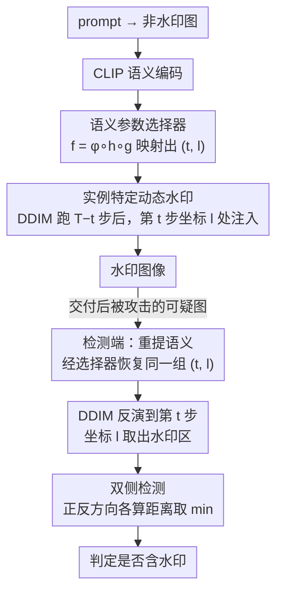

# Towards Robust Content Watermarking Against Removal and Forgery Attacks

**会议**: CVPR 2026 Findings  
**arXiv**: [2604.06662](https://arxiv.org/abs/2604.06662)  
**代码**: 无  
**领域**: 图像生成 / 数字水印  
**关键词**: 内容水印, 扩散模型, 去除攻击, 伪造攻击, 实例特定水印

## 一句话总结

提出实例特定双侧检测水印方法 ISTS，通过根据图像语义动态选择水印注入时间和位置来抵抗去除攻击和伪造攻击，并设计双侧检测机制抵御反向潜在表示攻击，在三种去除攻击和三种伪造攻击的平均和最坏情况下均达到 SOTA 鲁棒性。

## 研究背景与动机

1. **领域现状**：内容水印（如 Tree-Ring）在文本到图像扩散模型中被广泛研究，通过在生成过程中将身份标记嵌入潜在空间来验证图像来源。这些方法对常见图像变换（旋转、裁剪、压缩等）具有良好鲁棒性。
2. **现有痛点**：最近研究（Müller et al., Yang et al., Jain et al.）揭示现有水印在去除攻击和伪造攻击下极其脆弱——去除后检测 AUC 降至 0.1 以下（如 Gaussian-Shading），伪造后 AUC 接近 1.0（轻松伪造水印）。这意味着水印既可被抹除也可被伪造，严重威胁版权保护可靠性。
3. **核心矛盾**：现有方法使用静态、单一类型的水印模式（如 Tree-Ring 固定在傅里叶空间中心注入环形图案），这种一致性无意中泄露了水印的结构特征，使攻击者可以利用代理模型提取/复制水印。
4. **本文目标**：如何设计一种对去除攻击和伪造攻击都具有鲁棒性的水印方案？
5. **切入角度**：关键洞察是"静态水印 = 信息泄露"。如果每张图像的水印模式和注入参数都不同，攻击者就无法从单张或少量参考图像中提取通用水印特征。
6. **核心idea**：实例特定的动态水印（基于语义选择注入时间和位置）+ 双侧检测（同时检查正反潜在表示，封堵反向优化攻击路径）。

## 方法详解

### 整体框架

ISTS 想解决的核心问题是：现有水印之所以又能被抹掉又能被伪造，根子在于它对所有图像用同一套固定模式（如 Tree-Ring 永远在频域中心放同一个环）。这种一致性本身就是泄露——攻击者只要见过几张水印图，就能反推出通用模式。ISTS 的破解思路是让每张图的水印都长得不一样，且检测时还能精确对回去。

整条流水线分生成和检测两段，对称地围绕一对参数 $(t, l)$（注入的时间步和频域坐标）展开。生成时先用 prompt 跑一张普通的非水印图像，用 CLIP 把它编码成语义向量，再喂给一个预训练好的选择器映射出这张图专属的 $(t, l)$；然后正常跑前 $T-t$ 步 DDIM 去噪，在第 $t$ 步的频域坐标 $l$ 处把水印注入进去，最后跑完剩余去噪得到水印图。检测时反着走：对可疑图同样提语义特征、恢复出 $(t, l)$，把图像 DDIM 反演回第 $t$ 步、在坐标 $l$ 处取出水印区域，最后用双侧检测判定它到底带不带水印。关键在于水印注入几乎不改变图像语义，所以检测端从可疑图恢复出的 $(t, l)$ 能和生成端高度一致，整套动态机制才对得上号。

### 关键设计

**1. 语义参数选择器：建立从图像语义到 $(t, l)$ 的确定性映射，让生成与检测能对回同一组参数**

整套动态机制能成立的前提是：同一张图在生成端和检测端必须映射到**完全相同**的参数，因此这个映射必须是确定性的，它也是后面动态注入和双侧检测共用的入口。ISTS 把它拆成一条可复现的链路 $f = \phi \circ h \circ g$：$g$ 是 CLIP 编码器，把非水印图提成特征向量；$h$ 是在特征上训练的分类器；$\phi$ 是预定义的取模映射，把类别标签换算成具体的 $(t, l)$。训练时先从 prompt 集合批量生成非水印图，用 CLIP 提特征，再 K-Means 聚成 $N$ 个类别——聚类天然把语义相近的图归到同一参数组，这正是检测端能稳定恢复参数的来源；随后用类别标签训练分类器 $h$，把"特征→类别"这一步学成可推断的函数。最终任意一张图进来，沿 $g\to h\to\phi$ 走一遍就得到它专属、且可在检测端复现的注入参数。

**2. 实例特定动态水印：让每张图的水印模式与注入位置都不同，掐断"提取通用模式"的攻击路径**

静态水印最致命的漏洞是可复用：攻击者拿一张参考图就能提出水印模式去伪造（Müller et al.），或把多张水印图一平均就显出共同结构（Yang et al.）。ISTS 用上一步选择器给出的 $(t, l)$，把"水印长什么样、藏在哪一步、藏在频域哪个位置"全部绑定到图像自身的语义上——同一个选择器对不同语义的图给出不同的 $(t, l)$。这样动态模式让"从参考图提模式"失效，因为每张图的模式都不一样；动态时间步让基于梯度的优化攻击也找不准方向，因为攻击者无从知道水印究竟注在哪一步。多张图取平均时，本就各异的水印特征相互抵消，平均法随之崩溃。能这么做的物理前提是：水印对语义的扰动极小，水印图和它对应的非水印图在 CLIP 空间里几乎重合，所以检测端不需要原图也能恢复出同一组参数。

**3. 双侧检测：封堵"把潜在表示推向水印反方向"这条去除攻击的路**

传统检测只看一个方向，度量水印 $W$ 与反演潜在表示之间的单边距离：

$$d = \frac{1}{|M|} \sum_{i \in M} |W_i - \mathcal{F}(z_T)_i|$$

Müller et al. 的去除攻击正是钻这个空子——它不去抹掉水印，而是把潜在表示优化到水印的**反方向**，让单边距离变大、检测失败。ISTS 的对策是把度量对称化，正反两个方向各算一次、取较小值：

$$d = \min\Big\{\tfrac{1}{|M|}\textstyle\sum_i |W_i - \mathcal{F}(z_T)_i|,\ \tfrac{1}{|M|}\textstyle\sum_i |W_i + \mathcal{F}(z_T)_i|\Big\}$$

对非水印图，其潜在表示服从标准高斯分布，符号翻转不改变分布，两个方向的距离统计上一致、检测度量不变，因此不会误判；对水印图，无论攻击者把它推向正向还是反向，总有一侧能命中。代价仅仅是多算一次距离再取 min，几乎零额外开销，却堵死了整条反向优化攻击面。

### 一个完整示例

以一张"雪山日落"图为例，看动态参数和双侧检测怎么协同。生成端先用 prompt 跑出非水印图，CLIP 把它编码后经选择器落到第 3 号语义簇，$\phi$ 把 3 号换算成 $(t{=}25, l{=}\text{坐标A})$；于是 DDIM 在第 25 步、频域坐标 A 处注入水印，完成去噪交付。攻击者拿到这张图想去除水印，照搬 Müller et al. 的套路把潜在表示朝水印反方向优化——单边距离确实被推大了，但 ISTS 检测时正反各算一次取 min，反方向那一侧立刻命中，水印仍被检出。攻击者若改去伪造，需要先知道水印模式，但他手上另一张"城市夜景"图落在 7 号簇、参数是 $(t{=}40, l{=}\text{坐标B})$，两张图的模式和位置全不同，平均或复制都提不出可用模式。检测端对这张可疑"雪山日落"图重新提语义特征，因为水印几乎没动语义，仍稳稳落回 3 号簇、恢复出同一组 $(25, \text{A})$，反演到第 25 步、坐标 A 处取出水印区域完成判定——动态化挡住伪造、双侧化挡住去除，两条攻击路径同时失效。

### 损失函数 / 训练策略

唯一需要训练的是参数选择器，且只需一次 K-Means 聚类加一个简单分类器，水印注入与检测本身不引入任何额外训练，直接复用预训练扩散模型。实验用 Stable-Diffusion-2-1-base，对抗攻击场景用 100 对图像评估，非对抗场景用 1000 对评估。

## 实验关键数据

### 主实验（去除攻击鲁棒性）

| 水印方法 | 原始 AUC | Imp-Removal | Avg-Removal | 平均 AUC | 最坏 AUC |
|---------|----------|-------------|-------------|---------|---------|
| Tree-Ring | 1.000 | 0.267 | 0.527 | 0.589 | 0.267 |
| Gaussian-Shading | 1.000 | 0.000 | 0.371 | 0.457 | 0.000 |
| ROBIN | 1.000 | 0.082 | 0.742 | 0.595 | 0.082 |
| SEAL | 1.000 | 0.508 | 0.959 | 0.752 | 0.508 |
| **ISTS (Ours)** | 1.000 | **0.821** | **0.990** | **0.936** | **0.821** |

### 消融实验

| 配置 | Imp-Removal AUC | Imp-Forgery AUC | 说明 |
|------|----------------|-----------------|------|
| 完整 ISTS | **0.821** | **0.634** | 三个组件协同 |
| w/o 动态模式 | 0.71 左右 | 0.72 | 固定模式易被伪造 |
| w/o 动态时间步 | 降低 | 降低 | 梯度攻击可追溯 |
| w/o 双侧检测 | 0.71 左右 | 持平 | 反向潜在攻击有效 |

### 关键发现

- **Imp-Removal 是最强去除攻击**：几乎所有现有方法 AUC 降至 0.7 以下，ISTS 仍保持 0.821（提升 20%+）
- **伪造攻击下 ISTS 最优**：平均 AUC 0.686（越低越好），最坏情况 0.949，均优于所有基线
- **动态模式对抗伪造贡献最大**：去掉后 Imp-Forgery AUC 从 0.62 升至 0.72（更易被伪造）
- **双侧检测对抗去除贡献最大**：去掉后 Imp-Removal AUC 从 0.82 降至 ~0.71
- **图像质量无损**：PSNR、SSIM、LPIPS 与 ROBIN（最佳质量基线）相当，CLIP-Score 保持一致
- **常规图像变换鲁棒性**：平均 AUC 0.974（vs Tree-Ring 0.975），最坏情况 0.933（vs Tree-Ring 0.928），与最佳基线持平

## 亮点与洞察

- **"静态=泄露"的深刻洞察**：虽然黑盒攻击者名义上不知道水印算法，但静态水印的一致性模式实际上赋予了攻击者额外先验。这个观察揭示了安全设计中"实现细节可成为侧信道"的通用原理。
- **双侧检测的极简优雅**：仅需多算一次距离取 min（几乎零额外开销），就封堵了反向优化攻击路径。这种"对称化检测度量"的思路对其他基于距离的安全检测方案也有借鉴价值。
- **语义一致性保证检测可靠性**：利用水印注入对图像语义影响极小这一物理特性，确保从水印图像中恢复的参数与生成时一致。这是将对抗鲁棒性与功能正确性解耦的巧妙设计。

## 局限与展望

- 需要为每张图像先生成一张非水印版本来提取语义特征，使生成成本翻倍
- 参数选择器依赖 CLIP 语义一致性假设，极端图像编辑后可能打破这一假设
- 仅在 Stable-Diffusion-2-1-base 上验证，未测试 SDXL、FLUX 等更新模型
- K-Means 聚类数 $N$ 和参数映射 $\phi$ 的选择缺乏理论指导
- 评估使用 100 对图像，样本量偏小，统计显著性可能受限
- 可探索自适应动态策略（如根据攻击检测信号调整后续水印参数）

## 相关工作与启发

- **vs Tree-Ring**: Tree-Ring 在频域中心注入固定环形图案，静态模式在三种去除攻击下 AUC 降至 0.267-0.527；ISTS 动态化后保持 0.821-0.990
- **vs SEAL**: SEAL 使用 SimHash 控制去噪随机性，对伪造有一定抵抗（AUC 0.703），但对图像旋转、模糊、裁剪等常规变换极其脆弱（最坏 AUC 0.523）；ISTS 兼顾对抗攻击和常规鲁棒性
- **vs RingID**: RingID 常规鲁棒性极佳（最坏 AUC 0.953），但伪造攻击下几乎完全失效（Imp-Forgery AUC=1.0）；ISTS 在两方面均有保障

## 评分

- 新颖性: ⭐⭐⭐⭐ 实例特定水印+双侧检测的组合有效解决了现有水印的根本脆弱性，思路清晰且有理论支撑
- 实验充分度: ⭐⭐⭐⭐ 覆盖三种去除+三种伪造攻击+六种图像变换，平均/最坏情况分析全面；但样本量偏小且模型单一
- 写作质量: ⭐⭐⭐⭐ 问题定义和方法动机阐述清晰，算法伪代码规范，威胁模型严谨
- 价值: ⭐⭐⭐⭐ 首次系统性地解决内容水印的去除+伪造双重威胁，对生成式 AI 的版权保护有实际意义

<!-- RELATED:START -->

## 相关论文

- [\[CVPR 2026\] Rel-Zero: Harnessing Patch-Pair Invariance for Robust Zero-Watermarking Against AI Editing](rel-zero_harnessing_patch-pair_invariance_for_robust_zero-watermarking_against_a.md)
- [\[ECCV 2024\] Robust-Wide: Robust Watermarking against Instruction-driven Image Editing](../../ECCV2024/image_generation/robust-wide_robust_watermarking_against_instruction-driven_image_editing.md)
- [\[CVPR 2026\] SPDMark: Selective Parameter Displacement for Robust Video Watermarking](spdmark_selective_parameter_displacement_for_robust_video_watermarking.md)
- [\[CVPR 2026\] Editing Away the Evidence: Diffusion-Based Image Manipulation and the Failure Modes of Robust Watermarking](editing_away_the_evidence_diffusion-based_image_manipulation_and_the_failure_mod.md)
- [\[AAAI 2026\] Creating Blank Canvas Against AI-Enabled Image Forgery](../../AAAI2026/image_generation/creating_blank_canvas_against_ai-enabled_image_forgery.md)

<!-- RELATED:END -->
