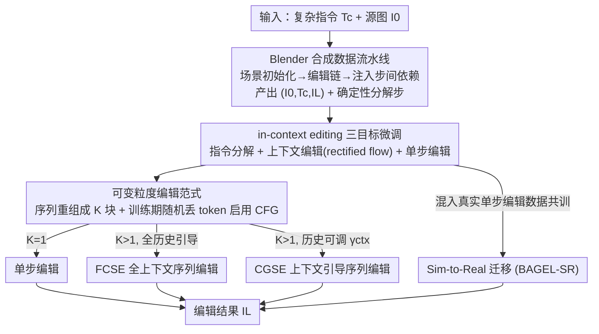

# Towards Robust Sequential Decomposition for Complex Image Editing

**会议**: CVPR 2026  
**arXiv**: [2605.09233](https://arxiv.org/abs/2605.09233)  
**代码**: 待确认  
**领域**: 图像编辑 / 扩散模型 / 多模态统一模型  
**关键词**: 复杂指令编辑、序列分解、in-context editing、合成数据、sim-to-real

## 一句话总结
针对"一条指令里塞了多个编辑操作还互相依赖"的复杂图像编辑，本文把"序列分解"放进 in-context editing 框架里研究，用 Blender 合成出带分解标注的高质量编辑链来微调 BAGEL，并设计了一个能调节"历史编辑结果影响力"的 Context-Guided Sequential Editing 范式，使得分解步数越多反而越稳，并能通过和真实数据共训迁移到真实图像。

## 研究背景与动机
**领域现状**：指令引导的图像编辑已经能做到高保真，但绝大多数模型/数据集只针对**单一编辑类型**或**受限区域**，而真实需求往往是"移动 A、把 B 往前挪、在 C 附近加个 D、再把 E 换成 F"这种**组合式、多对象、还带先后依赖**的复杂指令。

**现有痛点**：处理复杂指令有两条朴素路线，但都不靠谱——

- **单步编辑（single-turn）**：一次性把所有编辑都做完。模型要同时"解析+执行"多个操作，经常漏编辑或编辑错对象（图 1 里 Gemini 2.5 Flash Image 就翻车）。
- **序列编辑（sequential）**：把复杂指令拆成简单子步逐个执行。直觉上更简单，但实践中**误差累积（compounding error）**非常严重——早期某一步的瑕疵会沿着后续步骤一路放大，最终保真度反而更差。

**核心矛盾**：序列分解的**好处（任务变简单）**和**坏处（误差累积）**之间存在 trade-off。零样本地"硬拆"复杂指令，多数 SOTA 模型不升反降——也就是说分解本身并不会自动带来收益。

**本文目标**：找到一个能让"分解的收益 > 误差累积的代价"的稳健方案，使得**分解步数增加时性能持续提升而不是崩**，并且能从受控环境迁移到真实图像。

**切入角度**：作者把序列编辑统一放进 **in-context editing 框架**——一个多模态模型在条件于"完整历史上下文（前面所有指令 + 中间图）"的情况下，交替生成"分解指令 + 对应编辑图"。这个统一视角的好处是：(1) 单个模型就能实现多种编辑范式，便于公平对比；(2) 每一步编辑都能看到丰富的历史上下文，使分解更"知情"、更能适应中间结果，也打开了更多可探索的范式空间。

**核心 idea**：与其纠结"要不要分解"，不如**学会高质量的分解 + 设计一个能调节历史影响力的推理范式**——用 Blender 合成出"确定性、零退化"的分解监督，再用一个可调系数 $\gamma_{ctx}$ 把"历史编辑结果"作为一个**独立可控的引导项**，从而在利用上下文和抑制误差累积之间自由权衡。

## 方法详解

### 整体框架
方法分三块：**合成数据生成 → in-context editing 框架下的三目标微调 → 推理时的多范式编辑（含 sim-to-real 共训）**。给定复杂指令 $T_c$ 和源图 $I_0$，框架顺序生成交替序列 $\langle T_c, I_0, T_1, I_1, \dots, T_L, I_L\rangle$，其中 $\{T_i\}$ 是分解出的子指令，$\{I_i\}_{i=1}^{L-1}$ 是中间编辑结果，$I_L$ 是最终输出。

由于真实图像上根本拿不到"每一步都准确无误"的分解监督，作者先在 Blender 里**程序化地造数据**：在一个随机初始化的房间场景上顺序施加原子编辑操作，初始渲染当源图、最终渲染当目标图、把各操作描述拼起来当复杂指令，而每一步的中间渲染天然就是一条**确定性、零退化**的分解链。拿这些数据微调统一模型 BAGEL 后，推理时通过往指令后面追加"分解块数 $K$"和不同的 CFG 组合，就能在同一个模型里切换三种编辑范式。最后再把合成数据和真实单步编辑数据混在一起共训，把分解能力迁移到真实域。

### 关键设计

**1. Blender 合成数据流水线 + 步间依赖注入：用确定性渲染换"零退化的分解监督"**

复杂编辑最致命的数据问题是：真实图像上没人能给你"每一步都标注准确"的高质量分解链——用现成编辑模型造数据，质量会被这些模型的失败模式封顶。作者干脆在 Blender 里造：给定一批 3D 资产和材质，程序化地搭一个空房间、随机贴地板/墙面纹理、用物理仿真把最多 $N=9$ 个物体无碰撞地摆进去，初始渲染即源图 $I_0$。然后采一条长度 $L$ 的编辑操作链 $\{T_i\}_{i=1}^L$（共 **10 种原子操作**，分三类：局部编辑 add/remove/replace/translate/rotate/resize/recolor/material、背景换纹理、视角变换 translate/tilt/pan/yaw），顺序施加后最终渲染当目标 $I_L$，每一步中间渲染当分解监督 $I_i$，复杂指令 $T_c = \mathrm{Concat}(\{T_i\}_{i=1}^L)$。因为每个操作都是**确定性**地改场景，分解链无论多长都不会像生成式数据那样逐步退化。

光把独立操作堆长并不算复杂——它们能并行执行，$L$ 再大任务也简单。于是作者注入**步间依赖（inter-step dependency）**，逼模型先推理依赖、再执行：(1) **操作引用**——后续指令不直接点名物体，而用它之前被怎么改过来指代（如"旋转过的那个物体"，而非"桌子"；注意只在整体复杂指令里这么写，分解指令里仍揭示真实标签）；(2) **位置引用**——专用于 add/translate，把目标位置指定为某物体**被移动之前**的原始位置（如"把书加到椅子原来的位置"）。链上每个非首操作以概率 $p_d$ 独立决定是否注入依赖。最终生成 60K 条朴素链 + 34K 条带依赖链，$L$ 从 3 到 17，$p_d=0.5$。

**2. in-context editing 框架下的三目标联合微调：让通用统一模型长出"分解"这项专门技能**

多模态统一模型（本文用 BAGEL）虽然原生支持交替生成多模态序列，但预训练目标是通用的，默认并不会"分解"。作者用三个目标联合微调把这项技能逼出来：

- **指令分解 $L_D$**：给定复杂指令 $T_c$、源图 $I_0$ 和所有中间图，自回归地预测相邻两图之间的分解子指令：
$$L_D = -\sum_i \sum_j \log p_\theta\big(T_{i,j} \mid T_{i,<j}, T_{<i}, I_{<i}, T_c\big)$$
- **上下文编辑 $L_{ICE}$**：以 rectified flow（整流流）目标在中间图和目标图上训练速度预测网络 $v_\theta$：
$$L_{ICE} = \mathbb{E}_{t, X_0, X_1}\big[\,\|(X_1 - X_0) - v_\theta(X_t, t, c)\|^2\,\big]$$
其中 $X_1$ 是干净 VAE token，$X_0\sim\mathcal{N}(0,I)$，$X_t = tX_1 + (1-t)X_0$ 是线性插值得到的带噪潜变量，多模态上下文 $c = \{I_{<i}, T_{\le i}\}$。**关键的解耦设计**：这一项的上下文里**故意不放整体复杂指令 $T_c$**，让生成模块只依据分解后的子指令编辑，不被复杂指令干扰。
- **单步编辑**：同样用 $L_{ICE}$ 形式，但 $c = (I_0, T_c)$，即直接从 $I_0$ 一步编辑到 $I_L$，保留单步编辑能力。

**3. 可变粒度编辑范式：把"历史编辑结果"做成一个可调强度的独立引导项（FCSE → CGSE）**

为了让推理时分解粒度可调，训练时把序列 $\{(T_i,I_i)\}_{i=1}^L$ 随机重组成 $K$ 块（$1\le K\le L$），每块拼接 $l$ 条子指令只保留最后一张图 $I_{j+l-1}$、丢掉中间图；把 $K$ 追加到 $T_c$ 后面让模型按需分解。$K=1$ 退化为单步编辑，$K=L$ 是原始全分解。训练时还**随机丢弃上下文里的文本/干净图 token** 以启用 classifier-free guidance（CFG）。由此衍生两种序列范式：

- **FCSE（全上下文序列编辑）**：生成 $I_i$ 时固定历史序列 $\{T_{<i}, I_{<i-1}\}$，再分别用当前子指令 $T_i$ 和上一张结果 $I_{i-1}$ 算引导，强调"当前指令"和"上一步结果"的影响：
$$v_{\text{FCSE}} = v_\theta(X_t,t,\{T_{<i},I_{<i-1}\}) + \gamma_I\big(v_\theta(X_t,t,\{T_{<i},I_{<i}\}) - v_\theta(X_t,t,\{T_{<i},I_{<i-1}\})\big) + \gamma_T\big(v_\theta(X_t,t,\{T_{\le i},I_{<i}\}) - v_\theta(X_t,t,\{T_{<i},I_{<i}\})\big)$$
FCSE 的问题是：历史结果是**绑死在条件里**的，前面步骤的误差会顺着序列累积。

- **CGSE（上下文引导序列编辑）**：核心改进是把"历史编辑结果"**从条件里剥出来**，单独做成一个强度可调（系数 $\gamma_{ctx}$）的引导项。先用源图 $I_0$ 和分解指令 $\{T_j\}_{j=1}^i$ 算一个"直接从 $I_0$ 编到 $I_i$"的速度 $v_d$（标准 CFG），再在其上叠加"上下文引导"：
$$v_{\text{CGSE}} = v_d + \gamma_{ctx}\big(v_\theta(X_t,t,I_0,\{T_j\}_{j=1}^i,\{I_j\}_{j=m}^n) - v_d\big), \quad m\le n < i$$
其中引导上下文 $\{I_j\}_{j=m}^n$ 可任意选——可以用全部历史，也可以只用上一张 $I_{i-1}$（实现中正是只取上一步结果以抑制累积误差）。**为什么有效**：$\gamma_{ctx}$ 直接当成一个"历史影响力旋钮"，让作者在"历史上下文带来的辅助"和"历史带来的误差"之间显式权衡——这正是本文要的那个 trade-off 控制器，也是 CGSE 比 FCSE 更稳、分解步数加多了也不崩的根因。

**4. Sim-to-Real 共训：用合成分解监督换真实域的"细节保持"能力**

只在合成数据上微调，模型只会编合成场景；只在真实单步数据上微调，又没有分解监督。作者把**合成编辑序列（带分解标注）+ 真实单步编辑对（Pico-Banana）**混在一起微调 BAGEL 仅 1000 步（BAGEL 本身已在大规模真实数据上预训练）。结果是合成数据提供了**密集的"保持未编辑区域不变"的监督信号**，这种 identity preservation 能力能迁移到真实编辑上——配合 CGSE，真实复杂编辑的指令遵循和身份保持都提升。

### 损失函数 / 训练策略
总训练目标 = 指令分解 $L_D$ + 上下文编辑 $L_{ICE}$ + 单步编辑（$L_{ICE}$ 变体）三者联合。关键策略：(a) 上下文编辑项**解耦掉复杂指令 $T_c$**，避免干扰；(b) 训练时随机把序列重组成 $K$ 块、随机丢 token 以支持任意粒度 + CFG；(c) 推理时 CGSE 只取**上一步结果**算 context guidance 抑制累积误差；(d) sim-to-real 用合成+真实混合数据共训 1000 步。

## 实验关键数据

### 主实验
评测用 BAGEL 实例化框架。合成域用 500 条未见物体的编辑序列，分**独立链（无依赖）**和**依赖链**两种；指标为基于 DINOv3 的相似度 DINO-I / DINO-D（$\text{DINO-D} = \cos(\boldsymbol{C}(I_{gen})-\boldsymbol{C}(I_{src}),\ \boldsymbol{C}(I_{tgt})-\boldsymbol{C}(I_{src}))$，度量"编辑方向"相似度，$\boldsymbol{C}$ 为 DINOv3 编码器）+ **GPT-5 打分（0–10，是否准确反映全部要求且无多余编辑）**。

依赖链上的对比（关键场景，含 GPT-5 评分），CGSE 取 $\gamma_{ctx}=2.5$：

| 依赖链 | 范式 | DINO-I ↑ | DINO-D ↑ | GPT-5 ↑ |
|--------|------|----------|----------|---------|
| GPT-4o* | 单步 | 0.579 | 0.388 | 3.77 |
| Gemini 2.5 Flash Image | 单步 | 0.712 | 0.408 | 3.23 |
| BAGEL（零样本） | 单步 | 0.579 | 0.372 | 2.17 |
| BAGEL（零样本） | 序列 | 0.552 | 0.382 | 2.03 |
| **BAGEL（微调）** | 单步（依赖已澄清） | **0.791** | 0.578 | 3.91 |
| w/ FCSE (K=5) | 序列 | 0.723 | 0.509 | 4.13 |
| **w/ CGSE (K=3)** | 序列 | **0.779** | **0.555** | 4.04 |
| **w/ CGSE (K=5)** | 序列 | 0.762 | 0.533 | **4.14** |

关键观察：(1) **零样本硬拆会掉点**——BAGEL 和 GPT-4o 在序列编辑下 GPT-5 分都比单步更低，印证"朴素分解不仅没用还有害"；(2) 微调后单步编辑就已超过除 GPT-4o 外的所有 baseline；(3) **依赖链上 CGSE 拿到最佳 GPT-5 分**（K=5 的 4.14），且 3 步 CGSE 在相似度指标上最好。

### Sim-to-Real（Complex-Edit，531 任务，VLM 评 IF/IP/PQ）
四个模型：Zero-Shot / R（仅真实单步）/ S（仅合成）/ SR（合成+真实共训）。

| 模型 | 范式 | IF ↑ | IP ↑ | PQ ↑ |
|------|------|------|------|------|
| Zero-Shot | 单步 | 7.88 | 5.22 | 5.96 |
| Zero-Shot | 2 步序列 | 7.18 | 4.62 | 5.46 |
| R | 单步 | 8.20 | 6.00 | 7.77 |
| R | 2 步序列 | 7.72 | 5.59 | 7.12 |
| **SR** | 单步 | 8.23 | 6.26 | 6.99 |
| **SR** | **CGSE (K=2, $\gamma_{ctx}=0.5$)** | **8.25** | **6.38** | 6.96 |

结论：**只有 SR 共训 + CGSE 才能让"两步分解"真正超过单步**（IF 8.25、IP 6.38 双双最佳）；而 Zero-Shot/R 下硬做 2 步序列全面掉点。33 人偏好实验也显示 SR(CGSE) 在 IF&IP 和 Overall 上最受偏好（PQ 仅比 R 低 4.6%）。

### 消融实验
| 配置 / 维度 | 关键指标 | 说明 |
|------|---------|------|
| 范式：单步 vs FCSE vs CGSE | GPT-5 分 | 微调后序列范式 > 单步；CGSE 整体最稳 |
| 分解步数 K（3 vs 5） | GPT-5 分 | 两种序列范式都在 **K=5 取得最佳**，分解越多越好 |
| 操作数 3–5 → >13（表 3） | GPT-5 分 | 所有范式随复杂度上升掉分，但序列分解始终 > 单步 |
| 依赖比 0→>0.6（表 4） | GPT-5 分 | 分解增益在各依赖比下都稳健 |
| FCSE 迁真实（表 5） | IF/IP | **不如单步**——依赖高质量真实上下文，泛化差 |
| 仅合成 S（无真实共训） | IF/IP | 不能自然泛化到真实，需共训 |

按操作数分箱（表 3，GPT-5 分，单步为"原始/澄清后"两值）：

| # 操作 | 单步 | FCSE(K=5) | CGSE(K=5) |
|--------|------|-----------|-----------|
| 3–5 | 4.18/4.28 | 4.56 | **4.81** |
| 6–9 | 3.61/4.19 | **4.38** | 4.29 |
| 10–13 | 3.43/3.68 | 3.97 | **4.02** |
| >13 | 3.19/3.56 | **3.70** | 3.58 |

### 关键发现
- **分解步数加多反而更稳**：合成域里两种序列范式都在 K=5 最好，颠覆"分解越多误差越多"的直觉——前提是有高质量分解监督 + 好的推理范式。
- **CGSE 是稳健性的来源**：相比 FCSE 把历史绑死在条件里，CGSE 用 $\gamma_{ctx}$ 把历史影响力做成可调旋钮，在相似度指标上对累积误差更有韧性。
- **相似度指标会"误伤"**：几乎所有方法序列编辑后 DINO 相似度都下降，因为预训练视觉特征对序列中不可避免的微小伪影很敏感（哪怕语义正确）——所以 GPT-5/VLM 的语义评分更可信。
- **FCSE 不迁移**：到真实域 FCSE 甚至不如单步，因为它依赖高质量真实上下文；naive 加步数在真实域也没增益。
- **合成数据的真正价值是"细节保持"**：密集监督让模型学会保住未编辑区域，这才是能迁到真实域的能力。

## 亮点与洞察
- **把"该不该分解"重构成"如何高质量分解 + 如何调节历史影响力"**：这是全文最"啊哈"的地方——不和误差累积硬刚，而是给历史编辑结果装一个 $\gamma_{ctx}$ 旋钮（CGSE），让 trade-off 变成一个可显式调节的连续量，而不是二选一。
- **用 Blender 确定性渲染绕开"分解监督拿不到"的死结**：现成生成模型造数据质量被自身失败模式封顶，而 Blender 的每步编辑都是确定性的、零退化，长链分解链也能保质——这个"用图形学换监督质量"的思路可迁移到任何需要"逐步准确标注"的生成任务。
- **步间依赖注入是把"组合难度"和"链长"解耦的巧办法**：纯堆长操作是可并行的假复杂；操作引用 + 位置引用逼模型先推理依赖，才造出真正的复杂度梯度，便于做 controlled study。
- **in-context editing 当统一比较台**：一个模型实现多范式，避免了"不同模型不可比"的混淆，方法论上干净。
- **解耦设计可复用**：上下文编辑目标里故意剔除复杂指令 $T_c$，让生成只看分解子指令——这种"训练时刻意切断某条捷径以逼出目标能力"的做法值得借鉴。

## 局限性 / 可改进方向
- **作者承认**：(1) 合成数据微调会**损害感知质量 PQ**，本文只聚焦语义一致性，提升序列编辑图的画质留作未来工作；(2) FCSE 在真实域泛化差，naive 加步数在真实域无明显增益。
- **相似度指标失真**：DINO-I/D 对微小伪影过度敏感，导致序列编辑"语义对但分数掉"，使得相似度类指标在本任务上参考价值受限——评测高度依赖 GPT-5/VLM，存在评测器偏置与成本问题。
- **sim-to-real 仍偏弱**：真实域只验证到 2 步 CGSE 最优，步数继续加并不像合成域那样持续受益；合成→真实的域差距（光照、纹理、物体多样性）仍是瓶颈。
- **依赖类型有限**：只实现了操作引用和位置引用两类步间依赖，真实指令里的依赖形态（时序、条件、属性传递等）更丰富，泛化性待验证。
- **可改进**：把 PQ 损失或真实图先验引入序列编辑训练；探索自适应的 $\gamma_{ctx}$（按步/按置信度动态调）；用更强的真实分解数据替代纯合成监督。

## 相关工作与启发
- **vs 单步编辑 baseline（Qwen-Image / Gemini 2.5 Flash Image / GPT-4o 零样本）**：它们一次解析全部操作，复杂指令下漏编辑/编错对象；本文微调后单步已超多数 baseline，序列范式再进一步。
- **vs 朴素序列编辑（zero-shot 拆 3 步）**：直接拆会因误差累积掉点（BAGEL/GPT-4o 序列分更低）；本文靠"高质量分解监督 + CGSE 可调历史"把分解从负收益翻成正收益。
- **vs VINCE（in-context editing 从视频学）**：VINCE 从大规模视频获得 in-context 编辑能力、配分割掩码做多轮编辑；本文聚焦在 in-context 框架内**推导有效的序列分解策略**，并用合成数据提供确定性分解监督。
- **vs 用现成编辑模型造数据的流水线（InstructPix2Pix 等）**：那类数据质量被生成模型失败模式封顶；本文用 Blender 保证每步编辑真实、长链不退化。
- **vs Complex-Edit 等复杂指令 benchmark**：它们指出 SOTA 编辑模型在序列执行下误差累积严重；本文不止提出问题，而是给出"合成监督 + CGSE + sim-to-real 共训"的稳健解法，并在其真实 split 上验证迁移。

## 评分
- 新颖性: ⭐⭐⭐⭐ 把序列分解的 trade-off 显式参数化为可调历史引导（CGSE），加上 Blender 确定性分解监督，思路清晰且解决真问题。
- 实验充分度: ⭐⭐⭐⭐ 合成域按操作数/依赖比做了细致的 controlled study，并补了 sim-to-real + 33 人主观实验；但 PQ 下降和真实域步数不增益暴露了短板。
- 写作质量: ⭐⭐⭐⭐ 框架统一、动机递进清楚，CFG 公式略多需对照原文，整体逻辑自洽。
- 价值: ⭐⭐⭐⭐ 复杂组合编辑是真实刚需，"合成确定性监督 + 可调历史引导"的范式对其他需逐步准确监督的生成任务有借鉴意义。

## 评分
- 新颖性: 待评
- 实验充分度: 待评
- 写作质量: 待评
- 价值: 待评

<!-- RELATED:START -->

## 相关论文

- [\[CVPR 2026\] FlowDC: Flow-Based Decoupling-Decay for Complex Image Editing](flowdc_flow-based_decoupling-decay_for_complex_image_editing.md)
- [\[CVPR 2026\] CompBench: Benchmarking Complex Instruction-guided Image Editing](compbench_benchmarking_complex_instruction-guided_image_editing.md)
- [\[ICML 2026\] Offline Multi-agent Reinforcement Learning via Sequential Score Decomposition](../../ICML2026/image_generation/offline_multi-agent_reinforcement_learning_via_sequential_score_decomposition.md)
- [\[CVPR 2026\] The Devil is in Attention Sharing: Improving Complex Non-rigid Image Editing Faithfulness via Attention Synergy](the_devil_is_in_attention_sharing_improving_complex_non-rigid_image_editing_fait.md)
- [\[CVPR 2026\] From Inpainting to Layer Decomposition: Repurposing Generative Inpainting Models for Image Layer Decomposition](from_inpainting_to_layer_decomposition_repurposing_generative_inpainting_models_.md)

<!-- RELATED:END -->
