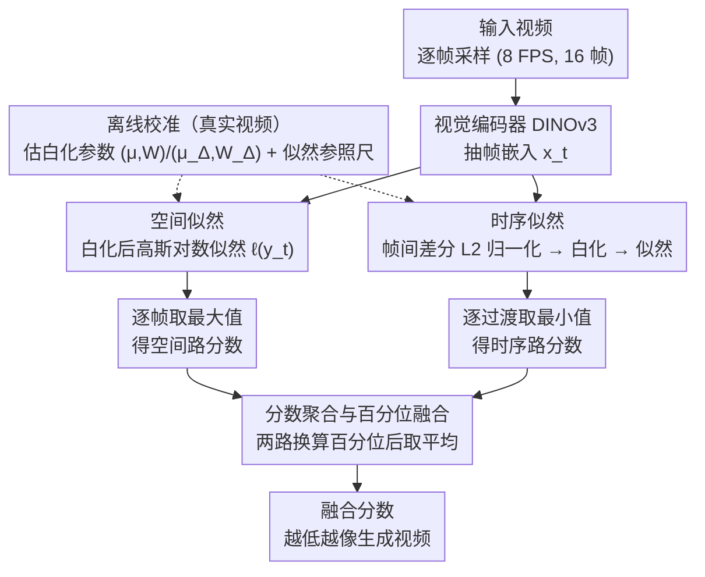

# Training-free Detection of Generated Videos via Spatial-Temporal Likelihoods

**会议**: CVPR 2026  
**arXiv**: [2603.15026](https://arxiv.org/abs/2603.15026)  
**代码**: 有  
**领域**: 图像生成  
**关键词**: 零样本检测, 生成视频检测, 似然估计, 白化变换, 时空建模  

## 一句话总结

提出 STALL，一种无需训练的零样本生成视频检测器，通过在白化嵌入空间中联合建模逐帧空间似然和帧间时序似然，仅依赖真实视频校准即可实现对多种生成模型的鲁棒检测。

## 研究背景与动机

**1. 领域现状**：视频生成技术（Sora、Veo3 等）飞速发展，能生成高保真、长时序的逼真视频，但也带来虚假信息、欺诈等风险，可靠的生成视频检测变得至关重要。

**2. 痛点**：
- **图像检测器**：逐帧独立处理，完全忽略时序动态，无法捕捉运动不一致等跨帧伪影；
- **监督式视频检测器**：需要大量标注数据训练，对未见过的生成模型泛化能力差，而新模型层出不穷；
- **D3（唯一的零样本视频检测器）**：仅依赖时序线索（帧间二阶差分），忽略逐帧空间信息，且缺乏理论基础。

**3. 核心矛盾**：单独使用空间或时序信息都不够——空间检测器对运动伪影无感，时序检测器对逐帧视觉异常无感。需要一种联合建模两者的方法。

**4. 要解决什么**：设计一种零样本（无需生成样本、无需训练）、有理论基础的视频检测方法，能同时利用空间和时序证据。

**5. 切入角度**：高维视觉嵌入在白化后近似服从高斯分布（由 Maxwell-Poincaré 引理理论保证），因此可以用闭式对数似然作为"真实性"度量。将此思路从图像扩展到视频帧间过渡向量。

**6. 核心 idea**：对帧嵌入计算空间似然，对归一化帧间差分计算时序似然，两者通过百分位归一化融合为统一检测分数。生成视频在空间或时序上会偏离真实数据分布，从而被捕获。

## 方法详解

### 整体框架

STALL（Spatial-Temporal Aggregated Log-Likelihoods）的出发点很直接：既然检测器既要看清每一帧的画面，又要看清帧与帧之间怎么动，那就把这两条证据各自量化成一个"像不像真实数据"的对数似然，再合起来判决。

方法只有两个阶段。**离线校准**时，拿一批真实视频（校准集，如 VATEX 的 33k 视频）过一遍视觉编码器（DINOv3）抽帧嵌入，分别估出空间侧的白化参数 $(\mu, W)$ 和时序侧的白化参数 $(\mu_\Delta, W_\Delta)$，并把校准集上算出的空间/时序似然分布记下来当作参照尺。**在线推理**时，对测试视频逐帧算空间似然、对相邻帧的归一化差分算时序似然，各自聚合成一个视频级分数，再用百分位把两条尺度对齐后取平均。最终融合分数越低，就越像生成视频。整个过程没有任何可学习参数，校准集里也不需要任何生成样本。

### 关键设计

**1. 空间似然：用白化后的高斯似然度量每一帧"像不像真实图像"**

针对"图像检测器各帧独立、但至少能抓住单帧的视觉异常"这条已被验证的线索，STALL 先把它做扎实。每帧嵌入 $x_t = E(f_t)$ 经白化变换 $y_t = W(x_t - \mu)$ 后，协方差变成单位阵、均值归零；只要白化坐标近似高斯，就有 $y \sim \mathcal{N}(0, I_d)$，对数似然可直接写成闭式：

$$\ell(y) = -\tfrac{1}{2}\big(d\log(2\pi) + \|y\|_2^2\big).$$

这一步之所以成立，是因为前作（ZED 等）已用 Anderson-Darling 和 D'Agostino-Pearson 检验证明 CLIP/DINO 嵌入白化后确实服从高斯；本文把这个结论从静态图像迁到视频帧上，验证了 DINOv3 的帧嵌入同样满足高斯假设。于是空间似然不再是个经验打分，而是有统计检验背书的真实性度量——生成帧只要在视觉统计上偏离真实分布，$\|y\|^2$ 就会变大、似然变低。

**2. 时序似然：先归一化再白化，让帧间运动也落进高斯框架**

光有空间还不够，运动不一致这类跨帧伪影空间侧完全看不见。最自然的想法是看帧间差分 $\Delta_t = x_{t+1} - x_t$，但原始差分有个麻烦：它的范数在不同片段间忽大忽小，根本不满足高斯。本文的关键一招是对差分做 L2 归一化 $\tilde{\Delta}_t = \Delta_t / \|\Delta_t\|$，把它压到单位球面上、只保留运动**方向**。视频运动方向本身没有偏好（朝哪动都可能），所以归一化后这些方向向量在高维球面上近似均匀分布；由 Maxwell-Poincaré 引理，高维球面均匀分布在任意低维投影上又近似高斯。这样一来，归一化方向再走一遍白化 $z_t = W_\Delta(\tilde{\Delta}_t - \mu_\Delta)$，就能套用和空间侧完全一样的闭式似然。生成视频的运动模式往往不自然，落在这套真实运动分布的边缘，时序似然就会偏低。两个边界情况单独处理：相邻帧完全相同（$\Delta_t = 0$）时丢弃该过渡，整段视频静止时则退化为纯空间检测。

**3. 分数聚合与百分位融合：用互补的聚合方式合并两路证据**

最后要把逐帧/逐过渡的似然合成一个视频判决，难点是空间和时序两路尺度不同、不能直接相加。STALL 分两步处理。聚合方向上，空间似然取**最大值**、时序似然取**最小值**——相关性分析发现 max-spatial 与 min-temporal 之间相关性最低、信息最互补（一路盯最像真的那帧、一路盯最可疑的那次过渡）。尺度对齐上，把测试视频的原始似然换算成相对校准集的百分位排名 $\text{perc}(s) = \frac{1}{n}\,|\{i : s_i \le s\}|$，于是两路都落进 $[0,1]$ 的同一量纲，融合分数取二者平均 $s_{\text{video}} = \tfrac{1}{2}(\text{perc}_{\text{sp}} + \text{perc}_{\text{temp}})$。相比直接加权平均，百分位融合天然消除了量纲差异，也让"空间或时序任一维度异常"都能拉低总分。

### 损失函数 / 训练策略

本方法完全 **无需训练**。校准阶段只是估统计量（均值、协方差、白化矩阵），是纯统计估计；推理时也没有可学习参数。唯一可调的是校准集大小（实验表明 5k+ 即趋于稳定）和帧采样策略（默认 8 FPS、16 帧）。

## 实验关键数据

### 主实验

在三个基准上与图像检测器（AEROBLADE、RIGID、ZED）和视频检测器（D3-L2、D3-cos）零样本对比，以 AUC 为主要指标：

| 基准 | AEROBLADE | RIGID | ZED | D3 (L2) | D3 (cos) | **STALL** |
|------|-----------|-------|-----|---------|----------|-----------|
| VideoFeedback (11模型, avg) | 0.58 | 0.63 | 0.54 | 0.54 | 0.55 | **0.83** |
| GenVideo (10模型, avg) | 0.59 | 0.65 | 0.55 | 0.72 | 0.70 | **0.80** |
| ComGenVid (Sora+Veo3, avg) | 0.69 | 0.57 | 0.55 | 0.73 | 0.73 | **0.85** |
| **全部基准平均** | 0.62 | 0.61 | 0.57 | 0.64 | 0.64 | **0.82** |

STALL 在所有基准上平均 AUC 均最高，且是**唯一一个在所有生成器上 AUC 都 > 0.5 的方法**（其他方法在某些生成器上出现决策边界反转）。

与监督式检测器对比（Figure 6b），STALL 的零样本性能甚至超过了部分在测试生成器上训练过的 T2VE 和 AIGVdet。

### 消融实验

**编码器消融**（Table 2，GenVideo 基准）：

| 编码器 | DINOv3 | MobileNet-v3 | ResNet-18 | ViCLIP-L/14 | VideoMAE |
|--------|--------|-------------|-----------|-------------|---------|
| AUC | 0.81 | 0.82 | 0.79 | 0.59 | 0.61 |

- 图像编码器（即使是轻量级 MobileNet）均表现优异；视频编码器效果差，因为将整个视频压缩为单一向量丧失了逐帧/逐过渡的统计信息。

**校准集大小**（Figure 7a）：1k~34k 变化，5k 以上结果稳定，标准差极小。

**鲁棒性测试**（Figure 7b）：JPEG 压缩、高斯模糊、裁剪缩放、加性噪声五个等级，STALL 在所有扰动下保持高分离度。

**时序消融**（Figure 8）：步长、视频长度、FPS 变化下均鲁棒。

### 关键发现

1. **空间+时序缺一不可**：单独使用任一维度都有盲区——ZED（仅空间）在时序不一致主导时失败，D3（仅时序）在空间异常主导时失败，STALL 的联合建模避免了这两种失败模式。
2. **归一化是时序似然的关键**：原始帧间差分不满足高斯分布，L2 归一化后才具备高斯性质，这是理论（Maxwell-Poincaré 引理）和实验共同验证的。
3. **轻量高效**：推理延迟仅 0.49s/视频（16帧），与最快的 D3 相当，远快于 AEROBLADE 和 AIGVdet。
4. **校准集选择不敏感**：不同来源（VATEX、Kinetics-400、VideoFeedback 真实数据）作为校准集效果相近。

## 亮点与洞察

- **理论驱动**：不是纯经验方法，而是基于高斯似然和 Maxwell-Poincaré 引理，提供了可解释、可验证的理论框架。检测失败时可以定量诊断是空间还是时序分数出了问题。
- **极简优雅**：整个方法没有可学习参数，核心就是白化+范数计算+百分位排名，实现简单但效果远超复杂的监督方法。
- **零样本泛化**：对 Sora、Veo3 等最新模型无需任何适配即可检测。
- **百分位融合**：避免了空间/时序似然量纲不同的问题，比直接加权平均更鲁棒。

## 局限与展望

1. **静态视频退化**：若视频帧间变化极小，时序信号缺失，退化为纯空间检测，可能漏检时序层面精心制作的生成内容。
2. **校准集依赖**：虽然论文称对校准集选择鲁棒，但仍需真实视频集合；极端域偏移（如医疗视频、卫星视频）下的表现未知。
3. **高斯假设的局限**：对于特殊结构的嵌入空间（如窄锥集中现象严重时），高斯近似精度可能下降。
4. **仅检测完全生成视频**：不处理局部替换/编辑（deepfake）场景，该场景需要像素级定位能力。
5. **可能的自适应攻击**：若攻击者了解检测机制，可以尝试让生成视频的空间/时序统计量匹配真实分布，对抗鲁棒性未深入讨论。
6. **帧采样策略固定**：均匀采样可能遗漏局部异常片段，自适应采样策略值得探索。

## 相关工作与启发

- **ZED**（图像零样本检测）：本文的空间似然直接继承自 ZED 的白化+高斯似然框架，核心贡献是扩展到时序维度。
- **D3**（首个零样本视频检测器）：依赖二阶帧间差分的经验假设，缺乏理论基础且忽略空间信息。STALL 通过一阶归一化差分+理论保证超越了 D3。
- **Maxwell-Poincaré 引理**：为归一化操作提供了严格的理论支撑——高维球面均匀分布投影近似高斯，这是本文时序建模的理论基石。
- **启发**：零样本检测思路可迁移到其他模态（如音频生成检测、3D 生成检测），只要嵌入空间满足高斯假设。校准集仅需真实数据，门槛极低。

## 评分

⭐⭐⭐⭐ 理论优雅、实验扎实、方法极简且效果显著，是零样本生成视频检测方向的标杆工作；略扣一星因为局限于完全生成场景且对抗鲁棒性分析不足。

<!-- RELATED:START -->

## 相关论文

- [\[CVPR 2026\] Object-WIPER: Training-Free Object and Associated Effect Removal in Videos](object-wiper_training-free_object_and_associated_effect_removal_in_videos.md)
- [\[CVPR 2026\] Diversity over Uniformity: Rethinking Representation in Generated Image Detection](diversity_over_uniformity_rethinking_representation_in_generated_image_detection.md)
- [\[CVPR 2026\] Just-in-Time: Training-Free Spatial Acceleration for Diffusion Transformers](just-in-time_training-free_spatial_acceleration_for_diffusion_transformers.md)
- [\[CVPR 2025\] A Bias-Free Training Paradigm for More General AI-generated Image Detection](../../CVPR2025/image_generation/a_bias-free_training_paradigm_for_more_general_ai-generated_image_detection.md)
- [\[CVPR 2026\] A Training-Free Style-Personalization via SVD-Based Feature Decomposition](a_training-free_style-personalization_via_svd-based_feature_decomposition.md)

<!-- RELATED:END -->
