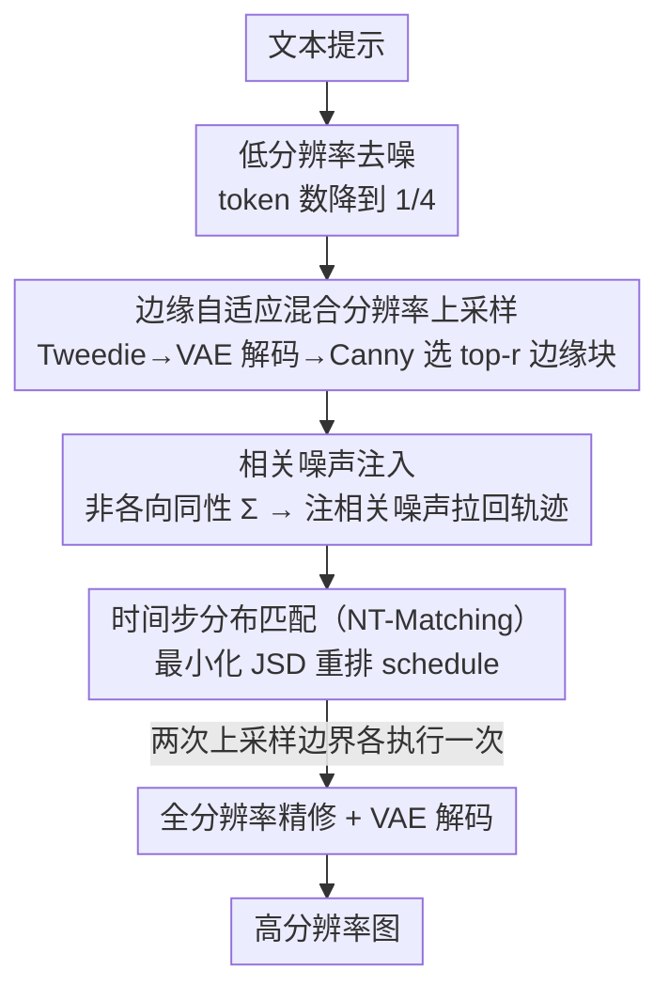

# Training-free Mixed-Resolution Latent Upsampling for Spatially Accelerated Diffusion Transformers

**会议**: CVPR 2026  
**论文**: [CVF Open Access](https://openaccess.thecvf.com/content/CVPR2026/html/Jeong_Training-free_Mixed-Resolution_Latent_Upsampling_for_Spatially_Accelerated_Diffusion_Transformers_CVPR_2026_paper.html)  
**领域**: 扩散模型 / 图像生成加速  
**关键词**: 扩散Transformer, 空间加速, 潜空间上采样, 混合分辨率, 免训练

## 一句话总结
针对扩散 Transformer（DiT）推理慢的问题，本文提出免训练的 RALU（Region-Adaptive Latent Upsampling）：先在 1/4 token 的低分辨率潜空间去噪，再只对易出走样的边缘区域提前上采样、用 NT-Matching 把上采样后偏离的噪声/时间步分布拉回原轨迹，最终在 FLUX 上拿到 7.0× 加速、与时序加速及蒸馏模型叠加可达 15.9×，且画质几乎不掉。

## 研究背景与动机

**领域现状**：扩散 Transformer（DiT）凭借可扩展性在图像/视频生成上做到了 SOTA，但 transformer 复杂度随 token 数二次增长，高分辨率生成推理极慢。已有的免训练加速几乎都做在**时间维度**——靠特征缓存（feature caching）跨时间步省算力，例如 TeaCache、TaylorSeer、ToCa。

**现有痛点**：**空间维度**的加速几乎没人碰。直觉上，把潜变量分辨率沿宽高各降一半，token 数就降到 1/4，算力二次下降，收益比省几个时间步大得多。但"先低分辨率去噪、后期再上采样回高分辨率"这条朴素路线会引入**两类伪影**：① 高频边缘处的**走样伪影（aliasing）**；② 上采样破坏 flow 轨迹分布带来的**失配伪影（mismatching）**。唯一的免训练空间加速先例 Bottleneck Sampling 正是被这两类伪影拖累，画质明显下降；其余潜空间上采样方法（Pyramidal Flow、Latent-SR）都要额外训练，没法直接套到已训练好的大模型上。

**核心矛盾**：作者通过实验把矛盾拆得很清楚——走样只在**晚期**上采样时出现（此时语义结构已定型、低分辨率潜空间表达不出锐利边界），**早期**上采样（$t_\text{up}\le 0.3$）几乎不走样；可一旦把所有潜变量都早早升到高分辨率，又丢掉了低分辨率省算力的好处。于是"早升 vs 省算力"形成 trade-off。

**本文目标**：在不训练、不改预训练模型的前提下，同时拿到空间加速和无伪影的画质。

**切入角度**：两个关键观察（论文写成 Remark）。其一，走样几乎只发生在**边缘区域**——那就没必要全图早升，只把边缘块早升即可，其余区域留在低分辨率到最后才升。其二，失配伪影源于上采样后协方差变成非各向同性、时间步采样频率被打乱，只要**解析地**把噪声分布和时间步分布对齐回原模型，就能消除，而这一切可以无需训练地推导出来。

**核心 idea**：用"边缘区域混合分辨率上采样 + 噪声/时间步匹配"把空间加速的两类伪影逐一拆解掉，做成一个纯推理期、可与现有时序加速正交叠加的框架。

## 方法详解

### 整体框架
RALU 把生成过程切成三段、跑在两种分辨率上。**Stage 1**：在 1/4 token 的低分辨率潜空间做早期去噪，这一段是省算力的主力。**Stage 2**：做一次**中间的边缘区域上采样**——估出当前的干净潜变量、解码看图、检测边缘，只把边缘所在的 top-$r$ 潜块升到高分辨率，其余仍留低分辨率，形成"混合分辨率"潜变量继续去噪。**Stage 3**：把剩下的低分辨率潜块也升到全分辨率，做最后精修并解码出高分辨率图。两次上采样的边界各执行一次 **NT-Matching**（相关噪声注入 + 时间步分布匹配），保证上采样后潜变量仍落在原模型的轨迹分布上。

### 关键设计

**1. 边缘自适应混合分辨率上采样：只在会走样的地方花高分辨率的钱**

这一设计直击"早升省不了算力、晚升又走样"的矛盾。作者先验证了 Remark 1：用近邻/双线性/双三次/Lanczos 等任意插值上采样，晚期（$t_\text{up}\ge 0.5$）升采样都会在语义边缘等高频区显著走样，而早期（$t_\text{up}\le 0.3$）几乎不走样——因为低分辨率潜空间根本没有足够的表达力去承载锐利边界，等结构定型后再升就来不及了。既然走样是**局部**现象，就没必要全图早升。RALU 因此只挑边缘块早升：在 Stage 1 末尾，先用 **Tweedie 公式**从含噪潜变量解析出干净潜变量 $\hat{x}_0$，VAE 解码成图，再跑 **Canny 边缘检测**，选出边缘信号最强的 top-$r$ 比例的潜块（论文取 $r\approx 20\%\sim30\%$）做早升，其余块留低分辨率。最后 Stage 3 把剩余块也升到全分辨率，靠对齐位置编码保证早升区和晚升区在最终图上拼接一致。这样大部分 token 全程跑在低分辨率，算力省下来；少数边缘块享受早升，走样被压住——把全局的高分辨率开销精确地花在"刀刃"上。

**2. 相关噪声注入：把上采样后偏离的潜分布解析地拉回原轨迹**

上采样会破坏 flow matching 的条件分布。原轨迹下 $\hat{x}_t\mid x_1\sim\mathcal{N}(t x_1,(1-t)^2 I)$ 是各向同性的；而做 2× 近邻上采样后变成 $\text{Up}(\hat{x}_t)\mid x_1\sim\mathcal{N}(t\,\text{Up}(x_1),(1-t)^2\Sigma)$，其中 $\Sigma$ 是块对角（4×4 全 1 块）的**非各向同性**协方差——任何插值上采样器都会让潜变量脱离原轨迹分布，直接继续去噪就会全局失配。作者的解法是注入一段**相关噪声** $z\sim\mathcal{N}(0,\Sigma')$ 把协方差重新填成各向同性：令 $a\,\text{Up}(\hat{x}_{e_k})+b\,z=\hat{x}_{s_{k+1}}$，并在约束 $\Sigma'=I-c\Sigma$ 下匹配目标分布。记 $\delta_k\equiv(1-e_k)/\sqrt{c}$，三个重排参数有闭式解：

$$s_{k+1}=\frac{e_k}{\delta_k+e_k},\quad a=\frac{1}{\delta_k+e_k},\quad b=\frac{\delta_k}{\delta_k+e_k}.$$

关键在于这是**免训练**的：Pyramidal Flow（[22]）那类方法靠统一训练去学噪声和时间步参数，而预训练模型的这些参数不能随便定，所以 RALU 只能解析地推出来（详细推导在补充材料，⚠️ 公式细节以原文为准）。这一步只是"恢复分布"，还不够，因为它顺带改了噪声水平、把时间步采样也带偏了，于是引出设计 3。

**3. 时间步分布匹配（NT-Matching）：对齐采样频率，消除失配伪影**

注噪后从 $e_k$ 跳到 $s_{k+1}$ 续跑，会让 $[s_{k+1},e_k]$ 这段区间被重复采样（oversampling），破坏 flow matching 原本的非均匀时间步采样频率，这正是 Remark 2 指出的失配伪影根源。NT-Matching 把"上采样后实际的时间步分布"对齐回"原调度器的分布"。原模型时间步的截断 PDF 为 $f_{h,s,e}(t)=f_h(t)/\big(F_h(e)-F_h(s)\big)$，其中 $f_h(t)=h/(1+(h-1)t)^2$、$h$ 是 flow matching 的 shifting 参数。把所有阶段（含重叠区间）的截断 PDF 按区间长度加权求和，得到目标分布 $P_\text{target}(t)$；而实际分布 $P(t)=\sum_k (N_k-N_{k-1})f_{h_k,s_k,e_k}(t)/N_K$ 用每阶段独立的 shifting 参数 $h_k$ 控制。作者通过**数值搜索最小化二者的 Jensen-Shannon 散度（JSD）**，解析地定出相关系数 $c$ 和各阶段 $\{h_k\}$，这组值进而决定噪声强度、相关性与完整的时间步 schedule。实验里 JSD 越小失配伪影越少（JSD < 0.03 时基本消失），ImageReward 显著提升（$p<0.001$）。这一设计让"免训练"真正落地：不重训模型，靠一次数值优化就把分布对齐做好。

### 损失函数 / 训练策略
全程**免训练、免微调**，不引入任何可学习参数。$c$、$\{h_k\}$ 等调度参数由最小化 JSD 的一次性数值搜索解析确定；$r$（边缘块比例）作为加速-伪影 trade-off 的超参，取 0.2–0.3。边缘检测用图像空间 Canny（VAE 解码额外开销约 2.48 TFLOPs，相对总量很小）。

## 实验关键数据

base model 为 FLUX.1-dev 与 SD3 Medium；画质/对齐指标用 ImageReward、CLIP-IQA、NIQE、T2I-CompBench、GenEval；加速用单卡 A100 上的 latency 与 TFLOPs 衡量。

### 主实验（FLUX 7× 加速下与各加速法对比）

| 方法 | 加速类型 | TFLOPs ↓ | Speed.↑ | ImageReward↑ | CLIP-IQA↑ | NIQE↓ | GenEval↑ |
|------|--------|---------|--------|-------------|----------|-------|---------|
| FLUX (50, 原模型) | - | 2991.0 | 1.00× | 1.095 | 0.707 | 6.75 | 0.698 |
| FLUX (7) | 时序 | 431.5 | 6.93× | 0.920 | 0.660 | 8.25 | 0.583 |
| TaylorSeer | 时序 | 431.7 | 6.83× | 0.660 | 0.646 | 9.43 | 0.446 |
| Bottleneck | 空间 | 431.5 | 6.93× | 0.792 | 0.631 | 8.71 | 0.672 |
| **RALU (Ours)** | 空间 | 426.0 | **7.02×** | **0.999** | **0.681** | **6.87** | **0.682** |

7× 这种激进加速下，时序方法（TaylorSeer 掉到 0.660）和此前唯一的空间加速 Bottleneck（0.792）画质都明显塌；RALU 的 ImageReward 0.999 远超所有 baseline，NIQE 6.87 也最接近原模型的 6.75。SD3 上同样：3× 加速时 RALU ImageReward 0.798、Bottleneck 仅 0.628、TaylorSeer 几乎崩到 0.059。

### 与时序加速 / 蒸馏模型叠加

| 配置 | 加速类型 | TFLOPs↓ | Speed.↑ | ImageReward↑ | GenEval↑ |
|------|--------|---------|--------|-------------|---------|
| RALU (5×) | S | 540.5 | 5.53× | 1.022 | 0.652 |
| + TaylorSeer (W=3) | S+T | 410.7 | 7.28× | 0.959 | 0.680 |
| + TaylorSeer (W=2) | S+T | 331.4 | 9.03× | 0.926 | 0.586 |
| FLUX.1-schnell (蒸馏 4 步) | D | 252.9 | 11.83× | 1.055 | 0.688 |
| **+ RALU** | D+S | 187.9 | **15.91×** | 0.992 | 0.636 |

RALU 是空间加速，与时序加速（缓存/预测）和时间步蒸馏正交，可以直接叠：套 TaylorSeer 免训练冲到 9.03×；套蒸馏模型 FLUX.1-schnell 总加速 15.91× 而 ImageReward 仅从 1.055 微降到 0.992。

### 消融：NT-Matching 的 JSD 效应（FLUX 7×）

| JSD | ImageReward↑ | NIQE↓ | T2I-CompBench↑ |
|-----|-------------|-------|----------------|
| 0.026（优化值） | 0.999 | 6.51 | 0.633 |
| 0.030 | 0.972 | 6.60 | 0.571 |
| 0.035 | 0.981 | 6.53 | 0.569 |
| 0.040 | 0.966 | 6.80 | 0.565 |

### 关键发现
- **NT-Matching 的有效性等价于"把 JSD 压到最小"**：优化到 JSD=0.026 时画质和文本对齐全面最好，刻意调大 JSD 各指标都退化——印证了失配伪影确实由时间步分布偏移导致。
- **上采样比例 $r$ 存在最优区间**：画质随 $r$ 上升但 FLOPs 也涨，质量约在 $r=0.3$ 见顶，作者取 0.2–0.3 作为质量-效率折中。
- **边缘检测放图像空间更准**：图像空间 Canny 比潜空间 Sobel 边缘图更准、生成质量略好，多花的 VAE 解码开销（~2.48 TFLOPs）可忽略；固定 $r$ 比自适应 $r$ 在相近 FLOPs 下没明显劣势，且算力稳定，故采用固定比例。
- **伪影率全面占优**：相近 TFLOPs 下，RALU 的伪影率显著低于 Bottleneck 和朴素上采样（Fig.7）。

## 亮点与洞察
- **把"空间加速"这块被冷落的维度做实了**：相比时序缓存只能省几个步，分辨率二次下降的杠杆更大，且作者证明它能和时序加速**正交叠加**，这点对工程落地很有价值——现成的 TaylorSeer/蒸馏模型上再套 RALU 就免费再快一截。
- **"先诊断两类伪影、再各个击破"的研究范式很干净**：两个 Remark（走样只在边缘+晚期 / 失配源于分布偏移）把模糊的"上采样有伪影"拆成两个可独立解决的子问题，方法的每一块都能对应到一个伪影来源，没有玄学。
- **全程闭式 + 数值搜索、零训练**：把本来需要"统一训练"才能学到的噪声/时间步参数，改成在约束 $\Sigma'=I-c\Sigma$ 下解析推导 + 最小化 JSD，使其能即插即用到任意已训练好的 flow-based DiT。这套"用解析对齐替代重训"的思路可迁移到其它需要在推理期改分辨率/调度的扩散加速场景。
- **Tweedie + VAE 解码做边缘选择**很巧：在潜空间里直接判边缘不准，先解析估出干净图再用经典 Canny，把"哪里会走样"判得更可靠，开销还小。

## 局限与展望
- **机制尚未讲透（作者自己承认）**：DiT 在多分辨率下如何同时去噪、self-attention 权重在混合分辨率输入下怎么算，仍是开放问题；方法更多是"实验观察 + 解析对齐"，缺一个第一性原理解释。
- **依赖经验超参**：$r\approx0.2\text{–}0.3$、$t_\text{up}\le0.3$ 等阈值由实验定，换 base model/分辨率/任务可能需重调；固定 $r$ 虽稳定但对边缘极密或极稀的图未必最优。
- **关键推导藏在补充材料**：噪声注入参数 $a,b,s_{k+1}$ 与 $\Sigma'=I-c\Sigma$ 的完整推导正文未给（⚠️ 以原文/补充材料为准），复现需对照 supplementary。
- **只验证了 T2I**：视频/音频等其它 DiT 模态、以及超高分辨率（>1024）下的表现未覆盖；高速比叠加（15.9×）时 GenEval 等指标已有可见下滑。

## 相关工作与启发
- **vs 时序加速（TeaCache / TaylorSeer / ToCa / ∆-DiT）**：它们沿时间维做特征缓存省步数，激进加速时画质崩得厉害；RALU 沿空间维降分辨率，二者正交，叠加后能进一步加速且 RALU 单独在 7× 下画质就远好于它们。
- **vs Bottleneck Sampling**：同为免训练空间加速，但 Bottleneck 没处理走样与失配，伪影严重；RALU 用边缘选择性早升 + NT-Matching 针对性消两类伪影，相近 FLOPs 下伪影率与画质全面领先。
- **vs Pyramidal Flow / Latent-SR**：它们也做潜空间分辨率变换，但都需要额外/统一训练，套不进已训练好的大模型；RALU 把这些原本"训练学出来"的噪声/时间步参数改成解析+数值求解，做到完全免训练。
- **vs 时间步蒸馏（FLUX.1-schnell / SD3.5L-Turbo）**：蒸馏是训练期把步数压少，RALU 是推理期降分辨率，两者可叠加，在蒸馏模型上再加 RALU 拿到 15.9× 总加速。

## 评分
- 新颖性: ⭐⭐⭐⭐⭐ 把几乎空白的 DiT 空间加速做成系统方案，"边缘选择性早升 + 免训练解析对齐分布"是有原创性的组合。
- 实验充分度: ⭐⭐⭐⭐ FLUX/SD3 双模型、五类指标、与时序加速及蒸馏的叠加、JSD/比例/边缘检测多组消融都齐；仅限 T2I、关键推导在补充材料略减分。
- 写作质量: ⭐⭐⭐⭐⭐ 用两个 Remark 把伪影诊断讲得极清楚，方法每一步都对应一个被解决的问题，逻辑链顺畅。
- 价值: ⭐⭐⭐⭐⭐ 免训练、即插即用、与现有加速正交叠加可达 15.9×，对 DiT 实际部署很有用。

<!-- RELATED:START -->

## 相关论文

- [\[CVPR 2026\] Just-in-Time: Training-Free Spatial Acceleration for Diffusion Transformers](just-in-time_training-free_spatial_acceleration_for_diffusion_transformers.md)
- [\[CVPR 2026\] Region-Adaptive Sampling for Diffusion Transformers](region-adaptive_sampling_for_diffusion_transformers.md)
- [\[CVPR 2026\] Training-free, Perceptually Consistent Low-Resolution Previews with High-Resolution Image for Efficient Workflows of Diffusion Models](training-free_perceptually_consistent_low-resolution_previews.md)
- [\[CVPR 2026\] SketchDeco: Training-Free Latent Composition for Precise Sketch Colourisation](sketchdeco_training-free_latent_composition_for_precise_sketch_colourisation.md)
- [\[CVPR 2026\] PixelRush: Ultra-Fast, Training-Free High-Resolution Image Generation via One-step Diffusion](pixelrush_ultrafast_trainingfree_highresolution_im.md)

<!-- RELATED:END -->
