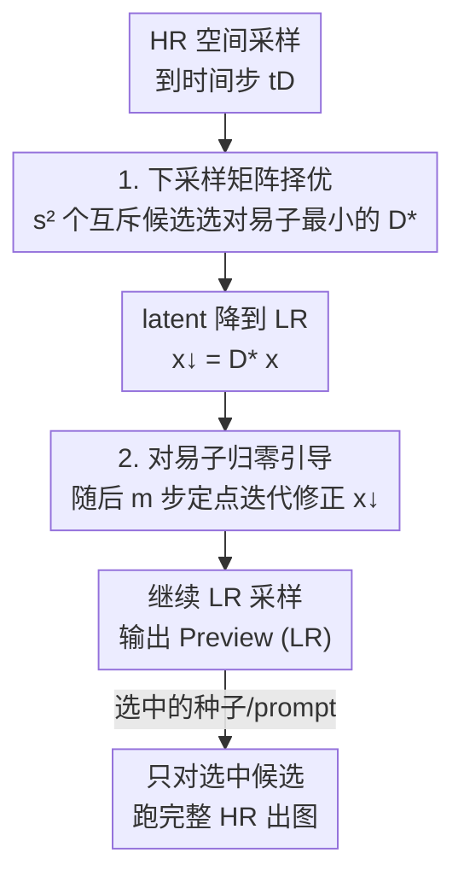

# Training-free, Perceptually Consistent Low-Resolution Previews with High-Resolution Image for Efficient Workflows of Diffusion Models

**会议**: CVPR 2026  
**论文**: [CVF OpenAccess](https://openaccess.thecvf.com/content/CVPR2026/html/Jeong_Training-free_Perceptually_Consistent_Low-Resolution_Previews_with_High-Resolution_Image_for_Efficient_CVPR_2026_paper.html)  
**代码**: 无  
**领域**: 扩散模型 / 图像生成  
**关键词**: 预览生成, flow matching, 对易子条件, 训练免学, 推理加速

## 一句话总结
为了让用户在"撞种子/调 prompt"的反复试错阶段不必每次都付出高分辨率（HR）出图的算力，本文提出一种**免训练**的低分辨率（LR）"预览图"生成法：把"LR 要和 HR 在感知上一致"这一目标，重新表述成 flow matching 模型与下采样算子之间的**对易子为零（commutator-zero）条件**，并用"下采样矩阵择优 + 对易子归零引导"两步在采样中近似满足它，在最多省 33% 算力的同时保住 LR↔HR 的构图与色彩一致性，叠加时间轴加速后可达 3.05× 提速。

## 研究背景与动机
**领域现状**：扩散 / flow matching 生成模型（如 FLUX.1-dev、Stable Diffusion 3.5-Large）已是设计师和普通用户的日常出图工具。但这些模型从同一个 prompt 能产生千变万化的结果，用户为了挑到满意的那一张，往往要**换很多种子、改很多 prompt 反复试**，每次试错都生成一张完整 HR 图，算力开销巨大——对用户和服务商都是负担。

**现有痛点**：现有加速思路有两类，都不适合"试错预览"这个场景。① **缓存类**（∆-DiT、ToCa、TaylorSeer 等）复用冗余特征预测未来 latent，只能拿到线性加速、还要额外显存，而且可能改变生成结果的感知外观；② **空间下采样类**（Bottleneck Sampling、RALU）直接在 latent 上做空间下采样换二次方加速，但**直接操纵 latent 会扰乱表示**，导致构图、颜色偏移，加速出来的图无法忠实还原它本该对应的 HR 图。

**核心矛盾**：一个直觉方案是"先生成 LR、选中后再超分（SR）回 HR"。但作者指出（Fig. 2）**LR 阶段丢失的细节会在超分时一路传播放大**——猫的眼睛、毛发等精细结构在 LR 就没了，SR 救不回来，所以"LR→SR"路线本身就和"最终 HR 直生"对不齐。问题的根本在于：用户需要的不是"能放大的 LR"，而是"看起来就和最终 HR 一模一样、只是分辨率低"的**忠实预览**。

**本文目标**：定义一个新任务 **Preview Generation**——生成一批 LR 候选（Previews），它们与各自种子/prompt 对应的 HR 图**在感知上高度一致**，用户据此挑出有希望的候选，再只对选中的那个跑一次完整 HR 采样。

**切入角度**：作者观察到扩散采样的**早期去噪步主要确定图像的全局布局**。于是想法是：先在 HR 空间正常采样到某个时间步 $t_D$（把全局结构搭好），此刻再下采样到 LR 继续走——这样 LR 能继承早期形成的全局一致表示。

**核心 idea**：把"下采样后的 LR 轨迹要和 HR 轨迹一致"形式化为：下采样算子 $D$ 与 flow matching 速度场 $v_\theta$ **可交换**，即对易子 $[D, v_\theta]=0$。再用免训练手段去逼近这个条件。

## 方法详解

### 整体框架
方法围绕一个核心假设展开：在 HR 空间采样到时间步 $t_D$（论文取 $t_D/N\approx0.3$，全局布局已成形）后，把 latent 用下采样矩阵 $D$ 降到 LR 再继续采样，只要 $D$ 与速度场 $v_\theta$ **近似可交换**，那么 LR 轨迹的终点 $x_1^{\downarrow}$ 就约等于 HR 终点 $x_1$ 的下采样版本 $Dx_1$，从而 LR 预览图和 HR 出图在感知上一致。

具体而言，下采样轨迹满足 $dx_t^{\downarrow}=Dv_\theta(x_t,t)\,dt$，理想的**一致性条件**是 $x_1^{\downarrow}=Dx_1$（compliance，作者沿用前人经验性假设）。要在采样里用 $v_\theta(Dx_t,t)$ 替代 $Dv_\theta(x_t,t)$ 来加速，就要求**对易子条件**成立：

$$[D, v_\theta](x_t,t)\triangleq Dv_\theta(x_t,t)-v_\theta(Dx_t,t)\overset{?}{=}0.$$

但实测中（Tab. 1）flow matching 模型根本不满足它：FLUX.1-dev 上对易子 L2 范数高达 $111.03$，SD3.5-L 为 $105.90$。于是作者从两个"可控变量"分别下手把这个范数压下去——选 $D$（Sec. 3.3）和调 $x_t$（Sec. 3.4），构成两个关键设计。整条 pipeline 是一个**单分支、有时序切换点的串行流程**：HR 采样 → 在 $t_D$ 做矩阵择优下采样 → 随后 $m$ 步做对易子归零引导 → 继续 LR 采样出图。

### 关键设计

**1. 下采样矩阵择优：从一组互斥候选里挑对易子最小的那个 $D^*$**

痛点直接来自 Tab. 1——任意拍脑袋选的下采样（如最近邻）会让对易子很大，LR 和 HR 对不齐；而把 $D$ 当连续变量去优化，一来非二值矩阵会让噪声产生相关性、损伤保真度，二来优化 $D$ 本身很贵，违背"快速出 LR"的初衷。作者的解法是**只在一组离散、互斥的候选里挑**：对每个 $s\times s$ 空间块，定义块内下采样 $D_{s\times s}$ 为"从 $s^2$ 个位置里取一个元素"，于是恰好有 $s^2$ 个互不重叠（mutually exclusive）的候选；把全图所有块的同一选择聚合起来，得到全局下采样算子

$$D_k\triangleq\Big(\bigoplus_{i=1}^{h/s}\bigoplus_{j=1}^{w/s}D_{s\times s,k}^{(i,j)}\Big)\Pi,\quad k\in\{1,\dots,s^2\},$$

其中 $\Pi$ 是把每个 $s\times s$ 块内元素重排成连续的置换矩阵，$\bigoplus$ 是构成块对角矩阵的直和。这样得到候选集 $\mathcal D_{down}=\{D_1,\dots,D_{s^2}\}$，且任意两个满足 $D_i\odot D_j=0$（互斥）。最后对每个候选算一次对易子范数，取最小者：

$$D^*=\arg\min_{i=1,\dots,s^2}\|[D_i,v_\theta](x_t,t)\|.$$

之所以有效：因为这 $s^2$ 个候选共享同一次 $v_\theta(x_t,t)$ 前向，**择优的算力开销几乎等于评估一次速度场**，既避免了昂贵优化，又用"二值、互斥"的结构规避了噪声相关性。消融（Tab. 4）显示，相比最近邻、随机、甚至 $\arg\max$ 变体，$\arg\min$ 取最小对易子的策略 PSNR 最高、DreamSim 最低。

**2. 对易子归零引导：用定点迭代式更新继续把 $x_t^\downarrow$ 的对易子压下去，且只靠前向、零反传**

选好 $D^*$ 只压低了一部分对易子，剩下的要从 latent $x_t$ 这一侧继续修。最直接的做法是对 $x_t$ 做反向传播梯度更新，但这与"快速出 LR"矛盾。作者借鉴定点迭代（fixed-point iteration）思路，提出一个**只用前向**的更新规则：

$$x_t^{\downarrow,k+1}=x_t^{\downarrow,k}+\alpha\cdot\big(D^*v_\theta(x_t,t)-v_\theta(x_t^{\downarrow,k},t)\big),$$

其中 $\alpha$ 是步长。但这里有个难点：它需要在每步都存下 $x_t$ 并重新算 $v_\theta(x_t,t)$，又慢又占显存。关键的省算力一招来自 rectified flow 的一个已知性质——**速度场被线性化后，在任一时间步邻域内取值近似不变**：$v_\theta(x_{t_0},t)\approx v_\theta(x_{t_0+\Delta t},t+\Delta t)$。据此作者**复用下采样时刻已经算过的 $v_\theta(x_{t_D},t_D)$**，免费替换掉本要在时间步 $t$ 重算的 HR 项：

$$x_t^{\downarrow,k+1}=x_t^{\downarrow,k}+\alpha\cdot\big(\underbrace{D^*v_\theta(x_{t_D},t_D)}_{\text{复用，}Eq.(11)}-v_\theta(x_t^{\downarrow,k},t)\big).$$

这样每次更新只需算一次**廉价的 LR 前向** $v_\theta(x_t^\downarrow,t)$。实现上把更新限制在 $t_D$ 之后的 $m$ 步、每步只迭代一次（$k=1$），既满足邻域近似条件又省算力。有效性有统计验证：Wilcoxon 符号秩检验显示，不加引导时对易子范数在 $t_D\to t_{D+m}$ 间**显著上升**（$p=9.62\times10^{-38}$），加了引导后**显著下降**（$p=3.38\times10^{-25}$），证明它确实让 LR 轨迹更贴近 HR。

### 损失函数 / 训练策略
全程**免训练**，无任何损失函数或微调。关键超参（Algorithm 1）：NFE $N=30$、下采样步 $D=10$（即 $t_D/N\approx0.3$）、修正步数 $m=5$，步长 FLUX 用 $\alpha=0.04$、SD3.5 用 $\alpha=0.01$。

## 实验关键数据

### 主实验
评测在 **PixArt-Eval30K**（语义丰富、构图复杂的 prompt，比 MS-COCO 更贴近真实创作）随机抽 5K prompt 上进行，统一在 $512\times512$ 评估。指标含图像质量 PIQE（无参考）、感知相似 DreamSim↓/DiffSim↑、低层相似 PSNR↑/FSIM↑。对比三个 baseline：降 NFE 到 20、直接生成 512×512 LR、$t_D$ 处朴素最近邻下采样。

| 模型 / 方法 | Speed↑ | PIQE↓ | DreamSim↓ | DiffSim↑ | PSNR(dB)↑ | FSIM↑ |
|--------|--------|-------|-----------|----------|-----------|-------|
| FLUX.1-dev (20, 降NFE) | 1.49× | 34.78 | 7.25 | 0.8686 | 20.633 | **0.8268** |
| FLUX Low-res. (直生512) | 2.99× | 29.11 | 21.02 | 0.7352 | 11.936 | 0.6147 |
| FLUX Naïve Down. | 1.75× | 31.71 | 9.20 | 0.8584 | 18.221 | 0.7375 |
| **FLUX Ours** | 1.53× | **28.55** | **6.83** | **0.8721** | **21.182** | 0.7953 |
| SD3.5-L (20, 降NFE) | 1.49× | 36.28 | 15.61 | 0.7893 | 13.496 | 0.6782 |
| SD3.5-L Low-res. | 2.88× | 31.95 | 28.46 | 0.6538 | 8.318 | 0.5517 |
| SD3.5-L Naïve Down. | 1.72× | **29.75** | 14.81 | 0.7956 | 13.858 | 0.6919 |
| **SD3.5-L Ours** | 1.50× | 31.55 | **13.47** | **0.8117** | **14.457** | **0.7408** |

FLUX 上本文在图像质量、感知相似、PSNR 三项最优，仅 FSIM 第二；值得注意的是 FSIM 最高的"降 NFE"变体整体图像质量反而最差（PIQE 34.78）。SD3.5-L 上本文除图像质量第二外其余全面最优。"直生 LR"虽然最快但 DreamSim 高得离谱（21～28），说明纯 LR 直生与 HR 几乎对不齐。

### 与时间轴加速正交叠加
本文方法（空间侧）与缓存类时间轴加速正交，可叠加 TaylorSeer：

| 方法 | Speed↑ | PIQE↓ | DreamSim↓ | PSNR(dB)↑ |
|------|--------|-------|-----------|-----------|
| FLUX.1-dev (10, 降NFE) | 2.95× | 32.82 | 16.97 | 16.427 |
| Taylor only | 3.21× | 28.10 | 9.17 | 18.667 |
| **Ours + Taylor** | 3.05× | **27.47** | **7.79** | **19.953** |

在与"纯降 NFE 到同等加速比"相当的提速下，叠加版在质量与一致性上全面更优，达到 **3.05× 提速**。

### 消融实验
| 配置 | PIQE↓ | DreamSim↓ | PSNR(dB)↑ | 说明 |
|------|-------|-----------|-----------|------|
| Nearest $D$ | 29.72 | 10.39 | 18.069 | 最近邻，丢信息最多，最差 |
| Random $D$ | 27.35 | 7.40 | 20.851 | 随机选，居中 |
| $\arg\max$ (Eq.8) | 27.83 | 8.55 | 20.408 | 取对易子最大，偏差 |
| **Full (Ours, $\arg\min$)** | **27.08** | **7.05** | **20.962** | 取对易子最小，最优 |
| w/o 对易子归零引导 (CG ✗) | 31.89 | 8.56 | 19.115 | 去掉引导后掉点 |
| **w/ CG ✓** | **27.08** | **7.05** | **20.962** | 完整模型 |

### 关键发现
- **对易子最小化是核心信号**：$\arg\min$ 全面优于最近邻 / 随机 / $\arg\max$，验证了"对易子范数"确实是 LR↔HR 一致性的有效代理量。
- **对易子归零引导贡献明确**：加上 CG 后 PSNR 从 19.115 升到 20.962、DreamSim 从 8.56 降到 7.05，付出的只是轻微效率下降。
- **$m$ 与 $\alpha$ 存在权衡**（Tab. 6）：增大修正步数 $m$ 一致提升 PSNR 但增算力，且每个 $m$ 都有最优 $\alpha$；综合取 $m=5,\alpha=0.04$（此时 PSNR 21.146，$m=7,\alpha=0.03$ 可到 21.467 但更贵）。

## 亮点与洞察
- **把"感知一致"翻译成一个可计算的代数条件**：作者最"啊哈"的一步是把模糊的"LR 要像 HR"目标，落到 $[D,v_\theta]=0$ 这个干净的对易子条件上，于是优化对象从"图像质量"变成"一个标量范数"，可逐候选枚举、可统计检验，整个方法因此变得可控、免训练。
- **用 rectified flow 的线性性质"白嫖"一次前向**：复用 $v_\theta(x_{t_D},t_D)$ 替代每步重算 HR 速度场，是把"理论上需要梯度/重算"的修正变成"零额外大前向"的关键工程化技巧，可迁移到其他需要在 latent 上做迭代修正、又怕反传太贵的 flow matching 场景。
- **离散互斥候选规避连续优化**：$s^2$ 个互斥二值矩阵共享一次前向即可择优，既绕开非二值带来的噪声相关性，又把"优化 $D$"降成"枚举 $D$"，是个轻量又巧妙的设计。
- **正交可叠加性**：与时间轴缓存加速正交，能直接叠到 TaylorSeer 上拿到 3× 提速，工程落地友好。
- **泛化性**：commutator-zero 引导不止用于下采样，只要算子不引入噪声相关性（如平移、加相关性校正后的 warping）都能套用，作者实测能消除朴素平移/形变带来的伪影与多余物体。

## 局限与展望
- **依赖未严格成立的假设**：compliance（$x_1^\downarrow=Dx_1$）与对易子近似都是经验性假设，作者自己承认 flow matching 并不严格满足，方法本质是"逼近"而非"保证"一致性。
- **加速幅度有限**：单用本文方法 FLUX 仅 1.53×、SD3.5 1.50×（远低于"直生 LR"的 ~3×），其优势在"一致性"而非"极限速度"；真正的大提速要靠叠加时间轴加速。
- **绑定 rectified flow 线性性质**：对易子归零引导的省算力关键依赖 $v_\theta(x_{t_0},t)\approx v_\theta(x_{t_0+\Delta t},t+\Delta t)$，在非线性轨迹或非 rectified-flow 模型上能否成立存疑 ⚠️（以原文为准）。
- **warping 需额外校正**：形变会引入噪声相关性，必须借用已有 correction 才能用，说明"算子不引入相关性"这一前提限制了泛化范围。
- **改进方向**：自适应选择 $t_D$、按 prompt/区域动态调 $m,\alpha$，或把对易子条件显式融入训练以从根上满足而非逼近。

## 相关工作与启发
- **vs 缓存类加速（∆-DiT / ToCa / TaylorSeer）**：它们沿**时间轴**复用特征，只有线性加速且占显存；本文走**空间轴**下采样、目标是 LR 预览一致性，二者正交可叠加（Ours+Taylor 达 3.05×）。
- **vs 空间下采样加速（Bottleneck Sampling / RALU）**：同样压空间 token，但直接操纵 latent 会扰乱构图与色彩、无法忠实还原 HR；本文用对易子条件约束下采样算子与采样过程，专门保住 LR↔HR 一致性。
- **vs "LR→超分(SR)"路线**：SR 无法补回 LR 阶段丢失的细节（Fig. 2），误差会传播；本文不做超分，而是让 LR 本身就是 HR 的忠实低分版，定位是"预览"而非"放大源"。

## 评分
- 新颖性: ⭐⭐⭐⭐⭐ 把"感知一致"形式化为对易子归零条件、并给出免训练逼近，视角新颖。
- 实验充分度: ⭐⭐⭐⭐ 双模型、多指标、消融 + 统计检验齐全，但加速比与"直生 LR"不在同一量级，主要靠叠加才显著。
- 写作质量: ⭐⭐⭐⭐ 公式推导清晰、动机层层递进；部分符号（置换矩阵、块直和）较密集。
- 价值: ⭐⭐⭐⭐ 直击"试错出图算力浪费"的真实痛点，免训练 + 正交可叠加，落地价值高。

<!-- RELATED:START -->

## 相关论文

- [\[CVPR 2026\] Low-Resolution Editing is All You Need for High-Resolution Editing](low-resolution_editing_is_all_you_need_for_high-resolution_editing.md)
- [\[CVPR 2026\] PixelRush: Ultra-Fast, Training-Free High-Resolution Image Generation via One-step Diffusion](pixelrush_ultrafast_trainingfree_highresolution_im.md)
- [\[CVPR 2026\] Efficient and Training-Free Single-Image Diffusion Models](efficient_and_training-free_single-image_diffusion_models.md)
- [\[CVPR 2026\] Training-free Mixed-Resolution Latent Upsampling for Spatially Accelerated Diffusion Transformers](training-free_mixed-resolution_latent_upsampling_for_spatially_accelerated_diffu.md)
- [\[CVPR 2026\] From Sketch to Fresco: Efficient Diffusion Transformer with Progressive Resolution](from_sketch_to_fresco_efficient_diffusion_transformer_with_progressive_resolutio.md)

<!-- RELATED:END -->
