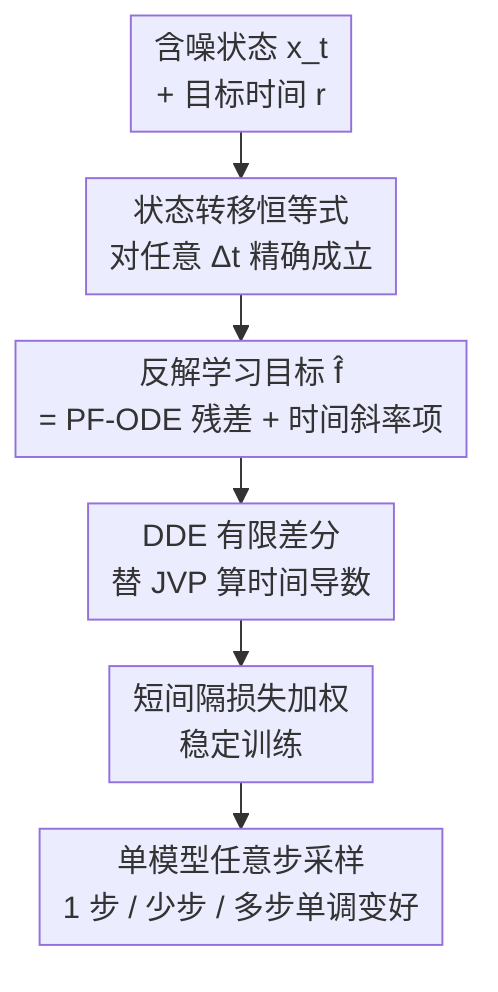

# Transition Models: Rethinking the Generative Learning Objective

**会议**: CVPR 2026  
**论文**: [CVF Open Access](https://openaccess.thecvf.com/content/CVPR2026/html/Wang_Transition_Models_Rethinking_the_Generative_Learning_Objective_CVPR_2026_paper.html)  
**代码**: https://github.com/WZDTHU/TiM  
**领域**: 扩散模型 / 图像生成  
**关键词**: 状态转移、任意步采样、PF-ODE、一致性模型、生成目标

## 一句话总结
TiM 把扩散模型"无穷小步"的 PF-ODE 监督推广成一个对**任意时间间隔 $\Delta t$ 都精确成立的状态转移恒等式**，让一个 865M 的小模型既能 1 步出图、又能随采样步数单调变好，在 GenEval 上以远小于 SD3.5（8B）/FLUX.1（12B）的体量反超它们。

## 研究背景与动机

**领域现状**：当下视觉生成被两类范式主导。一类是扩散 / 流模型，通过数值积分 PF-ODE（概率流常微分方程）一步步去噪，画质极高，但需要几十上百次函数评估（NFE），又慢又贵。另一类是少步生成器——一致性模型（CM）、Shortcut、MeanFlow、各种蒸馏方法——直接学一个"大跨步"的端点映射，几步就能出图。

**现有痛点**：少步方法有个硬伤——**质量天花板**。它们把整条轨迹的速度平均成一个 shortcut，丢掉了精细的局部动态，于是加采样步数不但不变好，反而饱和甚至退化（schedule 一变就崩）。而扩散模型反过来，步数小了离散化误差就爆炸，少步区间画质骤降。

**核心矛盾**：作者指出这个 trade-off 的根子**不在网络结构，而在训练目标的"监督粒度"**。局部监督（PF-ODE，建模无穷小动态）在 $\Delta t\to 0$ 时准、能 scale 到多步，但少步崩；有限区间监督（CM，建模固定区间映射）少步强，但多步没增益——除非用复杂的多区间目标硬训。两种粒度各有天生缺陷，于是全领域被迫在"高保真但慢"和"高效但有天花板"之间二选一。

**本文目标**：找一个统一的学习目标，让同一个模型既是强少步生成器、又是能随步数精修的准积分器，把 1 步 / 少步 / 多步三个区间收进一个模型里。

**切入角度**：与其去近似一个微分方程（局部）或拟合一个统计映射（端点），不如直接让模型学**任意两个状态 $x_t\to x_r$ 之间的转移**。当模型对所有间隔都学会转移，它学到的就是整条生成过程的**解流形（solution manifold）**本身，而不是流形上某条轨迹的局部切线或两端点。

**核心 idea**：把扩散里只在 $\Delta t\to 0$ 才成立的一阶状态转移公式，当成一个对**任意 $\Delta t$ 都必须精确成立的恒等式**来约束网络，由此推出训练目标——这就是 Transition Models (TiM)。

## 方法详解

### 整体框架
TiM 的输入和扩散模型一样是含噪状态 $x_t=\alpha_t x+\sigma_t\varepsilon$，但网络多吃一个目标时间 $r$：$f_\theta(x_t,t,r)$，它要把 $x_t$ 一步转移到任意更早的状态 $x_r$（$r<t$）。整条管线是：先从扩散的一阶状态转移公式出发，把它从"近似"升格为"对任意间隔精确成立的恒等式"，对 $t$ 求导后得到一个**乘积-导数不变量**（State Transition Identity）；从这个恒等式反解出网络要回归的目标 $\hat f$；再为了能真正大规模训练，用有限差分（DDE）替掉昂贵且不兼容 FSDP 的 JVP 来算目标里的时间导数，并加一个偏向短间隔的损失加权稳住训练。采样时，TiM 既能令 $r=0$ 一步从噪声跳到数据，也能把 $[T,0]$ 切成若干段逐步精修，且步数越多越好。

### 关键设计

**1. 状态转移恒等式：把"近似"升格为"对任意间隔精确成立的约束"**

扩散里有个一阶状态转移近似：用网络预测的 $\hat x,\hat\varepsilon$ 可以把当前状态推到任意更早状态 $x_r=A_{t,r}x_t+B_{t,r}f_\theta(x_t,t,r)$，其中 $A_{t,r}=\frac{\alpha_r\hat\sigma_t-\sigma_r\hat\alpha_t}{\hat\sigma_t\alpha_t-\hat\alpha_t\sigma_t}$、$B_{t,r}=\frac{\sigma_r\alpha_t-\alpha_r\sigma_t}{\hat\sigma_t\alpha_t-\hat\alpha_t\sigma_t}$。扩散模型只在 $\Delta t\to 0$ 的极限下让它成立，所以大步必崩。TiM 的关键一步是**要求它对任意 $\Delta t$ 都成立**：既然给定 $r$，无论从哪个 $t$ 出发都该转到同一个 $x_r$，那么 $x_r$ 对 $t$ 的导数应为 0。对两边关于 $t$ 求导并整理，得到

$$\frac{d\big(B_{t,r}\cdot(\hat\alpha_t x+\hat\sigma_t\varepsilon-f_{\theta,t,r})\big)}{dt}=0.$$

记瞬时残差 $h(t)=\hat\alpha_t x+\hat\sigma_t\varepsilon-f_{\theta,t,r}$，这就是 State Transition Identity：$\frac{d}{dt}(B_{t,r}h(t))=0$。它一举施加了三重约束——**轨迹一致性**（加权残差 $B_{t,r}h(t)$ 在 $t>r$ 时恒为常数，意味着直接映射 $t\to r$ 必须等于任意中间分解 $(t\to s)\circ(s\to r)$，这正是 CM 缺的、让 TiM 对采样调度鲁棒、能单调精修的核心）；**边界退化**（$r\to t$ 时 $B_{t,r}\to 0$，恒等式自动退回普通 PF-ODE 监督，所以 TiM 与扩散完全兼容）；以及下一个设计要讲的时间斜率匹配。

**2. 时间斜率匹配：让损失约束的不只是残差的值，还有它随时间的变化率**

把上面恒等式按乘积法则展开：$(\frac{d}{dt}B_{t,r})h(t)+B_{t,r}(\frac{d}{dt}h(t))=0$。普通扩散训练只逼残差的**值**趋零（$h(t)\to 0$），而 TiM 的目标里多了一项残差的**时间斜率** $\frac{d}{dt}h(t)$，并最小化二者的联合项。这是一种更高阶的监督：它逼模型学一个更光滑的解流形，大步采样时保持轨迹连贯、小步精修时保证稳定。由这个恒等式反解出网络真正要回归的目标为

$$\hat f=\hat\alpha_t x+\hat\sigma_t\varepsilon+\frac{B_{t,r}}{\,dB_{t,r}/dt\,}\Big(\tfrac{d\hat\alpha_t}{dt}x+\tfrac{d\hat\sigma_t}{dt}\varepsilon-\tfrac{df_{\theta^-,t,r}}{dt}\Big),$$

其中 $\theta^-$ 是停梯度的网络参数。这个目标天然是 transport-agnostic 的——只要给定一组连续可微的传输系数 $(\alpha_t,\sigma_t,\hat\alpha_t,\hat\sigma_t)$（OT-FM、TrigFlow、EDM、VP/VE-SDE 都能套进同一框架，见原文 Table 1），同一套恒等式都成立，把转移函数的学习和具体 transport 解耦开。

**3. DDE 有限差分：把目标里的时间导数算得起、且兼容大规模训练**

目标 $\hat f$ 里有个拦路虎：网络的时间导数 $\frac{df_{\theta^-,t,r}}{dt}$。MeanFlow / sCM 等前作用 Jacobian-Vector Product (JVP) 来算，但 JVP 既算得慢、又**依赖反向模式自动微分，和 FlashAttention、FSDP 这些必备的大规模训练优化天生不兼容**，等于把十亿参数预训练堵死。TiM 改用 Differential Derivation Equation (DDE)，一个纯前向的有限差分近似：

$$\frac{df_{\theta^-,t,r}}{dt}\approx\frac{f_{\theta^-}(x_{t+\epsilon},t+\epsilon,r)-f_{\theta^-}(x_{t-\epsilon},t-\epsilon,r)}{2\epsilon}.$$

它只跑前向，比 JVP 快约 2 倍（FID 也更好：NFE=1 时 24.14 vs 48.29），且原生兼容 FSDP——这正是 TiM 能成为第一个从零做十亿参数预训练的同类模型的工程关键。另外为压住大间隔（$\Delta t\to t$）时容易爆的梯度方差，TiM 用一个偏向短间隔的损失加权 $w(t,r)=(\sigma_{\text{data}}+\tan(t)-\tan(r))^{-\frac12}$，在切空间里拉伸时间轴、给短转移更稳的学习信号。最终目标是 $\mathbb{E}_{x,\varepsilon,t,r}\big[w(t,r)\cdot d(f_\theta(x_t,t,r)-\hat f)\big]$。

### 损失函数 / 训练策略
最终目标即上式：网络回归动态目标 $\hat f$、用 $w(t,r)$ 加权。$(t,r)$ 对随机采样以覆盖任意间隔。实现上用 DDE 算时间导数（细节在原文 Algorithm 1）。ImageNet-256 用 SD-VAE，文生图用 DC-AE 隐空间 + 33M 公开图像；865M 模型在 16 张 A100 上训约 30 天，BF16 精度。

## 实验关键数据

### 主实验
TiM 仅 865M 参数，在 GenEval / DPGBench 上以任意步数全面对标甚至反超大数十倍的工业模型。

| 模型 | 参数 | NFE | GenEval↑ | DPGBench↑ |
|------|------|-----|----------|-----------|
| SD3.5-Large | 8B | 128 | 0.69 | 83.99 |
| FLUX.1-Dev | 12B | 128 | 0.65 | 83.57 |
| FLUX.1-Schnell（少步蒸馏） | 12B | 8 | 0.67 | 84.94 |
| SANA-Sprint（少步蒸馏） | 1.6B | 8 | 0.72 | 81.55 |
| **TiM** | 865M | 1 | 0.67 | 74.93 |
| **TiM** | 865M | 8 | 0.76 | 81.30 |
| **TiM** | 865M | 128 | **0.83** | 81.62 |

单步 0.67 已经追平 FLUX.1-Schnell 的 8 步成绩；128 步 0.83 超过 SD3.5-Large（8B）。MJHQ30K 上 TiM 8-NFE 的 FID 5.28，优于 FLUX.1-Schnell 的 7.94 和 SD3.5-Large 的 14.68。

### 单调性对比（核心卖点）
同一个模型随 NFE 增加，看质量曲线是否单调上升——这是少步模型做不到的。

| 模型 | NFE=1 | NFE=8 | NFE=32 | NFE=128 |
|------|-------|-------|--------|---------|
| SD3.5-Turbo（蒸馏） | 0.50 | 0.66 | 0.70 | 0.70（饱和） |
| FLUX.1-Schnell（蒸馏） | 0.68 | 0.67 | 0.63 | 0.58（退化） |
| SD3.5-Large（扩散） | 0.00 | 0.50 | 0.69 | 0.70 |
| FLUX.1-Dev（扩散） | 0.00 | 0.40 | 0.64 | 0.65 |
| **TiM** | **0.67** | **0.76** | **0.80** | **0.83** |

FLUX.1-Schnell 从 0.68 一路掉到 0.58（多步反而变差），而 TiM 全程单调爬升，少步起点又高——同时解决了少步质量和多步精修。

### 消融实验
DDE vs JVP 的导数计算对比（TiM-B/4，A100-40G，BF16，batch 256）：

| 配置 | FID(NFE=1) | FID(NFE=8) | 延迟(ms) | 显存(GiB) | 兼容 FSDP |
|------|-----------|-----------|---------|-----------|-----------|
| JVP | 48.29 | 213.14 | 49.75 | 18.11 | 否 |
| **DDE** | **24.14** | **110.08** | **49.91** | **17.99** | **是** |

### 关键发现
- **恒等式里的轨迹一致性约束是单调性的来源**：因为强制"直接跳 = 中间分步组合"，多加的步才是在同一条轨迹上精修，而非跑偏到新轨迹，所以不饱和、不退化。
- **DDE 不是为了省算力的小优化，而是 scale 的命门**：JVP 在 NFE=8 时 FID 高达 213，且无法配 FSDP/FlashAttention；换成前向有限差分后既快约 2 倍、FID 砍半，又解锁了十亿参数从零预训练。
- **高分辨率泛化**：配 native-resolution 策略，TiM 8-NFE 在 4096×4096 仍有 0.39 的 GenEval 分，而 FLUX.1-Schnell 在 2048 以上就崩到 ✗。

## 亮点与洞察
- 把"训练目标的监督粒度"识别为少步 vs 多步 trade-off 的真正病根，而非去堆结构或蒸馏——这个诊断本身就很提神：一个对任意 $\Delta t$ 成立的恒等式同时收编了局部 PF-ODE 监督（$r\to t$ 退化）和有限区间一致性（$r=0$ 端点），两端是同一个约束的特例。
- 乘积-导数不变量 $\frac{d}{dt}(B_{t,r}h(t))=0$ 很优雅：把"残差趋零"升级成"加权残差恒为常数"，自然带出时间斜率这一高阶项，比硬训多区间一致性目标干净得多。
- DDE 这个工程洞见可迁移：凡是训练目标里需要网络对时间/条件求导、又卡在 JVP 不兼容分布式训练的方法（MeanFlow、sCM 一类），都能考虑用对称有限差分换掉，代价是引入 $\epsilon$ 的离散误差。

## 局限与展望
- DDE 是有限差分近似，精度依赖步长 $\epsilon$ 的选取，太大引入偏差、太小数值不稳；论文未充分讨论 $\epsilon$ 的敏感性与自适应策略。
- 加权函数 $w(t,r)=(\sigma_{\text{data}}+\tan(t)-\tan(r))^{-1/2}$ 含 $\tan$，在 $t$ 接近区间端点时数值上需小心；这套加权是经验设计，理论最优性未给出。
- 主要在图像生成（T2I + class-guided）上验证；恒等式框架号称 transport-agnostic，但在视频、3D 等更复杂动态、或非标准 transport 上的有效性仍待检验（作者也把"设计更具表达力的 transport"列为后续方向）。
- DPGBench 上 TiM（81.6）并未反超 FLUX.1-Schnell（84.9），少步绝对画质在某些指标上仍有差距，单步的细粒度属性/计数仍弱。

## 相关工作与启发
- **vs 一致性模型 / MeanFlow / Shortcut**：它们学固定端点映射或整条轨迹的平均速度，丢掉局部动态，导致多步饱和/退化、且常需预训练+稳定化技巧；TiM 学任意区间的精确转移，恒等式天生带轨迹一致性，多步单调精修，且能从零训练。
- **vs 蒸馏类少步生成器（SD-Turbo、DMD、LCM、PCM）**：它们都依赖大教师模型、pipeline 昂贵，且步数一多就停滞或退化；TiM 是首个从零训练、原生支持任意步且单调改进的 T2I 生成器，无需教师。
- **vs 标准扩散（DDPM/EDM/Flow Matching）**：扩散是 TiM 在 $r\to t$ 时的退化特例，TiM 把无穷小监督推广到有限区间，从而在少步区间不再崩。

## 评分
- 新颖性: ⭐⭐⭐⭐⭐ 用一个对任意间隔精确成立的状态转移恒等式统一局部与端点监督，重新定义了生成学习目标，视角扎实且漂亮。
- 实验充分度: ⭐⭐⭐⭐ GenEval/DPG/MJHQ 多基准、单调性对比、DDE 消融、4K 分辨率都覆盖到了；$\epsilon$ 敏感性等内部消融略缺。
- 写作质量: ⭐⭐⭐⭐⭐ 从痛点诊断到恒等式推导再到工程落地，逻辑链非常顺，三重约束讲得清楚。
- 价值: ⭐⭐⭐⭐⭐ 865M 反超 8B/12B 工业模型且单调可精修，DDE 解锁大规模训练，对生成建模目标设计有直接启发。

<!-- RELATED:START -->

## 相关论文

- [\[CVPR 2026\] OntoAug: Rethinking Generative Data Augmentation via Ontology Guidance](ontoaug_rethinking_generative_data_augmentation_via_ontology_guidance.md)
- [\[CVPR 2026\] LoFA: Learning to Predict Personalized Prior for Fast Adaptation of Visual Generative Models](lofa_learning_to_predict_personalized_prior_for_fast_adaptation_of_visual_genera.md)
- [\[CVPR 2026\] PhyCo: Learning Controllable Physical Priors for Generative Motion](phyco_learning_controllable_physical_priors_for_generative_motion.md)
- [\[ICLR 2026\] Pareto-Conditioned Diffusion Models for Offline Multi-Objective Optimization](../../ICLR2026/image_generation/pareto-conditioned_diffusion_models_for_offline_multi-objective_optimization.md)
- [\[CVPR 2026\] CTCal: Rethinking Text-to-Image Diffusion Models via Cross-Timestep Self-Calibration](ctcal_rethinking_text-to-image_diffusion_models_via_cross-timestep_self-calibrat.md)

<!-- RELATED:END -->
