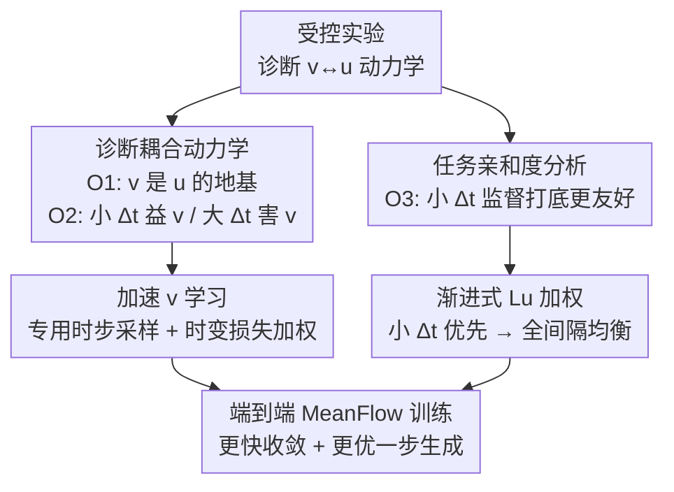

# Understanding, Accelerating, and Improving MeanFlow Training

**会议**: CVPR 2026  
**论文**: [CVF Open Access](https://openaccess.thecvf.com/content/CVPR2026/html/Kim_Understanding_Accelerating_and_Improving_MeanFlow_Training_CVPR_2026_paper.html)  
**代码**: https://github.com/seahl0119/ImprovedMeanFlow  
**领域**: 图像生成 / 少步生成 / Flow Matching  
**关键词**: MeanFlow, 少步生成, 瞬时速度, 平均速度, 训练动力学

## 一句话总结
本文通过受控实验拆解 MeanFlow 同时学习"瞬时速度 $v$ 与平均速度 $u$"时的训练动力学，发现 $v$ 必须先建立、且小时间间隔 $\Delta t$ 的 $u$ 监督有利而大间隔有害，据此设计了"先加速 $v$ 形成 + 渐进式 $L_u$ 加权（小间隔优先逐步过渡到全间隔均衡）"的训练方案，在同样 DiT-XL 骨干上把 1-NFE ImageNet 256×256 的 FID 从 3.43 降到 2.87，并实现约 2.5× 的收敛加速。

## 研究背景与动机
**领域现状**：扩散模型与 Flow Matching 在图像/视频/3D 生成上效果顶尖，但采样要走很多步、很贵。为了把推理压到一步或几步，早期靠从多步教师蒸馏出少步学生，需要两阶段训练、合成数据或教师-学生级联，复杂且脆弱。一致性模型（Consistency Models）开启了端到端训练少步生成器的路线，但与多步扩散仍有明显差距。

**现有痛点**：MeanFlow 是这条线里的佼佼者——它让单一网络同时学瞬时速度 $v$（单个时刻的速度场）和平均速度 $u$（一段时间区间上的积分速度），靠 MeanFlow 恒等式把两者耦合起来，从而用一步更新 $z_r = z_t-(t-r)\,u_\theta(z_t,r,t)$ 替代多步求解器。但 MeanFlow 训练很贵，而且大家对它"为什么 work"只有很浅的理解：$v$ 和 $u$ 这两个耦合的速度场在训练中到底怎么相互影响、怎么协调才能拿到高质量一步生成，几乎没人说清。

**核心矛盾**：标准 MeanFlow 从头到尾用同一个固定损失和采样方案，完全无视 $v$ 与 $u$ 之间复杂的依赖关系。这种"一视同仁"的目标会干扰早期合理 $v$ 的形成，而 $v$ 没建好又会拖累 $u$ 的学习，最终既慢又达不到该模型/数据本应有的上限。

**本文目标**：先把 $v$↔$u$ 的训练动力学搞清楚（理解），再据此设计能加速收敛、提升一步生成质量的训练策略（加速 + 改进），而且要保持 MeanFlow 端到端、单阶段的简洁性。

**切入角度**：作者不去改 MeanFlow 的目标函数（这是与 AlphaFlow、CMT 等并发工作的关键区别——前者软化目标、后者拆成多阶段），而是用一系列受控实验去测量 $v$-loss 与 $u$-loss、以及不同时间间隔 $\Delta t$ 之间的相互作用，把"经验观测"翻译成"训练课程"。

**核心 idea**：用"先打地基再盖楼"的课程——早期猛攻瞬时速度 $v$、并让平均速度监督只在小 $\Delta t$ 上发力，随训练推进再逐步把权重铺到大 $\Delta t$（一步生成真正需要的部分）。

## 方法详解
本文的"方法"由两半组成：前半是**分析**（用受控实验得出三条关于训练动力学的观测），后半是把观测翻译成的**训练改进**（两个即插即用的组件）。整体框架就是"分析 → 课程"这条逻辑链。

### 整体框架
作者先用 DiT-B/4 + ImageNet 256×256 做一批受控实验，得到三条核心观测：（O1）瞬时速度 $v$ 必须早早建立，因为它是学习平均速度 $u$ 的地基——$v$ 没形成好或被污染，$u$ 的学习直接崩；（O2）平均速度监督的时间间隔 $\Delta t=t-r$ 决定它对 $v$ 的影响方向：小 $\Delta t$ 帮助 $v$ 的形成与精炼，大 $\Delta t$ 则破坏已有的 $v$；（O3）任务亲和度分析表明，先用小间隔监督打底，会给"后续学习一步生成所需的大间隔 $u$"创造更友好的初始化。

标准 MeanFlow 对这些一无所知，从一开始就用标准 $v$-loss、并在整个 $\Delta t$ 范围上同时训 $u$，于是踩中所有低效点。本文据此提出一个统一的训练策略，两个组件协同：① 借用扩散/流模型成熟的训练加速技术快速形成 $v$；② 对 $u$-loss 做渐进式加权，早期偏向小 $\Delta t$、随训练逐步过渡到全 $\Delta t$ 均匀加权。两者贯穿整个训练过程，不引入额外阶段，保持端到端。

### 关键设计

**1. 诊断 v↔u 耦合动力学：先证明"地基"假说，再量化间隔的双刃效应**

要回答"$v$ 和 $u$ 谁先谁后、怎么互相影响"，作者设计了两组对称实验。正向：做两阶段训练——先只用 $v$-loss 预训练，再切到 $u$-loss 微调，固定 $u$ 微调 60 epoch、变 $v$ 预训练 {0,5,10,15,20} epoch（以及固定 80 epoch 总预算下变分配），用 1-NFE FID 衡量 $u$ 质量。结果是投入越多 $v$ 预训练、$u$ 学得越稳越准，即使总算力固定，早投 $v$ 也更高效。反向：在 MeanFlow 训练里故意往 $v$-loss 的目标速度注入高斯噪声（幅度按 $k\cdot\|v_t(z_t\mid\epsilon)\|$ 缩放）来污染 $v$，发现哪怕极小噪声（$k=0.03$）都会让 $u$ 学习严重退化。两个方向合起来印证了 MeanFlow 的数学结构——$u$ 是 $v$ 的时间积分（恒等式 $u(z_t,r,t)\triangleq \frac{1}{t-r}\int_r^t v_t(z_\tau,\tau)\,d\tau$），$v$ 不立住，$u$ 无从谈起。这就是 O1。

接着量化 $\Delta t$ 的作用（O2）：从"$v$ 预训练 40 epoch"或"随机初始化"出发，各用 $u$-loss 微调 40 epoch，但把 $\Delta t$ 限制在 $[0.1,0.3]$、$[0.3,0.5]$、$[0.5,0.7]$、$[0.7,0.9]$ 四档之一，用 $v(z_t,t)=u_\theta(z_t,t,t)$ 取出 $v$、以 32-NFE FID 评估。结论很对称：小 $\Delta t\in[0.1,0.3]$ 的 $u$ 监督既能从零构造出可用的 $v$（FID 媲美 40 epoch 纯 $v$ 预训练），又能进一步精炼已有 $v$；而大 $\Delta t$ 监督既造不好 $v$、还会严重破坏已经预训练好的 $v$。这就给出了第一条训练戒律：早期要压制大 $\Delta t$ 监督。

**2. 任务亲和度分析（TAS）锁定课程顺序**

O1 说要早建 $v$，O2 说小 $\Delta t$ 也能帮 $v$，于是早期有两条路：纯 $v$-loss，或带小 $\Delta t$ 的 $u$-loss。哪条更能为后续大 $\Delta t$ 学习铺路？作者借任务亲和度分数（Task Affinity Score, TAS）来判——TAS 衡量两个任务能多平滑地联合训练、冲突有多小。在三种初始化下（随机；策略 1：纯 $v$-loss 预训练 40 epoch；策略 2：小 $\Delta t\in[0.1,0.3]$ 的 $u$-loss 预训练 40 epoch）计算 $v$-loss 与各 $\Delta t$ 档 $u$-loss 之间的 TAS。结果是两种预训练都比随机初始化在所有 $\Delta t$ 档上 TAS 更高，但策略 2（小 $\Delta t$）对大 $\Delta t$ 区间表现出更强的亲和度。这就是 O3：与其纯学 $v$，不如让小 $\Delta t$ 监督早早进来——它给"后续把 $u$ 扩展到大间隔（一步生成最终所需）"提供了更友好的初始化。这三条观测共同定下了课程的形状：早期 = 立 $v$ + 小间隔，后期 = 平滑铺向大间隔。

**3. 加速 v 学习：专用时步采样 + 时变损失加权**

把 O1 落地，需要让 $v$ 尽快形成。作者直接搬用扩散/流训练里成熟的加速技术，分两类：其一是专用时步采样，把式 (4) 里 $t$ 的基础采样替换成定制分布 $p_{\text{acc}}(t)$；其二是时变损失加权，对 $v$-loss 乘一个时间相关权重 $\alpha(t)$，即把对应项改成 $\alpha(t)\cdot L_v(z_t,t)$。两者的具体形式都取自已有加速方法（MinSNR、DTD 等），目的是把训练算力集中到更关键的时步上，从而更快建立瞬时速度。实现上作者每类各选一个代表：损失加权用 MinSNR，时步采样用 DTD——并最终把 DTD 选作主力（理由见下方关键发现）。

**4. Progressive $L_u$ weighting：小间隔优先、渐进过渡到全间隔均衡**

把 O2、O3 落地，需要让 $u$ 监督的"间隔分布"随训练演化。作者对 $L_u(z_t,r,t)$ 施加权重

$$\beta(\Delta t, s) = 1 - s + \lambda s\,(1-\Delta t),$$

其中 $s\in[0,1]$ 表示训练进度（用线性调度 $s=1-i/T$，$i$ 为当前迭代、$T$ 为总迭代）。初始 $s=1$ 时 $\beta(\Delta t,1)=\lambda(1-\Delta t)$，偏向小 $\Delta t$；收敛时 $s=0$ 则 $\beta(\Delta t,0)=1$，对所有间隔一视同仁。为保证初始期望权重不变，取 $\lambda=1/\mathbb{E}_{\Delta t}[1-\Delta t]$。调度速度可由 $s=1-(i/T)^k$ 控制：$k>1$ 过渡更慢、$k<1$ 更快，但实验显示线性 $k=1$ 最佳。这一项让早期权重压在小间隔上（巩固 $v$、为大间隔学习预热），后期平滑放开到大间隔——而大间隔正是少步推理的命脉。

### 损失函数 / 训练策略
基础目标仍是 MeanFlow 的统一损失，按 $t=r$ 与否拆成瞬时速度项与平均速度项：

$$L_{MF}=\mathbb{E}_{x,\epsilon,t,r}\big[L_u(z_t,r,t)\cdot\mathbb{I}(t\neq r)+L_v(z_t,t)\cdot\mathbb{I}(t=r)\big].$$

本文的两个改动叠加其上：$v$ 项替换为 $\alpha(t)\cdot L_v(z_t,t)$ 并配合采样分布 $p_{\text{acc}}(t)$，$u$ 项乘以 $\beta(\Delta t,s)$。两者都是即插即用，不改 MeanFlow 目标本身，也兼容 MeanFlow 原有的稳定化技巧（自适应损失归一、CFG 混合等，集成细节见原文附录 B）。实验遵循 MeanFlow 原始 setup，在 ImageNet 256×256、DiT 架构上训练，用 50K 样本的 1-NFE / 2-NFE FID 评估。

## 实验关键数据

### 主实验
ImageNet 256×256 类别条件生成，1-NFE / 2-NFE FID（越低越好），240 epoch（除非另注）：

| 模型 / 设置 | 参数量 | 1-NFE FID | 2-NFE FID |
|------|------|------|------|
| MeanFlow-B/4 | 131M | 11.58 | 7.85 |
| + Ours w MinSNR | 131M | **9.87** | **7.08** |
| MeanFlow-L/2 | 459M | 3.84 | 3.35 |
| + Ours w DTD | 459M | **3.47** | **3.24** |
| MeanFlow-XL/2 | 676M | 3.43 | 2.93 |
| + Ours w DTD | 676M | **2.87** | **2.64** |

在 DiT-XL 上把 1-NFE FID 从 3.43 降到 2.87（约 16% 相对下降），2-NFE 从 2.93 降到 2.64，显著缩小了一步生成与多步扩散（如 SiT-XL/2 的 2.06）之间的差距。收敛速度上，DiT-XL/2、L/2、M/2 分别取得约 2.5×、2.3×、2.1× 加速；DiT-XL 在 120 epoch 时的样本质量已可比肩 vanilla MeanFlow 240 epoch 的结果。

### 消融实验
组件消融（DiT-B/4，1-NFE / 2-NFE FID）：

| 配置 | 1-NFE FID | 2-NFE FID | 说明 |
|------|------|------|------|
| MeanFlow-B/4（vanilla） | 11.58 | 7.85 | 基线 |
| + MinSNR | 10.57 | 7.38 | 仅加速 $v$（损失加权） |
| + DTD | 10.96 | 7.55 | 仅加速 $v$（时步采样） |
| + $L_u$ weighting | 10.98 | 7.58 | 仅渐进 $u$ 加权 |
| + MinSNR + $L_u$ weighting | **9.87** | **7.08** | 完整（最佳） |
| + DTD + $L_u$ weighting | 10.20 | 7.31 | 完整 |

两个组件各自都能改进 vanilla（加速 $v$ 把 11.58 降到 10.57/10.96，渐进加权降到 10.98），组合后达到最优（9.87），说明二者互补：加速组件快速立起 $v$ 地基，渐进加权驱动有效的 $u$ 学习。

调度参数 $k$ 与多步生成（DiT-B/4，1-NFE FID）：

| 实验 | 配置 | FID↓ | 关键点 |
|------|------|------|------|
| 调度 $k$（$s=1-(i/T)^k$） | $k=0.5$ | 11.16 | 过渡偏慢 |
| | $k=1$（线性） | **10.20** | 最佳 |
| | $k=2$ | 11.44 | 过渡偏快变差 |
| 多步生成（用 $u_\theta(z_t,t,t)$ 当 $v$） | MeanFlow 32-NFE | 7.61 | 基线 |
| | + Ours w MinSNR 32-NFE | **7.09** | $v$ 质量更高 |

### 关键发现
- **两个组件缺一不可且互补**：只加速 $v$ 或只做渐进加权都只是小幅改进，必须合起来才有质变（11.58 → 9.87），印证了"先立 $v$ 地基、再铺 $u$ 间隔"的逻辑。
- **DTD（时步采样）比 MinSNR（损失加权）更适合做主力**：MinSNR 在小模型 DiT-B/4 上更强，但在 L/2、M/2 上优势消失。原因是 MeanFlow 自带按损失范数归一的自适应加权，MinSNR 这类损失加权会干扰它、降低跨尺度鲁棒性；而 DTD 只改采样分布、不动损失加权，兼容性更好，因此被选作主力。
- **线性调度就够好**：$k=1$ 优于更慢（$k<1$）或更快（$k>1$）的过渡，说明小→大间隔的平滑均匀过渡是甜点。
- **加速确实提升了底层 $v$ 质量**：用 $u_\theta(z_t,t,t)$ 当瞬时速度做 32/64/128-NFE 多步生成，本文方法全面优于 MeanFlow，直接验证了"训练策略真的学到了更高质量的速度场"，而非仅靠拟合少步指标。
- **对 CFG 配置鲁棒**：在 DiT-L/XL 的多种 $\omega$、$\kappa$ 设置下都稳定提升（如 L/2 在 $\kappa=0.92,\omega=2.5$ 下 1-NFE 3.84→3.47）。

## 亮点与洞察
- **"理解先于改进"的范式很扎实**：本文最大的价值不是某个新模块，而是用一连串干净的受控实验（两阶段训练、噪声注入、$\Delta t$ 分档、TAS）把 MeanFlow 黑箱里 $v$↔$u$ 的因果关系测出来，再几乎"无脑"地把观测翻译成训练课程。这种"诊断→处方"的方法论可迁移到任何耦合多目标的生成训练。
- **不改目标、只改课程**：两个组件都是即插即用的加权/采样，不动 MeanFlow 目标本身，因此能直接叠加到现有实现上、几乎零额外成本，工程友好度极高——这与并发工作 AlphaFlow（改目标）、CMT（拆多阶段）形成鲜明对比。
- **"用 $u_\theta(z_t,t,t)$ 探测 $v$"是个好探针**：把 $r=t$ 代回平均速度网络就能读出模型当前的瞬时速度，作者反复用它（32-NFE FID）来量化 $v$ 质量，是个简洁可复用的诊断工具。
- **$\Delta t$ 的双刃性是反直觉洞察**：直觉上"多大间隔都练"应该更全面，但实验显示大间隔早期会主动破坏已学好的 $v$，这种自毁式动力学正是标准 MeanFlow 慢且差的根因。

## 局限与展望
- **加速技术是借来的、非本文原创**：$p_{\text{acc}}(t)$ 和 $\alpha(t)$ 直接取自 MinSNR/DTD 等已有扩散加速方法，本文贡献在"用对地方+配上渐进加权"，而非新的加速机制本身。
- **观测主要在 DiT-B/4 小模型上得出**：三条核心动力学结论的受控实验大多基于 DiT-B/4 + ImageNet 256，虽然在 L/XL 上验证了最终效果，但"$\Delta t$ 双刃性""TAS 排序"是否在更大模型/更高分辨率/其他数据集上同样成立，仍待检验。
- **调度形式较简单**：渐进权重用的是固定的线性 $s=1-i/T$ 与单参数 $k$，$\Delta t$ 的偏好仅由 $1-\Delta t$ 线性刻画；是否存在与数据/模型自适应的更优课程（如根据实时 $v$ 质量动态切换），论文未探索。
- **只在 ImageNet 类别条件生成上验证**：未涉及文生图、视频、3D 等更复杂条件，泛化性有待观察。

## 相关工作与启发
- **vs MeanFlow [18]**：MeanFlow 提供了端到端同时学 $v$、$u$ 的稳定框架，但用固定损失/采样、不管训练动力学。本文完全保留其目标，只在训练课程上动刀，把它的收敛和一步生成质量都往上推（3.43→2.87），是"理解并改良"而非另起炉灶。
- **vs AlphaFlow [79]**：AlphaFlow 把 MeanFlow 目标替换成软化版本；本文不动目标、只改训练策略，简洁性更高。
- **vs CMT [30]**：CMT 把学习拆成多个阶段；本文坚持端到端单阶段，靠渐进加权在同一训练里平滑完成"小间隔→大间隔"的课程切换。
- **vs Consistency Models [66] / Shortcut [16] / IMM [85]**：这些都是端到端少步生成的探索，但与多步扩散仍有差距；本文沿 MeanFlow 路线进一步把差距压窄，并指出少步生成器的训练效率仍有大量未开发潜力。
- **vs 扩散加速方法（MinSNR [25]、DTD [35] 等）**：这些原本用于加速标准扩散/流训练，本文把它们"借调"来专门加速 MeanFlow 里 $v$ 的形成，是已有技术在新结构上的精准复用。

## 评分
- 新颖性: ⭐⭐⭐⭐ 不是新模块，但"用受控实验解剖 $v$↔$u$ 动力学并翻译成训练课程"的视角和发现都很扎实、有启发。
- 实验充分度: ⭐⭐⭐⭐ 跨 B/M/L/XL 多尺度 + 组件/调度/CFG/多步多组消融，结论自洽；但观测主要在小模型、单数据集上得出。
- 写作质量: ⭐⭐⭐⭐⭐ "三条观测→两个组件"逻辑链清晰，分析与方法衔接紧密，易读。
- 价值: ⭐⭐⭐⭐ 即插即用、零额外成本就能给 MeanFlow 提速 2.5× 并降 FID，对少步生成训练实践很有用。

<!-- RELATED:START -->

## 相关论文

- [\[CVPR 2026\] MeanFlow Transformers with Representation Autoencoders](meanflow_transformers_with_representation_autoencoders.md)
- [\[CVPR 2026\] D2C: Accelerating Diffusion Model Training under Minimal Budgets via Condensation](d2c_diffusion_dataset_condensation.md)
- [\[CVPR 2026\] VDE: Training-Free Accelerating Rectified Flow Model via Velocity Decomposition and Estimation](vde_training-free_accelerating_rectified_flow_model_via_velocity_decomposition_a.md)
- [\[CVPR 2026\] Improving Controllable Generation: Faster Training and Better Performance via x0-Supervision](improving_controllable_generation_faster_training_and_better_performance_via_x0-.md)
- [\[CVPR 2026\] Temporal Equilibrium MeanFlow: Bridging the Scale Gap for One-Step Generation](temporal_equilibrium_meanflow_bridging_the_scale_gap_for_one-step_generation.md)

<!-- RELATED:END -->
