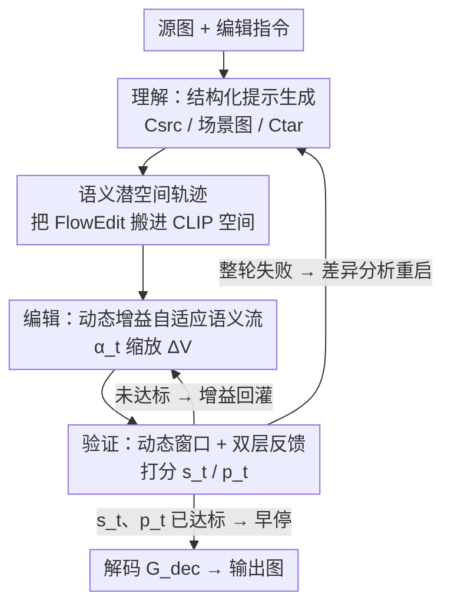

# UniEdit-I: Training-free Image Editing for Unified VLM via Iterative Understanding, Editing and Verifying

**会议**: CVPR 2026  
**论文**: [CVF Open Access](https://openaccess.thecvf.com/content/CVPR2026/html/Bai_UniEdit-I_Training-free_Image_Editing_for_Unified_VLM_via_Iterative_Understanding_CVPR_2026_paper.html)  
**领域**: 图像生成 / 图像编辑  
**关键词**: 免训练图像编辑, 统一VLM, 闭环反馈, 语义潜空间, FlowEdit

## 一句话总结
UniEdit-I 把统一视觉-语言模型（VLM）自己的语义潜空间（CLIP 特征）当作可编辑画布，引入「理解—编辑—验证」（UEV）闭环：用 VLM 解析指令、在 CLIP 空间走 FlowEdit 轨迹、再用 VLM 实时打分动态调节编辑强度并决定早停/重试，从而**无需任何微调或改结构**就在 GEdit-Bench 上做到开源最优、逼近 GPT-4o。

## 研究背景与动机

**领域现状**：统一 VLM（如 BLIP3-o、BAGEL、Step1X-Edit）想把「VLM 的高层语义理解」和「扩散模型的像素级生成」捏进一个模型里，做到理解与生成互相增强。在图像编辑任务上，主流做法是基于扩散模型：要么用 inversion 把图反演成噪声再重采样，要么用 attention 操控 / 优化式编辑，最近 FlowEdit 提出无需反演、直接在像素或 VAE 潜空间构造从源到目标的连续轨迹。

**现有痛点**：这些编辑方法都是**功能解耦、开环（open-loop）**的——沿一条预先设定的固定轨迹做静态变换，语义解释和视觉生成之间没有动态反馈。结果是编辑强度只能靠手调编辑窗口 $[n_{max}, n_{min}]$，要么改过头（over-edit）、要么改不够（under-edit）。更糟的是，FlowEdit 虽然让中间状态「可见」（每一步都是图像，理论上能让 VLM 看），但像素/VAE 空间的中间帧充满鬼影（ghosting）、物体形变、不自然纹理（论文 Fig. 2），VLM 看着这些残缺图根本给不出稳定可靠的反馈，于是「可观测」并不等于「可闭环」。

**核心矛盾**：统一 VLM 里有个根本的**表征鸿沟**——理解端用的是高层、语言对齐的语义编码器（CLIP / SigLIP），生成端用的是低层、保像素的自编码器（VAE）。两个特征空间错位，导致语义解释与视觉生成天然脱节；想让 VLM 既当生成器又当裁判，却没有一个两者都认的空间。

**本文目标**：让统一 VLM 不止做「事后评估」，而是把它的判断能力嵌进编辑过程本身，做成一个**实时自纠错的闭环编辑器**，且全程免训练、不改结构。

**切入角度**：作者借鉴 Representation Autoencoder（RAE）和 BLIP3-o 的思路——直接在预训练语义编码器的高层特征上做扩散建模。关键观察是：**在语义潜空间（CLIP 特征）里编辑，改的是「概念表征」而不是像素**，所以每一个中间状态都既语义连贯又视觉合理（干净、无鬼影）。这恰好把 FlowEdit 的「可见但脏」的中间帧变成「干净可判」的中间帧，闭环的前提就成立了。

**核心 idea**：把编辑轨迹整体搬进统一 VLM 的 CLIP 语义潜空间，再套一个「理解—编辑—验证」闭环，让冻结的 VLM 既是编辑器又是实时裁判，用它自己的多维语义反馈动态调节编辑强度、决定何时停何时重来。

## 方法详解

### 整体框架

UniEdit-I 的输入是源图 $I_{src}$ 加一句编辑指令 $q$，输出是编辑后的图 $I_{out}$，整条流水线被一个 **UEV（Understanding–Editing–Verifying）闭环**驱动，且全程在 BLIP3-o 的 CLIP 特征空间里跑：

先用 VLM **理解**——把源图和指令解析成结构化的源描述 $C_{src}$、场景图 $G$，再推出最小改动后的目标描述 $C_{tar}$ 和目标场景图 $G_{tar}$。然后把 FlowEdit 的无反演 ODE 轨迹**搬到 CLIP 语义空间**：从源图的 CLIP 特征 $Z_{src}$ 出发，沿时间倒推，每一步算源/目标条件下的语义速度差 $\Delta V(t_i)$ 来推进。**编辑**阶段不再用固定强度，而是每 $k=5$ 步根据验证反馈算一个自适应增益 $\alpha_t$ 去缩放 $\Delta V$。**验证**阶段把当前潜变量解码成图、喂回 VLM，产出全局对齐分 $s_t$ 和任务完成分 $p_t$：一方面回灌给编辑模块调增益，另一方面决定是否早停、或在整轮结束后基于差异分析重启一轮。最终最优潜变量 $Z_{edit}$ 经解码器 $G_{dec}$ 还原成像素图。

### 关键设计

**1. 在 CLIP 语义潜空间里编辑：把「可见但脏」的轨迹换成「干净可判」的轨迹**

这是全文的地基，针对的是「像素/VAE 空间中间帧太脏、VLM 没法稳定反馈」这个痛点。作者把 FlowEdit 的无反演 ODE 公式整体重解释到 BLIP3-o 的 CLIP 特征空间——之所以做得到，是因为 BLIP3-o 的生成过程本就把 CLIP 特征 $\hat{X}_1$ 当成解码成像素前的中间表征（先由文本生成视觉 query $Q_{cond}$，再用扩散 Transformer $D_\theta$ 合成 CLIP 特征，最后 $G_{dec}$ 解码），所以 CLIP 特征是个「原生可编辑、原生可解码」的画布。具体做法：用冻结视觉编码器提源图特征 $Z_{src}$，从 $Z^{UE}_{t_{nmax}} = Z_{src}$ 起按时间倒推，每步构造与 FlowEdit 对应的噪声共享探针

$$Z_{src}(t_i) = (1-\lambda(t_i))Z_{src} + \lambda(t_i)\epsilon(t_i), \quad Z_{tar}(t_i) = Z_{edit}(t_i) + Z_{src}(t_i) - Z_{src}$$

再查同一个 $D_\theta$ 算源/目标条件下的语义速度差 $\Delta V(t_i) = V(Z^{tar}_{t_i}, t_i, C_{tar}) - V(Z^{src}_{t_i}, t_i, C_{src})$，用 Euler 积分推进 $Z^{UE}_{t_{i-1}} = Z^{UE}_{t_i} + (t_{i-1}-t_i)\cdot\alpha_{t_i}\cdot\Delta V(t_i)$。为什么有效：因为改的是概念表征而非像素，每个中间 $Z^{UE}_t$ 解码出来都是干净、无鬼影的图（论文 Fig. 2），这就把开环编辑变成了「每一步都可被 VLM 稳定打分」的闭环轨迹——后面所有反馈机制才有立足点。

**2. 理解：结构化提示生成，把模糊指令落到可执行的最小改动**

针对的痛点是「用户往往只给目标指令、不给源描述」，以及「改动范围不明确容易牵连无关区域」。UniEdit-I 用 VLM 在一次前向里产出两个结构化输出：场景感知的源描述 $C_{src}$（在编辑类型 $\tau$ 如「属性改变」「物体替换」的引导下，特意把潜在可编辑元素都写进去）和场景图 $G=(V,E)$（物体节点带属性、边表空间关系，如「猫在沙发上」）。接着解析指令 $q$，对 $C_{src}$ 做**token 级最小修改**得到目标描述 $C_{tar}$，同步把 $G$ 改成 $G_{tar}$（只动相关节点/边，保留所有未修改关系）。三元组 $\{C_{src}, C_{tar}, G_{tar}\}$ 同时给编辑和验证当结构化语义监督。为什么有效：把「把狗换成猫」这种指令显式拆成「只改 dog→cat、其余 sofa/vase/blue 全保」，既给了轨迹明确的源/目标条件，又天然约束了编辑范围，避免开环方法那种全局漂移。

**3. 编辑：动态增益自适应语义流，用实时进度决定改多猛**

针对的痛点是 FlowEdit 在固定窗口内用**均匀偏移**、强度一成不变——已经对齐了还在改（过编辑），或者该精修时又劲不够（欠编辑）。UniEdit-I 每 $k=5$ 个扩散步从验证模块拿一次反馈，算出下一段的自适应增益：

$$\alpha_t = \alpha_{base}\cdot\sigma(\kappa_1\Delta s_t)\cdot(1-p_t)$$

其中 $\alpha_{base}=1.0$ 是名义强度；$\Delta s_t = s_t - s_{prev}$ 是自上次反馈以来全局语义对齐的**改善量**；$p_t\in[0,1]$ 是任务完成分，反映当前输出多接近满足指令；$\sigma(\cdot)$ 是 sigmoid（$\kappa_1=15$），在对齐还在改善（$\Delta s_t>0$）时放大增益、否则压制。这个增益在接下来一段 $[t, t-k)$ 内均匀作用于式 (7)。为什么有效：$\sigma(\kappa_1\Delta s_t)$ 让「语义还在往目标走」时大胆改、走不动了就收手，$(1-p_t)$ 让「越接近完成、改得越轻」，两项合起来实现**由粗到细**的编辑（前期猛推语义、后期温柔精修），而且整个过程不依赖任何预设编辑窗口、纯由语义反馈驱动。

**4. 验证：动态窗口 + 双层反馈，让 VLM 当编辑的指挥而非裁判**

针对「该编辑多久」这个本来靠手调的问题。验证模块每 $k=5$ 步把当前潜变量解码成图 $I_t = G_{dec}(Z^{UE}_t)$，喂冻结 VLM 产出两个信号：全局对齐分 $s_t$（用 CLIP-Sim 对 $C_{tar}$）和任务完成分 $p_t$（语言提示打 0–1 分）。这俩信号一方面回灌设计 3 调增益，另一方面**门控编辑窗口**，形成两层反馈：① **轨迹内早停**——若 $s_t>0.85$ 且 $p_t>0.9$ 连续两个反馈点都满足，立刻停止去噪，得到一个可能远早于 $t=0$ 的数据自适应窗口 $[T, t_{stop}]$；② **跨轮重试**——若最终输出没过阈值（$s_0<0.85$ 或 $p_0<0.9$），让 VLM 生成差异分析（如「日落太暗、缺少云」）转成纠正指令 $q_{new}$，整个 UEV 闭环从最优中间潜变量 $Z^{UE}_{t^*}$（$t^*=\arg\max_t s_t$）重启。为什么有效：早停避免过编辑、省算力，重试兜底难样本，VLM 从被动评估者变成主动指挥者，整套系统「编得聪明又编得彻底」。

## 实验关键数据

实验全程用公开的 **BLIP3-o-8B** 当统一 VLM，扩散步数 $T=30$，源/目标 CFG 各 2.0 / 5.5，最多 3 轮 UEV 迭代；除非特别说明，指标都报在 GEdit-Bench 英文子集上，用官方 VIEScore 系统（语义质量 SQ、感知质量 PQ、总分 O，10 分制）。

### 主实验

GEdit-Bench-EN 全集对比：UniEdit-I 在**完全免训练、不改结构**的前提下拿到开源最优总分，超过 Step1X-Edit、BAGEL、OmniGen2 这些大规模训练的编辑器，总分逼近私有的 GPT-4o。

| 类型 | 模型 | G_SC ↑ | G_PQ ↑ | G_O ↑ |
|------|------|--------|--------|-------|
| 私有 | GPT-4o | 7.85 | 7.62 | 7.53 |
| 开源 | Instruct-Pix2Pix | 3.58 | 5.49 | 3.68 |
| 开源 | OmniGen | 5.96 | 5.89 | 5.06 |
| 开源 | Step1X-Edit | 7.09 | 6.76 | 6.70 |
| 开源 | BAGEL | 7.36 | 6.83 | 6.52 |
| 开源 | OmniGen2 | 7.16 | 6.77 | 6.41 |
| 开源 | **UniEdit-I（本文）** | 7.16 | **7.40** | **7.06** |

值得注意的是感知质量 PQ（7.40）是所有开源方法里最高、甚至接近 GPT-4o，这正印证了「语义空间中间帧干净」带来的视觉收益；而它在 **text change（文字编辑）任务上明显偏弱**，作者归因于继承了底层 BLIP3-o 语义空间对细粒度文字概念的覆盖不足。

### 消融实验

**增益策略消融**（均在 CLIP 空间 + 动态窗口下，只变增益逻辑）：

| 增益策略 | SQ ↑ | PQ ↑ | O ↑ |
|----------|------|------|-----|
| 固定增益（$\alpha_t=1.0$，即 FlowEdit） | 5.87 | 7.39 | 5.66 |
| 线性衰减（$\alpha_t=1.0-0.03t$） | 6.16 | 7.42 | 5.97 |
| 动态增益（去掉 $p_t$，只用 $\Delta s_t$） | 6.73 | 7.38 | 6.77 |
| **完整动态增益（本文）** | **7.16** | 7.40 | **7.06** |

**语义空间 vs VAE 空间**（100 样本均值，验证「为什么必须在语义空间」）：

| 潜空间 | 伪影评分 ↑ | 反馈稳定性 ↓ |
|--------|-----------|-------------|
| VAE (FLUX) | 5.35 ± 1.02 | 0.063 |
| CLIP (BLIP3-o) | **8.10 ± 0.53** | **0.025** |

> ⚠️ 表 2 的反馈稳定性列与正文叙述数字对不上：表中 CLIP 的 std=0.025、VAE 的 std=0.063（CLIP 更稳，符合「↓越小越好」），但正文却写成「VAE std=0.025、CLIP std=0.063」。按「语义空间更稳」的核心结论，应以表格数值为准（CLIP=0.025 更稳），以原文为准。

### 关键发现
- **去掉任务完成分 $p_t$ 掉点最多**：从完整版的 O=7.06 掉到 6.77，因为系统失去「何时算编辑完成」的判断，会偶发过编辑；而固定增益（FlowEdit 式）直接掉到 5.66。说明「对齐改善量 $\Delta s_t$ + 完成感知 $p_t$」两项缺一不可。
- **语义空间是闭环的必要条件而非偏好**：CLIP 空间伪影评分 8.10 远高于 VAE 的 5.35，干净的中间帧才让 VLM 反馈稳定、增益控制可靠——这是把开环变闭环的物理前提。
- **早停高效收敛**：97.6% 样本在第一遍去噪轨迹内就到最优输出（$t=20$ 时 26.6%、$t=15$ 时 23.7%），仅 2.5% 需要 1 轮重试，整体 100% 收敛，说明实时验证驱动的动态窗口确实省了大量无效去噪步。
- **靠改验证提示就能适配多种任务**：抽象指令（「让它有秋天感」被落地成「红黄落叶」）、多指令复合编辑、用户偏好权衡（「重语义准确」vs「保原始特征」）都不用动核心算法，只调验证 prompt。

## 亮点与洞察
- **把「评估能力」嵌进生成回路是最漂亮的一招**：作者的核心信念——「一个模型若能理解指令并生成图，它就该能判断生成是否忠于意图，并用这个判断反过来操控生成」——把 VLM 从事后裁判变成在线指挥，这是「反思式生成系统」的范式雏形，思路可迁移到视频编辑、3D 编辑等任何「生成器自带判别能力」的统一模型。
- **语义空间的双重红利**：在 CLIP 特征上编辑既保证中间帧干净（视觉收益，PQ 高），又让 VLM 反馈稳定（控制收益，增益可靠）——一个换空间的设计同时解了「画质」和「可控」两个问题，很省。
- **完全免训练、即插即用**：不改任何参数、不训练任何配对编辑数据，纯靠冻结 BLIP3-o + 提示工程 + ODE 重解释就逼近 GPT-4o，对任何已有统一 VLM 都几乎零成本套用。

## 局限与展望
- **继承底座 VLM 的偏见与覆盖缺口**（作者承认）：方法吃 BLIP3-o 的语义表征，底座对罕见概念、细粒度属性覆盖不足会直接传导进编辑——这正是 text change 任务掉点的根因。
- **强依赖「CLIP 特征原生可解码」这一架构特性**：方法成立的前提是 BLIP3-o 这类「先生成 CLIP 特征再解码」的统一 VLM；对那些不显式产出可解码语义特征的统一 VLM（如纯离散 token AR 架构）能否照搬，论文没验证，普适性存疑。
- **反馈靠 VLM 自评，可能自我确认偏差**：$s_t$、$p_t$ 都来自同一个冻结 VLM，既当运动员又当裁判，若底座对某类编辑的「自我打分」本身有偏，早停/重试阈值（0.85 / 0.9）就可能误判；引入独立判别器或人类校准的阈值或许更稳。
- **超参 $\kappa_1=15$、$k=5$、3 轮上限**等似乎是经验设定，论文未给敏感性分析，跨数据集迁移时是否需要重调未知。

## 相关工作与启发
- **vs FlowEdit**：FlowEdit 在像素/VAE 空间构造无反演轨迹、用固定增益开环编辑，中间帧有鬼影且强度靠手调窗口；UniEdit-I 把同一套 ODE 搬进 CLIP 语义空间（中间帧干净），并用 VLM 实时反馈把固定增益换成动态增益 + 动态窗口，从开环升级成自纠错闭环。
- **vs Step1X-Edit / BAGEL / OmniGen2（统一 VLM 编辑器）**：它们靠大规模配对编辑数据训练才拿到强 in-context 编辑能力；UniEdit-I 第一个做到**免训练**，把冻结 VLM 当编辑过程的主动 agent，零参数更新就超过这些训练过的开源编辑器。
- **vs RAE / BLIP3-o（语义潜空间扩散）**：RAE、BLIP3-o 证明可在预训练语义编码器的高层特征上做扩散、统一理解与生成；UniEdit-I 借用这个语义空间，但进一步指出「高质量语义潜空间不仅利于生成，更是可靠**闭环编辑**的必要条件」，把它从生成基底推广成「反思式编辑」的基底。

## 评分
- 新颖性: ⭐⭐⭐⭐⭐ 首个免训练、闭环、纯语义空间的统一 VLM 编辑框架，「把 VLM 评估能力嵌进生成回路」是有范式价值的新思路。
- 实验充分度: ⭐⭐⭐⭐ 主结果 + 增益消融 + 空间对比 + 收敛分布齐全且自洽，但只在单一底座 BLIP3-o-8B、单一 benchmark（GEdit-Bench）上验证，缺多底座/多 benchmark 与超参敏感性。
- 写作质量: ⭐⭐⭐⭐ 动机递进清晰、公式完整、图示到位；扣分在表 2 反馈稳定性数值正文与表格自相矛盾。
- 价值: ⭐⭐⭐⭐⭐ 免训练即插即用、逼近 GPT-4o，对任何「特征可解码」的统一 VLM 几乎零成本套用，落地价值高。

<!-- RELATED:START -->

## 相关论文

- [\[CVPR 2026\] Dynamic-eDiTor: Training-Free Text-Driven 4D Scene Editing with Multimodal Diffusion Transformer](dynamic-editor_training-free_text-driven_4d_scene_editing_with_multimodal_diffus.md)
- [\[CVPR 2026\] HP-Edit: A Human-Preference Post-Training Framework for Image Editing](hp-edit_a_human-preference_post-training_framework_for_image_editing.md)
- [\[CVPR 2026\] Language-Free Generative Editing from One Visual Example](language-free_generative_editing_from_one_visual_example.md)
- [\[ICLR 2026\] Training-Free Reward-Guided Image Editing via Trajectory Optimal Control](../../ICLR2026/image_generation/training-free_reward-guided_image_editing_via_trajectory_optimal_control.md)
- [\[CVPR 2026\] Understanding, Accelerating, and Improving MeanFlow Training](understanding_accelerating_and_improving_meanflow_training.md)

<!-- RELATED:END -->
