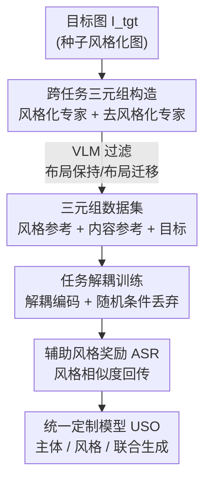

# Unified Customized Generation by Disentangled Reward Modeling

**会议**: CVPR 2026  
**论文**: [CVF Open Access](https://openaccess.thecvf.com/content/CVPR2026/html/Wu_Unified_Customized_Generation_by_Disentangled_Reward_Modeling_CVPR_2026_paper.html)  
**代码**: https://github.com/bytedance/USO  
**领域**: 扩散模型 / 定制化生成  
**关键词**: 主体定制, 风格定制, 跨任务解耦, 奖励学习, 扩散 Transformer

## 一句话总结
USO（Unified Simultaneous Optimization）把"主体驱动生成"和"风格驱动生成"当作互补任务统一进一个 DiT 模型，先用两个专家模型构造跨任务三元组数据、再用解耦编码 + 随机条件丢弃 + 辅助风格奖励联合训练，在主体一致性、风格相似度、文本可控性三方面同时刷到开源 SOTA。

## 研究背景与动机

**领域现状**：定制化图像生成（customized generation）现在分成两条互不相干的支线——主体驱动（subject-driven，从参考图里抠出"这个人/这个物体长什么样"再换场景）和风格驱动（style-driven，从参考图里抠出"这种画风/笔触"再画新内容）。两条线各自堆方法：风格侧有 DEADiff（QFormer 只查询风格特征）、CSGO（构造内容-风格-风格化三元组）、StyleStudio（风格化 CFG）；主体侧有 RealCustom（双推理把主体特征注入特定区域）、UNO（利用 DiT 的 in-context 能力滚动提纯数据和模型）。

**现有痛点**：图像作为视觉条件天生是"噪声很多"的——一张参考图同时夹带风格、外观、布局、身份等一大堆特征，但某个具体任务只需要其中一种。所以这类任务的根本难点是**精确地"该要的全要、不该要的全排除"**：风格任务要风格、排掉主体外观；主体任务正好反过来。但现有方法都是**单任务孤立地做解耦**——给每个任务单独设计数据集或模型结构，风格方法的解耦分析往往绑死在特定架构上、迁不动。

**核心矛盾**：每个任务其实都在学两件事——"包含哪些特征"和"排除哪些特征"，而一个任务要排除的特征，恰恰是另一个互补任务要包含的特征。孤立训练时，模型只学会了"包含"那一半，"排除"那一半学得很虚，解耦自然不彻底。

**本文目标**：把主体驱动和风格驱动放进同一个框架联合建模，让两者**互相增强**——主体任务学会"提取并保留主体外观"的能力，反过来能帮风格任务更干净地"排除主体外观"，从而把两边的解耦都做得更精确。

**核心 idea**：提出**跨任务协同解耦（cross-task co-disentanglement）**范式——通过一条"主体模型造风格数据 → 风格奖励训主体模型"的循环数据-模型管线，把两个任务在一个 DiT 里统一优化。

## 方法详解

### 整体框架

USO 的整条管线是一个"数据-模型"循环：先用现成的主体定制模型当种子，造出高质量的跨任务三元组数据（subject-for-style），再用这批数据 + 风格奖励训出一个更强的统一模型（style-for-subject）。具体拆成三步：**① 跨任务三元组构造**——用一个风格化专家和一个去风格化专家，从同一张目标图反推出"风格参考图"和"去风格的内容参考图"，组成 `<风格参考, 去风格主体参考, 风格化目标>` 三元组，并区分布局保持 / 布局迁移两种；**② 任务解耦训练**——把主体任务当主任务、风格任务当辅助任务，用不同编码器分别处理风格图（SigLIP + 层次投影器）和内容图（冻结 VAE），再用随机条件丢弃迫使模型同时会做单任务和多任务；**③ 辅助风格奖励（ASR）**——在线计算生成图与风格参考图的风格相似度作为奖励信号回传，强化模型"提取目标特征"的能力。

### 关键设计

**1. 跨任务三元组构造：用两个反向专家把"目标图"拆回"风格参考 + 内容参考"**

统一训练需要 `<风格参考, 内容参考, 目标>` 这种三元组，但现实里没有现成的对齐数据，而且已有工作（CSGO、OmniStyle）造的三元组都死守原始布局，主体没法换姿势、换空间排布。USO 的做法是**从一张目标风格化图 $I_{tgt}$ 反向造出两个参考**：用一个**风格化专家**（在精选风格数据上微调 UNO 得到的 UNO-SFT）合成对应的风格参考 $I_{ref}^s$——它能在不泄漏内容的前提下产出高风格相似度的图；再用一个**去风格化专家**（冻结的 FLUX.1 Kontext dev，借它强大的指令编辑能力）把风格化图反演成写实照片，得到内容参考 $I_{ref}^c$，且这一步**可以选择保持布局、也可以主动迁移布局**。最后用一个 VLM 过滤器卡住 $I_{tgt}$ 与 $I_{ref}^s$ 的风格相似度、以及 $I_{tgt}$ 与 $I_{ref}^c$ 的主体一致性，产出两类三元组：**布局保持（layout-preserved）**和**布局迁移（layout-shifted）**。布局迁移三元组是关键——它逼着网络在空间排布改变、主体换姿势的情况下仍要注入目标风格、保住主体一致，这正是单任务数据给不了的"跨场景解耦"信号。作者基于公开授权数据 + T2I 合成共构造了约 20 万风格化图对。

**2. 任务解耦训练：分流编码 + 随机条件丢弃，让一个模型同时会单任务和多任务**

把主体图和风格图一股脑塞进同一个编码器，两类特征会纠缠在一起。USO 从一个预训练 T2I 模型出发改成 TI2I（文本+图像→图像），**用不同编码器处理不同类型的条件图**：风格图走语义编码器 SigLIP——但风格任务有个特殊矛盾，既要高层语义来承接大几何形变（如 3D 卡通），又要低层细节来还原笔触（如铅笔素描），所以作者加了一个轻量**层次投影器** $M_{Proj}(\cdot)$ 把 SigLIP 各层的多尺度特征拼起来：

$$z_s = \text{Concatenate}(M_{Proj}(\{c_i\}_{i=1}^{N}))$$

其中 $\{c_i\}$ 是 SigLIP 第 $i$ 层的嵌入。内容/主体图则走冻结的 VAE 编码器 $\mathcal{E}(\cdot)$ 编成纯条件 token $z_c$。训练时只解冻层次投影器、用 LoRA 微调 DiT，并以概率 $p=0.25$ **随机丢掉风格参考或主体参考之一**，逼模型退化成纯主体生成或纯风格迁移。这一招既保住了单任务能力、又把网络暴露在多任务场景下，端到端学出解耦表示。最终多模态输入序列为：

$$z_2 = \text{Concatenate}(z_s, c, z_t, z_c)$$

风格 token $z_s$ 与文本 token $c$ 共用位置索引，内容 token 则用 UNO 的 UnoPE 对角布局取位置——同一个模型因此能无缝处理主体、风格两类任务。

**3. 辅助风格奖励（ASR）：只给风格奖励，却同时把身份一致性也带上去**

本文最核心的洞察是——"学会为一个任务包含目标特征"会帮互补任务"压制这些特征"。为了把这条洞察落到优化里，作者给辅助的风格任务加了**辅助风格奖励 ASR**，并观察它怎么反过来提升主体一致性。ASR 在"算奖励分"和"回传奖励信号"之间交替。和传统 ReFL（在 T2I 里主要奖励文本契合度或观感）不同，ASR 是为"参考图→图"场景定制的：它直接计算**在线输出 $\hat{I}_0$ 与风格参考图 $I_{ref}^s$ 的风格相似度**（用 VLM 过滤器或 CSD 模型 $M_{RM}(\cdot)$ 度量）当奖励，奖励损失为：

$$L_{ASR} = \mathbb{E}[\omega(M_{RM}(I_{ref}^s, \hat{I}_0))]$$

其中 $\omega$ 把奖励分映射成逐样本损失。为防止 reward hacking，联合保留原始的 Flow-Matching 目标 $L_{Pre} = \mathbb{E}_{x_0,t,\omega}[w(t)\|v_\theta - v_t\|^2]$，总目标为：

$$L = L_{Pre} + \lambda L_{ASR}, \quad \lambda = 0 \text{ (step} < S), \ \lambda = 1 \text{ (thereafter)}$$

即先用纯生成目标热身到第 $S$ 步、再开启奖励。最妙的地方是：**全程只用风格奖励、不加任何身份/主体的监督信号，统一模型的身份一致性（CLIP-I）却也跟着涨了**——这直接验证了"互补任务相互增强"的动机。

### 损失函数 / 训练策略
总损失 $L = L_{Pre} + \lambda L_{ASR}$；Flow-Matching 重建损失全程在线，ASR 在第 $S$ 步后才用 $\lambda=1$ 接入。训练只解冻层次投影器 + 对 DiT 做 LoRA 微调，条件丢弃概率 $p=0.25$。

## 实验关键数据

### 主实验
作者构造了 USO-Bench（50 内容图 × 50 风格参考 + 30 主体提示 + 30 风格提示，三类任务共数万样本），并在 DreamBench 上额外评测。指标：主体一致性（CLIP-I / DINO）、风格相似度（CSD）、文本对齐（CLIP-T）。

| 任务 | 指标 | USO | 次优基线 | 说明 |
|------|------|------|----------|------|
| 主体驱动 | CLIP-I ↑ | **0.647** | 0.605 (UNO) | 主体一致性最高 |
| 主体驱动 | DINO ↑ | **0.804** | 0.789 (UNO) | 主体一致性最高 |
| 风格驱动 | CSD ↑ | **0.556** | 0.540 (InstantStyle-XL) | 风格相似度最高 |
| 风格驱动 | CLIP-T ↑ | **0.286** | 0.282 (StyleStudio) | 文本对齐最高 |
| 风格-主体联合 | CSD ↑ | **0.492** | 0.407 (StyleID) | 大幅领先 |
| 风格-主体联合 | CLIP-T ↑ | **0.283** | 0.277 (OmniStyle) | 联合任务最强 |

单一模型在三类任务上同时拿到 CLIP-I / DINO / CSD / CLIP-T 的最佳或并列最佳，尤其在最难的"风格-主体联合"上 CSD 从 0.407 拉到 0.492。

### 消融实验

| 配置 | 主体 CLIP-I | 风格 CSD | 联合 CSD | 说明 |
|------|-------------|----------|----------|------|
| USO 完整 | **0.647** | **0.556** | **0.492** | 完整模型 |
| w/o ASR | 0.619 | 0.491 | 0.413 | 去掉辅助风格奖励 |
| w/o DE | 0.594 | 0.491 | 0.382 | 用单一共享 VAE 替代解耦编码 |

| 配置 | 主体 CLIP-I | 联合 CSD | 说明 |
|------|-------------|----------|------|
| USO | **0.647** | **0.492** | 完整 |
| UNO（原始） | 0.605 | - | 任务专用基线 |
| UNO†（在 USO 数据上复现） | 0.596 | - | 仅换数据 |
| OmniStyle（原始） | - | 0.365 | 任务专用基线 |
| OmniStyle†（在 USO 数据上复现） | - | 0.382 | 换数据后反超原版 |

### 关键发现
- **ASR 是涨点主力，而且"跨指标搬运"**：去掉 ASR 后联合 CSD 从 0.492 掉到 0.413、风格 CSD 从 0.556 掉到 0.491，连只靠风格奖励间接受益的主体 CLIP-I 也从 0.647 掉到 0.619——证实"只给风格奖励能同时提升身份一致性"的核心洞察。
- **解耦编码（DE）不可省**：用单一共享 VAE 同时编码风格图和内容图，几乎所有指标全面下滑（联合 CSD 跌到 0.382），说明风格走 SigLIP+层次投影器、内容走 VAE 的分流是有效解耦的前提。
- **数据本身就有价值**：把 OmniStyle 搬到 USO 的三元组数据上复现，联合 CSD 反而从 0.365 涨到 0.382（得益于布局迁移三元组），说明跨任务三元组数据集独立于模型也能带来增益——数据和方法各自贡献了一部分性能。

## 亮点与洞察
- **"互补任务相互增强"被实证**：只优化风格奖励却带动了身份一致性，这是把"包含 = 帮互补任务排除"的直觉真正量化出来的少见案例，比单纯堆任务的多任务学习更有说服力。
- **用现成专家造数据再回头训自己**：风格化专家（UNO-SFT）+ 去风格化专家（FLUX.1 Kontext）组成的"造数据循环"很巧妙——不需要人工对齐三元组，靠两个反向模型 + VLM 过滤就自举出跨任务监督，这套"模型造数据→数据训模型"的思路可迁移到其他需要配对数据的定制任务。
- **布局迁移三元组**这一点单独拎出来看也有价值：它打破了风格三元组只能布局保持的惯例，让主体能换姿势/空间排布，是统一框架能同时做"布局保持"和"布局迁移"两种联合生成的根因。
- **层次投影器**抓住了风格任务"既要高层语义又要低层笔触"的双重需求，是一个可复用的小 trick。

## 局限与展望
- 整套管线**依赖现成强主体模型（UNO）和强编辑模型（FLUX.1 Kontext）**当种子专家，质量上限被这两个外部模型卡住，迁移到新基座时需重新培养专家。
- ASR 用 CSD/VLM 度量风格相似度，存在**reward hacking 风险**——作者靠保留 Flow-Matching 损失和延迟开启（step < S 时 $\lambda=0$）来缓解，但奖励模型本身的偏置（CSD 对某些风格的偏好）仍可能被模型钻空子。
- 评测主要在自建 USO-Bench 上，主体一致性/风格相似度都用基于嵌入的自动指标（CLIP-I/DINO/CSD），与人类主观偏好的对齐程度仍需更大规模 user study 佐证。
- 训练用 LoRA + 仅解冻投影器，对**更复杂的多主体 + 多风格自由组合**场景的可扩展性论文展示有限。

## 相关工作与启发
- **vs UNO/RealCustom（主体驱动）**: 它们只做主体侧的孤立解耦，USO 把风格任务当辅助拉进来联合优化，主体 CLIP-I/DINO 反而更高——证明"补上互补任务"比单任务死磕更有效。
- **vs CSGO/OmniStyle（风格三元组）**: 它们的三元组死守布局保持、只服务风格驱动，USO 增加布局迁移三元组并跨任务复用，把同一套数据同时喂给主体和风格任务。
- **vs DEADiff/InstantStyle（风格解耦）**: 它们的解耦绑死在特定注意力结构里、难迁移，USO 用"分流编码 + 随机丢弃 + 奖励"在数据和训练层面做解耦，更通用。
- **vs ReFL（T2I 奖励学习）**: ReFL 奖励文本契合/观感，ASR 改成奖励"生成图与参考图的风格相似度"，把奖励学习从 text-to-image 搬到 reference-to-image 场景。

## 评分
- 新颖性: ⭐⭐⭐⭐ 跨任务协同解耦范式 + "只给风格奖励也提升身份一致性"的洞察是真新意，但各组件（三元组、SigLIP 投影、ReFL）多为已有技术的巧妙重组。
- 实验充分度: ⭐⭐⭐⭐ 三类任务全覆盖、消融把 ASR/解耦编码/数据三者贡献都拆开了，但主要靠自建 benchmark 和自动指标，user study 仅放附录。
- 写作质量: ⭐⭐⭐⭐ 动机推导（包含↔排除互补）讲得清楚，图示丰富；个别公式符号（$\theta$/$\varepsilon$）和命名（Unified Simultaneous vs Unified Customized）略有出入。
- 价值: ⭐⭐⭐⭐ 开源代码+模型、刷到开源 SOTA，"统一主体+风格定制"是实用刚需，对做可控生成的工程团队直接可用。

<!-- RELATED:START -->

## 相关论文

- [\[CVPR 2026\] Enhancing Spatial Understanding in Image Generation via Reward Modeling](enhancing_spatial_understanding_in_image_generation_via_reward_modeling.md)
- [\[CVPR 2026\] UniVerse: A Unified Modulation Framework for Segmentation-Free, Disentangled Multi-Concept Personalization](universe_a_unified_modulation_framework_for_segmentation-free_disentangled_multi.md)
- [\[CVPR 2026\] Scone: Bridging Composition and Distinction in Subject-Driven Image Generation via Unified Understanding-Generation Modeling](scone_bridging_composition_and_distinction_in_subject-driven_image_generation_vi.md)
- [\[CVPR 2026\] SpatialReward: Verifiable Spatial Reward Modeling for Fine-Grained Spatial Consistency in Text-to-Image Generation](spatialreward_verifiable_spatial_reward_modeling_for_fine-grained_spatial_consis.md)
- [\[CVPR 2026\] PosterOmni: Generalized Artistic Poster Creation via Task Distillation and Unified Reward Feedback](posteromni_generalized_artistic_poster_creation_via_task_distillation_and_unifie.md)

<!-- RELATED:END -->
