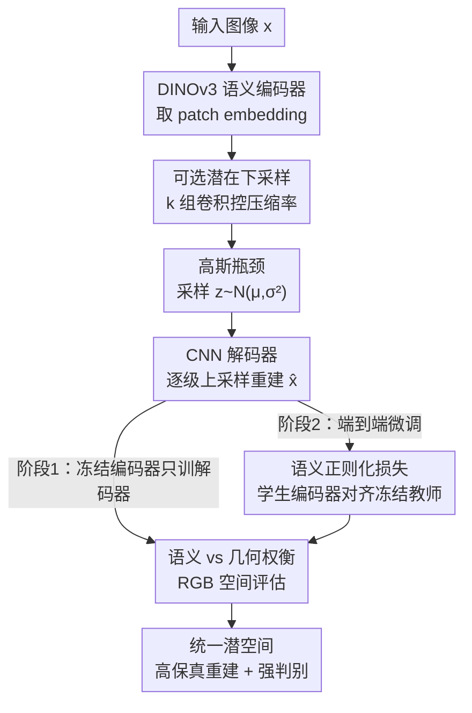

# Unified Latent Space for Understanding and Generation via Semantic Auto-encoder

**会议**: CVPR 2026  
**论文**: [CVF Open Access](https://openaccess.thecvf.com/content/CVPR2026/html/Li_Unified_Latent_Space_for_Understanding_and_Generation_via_Semantic_Auto-encoder_CVPR_2026_paper.html)  
**领域**: 扩散模型 / 图像生成  
**关键词**: 语义自编码器, 统一潜空间, DINOv3, 潜在扩散, 语义正则化

## 一句话总结
针对"语义编码器潜空间有语义但丢几何、重建 VAE 潜空间有几何但没语义"这一根本权衡，本文用冻结的 DINOv3 当编码器、配两阶段渐进训练和一个把学生编码器拉回教师特征的语义正则化损失，得到一个同时支持高保真重建（rFID 0.06）和线性探测分类（ImageNet 81.9%）的统一潜空间 Semantic Auto-encoder（S-AE）。

## 研究背景与动机
**领域现状**：现代图像生成主流是"潜在扩散"——先用一个预训练自编码器把像素压进一个紧凑潜空间，再让 Diffusion Transformer（DiT）在这个潜空间里去噪。SD-VAE 就是最常用的那个压缩器，它只用重建目标训练，潜空间几乎只保留局部外观/几何细节。

**现有痛点**：这种只为重建优化的潜空间没有语义结构——作者在 ImageNet 上对 VAE 潜特征做线性探测，分类准确率只有 8%。这对当下"理解+生成统一模型"的方向是致命的：它没法做高层推理、跨模态对齐，也没法在理解任务和生成任务之间共享表征。于是近期工作（SD3 用 SigLIP、某些工作用 CLIP/DINO）尝试把语义编码器塞进自编码器，但这些语义编码器特征抽象度太高，几何结构丢失，导致重建质量差，而且配 DiT 训练时需要更大模型、更长 schedule 才收敛。

**核心矛盾**：作者把它形式化成一个**语义抽象 vs 几何结构保真的根本权衡**——语义编码器（DINO/DINOv2/SigLIP）潜空间强判别但丢几何细节；重建 VAE 潜空间保几何但没语义。两者单独都不足以支撑统一的"生成+理解"范式。顺带还揭了一个测量陷阱：扩散训练 loss 习惯在潜空间里算，但潜空间 loss 低不代表生成质量好（R-AE 潜 loss 更低但出图过饱和最差），把 loss 搬到 RGB 空间算才和人眼一致。

**核心 idea**：与其在"纯语义"和"纯重建"之间二选一，不如借 DINOv3（其本身用 global+patch+decorrelation 损失同时建模语义与几何）当起点，再用一个语义正则化损失在端到端微调时把编码器"钉"在原始语义能力上，从而拿到一个几何与语义兼得的统一潜空间。

## 方法详解

### 整体框架
S-AE 是一个三件套自编码器：**语义编码器**（冻结/微调的 DINOv3-ViT-H/16+）把图像投到语义丰富的 token 空间，**可选的潜在下采样模块**控制压缩率，**CNN 解码器**把潜表示还原回像素。输入图像 $x\in\mathbb{R}^{3\times H\times W}$ 经 DINOv3 得到 `[CLS, REG1..4, e1..eN]`，只保留 N 个 patch embedding 重排成 2D 特征图 $h\in\mathbb{R}^{D\times \frac{H}{16}\times \frac{W}{16}}$；DINOv3 固定 16 倍下采样，若要更高压缩率 $f=16\times 2^k$ 就再叠 $k$ 组卷积。随后按 VAE 套路用量化投影层把 $h'$ 映成对角高斯参数 $\mu,\sigma^2$，采样 $z\sim\mathcal{N}(\mu,\mathrm{diag}(\sigma^2))$，解码器逐级上采样重建。

训练是关键：直接冻结 DINOv3 当编码器，文字等细节重建不出来；直接端到端微调 DINOv3，判别能力会从 88.4% 暴跌到 12.4%。所以作者用**两阶段渐进训练**先解码器后端到端，并在第二阶段加**语义正则化损失**把编码器拉住，整条管线如下。

### 关键设计

**1. 语义抽象 vs 几何保真权衡的形式化 + RGB 空间评估：把"潜空间该长什么样"这件事说清楚**

这是论文的分析性贡献，也是后面所有设计的出发点。作者用同一张图过拟合实验对比不同编码器：把编码器换成 DINOv2，重建收敛更慢、文字/小人脸还原不出，但这在**潜空间训练 loss 曲线上看不出来**——R-AE 潜 loss 比 VAE 更低，可出图反而过饱和、最差。原因是扩散训练 loss 默认在潜空间算，忽略了潜空间本身的质量，导致 loss 和真实图像质量之间有 gap。作者把损失改到 RGB 空间重算，VAE 和 R-AE 的优劣顺序就**反过来**了，和人眼判断一致。这条洞察的价值在于：它告诉社区"语义编码器潜空间未必加速收敛、潜 loss 不是可靠指标"，并给出"评估潜空间要回到 RGB/重建质量+判别能力两个轴"的实操准则，直接支撑用 rFID + 线性探测准确率这对指标来刻画统一潜空间。

**2. 基于 DINOv3 的 S-AE 架构：用一个"自带几何"的语义骨干当地基**

针对痛点——SigLIP/DINOv2 这类纯语义编码器丢几何——作者没有从零设计损失硬凑几何，而是直接选 DINOv3 当编码器骨干。DINOv3 本身的训练目标 $L = L_{\text{global}} + L_{\text{patch}} + \lambda L_{\text{decorr}}$ 同时含全局语义、patch 局部信息和去相关项，因此它的特征比前代更能兼顾语义与几何结构。架构上只取 patch token（丢掉 CLS 和 register token）重排成空间特征图，保留 DINOv3 的语义结构；可选卷积下采样让同一框架灵活支持 $f=16/32/64$ 压缩率而不破坏语义。这样"地基"就既有判别力又留住了空间结构，比"纯语义编码器 + 复杂几何损失"省力。

**3. 两阶段渐进训练：先让解码器站稳，再放开编码器**

这一步解决"怎么微调才不崩"的问题。**阶段 1（仅解码器）**冻结 DINOv3，只训解码器、下采样层和变分瓶颈，让稳定的语义特征先把解码器训到一个合理的重建基线，目标是 L1 + LPIPS 感知损失 + PatchGAN 对抗损失：

$$\mathcal{L}_{\text{Stage 1}} = \lambda_{L1}\lVert \hat{x}-x\rVert_1 + \lambda_{\text{LPIPS}}\mathcal{L}_{\text{LPIPS}}(\hat{x},x) + \lambda_{\text{GAN}}\mathcal{L}_{\text{GAN}}(\hat{x})$$

这步初始化至关重要——它防止后续端到端训练把预训练权重直接"压塌"。但纯冻结解码器又训不出足够好的细节，所以进入**阶段 2（端到端微调）**放开编码器联合训练，换取更高重建质量。表 3 给了反面证据：没有阶段 1 的权重初始化、直接端到端，编码器判别能力会迅速退化。

**4. 语义正则化损失：用一个冻结教师把学生编码器"钉"在语义上**

阶段 2 放开编码器后会出现"重建变好但判别崩"的矛盾——准确率从 88.4% 掉到 12.4%。作者维持一份冻结的 DINOv3 当**教师**，对每张图取教师 $f_t$ 和可训练学生 $f_s$ 的 patch 特征图，用 MSE 做正则：

$$\mathcal{L}_{\text{reg}} = \lambda_{\text{reg}}\cdot\lVert f_s(x)-f_t(x)\rVert_2^2$$

阶段 2 总目标在阶段 1 基础上加上 KL 项和这个正则项：

$$\mathcal{L}_{\text{Stage 2}} = \lambda_{L1}\lVert \hat{x}-x\rVert_1 + \lambda_{\text{LPIPS}}\mathcal{L}_{\text{LPIPS}} + \lambda_{\text{GAN}}\mathcal{L}_{\text{GAN}} + \lambda_{\text{KL}}D_{\text{KL}}(f_s(x)\Vert\mathcal{N}(0,I)) + \lambda_{\text{reg}}\lVert f_s(x)-f_t(x)\rVert_2^2$$

它为什么有效：MSE 蒸馏让学生在适应重建目标时不偏离原始语义流形，$\lambda_{\text{reg}}$ 成了一个可调旋钮——调大语义保得越多、重建略降，调小反之。$\lambda_{\text{reg}}=200$ 时分类还有 86.1%、rFID 0.10，是判别与生成的最佳折中点；所有带正则的变体都远胜"冻结编码器"基线（后者 rFID 1.17、伪影严重）。

### 损失函数 / 训练策略
256×256 分辨率，8 卡 batch 16，AdamW（lr 5e-6、零 weight decay），5k 步线性 warm-up 后 cosine 衰减到 1e-7、共 500k 步；EMA decay 0.9995。权重：L1=100、LPIPS(VGG)=100、非饱和 GAN=1、KL=1e-6。判别器用 2D PatchGAN。DiT 训练时先训阶段 1 共 630K 步，再用重建+蒸馏损失（$\lambda_{\text{reg}}=200$）放开 DINOv3 编码器微调 50K 步。

## 实验关键数据

### 主实验
重建质量对比（ImageNet，16×16 压缩；PSNR/SSIM 越高越好，rFID 越低越好），S-AE 在全部指标上 SOTA：

| 模型 | 语义编码器 | 线性探测 Acc%↑ | PSNR↑ | SSIM↑ | rFID↓ |
|------|:---:|:---:|:---:|:---:|:---:|
| VAE | ✗ | 8.0 | 25.29 | 0.76 | 0.62 |
| R-AE | ✓ | 84.5 | 19.21 | 0.50 | 0.49 |
| Align. VF | ✓ | 35.1 | 25.83 | - | 0.26 |
| DC-AE | ✗ | 12.7 | 23.85 | 0.69 | 0.66 |
| SVG† | ✓ | 81.8 | 23.89 | 0.65 | 0.65 |
| VA-VAE† | ✓ | - | 27.96 | 0.79 | 0.28 |
| **S-AE** | ✓ | **81.9** | **33.84** | **0.96** | **0.06** |

关键对比：R-AE 判别力（84.5%）略高于 S-AE，但重建惨不忍睹（PSNR 19.21、rFID 0.49）；VAE 重建尚可但判别只有 8%。S-AE 是唯一同时把两端都拉满的——rFID 0.06 是表中最低，PSNR/SSIM 也最高。

### 消融实验
语义 vs 重建权衡（Freeze=只训解码器；E2E=放开编码器；Distill(λ)=端到端时用 λ×MSE 蒸馏）：

| 方法 | Acc%↑ | PSNR↑ | SSIM↑ | rFID↓ |
|------|:---:|:---:|:---:|:---:|
| Freeze | 88.4 | 19.39 | 0.5593 | 1.17 |
| E2E | 12.4 | 41.35 | 0.9888 | 0.01 |
| Distill (100) | 81.9 | 33.84 | 0.9551 | 0.06 |
| Distill (200) | 86.1 | 32.21 | 0.9458 | 0.10 |
| Distill (500) | 87.0 | 29.74 | 0.9325 | 0.27 |

架构通道宽度消融（DINO-v3 编码器）：1280-1024-512-256-128 配置达到 rFID 0.17、PSNR 31.61、SSIM 0.93，是 CNN/DINO-v3 各档里的最优。

### 关键发现
- **正则强度是核心旋钮**：$\lambda_{\text{reg}}$ 从 100 升到 500，分类从 81.9% 单调恢复到 87.0%（逼近冻结基线 88.4%），同时重建质量逐步下降；选 200 在两端取得最佳折中。没有正则（E2E）时判别力灾难性崩到 12.4%——虽然此时重建指标极好（rFID 0.01），但潜空间已失去理解价值。
- **阶段 1 初始化不可省**：跳过阶段 1 直接端到端会让编码器判别力迅速退化，说明"先让解码器站稳"是端到端不崩的前提。
- **大通道潜空间反而帮 DiT 收敛**：传统 VAE 用 4 通道紧凑潜空间，比 DiT 宽度小两个量级；R-AE 声称语义编码器在 DiT 通道小于潜维时不收敛。但 S-AE（潜维 1280）即便 DiT 通道宽度只有 384 也能收敛；且当 DiT 通道接近潜维后，RGB loss 的改善变得边际。

## 亮点与洞察
- **"潜 loss 会骗人"这条洞察很实用**：作者证明扩散潜空间训练 loss 低 ≠ 出图好（R-AE 潜 loss 最低、出图最差），把评估搬回 RGB 空间才靠谱。这给整个潜在扩散社区提了个醒，评估自编码器不能只看潜空间指标。
- **用 DINOv3 当地基而非硬造损失**：与其设计复杂几何约束去补救纯语义编码器，不如直接选一个训练目标里就含 patch/decorrelation 项、自带几何的骨干，是"选对起点比堆 trick 更省"的好例子。
- **教师-学生蒸馏当统一潜空间的"刹车"**：用一份冻结的自己当教师、MSE 拉住学生编码器，把"端到端微调会毁掉判别力"这个老问题变成一个单旋钮可控的权衡，这套思路可迁移到任何"想微调预训练骨干又怕丢预训练能力"的场景。
- **一个潜空间双用**：rFID 0.06 + 81.9% 分类同时达到 SOTA，给"理解+生成统一模型"提供了一个现成的潜空间地基。

## 局限与展望
- **判别力没有完全追平冻结基线**：最佳折中点（Distill 200）的 86.1% 仍低于冻结的 88.4%，说明端到端微调对语义仍有不可逆的轻微损耗。
- **生成端证据偏间接**：DiT 训练的核心实验大量靠"单图过拟合"来加速，真正的大规模 gFID 文本到图像生成结果被放进了附录，正文里对"S-AE 在完整生成任务上比 SD-VAE 强多少"给的量化证据有限。
- **依赖特定骨干**：整套方法绑定 DINOv3-ViT-H/16+，对编码器尺寸/算力有要求，换更轻量骨干能否守住这个权衡未验证。
- **可改进方向**：把 $\lambda_{\text{reg}}$ 做成训练中自适应调度（先重建后语义），或把语义正则从 MSE 换成更宽松的关系蒸馏，或许能在不掉重建的前提下把判别力进一步逼近冻结基线。

## 相关工作与启发
- **vs SD-VAE / 传统重建 VAE**：SD-VAE 只用重建目标、潜空间几乎无语义（分类 8%），适合低层生成但不支持推理/跨模态对齐；S-AE 在保住甚至超过其重建质量（rFID 0.06 vs 0.62）的同时把判别力拉到 81.9%。
- **vs R-AE / 纯语义编码器 VAE**：R-AE 这类用 DINO/SigLIP 的方法判别强（84.5%）但丢几何、重建差（rFID 0.49、过饱和），且配 DiT 需更大模型更长训练；S-AE 用 DINOv3 + 语义正则同时拿住两端。
- **vs VA-VAE / MAETok / l-DEtok**：这些工作也往潜空间注入语义信息提升重建与生成一致性，但常以牺牲几何保真为代价；本文的核心区别是显式形式化语义-几何权衡并用两阶段+蒸馏精确控制折中点。

## 评分
- 新颖性: ⭐⭐⭐⭐ 把"语义 vs 几何权衡"形式化并配 RGB 评估洞察很有价值，但核心组件（DINOv3 骨干 + 教师蒸馏 + 两阶段训练）多为已有技术的精当组合。
- 实验充分度: ⭐⭐⭐⭐ 重建/判别对比和 λ_reg、通道、训练策略消融都扎实，但生成端大量靠单图过拟合、完整 gFID 进附录略显单薄。
- 写作质量: ⭐⭐⭐⭐ 分析-设计逻辑清晰、图表支撑到位，个别笔误和"潜 loss 反直觉"表述稍乱。
- 价值: ⭐⭐⭐⭐ 为"理解+生成统一"提供了一个 SOTA 的现成统一潜空间，权衡刻画与正则旋钮对后续工作有直接借鉴意义。

<!-- RELATED:START -->

## 相关论文

- [\[CVPR 2026\] Latent Diffusion Inversion Requires Understanding the Latent Space](latent_diffusion_inversion_requires_understanding_the_latent_space.md)
- [\[CVPR 2026\] Semantics Lead the Way: Harmonizing Semantic and Texture Modeling with Asynchronous Latent Diffusion](semantics_lead_the_way_harmonizing_semantic_and_texture_modeling_with_asynchrono.md)
- [\[CVPR 2026\] Semantic Scale Space: A Framework for Controllable Image Abstraction](semantic_scale_space_a_framework_for_controllable_image_abstraction.md)
- [\[CVPR 2026\] Learning to Generate via Understanding: Understanding-Driven Intrinsic Rewarding for Unified Multimodal Models](learning_to_generate_via_understanding_understanding-driven_intrinsic_rewarding_.md)
- [\[CVPR 2026\] Scone: Bridging Composition and Distinction in Subject-Driven Image Generation via Unified Understanding-Generation Modeling](scone_bridging_composition_and_distinction_in_subject-driven_image_generation_vi.md)

<!-- RELATED:END -->
