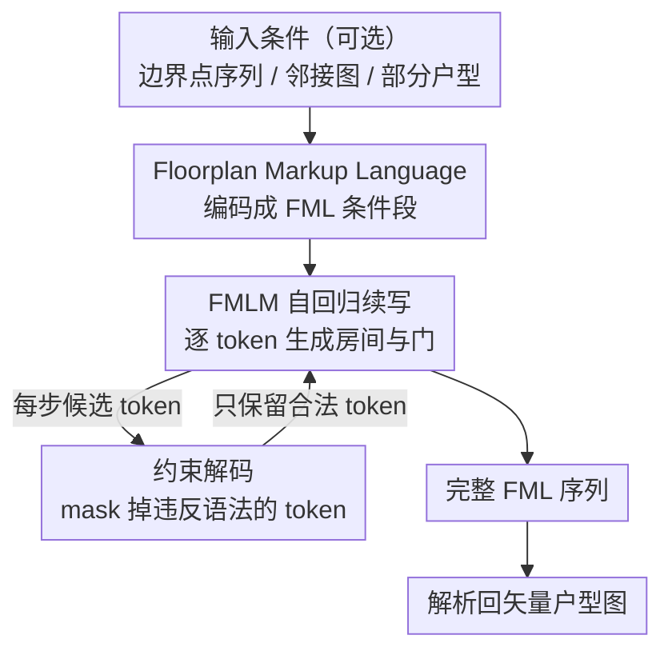

# Unified Vector Floorplan Generation via Markup Representation

**会议**: CVPR 2026  
**arXiv**: [2604.04859](https://arxiv.org/abs/2604.04859)  
**代码**: [https://mapooon.github.io/FMLPage](https://mapooon.github.io/FMLPage)  
**领域**: 图像生成  
**关键词**: 户型图生成、标记语言、自回归序列模型、约束解码、向量化表示

## 一句话总结

本文提出 Floorplan Markup Language (FML) 标记语言，将房间、门等户型元素编码为结构化 token 序列，用一个 LLaMA 风格的 Transformer 模型（FMLM）统一解决无条件/边界条件/图条件/补全等多种户型图生成任务，FID 指标比 HouseDiffusion 低 80%+。

## 研究背景与动机

1. **领域现状**：户型图自动生成是建筑设计和房地产行业的核心需求。现有方法按条件类型分治——边界条件用 Graph2Plan，邻接图条件用 HouseGAN++/HouseDiffusion，但每种任务需要专用模型。
2. **现有痛点**：(1) 不同生成任务用不同架构，无法统一；(2) 基于扩散模型的方法（GSDiff）生成的是栅格图，后处理转换为矢量格式会引入误差；(3) GAN 方法容易模式崩溃且生成多样性受限。
3. **核心矛盾**：户型图本质是结构化的矢量数据（房间多边形+门的位置+连接关系），但现有方法要么在像素空间工作（丢失结构信息），要么需要针对性的图神经网络。
4. **本文目标**：设计一种统一表示，将所有户型图生成任务转化为同一种序列预测问题。
5. **切入角度**：受 NLP 中标记语言（HTML/XML）的启发——用语法规则定义的 token 序列天然适合表示结构化信息，且可以直接用自回归 Transformer 建模。
6. **核心 idea**：定义 FML 语法将户型图编码为"标签+坐标+索引+类型"的 token 序列，用约束解码保证生成结果的语法合法性。

## 方法详解

### 整体框架

这篇论文要解决的核心难题是：户型图本质上是结构化的矢量数据（房间多边形、门的位置、房间之间的连接），但现有方法要么针对每种条件单独造一个架构，要么在像素空间里画完再后处理转矢量、白白丢掉结构信息。作者的做法是把户型图当成一段"标记文档"来写——像 HTML 用标签描述网页那样，定义一套 Floorplan Markup Language（FML）语法把整张户型图压成一条线性 token 序列。这样无论是无条件生成、给定边界、给定邻接图还是补全，都变成同一个问题：让一个自回归 Transformer 续写这条序列。

整条流水线是：可选的输入条件（边界点序列 / 邻接图 / 部分户型）先被编码成 FML 的条件段，拼到序列开头；FMLM 模型从这里出发逐 token 续写出房间和门；续写过程中用约束解码挡掉所有不合语法的 token；最后把生成好的 FML 解析回矢量户型图。

### 关键设计

**1. Floorplan Markup Language：把户型图写成一段可解析的标记序列**

针对"不同任务各用一套架构、栅格方法还得后处理转矢量"的痛点，FML 用一套语法把一张图的所有元素摊平成四类 token：标签（如 `<room>`、`<door>`）、坐标、房间索引、房间类型。坐标用 1D 编码 $z = x + y \times W$（$W=256$）把二维网格点压成一个整数，避开了直接预测二维坐标时词表又大又稀疏的问题。整条序列遵循固定文法 `<sequence> → <condition> → <floorplan> → rooms → doors → front_door → </sequence>`，于是一张户型图读起来就像 `<room> 类型 索引 顶点坐标… <door> 两个端点 所属房间…` 这样一段有头有尾的文档，标签 token 本身就给模型提供了"现在该写什么"的结构监督。一个看似不起眼但很关键的细节是房间的排列顺序：作者让房间按索引**降序**排列，消融显示这一改动把 FID 从升序的 94.57 拉到 25.50，因为降序让大房间（通常索引大）先落子、给后续小房间提供更稳定的空间参照。

**2. FMLM：用一个统一输出头让模型自己决定下一个该写哪类 token**

序列定义好之后，建模就交给一个 LLaMA-3 风格的 Transformer——24 层、512 维隐藏状态、32 个注意力头。四类 token 的嵌入方式按性质区分：坐标 token 用正弦位置编码加一个可学习投影（保留数值的连续性），标签、索引、类型这类离散符号则各用一张可学习嵌入表。关键在输出端只挂一个统一的线性头 $W \in \mathbb{R}^{(C_{tag}+C_{coord}+C_{index}+C_{type}) \times C}$，把四类 token 的词表拼在一起一次性预测。这样模型不需要外部状态机来切换"现在该出标签还是该出坐标"，而是从数据里自己学会在 `<room>` 之后该接坐标、坐标写够了该收尾——解码逻辑因此始终是同一套自回归续写。

**3. 约束解码：推理时直接 mask 掉违反语法的 token，零开销保证 100% 合法**

自回归模型续写时完全可能写出语法非法的序列，比如给一扇门写了 3 个顶点、或让房间多边形和已落子的房间重叠。约束解码把 FML 的硬性规则编码进解码步骤：门必须恰好 2 个顶点、房间多边形不能与已有房间重叠、门必须落在某个房间的边界上——凡是会破坏这些规则的候选 token，在 softmax 之后直接把概率 mask 成零。它的好处是几乎不增加计算（只是逐步过滤候选），却把"输出一定能解析成合法户型图"从概率事件变成了确定性保证；相比 HouseDiffusion 那类先生成再后处理修正的做法，这种"边生成边约束"更可靠，也不会在事后修补时引入新误差。

### 损失函数 / 训练策略

训练目标是在 FML 序列的非结构标签 token 上做标准交叉熵。一个重要的训练技巧是房间排列增强：每次随机打乱房间的书写顺序，逼模型学到对房间排列的等变性，而不是死记某种固定的房间出现次序。消融显示这一项的分量很重——去掉排列增强后 FID 从 14.17 涨到 24.36（+72%）。

## 实验关键数据

### 主实验

| 任务 | 方法 | FID↓ | GED↓ | IoU↑ |
|------|------|------|------|------|
| 无条件 | GSDiff | 15.02 | - | - |
| 无条件 | **FMLM** | **7.22** | - | - |
| 边界条件 | Graph2Plan | 34.20 | - | 95.87% |
| 边界条件 | **FMLM** | **6.51** | - | **97.86%** |
| 图条件(ALL) | HouseGAN++ | 48.44 | 2.57 | - |
| 图条件(ALL) | HouseDiffusion | 29.31 | 1.55 | - |
| 图条件(ALL) | **FMLM** | **3.41** | **1.21** | - |
| 边界+图(ALL) | Graph2Plan | 22.87 | 3.43 | 92.96% |
| 边界+图(ALL) | **FMLM** | **14.17** | **1.24** | **97.59%** |

### 消融实验

| 配置 | FID↓ | GED↓ | IoU↑ | 说明 |
|------|------|------|------|------|
| Full + 排列增强 | 14.17 | 1.24 | 97.59% | 完整模型 |
| w/o 排列增强 | 24.36 | 2.35 | 95.82% | FID 涨 72% |
| 升序索引 | 94.57 | - | - | FID 极差 |
| 降序索引 | 25.50 | - | - | 降序远优于升序 |

### 关键发现

- 房间排列增强是性能的关键——去掉后 FID 从 14.17 涨到 24.36（+72%），说明模型需要学习排列等变性才能有效泛化
- FMLM 在所有条件设定下都大幅超越 GAN 和扩散模型方法
- 约束解码保证了 100% 语法合法的生成结果，而 HouseDiffusion 等方法的后处理步骤无法保证这一点
- 8 房间场景性能略有下降（FID 从 3.41 升至 4.64），因为训练样本较少

## 亮点与洞察

- **标记语言表示的精妙**：通过定义语法规则将结构化生成问题优雅转化为序列预测，这种思路可迁移到其他结构化生成任务（如电路版图、分子结构）
- **约束解码的零开销保证**：在推理时通过 mask 非法 token 实现硬约束，不增加计算成本但消除了所有非法输出——这比后处理修正更可靠
- **统一多任务**：同一个模型同时处理无条件/边界/图/补全四种任务，消除了之前"每个任务一个模型"的冗余

## 局限与展望

- 仅支持单层户型图，多层建筑需要扩展 FML 语法
- 8 房间以上场景训练数据不足，效果下降
- 坐标量化到 256×256 网格可能丢失精度，更高分辨率会增加词表大小
- 与 LLM 结合（用自然语言描述需求→生成户型）是有前景的方向

## 相关工作与启发

- **vs HouseDiffusion**: 扩散方法在连续空间建模，需要后处理矢量化，而 FMLM 直接在离散 token 空间生成矢量结果，更精确
- **vs Graph2Plan**: 需要 GNN 编码邻接图为条件，架构复杂。FMLM 将邻接关系直接序列化为 FML 条件段，不需要额外编码器
- **vs GSDiff**: 栅格化扩散方法 FID 15.02，FMLM 7.22，差距主要来自矢量表示的结构先验

## 评分

- 新颖性: ⭐⭐⭐⭐ 标记语言表示是新颖的视角，但自回归生成本身不算新
- 实验充分度: ⭐⭐⭐⭐⭐ 四种条件设定全面对比+消融+多房间数量分析
- 写作质量: ⭐⭐⭐⭐ 清晰流畅，FML 语法定义严谨
- 价值: ⭐⭐⭐⭐ 对建筑设计领域有直接应用价值，标记语言思路有可迁移性

<!-- RELATED:START -->

## 相关论文

- [\[CVPR 2026\] VecGlypher: Unified Vector Glyph Generation with Language Models](vecglypher_unified_vector_glyph_generation_with_language_models.md)
- [\[CVPR 2026\] CG-Floor: Centroid-Guided Diffusion for Large-Scale Floorplan Generation](cg-floor_centroid-guided_diffusion_for_large-scale_floorplan_generation.md)
- [\[CVPR 2026\] ExpPortrait: Expressive Portrait Generation via Personalized Representation](expportrait_expressive_portrait_generation_via_personalized_representation.md)
- [\[CVPR 2026\] Unified Customized Generation by Disentangled Reward Modeling](unified_customized_generation_by_disentangled_reward_modeling.md)
- [\[CVPR 2026\] UniVerse: Empower Unified Generation with Reasoning and Knowledge](universe_empower_unified_generation_with_reasoning_and_knowledge.md)

<!-- RELATED:END -->
