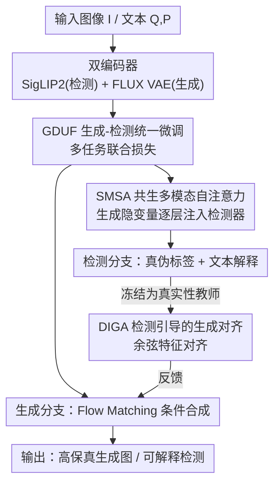

# UniGenDet: 面向生成-检测协同进化的统一生成-判别框架

**会议**: CVPR 2026  
**arXiv**: [2604.21904](https://arxiv.org/abs/2604.21904)  
**代码**: https://github.com/Zhangyr2022/UniGenDet (有)  
**领域**: 图像生成 / 生成图像检测 / 统一多模态  
**关键词**: 生成-检测协同进化、统一框架、共生自注意力、检测器引导对齐、AIGI 检测

## 一句话总结
UniGenDet 把"造假"(图像生成)和"打假"(生成图像检测)塞进同一个统一多模态模型里两阶段联合训练——先用共生自注意力把生成器对图像分布的理解注入检测器、再用冻结检测器当"真实性教师"反向对齐生成器特征，让两者在一个闭环里互相喂招，最终检测精度(FakeClue 98.0% Acc)和生成保真度(FID 22.9→17.5)同时提升。

## 研究背景与动机

**领域现状**：图像生成(GAN/VAE/扩散/自回归)和生成图像检测各自飞速发展，但走的是两条完全不同的技术路线——生成依赖生成式网络，检测偏好判别式框架。最近两边都开始借用"对抗信息"提升性能(生成用判别信号、检测用生成知识)，暗示二者存在协同空间。

**现有痛点**：绝大多数检测器是在某个时间点的生成器快照上**孤立训练**的，把伪造当成静止靶子而非协同演化的过程。结果就是检测器过拟合到转瞬即逝的线索、对没见过的生成器有严重 domain gap、而且拿不到伪造背后的生成逻辑——检测能力永远追不上新伪造手段的复杂度,形成"检测滞后"的被动防御。

**核心矛盾**：生成器只追求感知真实度,不受任何取证(forensic)约束,因此总会留下物理不一致等可辨别痕迹;检测器只能被动地从固定/滞后的伪造样本里学。两者明明在收敛(生成开始用理解模型做先验、检测开始用大模型提升泛化),却始终缺一个**同时协同优化二者的闭环框架**。

**本文目标**：构建一个统一的生成-判别框架,让 (1) 生成任务帮检测任务提升真伪判别的可解释性,(2) 真实性判据反过来引导生成更高保真的图像。

**切入角度**：作者引用费曼那句"What I cannot create, I do not understand",认为生成与判别本质上是共生关系——既然统一多模态模型(如 BAGEL)已经能在一个架构里同时做生成和理解,那就该让检测器**理解伪造的生成逻辑**,从而抓住真伪边界的本质。

**核心 idea**：用一个统一模型 + 两阶段训练,让生成与检测**双向喂招**:正向把生成器的分布理解注入检测器(SMSA),反向把检测器的取证知识注入生成器(DIGA),形成生成-检测协同进化的闭环。

## 方法详解

### 整体框架
UniGenDet 以统一生成-理解模型 **BAGEL**(多模态 Mixture-of-Transformers,本身就同时支持图像生成和视觉问答)为底座,要同时解决三件事:生成图像检测、给出文本解释、以及图像生成。整套流程是一个**两阶段训练范式**:第一阶段 GDUF 把检测和生成放进同一个训练目标里联合微调,核心是用 SMSA 模块把生成隐变量逐层注入检测器;第二阶段 DIGA 冻结训练好的检测器、把它当"真实性教师"来对抗式地优化生成器。

具体地,输入图像先过两个编码器:检测编码器 SigLIP2 给出检测特征 $h_{\text{det}}^{(0)}$,生成编码器 FLUX 的 VAE 给出生成隐变量 $z_{\text{gen}}^{(0)}$;文本指令编码成 $h_{\text{text}}^{(0)}$。第一阶段里 SMSA 在检测主干每一层做三模态交互,检测分支输出真伪标签和文本解释,生成分支用 Flow Matching 做条件合成。第二阶段再用冻结检测器对生成器中间特征做余弦对齐,把"什么样的特征不易被检测"的取证知识灌进生成器。

### 关键设计

**1. SMSA 共生多模态自注意力：把生成器的分布理解注入检测器**

针对"检测器拿不到伪造背后的生成逻辑、只能学表面线索"这个痛点,作者注意到生成模型(尤其扩散模型的隐空间)对图像分布、语义和结构信息的建模非常充分,于是设计 SMSA 在检测主干**逐层**把生成隐变量喂给检测特征。每一层先把三种模态拼起来 $h_{\text{concat}}^{(l)}=[z_{\text{gen}}^{(l)};h_{\text{det}}^{(l)};h_{\text{text}}^{(l)}]$,然后做多头交叉注意力,其中 query 来自检测特征、key/value 来自拼接后的三模态:$Q=W_Q h_{\text{det}}^{(l)}$,$K=W_K h_{\text{concat}}^{(l)}$,$V=W_V h_{\text{concat}}^{(l)}$,注意力 $\text{Attention}(Q,K,V)=\text{softmax}(QK^\top/\sqrt{d_k})V$,逐层更新 $h_{\text{det}}^{(l+1)}=\text{SMSA}(h_{\text{det}}^{(l)},h_{\text{text}}^{(l)},z_{\text{gen}}^{(l)})$。最后检测头(浅层 MLP)输出真伪标签 $\hat{D}$,文本解码头输出解释 $\hat{E}$。这种逐层交互让检测器"渐进地感知生成分布的特性",而不是只看一张图的表面伪影——消融里去掉 SMSA,Acc 从 98.0 掉到 95.0、ROUGE-L 掉 5.4 点,说明它对检测精度和可解释性都关键。

**2. GDUF 生成-检测统一微调：用一个多任务目标把三件事拧成一股绳**

这是第一阶段的训练框架。作者把检测、解释、生成三个任务放进同一个 BAGEL 底座上**全参数联合微调**,batch 内生成数据和理解数据保持 1:1。总损失把三项加权相加 $\mathcal{L}=\lambda_{\text{det}}\mathcal{L}_{\text{det}}+\lambda_{\text{exp}}\mathcal{L}_{\text{exp}}+\lambda_{\text{fm}}\mathcal{L}_{\text{fm}}$(三个权重都设 1):检测用二元交叉熵 $\mathcal{L}_{\text{det}}$,解释用自回归语言建模 $\mathcal{L}_{\text{exp}}=-\sum_t \log p_\theta(a_t|a_{<t},h_{\text{det}}^L,h_{\text{text}}^L)$,生成用 Flow Matching $\mathcal{L}_{\text{fm}}=\mathbb{E}_{t,x_0,x_t}\|v_\theta(x_t,t,c)-(x_0-x_t)\|^2$(前向加噪 $x_t=(1-t)x_0+t\epsilon$,预测速度场)。关键点是生成分支注入的条件 $c$ 里带上了检测器抽出的**判别性文本特征**,让生成更"合理"。这样三个任务在共享参数下协同优化,既省部署成本又促进知识迁移——消融里"w/o GDUF"(等于不做这阶段统一微调,退化成原始 BAGEL)Acc 只有 40.5,而完整模型 98.0,直接证明这一阶段是地基。

**3. DIGA 检测引导的生成对齐：把检测器当"真实性教师"反向喂招给生成器**

针对"生成器在训练时根本不知道自己哪些特征容易被检测出来"这个解耦痛点,作者受 REPA(用 DINOv2 等预训练编码器做特征对齐加速训练)启发,但换用一个更"懂取证"的老师——第一阶段训出来的专用检测器 $f_D$。它专门捕捉频率异常、纹理不一致、不可察觉伪影这些把合成和真实区分开的痕迹。DIGA 把 $f_D$ 冻结,用它逼着生成器的中间特征去**对齐"在检测器眼里是完全真实的图像"的表征**,从而把生成器从"易被检测的特征子空间"里推开。具体做法:对真实图 $x_{\text{GT}}$,从 $f_D$ 最后一个 Transformer block 抽 patch 特征 $z_D$,从生成器第 $l$ 层(实现里取第 8 层)抽中间特征 $z_G=g_\theta^{(l)}(z_t,t)$,用轻量可训练投影 $h_\phi$ 桥接维度,然后做余弦对齐:

$$\mathcal{L}_{\text{DIGA}}=\mathbb{E}_{x_{\text{GT}},z_t,t}\left[1-\frac{h_\phi(g(z_t,t))\cdot f_D(x_{\text{GT}})}{\|h_\phi(g(z_t,t))\|\,\|f_D(x_{\text{GT}})\|}\right]$$

总损失 $\mathcal{L}_{\text{total}}=\mathcal{L}_{\text{flow}}+\lambda\mathcal{L}_{\text{DIGA}}$($\lambda=0.5$)。这样生成器就在训练里持续学习"什么是不易被检测的特征",把检测意识内化进生成表征——既提升视觉真实度又增强对取证分析的鲁棒性。FID 从 GDUF 后的 19.4 进一步降到 17.5,正是这一步的功劳。

### 损失函数 / 训练策略
两阶段在 8×A100 上训练:GDUF 阶段约 12 小时、约 1000 步,总 batch token 数 $16384\times8$;DIGA 阶段约 6 小时、500 步,对齐生成器第 8 层与检测器最后一层特征,$\lambda=0.5$,并保持真/假样本均衡。优化器 AdamW,学习率 $1\times10^{-4}$,权重衰减 $1\times10^{-2}$,2 个 epoch。生成分支训练数据用 LAION 高美学子集 80K,检测训练用 FakeClue。推理时文生图用 50 步扩散采样,文本生成用 temperature 0.7 / top-p 0.8 / top-k 20 / 重复惩罚 1.05。

## 实验关键数据

### 主实验

FakeClue 检测 + 解释(Acc/F1 衡量判别力,ROUGE-L 衡量解释与参考答案匹配,CSS 衡量语义一致性):

| 方法 | Acc ↑ | F1 ↑ | ROUGE-L ↑ | CSS ↑ |
|------|-------|------|-----------|-------|
| Qwen2-VL-72B(最强开源 LMM) | 57.8 | 56.5 | 17.5 | 54.4 |
| AIDE*(专用检测器) | 85.9 | 94.5 | - | - |
| NPR* | 90.2 | 91.6 | - | - |
| FakeVLM*† | **98.6** | **98.1** | 32.2 | 59.5 |
| **UniGenDet*** | 98.0 | 97.7 | **56.3** | **79.8** |

UniGenDet 比最强开源模型 Qwen2-VL-72B 高 40.2% Acc / 41.2% F1;比同样在 FakeClue 上训练的 NPR 高 7.8% Acc、比 AIDE 高 12.1% Acc。虽然 Acc 略低于 FakeVLM 0.6 点,但解释类指标(ROUGE-L 56.3 vs 32.2、CSS 79.8 vs 59.5)大幅领先,体现统一架构在可解释性和跨模态推理上的优势。

跨数据集泛化(用各方法原始权重):

| 数据集 | 指标 | UniGenDet | 之前最佳 | 提升 |
|--------|------|-----------|----------|------|
| DMimage | Overall Acc / F1 | 98.6 / 99.1 | SIDA 91.8 / 92.4 | +6.8 / +6.7 |
| ARForensics(AR 生成器,零样本) | Mean Acc | 98.1 | D³QE 82.1 / FakeVLM 97.1 | +16.0 / +1.0 |

ARForensics 是面向最新视觉自回归生成器(VAR/Infinity/Janus-Pro/RAR 等)的零样本设定,UniGenDet 不依赖任何外部分类器或专家模型、还保留自然语言解释能力,均值 Acc 仍达 98.1%,说明对快速演化的新生成范式有强鲁棒性。

生成质量(FID 在 5000 条 LAION 提示上算,与训练集不相交):

| 模型 | FID ↓ |
|------|-------|
| BAGEL | 22.9 |
| BAGEL + GDUF | 19.4 |
| **UniGenDet (GDUF+DIGA)** | **17.5** |

GenEval 文生图对齐:UniGenDet 均值 0.86,与原始 BAGEL(0.87)基本持平,SO(0.99)、CL(0.94)最佳,CT/ATTR 略低——作者解释为多任务学习里"在保住强检测能力的同时,生成质量没有明显退化"的可接受权衡(真实性判别强调分布真实度而非文-图对应)。

### 消融实验

| 配置 | Acc ↑ | F1 ↑ | ROUGE-L ↑ | CSS ↑ | 说明 |
|------|-------|------|-----------|-------|------|
| w/o GDUF | 40.5 | 34.1 | 23.9 | 46.2 | 不做统一微调,≈原始 BAGEL 零样本 |
| w/o SMSA | 95.0 | 94.6 | 50.9 | 77.7 | 做了 GDUF 但去掉共生自注意力 |
| **UniGenDet(完整)** | **98.0** | **97.7** | **56.3** | **79.8** | 两阶段 + SMSA 完整 |

### 关键发现
- **GDUF 统一微调是地基**:去掉后 Acc 仅 40.5(等于没微调的 BAGEL),完整模型 98.0,差距 +57.5,说明把检测和生成放进统一目标联合训练是性能根本来源。
- **SMSA 贡献集中在精度与可解释性**:去掉它 Acc 掉 3.0、F1 掉 3.1、ROUGE-L 掉 5.4,证明"逐层把生成隐变量注入检测器"确实让检测器借到了生成器的分布理解。
- **DIGA 专攻生成保真度**:FID 22.9→19.4(GDUF)→17.5(再加 DIGA),第二阶段的真实性引导反馈让生成更自然、伪影更少。
- **双向闭环成立**:检测反馈提升生成真实度、生成知识提升检测可解释性,二者在一个模型里同步进化,缓解了传统"检测滞后"。

## 亮点与洞察
- **"造假和打假同源"的框架级落地**:以前生成用判别信号、检测用生成知识都是**单向、静态**的(如 DIRE 用扩散重建误差、LEGION 推理时用判别器精修),UniGenDet 第一次把双向协同做成统一模型里的**闭环训练**,而非测试时后处理——这是把费曼"我无法创造的就无法理解"工程化的巧思。
- **SMSA 用"非对称 query"做模态注入**:query 只来自检测特征、key/value 来自三模态拼接,本质是"以检测为主、向生成与文本借信息",比简单 concat 更聚焦,且逐层注入而非只在末端融合。
- **把专用检测器当 REPA 式教师**:REPA 用 DINOv2 这类通用编码器对齐加速训练,这里换成"懂取证"的检测器,对齐目标从"语义一致"升级为"真实性一致",思路可迁移到任何"想让生成器规避某种判别器"的场景(如规避水印检测、规避风格分类器)。
- **可解释性的额外红利**:统一框架让检测同时产出文本解释,ROUGE-L/CSS 大幅领先纯判别专家模型,在伪造取证这类需要"给出理由"的场景很有价值。

## 局限性 / 可改进方向
- **生成质量有可见的多任务权衡**:GenEval 上 CT/ATTR 略低于原始 BAGEL,作者承认这是为保检测能力付出的代价;在对文-图对齐要求极高的生成场景未必划算。
- **强依赖统一底座 BAGEL**:整套方法建立在"同一模型能同时生成+理解"之上,换到纯生成或纯检测的非统一架构上能否复现协同效应,论文未验证。
- **检测训练只用 FakeClue 单一来源**:虽然在 DMimage/ARForensics 上零样本泛化很好,但伪造类型仍可能受 FakeClue 标注分布影响;对全新生成范式(如未来的视频/3D 生成伪造)是否仍领先存疑。
- **"协同进化"是两阶段而非真·迭代**:当前是 GDUF→DIGA 串行一遍,并非生成器和检测器交替多轮对抗演化;真正的长期军备竞赛下能否持续互相超越,值得进一步做多轮迭代实验。
- **DIGA 只对齐到"真实图"特征**:把生成器往"检测器认为真"的子空间推,理论上可能被一个更强的检测器再次识破(对抗鲁棒性的猫鼠问题),论文未评估面对更强未知检测器时的表现。

## 相关工作与启发
- **vs DIRE / LARE² / AEROBLADE**:它们用扩散/自编码器的重建误差或潜表示误差来识别生成图,本质是"用生成知识帮检测",但**model-specific 且缺可解释性**;UniGenDet 把生成知识通过 SMSA 注入统一检测器,既泛化又能给文本解释。
- **vs LEGION**:LEGION 在**推理时**用判别器评估并迭代优化 prompt 来精修生成,是高延迟的分阶段后处理,治标不治本;DIGA 在**训练时**把取证知识直接内化进生成器参数,从根上提升内在真实度。
- **vs FakeVLM / SIDA / ForgeryGPT 等 LMM 检测器**:这些把检测+解释做进多模态大模型或混合架构,但生成与检测仍解耦;UniGenDet 用一个模型同时承载生成与检测并让两者协同,检测精度持平/反超的同时解释指标大幅领先。
- **vs REPA**:REPA 用通用视觉编码器(DINOv2)对齐特征加速生成训练;UniGenDet 把"老师"换成专用真实性检测器,把对齐目标从语义升级为真实性,是 REPA 思路在取证-生成协同上的延伸。

## 评分
- 新颖性: ⭐⭐⭐⭐⭐ 首个把生成与生成图检测做成统一模型内闭环协同进化的框架,双向注入设计(SMSA+DIGA)新颖且自洽。
- 实验充分度: ⭐⭐⭐⭐ 检测三数据集(含零样本)+生成 FID/GenEval+消融齐全,但缺多轮迭代协同和对抗鲁棒性评估。
- 写作质量: ⭐⭐⭐⭐ 动机(费曼引言)到方法到实验逻辑清晰,公式完整;个别处 GDUF 命名在正文与消融表略有歧义。
- 价值: ⭐⭐⭐⭐⭐ 在生成 AI 与内容鉴伪"军备竞赛"背景下提供了协同进化的统一范式,可解释检测+高保真生成双收,落地价值高。

<!-- RELATED:START -->

## 相关论文

- [\[CVPR 2026\] MPDiT: Multi-Patch Global-to-Local Transformer Architecture for Efficient Flow Matching](mpdit_multi-patch_global-to-local_transformer_architecture_for_efficient_flow_ma.md)
- [\[CVPR 2026\] Prompt Yourself: Awakening Textual Semantics in 1D Visual Tokenizers](prompt_yourself_awakening_textual_semantics_in_1d_visual_tokenizers.md)
- [\[CVPR 2026\] Garments2Look: A Multi-Reference Dataset for High-Fidelity Outfit-Level Virtual Try-On with Clothing and Accessories](garments2look_a_multi-reference_dataset_for_high-fidelity_outfit-level_virtual_t.md)
- [\[CVPR 2026\] Reviving ConvNeXt for Efficient Convolutional Diffusion Models](reviving_convnext_for_efficient_convolutional_diffusion_models.md)
- [\[CVPR 2026\] Frequency-Aware Flow Matching for High-Quality Image Generation](freqflow_frequency_aware_flow_matching.md)

<!-- RELATED:END -->
