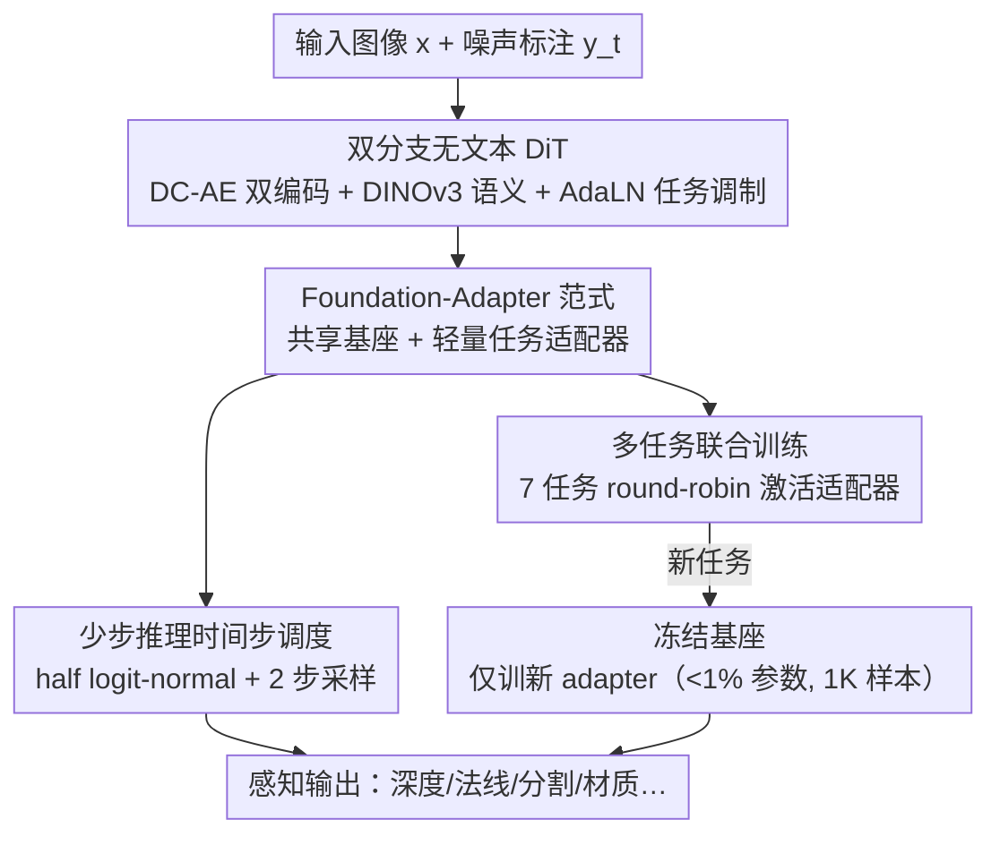

# UniPercept: A Unified Diffusion Model for Generalizable Visual Perception

**会议**: CVPR 2026  
**论文**: [CVF Open Access](https://openaccess.thecvf.com/content/CVPR2026/html/Zhao_UniPercept_A_Unified_Diffusion_Model_for_Generalizable_Visual_Perception_CVPR_2026_paper.html)  
**代码**: 项目页 https://VIPL-GENUN.github.io/Project-UniPercept （代码待确认）  
**领域**: 扩散模型 / 视觉感知  
**关键词**: 扩散模型, 视觉感知, 基座-适配器, 参数高效微调, Rectified Flow

## 一句话总结
UniPercept 把一个 DiT 扩散模型改造成「共享基座 + 轻量适配器」的通用视觉感知框架：基座在深度、法线、反照率、分割等 7 个感知任务上联合训练学到通用感知先验，新任务只需训练 <1% 参数的小适配器、1000 张样本就能高效适配，在 14 个感知任务上多数超过统一型生成模型、逼近专用模型。

## 研究背景与动机
**领域现状**：扩散模型擅长生成，能捕捉精细的结构与语义信息，于是近年被大量当作「感知骨干」——把深度估计、法线估计、语义分割、本征图像分解（反照率/光照）等任务重写成「图像到图像生成」问题，用预训练扩散模型微调出对应输出（Marigold、Lotus、RGB2X、Diception 等）。

**现有痛点**：现有扩散感知方法分两类，都不理想。第一类给每个任务单独训一个模型，任务一多，GPU、数据、能耗成本线性膨胀；第二类用一个统一模型同时干多任务（Diception、OmniGen、OneDiffusion 等），省了参数，但结构僵硬——它们主要靠**文本提示**来区分任务，于是模型的泛化被锁死在「预定义的那几条文本指令」上，想加一个全新感知目标（比如 PBR 材质里的粗糙度、金属度），往往得把整个模型重训或全量微调。

**核心矛盾**：「统一」和「可扩展」之间存在张力。文本条件让多任务能塞进一个模型，但也把任务集钉死了；要支持任意新任务，又不能每来一个任务就动整张网络。根子在于：通用的感知知识（结构、语义、几何先验）和任务特有的输出格式被耦合在同一套参数里，没有解耦的接口。

**本文目标**：要一个「学一次、处处适配」的框架——基座学通用感知能力，新任务用极少参数、极少数据、极快收敛地接上去，且不破坏已有任务。

**切入角度**：作者借鉴参数高效微调（adapter/LoRA）和 ControlNet 迁移（CTRL-Adapter）的思路——把「通用知识」放进一个冻结的大基座，把「任务特性」交给可插拔的小模块。关键观察是：纯视觉信息足以做感知，文本条件其实是多余的，去掉它换成「适配器 + 任务调制」反而更灵活。

**核心 idea**：提出 foundation–adapter 范式——一个共享扩散基座捕捉跨域通用感知表示，每个任务配一个 <1% 参数的轻量适配器；新任务冻结基座、只训新适配器即可。

## 方法详解

### 整体框架
UniPercept 把感知任务统一建模成一个 **Rectified Flow（整流流）**：对第 $m$ 个任务，在高斯噪声 $y^m_1 \sim \mathcal{N}(0,I)$ 和目标标注 $y^m_0$ 之间、以输入图像 $x$ 为条件建立一条 ODE 轨迹 $dy^m_t = v_{\phi,\psi_m}(y^m_t, x, t)\,dt$，其中速度场 $v_{\phi,\psi_m}$ 由**共享基座 $\phi$** 和**任务适配器 $\psi_m$** 共同参数化；推理时从 $t=1$ 反解到 $t=0$ 还原出标注。整个系统由三块构成：一个双分支的 DiT 扩散基座（输入图像分支 + 标注分支），一组按任务激活的轻量适配器，以及一套对齐少步推理的时间步采样策略。基座在 7 个基础任务上联合训练学通用先验，新任务则冻结基座、只插一个新适配器适配。

### 关键设计

**1. Foundation–Adapter 范式：把「通用感知知识」和「任务特性」解耦成两套参数**

针对「统一模型靠文本提示钉死任务集、加新任务要重训整网」的痛点，UniPercept 把一张大网拆成两部分：一个**共享扩散基座 $\phi$** 负责跨任务的通用感知表示，一组**任务适配器 $\{\psi_m\}$** 负责各自任务的输出特性。基座训练阶段，$\phi$ 和所有适配器用 Flow Matching 目标联合优化：

$$\min_{\phi,\psi_{1:M}}\ \mathbb{E}_{x,m,y^m_0,\epsilon,t}\big\|v_{\phi,\psi_m}(y^m_t,x,t)-(\epsilon-y^m_0)\big\|_2^2,\quad y^m_t=(1-t)y^m_0+t\epsilon.$$

适配新任务时，冻结基座、只引入新适配器 $\psi_\star$，用同样的 Flow Matching 目标 $\min_{\psi_\star}\mathbb{E}\|v_{\phi_{\text{frozen}},\psi_\star}(y^\star_t,x,t)-(\epsilon-y^\star_0)\|_2^2$ 优化。这样做之所以有效，是因为基座在 7 个差异足够大的任务上被「逼出」了通用的结构/语义/几何先验，新任务不再从零学感知，只用 <1% 的参数、约 1000 张样本就能在单张 RTX 4090 上收敛；消融显示直接在 Sana 基线上微调 DIS 任务要 30000 步才追平，而 UniPercept 1000 步就收敛。这是和文本条件型统一模型的本质区别：扩展任务是「插一个新模块」，而不是「改一遍整网」。

**2. 双分支无文本 DiT 架构：用视觉对视觉，去掉多余的文本条件**

这是基座的具体长相，目标是让「图像」和「标注」两个域在同一个 DiT 里充分交互。作者以 Sana（DiT + 压缩自编码器 + 线性注意力）为骨干，改成**双分支**：图像分支和标注分支分别用 DC-AE 编码进 latent，加上域不变位置编码保证空间对齐；图像分支再注入预训练 DINOv3 的高层语义特征。每个 DiT block 用**线性注意力**做两域间的高效特征交互，并配 Mix-FFN。一个关键决定是**移除文本交叉注意力**——作者认为感知任务里纯视觉信息就够了，文本条件多余，去掉它换成更灵活的任务调制。任务条件靠 **AdaLN-Zero** 实现：对第 $m$ 个任务，用图像分支嵌入 $r_0$、标注分支嵌入 $r_m$ 与时间步嵌入 $e_t$ 组合，预测调制参数 $(\gamma_m,\beta_m,\alpha_m)=\text{MLP}_t(e_t)+\text{MLP}_r(r_m)$，再做 $\hat h=\gamma_m\odot \text{LN}(h_{in})+\beta_m$、$h_{out}=h_{in}+\alpha_m\odot f(\hat h)$，让特征归一化随去噪阶段和任务条件自适应调整。适配器本身是个 bottleneck 残差模块，插在线性注意力和 Mix-FFN 里：$h_{out}=h_{in}+\text{SiLU}(h_{in}W_{down})W_{up}$，$W_{down}\in\mathbb{R}^{d\times r}$、$W_{up}\in\mathbb{R}^{r\times d}$；瓶颈比 $d/r=64$ 时新增参数 <1%。去掉文本条件 + 视觉双分支 + AdaLN 任务调制三者配合，让「区分任务」这件事从「读文本提示」变成「换适配器 + 调制信号」，这正是范式 1 能成立的架构基础。

**3. 多任务联合训练 + 统一 RGB 标注表示：让异构任务在一个生成框架里共享监督信号**

针对「不同感知任务输出格式天差地别、难统一」的问题，UniPercept 做两件事。其一是**统一表示**：把所有标注都转成一致的 RGB 三通道——深度这类单通道图复制到三通道，分割/人体骨架这类离散标注渲染成彩色编码 RGB 图，于是异构任务都变成同一种「图到图」生成。其二是**多目标联合训练**：基座在 7 个差异足够大的基础任务（深度、法线、反照率、辐照度、语义分割、线稿、人体骨架）上训练，每步按当前任务以 round-robin 方式动态激活对应适配器，基座参数全程共享。这样基座被「喂」了一整个谱系的感知信号，逼着它学到跨任务的共性表示，把通用感知和任务特化解耦开。作者用消融验证了这不是简单堆任务：任务集越多样，泛化越好（即使每个任务分到的训练步数变少），且联合训练的任务之间是**正向协同**而非负迁移——只训深度时 AbsRel 8.4，加到 7 任务后降到 7.3、法线 11.25° 准确率从 49.3 升到 54.4，说明多任务提供了互补的监督信号、得到更鲁棒的共享表示。

**4. 对齐少步推理的时间步调度：让训练分布迁就「少步反而更准」的反直觉现象**

作者观察到一个反直觉现象：明明模型是按渐进去噪训练的，但**推理用更少步数反而定量结果更好**。痛点是标准的时间步采样和这种少步推理不匹配，浪费了高噪声区的建模能力。解法是改训练时的时间步调度去对齐少步推理：采用**改良的半 logit-normal 采样**——先从 logit-normal 分布的下半段 $(0,0.5]$ 采样，再线性映射回整个 $(0,1]$ 区间。这种「截断 + 重缩放」把训练样本集中到高噪声区（$t\to 1$），让模型在轨迹早期就学到更强的全局去噪动态，从而在少步推理下更稳更准、收敛也更快。最终评估用 **2 步采样** + 6 次不同噪声初始化的集成，既快又准——这也是 UniPercept 在 1024×1024 分辨率下仅 2.7 秒/图、远快于 RGB2X（15.4s）和 PixWizard（43.3s）的原因之一。

### 损失函数 / 训练策略
基座用 CAME-8bit 优化器、BF16 混合精度，在 8×A6000 上训 120K 步、总 batch 32；学习率前 90K 步 $1\times10^{-4}$、后 30K 步衰减到 $1\times10^{-5}$。新任务适配在单张 RTX 4090 上训 30K 步、batch 4，仅训练瓶颈比 64× 的适配器（<1% 参数）。图像统一缩放到约 1024px 并保持原始长宽比。

## 实验关键数据

### 主实验
基座任务上，UniPercept 在统一型框架中普遍最优，部分指标超过专用模型。以法线估计为例（mean 角度误差越低越好，准确率越高越好）：

| 数据集/指标 | UniPercept | OmniGen | PixWizard | Diception | Jodi | 专用 Lotus-G |
|--------|------|------|------|------|------|------|
| NYUv2 mean↓ | **17.2** | 28.9 | 23.5 | 18.3 | 21.1 | 16.5 |
| NYUv2 11.25°↑ | **55.6** | 18.1 | 33.9 | 52.5 | 47.7 | 59.4 |
| ScanNet mean↓ | **16.8** | 28.9 | 26.6 | 19.3 | 24.3 | 15.1 |
| iBims mean↓ | **17.9** | 31.3 | 22.5 | - | 20.1 | 17.2 |

在统一型方法里 UniPercept 全面领先，甚至超过 StableNormal、Marigold 等专用法线模型；深度任务上在统一框架内同样最优，DIODE（含挑战性室外场景）上还胜过多数专用方法。反照率/辐照度上以更少 GT 样本（23K vs RGB2X 的 90K）达到与 RGB2X 相当的水平。

### 消融实验
基础任务的「多样性」直接决定泛化与任务协同：

| 配置 | 深度 AbsRel↓ | 深度 δ1↑ | 法线 mean↓ | 法线 11.25°↑ |
|------|---------|---------|---------|---------|
| 只训深度 | 8.4 | 92.7 | – | – |
| 只训法线 | – | – | 18.5 | 49.3 |
| 深度+法线+反照率 | 7.9 | 93.4 | 18.3 | 49.8 |
| 全部 7 任务 | **7.3** | **94.8** | **17.4** | **54.4** |

数据效率上，新任务仅用 1000 张样本就逼近全量训练：边缘检测（BSDS500）上 1K 数据 ODS 0.810 反超全量的 0.806、也超过专用判别式方法 PiDiNet（0.807）；粗糙度/金属度估计超过所有统一型扩散框架。可训练参数仅 12.7M，而对手普遍 >800M。

### 关键发现
- **多任务是正向协同而非负迁移**：从「只训单任务」到「7 任务联合」，深度、法线、反照率指标同步提升，说明任务间提供了互补监督，得到更鲁棒的共享表示——这是 foundation–adapter 范式成立的实证基础。
- **基座是「收敛加速器」**：DIS 任务上 UniPercept 1000 步收敛，直接在 Sana 基线微调要 30000 步才追平，30× 训练效率提升来自预训练学到的通用感知先验。
- **适配器瓶颈越宽精度越高**：瓶颈从 16× 到 128×，视觉结果相近但 PSNR/SSIM 随容量增大而提升，说明更大适配器容量带来更强任务适配能力——但即便最宽也远少于对手的参数量。
- **少步推理又快又准**：2 步采样 + 6 次集成，1024² 下 2.7s/图，比 RGB2X、PixWizard 快 5~16 倍，源于时间步调度对齐了少步推理。

## 亮点与洞察
- **「去掉文本条件」反而解锁了扩展性**：现有统一模型把文本当任务开关，结果任务集被钉死；UniPercept 反其道而行——纯视觉双分支 + 适配器/AdaLN 调制，让「加任务」从「改整网」降级成「插小模块」，这是把 PEFT 思想干净地搬进感知的范例。
- **基座作为「感知先验银行」**：7 个差异够大的任务联合预训练，把通用结构/语义/几何先验沉淀进冻结基座，新任务（哪怕是 PBR 粗糙度、金属度这类离基座很远的）只取不存，1K 样本即可上手——这套「学一次、处处适配」的思路可迁移到任何缺标注的密集预测新任务。
- **反直觉的「少步更准」被工程化**：把「少步推理反而更好」的观察转成训练侧的半 logit-normal 时间步调度，让训练分布迁就推理方式，是个简单但收益明确的对齐 trick，可复用到其他 Rectified Flow 感知模型。

## 局限与展望
- **并非全面碾压专用模型**：在反照率（PSNR 16.8 vs Marigold 18.2）、二分图分割 DIS（远低于专用 BiRefNet 的 .896）等任务上明显落后专用 SOTA，统一框架在某些精细任务上仍有精度代价。
- **依赖伪标签质量**：基座预训练大量用 Depth Anything V2、Lotus、Marigold 等现成预测器在 Pexels 上生成伪标签，基座感知上限会被这些「教师」的误差封顶，作者未深入分析伪标签噪声的影响。
- **「为什么少步更准」缺机理解释**：论文把它当经验现象工程化处理，但没给出理论分析；这一现象在不同任务/分辨率下是否稳定、半 logit-normal 的超参如何最优选择，仍待探究。
- **任务调制的可扩展边界未测**：14 个任务能行，但当任务数继续扩大、适配器数量膨胀时，round-robin 训练是否仍稳定、基座容量是否会成为瓶颈，论文未给出压力测试。

## 相关工作与启发
- **vs Diception / OmniGen / OneDiffusion（统一扩散感知）**：它们也用一个模型干多任务，但靠文本提示区分任务、任务集预定义且扩展需重训；UniPercept 去掉文本条件、用冻结基座 + 轻量适配器，扩展新任务只训 <1% 参数，灵活性和数据效率显著更高。
- **vs Marigold / Lotus / RGB2X（单任务扩散感知）**：它们为每个任务单独微调一个扩散模型，精度高但训练成本随任务数线性增长；UniPercept 共享基座摊薄成本，多数任务逼近甚至局部超过这些专用模型，代价是个别精细任务略有精度损失。
- **vs CTRL-Adapter / LoRA / Adapter（参数高效微调）**：UniPercept 把「adapter 迁移预训练能力」的思路从生成可控性搬到视觉感知，配合双分支 DiT 和 AdaLN 任务调制，证明 PEFT 范式同样能撑起一个可扩展的通用感知基座。

## 评分
- 新颖性: ⭐⭐⭐⭐ 把 foundation–adapter / PEFT 范式干净地引入扩散视觉感知，「去文本条件 + 适配器扩展」组合在感知统一框架里是清晰的新角度。
- 实验充分度: ⭐⭐⭐⭐ 覆盖 14 任务、对比专用与统一型多个 SOTA，含任务协同、基座多样性、瓶颈大小、收敛速度等多组消融，较完整；个别任务落后未深究。
- 写作质量: ⭐⭐⭐⭐ 动机—范式—架构层层递进，公式与表格清晰；少步推理现象的机理解释偏薄。
- 价值: ⭐⭐⭐⭐ 提供了「学一次、低成本适配任意密集预测新任务」的实用范式，对缺标注场景的视觉感知有较强工程与研究价值。

<!-- RELATED:START -->

## 相关论文

- [\[ICML 2026\] A Unified Framework for Diffusion Model Unlearning with f-Divergence](../../ICML2026/image_generation/a_unified_framework_for_diffusion_model_unlearning_with_f-divergence.md)
- [\[CVPR 2026\] Visual Diffusion Models are Geometric Solvers](visual_diffusion_models_are_geometric_solvers.md)
- [\[CVPR 2026\] ParaUni: Enhance Generation in Unified Multimodal Model with Reinforcement-driven Hierarchical Parallel Information Interaction](parauni_enhance_generation_in_unified_multimodal_model_with_reinforcement-driven.md)
- [\[CVPR 2026\] Enhancing Image Aesthetics with Dual-Conditioned Diffusion Models Guided by Multimodal Perception](enhancing_image_aesthetics_with_dualconditioned_di.md)
- [\[CVPR 2025\] Traversing Distortion-Perception Tradeoff Using a Single Score-Based Generative Model](../../CVPR2025/image_generation/traversing_distortion-perception_tradeoff_using_a_single_score-based_generative_.md)

<!-- RELATED:END -->
