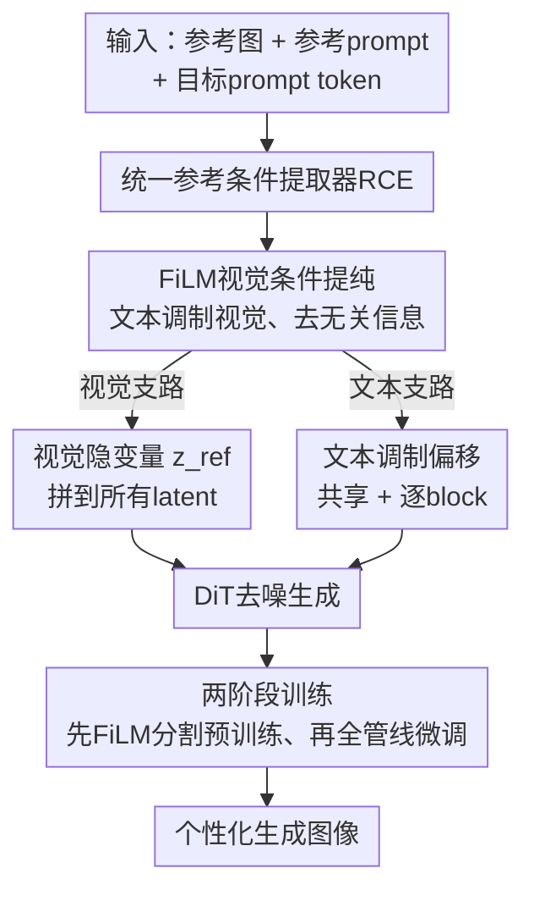

# UniVerse: A Unified Modulation Framework for Segmentation-Free, Disentangled Multi-Concept Personalization

**会议**: CVPR 2026  
**论文**: [CVF Open Access](https://openaccess.thecvf.com/content/CVPR2026/html/Phung_UniVerse_A_Unified_Modulation_Framework_for_Segmentation-Free_Disentangled_Multi-Concept_Personalization_CVPR_2026_paper.html)  
**代码**: 待确认（作者承诺开源代码与预训练模型）  
**领域**: 图像生成 / 多概念个性化  
**关键词**: 主体驱动生成、多概念个性化、Diffusion Transformer、调制（modulation）、免分割

## 一句话总结
UniVerse 用一个统一的「参考条件提取器（RCE）」从**未经分割的真实照片**里，依据参考 prompt 同时抽出视觉条件隐变量和文本调制偏移量，在 Diffusion Transformer 上实现免分割、可解耦、可组合的多概念个性化生成，在 XVerseBench 与新提出的 UniVerseBench 上全面超过现有方法。

## 研究背景与动机

**领域现状**：文生图个性化（personalization / customization）已从早期需要逐主体微调的 DreamBooth、Textual Inversion，演进到免调优（tuning-free）的 IP-Adapter、PhotoMaker、PuLID 这类直接把参考图视觉特征注入扩散过程的方法；近期又随着 Diffusion Transformer（DiT）兴起，出现 OmniGen、UNO、DreamO 这类能在单图里组合多个概念的统一 transformer 模型。

**现有痛点**：统一 transformer 模型常常出现**特征纠缠**——一个主体的属性会泄漏到另一个主体上（concept leakage）；而它们普遍采用全局视觉特征注入，又会拖累整图质量。为缓解纠缠，最新一类「调制（modulation）」方法（TokenVerse、Mod-Adapter、XVerse）改为只在**文本条件流**上加偏移量，靠精修 text embedding 实现高精度、解耦的多主体控制。

**核心矛盾**：但这些调制方法引入了一个新的致命限制——它们**几乎都要求干净、预先分割好的参考图**。而真实世界「in-the-wild」的照片恰恰是杂乱、多物体、没分割的。背后被长期忽视的问题是：要从杂乱参考图里抽对概念，既不能靠一个泛化的单词标签（"person" 没法在合影里指定「左边那个男人」），也不能靠分割 mask（艺术风格、纹理、材质这类抽象概念根本没法分割）。

**本文目标**：做到真正免分割（segmentation-free）的 in-the-wild 主体驱动生成，且能(i) 准确定位/解耦杂乱图里的目标概念，(ii) 既支持具体物体也支持抽象属性（风格、姿态、材质），(iii) 既能分解概念也能重新组合概念。

**切入角度**：以往工作要么只做视觉条件、要么只做文本调制，要么把两者松散拼接。作者的关键观察是：视觉外观和文本语义这两类条件**应该由同一个模块、在参考 prompt 引导下协同产出并语义对齐**，这样才能保证它们对生成过程的一致约束。

**核心 idea**：用一个统一的 Reference Condition Extractor（RCE），在参考 prompt 指引下，从单一模块同时产出「视觉条件隐变量 $z_{ref}$（管外观）」和「文本调制偏移 $\tilde\Delta$（管语义）」，二者语义对齐，从而免分割地解耦并重组多概念。

## 方法详解

### 整体框架
UniVerse 建立在 DiT 的调制机制之上。回顾 DiT：条件信息（如 CLIP 文本嵌入、时间步 $t$）通过 Adaptive LayerNorm（AdaLN）注入，一个 MLP 把条件映射成向量 $y=\text{MLP}(t, f(p))$，再拆成 scale 和 shift 去调制网络激活。TokenVerse 的创新是给**每个 text token** 学一个个性化偏移 $\Delta$，让 $\tilde y_i = y + \tilde\Delta_i$；XVerse 进一步用一个通用 adapter 从参考图 $I_i$ 零样本地生成偏移 $\tilde\Delta_i$。

UniVerse 在此之上做两件事：① 输入不仅有参考图 $I_i$ 和对应 token $p_i$，还多了一条**参考 prompt $r_i$**，用来告诉模型「该从这张参考图里抽哪个概念」（例如参考图里男人「坐在草地上」，但最终 prompt 要让他「骑马」，参考 prompt 帮助把概念和动作解耦）；② RCE 同时吐出两路条件——文本偏移 $\tilde\Delta_i$ 注入调制路径，视觉隐变量 $z_{ref}$ 拼接到所有 latent 输入上参与去噪。整个流程靠两阶段训练落地。

### 关键设计

**1. 参考条件提取器 RCE：用一个模块同时产出语义对齐的视觉与文本条件**

针对「视觉条件和文本条件各做各的、彼此不对齐」这个痛点，RCE 把两路条件统一在一个模块里、并由同一条参考 prompt 引导。具体地，用 CLIP 图像编码器抽参考图特征 $F=f_V(I)\in\mathbb{R}^{N\times D}$、CLIP 文本编码器抽参考 prompt 特征 $x=f_T(r)\in\mathbb{R}^{D}$，二者先在视觉提纯模块里融合（见设计 2），融合后再分别走向视觉隐变量和文本偏移两条出口。这样产出的两类条件天然语义对齐——它们来自同一组提纯过的特征，都锚定在「参考 prompt 指定的那个概念」上，而不是像以往那样把视觉特征和文本调制松散拼起来。这是 UniVerse 能在杂乱图里「抽对概念」的根，也是它免分割的前提：参考 prompt 取代了分割 mask 的定位作用。

**2. FiLM 视觉提纯：让文本告诉视觉「保留什么、丢掉什么」**

杂乱参考图的视觉特征里混入了大量与目标概念无关的信息（背景、其他物体），直接注入就会造成泄漏。UniVerse 用 Feature-wise Linear Modulation（FiLM）让文本特征去调制视觉特征：对每个视觉向量 $F_j$，

$$\text{FiLM}(F_j, x) = g_i(x) F_j + h_i(x)$$

其中 scale 函数 $g(\cdot)$ 和 shift 函数 $h(\cdot)$ 都由文本特征 $x$ 生成，逐通道地缩放/平移视觉向量，把非目标信息压下去、目标信息留下来。提纯后的视觉特征再经一层 MLP 投影到 DiT 的 latent 空间得到 $z_{ref}$。和直接用原始 CLIP 视觉特征相比，这一步等于先做了一次「文本引导的软分割」，因此不需要真正的分割 mask。

**3. 双偏移文本调制：在 XVerse 基础上拆出「共享 + 逐 block」两级偏移**

文本条件方面，UniVerse 沿用 XVerse 的思路用 Perceiver 层把视觉特征注入 token $p_i$ 的 T5 嵌入，但有两点改动：一是注入的是上面 FiLM 提纯后的视觉特征（而非原始 CLIP 特征），二是为每个参考 token 学**两个**调制偏移——一个在所有 DiT block 间**共享**的 $\tilde\Delta_i^s$，和一个**逐 block 专属**的 $\tilde\Delta_i^j$。第 $j$ 个 block 上第 $i$ 个 token 的最终调制向量为：

$$\tilde y_i^j = y + \tilde\Delta_i^s + \tilde\Delta_i^j$$

共享偏移负责跨层一致的概念身份，逐 block 偏移负责不同深度上的细粒度适配，二者叠加比单一偏移更能在保身份的同时做精细控制。训练时也据此分两步：先 10 万步只学共享偏移，再 5 万步联合学逐 block 适配（见训练策略）。

**4. 两阶段训练 + Cross-Reference 增强：先学会定位，再学会生成**

把「定位概念」和「生成图像」一锅端地训会很难收敛。UniVerse 拆成两阶段：**Stage 1（RCE 预训练）** 在大规模指代分割数据集 PhraseCut 上只训 FiLM 模块，额外挂一个 CLIPSeg 解码器、用二元交叉熵分割损失 $\mathcal{L}_{seg}$ 监督，逼 FiLM 学会「根据文本从图里定位出对应概念的粗 mask」；**Stage 2（微调）** 冻结所有编码器，把 FiLM 用 Stage 1 权重初始化、其余 RCE 组件从头训，给 DiT 加 rank=128 的 LoRA，用标准扩散损失 $\mathcal{L}_{diff}$ 在自建多概念数据集上联合训练。此外，因为多概念样本稀缺，作者把多张参考图**横向拼接**成一张来逼模型学会从混合图里抽对概念，称为 **Cross-Reference** 增强。消融显示去掉预训练、去掉 Cross-Reference 都会掉点，说明「先定位、再生成」的分解和这个增强都是必要的。

### 损失函数 / 训练策略
- Stage 1：仅训 FiLM + CLIPSeg 解码器，损失为分割 BCE $\mathcal{L}_{seg}$；10 epoch，lr $1\times10^{-4}$，cosine 调度，按验证集 IoU 选最佳 epoch。
- Stage 2：训整条 RCE + DiT（编码器冻结），损失为扩散损失 $\mathcal{L}_{diff}$；共 150K 步，前 100K 步学共享偏移、后 50K 步联合学逐 block 偏移；lr $5\times10^{-6}$，AdamW，batch 16，8×A100。DiT 用 LoRA（rank 128）适配新条件。

## 实验关键数据

### 主实验
在 XVerseBench 上（VLM-as-judge 的 DPG/ID-S/IP-S/AES 等综合指标），UniVerse 单主体与多主体的总均分都最高：

| 设置 | 指标 | UniVerse | 次优(XVerse) | 说明 |
|------|------|----------|--------------|------|
| 单主体 | Avg↑ | **78.14** | 74.36 | 领先次优 >3 分，ID-S/IP-S 显著最强 |
| 多主体 | Avg↑ | **70.18** | 67.93 | 领先所有 baseline >2 分 |
| 总体 | Overall↑ | **74.16** | 71.15(XVerse) | 全表第一 |

在自建的 UniVerseBench（专测「从同一参考图里解耦共现概念」，用 IP-S/AES）上同样全面领先：

| 设置 | 指标 | UniVerse | 次优 | 说明 |
|------|------|----------|------|------|
| 单主体 | Avg↑ | **53.06** | 51.72(MS-Diffusion) | |
| 多主体 | Avg↑ | **48.64** | 48.21(OmniGen) | |
| 总体 | Overall↑ | **51.05** | 50.49(MS-Diffusion) | 解耦共现概念能力最强 |

UniVerseBench 由 20 张参考图、200 条 prompt 组成，每张参考图含两个共现主体，逼模型在歧义条件下抽对概念——这是已有 benchmark 覆盖不足的维度。

### 消融实验
在 UniVerseBench 多物体设置上（均分 48.64 为完整模型）：

| 配置 | Avg↑ | ΔAvg | 说明 |
|------|------|------|------|
| Baseline（完整） | 48.64 | 0.00 | 完整模型 |
| w/o RCE 预训练 | 47.89 | -0.75 | 去掉 Stage 1 定位预训练 |
| w/o Cross-Reference | 47.90 | -0.74 | 去掉横向拼接增强 |
| w/o 视觉隐变量(推理) | 47.14 | **-1.50** | 推理时不用 $z_{ref}$，掉点最多 |

### 关键发现
- **视觉隐变量 $z_{ref}$ 贡献最大**：推理时去掉它掉 1.50 分，远超去掉预训练（-0.75）或 Cross-Reference（-0.74），说明仅靠文本调制不够，视觉条件对外观保真至关重要——这也印证了「双路统一」而非「纯文本调制」的设计取向。
- **两个辅助设计各贡献约 0.75 分**：RCE 预训练和 Cross-Reference 增强贡献相近，且都为正，验证「先定位再生成」与数据增强缺一不可。
- **组合容量有上限**：UniVerse 能稳定保持最多 6 个主体的身份保真；物体数升到 7–9 时会出现身份串扰（identity crosstalk）或实例缺失，是当前的能力天花板。
- **能泛化到抽象概念**：除离散物体外，UniVerse 还能解耦/组合姿态、材质这类非物体抽象属性（Table 1 中唯一同时支持「概念分解」与「抽象概念」的方法）。

## 亮点与洞察
- **「参考 prompt 取代分割 mask」是核心洞见**：用一句自然语言描述去定位概念，既能在合影里指定「左边那个人」，又能处理风格/材质这类无法分割的抽象概念，一举绕开了调制类方法对预分割的依赖——这是真正打开 in-the-wild 场景的钥匙。
- **单模块产出语义对齐双条件**：以往「视觉注入」和「文本调制」是两套互不相通的机制，UniVerse 用一个 RCE 把它们绑在同一条参考 prompt 上，保证视觉外观和文本语义指向同一个概念，避免松散拼接带来的不一致。这个「统一提取」思路可迁移到任何需要多模态条件协同的可控生成任务。
- **FiLM 当「软分割」用很巧**：把文本对视觉特征的 FiLM 调制理解为一次可学习的、无需 mask 的内容过滤，是用调制机制平替分割监督的一个干净做法。
- **共享 + 逐 block 双偏移**：把「跨层一致身份」与「逐层细粒度适配」解耦成两个偏移、并对应到两阶段训练步，是对 XVerse 单偏移的一个简洁而有效的升级。

## 局限与展望
- **缺免分割多参考 benchmark**：作者承认领域内还没有针对「3+ 概念、每个概念多属性」的全面免分割多参考评测基准，UniVerseBench 仍偏小（20 图/200 prompt）。
- **概念干扰未完全解决**：模型对概念泄漏并非完全鲁棒，需要靠「just the cat」这类限制性 prompt 来缓解；prompt 模糊或无意义时性能下降，偶尔会过拟合到某个参考主体。
- **组合数量受限**：超过 6 个物体即出现串扰/缺失，对高密度多主体场景（如大群体合影、复杂商品图）尚不可靠。
- **可改进方向**：① 把组合容量瓶颈定位到具体模块（是 latent 拼接稀释了？还是偏移叠加干扰了？）做针对性扩展；② 用更强的开放词表定位器替换 CLIPSeg 监督，提升对长尾/细粒度概念的定位；③ 构建更大规模、带多属性标注的免分割多参考基准。

## 相关工作与启发
- **vs XVerse / TokenVerse（调制类）**：它们靠纯文本 token 调制做解耦个性化，但要求干净的预分割参考图；UniVerse 沿用其调制思想，但用参考 prompt + FiLM 提纯 + 视觉隐变量补上了「免分割定位 + 视觉外观条件」，从而能 in-the-wild 工作且外观更保真（XVerse 在两个 benchmark 上均为次优）。
- **vs UNO / DreamO / OmniGen（统一 transformer）**：它们用注意力条件组合多概念，但易特征纠缠、全局注入伤质量；UniVerse 用统一双条件 + FiLM 软分割显著降低泄漏，多主体均分领先。
- **vs IP-Adapter / PhotoMaker / PuLID（U-Net 注入类）**：它们基于较弱文本编码器的 U-Net，复杂组合和细粒度语义控制受限；UniVerse 直接在 DiT 上做调制，扩展性和多概念能力更强。
- **启发**：「用一句参考 prompt 替代分割 mask 做概念定位」这个范式，可推广到可控编辑、组合式生成、甚至 3D/视频个性化中任何「需要从杂乱输入里挑出目标」的环节。

## 评分
- 新颖性: ⭐⭐⭐⭐ 「统一模块产出语义对齐的视觉+文本双条件」「参考 prompt 替代分割」是对调制类方法的实质性突破，但 FiLM、Perceiver、双阶段训练等组件多为已有技术的巧妙组合。
- 实验充分度: ⭐⭐⭐⭐ 两公开 benchmark + 自建 UniVerseBench，含消融与组合容量分析；但 UniVerseBench 规模偏小，DreamBench++ 结果挪到补充材料。
- 写作质量: ⭐⭐⭐⭐ 动机链（微调→免调→统一 transformer→调制→免分割）梳理清晰，方法图文对应；部分关键模块（Perceiver 细节、数据集构建）放在补充材料。
- 价值: ⭐⭐⭐⭐ 直击 in-the-wild 多概念个性化这一高价值实用痛点，免分割 + 抽象概念支持的组合很有落地意义，承诺开源。

<!-- RELATED:START -->

## 相关论文

- [\[ICLR 2026\] Mod-Adapter: Tuning-Free and Versatile Multi-concept Personalization via Modulation Adapter](../../ICLR2026/image_generation/mod-adapter_tuning-free_and_versatile_multi-concept_personalization_via_modulati.md)
- [\[CVPR 2026\] Unified Customized Generation by Disentangled Reward Modeling](unified_customized_generation_by_disentangled_reward_modeling.md)
- [\[CVPR 2026\] UniVerse: Empower Unified Generation with Reasoning and Knowledge](universe_empower_unified_generation_with_reasoning_and_knowledge.md)
- [\[CVPR 2026\] A Training-Free Style-Personalization via SVD-Based Feature Decomposition](a_training-free_style-personalization_via_svd-based_feature_decomposition.md)
- [\[CVPR 2026\] Omni-Attribute: Open-vocabulary Attribute Encoder for Visual Concept Personalization](omni-attribute_open-vocabulary_attribute_encoder_for_visual_concept_personalizat.md)

<!-- RELATED:END -->
