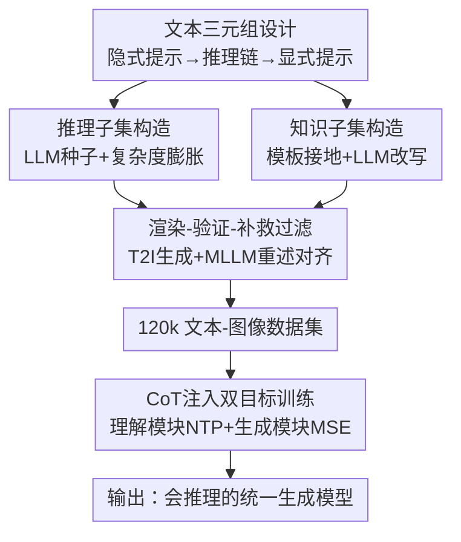

# UniVerse: Empower Unified Generation with Reasoning and Knowledge

**会议**: CVPR 2026  
**论文**: [CVF Open Access](https://openaccess.thecvf.com/content/CVPR2026/html/Sun_UniVerse_Empower_Unified_Generation_with_Reasoning_and_Knowledge_CVPR_2026_paper.html)  
**代码**: https://github.com/KaiyueSun98/UniVerse  
**领域**: 图像生成  
**关键词**: 统一多模态模型, 文生图, 推理增强, 思维链, 数据集

## 一句话总结
针对统一多模态模型「能看懂复杂提示却画不对」的痛点，本文构造了一个 120k 规模、由「隐式提示→推理链→显式提示」三元组配真值图像组成的数据集 UniVerse，并提出 CoT 注入训练把推理过程显式接进生成链路，让 Bagel 在 WISE / R2I-Bench 上的推理与知识类生成显著且一致地提升。

## 研究背景与动机
**领域现状**：统一多模态模型（Unified Multimodal Models, UMM，如 Bagel）把「理解」和「生成」放进一个框架，按理说既能看懂复杂意图、又能把它画出来。

**现有痛点**：实际上两者之间存在一道裂缝——模型能在理解侧解析出隐含意图，却在生成侧画不对，尤其当提示需要多步推理（算术、空间约束、因果）或专门知识（物理、化学、实体特征）时。比如「画出欧拉数 e 的整数部分个枕头」，模型常常直接画一堆枕头而不去算 $\lfloor e \rfloor = 2$。

**核心矛盾**：现有「推理导向」数据集把「语言复杂」当成了「真推理」。这些数据里的隐式提示其实不需要深层推理就能看懂，所谓的显式提示只是把原输入啰嗦地展开、堆细节，任务退化成同义改写而非真正的逻辑推导。本文称之为「伪推理」（pseudo-reasoning）。

**本文目标**：（1）造一个真正逼模型做逻辑推导和知识检索的大规模数据集；（2）找到一种训练方式，把推理过程显式注入生成链路，而不是只在评测时考模型。

**切入角度**：作者的假设是——把隐式意图翻译成忠实图像，中间需要一条「渐进式推理链」作为桥梁。于是把每条样本组织成「隐式提示 + 推理链 + 显式提示」的文本三元组，强制数据里包含「推不出来就画不对」的成分。

**核心 idea**：用「隐式→推理链→显式」三元组数据 + CoT 注入的双目标训练，把理解侧的推理能力显式传导给生成侧。

## 方法详解

### 整体框架
UniVerse 由两部分组成：一个精心构造的数据集，和一套把数据用起来的训练方法。数据侧把 120k 样本按能力切成两块——65k 的**推理子集**（算术、空间-属性约束、演绎、溯因）和 55k 的**知识子集**（学科、实体、时空），每条样本都是「隐式提示→推理链→显式提示」三元组配一张真值图。两块用不同管线生产：推理子集靠 LLM 驱动（种子 + 复杂度膨胀），知识子集靠模板接地 + LLM 改写（防止 LLM 在专业知识上幻觉）；两路汇合后过一道「渲染—验证—补救」过滤管线保证图文对齐。数据就绪后，在 Bagel 上做 **CoT 注入训练**：理解模块学着从隐式提示生成推理链+显式提示（NTP loss），生成模块以这段 CoT 为条件重建真值图（MSE loss），两个目标联合优化。

### 关键设计

**1. 文本三元组：把「推理」做进数据本身，而不是事后考**

针对「伪推理」痛点，作者要求每条样本必须满足「不推理就看不懂隐式提示」。三元组的三段各司其职：隐式提示 $p_{imp}$ 把答案藏在前提/规则/约束/知识里（如「6 件物品 17 个轮子，自行车比购物车多 1 辆」）；推理链 $r$ 给出从前提一步步推到结论的逻辑轨迹（列方程 $b+t+c=6$、$2b+3t+4c=17$、$b=c+1$，解出 2 车 3 三轮 1 购物车）；显式提示 $p_{exp}$ 才是清晰、可直接画的视觉描述。关键在于设计层面把**知识**和**推理**解耦——知识有时是推理的前提，但「应用逻辑去满足约束、构造解释」本身是另一种独立能力，所以拆成两个子集分别考核。这样数据天然逼模型去「推出没写出来的东西」，而不是把输入啰嗦地展开。

**2. 推理子集构造：LLM 种子 + 复杂度膨胀的可控扩库**

推理样本要既多样又难，纯手写不现实、纯 LLM 随机生成又难控难度。作者用「种子 + 膨胀」两阶段：每个子类的每个复杂度档手写 2-3 条种子提示，配上子类要求、生成步骤说明、可选物体池，让 LLM 先生成几百条打底（保证多样性）；再用迭代膨胀策略，把每条种子当范例去引导生成更多同档样本，把数据池扩到每子类约 $10^3$ 条。复杂度通过显式参数控制（如算术的运算步数、空间约束的物体数量），保证「难度可调、覆盖可控」，而不是一锅乱炖。

**3. 知识子集构造：模板接地 + LLM 改写，先保事实再保流畅**

知识类提示直接让 LLM 生成极易出事实错误/幻觉（尤其数学、科学）。作者改用「模板接地」的混合法：先为每个知识类（学科、时空、实体）设计结构化模板，把抽象知识锚在可变上下文里（如化学反应的具体物质、历史事件的精确地点日期），再程序化地把经人工核验的合法元素滚进模板，批量生成事实正确、覆盖广的候选提示。但模板化文本生硬、缺多样性，于是再让 LLM 用高温采样改写、在保留核心事实约束的前提下做创造性同义表达；最后由同一个 LLM 产出对应的推理链和显式提示。这套「先程序化保正确、再 LLM 保自然」的次序，正好把模板的可靠性和 LLM 的语言流畅性各取所长。

**4. 渲染—验证—补救过滤管线：用 MLLM 闭环保证图文对齐**

文本三元组造好后，还要配上忠实的真值图，且不能引入脏数据。作者把所有三元组用 Nano-Banana、HunyuanImage-3.0 等 SOTA 文生图模型渲成图，再做两级验证：先用 MLLM 给生成图重述（recaption），计算重述与原显式提示的语义相似度，高对齐的样本直接保留；对错位样本，MLLM 进一步评图像质量——若画质可接受（无伪影、内容明确），就反过来**调整隐式提示和推理链**去对齐 MLLM 的重述，并把重述作为新的显式提示，从而「抢救」本会被丢弃的样本。消融显示这些被抢救保留的样本质量不逊于其他样本（见实验），说明这步既提质又提量。

**5. CoT 注入的双目标训练：把推理链显式接进生成条件**

有了数据，怎么用是关键。Bagel 本身支持「带思考」（先生成 CoT 再画图）和「不带思考」两种模式。作者的训练把自家 CoT 注入生成链路，并行优化两个目标。第一路在**理解模块**：输入隐式提示，把「推理链 ⊕ 显式提示」拼接成 CoT 作为目标，算 Next-Token-Prediction 损失 $\mathcal{L}_{NTP}$，让模型学会自己把隐式提示精化成更适合生成的文本条件。第二路在**生成模块**：把生成出的 CoT 内容作为条件输入，训练模型重建真值图，用 MSE 损失 $\mathcal{L}_{MSE}$。最终目标是两者的加权和：

$$\mathcal{L}_{total} = \lambda_{NTP}\,\mathcal{L}_{NTP} + \lambda_{IMG}\,\mathcal{L}_{MSE}$$

实验取 $\lambda_{NTP}=0.1$、$\lambda_{IMG}=1$。这样模型一方面通过文本监督学到细致的推理过程，另一方面借这条 CoT 生成更忠实于隐含意图的图像，把「理解」和「生成」更紧地耦合起来。作为对照，作者还设计了不注入 CoT 的基线：冻结理解模块，生成模块直接以隐式提示为条件、只优化 $\mathcal{L}_{MSE}$，用来证明 CoT 数据本身的贡献。

### 损失函数 / 训练策略
除上面的 $\mathcal{L}_{total}$ 外，作者强调两点工程要点：（1）跨所有 batch 做彻底的数据洗牌，配合联合优化才能稳定收敛、防止模型过拟合到某个类别；（2）训练时长与学习率调度强相关——总步数很大的长训练，需要按比例更长的 warm-up，经验上把 warm-up 设为总步数约 20% 时最稳，让模型在 LR 衰减前先适应双目标优化。

## 实验关键数据

### 主实验
基模型 Bagel，在 WISE（侧重世界知识）和 R2I-Bench（侧重多步推理）上评测，分「不带思考」和「带思考」两种推理模式。下表取两个 benchmark 的 Overall 分（越高越好）：

| 模式 | 模型 | WISE Overall | R2I-Bench Overall |
|------|------|------|------|
| 不带思考 | BAGEL 基线 | 0.52 | 0.36 |
| 不带思考 | w/o CoT 训练 | 0.55 | 0.40 |
| 不带思考 | **w/ CoT 训练（本文）** | **0.56** | **0.44** |
| 带思考 | BAGEL 基线 | 0.70 | 0.48 |
| 带思考 | w/o CoT 训练 | 0.74 | 0.51 |
| 带思考 | **w/ CoT 训练（本文）** | **0.77** | **0.54** |

在 R2I-Bench 上，本文相对基线提升最显著：不带思考时 +0.08（0.36→0.44），带思考时 +0.06（0.48→0.54），且都优于 w/o CoT 变体，说明增益不只来自数据、更来自 CoT 注入。最突出的是因果（CA）类——不带思考时本文 0.69，大幅碾压基线 0.35 和 w/o CoT 的 0.32，表明模型学会了追问提示背后的「为什么」而不只是「画什么」。

### 消融实验
Table 2 在 WISE（带思考）上比较用不同数据类别训练的效果（Overall 分）：

| 训练数据 | WISE Score | 说明 |
|------|---------|------|
| Arithmetic | 0.72 | 仅算术推理 |
| Arithmetic（去掉抢救样本） | 0.71 | 去掉过滤管线抢救的样本反而掉 0.01 |
| Spatial-Attr | 0.72 | 仅空间-属性约束 |
| Discipline | 0.73 | 仅学科知识 |
| Reasoning 子集 | 0.74 | 整个推理子集 |
| Knowledge 子集 | 0.73 | 整个知识子集 |
| **All Data（全量）** | **0.77** | 完整 UniVerse |

### 关键发现
- **CoT 注入在「带思考」模式下收益最大**：w/ CoT 与基线的差距在开启思考后被进一步放大，说明联合训练不只是教模型答推理题，而是让它学到一套可按需激活的、可泛化的推理机制。
- **全量数据 > 任何单一类别**：单类别都能涨点（0.72~0.74），但全量 All Data 才到 0.77，类别间存在互补性；推理子集单独贡献最大，作者认为主要因为它样本量最大。
- **抢救样本不是噪声**：算术类里保留过滤管线抢救的样本（0.72）优于丢弃它们（0.71），验证了这些被 MLLM 校正过的样本质量过关、且增量有用。

## 亮点与洞察
- **「伪推理」这个问题点抓得准**：把「语言复杂」和「真推理」区分开，并用「隐式提示必须推理才能解」的硬约束反逼数据质量，是这篇最锋利的洞察——它解释了为什么过去很多推理数据集训不出推理能力。
- **数据 + 训练的闭环**：不止给数据，还给了「推理链该怎么用」的训练范式（NTP 学推理链、MSE 以推理链为条件生成），把评测期才用的「思考模式」前移到训练期内化，这个迁移思路可复用到其他「理解强、生成弱」的统一模型。
- **构造管线对症下药**：推理类用 LLM 自由生成 + 复杂度可控膨胀，知识类用模板接地防幻觉——按数据特性选不同管线，而不是一招通吃，这套「分而治之 + MLLM 闭环过滤」的数据工程值得借鉴。

## 局限与展望
- **强依赖基模型本身的思考能力**：方法收益最大处是 Bagel 的「思考模式」，对不支持显式 CoT 的生成模型能否迁移、收益多少，文中未验证。
- **真值图来自其它 T2I 模型合成**：120k 图主要由 Nano-Banana / HunyuanImage-3.0 等模型生成，真值图的上限被这些模型的能力和偏差所限；MLLM 重述对齐也会引入评判模型自身的偏差。
- **绝对分数仍偏低**：R2I-Bench 即便最佳也只 0.54，数学（MT）类即便提升后也仅 0.30 上下，说明复杂推理生成离「可靠」还很远；提升幅度（+0.04~0.08）虽一致但有限。
- **改进方向**：可探索把过滤管线的 MLLM 评判换成更强/多评判者集成、把推理链做成可变长度的难度课程，以及在原生支持长思维链的更强 UMM 上验证泛化性。

## 相关工作与启发
- **vs Commonsense-T2I / PhyBench / WISE / R2I-Bench**：这些都是评测 benchmark，只「考」模型推理/知识，缺大规模带标注的训练数据；本文从数据侧补这一块，直接「教」模型，并用它们当评测集。
- **vs 多模态 CoT 引导生成（如生成前先出 plan 的工作）**：思路相近（都用 CoT 引导生成），但本文把 CoT 作为训练目标内化进理解+生成双模块，而非仅推理时 prompt，强调「学到可激活的推理机制」而非临时拼接。
- **vs RLHF / DPO 类偏好优化**：那条线靠人类偏好信号对齐生成；本文走数据中心路线，认为现有方法忽视了「用数据去激活理解模态的内在知识与推理来辅助生成」这一空白，二者互补。

## 评分
- 新颖性: ⭐⭐⭐⭐ 「伪推理」批判 + 隐式/推理链/显式三元组数据设计 + CoT 注入双目标训练，组合扎实且切中真问题。
- 实验充分度: ⭐⭐⭐⭐ WISE/R2I 双 benchmark、两种推理模式、数据类别消融与抢救样本验证都齐，但仅在 Bagel 一个基模型上验证、绝对分仍低。
- 写作质量: ⭐⭐⭐⭐ 动机清晰、管线讲得明白，但部分数据统计与细节推到附录。
- 价值: ⭐⭐⭐⭐ 给「理解强、生成弱」的统一模型提供了可复用的数据资产与训练范式，对推理导向 T2I 是实打实的推进。

<!-- RELATED:START -->

## 相关论文

- [\[CVPR 2026\] Thinking-while-Generating: Interleaving Textual Reasoning throughout Visual Generation](thinking-while-generating_interleaving_textual_reasoning_throughout_visual_gener.md)
- [\[CVPR 2026\] UniVerse: A Unified Modulation Framework for Segmentation-Free, Disentangled Multi-Concept Personalization](universe_a_unified_modulation_framework_for_segmentation-free_disentangled_multi.md)
- [\[CVPR 2026\] ParaUni: Enhance Generation in Unified Multimodal Model with Reinforcement-driven Hierarchical Parallel Information Interaction](parauni_enhance_generation_in_unified_multimodal_model_with_reinforcement-driven.md)
- [\[CVPR 2026\] Evaluating Reasoning Fidelity in Visual Text Generation](evaluating_reasoning_fidelity_in_visual_text_generation.md)
- [\[CVPR 2026\] ReasonEdit: Towards Reasoning-Enhanced Image Editing Models](reasonedit_towards_reasoning-enhanced_image_editing_models.md)

<!-- RELATED:END -->
