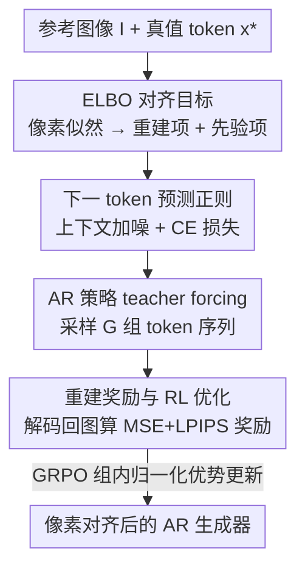

# VA-π: Variational Policy Alignment for Pixel-Aware Autoregressive Generation

**会议**: CVPR 2026  
**论文**: [CVF Open Access](https://openaccess.thecvf.com/content/CVPR2026/html/Liao_VA-p_Variational_Policy_Alignment_for_Pixel-Aware_Autoregressive_Generation_CVPR_2026_paper.html)  
**代码**: https://github.com/LilShake/VA-Pi  
**领域**: 图像生成 / 自回归生成 / 强化学习对齐  
**关键词**: 自回归图像生成、tokenizer 对齐、像素空间对齐、ELBO、GRPO

## 一句话总结
自回归（AR）图像生成里 tokenizer 和生成器的训练目标是脱节的（一个学像素重建、一个只学 token 似然），VA-π 把二者的对齐写成一个变分目标（ELBO），再用强化学习把"解码回去能不能重建出原图"当作像素级奖励来微调 AR 生成器——只用 1% 的 ImageNet 数据、25 分钟，就把 LlamaGen-XXL 的 FID 从 14.36 降到 7.65。

## 研究背景与动机

**领域现状**：现代 AR 视觉生成走的是两段式管线。第一段训一个离散 tokenizer：编码器 $\mathcal{E}$ 把图像压成离散 token 序列、解码器 $\mathcal{D}$ 再从 token 重建图像；第二段训一个 AR 模型 $\pi_\theta$，去拟合这些离散 token 的分布、推理时自回归地一个个采样 token，最后丢给解码器还原成图。这套范式天然贴合 LLM 架构，也是统一多模态模型（如 Janus-Pro）的主流路线。

**现有痛点**：两段的优化目标根本不是一回事。tokenizer 是"给定真值 token，重建出干净图像"训出来的；而 AR 生成器只被优化"token 序列的似然"，**整个训练过程从来没有像素空间的监督信号**。结果是：AR 生成器可以产出似然很高、但解码出来却充满伪影、感知质量很差的 token 序列。作者把这类序列叫 **off-manifold token sequences**——它们偏离了真实图像流形，解码后视觉结构不连贯。

**核心矛盾**：以前的工作要么改生成器（往 token 上下文里注噪、打乱 token 顺序来增强鲁棒性），要么改 tokenizer（让解码器更能容忍生成器采出来的脏 token）。但这些都是"绕"——注噪只是让模型对损坏序列更鲁棒，并没有直接消除像素级的错位；tokenizer 一侧的改造只是让解码器更"宽容"，并不能阻止 AR 生成器一开始就生成 off-manifold 序列，而且噪声加太多反而会把解码器的 token→像素映射过度平滑，重建反而更糊。

**本文目标**：能不能设计一个目标函数，直接把 token 级建模和像素级分布对齐起来，从根上抑制 off-manifold 序列？

**切入角度**：作者把 AR 生成的离散 token 序列看成像素级图像的一个**隐变量**。这样一来，图像似然就有了一个可处理的证据下界（ELBO）：tokenizer 解码器产生的像素重建项对应 ELBO 的重建项，AR 模型的似然目标对应保持 token 分布的先验项——两者被统一进同一个目标。

**核心 idea**：把"AR 生成器在 teacher forcing 下采出的 token 解码回去、能多好地重建原图"当作**内在像素级奖励**，用强化学习去最大化它，同时用一个先验正则项把策略拴在原始 AR 分布附近。一句话：**用像素重建奖励 + RL，给 AR 生成器补上它从来没有过的像素级监督。**

## 方法详解

### 整体框架
VA-π 是一个**轻量级后训练（post-training）框架**：不重训 tokenizer、不引入外部奖励模型，只微调已有的 AR 生成器。它从"直接最大化像素空间似然"这个不可解的目标出发，推出一个 ELBO，拆成两个可训练信号——一个像素空间重建目标、一个保持 AR 先验的 token 级正则。重建项不可微分（量化和离散采样都阻断梯度），于是被当成**奖励**交给强化学习；正则项则退化成一个带噪上下文的下一 token 预测损失。最后用 GRPO 把两者拧成一个稳定的训练流程。

具体一轮的数据流：给定参考图像 $I$ 和它的真值 token $\mathbf{x}^*=\mathcal{Q}(\mathcal{E}(I))$，先往上下文里加噪得到 $\tilde{\mathbf{x}}^*$；AR 策略在 teacher forcing 下算 logits 并采出一组 $G$ 个 token 序列；这些序列各自解码回图像、与参考图算重建奖励 $R=-(\mathcal{L}_{\text{MSE}}+\lambda_p\mathcal{L}_p)$；同时保留一条 CE 正则支路约束 token 分布；最后用 GRPO 的组内归一化优势做策略更新。

### 关键设计

**1. 把 tokenizer–生成器对齐写成 ELBO：让像素重建和 token 似然进同一个目标**

痛点是两段式管线没有像素监督。作者的破局点是把离散 token 序列 $\mathbf{x}$ 当成图像 $I$ 的隐变量，于是要最大化的像素似然写成 $p(I;\theta,\phi)=\sum_{\mathbf{x}} p_\phi(I\mid\mathbf{x})\,\pi_\theta(\mathbf{x})$，其中 $\pi_\theta$ 是 AR 模型给的 token 似然、$\phi$ 是冻结解码器给的像素似然。这个对 token 空间求和的积分项不可解（和 VAE 里一样），于是引入一个由 AR 模型在 **teacher forcing** 下学到的变分后验：

$$q_{\psi,\theta}(\mathbf{x}\mid I)=\prod_{i=1}^{N}\pi_\theta(\mathbf{x}_i\mid \mathbf{x}^*_{1:i-1}),\quad \mathbf{x}^*=\mathcal{Q}(\mathcal{E}_\psi(I))$$

关键在于每个 token 用的是**真值前缀** $\mathbf{x}^*_{1:i-1}$ 而非模型自己的输出——这让后验集中在"能忠实解码回 $I$"的序列上，而 free-running 采样会因误差累积迅速漂离流形。由此得到 ELBO：

$$\log p(I;\theta,\psi,\phi)\ge \underbrace{\mathbb{E}_{q}[\log p_\psi(I\mid\mathbf{x})]}_{\text{重建项}}-\underbrace{\mathrm{KL}(q_{\psi,\theta}\,\|\,\pi_\theta)}_{\text{先验正则项}}$$

为稳定起见只更新 AR 生成器 $\pi_\theta$，tokenizer 全程冻结。这个公式的价值在于：它给"对齐"提供了一个有原理依据的目标，重建项强制 AR 模型在 teacher forcing 下生成的 token 能重建原图（像素监督来了），先验项保住它原本的 token 分布。

**2. 用强化学习而非 STE 来最大化重建奖励：把梯度撒向所有采样序列**

ELBO 的重建项里量化 $\mathcal{Q}$ 和离散 teacher-forcing 采样都不可微，挡住了像素损失的反传。传统做法是 STE（直通估计器）+ Gumbel-Softmax 给一条连续替代梯度路径，但 STE **只沿真值路径传梯度**、且不考虑类别分布上的采样概率，导致整体目标有偏，学习被限制在观测到的 token 序列上。作者改用策略优化：把 AR 模型当 policy，让它产出最大化重建奖励的 token 序列，奖励就是负重建损失：

$$R(\mathbf{x},\mathbf{x}^*)=-\big(\mathcal{L}_{\text{MSE}}(\hat{I},I)+\lambda_p\mathcal{L}_p(\hat{I},I)\big)$$

其中 $\hat{I}=\mathcal{D}(\mathbf{x})$ 是采样 token 解码回的图像，$\mathcal{L}_p$ 用 LPIPS 度量感知相似度。和 STE 只更新真值 token 不同，RL 把梯度**按各自的像素奖励分配到所有采样序列上**，从而能更广地探索 token 空间，在有限数据/算力下快速向像素一致性收敛。为避免对 AR 模型多次前向，采样直接复用正则支路那条加噪序列 $\tilde{\mathbf{x}}^*$。

**3. 带上下文噪声的下一 token 预测正则：把先验项落地成"消除 exposure bias"**

ELBO 的先验正则项 $\mathrm{KL}(q_{\psi,\theta}\,\|\,\pi_\theta)$ 衡量的正是 teacher-forced 分布和 free-running 分布之间的差距——而这恰恰就是 **exposure bias**（推理时模型从自己的历史采样、训练时却喂真值前缀，偏差逐步累积）。作者的洞察是：最小化这个 KL 等价于直接最小化 exposure bias。落地上他们沿用 reAR 的做法，往上下文里注入扰动率 $\xi$ 的噪声、再上一个下一 token 预测的交叉熵损失：

$$\mathcal{L}_{\text{prior}}(\pi_\theta,\mathbf{x}^*,\tilde{\mathbf{x}}^*)=-\frac{1}{N}\sum_{t=1}^{N}\log\pi_\theta(\mathbf{x}^*_t\mid\tilde{\mathbf{x}}^*_{<t})$$

其中 $\tilde{\mathbf{x}}^*\sim K_\xi(\cdot\mid\mathbf{x}^*)$ 是被噪声核扰动后的序列。这条支路在 RL 探索的同时把策略拴在预训练分布附近，防止只追重建奖励导致的策略崩塌（消融里没有它 FID 会从 14.36 恶化到 38 左右）。

**4. GRPO 整合成统一目标：重建奖励当 reward、CE 正则当 KL 惩罚**

作者发现上面两项天然对应 RL 里的"策略优化目标 + KL 惩罚"，于是用 GRPO 把它们整合。对每个参考图采 $G$ 个 teacher-forced 样本，组内归一化得到优势 $\hat{A}_i=\frac{r_i-\mathrm{mean}}{\mathrm{std}}$，最终目标为：

$$\mathcal{J}_{\text{VA-}\pi}(\theta)=\mathbb{E}\Big[\frac{1}{G}\sum_{i=1}^{G}\min(\rho_i A_i,\,\mathrm{clip}(\rho_i,1-\epsilon,1+\epsilon)A_i)-\beta\,\mathcal{L}_{\text{prior}}\Big]$$

$\rho_i=\pi_\theta(\mathbf{x}_i\mid\tilde{\mathbf{x}}^*)/\pi_{\theta_{\text{old}}}(\mathbf{x}_i\mid\tilde{\mathbf{x}}^*)$ 是重要性比，$\beta$ 控正则强度。相比标准 AR-GRPO 的三个优势：① 用 CE 正则替代独立 reference 模型，**不需额外存储**；② 所有项都从 teacher-forcing 轨迹来，**省掉昂贵的 free-running rollout**；③ 即便没有外部奖励模型，性能也超过专门去优化那些奖励的 GRPO 模型，说明像素级对齐本身才是关键。

## 实验关键数据

### 主实验：类别条件图像生成（C2I, ImageNet-1k）

VA-π 在 LlamaGen 上同时提升保真度（FID）和多样性（IS），且训练成本远低于基线。下表为 ImageNet-1k 验证集（5 万张）结果，384×384 生成图缩到 256×256 评测：

| 模型 | 外部奖励 | 训练时间(min)↓ | FID↓ (w/o cfg) | IS↑ (w/o cfg) | FID↓ (w/ cfg) | IS↑ (w/ cfg) |
|------|------|------|------|------|------|------|
| LlamaGen-XL (775M) | – | – | 15.55 | 79.16 | 2.79 | 286.88 |
| + AR-GRPO | ✓ | 149 | – | – | 3.63 | 293.07 |
| **+ VA-π** | × | **20** | **9.23** | **111.59** | 2.94 | **299.63** |
| LlamaGen-XXL (1.4B) | – | – | 14.36 | 86.55 | 2.37 | 252.16 |
| + Post-train Tokenizer | × | 18 | 14.26 | 86.70 | 2.72 | 246.97 |
| + STE Post-train AR | × | 381 | 11.46 | 102.21 | 4.17 | 267.34 |
| **+ VA-π** | × | **25** | **7.65** | **116.70** | **2.28** | 273.53 |

LlamaGen-XXL 上 FID 近乎砍半（14.36→7.65）、IS 涨 30.16，仅 25 分钟（8×A100）；对比 STE 后训练（381 分钟）既更快又更好，约 15× 加速。值得注意的是 VA-π 同时改善 FID 和 IS，而以往方法往往是顾此失彼。

### 文本到图像生成（T2I, GenEval）

| 模型 | 外部奖励 | Color↑ | Counting↑ | Two Obj.↑ | Overall↑ |
|------|------|------|------|------|------|
| LlamaGen-XL | – | 0.550 | 0.197 | 0.263 | 0.306 |
| + AR-GRPO | ✓ | 0.593 | 0.228 | 0.263 | 0.324 |
| **+ VA-π** | × | 0.606 | 0.238 | 0.328 | **0.339** |
| Janus-Pro 1B | – | 0.902 | 0.531 | 0.801 | 0.725 |
| **+ VA-π** | × | 0.912 | 0.540 | 0.835 | **0.744** |

在不训练任何文本对齐/人类偏好奖励的情况下，VA-π 在 GenEval 总分上仍超过用外部奖励的 AR-GRPO（0.324→0.339），双物体组合（+0.065）提升尤其明显；迁移到统一多模态模型 Janus-Pro 1B 也把总分从 0.725 抬到 0.744，属性绑定 +0.045，说明像素级对齐能跨架构泛化。另外在 CLIP/HPS v2 上，VA-π 不专门微调也超过 AR-GRPO。

### 消融实验

奖励成分消融（C2I, w/o CFG）揭示两个信号缺一不可：

| $\mathcal{L}_{\text{MSE}}$ | $\mathcal{L}_p$ | $\mathcal{L}_{\text{prior}}$ | FID↓ | IS↑ |
|------|------|------|------|------|
| – | – | – | 14.36 | 86.55 |
| ✓ | | | 38.76 | 49.78 |
| ✓ | ✓ | | 38.63 | 48.14 |
| | | ✓ | 14.17 | 88.78 |
| ✓ | ✓ | ✓ | **7.65** | **116.70** |

噪声扰动率消融（T2I, GenEval Overall）：$\xi=0$ 为 0.302、$\xi=0.25$ 为 0.315、**$\xi=0.5$ 最佳 0.339**、$\xi=0.75$ 为 0.332、$\xi=0.95$ 为 0.329。

### 关键发现
- **先验正则是稳定器**：只用重建奖励（MSE/LPIPS）不加正则，FID 直接从 14.36 崩到 38+——因为策略会脱离预训练 token 分布。只有重建奖励 + 先验正则一起上才得到 7.65 的最优解。
- **正则形式与强度**：CE 正则在 FID/IS 上一致优于 KL 正则；强度 $\beta=0.1$ 是最优折中——无正则会快速发散（FID 38.63），$\beta=1.0$ 又会过度平滑梯度、压制多样性。
- **噪声要适中**：$\xi=0.5$ 最好；无噪或过度扰动（$\xi>0.75$）都变差，呼应了"先验项 = 抑制 exposure bias"的解释。
- **效率惊人**：仅用约 1% 预训练数据、AR-GRPO 13.4% 的算力，整体训练成本降 86.6%，无需外部奖励模型，无需 free-running 采样。

## 亮点与洞察
- **把"两段式管线脱节"重写成一个 ELBO**，是全文最漂亮的一步：让一直被当作独立模块的 tokenizer 和生成器，在概率建模层面被同一个目标函数缝起来，重建项 = 像素监督、先验项 = exposure bias 约束，两个看似工程性的需求都获得了原理性解释。
- **用 RL 替代 STE 的论证很扎实**：点出 STE 只沿真值路径传梯度、忽略采样概率因而有偏，而 RL 能把梯度按像素奖励撒到所有采样序列上——这是"为什么非要用 RL"的关键，不是为了赶时髦。
- **teacher-forcing 奖励复用噪声序列**省掉了 free-running rollout，是 VA-π 比 AR-GRPO 快一个量级的工程根因，这个 trick 可迁移到其它"奖励需要解码/渲染"的离散生成 RL 场景。
- **不需外部奖励模型却超过用奖励模型的基线**，强烈暗示：对 AR 视觉生成而言，补齐像素级对齐这块短板，比堆外部偏好奖励更本质。

## 局限与展望
- **依赖冻结的高质量 tokenizer**：所有像素监督都来自解码器的重建质量，若 tokenizer 本身重建上限有限，奖励信号也被天花板锁死；论文也提到联合微调 AR + tokenizer 会不稳定，故只动 AR 一侧，但这也意味着没能触及 tokenizer 的内在局限。
- **奖励 = teacher-forcing 重建**：奖励衡量的是"给真值前缀时能否重建原图"，与推理时真正的 free-running 生成质量之间仍有 gap，论文用先验正则去弥合 exposure bias，但这是间接手段而非直接对齐 free-running 分布。
- **超参敏感**：$\beta$ 和 $\xi$ 都有明显的"中间最优"区间（0.1 / 0.5），换数据集/模型时大概率需要重新搜索，论文未给跨设定的自适应方案。
- **评测规模**：主要在 LlamaGen 系列 + Janus-Pro 1B 上验证，更大规模 UMM、更强 tokenizer（如连续/1D tokenizer）上的表现还需检验。

## 相关工作与启发
- **vs Tokenizer-centric 方法（如增强解码器鲁棒性）**：它们让解码器更"宽容"off-manifold token，但不阻止 AR 生成器产生这些 token；VA-π 直接在生成器一侧补像素监督，从源头抑制 off-manifold 序列，且实验显示 tokenizer 后训练几乎不涨点（FID 14.36→14.26）。
- **vs Generator-centric 注噪/打乱顺序（如 reAR）**：这类只注噪增强鲁棒性、没有像素级监督；VA-π 复用了 reAR 的带噪 CE 正则，但把它定位成 ELBO 的先验项，并叠加像素重建奖励这条主线。
- **vs STE-based 后训练**：STE 只沿真值路径传梯度、目标有偏、还慢（381 min）；VA-π 用 RL 把梯度撒向所有采样序列，又快又好。
- **vs AR-GRPO（外部奖励 RL）**：AR-GRPO 靠外部奖励模型 + free-running rollout 对齐人类偏好；VA-π 不要外部奖励、不要 reference 模型、不要 rollout，用内在像素重建奖励，反而在对方擅长的对齐指标上也更高。

## 评分
- 新颖性: ⭐⭐⭐⭐⭐ 把 tokenizer–生成器对齐重写成 ELBO 并用 RL 优化像素重建奖励，视角清新且自洽。
- 实验充分度: ⭐⭐⭐⭐ C2I/T2I/UMM 三类任务 + 多组消融，但模型规模和 tokenizer 类型覆盖偏窄。
- 写作质量: ⭐⭐⭐⭐⭐ 从不可解似然到 ELBO 再到 RL 的推导逻辑清晰，"为什么用 RL 不用 STE"论证到位。
- 价值: ⭐⭐⭐⭐⭐ 1% 数据 25 分钟即可显著提升 AR 生成质量，几乎是免费午餐式的后训练插件，落地性强。

<!-- RELATED:START -->

## 相关论文

- [\[CVPR 2026\] SRA 2: Variational Autoencoder Self-Representation Alignment for Efficient Diffusion Training](sra_2_variational_autoencoder_self-representation_alignment_for_efficient_diffus.md)
- [\[CVPR 2026\] PixelDiT: Pixel Diffusion Transformers for Image Generation](pixeldit_pixel_diffusion_transformers_for_image_generation.md)
- [\[CVPR 2026\] Seeing What Matters: Visual Preference Policy Optimization for Visual Generation](seeing_what_matters_visual_preference_policy_optimization_for_visual_generation.md)
- [\[CVPR 2026\] MaskFocus: Focusing Policy Optimization on Critical Steps for Masked Image Generation](maskfocus_focusing_policy_optimization_on_critical_steps_for_masked_image_genera.md)
- [\[CVPR 2026\] Beyond Patches: Global-aware Autoregressive Model for Multimodal Few-Shot Font Generation](beyond_patches_global-aware_autoregressive_model_for_multimodal_few-shot_font_ge.md)

<!-- RELATED:END -->
