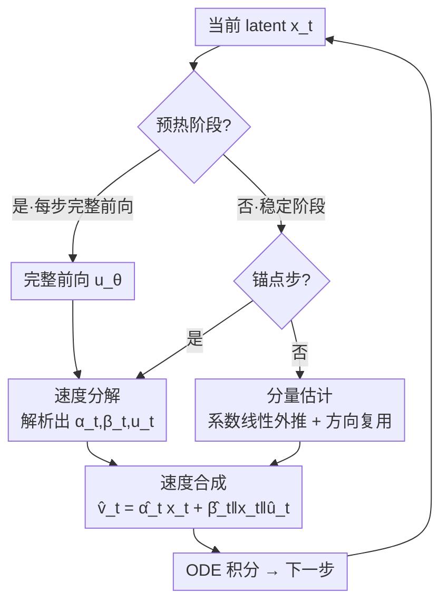

# VDE: Training-Free Accelerating Rectified Flow Model via Velocity Decomposition and Estimation

**会议**: CVPR 2026  
**arXiv**: [2605.23381](https://arxiv.org/abs/2605.23381)  
**代码**: https://github.com/Tan-Junwen/VDE  
**领域**: 扩散模型 / 生成加速  
**关键词**: 整流流模型, 训练无关加速, 速度分解, 缓存失配, 输入自适应估计

## 一句话总结
针对整流流（Rectified Flow）生成模型采样慢的问题，本文提出 VDE：把每步预测的速度沿当前输入分解为平行分量和正交分量，利用这两个分量"标量系数随时间近似线性、正交方向短期几乎不变"的规律，在大部分步骤上用线性外推 + 方向复用直接从当前输入估计速度、跳过模型前向，从而在 FLUX/Qwen-Image/Wan2.1 上取得 2.04–3.22× 加速且画质几乎无损（Qwen-Image 上 LPIPS 比最强基线再降 52.2%）。

## 研究背景与动机

**领域现状**：整流流模型把生成建模成一个 ODE 速度场积分过程——从噪声 $x_0$ 出发，每一步用网络 $u_\theta(x_t,c,t)$ 预测瞬时速度 $v_t$，沿 $\frac{dx_t}{dt}=v_t$ 数值积分到数据样本 $x_1$。它在图像、视频、3D 生成上都达到了 SOTA，但推理要执行几十步迭代采样，延迟高，难以部署到实时或算力受限场景。

**现有痛点**：主流的训练无关加速走的是"**缓存-复用（cache-and-reuse）**"范式——把某些中间特征（注意力输出、Transformer block 残差、整模型残差等）在前几步算好存下来，后续步骤直接复用以跳过冗余计算（如 DeepCache、TeaCache、EasyCache、PAB）。这些方法虽然会用某种变化率指标来决定何时触发复用，但本质上复用的是**静态的旧特征**。

**核心矛盾**：采样过程中输入 $x_t$ 是动态演化的，而被复用的缓存是静态的，两者之间存在不可避免的"**缓存-输入失配（cache-input mismatch）**"。这种失配会直接传导到输出，造成"输出-输入失配"——即近似出来的输出无法准确响应当前的输入状态，最终表现为纹理软化、高频细节丢失、结构走样，画质下降。

**本文目标**：在不训练、不改模型的前提下，构造一个轻量估计函数 $\hat v_t=f_{\text{est}}(x_t,t,I_{\text{hist}})$，**直接从当前输入** $x_t$ 估出速度而非复用旧特征，从根上消除缓存-输入失配带来的输出-输入失配。

**切入角度**：作者把速度 $v_t$ 相对于当前输入 $x_t$ 做正交分解，发现进入"稳定阶段"后存在两条强而稳定的时间规律——标量系数随时间平滑且局部线性，正交方向短期几乎恒定。这意味着速度可以被解析地"传播"出来，而不必每步都做完整前向。

**核心 idea**：把加速范式从"缓存-复用"换成"**分解-估计（decompose-and-estimate）**"：每步速度 = 平行分量 + 正交分量，系数用历史值线性外推、正交方向直接复用，再与**当前输入**重新合成速度——因为合成时显式依赖 $x_t$，估计天然是输入自适应的。

## 方法详解

### 整体框架
VDE 要解决的是"如何不做完整前向也能算准这一步的速度"。它的核心观察是：网络输出的速度 $v_t$ 相对当前输入 $x_t$ 可以被**唯一正交分解**成"沿着 $x_t$ 的平行分量"和"垂直于 $x_t$ 的正交分量"，而这两个分量在采样中段表现出极强的可预测性。基于此，VDE 把采样过程分成两段：**预热阶段**每步都做完整前向（让模型先稳定地勾勒出全局轮廓）；进入**稳定阶段**后切换到"**锚点-估计**"模式——只在周期性的锚点步做完整前向并分解出真值三元组 $(\alpha_t,\beta_t,u_t)$，锚点之间的非锚点步全部用解析估计、不调用模型。

整条 pipeline 是：输入当前 latent $x_t$ → 判断处于预热还是稳定阶段 → 若是锚点步则完整前向并做速度分解，缓存系数与正交方向 → 若是非锚点步则用最近两个锚点的系数线性外推、复用最近锚点的正交方向 → 把外推系数、复用方向与**当前** $x_t$ 重新合成 $\hat v_t$ → 数值积分得到下一步 latent，循环至生成结束。

### 关键设计

**1. 速度正交分解：把"输出对输入的响应"拆成可分析的两路**

这是整个方法的数学地基，针对的是"速度作为一个高维向量整体难以预测"的问题。VDE 把任意时刻的速度 $v_t$ 相对当前 latent $x_t$ 做唯一正交分解：

$$v_t=\alpha_t x_t+\beta_t\lVert x_t\rVert u_t$$

其中 $\alpha_t,\beta_t\in\mathbb{R}$ 是标量系数，$u_t\in\mathbb{R}^d$ 是满足 $u_t^\top x_t=0$ 的单位正交方向。给定一次前向得到的 $v_t$，分解可解析计算：平行系数 $\alpha_t=\frac{\langle v_t,x_t\rangle}{\lVert x_t\rVert^2}$；正交残差 $r_t=v_t-\alpha_t x_t$；再归一化得到方向与系数 $u_t=\frac{r_t}{\lVert r_t\rVert}$、$\beta_t=\frac{\lVert r_t\rVert}{\lVert x_t\rVert}$。这样三元组 $(\alpha_t,\beta_t,u_t)$ 就完整刻画了 $v_t$ 相对 $x_t$ 的关系。关键在于：分解显式地把"当前输入 $x_t$"放进了参数化里，后面合成速度时只要换上新的 $x_t$，估计就自动随输入变化——这正是它区别于缓存复用的地方（缓存复用的是与输入解耦的静态特征）。

**2. 两条时间规律：系数局部线性 + 正交方向短期稳定**

光有分解还不够，三元组在真正跑模型前仍是未知的；本设计回答的是"为什么这些分量可以被预测出来"。作者对每个模型采样 500 条轨迹、逐步做分解，发现经过初始预热后采样进入一个"稳定阶段"，呈现两条规律：(1) **系数可预测**——$\alpha_t,\beta_t$ 随时间平滑演化，相邻步之间局部线性极强，因此可由近期历史值外推可靠估计；(2) **正交方向稳定**——单位方向 $u_t$ 在短区间内几乎不变，相邻步的余弦相似度通常 >0.99，可安全复用多步而误差很小。定量上（两步线性外推、跨三个模型）系数误差极低（$\alpha$ 误差 0.80%/1.53%/1.09%，$\beta$ 误差 1.41%/1.83%/1.42%），方向复用误差仅 0.41%/0.51%/0.08%，从经验上坐实了这两条规律。作者进一步给出稳定阶段的形式化判据：当步 $i,i{+}1$ 的线性外推能准确预测步 $i{+}2$（相对误差 $\max(\cdots)<\epsilon$）且 $u_i^\top u_{i+1}>\delta$ 时进入稳定阶段，经验取 $\epsilon=0.02$、$\delta=0.99$；在 10000 条轨迹上观察到这一转变总是发生在最初几步，故主实验里直接用一个保守的固定预热步数。

**3. 锚点-估计运行机制：少数完整前向锚定，多数步骤解析合成**

这是把上面两条规律落成加速器的执行逻辑，针对的是"如何在保证不漂移的前提下最大化跳过的前向次数"。稳定阶段被切成若干"锚点 + 非锚点"区段：锚点步做完整前向并分解出真值 $(\alpha_t,\beta_t,u_t)$；对锚点之间的非锚点步 $t$，系数用最近两个锚点 $t_1>t_2$ 线性外推

$$\hat\alpha_t=\alpha_{t_1}+\frac{\alpha_{t_2}-\alpha_{t_1}}{t_2-t_1}(t-t_1),\quad \hat\beta_t=\beta_{t_1}+\frac{\beta_{t_2}-\beta_{t_1}}{t_2-t_1}(t-t_1)$$

正交方向直接复用最近锚点 $\hat u_t=u_{t_2}$，最后与**当前** $x_t$ 解析合成 $\hat v_t=\hat\alpha_t x_t+\hat\beta_t\lVert x_t\rVert\hat u_t$。这些运算只是变量间的简单算术，相对一次完整前向代价可忽略。**锚点间隔 $n$ 控制速度-质量权衡**：间隔越大跳过越多、加速越高，但保真度略降；经验上稳定阶段用两步间隔（$n{=}2$）平衡最佳。同时"周期性锚点做完整前向"起到**防止误差累积**的作用——隔几步就用真实模型状态重新锚定一次，避免外推误差无限传播。

### 损失函数 / 训练策略
VDE 是**训练无关（training-free）**方法：不引入任何训练目标、不微调模型、不需要离线 profiling 数据，纯在推理时插入。唯一的"超参数"是预热步数与锚点间隔 $n$。实现上：FLUX.1 [dev] 跑前 7 步与最后 1 步、中间用 2/3/4 步间隔对应 fast/medium/slow；Qwen-Image 跑前 11 步与最后 1 步、中间 2 或 5 步间隔；Wan2.1 跑前 11 步（间隔 2）或前 9 步（间隔 4）加最后 1 步。

## 实验关键数据

### 主实验
图像生成在 FLUX.1 [dev] 与 Qwen-Image 上，从 MS-COCO 2017 验证集随机取 1000 样本、512×512 分辨率，基线为 $T{=}50$ 步采样。

| 模型 | 方法 | 加速 | NFE | SSIM↑ | PSNR↑ | LPIPS↓ | ImageReward↑ |
|------|------|------|-----|-------|-------|--------|--------------|
| FLUX.1 | $T{=}50$ 基线 | 1.00× | 50 | - | - | - | 0.976 |
| FLUX.1 | EasyCache-fast | 2.91× | - | 0.7240 | 19.59 | 0.3197 | 0.986 |
| FLUX.1 | **VDE-fast** | 3.01× | 16 | **0.8267** | **23.19** | **0.1997** | 0.969 |
| FLUX.1 | EasyCache-slow | 2.09× | - | 0.7428 | 19.81 | 0.2793 | 0.980 |
| FLUX.1 | **VDE-slow** | 2.21× | 22 | **0.8877** | **25.81** | **0.1243** | 0.978 |
| Qwen-Image | $T{=}50$ 基线 | 1.00× | 100 | - | - | - | 1.295 |
| Qwen-Image | EasyCache-slow | 1.97× | - | 0.8708 | 23.83 | 0.1445 | 1.282 |
| Qwen-Image | **VDE-slow** | 2.04× | 48 | **0.9362** | **28.58** | **0.0691** | **1.295** |

要点：VDE-fast 在与 EasyCache-fast 几乎同延迟下（3.01× vs 2.91×、NFE 仅 16），SSIM 从 0.7240 提到 0.8267、LPIPS 从 0.3197 降到 0.1997；VDE-slow 相对最强基线 EasyCache-slow，SSIM +19.5%、PSNR +30.3%、LPIPS −55.4%。在 Qwen-Image 上 VDE-slow 的 LPIPS 0.0691 比最强基线降 52.2%，且 ImageReward 1.295 与 $T{=}50$ 满步基线持平。

视频生成在 Wan2.1-1.3B（81 帧、832×480、VBench 946 prompts）：

| 方法 | 加速 | NFE | SSIM↑ | PSNR↑ | LPIPS↓ | VBench(%)↑ |
|------|------|-----|-------|-------|--------|------------|
| $T{=}50$ 基线 | 1× | 100 | - | - | - | 81.30 |
| TeaCache | 2.00× | - | 0.8057 | 22.57 | 0.1277 | 81.04 |
| EasyCache | 2.54× | - | 0.8337 | 25.24 | 0.0952 | 80.49 |
| **VDE-fast** | 2.50× | 40 | **0.8658** | 24.69 | **0.0754** | 80.43 |
| **VDE-slow** | 2.08× | 48 | **0.8902** | **25.92** | **0.0554** | 80.32 |

VDE 在结构与感知相似度（SSIM/PSNR/LPIPS）上全面优于 PAB/TeaCache/EasyCache，VBench 接近原模型。

### 消融实验
Table 3：在 FLUX.1（前 9 步 + 最后 1 步、间隔 2）下，把真值分量逐一替换为估计值，看各分量对重建质量的影响。

| 配置 | SSIM↑ | PSNR↑ | LPIPS↓ | 说明 |
|------|-------|-------|--------|------|
| True $u_t$（仅系数估计） | 0.9893 | 40.79 | 0.0132 | 系数外推几乎无损 |
| True $\beta_t$ | 0.9262 | 28.76 | 0.0874 | 只保真 $\beta$ 不够 |
| True $\alpha_t$ | 0.9263 | 28.78 | 0.0860 | 只保真 $\alpha$ 不够 |
| True $u_t,\beta_t$ | 0.9916 | 41.79 | 0.0100 | 最好 |
| True $u_t,\alpha_t$ | 0.9899 | 41.02 | 0.0124 | 次好 |
| True $\alpha_t,\beta_t$（估计方向） | 0.9265 | 28.78 | 0.0874 | 方向复用引入主要误差 |
| Estim. $\alpha_t,\beta_t,u_t$（全估计=VDE） | 0.8931 | 26.15 | 0.1198 | 全部在线估计仍保真 |

Table 4：锚点间隔 $n$ 的速度-质量权衡（FLUX.1、前 7 步 + 最后 1 步）。

| 间隔 | 加速 | SSIM↑ | PSNR↑ | LPIPS↓ |
|------|------|-------|-------|--------|
| $n{=}1$ | 1.69× | 0.9283 | 28.76 | 0.0801 |
| $n{=}2$ | 2.21× | 0.8877 | 25.81 | 0.1243 |
| $n{=}3$ | 2.70× | 0.8499 | 24.02 | 0.1679 |
| $n{=}4$ | 3.01× | 0.8267 | 23.19 | 0.1997 |
| $n{=}5$ | 3.22× | 0.8064 | 22.56 | 0.2168 |

### 关键发现
- **系数估计几乎无损、误差主要来自方向复用**：只估计系数（True $u_t$）SSIM 仍达 0.9893；而复用方向（True $\alpha_t,\beta_t$）SSIM 掉到 0.9265——说明线性外推的标量系数极准，正交方向复用是受控但相对更大的近似来源，这也解释了为什么 Table 3 里同时保真 $u_t$ 的配置质量最高。
- **间隔 $n{=}2$ 是甜点**：$n$ 从 1 增到 5，加速从 1.69× 升到 3.22×，但 LPIPS 从 0.0801 涨到 0.2168；$n{=}2$（2.21×）兼顾速度与保真，对应主表的 VDE-slow。
- **分辨率/长宽比鲁棒**：Qwen-Image 上 256×256 到 1024×1024，加速稳定在约 2×、CLIP 几乎不变，方法对分辨率不敏感、语义对齐得以保持。

## 亮点与洞察
- **范式转换很干净**：把"缓存-复用静态特征"换成"分解-估计动态合成"，一句话点破了缓存类方法的病根（缓存-输入失配），且解法的合成式 $\hat v_t=\hat\alpha_t x_t+\hat\beta_t\lVert x_t\rVert\hat u_t$ 显式带 $x_t$，天然输入自适应——这是它比 TeaCache/EasyCache 更保真的本质原因。
- **正交分解 + 经验规律的组合很聪明**：先用一个无损的数学分解把高维速度降成"2 个标量 + 1 个方向"，再分别发现标量局部线性、方向短期稳定——降维之后规律才暴露出来、才可外推，这个"先分解再找规律"的思路可迁移到其他需要预测网络中间量的加速场景。
- **几乎零成本落地**：训练无关、无需 profiling、只是几步算术，可直接插到 FLUX/Qwen/Wan 这类整流流模型上，工程友好。
- **周期锚点 = 防漂移开关**：用少量真实前向定期重锚，把外推误差累积截断，是把"短期规律"安全用到长采样轨迹上的关键工程细节。

## 局限与展望
- **依赖"稳定阶段"假设**：方法的有效性建立在采样中段系数线性、方向稳定之上；预热阶段必须老老实实每步前向，主实验为稳妥用了固定预热步数，若某些模型/采样器稳定阶段来得晚或不明显，加速收益会缩水。
- **正交方向复用是主要误差源**：消融显示方向复用比系数外推误差大得多，激进增大间隔时画质下降主要由它驱动；如何同样廉价地估计方向演化（而非纯复用）是可改进点。
- **超参需按模型手调**：预热步数与锚点间隔在 FLUX/Qwen/Wan 上各不相同，论文用固定配置，自动按轨迹动态切换稳定阶段的判据（Eq.8）虽给出但主实验未启用，端到端自适应仍有空间。
- **加速比中等**：2.04–3.22× 相比一些激进蒸馏/少步方法不算极致，但胜在训练无关且画质几乎无损，定位是"高保真"而非"极速"。

## 相关工作与启发
- **vs TeaCache / EasyCache（缓存类）**：它们缓存并复用 Transformer block 残差/整模型残差等静态特征，靠变化率指标决定何时复用；本文指出这类复用与动态输入解耦，必然产生缓存-输入失配。VDE 改为从当前输入解析合成速度，消除失配，同延迟下 LPIPS/SSIM 明显更优（Qwen-Image LPIPS 再降 52.2%）。
- **vs PAB / AdaCache / OmniCache**：同属训练无关、复用注意力或特征的缓存路线，差异同上——VDE 不复用特征本身，只复用"分解后的正交方向"并对系数做外推，复用粒度更细、更贴合输入。
- **vs 训练类加速（蒸馏 / 量化 / 一致性 / 架构压缩）**：这些需要额外数据和优化、可能损害泛化；VDE 完全训练无关、即插即用，代价是加速比更温和但保真度更高。
- **vs 朴素减步（$T{=}24/18$）**：直接减采样步会显著掉点（FLUX $T{=}18$ SSIM 0.686、LPIPS 0.337）；VDE 在相近加速下保真度远高，说明"估计速度"比"少算几步"更聪明地利用了采样轨迹的结构。

## 评分
- 新颖性: ⭐⭐⭐⭐⭐ 把加速从"缓存-复用"重构为"速度分解-估计"，并用正交分解 + 两条经验规律支撑，视角新且自洽。
- 实验充分度: ⭐⭐⭐⭐ 覆盖 FLUX/Qwen/Wan 三个图像与视频模型、含分量替换/间隔/分辨率三组消融，但加速比区间偏温和、未与少步蒸馏类方法正面对比。
- 写作质量: ⭐⭐⭐⭐⭐ 动机→规律→方法→验证逻辑清晰，公式与图表对分解和规律的支撑到位。
- 价值: ⭐⭐⭐⭐ 训练无关、即插即用、高保真，对整流流模型部署有直接实用价值。

<!-- RELATED:START -->

## 相关论文

- [\[CVPR 2026\] A Training-Free Style-Personalization via SVD-Based Feature Decomposition](a_training-free_style-personalization_via_svd-based_feature_decomposition.md)
- [\[CVPR 2026\] D2C: Accelerating Diffusion Model Training under Minimal Budgets via Condensation](d2c_diffusion_dataset_condensation.md)
- [\[CVPR 2026\] Understanding, Accelerating, and Improving MeanFlow Training](understanding_accelerating_and_improving_meanflow_training.md)
- [\[ICLR 2026\] Free Lunch for Stabilizing Rectified Flow Inversion](../../ICLR2026/image_generation/free_lunch_for_stabilizing_rectified_flow_inversion.md)
- [\[CVPR 2026\] RecTok: Reconstruction Distillation along Rectified Flow](rectok_reconstruction_distillation_along_rectified_flow.md)

<!-- RELATED:END -->
