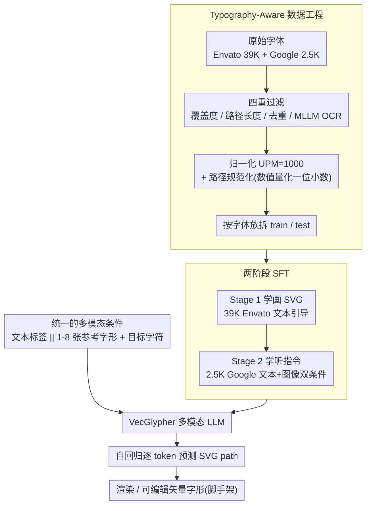

# VecGlypher: Unified Vector Glyph Generation with Language Models

**会议**: CVPR 2026  
**arXiv**: [2602.21461](https://arxiv.org/abs/2602.21461)  
**代码**: [https://xk-huang.github.io/VecGlypher](https://xk-huang.github.io/VecGlypher)  
**领域**:图像生成
**关键词**: 字体生成, 矢量图形, SVG, 多模态语言模型, 字体排印

## 一句话总结
提出VecGlypher——首个统一文本和图像引导的矢量字形生成语言模型，通过两阶段训练(大规模SVG语法学习+专家标注对齐)直接自回归生成可编辑SVG路径，无需光栅中间步骤或向量化后处理。

## 研究背景与动机
**领域现状**：矢量字形是数字排版的原子单元，但现有学习方法仍以图像引导为主——给定几个参考字形图像生成其余字符的矢量轮廓，依赖精心准备的范本sheet和光栅-向量后处理。

**现有痛点**：(a) 图像引导要求用户先能制作或收集参考字形，对非专业用户是瓶颈；(b) 光栅中间步骤引入向量化伪影，降低可编辑性；(c) 通用SVG生成LLM在字形生成上完全失败，因为字体对坐标精度、拓扑正确性和风格一致性有极严格要求。

**核心矛盾**：自然语言是更通用的字体设计接口，而SVG路径本身就是文本序列，天然适合语言建模——但需要(a)大规模字体训练数据教模型"画字",(b)typography-aware数据工程处理坐标归一化和路径规范化。

**本文目标**：用单一多模态LLM同时支持文本描述和图像范本两种条件、直接生成高保真可编辑SVG字形。

**切入角度**：两阶段训练——先在大规模嘈杂字体上学画SVG，再在小规模专家标注字体上学指令跟随。

**核心 idea**：将矢量字形生成形式化为多模态语言建模问题，用39K Envato字体学SVG语法+2.5K Google字体学风格对齐，一次前向生成正确SVG路径。

## 方法详解

### 整体框架
VecGlypher 把矢量字形生成整个搬进语言建模框架：不再"先画一张光栅图再向量化"，而是让一个多模态 LLM 直接把 SVG 路径当成文本序列吐出来。喂给模型的是一组条件——要么是文本标签（如 "high-contrast, serif, art-deco"），要么是 1–8 张参考字形图像——外加一个目标字符身份（如 "A"）；模型自回归地逐 token 预测这个字符的 SVG path，解码回来就是一条可直接渲染、可手动编辑的有效路径。整条链路里没有光栅去噪器，没有向量后优化器，也没有轮廓简化器，所有几何决策都发生在 token 预测这一步。能这样做的前提是两件事必须先到位：一是把五花八门的字体数据清洗成模型能学的统一格式，二是用"先学会画、再学会听话"的两阶段训练把通用 LLM 调成懂字体的专家。

### 关键设计

**1. Typography-Aware 数据工程：把杂乱字体喂成模型能消化的统一序列**

通用 SVG-LLM 在字形上彻底失败的根因之一，是字体数据本身太脏——不同来源的坐标系、UPM(units per em)、路径写法各不相同，直接拿来训练会在长序列解码里不断累积误差。这一步先做四重过滤：字符覆盖度筛掉残缺字体、路径长度筛掉过于复杂的轮廓、去重剔除近似重复字体、再用 MLLM 做 OCR 检查确认字形真的是它声称的那个字符。过滤后把所有坐标统一归一化到 UPM=1000 的画布，并对路径做规范化——保留 command letter(M/L/C 等)、把数值量化到一位小数。这个一位小数的量化是个刻意的权衡：精度再高会让 token 序列暴涨、解码更易跑偏，再低则字形会失真，一位小数恰好在保真度和序列长度之间取到平衡。最后按字体族(family)而非单字拆分 train/test，保证测试时面对的是训练里没见过的整套字体风格，评估的是真正的泛化而非记忆。

**2. 两阶段 SFT：先在海量脏数据里学会画 SVG，再在精标数据里学会听指令**

把通用 Qwen3-VL 直接在小规模精标字体上微调是不够的——模型还没掌握"画一条几何正确的字形路径"这件难事，就被要求同时听懂细粒度风格指令。VecGlypher 因此拆成两阶段。Stage 1(Learning to Draw)在 39K 张嘈杂的 Envato 字体上做文本引导 SFT，目标只有一个：学会 SVG 语法、学会预测上千 token 的长坐标序列、学会按字符身份生成对应几何，把"会画字"这个底座打牢。Stage 2(Instruction Following)再切到 2.5K 张专家标注的 Google 字体，做文本 + 图像双条件 SFT，让模型把几何能力和"外观/风格应该长什么样"的指令对齐。这个顺序与 NLP 里"大规模预训练 + 指令微调"完全同构，而且 Stage 1 是决定性的：消融显示去掉 Stage 1、只在 Google 数据上训练，跨族 OOD 的 FID 从 31.2 劣化到 58.7，泛化和轮廓稳定性同时崩掉。

**3. 统一的多模态条件：一套模型、一条解码路径同时吃文本和图像**

字体设计里文本和图像本是两种割裂的接口——文本更通用、图像更精确，过去往往要各维护一套模型。VecGlypher 把两者塞进同一个生成过程：文本条件直接用 tokenizer 处理 style tags 加 target character；图像条件则把 1–8 张参考字形渲染成 192×192 的图像交给 vision encoder 编码，两种条件在输入端是互斥选择(标记为 `||`)，但下游共享同一套自回归解码。这样做不只是省一套模型——它解锁了一个真正实用的渐进工作流：用户先用文本描述生成几个参考字形，再把这几张生成图反过来当图像范本，引导模型补齐整套字体，从而绕开"必须先有现成参考字形"这个对非专业用户的门槛。

### 损失函数 / 训练策略
训练目标是针对 SVG path 文本的标准 next-token prediction 交叉熵损失。Envato 阶段训练 1 轮，Google Fonts 阶段训练 3 轮；评估时用 greedy decoding 以衡量模型最原始的生成能力。基座选用 Qwen3-VL 系列，覆盖 4B / 27B / 70B 三种规模以观察 scaling 行为。

## 实验关键数据

### 主实验 (Google Fonts Cross-Family OOD)

| 方法 | 类型 | FID↓ | L1↓ | SSIM↑ |
|------|------|------|-----|-------|
| DeepVecFont-v2 | Image-ref | 45.2 | 0.089 | 0.82 |
| DualVector | Image-ref | 38.6 | 0.075 | 0.85 |
| StarVector | SVG-LLM | 89.4 | 0.142 | 0.68 |
| GPT-5.2 | General LLM | 92.1 | 0.158 | 0.61 |
| **VecGlypher-4B (text-ref)** | **LLM** | **52.3** | **0.095** | **0.79** |
| **VecGlypher-4B (image-ref)** | **LLM** | **31.2** | **0.065** | **0.88** |

### 消融实验

| 配置 | FID↓ | L1↓ | 说明 |
|------|------|-----|------|
| Stage 2 only (Google) | 58.7 | 0.102 | 无Envato预训练 |
| Stage 1 only (Envato) | 43.5 | 0.081 | 无Google微调 |
| Stage 1 + Stage 2 | **31.2** | **0.065** | 两阶段完整训练 |
| 4B model | 31.2 | 0.065 | - |
| 27B model | 26.8 | 0.054 | 模型规模↑ = 质量↑ |
| 70B model | **24.1** | **0.048** | 继续提升 |
| Relative coords | 35.8 | 0.072 | 相对坐标 |
| Absolute coords | **31.2** | **0.065** | 绝对坐标更优 |

### 关键发现
- VecGlypher在图像引导生成上超越所有专用baseline(包括DeepVecFont-v2和DualVector)
- 通用LLM(GPT-5.2)和SVG-LLM(StarVector)在字形生成上完全失败，证明typography-specific训练不可替代
- 模型规模是矢量保真度的核心驱动力——70B比4B的FID低约23%
- Stage 1大规模预训练带来的OOD增益比仅在专家数据上训练显著——FID从58.7降至31.2
- 绝对坐标序列化优于相对坐标，可能因为绝对坐标给模型提供了更直接的空间参照

## 亮点与洞察
- **语言建模统一范式**：将字体设计从"画图问题"转变为"写代码问题"，LLM的code generation能力被巧妙迁移。这一范式可扩展到任何可参数化的设计任务（如logo、图标、UI组件）。
- **两阶段数据策略**：大噪声数据学语法+小精细数据学语义的模式与NLP预训练+指令微调的范式一致，在视觉生成中的成功应用值得关注。
- **实用工作流**：text→初始字形→image-ref→完整字体的渐进式设计流程，真正降低了字体创作门槛。

## 局限与展望
- 目前仅支持"0-9a-zA-Z"共62个字符，中文等大字符集字体尚不支持
- Greedy decoding限制了多样性，beam search或nucleus sampling可能生成风格更丰富的变体
- 长序列生成（部分字形超过1000 token）可能质量下降，需要更好的长序列建模
- 未探索条件控制的细粒度（如独立控制笔画粗细、衬线风格、字宽比）

## 相关工作与启发
- **vs DeepVecFont-v2**：DVF-v2用专用encoder-decoder+几何后优化器；VecGlypher单一LLM+一次前向，架构更简单效果更好
- **vs StarVector**：StarVector针对通用SVG图标；VecGlypher专为字形定制数据和训练方案，解决了后者无法处理的字体特有约束

## 评分
- 新颖性: ⭐⭐⭐⭐⭐ 首次将多模态LLM成功应用于矢量字形生成，统一两种条件输入
- 实验充分度: ⭐⭐⭐⭐⭐ 多规模模型、跨域评估、详细消融，定性和定量均充分
- 写作质量: ⭐⭐⭐⭐⭐ 数据工程描述详尽，paradigm对比清晰
- 价值: ⭐⭐⭐⭐⭐ 降低字体设计门槛的实用工具，产业应用前景广阔

<!-- RELATED:START -->

## 相关论文

- [\[CVPR 2026\] Unified Vector Floorplan Generation via Markup Representation](unified_vector_floorplan_generation_via_markup_representation.md)
- [\[CVPR 2026\] Rethinking Glyph Spatial Information in Font Generation](rethinking_glyph_spatial_information_in_font_generation.md)
- [\[CVPR 2026\] UniVerse: Empower Unified Generation with Reasoning and Knowledge](universe_empower_unified_generation_with_reasoning_and_knowledge.md)
- [\[CVPR 2026\] Unified Customized Generation by Disentangled Reward Modeling](unified_customized_generation_by_disentangled_reward_modeling.md)
- [\[CVPR 2026\] Design Your Ad: Personalized Advertising Image and Text Generation with Unified Autoregressive Models](design_your_ad_personalized_advertising_image_and_text_generation_with_unified_a.md)

<!-- RELATED:END -->
