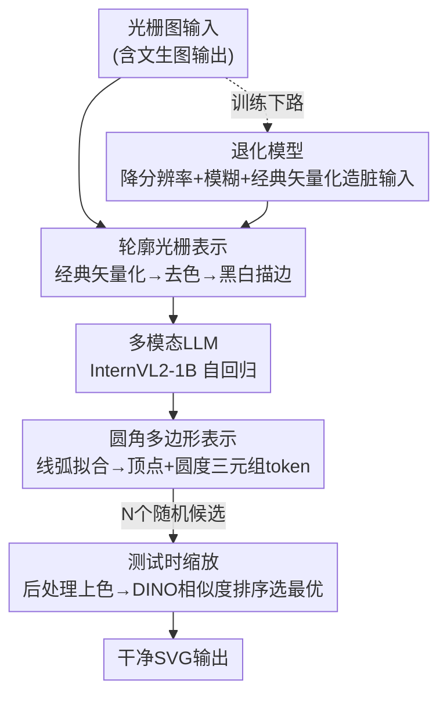

# VectorArk: Learning Practical Image Vectorization with Rounded Polygon Representation

**会议**: CVPR 2026  
**arXiv**: [2605.24398](https://arxiv.org/abs/2605.24398)  
**代码**: 无  
**领域**: 图像生成 / 图像矢量化 / 多模态LLM  
**关键词**: 图像矢量化, SVG生成, 圆角多边形表示, 退化模型, 测试时缩放

## 一句话总结
VectorArk 把"光栅图→矢量图(SVG)"重新设计成对生成模型友好的圆角多边形表示，配合轮廓化输入、矢量化退化训练和 DINO 排序的测试时缩放，让一个仅 1B 参数的多模态 LLM 在真实世界（含文生图输出）的矢量化任务上几何完整度和去伪影能力都大幅超过 StarVector / OmniSVG。

## 研究背景与动机
**领域现状**：把光栅图转成矢量图是计算机图形学的经典任务，矢量表示分辨率无关、存储紧凑、易编辑。近期一批工作（StarVector、OmniSVG、LLM4SVG）用多模态 LLM 微调，直接学习艺术家设计的 SVG 数据，能学到控制点摆放和图层结构的人类偏好，效果惊艳。

**现有痛点**：这些方法几乎只在**合成 benchmark** 上评测——拿干净 SVG 高分辨率光栅化、再矢量化回去。一旦换到真实场景就崩：(1) 换个光栅化后端（CairoSVG→Skia）输出质量就剧烈波动；(2) 文生图模型产出的图常带扭曲形状和异于 SVG 渲染的视觉特征，训练分布外；(3) 自回归模型的随机性让同一张图时成时败，不可靠。

**核心矛盾**：根源在于**表示选错了**。前人直接用 SVG 命令序列当生成目标，这套表示虽适合可视化，但既不紧凑也不规范（canonical）——同一形状有无数种 SVG 写法，序列又长，小坐标误差会沿着长序列累积放大，模型很难学。同时输入端用彩色光栅，把外观噪声一并喂给模型，泛化更差。

**本文目标**：做一个对真实输入（包括文生图结果）鲁棒的实用矢量化模型，需要同时解决"表示难学""输入分布外""输出不可靠"三个子问题。

**切入角度**：作者从"降低自由度"出发——固定端点时三次贝塞尔曲线要 4 个参数，而用线段+圆弧的圆角多边形只要 3 个，且天然分段恒定曲率，曲线更光滑。把几何预测和上色解耦：模型只管学规范的几何，颜色留到后处理恢复。

**核心 idea**：用**圆角多边形**这一规范紧凑表示替换 SVG 命令、用**轮廓光栅**替换彩色输入做归一化、再用**矢量化退化模型**模拟真实瑕疵 + **测试时缩放**挑最优候选，把"几何优先"的鲁棒矢量化管线学出来。

## 方法详解

### 整体框架
输入是一张可能由文生图模型生成的光栅图，输出是干净的矢量图(SVG)。模型从预训练多模态 LLM（InternVL2-1B）微调而来，自回归地生成 tokenized 的矢量表示。整条管线"几何先行、颜色后补"：先把输入图像**去色成黑白轮廓光栅**送进模型，模型预测**圆角多边形**的几何 token，再在后处理里从原图恢复颜色和 z-order。

训练和推理两条路径分别解决"怎么学"和"怎么稳"：训练时，上路把干净 SVG 经线弧拟合转成圆角多边形真值 token；下路用**退化模型**（降分辨率+模糊+经典矢量化）造出带瑕疵的轮廓光栅当输入，让 VLM 学会"从脏输入预测干净几何"。推理时，对同一输入随机解码出 N 个候选，各自后处理上色，再用冻结的 DINO-ViT 按与原图的余弦相似度排序，选最优——即**测试时缩放**。

### 关键设计

**1. 圆角多边形表示：把异构 SVG 压成"顶点+圆度"的规范三元组序列**

前人直接用 SVG 命令当生成目标，但 SVG 原语五花八门（贝塞尔、圆、椭圆、矩形、折线…），同一形状写法不唯一，序列又长，小误差累积放大，模型难收敛。VectorArk 把每条 path 独立转成圆角多边形：先沿 path 等距采样，再按 Cornucopia 拟合算法在保 $G^1$ 连续的前提下只用**线段和圆弧**两种原语拟合（近乎无损）。之后从线弧导出多边形——线段两端点直接当顶点；对一段圆弧 $\wideparen{DE}$，把两端切线 $\overrightarrow{DB}$、$\overrightarrow{EB}$ 延长到交点 $B$，取 $D,B,E$ 为顶点。每个顶点编码一个圆度 $d_i$：对切线交点 $B$，$d_i$ 定义为距离 $BD$，弧半径由 $r_i = d_i\tan(\alpha_i/2)$ 还原（$\alpha_i$ 为顶点内角 $\angle DBE$）；非交点顶点的 $d_i=-1$ 当作线/弧端点标志。

用"距离 $BD$"而非弧半径来参数化是有讲究的——近乎平直的弧半径会变得极大、量化不稳，而距离始终有界，量化更稳。边界情况也处理干净：曲率可忽略的弧退化成线段；大角度弧（如半圆切线平行永不相交）会被均匀细分成每段 $<120^\circ$。最终每条 path 就是一串 $\{(x_i,y_i,d_i)\}$ 三元组，坐标归一化到 $128\times128$ viewBox、量化到两位小数，用 `,` 分隔分量、空格分隔顶点、`\n` 分隔 path 串成文本，复用 LLM 原 tokenizer（比新增 token 收敛更稳）。这套表示既规范又紧凑，相比 OmniSVG 省 27.9%–46.6% token。

**2. 轮廓光栅表示：把彩色输入"去色"成黑白描边做分布归一化**

输入端的外观差异是泛化杀手——文生图输出的视觉特征和 SVG 渲染差别很大，模型若直接看彩色图就会把外观噪声学进去。作者反其道而行：先用经典矢量化工具（Adobe Illustrator Image Trace 或 VTracer）把输入图转成矢量，**丢弃颜色信息**，只用固定描边宽度渲染成黑白轮廓光栅当 LLM 的输入。经典工具几何可能不优，但能忠实重建结构，而本方法只取它渲染出的轮廓——这一步等于把任何输入图都映射到一个**规范视图**，消除"训练用 SVG 渲染、测试用文生图"的外观失配。模型因此被训练成"从无色输入预测无色输出"，大大简化学习、提升泛化；颜色和 z-order 在推理后处理里从原图按 path 提取恢复。消融显示轮廓输入在所有指标/难度上稳定优于彩色输入，越难的样本增益越明显。

**3. 矢量化退化模型：用"经典矢量化造脏"模拟真实瑕疵，避免模型照搬输入噪声**

如果只拿干净 SVG 高保真渲染当训练输入，模型会忠实复刻输入里的瑕疵——文生图输入一脏，输出就跟着脏。给控制点加随机噪声这种朴素做法又泛化不好。作者提出**基于矢量化的退化模型**：对每张训练矢量图，先在随机缩小的分辨率（$224\times224$ 到 $336\times336$）渲染并加随机高斯模糊，再用经典矢量化器处理——经典矢量化器对分辨率敏感，低分辨率输入会产生更差的轮廓，作者正是**利用这个性质**得到带真实瑕疵的轮廓，渲染回光栅当训练输入。这样模型学的是"从带瑕疵轮廓还原干净几何"，而非复刻瑕疵。退化模型以 25% 概率丢弃（即部分 batch 用干净输入），保证在干净输入上也不退化。消融表明这一步是模型在文生图输入上去伪影、出规整几何的关键。

**4. 测试时缩放：随机解码多候选 + DINO 排序，压住自回归的不可靠性**

自回归模型在不同随机种子下对同一输入时成时败。VectorArk 在推理时对每张图随机解码 $N$ 个候选矢量图，各自后处理恢复颜色和 z-order、渲染回光栅，再把这些渲染图和原输入一起用冻结的 DINO-ViT-B/16 编码，选**渲染图与输入图余弦相似度最高**的候选为最终输出。作者试了多种特征提取器，DINO 最可靠（与 StarVector 的观察一致）。候选数越多质量越高，但超过某阈值后增益递减，用户可据此在质量与推理预算间权衡。

### 损失函数 / 训练策略
从 InternVL2-1B 端到端微调，ViT 编码器处理 $448\times448$ 轮廓光栅。采用 next-token 预测目标，对所有文本 token 用**交叉熵损失**监督。优化器 AdamW + 余弦学习率衰减，初始 lr $10^{-4}$，batch size 256，迭代 250K。训练数据为约 5M 来自图标/logo/扁平图形的 SVG，配随机旋转和缩放增广。值得注意：作者**更新全部参数（含 ViT 编码器）**，只微调 LLM 主干或用 LoRA 都会变差。单张 SVG 生成在 A100 上仅需 33–44s。

## 实验关键数据

### 主实验
在两个最新 SVG 生成 benchmark（SArena、SVGenius）上，按几何复杂度分 Easy/Medium/Hard 三档，用 SSIM↑、LPIPS↓、MSE↓、DINO↑ 四个指标评测。尽管 VectorArk 参数量比 baseline 更少，仍在所有指标、所有难度上一致且显著领先，复杂度越高优势越大。

| 数据集/难度 | 指标 | OmniSVG | StarVector | 本文 |
|------------|------|---------|-----------|------|
| SArena Hard | SSIM ↑ | 0.518 | 0.626 | **0.857** |
| SArena Hard | LPIPS ↓ | 0.324 | 0.252 | **0.093** |
| SArena Hard | MSE ↓ | 0.123 | 0.101 | **0.022** |
| SArena Hard | DINO ↑ | 0.898 | 0.902 | **0.975** |
| SVGenius Hard | SSIM ↑ | 0.638 | 0.672 | **0.83** |
| SVGenius Hard | LPIPS ↓ | 0.248 | 0.258 | **0.12** |
| SVGenius Medium | SSIM ↑ | 0.674 | 0.71 | **0.868** |
| SVGenius Easy | SSIM ↑ | 0.84 | 0.89 | **0.944** |

即便在不用测试时缩放的单样本设定（$N=1$）下，本文在 SVGenius 上仍超过最强 baseline。在文生图生成的真实输入上，baseline 普遍产出不精确几何，本文鲁棒性显著更好。

### 消融实验
| 配置 | 关键指标(SVGenius Hard) | 说明 |
|------|------------------------|------|
| 圆角多边形(Full) | SSIM 0.83 / DINO 0.958 | 完整表示 |
| 换 OmniSVG 表示 | SSIM 0.743 / DINO 0.923 | 同数据/架构，仅换表示，Medium/Hard 明显掉点 |
| 换 StarVector 表示 | SSIM 0.628 / DINO 0.866 | 原生 SVG 格式，掉点最多 |
| 彩色输入 (Hard) | SSIM 0.697 / LPIPS 0.165 | 越难掉得越多 |
| 轮廓输入 (Hard) | SSIM 0.83 / LPIPS 0.12 | 所有指标稳定优于彩色 |
| w/o 退化模型 | 定性更差 | 在文生图输入上照搬输入瑕疵，几何不规整 |
| 测试时缩放 N↑ | DinoScore 随 N 升 | 候选越多越好，超阈值后增益递减 |

**Token 效率**：圆角多边形相比 OmniSVG 在两个 benchmark 全难度省 27.9%–46.6% token（如 SVGenius Medium 从 5046→2694，省 46.6%），且重建近乎无损（DINO > 0.99），直接降低显存和推理成本。

### 关键发现
- **表示是最大贡献点**：仅替换表示就让 Medium/Hard 大幅波动，圆角多边形在难样本上对 OmniSVG/StarVector 全面碾压；只有 Easy 档的纯像素指标(SSIM/MSE)略输原始 SVG 命令，但语义相似度(DINO)仍领先——说明本文表示更稳在"几何对、结构对"。
- **轮廓归一化越难越值**：去色把训练-测试外观失配消掉，Hard 档增益最明显。
- **退化模型决定真实可用性**：没有它，模型会把文生图输入的伪影原样搬进输出，丧失可编辑性。
- **测试时缩放收益递减**：质量随并行候选数上升但边际递减，给部署留了质量/算力权衡旋钮。

## 亮点与洞察
- **"几何优先、颜色后补"的解耦**很巧：把上色这种易引入分布外噪声的环节移出生成主干，让 1B 小模型专注学规范几何，反而打过更大的 baseline——是"换表示比堆参数更有效"的漂亮案例。
- **用距离 $BD$ 而非弧半径参数化圆度**是个值得复用的量化 trick：避免近平直弧的半径爆炸导致量化不稳，本质是选一个有界、数值稳定的几何量来当生成目标。
- **退化模型反向利用经典矢量化器的缺陷**：别人嫌经典工具低分辨率下出脏轮廓，作者正好拿这个"脏"当免费的真实瑕疵增广源——把工具的弱点变成数据优势。
- 这种"先用经典确定性工具做规范化预处理，再让学习模型在规范空间里学"的思路，可迁移到任何输入分布高度多样、但存在某种规范视图的任务（如手写/扫描文档矢量化、CAD 逆向）。

## 局限性 / 可改进方向
- **作者承认**：表示面向中等复杂度图形；高度精细的插画、文字/渐变效果会被简化，密集的局部 path 结构仍困难。
- **依赖经典矢量化器做预处理**：轮廓提取和退化都建立在 Image Trace/VTracer 之上，若这些工具在某类输入上彻底失败，归一化前提就不成立。
- **颜色/z-order 靠后处理恢复**，几何和外观完全解耦意味着无法端到端联合优化外观保真度；复杂上色场景可能受限（作者也把"学到的外观模块"列为未来工作）。
- 测试时缩放靠多候选 + DINO 排序换可靠性，推理成本随 $N$ 线性增长，实时场景需权衡。

## 相关工作与启发
- **vs StarVector / OmniSVG / LLM4SVG**: 它们都在传统 path-command 词表里生成，序列长、坐标误差累积，且只在合成 clean 光栅上评测；本文换成圆角多边形（更短更规范）+ 轮廓输入 + 退化训练，在真实/文生图输入上鲁棒性和精度全面胜出，参数还更少。
- **vs 经典矢量化 (Potrace 类) / DiffVG**: 经典方法快但对抗锯齿、压缩伪影、噪声敏感，缺语义会过分割出冗余 path；DiffVG 这类可微光栅化在无几何先验下优化像素重建会产生不稳定控制点。本文从艺术家数据学到强几何先验，输出光滑、语义连贯的原语——但本文又把经典矢量化器当作预处理/退化的零件复用，是"经典+学习"的混合。
- **vs RL-from-rendering-feedback**: 已有工作用渲染反馈的强化学习改善 SVG 生成可靠性，但仍没完全消除不可预测性；本文用更轻的测试时缩放（随机多候选 + DINO 选优）务实地压住随机性。

## 评分
- 新颖性: ⭐⭐⭐⭐⭐ 圆角多边形表示 + 矢量化退化 + 轮廓归一化三件套是对矢量化"表示与鲁棒性"的系统性重构，不是简单调参。
- 实验充分度: ⭐⭐⭐⭐⭐ 两 benchmark 三难度四指标主实验 + 表示/退化/轮廓/测试时缩放四组消融 + token 效率，论证链完整。
- 写作质量: ⭐⭐⭐⭐ 动机—方法—消融逻辑清晰，几何构造图文并茂；部分细节（颜色提取、Easy 档反常）推给补充材料。
- 价值: ⭐⭐⭐⭐⭐ 直击"合成 benchmark 刷分但真实场景崩"的痛点，1B 模型实用化，对工业级矢量化工具有直接参考价值。

<!-- RELATED:START -->

## 相关论文

- [\[CVPR 2026\] Omni IIE Bench: Benchmarking the Practical Capabilities of Image Editing Models](omni_iie_bench_benchmarking_the_practical_capabilities_of_image_editing_models.md)
- [\[CVPR 2026\] Erasing Thousands of Concepts: Towards Scalable and Practical Concept Erasure for Text-to-Image Diffusion Models](erasing_thousands_of_concepts_towards_scalable_and_practical_concept_erasure_for.md)
- [\[CVPR 2026\] SketchAssist: A Practical Assistant for Semantic Edits and Precise Local Redrawing](sketchassist_a_practical_assistant_for_semantic_edits_and_precise_local_redrawin.md)
- [\[CVPR 2026\] Diversity over Uniformity: Rethinking Representation in Generated Image Detection](diversity_over_uniformity_rethinking_representation_in_generated_image_detection.md)
- [\[CVPR 2026\] MeanFlow Transformers with Representation Autoencoders](meanflow_transformers_with_representation_autoencoders.md)

<!-- RELATED:END -->
