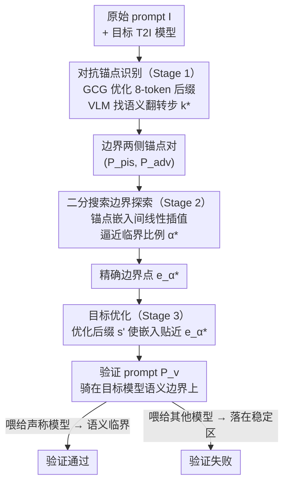

# Verify Claimed Text-to-Image Models via Boundary-Aware Prompt Optimization

**会议**: CVPR 2026 Findings  
**arXiv**: [2603.26328](https://arxiv.org/abs/2603.26328)  
**代码**: 无  
**领域**: 图像生成  
**关键词**: 模型验证、语义边界、对抗prompt优化、T2I模型指纹、知识产权

## 一句话总结

BPO 提出一种无需参考模型的白盒 T2I 模型验证方法，通过三阶段流程（对抗锚点识别→二分搜索边界探索→目标优化）找到模型特有的语义边界区域，生成的验证 prompt 在 5 个 T2I 模型上达到平均 96% 准确率和 0.93 F1，比 TVN 方法快 2 倍。

## 研究背景与动机

1. **领域现状**：T2I 模型（如 Stable Diffusion 系列）的商业价值使模型归属认证成为重要需求。需要验证一个公开部署的 T2I 模型是否确实是声称的模型（如防止换皮或盗用）。
2. **现有痛点**：(1) TVN 方法依赖多个参考模型对比，需要维护参考模型集合且难以扩展；(2) 随机/贪心 prompt 方法准确率仅 17-23%，因为通用 prompt 无法区分相似模型；(3) 现有方法计算效率低。
3. **核心矛盾**：不同 T2I 模型的文本编码器和生成器虽然相似（多基于同一架构微调），但它们的语义边界（嵌入空间中输出语义发生跳变的区域）是模型特有的。
4. **本文目标**：直接利用目标模型自身的语义边界特性生成验证 prompt，无需任何参考模型。
5. **切入角度**：类比分类器的决策边界——每个模型的语义边界位置不同，通过精确定位边界后生成贴近边界的 prompt，可以区分不同模型。
6. **核心 idea**：三阶段流程——对抗攻击找到语义翻转点→二分搜索精确定位边界→GCG 优化生成朝向边界的验证 prompt。

## 方法详解

### 整体框架

BPO 要解决的核心问题是：手里有一个已部署的 T2I 模型，怎么不靠任何参考模型就确认它到底是不是声称的那个？作者的切入点是「语义边界」——把目标模型类比成一个分类器，它的文本编码器在嵌入空间里有一些位置，prompt 稍微挪一点，生成图像的语义就会突变（比如从"猫"翻成"狗"）。这种边界的位置是每个模型微调后特有的，难以伪造，于是它就成了模型的指纹。

整条流水线就是去精确找到这条边界、再造一个贴着边界的 prompt：原始 prompt $I$ 先经 Stage 1 做对抗攻击，沿着远离原语义的方向走，捕捉到语义刚翻转那一刻边界两侧的一对锚点 $(P_{pis}, P_{adv})$；Stage 2 在这对锚点的嵌入之间做二分搜索，把粗略的边界区间收紧到精确的边界点 $e_{\alpha^*}$；Stage 3 再优化出一个后缀，让最终 prompt $P_v$ 的嵌入恰好落在这个边界点上。$P_v$ 在目标模型上正好处于"语义临界"，换到别的模型就大概率不在边界——同一个 $P_v$ 喂给不同模型生成出不同语义，验证就此成立。

### 关键设计

**1. 对抗锚点识别（Stage 1）：用对抗攻击的轨迹去"撞"到边界**

直接在巨大的嵌入空间里盲搜边界是不现实的。作者的巧思是借力 GCG 对抗攻击——攻击的本质就是沿着"远离原始语义"的方向推进，这条路径几乎必然要穿过语义边界。具体做法是优化一个 8-token 后缀 $s$，目标 $\min_s \cos(E_t(I+s), E_t(I))$ 让加了后缀的文本嵌入尽量背离原始嵌入。优化过程中每一步都让 VLM 判断生成语义有没有翻，找到语义首次翻转的那一步 $k^*$，就取翻转前后的两个 prompt $P_{pis} = P_{k^*-1}$、$P_{adv} = P_{k^*}$ 当作夹住边界的一对锚点。这一步把"找边界"这个开放问题，转化成了"沿一条已知路径找过零点"。

**2. 二分搜索边界探索（Stage 2）：在两个锚点之间逼近真正的边界**

Stage 1 给的只是夹住边界的粗区间，还不够精确。作者在两个锚点嵌入之间做线性插值 $e_\alpha = (1-\alpha)e_{pis} + \alpha e_{adv}$，用二分搜索找那个临界比例 $\alpha^*$——使得 $S(G_t(e_{\alpha^*}))$ 刚好与原图语义 $S(M_t(I))$ 不一致的最小 $\alpha$，精度阈值 $\epsilon = 0.001$。比如从 $\alpha=0.5$ 试起，VLM 判定语义仍与原图一致就说明边界在右半区，再试 $\alpha=0.75$……几步就把区间收敛到边界附近。这里依赖一个假设：边界局部嵌入空间近似线性（实验证明在边界邻域确实成立），所以线性插值才有意义；而二分搜索的 $O(\log(1/\epsilon))$ 复杂度也远比网格遍历省。

**3. 目标优化（Stage 3）：把验证 prompt 钉死在边界上**

有了精确边界点 $e_{\alpha^*}$，最后一步是造一个真正能用来验证的 prompt。作者在 $P_{adv}$ 基础上重新优化后缀 $s'$，目标反过来——$\max_{s'} \cos(E_t(I+s'), e_{\alpha^*})$ 让新 prompt 的嵌入尽量贴近边界点，跑 100 次 GCG 迭代、batch size 256。得到的 $P_v$ 在目标模型上恰好骑在语义边界上：稍有扰动语义就翻。而这条边界是目标模型特有的，换个模型这个 $P_v$ 大概率落在边界以外的"语义稳定区"，生成结果就不一样——鉴别力正源于此。

### 损失函数 / 训练策略

整套方法不涉及训练，全部是推理时优化。GCG 攻击负责 Stage 1/3 的后缀搜索，VLM（qwen-vl-max）负责所有语义翻转判断。每个验证任务生成 10 张图像评估一致性，分数 $C = |2r - 1|$（$r$ 为语义匹配比例，$C$ 越接近 1 说明判定越稳定）。

## 实验关键数据

### 主实验

| 方法 | SD v1.4 | SD v2.1 | SDXL | Dreamlike | Openjourney | 平均 Acc |
|------|---------|---------|------|-----------|-------------|----------|
| Normal | 0.17 | 0.17 | 0.17 | 0.17 | 0.17 | 0.17 |
| Random | 0.33 | 0.20 | 0.17 | 0.33 | 0.17 | 0.23 |
| TVN | 0.50 | 1.00 | 0.83 | 0.50 | 0.17 | 0.60 |
| **BPO** | **1.00** | **0.80** | **1.00** | **1.00** | **1.00** | **0.96** |

### 消融实验

| Prompt 变体 | 平均 Acc | 平均 F1 | 说明 |
|------------|---------|---------|------|
| $P_{pis}$（边界前） | 0.80 | 0.78 | 不够接近边界 |
| $P_{adv}$（边界后） | 0.84 | 0.80 | 已越过边界 |
| **$P_v$（优化后）** | **0.96** | **0.93** | 精确定位边界 |

### 关键发现

- BPO 平均准确率 96%，比 TVN 的 60% 高出 36 个百分点，且不需要任何参考模型
- 效率提升 2 倍：BPO 平均 159s vs TVN 321s（SD v1.4 上 5 倍加速：108s vs 553s）
- 10 张生成图像即可达到平台精度（0.96），更多图像无显著增益
- 后缀长度 8-9 token 为最优，过短信息不足，过长可能过拟合
- VLM 选择影响不大：qwen-vl-max=0.96, gemini-2.5-flash=0.92, gpt-5=0.92

## 亮点与洞察

- **语义边界作为模型指纹**：巧妙类比分类器决策边界的思路——语义边界是模型内在的、不可复制的特征，比模型水印更难伪造
- **三阶段的渐进精炼设计**：对抗攻击→二分搜索→目标优化，每步都有明确的数学基础和实验验证
- **完全无参考模型**：消除了参考模型集合的维护成本，使方法可扩展到任意新模型

## 局限与展望

- 需要白盒访问目标模型的文本编码器（梯度计算），不适用于纯 API 服务
- 仅测试了 5 个开源模型，对最新的私有模型（如 DALL-E 3、Midjourney）泛化性未知
- 对抗鲁棒性强的模型可能语义边界更模糊，更难定位
- 正则化技术可能使边界更不典型，降低验证准确率
- 后续可探索黑盒版本（通过查询 API 做边界探测）

## 相关工作与启发

- **vs TVN**: TVN 需要参考模型集合比较不一致率，BPO 直接利用模型自身特性，概念更简洁且效果更好
- **vs 模型水印**: 水印需要训练时植入，BPO 是事后验证方法，适用于已部署的模型
- **vs GCG 对抗攻击**: BPO 将 GCG 从"攻击"工具转化为"诊断"工具，用途完全不同

## 评分

- 新颖性: ⭐⭐⭐⭐⭐ 语义边界作为模型指纹的概念极具创新性
- 实验充分度: ⭐⭐⭐⭐ 5个模型+消融+效率分析，但测试规模偏小
- 写作质量: ⭐⭐⭐⭐ 三阶段描述清晰，形式化严谨
- 价值: ⭐⭐⭐⭐ 模型知识产权保护的实际需求+新视角方法

<!-- RELATED:START -->

## 相关论文

- [\[CVPR 2025\] Minority-Focused Text-to-Image Generation via Prompt Optimization](../../CVPR2025/image_generation/minority-focused_text-to-image_generation_via_prompt_optimization.md)
- [\[CVPR 2026\] Decision Boundary-aware Generation for Long-tailed Learning](decision_boundary-aware_generation_for_long-tailed_learning.md)
- [\[CVPR 2026\] Compositional Text-to-Image Generation Via Region-aware Bimodal Direct Preference Optimization](compositional_text-to-image_generation_via_region-aware_bimodal_direct_preferenc.md)
- [\[CVPR 2026\] Mitigating Memorization in Text-to-Image Diffusion via Region-Aware Prompt Augmentation and Multimodal Copy Detection](mitigating_memorization_in_texttoimage_diffusion_v.md)
- [\[CVPR 2026\] Rethinking Prompt Design for Inference-time Scaling in Text-to-Visual Generation](rethinking_prompt_design_for_inference-time_scaling_in_text-to-visual_generation.md)

<!-- RELATED:END -->
