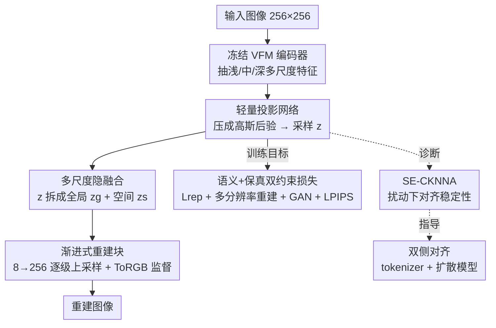

# VFM-VAE: Vision Foundation Models Can Be Good Tokenizers for Latent Diffusion Models

**会议**: CVPR 2026  
**arXiv**: [2510.18457](https://arxiv.org/abs/2510.18457)  
**代码**: 无  
**领域**: 扩散模型 / 视觉 tokenizer / 表示学习  
**关键词**: 视觉基础模型, 隐空间扩散, VAE tokenizer, 表示对齐, 冻结编码器

## 一句话总结
把一个冻结的视觉基础模型（VFM，如 SigLIP2-Large）直接当作隐空间扩散模型的 VAE 编码器，再配一个多尺度专用解码器把语义特征解回逼真图像，从而跳过"蒸馏对齐"带来的表示退化——结果在 ImageNet 256×256 上用 80 epoch 就把 gFID（无 CFG）做到 2.22（比此前 tokenizer 快约 10×），训练到 640 epoch 进一步到 1.62。

## 研究背景与动机
**领域现状**：隐空间扩散模型（LDM）走的是两段式：先训一个视觉 tokenizer（通常是 VAE）把像素图压成紧凑隐空间，再在隐空间里学扩散。tokenizer 产出的隐表示质量直接决定了下游生成的天花板。近年大量工作（VA-VAE、REPA-E 等）想把视觉基础模型（DINOv2、SigLIP2 这类自监督/弱监督预训练大模型）的强语义注入 tokenizer，做法都是**蒸馏对齐**：让 VAE 的隐编码去模仿 VFM 的特征。

**现有痛点**：作者用特征相似度指标 CKNNA 一测发现，这些蒸馏出来的 tokenizer 在干净图上分数很高，但一旦施加**语义保持的扰动**（加噪、缩放、旋转 90°/180°），对齐分数会急剧崩塌——VA-VAE 的 CKNNA 在扰动下相对掉了 33.2%。这说明蒸馏过程其实丢失了 VFM 原本的关键信息，学到的是脆弱的伪对齐。

**核心矛盾**：蒸馏天生是"用一个从头训的小网络去逼近一个大模型的表示"，逼近误差不可避免，于是**鱼（语义鲁棒性）和熊掌（重建保真）不可兼得**。既然 VFM 本身的语义又强又稳，为什么还要费力去模仿它？

**本文目标**：(1) 让 tokenizer 真正继承 VFM 的语义鲁棒性而非蒸馏副本；(2) 同时保住像素级重建保真度；(3) 搞清楚 tokenizer 的隐表示质量到底如何影响扩散模型内部的表示演化。

**切入角度**：受 VFM 在稠密预测任务上成功的启发，作者假设——**冻结的 VFM 编码器在合适的解码器架构配合下，完全能支撑高保真重建**。难点在于 VFM 特征是为"语义理解"优化的，空间分辨率粗、通道分布高度各向异性，标准 VAE 解码器很难从中恢复细节。

**核心 idea**：与其训 VAE 去模仿 VFM，不如**直接把冻结 VFM 当编码器前端**，只训一个为它量身定制的多尺度解码器；表示退化问题从源头消失。

## 方法详解

### 整体框架
VFM-VAE 要解决的是"如何把一个冻结的、为语义优化的 VFM 改造成能用于 LDM 的高保真 tokenizer"。整体仍是 VAE 的编码-解码结构，但编码器换成冻结 VFM，解码器是全新设计：输入一张 256×256 图像，冻结 VFM 抽出浅/中/深三层多尺度特征，经一个轻量投影网络压成对角高斯后验、采样得到紧凑隐码 $\mathbf{z}$；解码器先把 $\mathbf{z}$ 拆成"全局风格分量 + 多尺度空间分量"，再经一串渐进式重建块（8→16→…→256 分辨率）逐级上采样合成图像，每级都有像素监督。训练时用一组损失同时约束"语义对齐"和"重建保真"。最后作者还提出诊断指标 SE-CKNNA 来衡量 tokenizer 与 VFM 的对齐稳定性，并据此设计 tokenizer 与扩散模型的**双侧对齐**策略。

### 关键设计

**1. 冻结 VFM 编码器 + 多尺度特征投影：从源头杜绝蒸馏退化**

针对"蒸馏不可避免地丢信息"这个根本痛点，作者直接拿一个预训练好的 VFM（默认 SigLIP2-Large）当编码器 $\Phi$，**全程冻结**，不做任何对齐微调，于是它原生的语义鲁棒性原封不动地留下来了。关键观察是：最适合重建的特征不一定在最后一层，所以作者从 VFM 不同深度抽出浅、中、深三层特征 $\{\mathbf{f}_{\text{shallow}}, \mathbf{f}_{\text{middle}}, \mathbf{f}_{\text{final}}\} = \Phi(\mathbf{x})$，沿通道拼接后送进一个轻量投影网络 $\mathcal{C}$，输出对角高斯后验的均值与对数方差：

$$\boldsymbol{\mu}, \log\boldsymbol{\sigma}^2 = \mathcal{C}(\text{Concat}[\mathbf{f}_{\text{shallow}}, \mathbf{f}_{\text{middle}}, \mathbf{f}_{\text{final}}])$$

再用重参数化技巧采样隐码 $\mathbf{z}$。投影网络的作用是把 VFM 的高维特征压到 LDM 友好的紧凑隐空间（沿用 VA-VAE 的 f16d32 配置），让下游扩散好学。和旧方法的本质区别：旧方法是"VAE 学着像 VFM"，这里是"VFM 本体就是编码器"，对齐分数在扰动下只飘 +1.6% 而非崩 -33.2%。

**2. 多尺度隐融合：把一个紧凑隐码拆成"全局风格 + 多尺度空间"两路控制**

VFM 特征空间分辨率粗、通道高度各向异性，标准解码器（单输入单输出）吃不动。作者先把隐码 $\mathbf{z}$ 解耦成两部分：一个全局分量 $\mathbf{z}_g = \text{GlobalPool}(\mathbf{z}) \in \mathbb{R}^c$，对空间布局不变，承载整体风格/色调这类全局描述；一组空间分量 $\{\mathbf{z}_s^{(i)} \in \mathbb{R}^{c\times h_i\times w_i}\}_{i=1}^N$，通过 pixel shuffle/unshuffle 等 reshape 操作从 $\mathbf{z}$ 造出不同尺度。全局分量供给**每一个**解码块、保证全程风格一致；空间分量则**只注入前几个低分辨率块**（$i\le 4$）来打地基，让后面的高分辨率块（$5\le i\le 6$）专注雕细节。这么分工是有实验依据的：早期试验发现高分辨率处再用 pixel shuffle 注入空间信息，有效通道不足，只增计算不涨点。

**3. 渐进式重建块（Modulated ConvNeXt + 逐级 ToRGB）：把语义特征稳定地解回像素**

解码器由 $N$ 个块 $\{\mathcal{B}_i\}_{i=1}^N$ 串成，分辨率逐级翻倍 $8\to16\to32\to64\to128\to256$。核心建筑块是**改造版 ConvNeXt**：全局风格 $\mathbf{z}_g$ 经块专属的仿射变换 $\gamma_i$ 产生逐通道缩放因子，在第一个 $1\times1$ 点卷积（负责通道混合那层）处做调制卷积，把全局风格注入特征：

$$\mathcal{B}_i(\mathbf{h}_{\text{in}}, \mathbf{z}_g) = \text{ModConv}(\mathbf{h}_{\text{in}}, \gamma_i(\mathbf{z}_g)) + \mathbf{h}_{\text{in}}$$

为了让每一级都学到"尺度恰当"的特征、避免早期模式崩塌，每个块都挂一个轻量 $\text{ToRGB}_i$ 头直接输出该分辨率的图像 $\hat{\mathbf{x}}_i$，并加了**特征空间残差**——细尺度的监督要被粗尺度建立的结构一致地引导：

$$\hat{\mathbf{x}}_i = \begin{cases} \text{ToRGB}_i(\mathbf{h}^{(1)}, \mathbf{z}_g) & i=1 \\ \text{ToRGB}_i(\mathbf{h}^{(i)} + \text{Upsample}(\mathbf{h}^{(i-1)}), \mathbf{z}_g) & i>1 \end{cases}$$

这样 $\text{ToRGB}_i$ 头同时拿到新细节 $\mathbf{h}^{(i)}$ 和来自上一级的稳定结构 $\mathbf{h}^{(i-1)}$，逐级 RGB 监督既稳住训练又强制每块各司其职。消融显示，从 SD-VAE 风格基线到这套现代块，rFID 从 19.69 一路降到 1.08。

**4. SE-CKNNA：能识破"伪对齐"的鲁棒诊断指标**

标准 CKNNA 在干净图上无法区分"真稳健对齐"和"脆弱的伪对齐"。作者把它扩展成**语义等变 CKNNA（Semantic-Equivariant CKNNA）**：对一组语义保持的扰动分布 $\mathcal{T}$ 做蒙特卡洛式平均，

$$\text{SE-CKNNA} = \frac{1}{|\mathcal{T}|}\sum_{T\in\mathcal{T}} \text{CKNNA}(T)$$

扰动集合包括加性噪声（强度 0.05/0.10/0.15/0.20）、尺度插值（比例 0.25/0.50/0.75/1.0）、离散旋转（0°/90°/180°/270°）。直觉是：真正继承了 VFM 语义的 tokenizer，在这些不改变语义的变换下对齐分数应当稳定；伪对齐则会崩。论文用相对变化量 $|\text{SE-CKNNA}-\text{CKNNA}|/\text{CKNNA}$ 来量化稳定性，VFM-VAE 只 +1.6%，VA-VAE 则 -33.2%。

### 损失函数 / 训练策略
总损失同时约束语义保持与重建保真：

$$\mathcal{L}_{\text{total}} = \lambda_{\text{rep}}\mathcal{L}_{\text{rep}} + \sum_{i=1}^N \lambda_i \mathcal{L}_{\text{recon}}^{(i)} + \lambda_{\text{GAN}}\mathcal{L}_{\text{GAN}} + \lambda_{\text{LPIPS}}\mathcal{L}_{\text{LPIPS}}$$

- **表示正则 $\mathcal{L}_{\text{rep}} = \mathcal{L}_{\text{KL}} + \mathcal{L}_{\text{VF}}$**：KL 散度规整隐空间分布；VF 损失（取自 VA-VAE，含余弦相似度 + 矩阵距离）让压缩后的 $\mathbf{z}$ 在语义上仍对齐 VFM 的 $\mathbf{f}_{\text{final}}$，又不过度压缩其容量。
- **多分辨率重建损失 $\mathcal{L}_{\text{recon}}^{(i)} = \lVert \mathrm{f}_{r_i}(\mathbf{x}) - \hat{\mathbf{x}}_i \rVert_1$**：对每个解码块的输出在对应分辨率上做 L1 监督（$\mathrm{f}_{r_i}$ 把真值图下采样到匹配尺寸），是防早期模式崩塌、逼每块各司其职的关键。
- **对抗损失 $\mathcal{L}_{\text{GAN}}$**：判别器用 DINOv2 骨干，提升最终全分辨率输出的真实感。
- **LPIPS 感知损失 $\mathcal{L}_{\text{LPIPS}}$**：让重建更贴近人眼感知。

训练在 ImageNet 256×256 上进行；下游评测两套生成器：(1) LightningDiT-XL（对标 VA-VAE），(2) REG（SiT-XL 骨干 + 额外对齐损失）。**双侧对齐**策略：tokenizer 侧用 VFM-VAE 继承 VFM 语义，扩散侧用 REG 对齐浅层 patch 特征并经 class token 注入全局语义，二者协同让扩散模型各层 CKNNA 都更高更均匀。

## 实验关键数据

### 主实验
ImageNet 256×256 系统级生成对比（节选 Table 2，gFID 越低越好）：

| Tokenizer + 生成器 | Epochs | gFID (无 CFG) | gFID (有 CFG) | gIS (有 CFG) |
|--------|------|------|------|------|
| VA-VAE + LightningDiT | 800 | 2.17 | 1.35 | 295.3 |
| SD-VAE + REG | 480 | 2.20 | 1.40 | 296.9 |
| E2E-VAE + REPA | 800 | 1.83 | 1.26 | 314.9 |
| **VFM-VAE + LightningDiT** | 64 | **2.42** | 2.03 | 261.7 |
| **VFM-VAE + LightningDiT** | 560 | **2.06** | 1.57 | 254.4 |
| **VFM-VAE + REG** | 80 | **2.22** | — | — |
| **VFM-VAE + REG** | 640 | **1.62** | **1.31** | 300.2 |

要点：VFM-VAE + REG 仅 64 epoch 就达到 2.22 gFID，**追平 480 epoch 的 REG**，约 10× 加速；640 epoch 达 1.62/1.31（无/有 CFG）。即便不在扩散侧做对齐，VFM-VAE + LightningDiT 也比 VA-VAE 版本好 ~1.34 gFID。

tokenizer 自身的重建/对齐对比（Table 1，LightningDiT-XL 训练）：

| Tokenizer | #Images | rFID↓ | gFID↓ (64ep) | Top-1 Acc↑ | CKNNA | SE-CKNNA | 相对变化 |
|--------|------|------|------|------|------|------|------|
| SD-VAE | 108M | 0.62 | 7.13 | 8.0 | 0.004 | 0.005 | — |
| VA-VAE | 160M | 0.30 | 5.14 | 31.9 | 0.202 | 0.135 | −33.2% |
| **VFM-VAE** | **44M** | 0.52 | **3.80** | **43.2** | 0.188 | **0.191** | **+1.6%** |

VFM-VAE 只用了 VA-VAE 约 1/4 的训练图，线性探测 Top-1 从 31.9% 提到 43.2%，且 SE-CKNNA 在扰动下几乎不掉（+1.6% vs VA-VAE 的 −33.2%），证明继承冻结 VFM 拿到的是真稳健的隐空间。

### 消融实验
模块逐步叠加（Table 5，5M 图弱对齐下测重建）：

| 配置 | rFID↓ | rIS↑ | 说明 |
|------|------|------|------|
| SD-VAE 风格基线 | 19.69 | 74.9 | SigLIP2-Large 当 VFM 的最简版 |
| + 多尺度隐融合 | 14.35 | 93.6 | 加空间控制，rFID 降 ~27% |
| + 现代块（Mod-ConvNeXt） | 1.08 | 194.6 | 换调制 ConvNeXt + 低分辨率自注意力，巨幅提升 |
| + 编码器改造 | 0.71 | 206.8 | 聚合浅/中/深特征 + 升 patch16-512 骨干 |

不同 VFM 兼容性（Table 6，两阶段对齐，LightningDiT-L/1 @100k 步）：

| VFM | rFID↓ | PSNR↑ | gFID↓ |
|------|------|------|------|
| EVA-CLIP-Large | 1.35 | 19.33 | 4.40 |
| DINOv2-Large | 1.55 | 17.60 | **4.00** |
| SigLIP2-Large | 1.61 | 18.73 | 5.59 |

### 关键发现
- **现代解码块贡献最大**：从多尺度融合（rFID 14.35）到 Modulated ConvNeXt 块（1.08）是最大跃升，说明"用什么块从语义特征解回像素"是把冻结 VFM 用好的关键瓶颈。
- **高质量 tokenizer 表示能促进扩散内部表示学习**：VFM-VAE 驱动的扩散模型逐层 CKNNA 平均值和峰值都更高，峰值 0.52 甚至超过 SigLIP2-Large 与 DINOv2-Giant 之间的 0.50 参考线。
- **双侧对齐有协同增益**：单靠 tokenizer 对齐，浅层 CKNNA 仍弱；叠加 REG 的浅层对齐后，扩散各层对齐都更高更均匀，最终落到生成质量上。
- **盲目堆数据反而变差**：把 SD-VAE 风格基线 scale up 性能反降，而 VFM-VAE 每加一个组件都在涨——说明问题不在数据量，在架构是否匹配 VFM 特征。
- **泛化到 512 分辨率与文生图**：ImageNet-512 上 gFID 21.42→18.05；BLIP3-o 文生图 DPG-Bench 55.4→59.1、MJHQ-30K gFID 23.0→17.0，都优于 VA-VAE 版本。

## 亮点与洞察
- **"不蒸馏，直接用本体"是反直觉但漂亮的一招**：领域里大家默认要把 VFM 知识蒸进 VAE，本文指出蒸馏本身就是退化之源，干脆冻结整个 VFM 当编码器、只训解码器，把问题从"逼近大模型"换成"为大模型配解码器"，工程上也更省（44M 图 vs 160M）。
- **SE-CKNNA 是个可复用的诊断思路**：在干净数据上分数高不代表表示稳健，用"语义保持扰动下的平均对齐"去识破伪对齐，这套思路可迁移到任何"声称对齐了某 teacher"的表示评估场景。
- **全局/空间隐分量解耦 + 逐级 ToRGB 监督**：把 StyleGAN 系的"全局风格调制 + 多分辨率合成"思想搬到 VAE 解码器，用多分辨率 L1 把每个块都钉住，是从粗糙语义特征稳定恢复细节的实用配方。
- **tokenizer 质量会一路传导到扩散内部表示**：论文用逐层 CKNNA 实证了"好 tokenizer → 扩散模型内部表示更强"，把 tokenizer 设计和表示学习两条线打通，为"双侧对齐"提供了依据。

## 局限性 / 可改进方向
- **冻结 VFM 牺牲部分高频保真**：作者承认 rFID（0.52）不如纯重建优化的 E2E-VAE（0.28）/VA-VAE（0.30），因为 VFM 特征本就偏语义、空间细节弱，高频纹理会有损失。
- **训练目标复杂、调参困难**：继承了前作一堆损失（KL + VF + 多分辨率 L1 + GAN + LPIPS），权重多、调起来麻烦。
- **SE-CKNNA 是相对指标**：分数依赖所选对齐 VFM，不同 teacher 之间不能直接比大小。
- **VFM 选择与下游不完全一致**：Table 6 里 DINOv2-Large 生成 gFID 最好（4.00），但默认却用 SigLIP2-Large（5.59），重建与生成的最优 VFM 不统一，选择逻辑值得进一步澄清。
- 编码器全程冻结，没探索"轻量解冻顶层"能否在不破坏鲁棒性的前提下补回高频。

## 相关工作与启发
- **vs VA-VAE**：VA-VAE 用相似度损失把 VAE 隐码蒸馏对齐到 DINOv2；本文直接冻结 VFM 当编码器。区别在于 VA-VAE 的对齐在扰动下崩（−33.2%），VFM-VAE 几乎不动（+1.6%），且用 1/4 数据拿到更低 gFID。
- **vs REPA-E**：REPA-E 联合训 VAE 和扩散模型来对齐 VFM 表示；本文把对齐拆成 tokenizer 侧（冻结 VFM）+ 扩散侧（REG）的双侧策略，对齐更稳更均匀。
- **vs REPA / REG**：这俩在扩散模型内部注入 VFM 语义监督，但都假设 tokenizer 已提供稳定可靠的隐空间；本文恰恰先把"tokenizer 的隐空间是否稳"这个前提做扎实，再叠加 REG 形成协同。
- **vs 并发工作 RAE / SVG**：RAE/SVG 直接用高维 VFM 特征，本文坚持 LDM 的隐空间压缩（f16d32），从而**无缝兼容现有扩散框架**，不需要改下游。

## 评分
- 新颖性: ⭐⭐⭐⭐⭐ "冻结 VFM 直接当编码器 + 配专用解码器"反转了主流蒸馏范式，并配套提出 SE-CKNNA 识破伪对齐。
- 实验充分度: ⭐⭐⭐⭐ ImageNet 256/512、文生图、多 VFM 兼容、逐层 CKNNA 分析齐全，但很多细节压在补充材料、rFID 仍略逊纯重建优化方案。
- 写作质量: ⭐⭐⭐⭐ 动机—观察—方法逻辑清晰，公式完整；部分模块（pixel shuffle 细节、block 公式）外推到补充材料，主文略简。
- 价值: ⭐⭐⭐⭐⭐ ~10× 训练加速 + 稳健语义隐空间，对加速 LDM 训练和"如何用好基础模型"都有直接启发。

<!-- RELATED:START -->

## 相关论文

- [\[CVPR 2026\] Vision Foundation Models Can Be Good Tokenizers for Latent Diffusion Models](vision_foundation_models_can_be_good_tokenizers_for_latent_diffusion_models.md)
- [\[CVPR 2026\] Probing and Bridging Geometry–Interaction Cues for Affordance Reasoning in Vision Foundation Models](probing_and_bridging_geometry-interaction_cues_for_affordance_reasoning_in_visio.md)
- [\[CVPR 2026\] Taming Sampling Perturbations with Variance Expansion Loss for Latent Diffusion Models](taming_sampling_perturbations_with_variance_expansion_loss_for_latent_diffusion_.md)
- [\[CVPR 2026\] DA-VAE: Plug-in Latent Compression for Diffusion via Detail Alignment](da-vae_plug-in_latent_compression_for_diffusion_via_detail_alignment.md)
- [\[CVPR 2026\] OpenDPR: Open-Vocabulary Change Detection via Vision-Centric Diffusion-Guided Prototype Retrieval for Remote Sensing Imagery](opendpr_open-vocabulary_change_detection_via_vision-centric_diffusion-guided_pro.md)

<!-- RELATED:END -->
