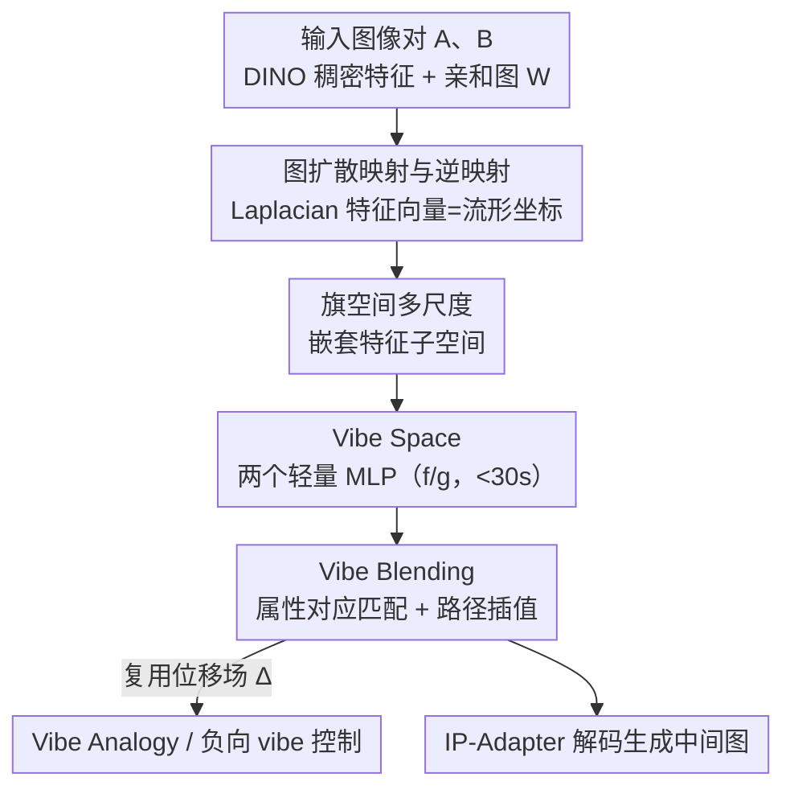

# Vibe Spaces for Creatively Connecting and Expressing Visual Concepts

**会议**: CVPR 2026  
**论文**: [CVF Open Access](https://openaccess.thecvf.com/content/CVPR2026/html/Yang_Vibe_Spaces_for_Creatively_Connecting_and_Expressing_Visual_Concepts_CVPR_2026_paper.html)  
**领域**: 图像生成 / 创意混合  
**关键词**: 图像混合, 流形几何, 图扩散映射, 创意度量, IP-Adapter

## 一句话总结
本文提出 **Vibe Blending** 任务（把两张图按"最相关的共享属性"——所谓"vibe"——融成连贯杂交体）和 **Vibe Space** 方法：用图扩散映射在 CLIP/DINO 特征空间里学一个低维"小世界"流形，让原本弯曲的测地线变成可线性插值的路径，从而生成比 GPT、Gemini 更被人类认可的创意混合图。

## 研究背景与动机
**领域现状**：把两张语义相距很远的图"融"在一起（image morphing / blending），主流是在 GAN、扩散模型的隐空间里做插值，或在噪声/权重/文本嵌入空间里找语义方向；近期也有人直接拿多模态大模型（GPT Image、Gemini）去"想象"一张混合图。

**现有痛点**：以小提琴手和吉他手为例，真正该融的是"乐器和演奏方式"，但现有方法要么做像素插值（产生鬼影、不连贯的中间帧），要么做风格迁移，要么做局部部件拼接——它们**识别不出哪些属性才是关键**，也**走不通连接远距离概念的非线性路径**。论文把这种"识别并融合最相关共享属性"的能力称为 Vibe Blending，融小提琴和吉他的 vibe 应该得到一把鲁特琴（像吉他那样弹、却和小提琴一样大小），而不是把两者像素叠在一起。

**核心矛盾**：高维特征空间高度非线性，里面充满"洞"——对应畸变、低质量图像的区域；论文假设这些洞源于**数据流形的内在维度远低于隐空间维度**。在这种空间里做朴素线性插值，必然穿过这些洞，产生破碎的中间图。

**切入角度**：与其在完整的高维特征空间里乱走，不如从几张上下文图里学一个**紧凑的低维流形**（"小世界"），在这个小世界里走直线，对应到原空间就是贴着流形的连贯过渡。这一步用经典的**图扩散映射（graph diffusion map）**实现——注意它是流形学习里的特征向量构造，和"扩散模型生成图像"毫无关系。

**核心 idea**：用图 Laplacian 特征向量把弯曲流形"展平"成可线性插值的扩散空间，再用一个仅 1M 参数、30 秒就能训好的轻量 MLP 把这条测地线闭式逼近出来，最后交给冻结的 IP-Adapter 渲染成图。

## 方法详解

### 整体框架
给定两张输入图 $I_A, I_B$，目标是生成一串连贯的中间混合图 $\{I_\alpha\}_{\alpha\in[0,1]}$。整条流水线是：先从两张图提 DINO 稠密特征当图节点、算 token 间亲和图 $\mathbf{W}$；对图 Laplacian 求广义特征向量得到**流形坐标**（把弯曲流形展平）；用**旗空间**把多个尺度的特征向量嵌套起来，避免"选几个特征向量"的难题；在线训练两个轻量 MLP（编码器 $f$: DINO→Vibe，解码器 $g$: Vibe→CLIP）把上述映射压成闭式；用语义分割的**对应匹配**确定 A、B 哪对属性该融、得到混合方向 $\Delta_{A\to B}$；在 Vibe Space 里沿这个方向线性插值、解码回 CLIP，交给冻结的 **IP-Adapter** 逐点生成图像。特征提取和特征向量计算是毫秒级，编码器–解码器训练 30 秒内完成。

### 关键设计

**1. 图扩散映射与逆映射：把弯曲流形展平成可线性插值的测地线**

针对"高维空间里直线插值会掉进洞"的痛点，本文不在原空间走路，而是先把流形"展平"。构造特征相似度图的 Laplacian $\mathbf{L} = \mathbf{D} - \mathbf{W}$（$\mathbf{D}$ 是度矩阵），取最小非零特征值对应的 $m$ 个特征向量 $\psi_2,\dots,\psi_{m+1}$ 作为新坐标，记为扩散映射 $\Psi$。它的妙处在于：扩散距离（随机游走 $t$ 步把两点连起来的概率）恰好等于嵌入空间里的欧氏距离，

$$D_t(\mathbf{x}_i, \mathbf{x}_j) = \| \mathbf{\Psi}_t(\mathbf{x}_i) - \mathbf{\Psi}_t(\mathbf{x}_j) \|_2,\quad \mathbf{\Psi}_t(\mathbf{x}_i) = (\lambda_1^t\psi_1(i),\dots,\lambda_m^t\psi_m(i))$$

于是原本弯曲的流形路径在扩散空间里近似变成直线。要得到原空间的路径，就做**逆映射**：先在扩散空间线性插值 $\Psi_t(\mathbf{x}_\alpha)=(1-\alpha)\Psi_t(\mathbf{x}_A)+\alpha\Psi_t(\mathbf{x}_B)$，再求 $\gamma(\alpha)=\arg\min_{\mathbf{x}^*}\|\Psi_t(\mathbf{x}^*)-\Psi_t(\mathbf{x}_\alpha)\|_2^2$ 把它"拉回"流形。这个优化之所以可解，是因为 Jacobian 由特征值微扰理论给出闭式、Nyström 近似又让小扰动下的 $\Psi_t(\mathbf{x}^*)$ 高效更新——最终得到一条贴着数据流形、不穿洞的路径。

**2. 旗空间：用嵌套多尺度子空间消除"该留几个特征向量"的两难**

Laplacian 特征向量天然按尺度分层：靠前的描述全局结构，靠后的编码局部变化。截断到固定的 $\Psi_{1:m}$ 等于只选一个尺度——选大了路径关注太多无关属性、选小了漏掉细节。本文改用**旗空间（flag space）**：一串嵌套嵌入 $\Psi_{1:m_1}\subset\Psi_{1:m_2}\subset\cdots\subset\Psi_{1:m_M}$，同时容纳粗细两层流形结构。逆映射相应改成在一组尺度 $\mathcal{M}$ 上求平均重建误差：

$$\gamma(\alpha)=\arg\min_{\mathbf{x}^*}\frac{1}{|\mathcal{M}|}\sum_{m_k\in\mathcal{M}}\big\|\Psi_t^{1:m_k}(\mathbf{x}^*)-\Psi_t^{1:m_k}(\mathbf{x}_\alpha)\big\|_2^2$$

这样找出的路径在全局和局部几何上都一致，也就**不会因为特征向量个数选错而翻车**——把一个敏感超参换成了对尺度的鲁棒平均。

**3. Vibe Space：两个轻量 MLP 把多尺度测地线压成 30 秒可训的闭式表示**

逐点求逆映射太慢，本文在线学两个仅 1M 参数的小 MLP。编码器 $f:\text{DINO}\to\text{Vibe}$ 把每个 token 映到极低维（典型 $d\approx 6$）的隐表示 $\mathbf{z}=f(\mathbf{x})$，解码器 $g:\text{Vibe}\to\text{CLIP}$ 再映回 CLIP 空间。训练目标是让 Vibe Space 的几何对齐旗空间扩散图的多尺度结构——具体做法是匹配 Gram 矩阵 $\mathbf{z}\mathbf{z}^\top$ 与旗空间核 $\mathbf{S}(\Psi(\mathbf{x}))$：

$$\mathcal{L}_{\text{flag\_enc}}(f)=\big\|\mathbf{z}\mathbf{z}^\top-\mathbf{S}(\Psi(\mathbf{x}))\big\|_2^2,\quad \mathcal{L}_{\text{flag\_dec}}(f,g)=\big\|\mathbf{z}\mathbf{z}^\top-\mathbf{S}(\Psi(g(\mathbf{z})))\big\|_2^2$$

其中 $\mathbf{S}(\Psi(\mathbf{x}))_{ij}=\frac{1}{|\mathcal{M}|}\sum_{m_k}\Psi^{1:m_k}(\mathbf{x}_i)\Psi^{1:m_k}(\mathbf{x}_j)^\top$ 把各尺度内积聚合起来。为了泛化到没见过的区域，还加了外推正则 $\mathcal{L}_{\text{sample}}$（对随机采样 $\mathbf{z}_{\text{sample}}$ 同样约束核一致），以及重建损失 $\mathcal{L}_{\text{recon}}=\|\mathbf{x}^{\text{clip}}-g(f(\mathbf{x}^{\text{dino}}))\|_2^2$ 把 DINO 的语义丰富性桥接到 CLIP 条件生成。一旦 $\mathbf{z}\mathbf{z}^\top\approx\mathbf{S}(\Psi(\mathbf{x}))$，**在 Vibe Space 里走直线就近似等于多尺度逆扩散测地线**——把昂贵的逐点优化换成一次前向解码。用 DINO 而不是直接 CLIP 当输入，是因为 DINO 特征语义更细，而输出落到 CLIP 又能直接喂 IP-Adapter。

**4. Vibe Blending 流水线与属性对应匹配（含 Vibe Analogy、负向控制）**

有了 Vibe Space，混合分四步（Algorithm 1）：训 Vibe Space → 确定该融哪对属性 → 在 Vibe Space 插值 → 解码生成。其中"该融哪对属性"是关键：因为两个概念几乎不会在像素层对齐，本文先用 k-way NCut 把每张图的 DINO token 聚成语义段，再用匈牙利算法做**段级对应**，得到双射 $\pi:I_B\leftrightarrow I_A$，混合方向就是 $\Delta_{A\to B}=\pi(\mathbf{z}_B)-\mathbf{z}_A$。沿 $\mathbf{z}_\alpha=\mathbf{z}_A+\alpha\Delta_{A\to B}$ 插值、$g$ 解码、IP-Adapter（无需微调）生成即可。这个位移场还能复用：**Vibe Analogy** 把学到的 $\Delta_{A\to B}$ 搬到一张相关的新图 $I_{A'}$ 上，外推出"同款 vibe"的 $I_{B'}$（如把莱昂纳多的脸变成一张扑克牌、让 Hilary Hahn 弹吉他）。**负向 vibe 控制**则反过来：给一组负样本定义要去掉的属性，用旗空间正交化 $\Psi_{\text{filtered}}=\Psi_{\text{pos}}-\beta\cdot\Psi_{\text{neg}}(\Psi_{\text{neg}}^\top\Psi_{\text{pos}})$ 把正属性投影到负方向之外，从而只融"旋转"而不带上"风格"。

**5. 认知启发的创意度量框架：PNS + 人类/LLM 偏好**

创意没有客观真值，本文从认知心理学借线索搭了一套度量。核心是**路径非线性分数（PNS, path nonlinearity score）**：心理学说人在融合远距离概念时要绕中间联想（apple→tree→wood→house）走弯路，对应到特征空间就是路径更弯。于是沿 Vibe 解码出的 CLIP 路径 $\gamma(\alpha)$ 采 $n$ 个点，量化两件事——长度比 $\textit{length ratio}=\gamma_{\text{curved}}/\gamma_{\text{linear}}$（弯曲路径总长比直线长多少）和方向变化 $\textit{direction change}=\frac{1}{n-2}\sum_i\cos^{-1}\frac{\langle\delta_i,\delta_{i+1}\rangle}{\|\delta_i\|\|\delta_{i+1}\|}$（相邻段方向的平均夹角），归一化平均得 PNS。PNS 越高代表概念越远、越难融。实验里 PNS 与人类标注的"混合难度"在高共识样本上有 80% 一致率。框架另一半是人类研究（沿"创意潜力 Creative Potential"和"混合难度 Blend Difficulty"两轴成对比较）和用 GPT-5 做 LLM 评委，验证 LLM 能否近似人类判断。

### 损失函数 / 训练策略
Vibe Space 的总目标 = 编码器旗空间损失 $\mathcal{L}_{\text{flag\_enc}}$ + 解码器旗空间损失 $\mathcal{L}_{\text{flag\_dec}}$ + 外推正则 $\mathcal{L}_{\text{sample}}$ + DINO→CLIP 重建 $\mathcal{L}_{\text{recon}}$。两个 MLP 各约 1M 参数，针对每对（或每组）输入图在线训练，30 秒内收敛；IP-Adapter 全程冻结、无需微调。

## 实验关键数据

### 主实验
在 Totally Looks Like（44 对幽默相似图，按人类评的混合难度分高/中/低）和自建 Architecture（300 对建筑设计图）上做人类偏好研究，与 GPT Image 1、Gemini 2.5 Flash Image、CLIP Avg（CLIP 嵌入平均后喂 IP-Adapter）对比。下表是各方法被选为最佳的人类偏好占比：

| 数据集 / 难度 | CLIP Avg | Gemini | GPT | 本文 |
|--------------|----------|--------|-----|------|
| TLL 高难度 | 13.3% | 6.67% | 20.0% | **60.0%** |
| TLL 中难度 | 21.4% | 7.14% | 21.4% | **50.0%** |
| TLL 低难度 | 26.7% | 6.67% | **40.0%** | 26.7% |
| Architecture | 39.0% | 5.00% | 14.0% | **42.0%** |

本文在高难度样本上的人类偏好是第二名 GPT 的约 3×、中难度约 2.4×；越难融的图对优势越明显。简单图对上 GPT/CLIP Avg 偏好回升，这也解释了在概念更接近的 Architecture 上与 CLIP Avg 差距收窄。

### 度量与一致性分析
| 度量 | 结果 | 说明 |
|------|------|------|
| PNS vs 人类难度一致率 | 80.0% | 高共识（≥66%）样本上，PNS 能估出人类感知的混合难度 |
| 人类两两标注一致率 | 63–77%（TLL）/ 66–75%（Arch） | 主观任务下人类仍较一致；概念相关的图上更一致 |
| 人类 top-1 vs LLM | 35.7%（TLL）/ 31.3%（Arch） | 随机基线 25%，LLM 与人类最优选择重合有限 |
| 人类 top-2 vs LLM | 55.1%（TLL）/ 51.8%（Arch） | 放宽到前二，LLM 倾向选人类高评的子集 |

### 关键发现
- **优势集中在"难"样本**：方法的价值随混合难度上升而放大，正契合"走弯路融远概念"的设计动机；简单概念对上和 CLIP 平均差不太多。
- **PNS 是有用的难度代理**：80% 与人类难度一致，且能用来自动筛选"更有挑战、更值得融"的图对，为数据集扩充提供原则化方向。
- **LLM 评委半可信**：GPT-5 在高难度 TLL 和整个 Architecture 上也最常选本文方法，但有两类失败——认错共享属性，或认对了却过度强调无关属性（如盯着颜色/纹理而非发型），所以只能近似而非替代人类。

## 亮点与洞察
- **把"创意混合"翻译成"流形测地线"**是最漂亮的一步：用经典图扩散映射把高维非线性流形展平、再逆映射拉回，绕开了直线插值穿洞的老问题，且全程不训练生成器、只训 1M 参数小 MLP。
- **旗空间**解决了流形学习里常被忽视的"留几个特征向量"超参——用嵌套多尺度子空间做鲁棒平均，思路可迁移到任何依赖谱嵌入的任务。
- **PNS 用路径几何量化"概念距离/难度"**，把一个看似主观的"这对图好不好融"问题变成可计算的曲率/长度比指标，对数据集策划很实用。
- **位移场可复用**：同一个 $\Delta_{A\to B}$ 既能做混合、又能搬到新图做类比、还能正交化做负向控制，一套表示撑起三种创意操作。

## 局限与展望
- **评测仍重度依赖主观判断**：创意本身定义模糊，人类标注成本高且有 ~25–37% 不一致，LLM 评委又会认错关键属性——可靠、可扩展的自动评测仍是开放问题。
- **作者承认筛"好图对"难**：虽然 PNS 给了原则化方向，但策划真正引人入胜又有挑战的输入图对仍未解决。
- **生成质量受限于冻结 IP-Adapter**：方法只学路径、不碰生成器，渲染保真度被 IP-Adapter 的能力上限卡住；对极端远、几乎无共享属性的概念对，"vibe"可能本就不存在。
- **改进方向**：让 LLM 评委更会"抓关键共享属性"、用 PNS 自动扩充更难的数据集，是作者点名的两条路。

## 相关工作与启发
- **vs 扩散 morphing（DiffMorpher、Yu et al.）**: 他们在生成器隐空间做像素级插值，远距离概念会鬼影、不连贯；本文在 DINO/CLIP 特征空间学低维流形走测地线，能聚焦到"该融的属性"而非像素。
- **vs AID（注意力插值）**: AID 在扩散模型内融合注意力、但对所有属性一视同仁、靠注意力对应；本文显式用分割对应找"最相关属性"，并且不需要微调扩散模型。
- **vs 多模态 LLM（GPT Image、Gemini）**: 它们靠语言描述混合，常退化成局部部件拼接或风格迁移、抓不准精细视觉属性；本文直接在图像特征空间操作，在难样本上人类偏好显著更高。
- **vs 经典扩散映射 / 流形学习**: 借用 diffusion map、Nyström、特征值微扰这些老工具，但创新地接到 IP-Adapter 生成、并用旗空间处理多尺度——把谱嵌入从"分析工具"变成"可生成图像的创意引擎"。

## 评分
- 新颖性: ⭐⭐⭐⭐⭐ 把图扩散流形几何 + 旗空间多尺度 + 轻量 MLP 接到生成，提出全新的 Vibe Blending 任务与 PNS 度量，视角独到。
- 实验充分度: ⭐⭐⭐⭐ 有人类研究、LLM 评委、PNS 一致性多维验证，但样本规模偏小（44/300 对）、缺定量保真度指标。
- 写作质量: ⭐⭐⭐⭐⭐ 动机（小提琴↔吉他→鲁特琴）讲得生动，数学推导与算法清晰，图示到位。
- 价值: ⭐⭐⭐⭐ 为创意图像混合提供了原则化、轻量、可控的新范式，PNS 和负向控制都很实用；评测主观性限制了直接落地。

<!-- RELATED:START -->

## 相关论文

- [\[CVPR 2026\] Toward Diffusible High-Dimensional Latent Spaces: A Frequency Perspective](toward_diffusible_high-dimensional_latent_spaces_a_frequency_perspective.md)
- [\[CVPR 2026\] Erasing Thousands of Concepts: Towards Scalable and Practical Concept Erasure for Text-to-Image Diffusion Models](erasing_thousands_of_concepts_towards_scalable_and_practical_concept_erasure_for.md)
- [\[CVPR 2026\] Seeing What Matters: Visual Preference Policy Optimization for Visual Generation](seeing_what_matters_visual_preference_policy_optimization_for_visual_generation.md)
- [\[CVPR 2025\] Memories of Forgotten Concepts](../../CVPR2025/image_generation/memories_of_forgotten_concepts.md)
- [\[CVPR 2026\] ThinkGen: Generalized Thinking for Visual Generation](thinkgen_generalized_thinking_for_visual_generation.md)

<!-- RELATED:END -->
