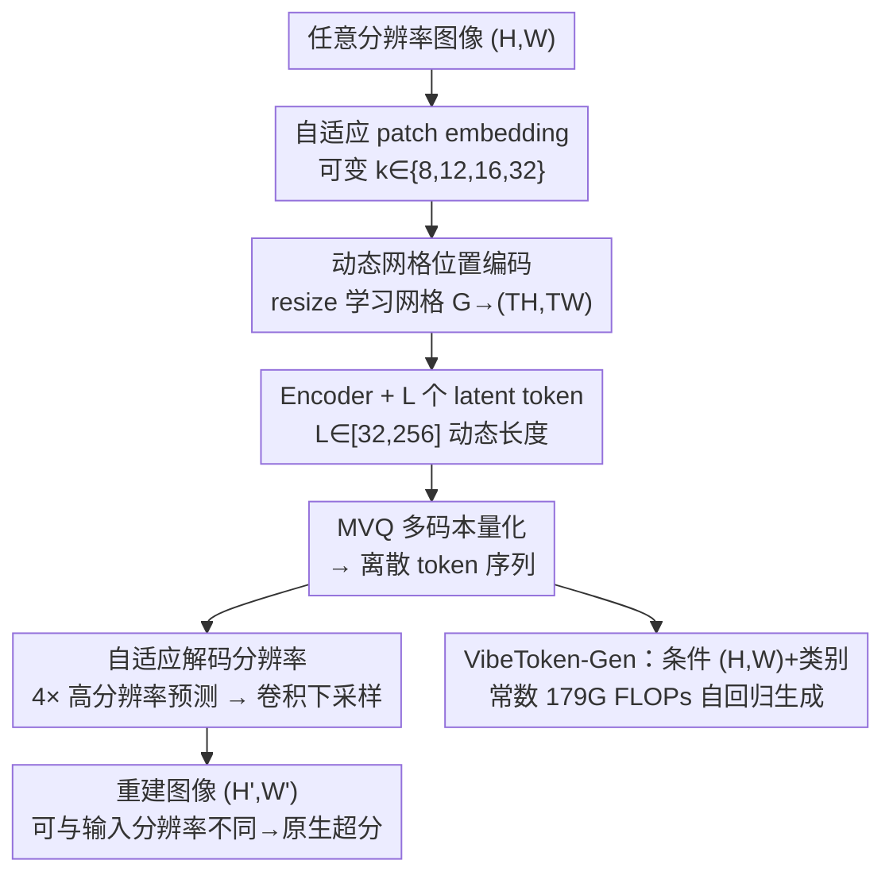

# VibeToken: Scaling 1D Image Tokenizers and Autoregressive Models for Dynamic Resolution Generations

**会议**: CVPR 2026  
**论文**: [CVF Open Access](https://openaccess.thecvf.com/content/CVPR2026/html/Patel_VibeToken_Scaling_1D_Image_Tokenizers_and_Autoregressive_Models_for_Dynamic_CVPR_2026_paper.html)  
**代码**: https://github.com/SonyResearch/VibeToken  
**领域**: 图像生成  
**关键词**: 1D图像tokenizer, 自回归生成, 任意分辨率, 动态token长度, 计算高效

## 一句话总结
VibeToken 提出一个"分辨率无关"的 1D Transformer tokenizer，把任意分辨率/长宽比的图像压成 32–256 个动态长度的离散 token，再配一个常数算力的自回归生成器 VibeToken-Gen，用 64 个 token 就能生成 1024×1024 图像（3.94 gFID），推理 FLOPs 比 LlamaGen 低 63 倍，把 AR 生成的算力曲线从"随分辨率二次增长"拉成一条水平线。

## 研究背景与动机

**领域现状**：图像生成有两大主力——扩散模型和自回归（AR）模型。扩散模型天然支持任意分辨率和长宽比，已经成了工业级生成的主力；AR 模型（VQGAN+Transformer、LlamaGen、VAR 等）虽然在固定分辨率上能打出有竞争力的质量，却在生产环境里几乎没人用。

**现有痛点**：AR 模型的致命短板是"分辨率灵活性"。绝大多数 AR 工作只在 256×256、512×512 这种固定低分辨率上训练，换分辨率就跪。常见的补救是接一个超分模块（SDXL/Flux upscaler），但这又额外引入训练复杂度和算力开销。

**核心矛盾**：问题的根子在 **tokenizer**。传统 2D CNN tokenizer（如 VQGAN）产出的 token 数随分辨率线性增长——$f=16$ 时 256×256 是 256 个 token、1024×1024 直接飙到 4096 个。而 AR 模型的自注意力是 $O(T^2)$，token 一多，推理 FLOPs 就近乎二次爆炸（LlamaGen 在 1024×1024 要 ≈11 TFLOPs）。近期的 1D Transformer tokenizer（TiTok 等）压缩率更高，但它们假设固定训练分辨率、缺少 2D tokenizer 那种空间归纳偏置，照样无法跨分辨率泛化。

**本文目标**：作者把问题拆成一个干净的提问——"能不能把任意分辨率的图像编码成**固定且很少**的一小撮 token，再解码回任意目标分辨率？"如果可以，AR 生成器就能始终在固定的小序列长度上训练，把"分辨率缩放"这个脏活全甩给 tokenizer 扛。

**核心 idea**：把扩展性负担从生成器转移到 tokenizer——做一个分辨率无关、长度可控的 1D tokenizer（VibeToken），让下游 AR 生成器在常数算力预算下原生支持任意分辨率与长宽比。

## 方法详解

### 整体框架

VibeToken 的核心是一个 1D Transformer encoder-decoder tokenizer：输入任意分辨率 $(H,W)$ 的图像，先用**自适应 patch embedding** 切成 patch（patch size $k$ 可变），加上**动态网格位置编码**注入空间归纳偏置；encoder 在 patch 序列前面拼接 $L$ 个可学习的 latent token，编码后只取这 $L$ 个 latent（$L\in[32,256]$ 动态可选），经多码本量化（MVQ）成离散 token；decoder 拿这 $L$ 个量化 latent 加上 $N$ 个 mask token，先在 $4\times$ 高分辨率上预测像素，再经一层**自适应下采样卷积**调到目标分辨率 $(H',W')$——输入和输出分辨率可以不同，从而原生支持超分。整个 tokenizer 训练时随机采样输入分辨率、目标分辨率和 latent 长度，逼模型学会"分辨率无关"的表示。

拿到这套短而灵活的 token 后，VibeToken-Gen 是一个 LlamaGen 风格的类别条件 AR 生成器，额外把目标分辨率 $(H,W)$ 作为条件喂进去。因为 token 数 $L$ 与分辨率解耦（永远 ≤256），AR 推理 FLOPs 是**常数**，与目标分辨率无关。

### 关键设计

**1. 动态网格位置编码：让 1D tokenizer 跨分辨率不再靠插值硬撑**

固定网格上训练的绝对位置编码（APE）换分辨率就外推失败，而 axial RoPE 若做成逐层可学习又太贵（见 Table 1，Learnable RoPE 在 1024² 上 445 GFLOPs）。VibeToken 借鉴 NaViT/ViTAR，维护一个学习好的网格嵌入 $G\in\mathbb{R}^{d\times T^{max}_H\times T^{max}_W}$（取 $T^{max}_H=T^{max}_W=32$）。对输入图像先算出 patch 网格 $T_H=\lceil H/k_h\rceil,\ T_W=\lceil W/k_w\rceil$，再用可微的双线性/双三次 **resize** 把 $G$ 缩放到 $(T_H,T_W)$：$\widehat{G}=\operatorname{resize}(G;T_H,T_W)$，展平后加到 patch embedding 上。这样位置编码随分辨率"伸缩"而非"插值救火"，保留了空间归纳偏置又去掉了 1D tokenizer 的定长枷锁——相比可学习 axial RoPE，FLOPs 降约 33% 且质量不掉（Table 1：Learnable RoPE 445 GFLOPs，Dynamic Grid 仅 299 GFLOPs）。

**2. 自适应 patch embedding：一套权重支持任意 patch 大小**

序列长度 $s$ 随 patch 数线性增长，大 patch 省算力但丢细节，固定 $k$ 训练又泛化不动。受 FlexiViT 启发，VibeToken 在训练和推理时都允许可变 patch size $k\in[k_{min},k_{max}]$。关键技巧是只学一套 $k_{max}$ 网格的基投影权重 $W_{k_{max}}$，其他所有 $k$ 的权重靠一个权重缩放算子 $R_{k\leftarrow k_{max}}$ 在线推出来：$W_k=W_{k_{max}}R_{k\leftarrow k_{max}}$（逐通道双线性插值），patch 嵌入即 $e_{\text{patch}}(p_k)=W_k\,p_k+b$。于是只有 $W_{k_{max}},b$ 是被训练的，避免了为每个 $k$ 单独重参数化，还在不同 $k$ 间保持特征一致。作者把 $k_{max}$ 封在 32、在 $k\in\{8,12,16,32\}$ 上训练以增强鲁棒性。这一招直接把 1024² 重建 FLOPs 从 131G 砍到 5.38G（Table 1）。

**3. 自适应解码分辨率：把超分内化进 decoder，输入输出分辨率解耦**

传统 decoder 每个 mask token 预测固定 $k$ 个像素，分辨率被锁死。VibeToken 让 decoder 先在固定 $k_{max}=4k$ 的更高分辨率上预测一张 $4\times$ 中间图 $\tilde v\in\mathbb{R}^{3\times H'\times W'}$（$H'=T_H k_{max},\ W'=T_W k_{max}$），再用一层轻量可学习的下采样 2D 卷积 $\mathcal{D}_{H,W}$ 调到目标分辨率：$\hat v=\mathcal{D}_{H,W}(\tilde v)\in\mathbb{R}^{3\times H\times W}$。和自适应 patch embedding 同理，这层卷积的核尺寸可调，就能输出任意目标分辨率。这一步把解码与输入 patch size 解耦，让 tokenizer **原生支持 4× 超分**，不再需要外挂超分器——输入一张图、目标分辨率随便指，重建质量不依赖单独训练的 upscaler。

**4. 动态长度 tokenization：编码器解码器都在变长上训练，告别质量断层**

图像复杂度不一，固定 latent 长度 $L$ 要么浪费要么不够。One-D-Piece 的 tail-token drop 虽引入了变长，但 encoder 仍在固定最大长度上训练，重建时会出现质量 gap。VibeToken 直接让 encoder 和 decoder **都**在均匀采样的长度 $L\sim P(L),\ L\in[L_{min},L_{max}]$（如 32–256）上训练：给定目标 $L$，encoder 正好产出 $L$ 个 latent，decoder 也正好吃 $L$ 个、不做 padding。这换来了极强的"质量—压缩"权衡（1024×1024 → 64 token）和推理时无缝的算力控制。Table 2 显示 VibeToken-LL 在 2562 上 rFID 0.40，并能一路覆盖 5122/10242/任意比例（0.51/2.40/3.60），是唯一同时兼顾"竞争力质量 + 分辨率泛化 + 动态长度"的 tokenizer。

**5. VibeToken-Gen：分辨率条件化的常数算力 AR 生成器**

有了短而分辨率无关的 token，下游用 LlamaGen 风格的 AR 模型（带 UniTok head、兼容 MVQ）即可。但 VibeToken 能解码到任意 $(H,W)$ 时可能出现拉伸伪影（把方图硬拉成竖图）。作者于是把目标分辨率显式作为条件喂给 AR：$c=\big[\operatorname{emb}(y)+\operatorname{MLP}((H,W)/\beta)\big]$，其中 $\operatorname{emb}$ 投影类别标签 $y$、$\operatorname{MLP}$ 投影归一化后的分辨率（$\beta=1536$），其余 AR 栈不变。训练时在和 tokenizer 相同的分辨率/长宽比组合上采样 $L\in\{64,128,256\}$。由于 $L$ 很小且与 $(H,W)$ 无关，VibeToken-Gen 的推理 FLOPs 是**常数**——算力主要由 $L$ 和 AR 深度决定，而非目标分辨率。这正是它对 LlamaGen 二次爆炸算力的根本性破解。

### 损失函数 / 训练策略

tokenizer 用 VAE+VQ 框架重建训练：在 256×256 到 512×512 之间、长宽比 $\{1{:}1, 1{:}2, 2{:}1, 2{:}3, 3{:}2\}$ 上采样图像，patch size $k\in\{8,12,16,32\}$ 使空间 token 数 $N\le1024$；每个样本独立采输入分辨率 $(H_{in},W_{in})$ 和目标分辨率 $(H_{out},W_{out})$，逼模型学跨分辨率重建；latent 长度 $L\in[32,256]$ 均匀采样。量化用 8 个码本、每个码本大小 4096（等效词表 32768）的 MVQ 变体。两个变体 VibeToken-SL（小 encoder + 大 decoder）和 VibeToken-LL（大 encoder + 大 decoder），都在 ImageNet1k 上从头训 600k 步、batch 64、峰值学习率 1e-4、单节点 8×H100。生成器加了 Query–Key LayerNorm 稳定训练，默认用 VibeToken-LL 作 tokenizer。

## 实验关键数据

### 主实验

tokenizer 重建（rFID↓，越低越好），VibeToken 是唯一同时支持动态分辨率 + 动态 token 的方法：

| Tokenizer | 动态分辨率 | 动态token | 256² | 512² | 1024² | 任意比例 |
|-----------|-----------|----------|------|------|-------|----------|
| IBQ（2D） | ✓ | ✗ | 0.97 | 0.40 | 1.26 | 1.42 |
| Open-MAGVIT-v2（2D） | ✓ | ✗ | 1.17 | 0.50 | 1.32 | 1.52 |
| UniTok（1D） | ✗ | ✗ | **0.33** | – | – | – |
| One-D-Piece-L（1D） | ✗ | ✓ | 1.08 | – | – | – |
| **VibeToken-LL** | ✓ | ✓ | 0.40 | 0.51 | 2.40 | **3.60** |
| **VibeToken-SL** | ✓ | ✓ | 0.43 | 0.55 | 2.45 | 4.21 |

跨长宽比/分辨率的生成（gFID↓，高分辨率段，平均值），AR 的 VibeToken-Gen 直追多分辨率扩散 baseline：

| 模型 | 类型 | 1024×1024 | 平均（512–1024 各比例） |
|------|------|-----------|------------------------|
| EDM2-L | Diff. | 64.32 | 23.23 |
| FiTv2-XL | Diff. | 259.11 | 124.32 |
| NiT-XL | Diff. | 5.87 | 6.05 |
| VibeToken-Gen (XXL) | AR | **3.54** | **5.53** |

VibeToken-Gen-XXL 在 1024² 上用 64 token 拿到 3.54 gFID，优于扩散 SOTA NiT 的 5.87，且延迟 0.46s vs 1.08s（快 2.35×）。

### 消融实验

ImageNet 256×256 生成（GPT-B，100 epoch）：

| 配置 | token 数 | gFID (w/ cfg) | 说明 |
|------|---------|---------------|------|
| token 长度 | 64 | 8.42 | 64 token 最优 |
| token 长度 | 128 | 9.02 | 加长反而变差 |
| token 长度 | 256 | 9.81 | 继续变差 |
| Generalist 训练 | 64 | 9.37 | 混分辨率训练，仅小幅退化 |
| LlamaGen（固定576token） | 576 | 7.15 | 专用 baseline 略强 |

位置编码/patch embedding 消融（VAE 小模型，rFID@1024²）：

| 配置 | GFLOPs | rFID 1024² |
|------|--------|-----------|
| w/ Learnable RoPE | 445 | 93.49 |
| w/ Dynamic Grid Embedding | 299 | 131.20 |
| + Adaptive Patch Embedding | **90** | **5.38** |

### 关键发现
- **64 token 就够，加长无益**：把 token 从 64 加到 128/256 不仅没收益反而 gFID 变差——说明"对提升重建 rFID 有用的 token"并不等于"对提升生成 gFID 有用的 token"，这是个反直觉但实用的结论，直接指导作者只用 64 token 训最终模型。
- **自适应 patch embedding 是算力杀手**：单是它就把 1024² 重建 FLOPs 从 131G 压到 5.38G、rFID 从 131 降到 5.38，是整套 tokenizer 高效的最大功臣。
- **算力曲线被拉平**：2D tokenizer（IBQ）FLOPs 从 256² 的 ~0.64T 涨到 1024² 的 ~10.30T，VibeToken 始终保持 ~1.04T；生成端 VibeToken-Gen 在任意分辨率都是常数 179G FLOPs，而 LlamaGen 在 1024² 要 ≈11T。
- **泛化 vs 专用的取舍诚实**：严格在 256²/512² 单分辨率上比，VibeToken-Gen 会落后只在该分辨率训练的专用 baseline（如 RAR-XXL 1.48 vs 自己 3.62）——作者归因于 generalist 训练把算力预算摊到了所有分辨率，这个 caveat 写得很坦诚。

## 亮点与洞察
- **把"扩展性负担"从生成器转移到 tokenizer**，是这篇最漂亮的顶层设计：与其让 AR 模型硬抗变长序列，不如让 tokenizer 先把任意分辨率压成定长小序列，生成器永远在舒适区训练。这个"职责重分配"的思路可迁移到视频、3D 等任何"输入尺寸可变、下游算力敏感"的任务。
- **"resize 权重/网格而非插值特征"**的统一手法贯穿全文：位置编码 resize 网格 $G$、patch embedding resize 卷积核 $W_{k_{max}}$、解码 resize 下采样核——都用一套可微缩放算子解决"分辨率自适应"，工程上极其优雅且复用性强。
- **解码端内化超分**：把 4× 高分辨率预测 + 可调下采样卷积塞进 decoder，让超分成了 tokenizer 的"赠品"而非外挂模块，省掉一整套 upscaler 训练。
- **"重建 token ≠ 生成 token"** 的发现很有启发：对重建有用的细节 token 未必帮助生成，提示后续做 tokenizer 时应该按下游任务而非重建质量来定 token 预算。

## 局限与展望
- **绝对质量仍落后专用模型**：在单一固定分辨率上，VibeToken-Gen 打不过只在该分辨率训练的 RAR/MAGVIT 等专用 AR（3.62 vs 1.48），灵活性是用一定质量换来的。
- **高分辨率重建掉点**：tokenizer 在 1024² 的 rFID（2.40）明显高于 256²（0.40），极高分辨率下用极少 token 的压缩还是有损失上限。
- **FLOPs 数字未含 KV cache 的完整生成成本**：文中 179G 是单次前向、未计 KV caching，整段生成的总成本仍随序列长度 $L$ 增长，标题的"常数算力"需理解为"每步前向常数"。
- **拉伸伪影靠条件缓解而非根治**：解码到非训练长宽比时可能出现拉伸，目前靠把 $(H,W)$ 喂进 AR 条件来压制，更极端的 OOD 长宽比稳健性仍待验证。
- 训练数据局限在 ImageNet-1k 类别条件生成，尚未验证文本条件、更大规模数据下的表现。

## 相关工作与启发
- **vs LlamaGen**：LlamaGen 是固定分辨率 AR，token 随分辨率增长、FLOPs 二次爆炸（1024² ≈11T）；VibeToken-Gen 用分辨率无关 token 把 FLOPs 锁死在常数 179G，本质区别是"谁来扛分辨率缩放"——LlamaGen 让生成器扛，VibeToken 让 tokenizer 扛。
- **vs TiTok / One-D-Piece（1D tokenizer）**：它们都假设固定训练分辨率、缺空间归纳偏置；VibeToken 用动态网格位置编码补回归纳偏置、用变长训练支持动态 token，是首个原生支持任意分辨率的 1D Transformer tokenizer。
- **vs NiT / FiT-v2（扩散侧的分辨率泛化）**：扩散通过改 DiT 架构在原生分辨率上训练实现泛化，但这套不能直接迁到 AR（AR 算力随 token 长度而非像素数走）；VibeToken 走的是"短而可控 token 预算"这条 AR 专属路径，在学术算力下追平甚至超过扩散 SOTA。
- **vs VAR / RAR**：它们靠改变因子分解顺序（尺度自回归/随机顺序）提速提质，但仍是固定低分辨率；VibeToken 正交地解决了"任意分辨率"这一维，可与这些 AR 改进组合。

## 评分
- 新颖性: ⭐⭐⭐⭐⭐ 首个原生支持任意分辨率的 1D Transformer tokenizer，"负担转移到 tokenizer"的顶层设计干净有力。
- 实验充分度: ⭐⭐⭐⭐ 重建/生成/效率三类实验 + 多组消融充分，但生成主要对比扩散 baseline、与专用 AR 的劣势也如实呈现。
- 写作质量: ⭐⭐⭐⭐⭐ 动机推导清晰、公式与图表自洽、对自身局限（泛化 vs 专用、FLOPs 口径）交代诚实。
- 价值: ⭐⭐⭐⭐⭐ 把 AR 高分辨率生成的算力从二次拉成常数，对推动 AR 进入生产环境有实打实的工程价值，代码已开源。

<!-- RELATED:START -->

## 相关论文

- [\[CVPR 2026\] Prompt Yourself: Awakening Textual Semantics in 1D Visual Tokenizers](prompt_yourself_awakening_textual_semantics_in_1d_visual_tokenizers.md)
- [\[CVPR 2026\] Progress by Pieces: Test-Time Scaling for Autoregressive Image Generation](progress_by_pieces_test-time_scaling_for_autoregressive_image_generation.md)
- [\[ICML 2026\] Image Restoration via Diffusion Models with Dynamic Resolution](../../ICML2026/image_generation/image_restoration_via_diffusion_models_with_dynamic_resolution.md)
- [\[CVPR 2026\] DPAR: Dynamic Patchification for Efficient Autoregressive Visual Generation](dpar_dynamic_patchification_for_efficient_autoregressive_visual_generation.md)
- [\[CVPR 2026\] Vision Foundation Models Can Be Good Tokenizers for Latent Diffusion Models](vision_foundation_models_can_be_good_tokenizers_for_latent_diffusion_models.md)

<!-- RELATED:END -->
