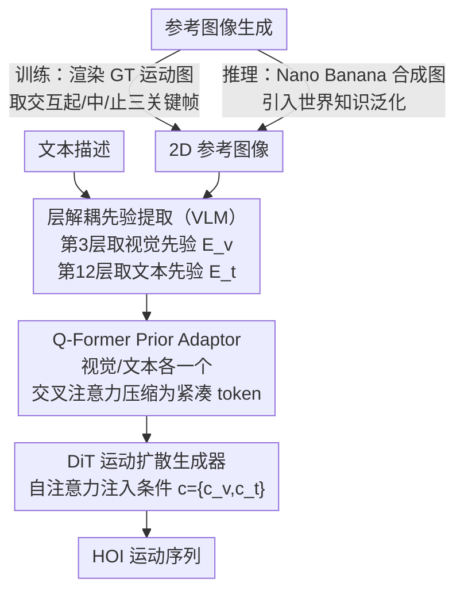

# ViHOI: Human-Object Interaction Synthesis with Visual Priors

**会议**: CVPR 2026  
**arXiv**: [2603.24383](https://arxiv.org/abs/2603.24383)  
**代码**: [https://github.com/MPI-Lab/ViHOI](https://github.com/MPI-Lab/ViHOI)  
**领域**: 图像生成 / 运动生成  
**关键词**: 人物交互生成, 视觉先验, 扩散模型, VLM, Q-Former

## 一句话总结

提出ViHOI，一个即插即用框架，利用VLM从2D参考图像中提取解耦的视觉和文本先验，通过Q-Former压缩为紧凑条件token来增强扩散模型的HOI运动生成质量，推理时借助文生图模型合成参考图像实现对未见物体的强泛化。

## 研究背景与动机

1. **领域现状**：3D人-物交互（HOI）运动生成旨在合成逼真、物理合理的人与物体交互序列，在VR、动画和机器人领域有重要应用。近年来扩散模型被广泛用于HOI生成任务。

2. **现有痛点**：现有方法的生成质量受限于条件信号质量。HOI过程涉及持续的空间状态变化和合理的交互关系，但数据集中的文本标注通常只提供抽象描述（如"拿起一个盒子"），缺乏关于物体形状、尺寸和人体姿态的几何空间先验，迫使模型面对复杂的"一对多"学习问题。

3. **核心矛盾**：现有增强方法分为语义增强（LLM扩展文本描述）和物理约束（接触点、运动学先验）两条路线。前者仍缺乏结构化知识来精确耦合运动与物体几何，后者往往只关注局部交互区域而忽视全身运动的全局动态和连贯性。

4. **本文目标** 如何有效利用易获取的2D图像中丰富的视觉交互先验（物体形状、尺度、人-物空间关系），来增强HOI运动生成的保真度和物理合理性。

5. **切入角度**：作者认为2D图像提供了一套丰富的视觉交互先验，包括物体形状、尺度和人-物空间关系。利用VLM同时提取图像和文本信息，可以天然保证两种模态的语义对齐。

6. **核心 idea**：用VLM从2D参考图像中解耦提取视觉和文本先验，通过Q-Former压缩后注入运动扩散模型，训练时用GT运动渲染图保证语义对齐，推理时用文生图模型合成参考图实现泛化。

## 方法详解

### 整体框架

ViHOI由两个核心组件构成：VLM-based Prior Extractor和Vision-aware HOI Generator。输入包括一组2D参考图像和文本描述，VLM（Qwen2.5-VL）从不同层分别提取视觉先验和文本先验，通过两个Q-Former-based Prior Adaptor压缩为紧凑token，然后作为条件注入基于DiT的运动扩散模型中，通过自注意力机制引导HOI运动合成。训练阶段使用GT运动渲染的图像，推理阶段使用文生图模型合成的参考图像。

### 关键设计

**1. 层解耦先验提取：让浅层管几何、深层管语义，各取所长**

文本标注只给"拿起一个盒子"这种抽象描述，缺的是物体形状、尺度和人-物空间关系这些几何线索——而这些恰恰藏在2D图像里。问题是怎么从VLM里把视觉和语义两种信息都干净地取出来。作者注意到VLM不同深度的层关注点不一样：浅层还保留着丰富的视觉细节，越往深走文本编码能力越强、视觉细节却被抽象掉了。于是他们不从同一层取所有信息，而是分层取：从Qwen2.5-VL的第3层取视觉先验 $E_v$（保住几何空间线索），从第12层取文本先验 $E_t$（捕获运动描述的语义）。配套设计了一段结构化prompt，明确引导VLM去看物体形状、尺寸、接触区域这些交互关键点，让提取出来的先验是任务感知的而非泛泛而谈。消融里把视觉层往深推（V12、V24）FID就明显变差，证实"浅层留细节"这个判断是对的——V3-T12在所有层组合里最优。

**2. Q-Former Prior Adaptor：把变长高维的VLM特征蒸成一个紧凑token**

VLM中间层吐出来的是高维、变长的token序列，直接塞进扩散模型当条件几乎没法用——又长又冗余。Q-Former干的就是压缩这件事：先用线性投影对齐维度 $Z_v = \text{LayerNorm}(\text{Linear}(E_v))$，再让一组可学习query $q_v$ 去和映射后的特征做两层交叉注意力，把分散在长序列里的有用信息抽进固定维度的紧凑token：

$$c_v = \text{CrossAttention}(q_v, Z_v, Z_v)$$

视觉和文本各配一个独立的Q-Former。关键在于交叉注意力能自适应地从冗余特征里挑出和HOI合成最相关的部分，而不是无差别地平均。这一步是不是真有用？消融里把它换成简单的平均池化，FID直接从0.68暴涨到26.03——压缩机制本身就是性能的命门，不能图省事。

**3. 参考图像生成：训练用渲染图保对齐，推理用文生图引世界知识**

视觉先验得有图像来源，但训练和推理拿图的方式天然不同，作者把它拆成两套。训练阶段直接从GT运动序列渲染2D图像，再借接触标签挑出交互的开始、中间、结束三个关键帧——这样视觉先验和要生成的目标运动严格对齐，而且成本低，不用额外去收集大规模的图像-运动配对数据。推理阶段没有GT可渲染，就改用文生图模型Nano Banana合成三张时序连贯的HOI参考图，借它内嵌的世界知识来覆盖训练没见过的物体。这里有个看似要命的隐患：训练是干净渲染图、推理是合成图，两者风格有差距。但实际上VLM先验提取器抓的是底层的运动相关特征而非表面风格，所以这道风格鸿沟没把泛化能力打垮，未见物体上FID反而大幅领先。

### 损失函数 / 训练策略

- 训练目标为标准的扩散模型重建损失：$\mathcal{L} = \mathbb{E}_{t,x_0}[\|x_0 - f_\theta(x_t, t, c)\|^2]$
- 训练时冻结VLM参数，仅联合训练两个Q-Former Prior Adaptor和HOI Generator
- 条件 $c = \{c_v, c_t\}$ 包含视觉和文本两个紧凑prior token

## 实验关键数据

### 主实验

| 数据集 | 指标 | CHOIS+ViHOI | CHOIS | 提升 |
|--------|------|------|----------|------|
| FullBodyManipulation | FID↓ | 0.68 | 0.77 | -11.7% |
| FullBodyManipulation | R-Precision Top-3↑ | 0.79 | 0.73 | +8.2% |
| FullBodyManipulation | MPJPE↓ | 14.97 | 15.43 | -3.0% |
| FullBodyManipulation | $C_{F_1}$↑ | 0.75 | 0.70 | +7.1% |
| BEHAVE | FID↓ | 2.02 | 4.99 | -59.5% |
| BEHAVE | MPJPE↓ | 14.58 | 15.42 | -5.4% |
| 未见物体 | FID↓ | 2.02 | 4.99 | -59.5% |

### 消融实验

| 配置 | R-Precision Top-3 | FID↓ | MPJPE↓ | 说明 |
|------|---------|------|------|------|
| ViHOI (完整, V3-T12) | 0.79 | 0.68 | 14.97 | 最优组合 |
| ViHOI-Pool (平均池化) | 0.32 | 26.03 | 22.62 | Q-Former→池化，性能暴跌 |
| ViHOI-CLIP (CLIP文本) | 0.75 | 0.69 | 17.57 | VLM文本→CLIP，性能下降 |
| T12-only (仅文本先验) | 0.72 | 1.28 | 17.49 | 无视觉先验，明显退化 |
| V12-T12 | 0.75 | 0.87 | 15.90 | 视觉层过深损失细节 |
| V24-T24 | 0.61 | 3.15 | 16.94 | 两层都太深效果差 |

### 关键发现

- Q-Former至关重要：替换为简单池化后FID从0.68暴涨至26.03，说明有效的先验压缩机制不可或缺
- 视觉先验显著优于仅文本先验：加入视觉先验后MPJPE从17.49降至14.97，证明2D图像中的几何空间信息对运动生成的重要性
- VLM文本先验优于CLIP：从VLM提取的文本embedding比CLIP更丰富，MPJPE从17.57降至14.97
- 在未见物体上泛化能力强：借助文生图模型的世界知识，ViHOI在未见物体和3D-FUTURE数据集上仍生成合理运动
- 即插即用特性：成功提升MDM、ROG、CHOIS三种不同基线模型的性能

## 亮点与洞察

- "图像作为运动先验"的范式非常优雅——利用易获取的2D图像提供3D运动生成所需的几何空间先验，避免了复杂的物理约束建模
- 训练/推理分离的参考图像策略巧妙地解决了数据瓶颈：训练时用渲染图保证对齐，推理时用文生图模型引入世界知识实现泛化
- Q-Former的使用将变长高维VLM特征压缩为固定维度token，是连接大型基础模型与下游任务的通用设计模式
- 即插即用设计使其可以直接增强任何现有的HOI运动扩散模型

## 局限与展望

- 作者承认的局限：使用的数据集缺乏精细的手部标注，无法准确生成详细的手指运动序列
- 依赖文生图模型的质量：推理时参考图像的合理性直接影响生成运动的质量
- 仅用三个关键帧可能不足以表达复杂的长时交互过程
- 未探索视频生成模型作为先验来源的可能性，视频比静态图像能提供更丰富的时序动态信息

## 相关工作与启发

- **vs SemGeoMo**: SemGeoMo用LLM增强文本+affordance map作为几何先验，在接触质量上表现良好但全身运动精度不足；ViHOI通过视觉先验同时改善接触质量和关节精度，更好地平衡局部精度与全局一致性
- **vs CHOIS**: CHOIS用稀疏物体路标点作为全局路径先验；ViHOI提供更丰富的视觉先验，FID和MPJPE全面优于CHOIS
- **vs 视频生成+3D恢复方法**: 这类方法依赖2D-3D姿态估计，存在抖动和时序不一致问题；ViHOI将视觉先验编码为紧凑token隐式引导生成，避免了显式姿态恢复

## 评分

- 新颖性: ⭐⭐⭐⭐ 图像作为运动先验的范式新颖，VLM层解耦提取策略有启发性
- 实验充分度: ⭐⭐⭐⭐ 两个数据集、三个基线模型、未见物体泛化和详细消融
- 写作质量: ⭐⭐⭐⭐ 逻辑清晰，方法介绍有层次
- 价值: ⭐⭐⭐⭐ 即插即用框架实用性强，范式创新可迁移

<!-- RELATED:START -->

## 相关论文

- [\[CVPR 2026\] OneHOI: Unifying Human-Object Interaction Generation and Editing](onehoi_unifying_human-object_interaction_generation_and_editing.md)
- [\[CVPR 2025\] HOI-IDiff: An Image-like Diffusion Method for Human-Object Interaction Detection](../../CVPR2025/image_generation/an_image-like_diffusion_method_for_human-object_interaction_detection.md)
- [\[CVPR 2026\] Object-WIPER: Training-Free Object and Associated Effect Removal in Videos](object-wiper_training-free_object_and_associated_effect_removal_in_videos.md)
- [\[ICCV 2025\] ScoreHOI: Physically Plausible Reconstruction of Human-Object Interaction via Score-Guided Diffusion](../../ICCV2025/image_generation/scorehoi_physically_plausible_reconstruction_of_human-object_interaction_via_sco.md)
- [\[CVPR 2026\] LaRP: Efficient Multi-View Inpainting with Latent Reprojection Priors](larp_efficient_multi-view_inpainting_with_latent_reprojection_priors.md)

<!-- RELATED:END -->
