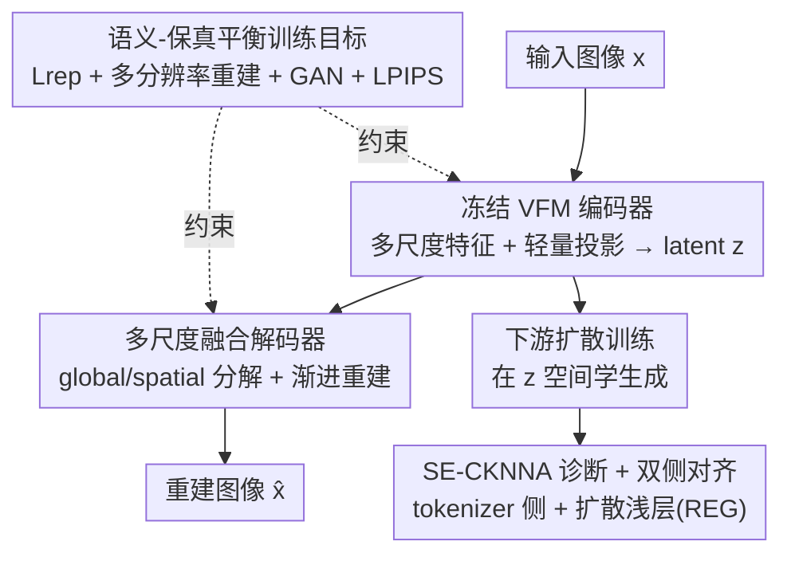

# Vision Foundation Models Can Be Good Tokenizers for Latent Diffusion Models

**会议**: CVPR 2026  
**论文**: [CVF Open Access](https://openaccess.thecvf.com/content/CVPR2026/html/Bi_Vision_Foundation_Models_Can_Be_Good_Tokenizers_for_Latent_Diffusion_CVPR_2026_paper.html)  
**领域**: 扩散模型 / 图像生成  
**关键词**: 潜扩散模型, 视觉基础模型, VAE tokenizer, 表征对齐, 高保真重建

## 一句话总结
这篇论文不再用蒸馏让 VAE 去"模仿"视觉基础模型（VFM），而是直接把**冻结的 VFM 当作 LDM tokenizer 的编码器**，配一个多尺度渐进式解码器把语义丰富但空间粗糙的 VFM 特征重建回像素，由此让 LightningDiT 在 ImageNet 256 上仅 80 epoch 就拿到 2.22 的 gFID（比此前 tokenizer 快约 10×），640 epoch 进一步到 1.62。

## 研究背景与动机
**领域现状**：潜扩散模型（LDM）是当前视觉生成的主流范式，它分两段走——先训一个视觉 tokenizer（通常是 VAE）把像素图压成紧凑 latent，再在这个 latent 空间里学扩散过程。tokenizer 产出的 latent 质量，几乎决定了下游扩散训练的天花板。近两年的一条热门思路是把视觉基础模型（VFM，如 DINOv2、SigLIP2）的语义注入 tokenizer：VA-VAE 用相似度损失把 VAE latent 对齐到 DINOv2 特征，REPA-E 则把 VAE 和扩散模型联合训练来实现对齐。

**现有痛点**：作者用 CKNNA（衡量两个表征空间局部近邻结构保持度的指标）做了一组诊断，发现**所有这些基于蒸馏/对齐的 tokenizer 都存在表征退化**——它们在干净图上 CKNNA 分数很高，但只要施加"保语义"的扰动（加噪、缩放、旋转），CKNNA 就大幅崩塌。比如 VA-VAE 在扰动下 CKNNA 相对掉了 33.2%。这说明蒸馏过程丢掉了 VFM 原本鲁棒表征里的关键信息，对齐只是"表面像"。

**核心矛盾**：要语义鲁棒，最好别动 VFM；可 VFM 是为语义理解优化的，特征图空间分辨率粗、通道分布高度各向异性，直接拿去做像素级重建会和保真度打架。也就是说，**"保住 VFM 语义"和"重建出清晰像素"之间存在结构性张力**——这正是以往大家选择"重训一个 VAE 去蒸馏"而非"直接用 VFM"的原因。

**本文目标**：跳过蒸馏，直接用冻结 VFM 当编码器，同时仍能高保真重建；并且把"tokenizer 表征质量如何影响扩散内部表征学习"这件事讲清楚。

**核心 idea**：与其训一个 VAE 去模仿 VFM，不如**直接把冻结 VFM 接进 VAE 框架当编码器，再为它专门设计一个像素解码器**，让 latent 天生继承 VFM 的鲁棒语义，而不是事后对齐。

## 方法详解

### 整体框架
VFM-VAE 的骨架仍是一个 VAE：编码器把图像压成低维 latent $z$，解码器把 $z$ 还原成图像，$z$ 同时作为下游扩散模型的训练空间。关键改动有两处——**编码器不再训练，而是直接复用一个冻结的预训练 VFM**（只在它后面挂一个轻量投影头把多尺度特征压成对角高斯后验）；**解码器被重新设计**，用多尺度潜在融合 + 渐进式重建块，专门解决"从语义强但细节弱的 VFM 特征里重建清晰像素"这个难题。训练时用一组组合损失同时约束语义保持与像素保真。除此之外，作者还提出诊断指标 SE-CKNNA，并据此设计了 tokenizer 侧（VFM-VAE）与扩散侧（REG 浅层对齐）的"双侧对齐"策略。

### 关键设计

**1. 冻结 VFM 编码器：用"直接继承"取代"蒸馏模仿"**

直接拿一个预训练 VFM $\Phi$ 当编码器并**全程冻结**，是为了根治蒸馏带来的表征退化——既然 VFM 的语义本就鲁棒，那就别再训一个 VAE 去近似它、丢掉细节。但只取最后一层特征不够：重建需要的细粒度信息往往藏在浅层。于是作者从 VFM 不同深度抽多尺度特征 $\{\mathbf{f}_{\text{shallow}}, \mathbf{f}_{\text{middle}}, \mathbf{f}_{\text{final}}\} = \Phi(\mathbf{x})$，沿通道拼接后过一个轻量投影网络 $\mathcal{C}$ 输出对角高斯后验的均值与对数方差 $\boldsymbol{\mu}, \log\boldsymbol{\sigma}^2 = \mathcal{C}(\text{Concat}[\mathbf{f}_{\text{shallow}}, \mathbf{f}_{\text{middle}}, \mathbf{f}_{\text{final}}])$，再用重参数化得到 $z$。投影既把维度压到适合扩散学习，又通过后面的表征重建损失保证 $z$ 不丢 VFM 的本质信息。效果上，这个设计让 latent 在扰动下的 SE-CKNNA 与 CKNNA 只差 +1.6%，而 VA-VAE 掉 33.2%——语义鲁棒性是"继承"来的，不是"对齐"来的。

**2. 多尺度融合解码器：从语义强、细节弱的特征里重建清晰像素**

冻结 VFM 给的特征语义丰富但空间粗糙，标准 SD-VAE 解码器（单 latent → 单图）很难还原细节。解码器做了两件事。第一，**多尺度潜在融合**：把 $z$ 拆成一个全局分量 $z_g = \text{GlobalPool}(z)$（捕获整体风格、与空间布局无关）和一组不同尺度的空间分量 $\{z_s^{(i)}\}$（用 pixel shuffle/unshuffle 重排得到）。第二，**渐进式重建块**：解码沿分辨率 $8\!\to\!16\!\to\!32\!\to\!64\!\to\!128\!\to\!256$ 逐级上采样，每块 $\mathcal{B}_i$ 都是 **Modulated ConvNeXt block**——全局风格 $z_g$ 经块专属仿射 $\gamma_i$ 调制到 $1{\times}1$ point-wise 卷积上做通道加权，公式为 $\mathcal{B}_i(\mathbf{h}_{\text{in}}, z_g) = \text{ModConv}(\mathbf{h}_{\text{in}}, \gamma_i(z_g)) + \mathbf{h}_{\text{in}}$。其中全局控制 $z_g$ 供给**每一块**保证全程风格一致，而空间分量只注入低分辨率早期块（$i\le4$）先定布局，把高分辨率块（$5\le i\le6$）解放出来专攻纹理细节（实验发现高分辨率注入有效通道不足、只增算力不涨点）。每块还挂一个轻量 ToRGB 头做该尺度的直接监督，并带特征级残差让细尺度的监督能继承粗尺度结构：

$$\hat{\mathbf{x}}_i = \begin{cases} \text{ToRGB}_i(\mathbf{h}^{(1)}, z_g) & i=1 \\ \text{ToRGB}_i(\mathbf{h}^{(i)} + \text{Upsample}(\mathbf{h}^{(i-1)}), z_g) & i>1 \end{cases}$$

这种"全局风格 + 渐进局部细化 + 每级监督"的结构，正是把粗特征稳定地撑成高保真图像的关键。

**3. 语义-保真平衡的训练目标：同时管住"latent 别丢语义"和"图像要真"**

总损失 $L_{\text{total}} = \lambda_{\text{rep}}L_{\text{rep}} + \sum_i \lambda_i L_{\text{recon}}^{(i)} + \lambda_{\text{GAN}}L_{\text{GAN}} + \lambda_{\text{LPIPS}}L_{\text{LPIPS}}$ 是为了化解前面那个"语义 vs 保真"的张力。表征正则 $L_{\text{rep}} = L_{\text{KL}} + L_{\text{VF}}$ 一边用 KL 约束 latent 分布、一边用 VF 损失（余弦相似 + 矩阵距离）强制 $z$ 与 $\mathbf{f}_{\text{final}}$ 语义对齐而不过度压缩其容量；**多分辨率重建损失**对每块输出都加 L1 监督 $L_{\text{recon}}^{(i)} = \|f_{r_i}(\mathbf{x}) - \hat{\mathbf{x}}_i\|_1$（$f_{r_i}$ 把真值下采到对应分辨率），这步对防止早期模式崩塌、让每一级各司其职至关重要；再加 DINOv2 判别器的对抗损失和 LPIPS 感知损失提升真实感。多分辨率监督是这套目标里最不显眼但最关键的稳定器。

**4. SE-CKNNA 与双侧对齐：把"对齐鲁棒性"量化并贯通到扩散内部**

普通 CKNNA 在干净图上分数虚高、抓不住扰动下的脆性，作者把它扩展成 **Semantic-Equivariant CKNNA（SE-CKNNA）**：在一组保语义变换分布 $\mathcal{T}$（加噪 {0.05,0.10,0.15,0.20}、缩放 {0.25,0.50,0.75,1.0}、旋转 {0°,90°,180°,270°}）上做蒙特卡洛平均 $\text{SE-CKNNA} = \frac{1}{|\mathcal{T}|}\sum_{T\in\mathcal{T}}\text{CKNNA}(T)$，从而可靠地衡量对齐稳定性。基于此，作者发现两条规律：高质量 tokenizer 表征会促进扩散模型各层的表征学习；而扩散侧只能改善深层对齐、浅层仍弱。于是提出**双侧对齐**——tokenizer 侧用 VFM-VAE 打底，扩散侧叠加 REG（用 VFM patch 特征对齐浅层、用 class token 注入全局语义），两侧协同后各层 CKNNA 一致变高，最终把生成质量推到新高度（80 epoch 拿到 2.22 gFID）。

### 损失函数 / 训练策略
训练在 ImageNet 256×256 上进行，采用与 VA-VAE 一致的 f16d32 配置；默认 VFM 用 SigLIP2-Large。损失即上文 $L_{\text{total}}$，组合 KL + VF 表征正则、多分辨率 L1 重建、对抗（DINOv2 判别器）、LPIPS 四类。下游扩散用两套设置：LightningDiT-XL（对标 VA-VAE）和 REG（SiT-XL 骨干 + 额外浅层对齐损失）。

## 实验关键数据

### 主实验
重建 + 生成 + 表征三维度对比（ImageNet 256，gFID 均为 w/o CFG）：

| Tokenizer | #Images | rFID↓ | Epochs | gFID↓ | Top-1 Acc.↑ | CKNNA | SE-CKNNA | 相对变化 |
|-----------|---------|-------|--------|-------|-------------|-------|----------|----------|
| SD-VAE | 108M | 0.62 | 80 | 7.13 | 8.0 | 0.004 | 0.005 | — |
| VA-VAE | 160M | 0.30 | 64 | 5.14 | 31.9 | 0.202 | 0.135 | −33.2% |
| **VFM-VAE** | **44M** | 0.52 | 64 | **3.80** | **43.2** | 0.188 | 0.191 | **+1.6%** |

系统级生成对比（部分代表项，ImageNet 256，gFID 列为 w/o CFG）：

| Tokenizer + 生成模型 | Epochs | gFID↓ | gIS↑ |
|----------------------|--------|-------|------|
| SD-VAE + REG | 480 | 2.20 | 219.1 |
| VA-VAE + LightningDiT | 800 | 2.17 | 205.6 |
| **VFM-VAE + LightningDiT** | 560 | 2.06 | 205.8 |
| **VFM-VAE + REG** | 80 | **2.22** | 218.8 |
| **VFM-VAE + REG** | 640 | **1.62** | 241.6 |

VFM-VAE + REG 在 80 epoch 就达到 2.22 gFID，几乎追平 480-epoch 的 SD-VAE+REG，约 10× 加速；640 epoch 进一步到 1.62（w/CFG 1.31）。

### 消融实验
模块逐步叠加对重建的影响（5M 图弱对齐，Table 5）：

| 配置 | rFID↓ | rIS↑ | 说明 |
|------|-------|------|------|
| SD-VAE 风格基线 | 19.69 | 74.9 | 仅卷积编/解码 + 基础损失 |
| + 多尺度潜在融合 | 14.35 | 93.6 | 加空间控制，rFID 降约 27% |
| + 现代解码块 | 1.08 | 194.6 | Modulated ConvNeXt + 自注意力，断崖式提升 |
| + 编码器改进 | **0.71** | **206.8** | 聚合多层 VFM 特征 + 升级骨干 |

不同 VFM 兼容性（Table 6，LightningDiT-L/1 @100k steps，w/o CFG）：

| VFM | rFID↓ | gFID↓ | gIS↑ |
|-----|-------|-------|------|
| EVA-CLIP-Large | 1.35 | 4.40 | 146.4 |
| DINOv2-Large | 1.55 | 4.00 | 147.1 |
| SigLIP2-Large | 1.61 | 5.59 | 127.8 |

### 关键发现
- **"现代解码块"是重建质量的最大单点贡献**：从多尺度融合的 rFID 14.35 一步降到 1.08，说明把上采样块换成 Modulated ConvNeXt + 低分辨率自注意力，才是把粗 VFM 特征撑成清晰像素的关键。
- **冻结 VFM 换来鲁棒性几乎零成本**：VFM-VAE 只用 44M 训练图（VA-VAE 用 160M 的约 27%），SE-CKNNA 与 CKNNA 仅差 +1.6%，且 linear probing 从 31.9% 提到 43.2%——语义鲁棒是继承来的。
- **双侧对齐有协同效应**：tokenizer 侧 + 扩散浅层（REG）一起对齐，各深度 CKNNA 才一致变高；扩散侧峰值 CKNNA 达 0.52，超过 SigLIP2-Large 与 DINOv2-Giant 之间 0.50 的参考线。
- **泛化到 512 分辨率与文生图**：ImageNet-512 上 VFM-VAE 把 gFID 从 21.42 降到 18.05；接 BLIP3-o 做文生图，DPG-Bench 从 55.4 升到 59.1、MJHQ-30K gFID 从 23.0 降到 17.0。

## 亮点与洞察
- **"别蒸馏，直接冻结复用"这个反直觉决定是全文的灵魂**：业界默认 VFM 不能直接重建，所以都去训 VAE 模仿它；本文用 CKNNA 诊断证明"模仿"本身就在丢信息，于是把难题从"怎么对齐得更好"转成"怎么给冻结 VFM 配个好解码器"，问题立刻变简单。
- **SE-CKNNA 是个可复用的诊断工具**：把"保语义扰动下的对齐稳定性"量化出来，戳破了"干净图 CKNNA 高 = 表征好"的假象，可直接拿去评估任何表征对齐方法的脆性。
- **解码器里"全局风格供全程、空间细节只喂早期块"的分工**很巧妙，且有实证支撑（高分辨率注入有效通道不足），这个"早定布局、晚抠细节"的层次化思路可迁移到其他生成式解码器设计。
- **训练效率收益实打实**：10× 收敛加速来自更优 latent，而非更大模型，对算力受限的生成训练很有吸引力。

## 局限与展望
- 作者承认：复用冻结 VFM 会**牺牲部分高频保真度**（rFID 0.52 不如 VA-VAE 的 0.30），这是语义优先的代价；从消融看下游 gFID 反而更好，但纯重建指标确实有损。
- 继承了前作（REG 等）的复杂训练目标，**多损失项调参成本高**，落地不轻松。
- SE-CKNNA 的分数是**相对于所选对齐 VFM 的**，跨 VFM 的绝对数值不可直接比大小，作为横向标尺时要带 caveat。
- 个人观察：实验集中在 ImageNet 与有限文生图设置，对更高分辨率、长尾/真实复杂场景的重建保真还需验证；冻结 VFM 也意味着 tokenizer 能力被上游 VFM 的质量与偏置锁死。

## 相关工作与启发
- **vs VA-VAE / REPA-E（蒸馏式 tokenizer）**: 它们训 VAE 去对齐/模仿 VFM 特征，本文直接冻结复用 VFM 当编码器；区别在于前者"事后对齐"会在保语义扰动下退化（CKNNA 掉 33.2%），本文"天生继承"几乎不退化（+1.6%），且只用约 27% 训练数据。
- **vs REPA / REG（扩散侧表征对齐）**: 它们假设 tokenizer 已提供稳定语义 latent，只在扩散内部对齐 VFM；本文反过来研究 tokenizer latent 如何影响扩散表征演化，并把两侧对齐合成"双侧对齐"策略——REG 在本文中作为扩散侧补充，二者协同而非替代。
- **vs RAE / SVG（并发工作，直接用高维 VFM 特征）**: 它们不做潜空间压缩，本文坚持 LDM 的 latent 压缩，从而**无缝兼容现有扩散框架**，更易接入既有 pipeline。

## 评分
- 新颖性: ⭐⭐⭐⭐⭐ "冻结 VFM 直接当 tokenizer 编码器 + SE-CKNNA 诊断"是对蒸馏范式的反向重构，视角新颖且有诊断证据支撑
- 实验充分度: ⭐⭐⭐⭐ 覆盖重建/生成/表征三维度、多 VFM 兼容、512 与文生图泛化、逐模块消融完整，仅高频保真指标略弱
- 写作质量: ⭐⭐⭐⭐ 动机由 CKNNA 诊断一路推导，逻辑清晰；部分细节（block 公式、reshape）压进附录
- 价值: ⭐⭐⭐⭐⭐ 10× 收敛加速 + 更鲁棒 latent，对 LDM tokenizer 设计有直接实用价值和方法论启发

<!-- RELATED:START -->

## 相关论文

- [\[CVPR 2026\] VFM-VAE: Vision Foundation Models Can Be Good Tokenizers for Latent Diffusion Models](vfm-vae_vision_foundation_models_can_be_good_tokenizers_for_latent_diffusion_mod.md)
- [\[CVPR 2026\] Probing and Bridging Geometry–Interaction Cues for Affordance Reasoning in Vision Foundation Models](probing_and_bridging_geometry-interaction_cues_for_affordance_reasoning_in_visio.md)
- [\[CVPR 2026\] Taming Sampling Perturbations with Variance Expansion Loss for Latent Diffusion Models](taming_sampling_perturbations_with_variance_expansion_loss_for_latent_diffusion_.md)
- [\[CVPR 2026\] OpenDPR: Open-Vocabulary Change Detection via Vision-Centric Diffusion-Guided Prototype Retrieval for Remote Sensing Imagery](opendpr_open-vocabulary_change_detection_via_vision-centric_diffusion-guided_pro.md)
- [\[CVPR 2026\] VibeToken: Scaling 1D Image Tokenizers and Autoregressive Models for Dynamic Resolution Generations](vibetoken_scaling_1d_image_tokenizers_and_autoregressive_models_for_dynamic_reso.md)

<!-- RELATED:END -->
