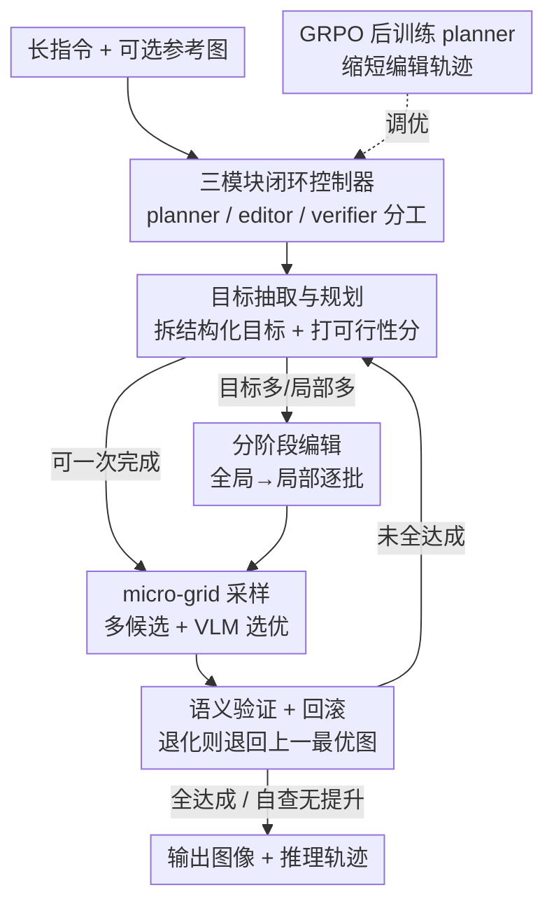

# VisionDirector: Vision-Language Guided Closed-Loop Refinement for Generative Image Synthesis

**会议**: CVPR 2026  
**论文**: [CVF Open Access](https://openaccess.thecvf.com/content/CVPR2026/html/Chu_VisionDirector_Vision-Language_Guided_Closed-Loop_Refinement_for_Generative_Image_Synthesis_CVPR_2026_paper.html)  
**领域**: 图像生成  
**关键词**: 闭环精化, VLM 智能体, 长指令对齐, GRPO, 图像编辑

## 一句话总结
针对扩散模型在「一条指令塞 18~22 个目标」的专业设计任务上频繁漏改的痛点，本文先造了 LGBench（2000 任务、29k 个标注目标）把失败暴露出来，再提出 VisionDirector——一个无需训练的「导演式」闭环控制器：用 VLM planner 把长指令拆成结构化目标、动态决定一次生成还是分阶段编辑、每步做 micro-grid 采样 + 语义验证回滚，最后用 GRPO 把 planner 的编辑轨迹从 4.2 步压到 3.1 步，在 GenEval（+7%）和 ImgEdit（+0.07）上刷到新 SOTA。

## 研究背景与动机
**领域现状**：扩散模型（Flux、Qwen-Image 等）已经能生成照片级图像，单目标指令（"画一只猫"）处理得很好，美学质量也高。

**现有痛点**：真实的设计 brief 不是一句话，而是一大段：全局艺术指导 + 一堆局部约束（人物姿态、光照、排版文字、logo 位置），动辄十几二十个相互耦合的目标。作者实测发现，即便是最强的开源模型，在这种长指令上也只能满足不到 72% 的目标，而且系统性地漏掉局部文字、logo、光照这类「精细但关键」的编辑——Flux-Dev 在文字目标上的成功率甚至只有 0.8%。

**核心矛盾**：现有 benchmark（DrawBench、TIFA、MagicBrush）几乎都只测 1~2 个显式目标，把模型在多目标场景下的脆弱性「藏」了起来；同时，扩散模型本质是一次前向把所有约束一起渲染，没有「检查—回退—再改」的机制，一旦某个局部目标没达成，没有任何手段补救。

**本文目标**：(1) 造一个能真实暴露长指令失败的基准；(2) 在不重训扩散骨干的前提下，让模型把十几个目标逐一啃下来，同时保住美学质量。

**切入角度**：作者把问题重新定义为「语义理解 vs 像素渲染」的职责分离——扩散模型负责画得好看，但读不懂复杂语义；那就在它上面架一层 VLM「导演」专门做规划、验证、回退，扩散骨干退化为无状态执行器。

**核心 idea**：用一个 training-free 的 VLM 闭环控制器，把「长指令 → 拆目标 → 分阶段编辑 → 验证回滚」串成 R1 式的推理循环，再用 GRPO 微调 planner 让它学会更早地 STOP / VERIFY / EDIT。

## 方法详解

### 整体框架
VisionDirector 把生成/编辑从「一次性出图」改造成「导演带着剧组反复打磨」的闭环。系统有三个通过自然语言通信的模块：**planner VLM**（Qwen3-VL-8B，拥有语义主导权，负责拆目标、排顺序、监督修订直到收敛）、**editors**（Qwen-Image / Qwen-Image-Edit，无状态执行器，只听 planner 的指令出图）、**verifier VLM**（Qwen3-VL-32B，给每个目标打达成/未达成并决定何时停）。因为模块间只传自然语言消息，任何一个都能换更强的版本而不必重训 planner。

训练-free 阶段的控制流是一条受 DeepSeek-R1 推理启发、但专门为视觉生成定制的八步确定性循环：指令进入 → planner 逐字抽取目标并打 type/conflict/可一次完成度评分 → 判断走「一次生成」还是「分阶段编辑」→ 对每个 batch 做 micro-grid 多候选采样 + VLM 选优 → verifier 验证并在退化时回滚 → 决策是否继续（局部改用 inpainting、全局不达标就场景级重生成）→ 循环到无进一步改进，最终连同完整推理轨迹（目标、编辑、判定）一起返回。

### 关键设计

**1. LGBench：用「长目标链」把现有基准测不出的失败逼出来**

现有基准每条 prompt 最多 1~2 个目标，模型即便漏掉一堆局部约束，单一分数也看不出来——这正是「模型看起来很强、真上设计任务就崩」的根源。LGBench 直接把任务复杂度拉满：2000 个任务（1000 T2I + 1000 I2I），共 29,252 个逐目标标注，T2I 平均每条 18.0 个目标（覆盖 200 类 / 418 子类），I2I 平均 11.2 个编辑指令。构造上用 Claude 4.5 Sonnet 当「prompt 作曲家」：读结构化目标清单、推理目标间依赖、合成带定量线索（如"at moderate intensity (45%)"）且无矛盾的长指令；I2I 则让 Claude 看着 Flux-Krea 生成的真实底图，针对显著区域（人脸、光照、文字叠层）写 10~22 条空间语义一致的编辑指令。评测端用 Qwen3-VL-32B 当多模态 verifier，把长指令转成结构化指令逐目标推理打分，置信度低于 0.81 的判定被过滤；一个任务里 ≥80% 目标达成才算 success，0~80% 算 partial，全挂算 failure，并按目标类型算 per-goal 通过率来诊断「哪个视觉维度先崩」。结果显示连 Qwen-Image 也只有 71.8% finish、Flux-Kontext 仅 55.9%，且文字/logo/光照是公认重灾区——这套诊断直接驱动了后面 director 的设计。

**2. 三模块闭环控制器：把「语义理解」从「像素渲染」里剥出来**

扩散模型的本质缺陷是「一次前向渲染所有约束、没有反悔机制」，所以漏改无法补救。VisionDirector 的破法是职责分离：planner 独占语义——把用户指令逐字拆成结构化目标，每个目标标 type（global / local / text / layout）、conflict flag、以及一个估计「能否一次完成」的标量分 $s$，全部存进 pending 列表，completed 集初始为空。然后做关键的**一次 vs 分阶段**门控：若 $s$ 高且影响区域小，就直接整图合成；否则按「全局 → 局部」顺序、每批 1~2 个目标地排程，保证每次编辑聚焦不打架。editor 是无状态执行器只管出图，verifier 给目标级反馈并发停止信号。这种「强扩散先验 + 轻量推理 agent」的解耦，让系统在保住美学质量的同时获得可调试的完整日志，且任一模块可热替换。Figure 6 的分析印证了门控的自适应性：≤15 个目标时 >85% 走一次生成（1~3 轮搞定），超过 15 个目标后一次生成偏好骤降到 30 个目标时的 <10%，自动切到分阶段执行。

**3. micro-grid 采样 + 语义验证回滚：对抗扩散随机性与编辑回退**

即便分了阶段，扩散采样本身的随机性仍会让某次编辑时好时坏，且多轮编辑容易累积幻觉、越改越差。本文为每个活跃 batch 设两道闸：**micro-grid 采样**——planner 发一句精确指令（如"抬高英雄左脸颊的主光"），用不同随机种子生成多个候选，再让轻量 VLM judge 选最优，以小延迟代价压住扩散随机性（消融显示去掉它后排版类指令的随机失败率涨 7%）；**语义验证回滚**——verifier 逐目标核对 pending 列表，若新编辑反而拉低了整体对齐度，系统直接退回上一张最优图并重排剩余目标，避免反复在同一冲突上栽跟头（消融显示去掉回滚后会累积幻觉、goal coverage 跌到 0.74）。这两道闸把「盲目向前编辑」换成「带验证的爬山」，是闭环相对一次性 prompting 的核心增益来源。

**4. GRPO 后训练 planner：把多轮试错压成更短的高收益轨迹**

training-free 控制器虽然有效，但仍需多轮编辑才收敛，浪费扩散调用。作者用 GRPO 后训练 planner，让它在上千条长目标 rollout 里学会更早判断何时 STOP / VERIFY / EDIT。设 $x$ 为多模态 prompt、$y=(y_1,\dots,y_T)$ 为 planner 交错的 Describe–Inspect–Revise 动作，训练目标是 PPO 的 GRPO 变体：

$$J_{\text{GRPO}}(\theta)=\mathbb{E}_{x,\{y^{(i)}\}}\!\left[\frac{1}{G}\sum_{i=1}^{G}\frac{1}{\sum_t I(y^{(i)}_t)}\sum_t I(y^{(i)}_t)\,\mathcal{L}_{\text{clip}}\!\big(\rho^{(i)}_t,\hat{A}^{(i)}_t\big)-\beta\,\mathrm{KL}\big(\pi_\theta\,\|\,\pi_{\text{ref}}\big)\right]$$

其中 $I(\cdot)$ 是 token 掩码，把来自外部工具（editor/verifier）的 token 屏蔽掉，使梯度只更新 planner 自己的文本动作；$\hat{A}^{(i)}_t$ 是用组内平均奖励当 baseline 的组归一化优势，$\beta$ 控制对参考策略的 KL 正则。奖励来自一个独立的 alignment VLM，按 0~5 分给最终图打分（覆盖排版、光照、空间布局），组内归一化后更新策略。效果是把中位编辑轮数从 4.2 压到 3.1（约 26% 提速）、且验证准确率不降——优化后的策略倾向于更早抛出高收益编辑、只剩边角目标时果断终止，正好补强了 training-free 流程。

## 实验关键数据

### 主实验

GenEval（T2I 组合保真度，VisionDirector 用 Qwen-Image 骨干 + GRPO planner）：

| 模型 | Counting | Position | Attribute | Overall↑ |
|------|---------|---------|-----------|----------|
| FLUX.1 [Dev] | 0.74 | 0.22 | 0.45 | 0.66 |
| Qwen-Image | 0.89 | 0.76 | 0.77 | 0.87 |
| **VisionDirector** | **0.96** | **0.88** | **0.95** | **0.94** |

ImgEdit（I2I 编辑，GPT-4.1 当裁判，1~5 分）：

| 模型 | Replace | Remove | Hybrid | Overall↑ |
|------|---------|--------|--------|----------|
| FLUX.1 Kontext [Pro] | 4.56 | 3.57 | 3.68 | 4.00 |
| Qwen-Image-Edit | 4.66 | 4.14 | 3.82 | 4.27 |
| **VisionDirector** | **4.83** | **4.41** | **4.05** | **4.35** |

关键提升集中在 attribute binding、相对位置推理（GenEval Position 0.76→0.88）这些「需要逐目标核对」的维度，正对应 LGBench 暴露出的弱项。

### 消融实验

GRPO 对规划效率的影响（LGBench）：

| Planner | Steps↓ | Goal cov.↑ | Edits/task↓ |
|---------|--------|-----------|-------------|
| VisionDirector (no RL) | 4.2 | 0.74 | 3.3 |
| VisionDirector + GRPO | 3.1 | 0.78 | 2.5 |

不同优化策略叠加（基线 Flux-Krea，单位 %）：

| 方法 | Goal 成功率 | ≥80% 任务占比 | 说明 |
|------|-----------|--------------|------|
| Baseline (Flux-Krea) | 66.8 | 18.6 | 一次性 prompt |
| + Reprompting | 69.0 | 22.7 | 仅重写提示 |
| + Best-of-N (N=4) | 70.5 | 23.1 | 仅多候选选优 |
| + Refinement | 71.2 | 29.5 | 仅迭代精化 |
| **All Strategies** | **74.2** | **35.2** | 全组合 |

### 关键发现
- **回滚是「越改越烂」的保险丝**：去掉语义回滚后幻觉累积、goal coverage 从 0.78 跌到 0.74；去掉 micro-grid 采样则排版类指令随机失败率涨 7%——两道闸各自防住一类失败。
- **GRPO 的价值是「省」而非「多」**：它把轨迹缩短 26%、每任务扩散调用从 3.3 降到 2.5，同时 goal coverage 还小涨，说明学到的是「更早出高收益编辑 + 果断终止」而非单纯多改几轮。
- **自适应门控有清晰相变**：≤15 目标时 >85% 走一次生成，30 目标时骤降到 <10%，存在一个「高效区」临界点，证明 planner 真的在按复杂度切换策略而非一刀切。
- **策略叠加非线性**：单独加 Reprompting / Best-of-N / Refinement 各只涨 2~5 个点，但全组合能到 74.2%，说明闭环的增益来自多机制协同。

## 亮点与洞察
- **「先造尺子再造解法」的范式**：LGBench 不是配角，它先用 per-goal 诊断证明「现有模型不是画不好、是读不懂长指令」，这个结论直接定义了 VisionDirector 的职责分离设计——基准与方法形成因果闭环，比单纯刷分有说服力。
- **职责分离让扩散骨干「零成本升级」**：planner 只发自然语言指令，editor/verifier 都能热替换而不重训 planner，这把「换更强的生成器」从「重新训练整个 agent」降级成「改一行配置」，工程价值很高。
- **GRPO 的 token 掩码很关键**：用 $I(\cdot)$ 屏蔽外部工具产生的 token，只对 planner 自己的决策 token 求梯度，避免把 editor/verifier 的输出误当成策略动作去优化——这是把 RL 用在「带外部工具的 agent」上的一个干净做法，可迁移到其他工具调用 agent。
- **micro-grid + 回滚 = 带验证的爬山**：把扩散的「一次性赌一把」改成「多候选选优 + 退化即回退」，本质是给随机生成加了单调性保证，这个思路可迁移到任何「单步不可靠、但可验证」的生成任务。

## 局限与展望
- **重度依赖外部 VLM 的判断**：目标抽取、候选选优、达成验证、奖励打分全靠 Qwen3-VL / GPT-4.1，verifier 的盲区（如细微排版、文化语义）会直接变成系统盲区，且这些大 VLM 的多轮调用成本不低——论文宣称「省 token」是相对多轮人工 prompt，绝对开销其实不小。
- **闭环上限是 6 轮**：复杂任务（>20 目标）可能根本压不进 6 轮预算，论文没充分讨论超预算时的降级行为。
- **基准本身由 LLM 合成**：LGBench 的 prompt 和 I2I 编辑指令都由 Claude 生成、Qwen-VL 验证，存在「出题人和阅卷人都是 LLM」的潜在循环，目标的真实设计合理性缺少人工核验比例。
- **横向比较需谨慎**：GenEval/ImgEdit 上 VisionDirector 多轮编辑对比对手的一次出图，轮次预算不同，提升幅度不能简单等同于「模型更强」。
- 作者展望视频/3D 基准、更对齐人类的 verifier、human-in-the-loop 编辑。

## 相关工作与启发
- **vs 一次性 prompting 扩散（Flux / Qwen-Image）**: 它们一次前向渲染所有约束、无反悔机制；本文保留这些强 editor 不动，在上面架一层 planner 做拆解 + 迭代监控，区别在于把「语义」和「渲染」解耦，优势是多目标保真度高、可调试，劣势是多轮调用成本和延迟更高。
- **vs GenEval / DPG / ImgEdit 等基准**: 它们每条最多 1~2 目标、无逐目标标注；LGBench 提供双模态、29k 标注目标、结构化 verifier 输出，专门暴露长指令失败。
- **vs GenArtist / JarvisArt 等图像 agent**: 它们偏重理解、推理或工具调用；VisionDirector 聚焦「长视野多目标视觉创作」，用拆解—监控—迭代精化把 agent 范式落到可控可靠的生成/编辑上。
- **vs 普通 RLHF / PPO 微调生成模型**: 本文不微调扩散骨干，只用 GRPO + token 掩码微调 planner 的决策策略，把 RL 加在「编辑轨迹规划」而非「像素生成」上，训练成本和稳定性都更友好。

## 评分
- 新颖性: ⭐⭐⭐⭐ 「基准暴露问题→导演式闭环→GRPO 提效」这条链条完整且自洽，闭环 + 验证回滚 + token 掩码 GRPO 的组合有新意，但单个组件多为已有技术的巧妙拼装。
- 实验充分度: ⭐⭐⭐⭐ GenEval/ImgEdit 双基准 + 多组消融 + 自适应门控相变分析都齐，但部分细节（迭代数/置信阈值消融）推到附录，绝对开销未充分披露。
- 写作质量: ⭐⭐⭐⭐ 动机—方法—实验逻辑清晰，八步流程和职责分离讲得明白，个别公式排版（GRPO 目标）在缓存里略糊。
- 价值: ⭐⭐⭐⭐ LGBench 作为长指令诊断基准 + training-free 即插即用的闭环控制器，对真实设计场景和数据集自动构造都有直接落地价值。

<!-- RELATED:START -->

## 相关论文

- [\[CVPR 2026\] SynthRGB-T: Language-Vision Guided Image Translation for Diversity Synthesis](synthrgb-t_language-vision_guided_image_translation_for_diversity_synthesis.md)
- [\[CVPR 2026\] Language-Free Generative Editing from One Visual Example](language-free_generative_editing_from_one_visual_example.md)
- [\[CVPR 2026\] VOSR: A Vision-Only Generative Model for Image Super-Resolution](vosr_a_vision_only_generative_model_for_image_super_resolution.md)
- [\[CVPR 2026\] Closed-Form Concept Erasure via Double Projections](closed-form_concept_erasure_via_double_projections.md)
- [\[CVPR 2026\] Leveraging Verifier-Based Reinforcement Learning in Image Editing](leveraging_verifier-based_reinforcement_learning_in_image_editing.md)

<!-- RELATED:END -->
