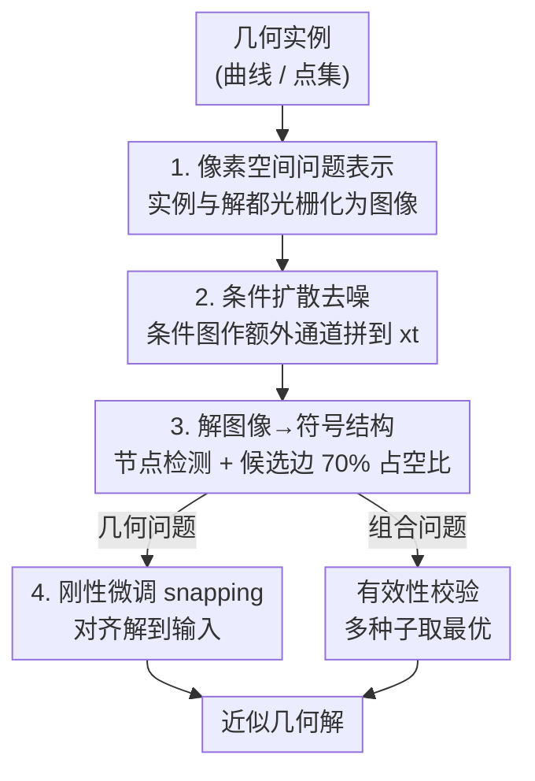

# Visual Diffusion Models are Geometric Solvers

**会议**: CVPR 2026  
**论文**: [CVF Open Access](https://openaccess.thecvf.com/content/CVPR2026/html/Goren_Visual_Diffusion_Models_are_Geometric_Solvers_CVPR_2026_paper.html)  
**代码**: 待确认  
**领域**: 扩散模型  
**关键词**: 扩散模型, 几何求解, 像素空间推理, 内接正方形, Steiner树

## 一句话总结
作者发现一个标准的视觉扩散模型（U-Net 去噪器），只要把几何难题画成图像、把扩散采样当成"从噪声生成有效解"的过程，就能直接在像素空间里逼近一批 NP-hard 的几何问题（内接正方形、Steiner 最小树、最大面积简单多边形），三个问题共用同一套架构、只换训练数据。

## 研究背景与动机
**领域现状**：扩散模型已经被尝试用来解组合/优化难题（TSP、最大独立集等），代表工作如 DIFUSCO、T2T。但这些方法几乎都在问题的**参数空间或图结构**上做去噪——把解编码成 $\{0,1\}^N$ 指示向量、在图上学一个去噪器，需要为每类问题量身定制表示和架构。

**现有痛点**：一旦换问题，就得重新设计"怎么把解编码成向量/图"以及配套的网络。少数尝试在像素空间做的工作（如把 TSP 实例画成图、用可微渲染器做随机优化），也仍然是**针对单个实例优化一个参数化的解**，而不是直接生成解；针对 Sudoku 的像素扩散还得给不同 patch 分配不同噪声等级、按学到的顺序逐块采样，偏离了"全图并行去噪"的标准范式。

**核心矛盾**：几何推理一直被当作"符号/代数"问题——要么有精确算法、要么没有，且每个问题的精确解法彼此独立。但很多几何难题天然有**多解且多模态**的结构（一条曲线可以有好几个内接正方形），这恰恰是扩散模型最擅长建模的分布，却没人把它当成纯粹的"图像生成"来做。

**本文目标**：证明一个**未经特殊改造**的标准视觉扩散模型，能不能仅凭问题的**像素级表示**，直接把高斯噪声去噪成一张"代表有效近似解"的图像。

**切入角度**：作者的关键观察是——对很多难题来说，**构造一批有效解远比给定实例求解容易**（比如先放好一个正方形、再生成一条穿过它四个顶点的曲线）。于是可以海量生成"(实例图, 解图)"配对，把求解倒过来变成监督式的图像去噪。

**核心 idea**：把几何问题画成图像、把求解重新表述为"以问题图像为条件、从噪声生成解图像"的条件扩散采样，再用轻量解码把图像还原成符号结构。

## 方法详解

### 整体框架
整篇论文把方法包装成三个"案例研究"（内接正方形 / Steiner 树 / 最大面积多边形），但**三者共用完全相同的 pipeline**，只换训练数据和最后的解码逻辑。整体可以概括为：把一个几何实例光栅化成图像 → 把它作为额外通道拼到带噪输入上、喂给标准条件扩散 U-Net → 用逐步去噪采样出一张"解图像" → 用一段确定性的图像处理把这张解图像还原成符号结构（正方形四顶点 / 树的节点和边 / 多边形的环）→ 对几何问题做一点刚性微调（snapping）把解贴回输入。训练侧的诀窍是：解比题好造，所以先程序化生成大量有效解、再反推出对应实例，凑成监督配对。

### 关键设计

**1. 像素空间问题表示：把"几何推理"整体改写成"图像生成"**

这是全文的立身之本，直接针对前面"换问题就得换编码/架构"的痛点。作者不再把解编码成参数向量或图，而是把**实例和解都光栅化成图像**（内接正方形用 $128\times128$ 二值图，Steiner 树/多边形用相应尺寸的灰度图）：内接正方形里，条件是曲线 $C$ 的二值图、目标 $x_0$ 是正方形的二值图；Steiner 树里，条件是终端点的栅格图、目标是用不同灰度区分边/节点/背景的解图；多边形同理。这样所有问题被统一压成"给定一张题图、生成一张解图"，扩散模型完全不用知道"正方形""树""多边形"这些概念，只是在学一个图像到图像的条件分布。它之所以有效，是因为扩散天生擅长建模**多模态、带歧义**的分布——一条曲线的多个内接正方形、一个实例的多个等价解，自然对应不同随机种子生成的不同解图（图 1、图 4）。

**2. 条件扩散去噪：把题图当成"不加噪的颜色通道"喂给标准 U-Net**

针对"如何让模型在生成解时始终盯着题目"这个问题，作者用了最朴素的条件注入：**把干净的条件图像作为一个额外通道，直接 concat 到每一步的带噪输入 $x_t$ 上**，相当于把曲线/点集当成一个永不加噪的"颜色通道"。主干是和文生图（如 Stable Diffusion）同款的、带自注意力的 U-Net，训练用 100 步标准噪声调度 + MSE 目标，让网络把噪声逐步去成与条件一致的解。采样时每步预测一个 $x_0$ 估计（图 3/6/9 可视化了 $x_0$ 随时间步从 $t=T$ 到 $t=0$ 的演化）。一个反复被强调的现象是：**解的全局结构在去噪极早期就浮现**，后续步骤只是精修——这说明解的"骨架"主要在低频几何特征里，能被快速恢复，也暗示可以把采样步数预算更多分给早期时间步来加速。

**3. 解图像→符号结构：用确定性后处理把生成图"读"成几何对象**

扩散吐出的是像素图，但评测需要的是符号解，所以要一段无学习参数的解码。**Steiner 树/多边形**走的是"先找点、再找边"两阶段：先对输出二值化、取连通域质心当节点，落在某个输入终端小半径内的节点 snap 到该终端；然后在检测到的节点上建完全图，对每条候选边统计"线段沿途有多少比例像素是前景"，**超过 70% 占空比就保留这条边**，对共享节点的重叠候选边只留最短的、近距离点对直接判为相连。多边形再额外做无自交校验、并搜索一条经过所有顶点的简单环。这套规则把"图像里的一坨线条"翻译回精确的图/多边形，是连接连续像素世界与离散符号解的桥。

**4. 刚性微调 snapping：把生成的正方形精确贴回曲线，分离"生成能力"与"精修增益"**

内接正方形对精度要求高，纯像素生成难免有亚像素偏差，所以加了一步几何精修。定义**对齐分数**为四个顶点到曲线的平均负距离：

$$\mathcal{A}(S,C) = -\frac{1}{4}\sum_{p\in V(S)}\operatorname{dist}(p,C)$$

其中 $\operatorname{dist}(p,C)$ 是顶点 $p$ 到曲线 $C$ 的欧氏距离。作者对预测正方形 $\hat S$ 施加一个小的刚性变换 $(R_\theta, t)$，在小范围的旋转/平移上做粗网格搜索，选出**最大化 $\mathcal{A}$** 的配置，把四个角更紧地贴到曲线上。评测同时报告"snapping 前 / 后 / GT"三种条件，正是为了把扩散模型本身的生成质量和 snapping 带来的精修增益拆开看。质量侧还自定义了**方正度** $\mathcal{Q}$ 来衡量形状有多像真正的正方形：

$$\mathcal{Q}(S) = \frac{\operatorname{area}(S)}{w\cdot h}\cdot\exp\!\left(-2\left|\tfrac{\max(w,h)}{\min(w,h)}-1\right|\right)$$

其中 $\operatorname{area}(S)$ 是预测形状的轮廓面积，$(w,h)$ 是其最小外接矩形的边长。$\mathcal{Q}\in[0,1]$，只有当 $S$ 紧密填满一个近似等边的矩形时才接近 1。

### 损失函数 / 训练策略
标准扩散框架：100 步去噪、标准噪声调度、MSE 去噪目标。真正的"训练策略"在数据侧——**用"造解比求解容易"反向构造监督数据**：内接正方形先采样 1~5 个正方形、再程序化生成一条穿过其顶点且不自交的曲线；Steiner 树用 GeoSteiner 精确求解器对 10~20 个随机点求 SMT 再光栅化；多边形在小规模上用 DFS 穷举所有有效简单多边形取最大面积。三个任务都只在相对简单的实例上训练。

## 实验关键数据

### 内接正方形（Tab. 1，对齐 ↑ / 方正度 ↑）
| 条件 | 对齐 $\mathcal{A}$ | 方正度 $\mathcal{Q}$ |
|------|------|------|
| snapping 前 | -1.60 | 0.892 |
| snapping 后 | -0.90 | 0.891 |
| GT（数据集真值） | -0.14 | 0.924 |

关键发现：扩散生成本身就已得到很方正（$\mathcal{Q}=0.892$，与 GT 0.924 接近）的形状；snapping 主要把**对齐**从 -1.60 大幅提升到 -0.90、逼近 GT 的 -0.14，说明残差偏差多在亚像素级、由像素离散化天然决定。

### Steiner 树（Tab. 2，长度比越接近 1 越好）
| 输入点数 | 有效率 | 本文 长度比 | MST 长度比 | 随机 长度比 |
|------|------|------|------|------|
| 10-20 | 0.996 | 1.0008±0.0005 | 1.036±0.012 | 1.834±0.236 |
| 21-30 | 0.986 | 1.0018±0.0011 | 1.041±0.009 | 1.904±0.182 |
| 31-40 | 0.834 | 1.0044±0.0035 | 1.047±0.007 | 1.898±0.165 |
| 41-50 | 0.334 | 1.0092±0.0055 | 1.052±0.007 | 1.860±0.142 |

关键发现：在训练分布（10-20 点）内，解的总长几乎等于最优（比值 1.0008），且**远好于 MST（1.036）这一经典基线**；模型对没见过的更多点数有泛化能力（31-40 点仍 1.004），但有效率随点数增加显著下降（41-50 点只剩 0.334），失败多为生成图里出现环、不再是树。每个实例并行采 10 个种子、取有效且最短的。

### 最大面积多边形（Tab. 3，面积比越接近 1 越好）
| 输入点数 | 有效率 | 本文 面积比 | 随机 面积比 | 恰为最优率 |
|------|------|------|------|------|
| 7-12 | 0.953 | 0.988±0.020 | 0.771±0.136 | 0.574 |
| 13-15 | 0.620 | 0.962±0.041 | 0.477±0.271 | 0.062 |

关键发现：训练范围内（7-12 点）有 57.4% 的实例**恰好命中最优多边形**、平均面积达最优的 98.8%；点数增多后有效率掉到 0.62、恰中最优率骤降到 6.2%，因为该问题非局部性强、约束严。值得注意：多边形/Steiner 这类问题每个实例通常只有**单个**最优解，按理用回归模型即可，但作者在 §8.2 论证即便如此，条件扩散仍比回归模型有性能优势（具体数据在补充材料，⚠️ 以原文为准）。

## 亮点与洞察
- **"造解比求解容易"是整个方法成立的支点**：把 NP-hard 的"给题求解"反转成"先有解再配题"的监督学习，绕开了在线搜索/优化，这个数据构造思路可迁移到任何"验证解比寻找解容易"的问题（很多组合优化天然满足）。
- **三个差异极大的几何难题共用同一套架构、零修改**，唯一变化是训练数据和几行解码逻辑——这才是论文真正想传递的"范式"信息：像素空间提供了一个跨问题通用的统一框架。
- **解的全局结构在去噪极早期就出现**，与"人先在脑中勾勒粗略草图、再补细节"的几何直觉惊人地一致；这不仅是个漂亮的类比，还直接指向一个加速方向——把采样预算偏向早期时间步。
- **推理时间与输入规模无关**（固定去噪步数），而经典精确求解器随点数多项式/指数增长，暗示在大规模实例上扩散方法可能有时间优势。
- **多解天然由不同种子涌现**：内接正方形的多个有效解、Steiner 树的等价变体，无需任何额外枚举机制，直接是扩散采样的副产品。

## 局限与展望
- **离散化精度上限**：方法在有限分辨率像素网格上操作，解的精度被栅格步长封顶；作者辩称许多目标问题有"结构稳定性"（如 Steiner 树拓扑对终端微扰不变、最小树长是坐标的连续函数），所以近似解通常保持与精确解相同的结构，但这对没有此类稳定性的问题不一定成立。
- **泛化随规模急剧退化**：点数超出训练分布后有效率断崖下跌（Steiner 41-50 点仅 0.334、多边形 13-15 点恰中最优仅 6.2%），离"通用求解器"还有距离。
- **作者明确不声称超过专用求解器**：对每个具体问题，精心设计的算法可能更快更准；本文卖点是"一个简单框架横跨多问题"，而非单点性能。
- **只在 2D 上验证**：3D 几何问题能否用体素/视频扩散达到类似效率留作未来工作。
- 解码后处理（70% 占空比阈值、最短边规则）带有手工启发式色彩，复杂实例下的鲁棒性存疑——失败案例多源于解码阶段把图像误读成非法结构（环、漏点、空洞）。

## 相关工作与启发
- **vs DIFUSCO / T2T / Fast T2T**：它们在问题的图/参数空间（$\{0,1\}^N$ 指示向量、能量引导优化）上做扩散去噪，需要为每类组合问题定制表示；本文纯粹在视觉域操作、用条件扩散直接生成解图像，跨问题不改架构。优势是通用、简单；劣势是受像素离散化精度限制。
- **vs 像素空间 TSP（[20]）**：他们对单个实例用可微渲染器做随机优化、优化一个参数化的解；本文用 DDIM 采样一个**条件模型**直接生成解，是"生成"而非"逐实例优化"。
- **vs 像素空间 Sudoku（[50]）**：他们给不同 patch 分配不同噪声等级、按学习/手工顺序逐块采样，偏离全图并行；本文坚持标准全图并行去噪，更接近原生文生图范式。
- **vs Deep-Steiner（[48]）**：把 SMT 构造建模成序列决策、用 REINFORCE 训练注意力策略逐步加 Steiner 点；本文把整棵树一次性画出来再解码，无序列决策。

## 评分
- 新颖性: ⭐⭐⭐⭐⭐ 把"几何推理=图像生成"这个视角立住，并用三个跨度极大的 NP-hard 问题共享同一架构来佐证，概念上很新。
- 实验充分度: ⭐⭐⭐⭐ 三个问题各有定量表 + 对齐/方正度/有效率等自定义指标 + 泛化测试，较扎实；但缺与专用学习求解器的同台直接对比，泛化退化也暴露明显。
- 写作质量: ⭐⭐⭐⭐ 案例研究式组织清晰、每个问题先讲背景再讲方法，可读性好；部分公式在 PDF 提取中有断字。
- 价值: ⭐⭐⭐⭐ 主要价值在"范式启发"而非刷点——为"用生成模型逼近难问题"提供了一个简单通用的模板，但当前精度/规模限制了实用性。

<!-- RELATED:START -->

## 相关论文

- [\[CVPR 2026\] UniPercept: A Unified Diffusion Model for Generalizable Visual Perception](unipercept_a_unified_diffusion_model_for_generalizable_visual_perception.md)
- [\[CVPR 2026\] RebRL: Reinforcing Discrete Visual Diffusion Models with Rebalanced Timestep Credits](rebrl_reinforcing_discrete_visual_diffusion_models_with_rebalanced_timestep_cred.md)
- [\[ICML 2026\] Information-Geometric Adaptive Sampling for Graph Diffusion](../../ICML2026/image_generation/information-geometric_adaptive_sampling_for_graph_diffusion.md)
- [\[CVPR 2026\] Image Generation as a Visual Planner for Robotic Manipulation](image_generation_as_a_visual_planner_for_robotic_manipulation.md)
- [\[AAAI 2026\] GEWDiff: Geometric Enhanced Wavelet-based Diffusion Model for Hyperspectral Image Super-resolution](../../AAAI2026/image_generation/gewdiff_geometric_enhanced_wavelet-based_diffusion_model_for_hyperspectral_image.md)

<!-- RELATED:END -->
