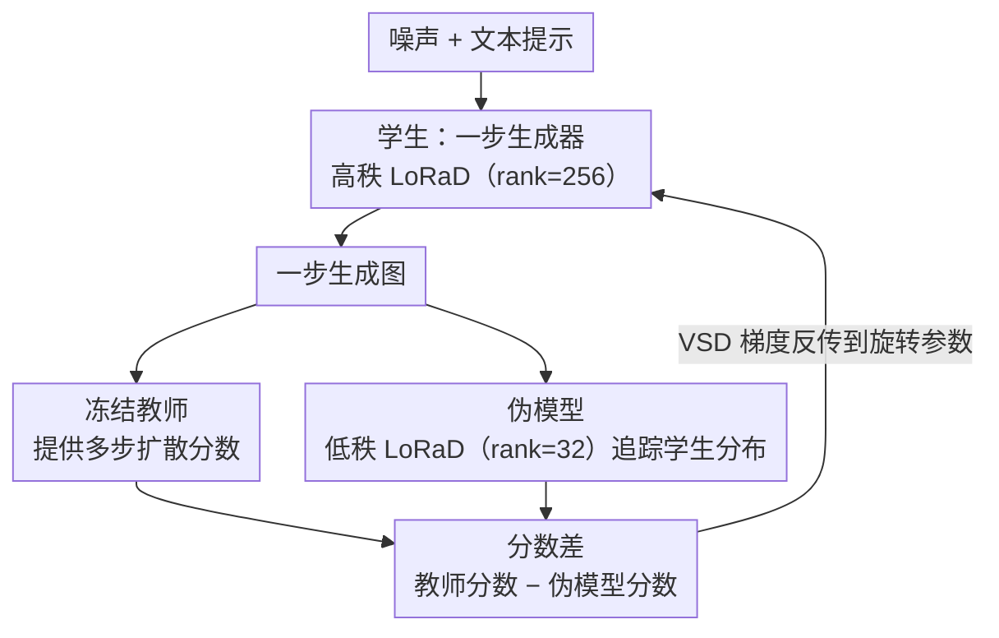

# WaDi: Weight Direction-aware Distillation for One-step Image Synthesis

**会议**: CVPR 2026  
**arXiv**: [2603.08258](https://arxiv.org/abs/2603.08258)  
**代码**: [https://github.com/gudaochangsheng/WaDi](https://github.com/gudaochangsheng/WaDi)  
**领域**: 图像生成  
**关键词**: 扩散蒸馏, 权重方向, 低秩旋转, 一步生成, 参数高效

## 一句话总结
通过分析蒸馏过程中权重变化的范数-方向分解，发现方向变化是蒸馏的关键驱动因素（变化幅度比范数大 22×），提出 LoRaD（低秩权重方向旋转）适配器，集成到 VSD 框架中构成 WaDi，仅用 ~10% 可训练参数即在 COCO 上取得一步生成 SOTA FID。

## 研究背景与动机
**领域现状**：扩散蒸馏方法将多步扩散压缩为一步生成器。主流方法分为全参数微调（FT）和 LoRA 微调两类，均基于 VSD（变分分数蒸馏）框架。

**现有痛点**：FT 和 LoRA 都直接更新参数，同时优化权重的范数和方向——但实际上两者变化量级差异巨大：方向变化的均值/标准差分别是范数变化的 22× 和 10×。这种耦合增加了优化难度。

**核心矛盾**：蒸馏信号主要通过方向调整传递，但现有适配器（LoRA/DoRA）的更新方式都没有专门针对方向调整进行优化，导致收敛慢、不稳定、容易过拟合。

**关键验证**：将一步模型的方向替换为教师方向→FID 恶化 241；替换范数→FID 仅变化 0.7。方向残差矩阵保留 30% 的秩即恢复 93% 信息——具有低秩结构。

**核心idea**：既然蒸馏的本质是权重方向旋转，不如直接学习低秩旋转矩阵来调整方向，而非通过 LoRA 间接影响。

## 方法详解

### 整体框架
WaDi 要解决的问题是：把一个多步扩散模型蒸馏成单步生成器时，怎样只动权重里"真正承载蒸馏信号"的那部分。它沿用 VSD（变分分数蒸馏）的三角结构——冻结的教师 $\epsilon_\psi$ 提供多步扩散的分数，一步生成器（学生）$G_{\lambda}$ 直接从噪声出图，伪模型 $\epsilon_\phi$ 实时追踪学生当前的输出分布；学生的训练梯度来自教师分数与伪模型分数之差。WaDi 没有改这套外层博弈，而是把学生和伪模型里更新权重的方式从 LoRA / 全参微调换成 LoRaD：不再对权重做加法修正，而是对权重列做低秩旋转，只调方向、不动范数。

### 关键设计

**1. LoRaD：用低秩旋转只改权重方向，把范数锁死**

这一设计直接针对前面那个观测——蒸馏信号几乎全靠方向旋转传递（把方向换成教师方向 FID 恶化 241，把范数换掉只动 0.7），而 LoRA 的加法更新 $W+\Delta W$ 会同时扰动范数和方向，反而把容量浪费在没用的范数上。LoRaD 的做法是对每一列权重施加一个正交旋转：受 RoPE 启发，把维度按奇偶配成 $d/2$ 个二维子空间，每个子空间转一个独立的角度，

$$W_{ro} = R_{AB}W = \begin{bmatrix} \cos AB & -\sin AB \\ \sin AB & \cos AB \end{bmatrix} \begin{bmatrix} W_{\text{odd}} \\ W_{\text{even}} \end{bmatrix}$$

角度矩阵 $\Theta = AB$ 被低秩参数化为 $A \in \mathbb{R}^{d/2 \times r}$、$B \in \mathbb{R}^{r \times k}$，对应"方向残差保留 30% 秩就能恢复 93% 信息"的低秩观测。因为 $R$ 是正交矩阵，旋转后每列范数恒定不变，这正好对上"范数可忽略"的发现，把更新容量全压在方向上。实现上旋转矩阵是稀疏块对角的，前向只需逐元素乘加，不引入额外的稠密矩阵乘法。

**2. WaDi 训练框架：学生用高秩 LoRaD、伪模型用低秩 LoRaD**

把 LoRaD 接进 VSD 后，剩下的问题是学生和伪模型该各配多大的旋转容量。两者角色不同：学生 $G_{\lambda_{\Theta^l}}$ 要把多步教师分布压成一步、需要更强的拟合能力，所以用高秩 LoRaD（rank=256）；伪模型 $\epsilon_{\phi_{\Theta^s}}$ 只是亦步亦趋地追踪学生当前分布、不需要很大容量，用低秩 LoRaD（rank=32）就够。训练时交替更新两者，学生的梯度沿用 VSD 形式、只是反向到旋转参数上：

$$\nabla_{\lambda_{\Theta^l}} \mathcal{L}_{\text{wadi}} = \mathbb{E}\big[\omega(t)(\epsilon_\psi - \epsilon_{\phi_{\Theta^s}}) \tfrac{\partial G_{\lambda_{\Theta^l}}}{\partial \lambda_{\Theta^l}}\big]$$

这种"学生重、伪模型轻"的非对称配比也被消融证实：学生 rank 拉到 512 反而过拟合（FID 从 10.79 升到 12.75），而伪模型 rank 主要影响保真度、对语义对齐几乎无感。

### 训练策略
- Image-free 训练：无需真实图像，仅用 1.4M JourneyDB 文本提示
- 学生 LR=1e-4，伪模型 LR=1e-2，AdamW 优化器，batch=128，CFG=1.5
- 2 个 epoch 训练，支持 SD1.5、SD2.1、PixArt-α 三种 backbone

## 实验关键数据

### 主实验 — COCO 2014 零样本 FID

| 方法 | 基座 | NFE | 可训练参数 | FID↓ | CLIP↑ |
|------|------|-----|-----------|------|-------|
| SD 1.5 | U-Net | 25 | 860M | 8.78 | 0.30 |
| DMD2 | U-Net | 1 | 860M | 12.96 | 0.30 |
| SiD-LSG | U-Net | 1 | 860M | 14.27 | 0.30 |
| **WaDi** | **U-Net** | **1** | **83.8M (9.7%)** | **10.79** | **0.31** |
| PixArt-α | DiT | 20 | 610M | 8.75 | 0.32 |
| **WaDi** | **DiT** | **1** | **81.2M (13.3%)** | **18.99** | **0.30** |

### 消融实验 — 适配器类型对比

| 适配器 | 参数量 | FID↓ | 方向均值变化 |
|--------|--------|------|------------|
| LoRA | 120.9M | 25.27 | 0.83% |
| DoRA | 121.2M | 26.56 | 0.55% |
| DoRA (frozen norm) | 120.9M | 24.52 | 0.92% |
| FT (DMD2) | 860.0M | 23.30 | 2.21% |
| **LoRaD** | **83.8M** | **20.86** | **2.89%** |

### 消融实验 — Rank 配置影响 (COCO 2014)

| 设置 | 学生 Rank | 学生参数 | 伪模型 Rank | FID↓ | CLIP↑ |
|------|----------|---------|------------|------|-------|
| A | 64 | 20.95M | 32 | 13.64 | 0.30 |
| B | 128 | 41.90M | 32 | 13.16 | 0.29 |
| **C** | **256** | **83.80M** | **32** | **10.79** | **0.31** |
| D | 512 | 167.59M | 32 | 12.75 | 0.30 |

### 关键发现
- LoRaD 用最少参数（83.8M vs 860M）达到最大方向变化（2.89%）和最优 FID（20.86），完美验证了"方向是蒸馏关键"的假说
- Rank=256 是学生最佳配置，rank=512 出现过拟合（FID 从 10.79 升至 12.75）
- 伪模型 rank 主要影响保真度（FID），对语义对齐（CLIP）影响小
- WaDi 可直接应用于 ControlNet（推理加速 86%）、ReVersion（加速 89%）、DreamBooth 等下游任务
- 用户研究中 57 名参与者一致评价 WaDi 在图像质量和文图对齐上优于现有基线

## 亮点与洞察
- **权重范数-方向分解分析**：首次系统研究蒸馏中权重变化的结构——方向变化 >> 范数变化，且方向残差具有低秩性。这为蒸馏提供了全新的理论视角
- **旋转而非加法**：LoRA 通过加法 $W + \Delta W$ 更新权重（同时改变范数和方向），LoRaD 通过旋转 $R_{\Theta}W$ 只改变方向——更精准、更高效
- **参数效率**：仅 ~10% 可训练参数即超越全参数微调，在资源受限场景下极有价值

## 局限与展望
- LoRaD 的 2D 子空间配对是固定的（奇偶行配对），可能不是最优分组策略
- 虽然 FID 好于 DMD2，但 CLIP 分数差异不大，说明方向旋转主要提升了图像保真度而非语义对齐
- 在 PixArt-α（DiT 架构）上的 FID 差距（18.99）仍较大，可能需要针对 DiT 架构的特殊设计
- 消融仅在 COCO 2017 上做，缺少更多数据集验证

## 相关工作与启发
- **vs DMD2**: DMD2 用 FT 全参数微调蒸馏；WaDi 仅用 10% 参数且 FID 更优——因为精准锁定了蒸馏的关键变量（方向）
- **vs LoRA/DoRA**: LoRA 加法更新改变范数+方向但方向变化不足（0.83%）；DoRA 分离范数但仍用 LoRA 更新方向；LoRaD 直接旋转方向，变化量最大（2.89%）
- **vs SwiftBrush**: SwiftBrush 也基于 VSD 但用 FT；WaDi 将 VSD + LoRaD 结合，参数效率远超

## 评分
- 新颖性: ⭐⭐⭐⭐⭐ 权重范数-方向分析视角新颖，LoRaD 设计巧妙且理论动机充分
- 实验充分度: ⭐⭐⭐⭐ 三种 backbone、下游任务、用户研究都覆盖，消融详细但数据集覆盖可更广
- 写作质量: ⭐⭐⭐⭐⭐ 动机分析极有说服力（替换实验 + SVD 分析），论证逻辑严密
- 价值: ⭐⭐⭐⭐⭐ 参数高效蒸馏的新标准，LoRaD 可迁移到其他微调场景

<!-- RELATED:START -->

## 相关论文

- [\[CVPR 2026\] DUO-VSR: Dual-Stream Distillation for One-Step Video Super-Resolution](duo-vsr_dual-stream_distillation_for_one-step_video_super-resolution.md)
- [\[CVPR 2026\] Temporal Equilibrium MeanFlow: Bridging the Scale Gap for One-Step Generation](temporal_equilibrium_meanflow_bridging_the_scale_gap_for_one-step_generation.md)
- [\[CVPR 2026\] ChordEdit: One-Step Low-Energy Transport for Image Editing](chordedit_one-step_low-energy_transport_for_image_editing.md)
- [\[CVPR 2026\] FlowSteer: Guiding Few-Step Image Synthesis with Authentic Trajectories](flowsteer_guiding_few-step_image_synthesis_with_authentic_trajectories.md)
- [\[NeurIPS 2025\] Distilled Decoding 2: One-step Sampling of Image Auto-regressive Models with Conditional Score Distillation](../../NeurIPS2025/image_generation/distilled_decoding_2_onestep_sampling_of_image_autoregressiv.md)

<!-- RELATED:END -->
