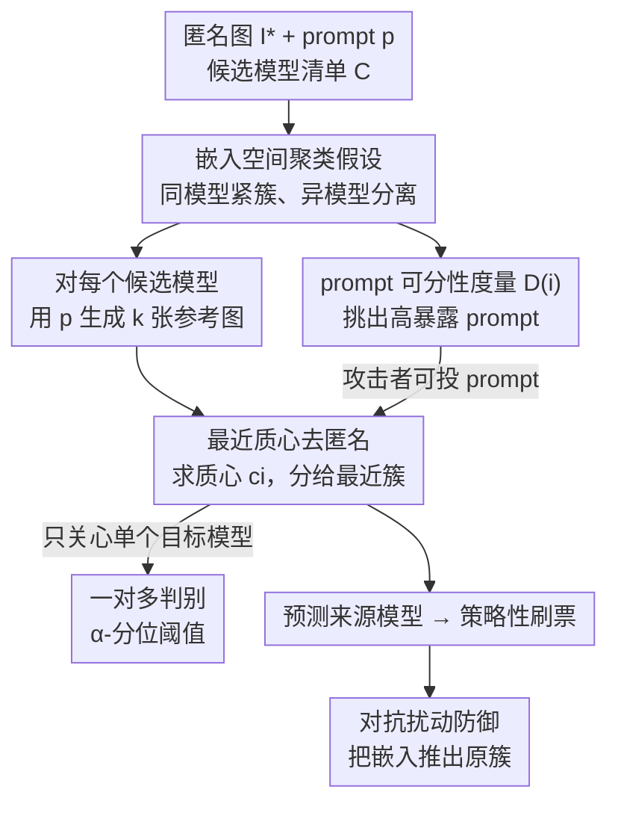

# When Anonymity Breaks: Identifying Models Behind Text-to-Image Leaderboards

**会议**: CVPR 2026  
**论文**: [CVF Open Access](https://openaccess.thecvf.com/content/CVPR2026/html/Naseh_When_Anonymity_Breaks_Identifying_Models_Behind_Text-to-Image_Leaderboards_CVPR_2026_paper.html)  
**领域**: 图像生成 / AI 安全  
**关键词**: 文生图、排行榜去匿名、模型指纹、嵌入聚类、投票评测安全

## 一句话总结
作者发现不同文生图（T2I）模型对同一 prompt 的生成在图像嵌入空间里会聚成各自紧密、彼此分离的簇，于是用一个**零训练、黑盒、仅靠最近质心分类**的方法，在 22 个模型、280 个 prompt（15 万张图）上把投票排行榜里"匿名"的生成图以 91% 的 top-1 准确率认出来源模型，戳穿了投票式 T2I 排行榜赖以公平的匿名假设。

## 研究背景与动机

**领域现状**：T2I 模型越来越多，怎么比较它们的质量成了刚需。排行榜分两类——基于基准（benchmark-based）的用固定测试集算自动指标，基于投票（voting-based）的让用户在两张**匿名**生成图里选更好的那张。由于 FID 等自动指标和人类偏好相关性很差，投票式排行榜（如 Artificial Analysis、各种 Arena）已经成为 T2I 评测的主流范式。

**现有痛点**：投票式排行榜的公平性**完全建立在"模型匿名"这一假设上**——用户不该知道两张图分别出自哪个模型，否则就能策略性地给自家模型刷票、给对手降权。文本（LLM）排行榜的去匿名攻击已有研究，但 T2I 场景下"匿名到底牢不牢"几乎没人系统研究过。

**核心矛盾**：不同模型因训练数据、架构、参数规模不同，对同一 prompt 会留下**系统性的风格 / 构图 / 细节签名**；而同一模型即便换随机种子，生成结果也**惊人地一致**（低 intra-model 方差）。也就是说，"匿名"想抹掉的模型身份，其实牢牢印在每张图的视觉特征里——只要找对表示空间就能读出来。

**本文目标**：(1) 证明 T2I 排行榜的去匿名比文本排行榜**容易得多**，哪怕攻击者不能控制 prompt、只有黑盒 API 访问；(2) 量化"哪些 prompt 更容易暴露模型身份"；(3) 探讨可行的防御。

**切入角度**：作者的关键假设是——在一个语义有意义的图像嵌入空间里，inter-model 方差**压倒** intra-model 方差，于是每个模型的生成自然聚成紧簇、簇间分得很开。现代图像编码器（CLIP/ViT-bigG）恰好能很好地捕捉这种风格与语义差异。

**核心 idea**：不训练、不嵌水印、不需要真实数据——只要对每个候选模型用同一 prompt 生成几张参考图、求嵌入质心，再把待识别图分给**最近的质心**，就能认出来源模型。

## 方法详解

### 整体框架

攻击者面对的场景是：排行榜给出一对匿名生成图 $A, B$ 和对应 prompt $p$，但不告诉来源模型。攻击者**已知候选模型清单**（排行榜公开列出）$\mathcal{C}=\{M_1,\dots,M_n\}$，并能黑盒查询这些模型的 API。攻击流程是：拿到 prompt 后，对每个候选模型各生成 $k$ 张参考图，用同一个图像编码器 $\varphi(\cdot)$ 把所有图映射到嵌入空间，对每个模型求质心，最后把排行榜那张匿名图 $I^*$ 分给**离它最近的质心**所对应的模型。整个过程没有任何训练，只需要推理期的几次 API 调用。

### 关键设计

**1. 嵌入空间聚类假设：把"匿名想抹掉的身份"还原成几何可分性**

这是整篇攻击的物理基础。作者把模型差异拆成两类：intra-model variation（同一模型同一 prompt、不同种子之间的差异）和 inter-model variation（不同模型同一 prompt 之间的差异）。经验上 inter-model 方差**远大于** intra-model 方差——同一个 FLUX.1-dev 换 5 个种子画出来风格几乎一致，但 FLUX 和 SDXL Turbo、Playground v2 画同一句 prompt 却一眼能看出不同流派。这种不对称意味着：在合适的表示空间里，每个模型的生成会形成**紧密且彼此分离的簇**。关键在于"合适的表示空间"——作者发现原始像素空间区分度差，而现代图像编码器（CLIP / LAION 上训的 ViT）能把风格、构图、色调、纹理这些"未被 prompt 指定"的差异编码出来，让簇结构显现。这一假设把抽象的"模型签名"落地成了可度量的几何分离性，后面所有攻击都建在它之上。

**2. 最近质心去匿名：零训练、黑盒就能认出来源模型**

针对"不想训练大分类器、也没有真实数据"的现实约束，作者用了教科书级的最近质心分类（nearest-centroid）。形式化地：对每个模型 $M_i$ 用 prompt $p$ 生成 $k$ 张参考图 $I_{i,1},\dots,I_{i,k}$，编码后求质心

$$c_i = \frac{1}{k}\sum_{j=1}^{k}\varphi(I_{i,j}).$$

给定排行榜图的嵌入 $e^* = \varphi(I^*)$，预测来源为离它最近的质心：

$$\hat{M} = \arg\min_{M_i \in \mathcal{C}} \lVert e^* - c_i \rVert_2.$$

它直接利用了设计 1 里的"低 intra-model 方差 + 高 inter-model 分离"——簇又紧又散开，最近质心几乎不会认错。它的杀伤力在于**门槛极低**：不需要训练、不需要控制 prompt、不需要预先采集数据，只要能黑盒生成参考图就行；而且 $k$ 很小也管用（后面消融显示 $k=1$ 就有 62%）。相比那些要训上万张图的监督分类器、要改训练流程嵌水印的方法，它反而准得多、还能泛化到没见过的 prompt。

**3. 一对多判别：连其他模型都不查也能抓出"是不是我家模型"**

很多攻击者其实只想知道"这张图是不是出自我家的目标模型 $M^*$"（好给自己刷票 / 给对手降权），不必做完整的 22 选 1。作者给了两个变体。Case 1（能查所有模型）：直接复用质心法，若 $\arg\min_i \lVert e^*-c_i\rVert_2 = M^*$ 就判为 $M^*$，否则判为"别的模型"。Case 2（**只能查目标模型自己**，最受限）：攻击者只对 $M^*$ 生成 $k$ 张参考图求质心 $c$，再用簇内距离的 $\alpha$-分位数定一个阈值

$$\lambda_\alpha = \text{quantile}_\alpha\big(\lVert x_i - c \rVert_2\big),$$

测试图嵌入 $z$ 满足 $\lVert z-c\rVert_2 \le \lambda_\alpha$ 就判为 $M^*$。Case 2 的意义在于：哪怕攻击者**完全不知道、也无力复现其他模型**，仅凭"我家模型的簇有多紧"这一信息就能做出可靠判别，说明模型签名强到"自证"都够用。

**4. prompt 可分性度量 $D(i)$：量化哪些 prompt 最容易泄密**

不是所有 prompt 都一样危险——有的 prompt 让各模型画得五花八门（高度可分），有的让大家画得差不多（难以区分）。作者定义了一个 prompt 级可分性分数。先在模型级别看：对 prompt $p_i$、模型 $M_j$ 的每张图嵌入 $e^{(\ell)}_{i,j}$，在"该 prompt 下所有模型的联合嵌入集"里找它的最近邻，若最近邻也属于 $M_j$ 就算"聚对了"，得到

$$\text{frac}(i,j) = \frac{1}{k}\sum_{\ell=1}^{k}\mathbb{I}\big[\text{NN}(e^{(\ell)}_{i,j}) \in M_j\big].$$

若 $\text{frac}(i,j) > \tau$ 则认为 $(p_i, M_j)$ 这个簇可分。再把 prompt 级分数定义为"有多少比例的模型在该 prompt 下能形成可分簇"：

$$D(i) = \frac{1}{|\mathcal{C}|}\sum_{M_j \in \mathcal{C}} \mathbb{I}\big[\text{frac}(i,j) > \tau\big].$$

$D(i)$ 高意味着该 prompt 下 inter-model 差异压倒 intra-model 差异。它的用途有两面：攻击者若**能投 prompt**，就挑 $D(i)=1$ 的 prompt 把去匿名拉到 100%；防御者则可以反过来用它筛掉高暴露 prompt。

**5. 对抗扰动防御：把图的嵌入推出原簇又不毁画质**

作者还从防御角度给了一个对策（也验证了攻击有多顽固）。既然簇分得太开，那就**给图加难以察觉的小扰动**，让它的嵌入偏离来源模型的区域、朝其他模型的簇靠拢，从而打乱聚类。防御者不能直接改嵌入（只能改图像），也**不知道攻击者用哪个编码器**（黑盒）。做法借鉴 Hu et al. 的对比损失：把图拉向"最远的其他模型生成图"（正样本）、推离自身原嵌入（负样本）；为了跨编码器迁移，用一组本地编码器的集成来优化扰动。这一设计同时要满足三点：移出源簇、增大与他模型的重叠、保持视觉保真。结果它确实能降攻击准确率，但代价是扰动越大画质越差，且**降不彻底**（$\epsilon=2$ 时 top-1 仍有 75%），印证了"没有万无一失的防御"这一结论。

## 实验关键数据

### 主实验

实验用 8 家公司的 22 个 SOTA T2I 模型（开源 + 闭源），从 Artificial Analysis 排行榜手工收集 280 个 prompt，每个模型每个 prompt 生成 30 张，共 $280\times22\times30=184{,}800$ 张图；所有随机分配重复 5 次取平均。主编码器是 LAION 上训的 ViT。评测用 top-1/2/3 识别准确率（正确模型是否落在最近的 $k$ 个质心里）。

| 类别 | 方法 | Top-1 (%) | Top-2 (%) | Top-3 (%) |
|------|------|-----------|-----------|-----------|
| 推理期指纹 | Marra et al.（噪声残差） | 24.40 | 31.20 | 36.50 |
| 推理期指纹 | Dzanic et al.（频域功率律） | 11.79 | 21.57 | 28.43 |
| 监督分类器 | Image（ResNet-50 像素） | 54.86 | 67.00 | 72.86 |
| 监督分类器 | Image Embedding（MLP） | 43.00 | 55.86 | 63.36 |
| 监督分类器 | Image + Text Embedding | 42.50 | 57.71 | 65.50 |
| **推理期嵌入（本文）** | **Embedding-1（Ours）** | **90.86** | **96.14** | **97.50** |

本文零训练的质心法以 91% top-1 大幅碾压所有 baseline，且在"不控制 prompt"的现实黑盒设定下成立。传统指纹（GAN 时代设计）完全失效；监督分类器虽然验证集准确率高，但**对没见过的 prompt 泛化极差**（训练用了从 Midjourney Discord 收集的 200 万 prompt、聚成 ~6000 类后采样生成 44,000 对图，仍只有 ~55% top-1）。

### 一对多与受限访问

| 设定 | 指标 | 结果 |
|------|------|------|
| Case 1（可查所有模型） | top-1 | 99.16% |
| Case 2（$\alpha=0.80$，仅查目标模型） | Accuracy / AUC | 0.926 / 0.928 |
| Case 2（$\alpha=0.95$） | Accuracy / AUC | 0.841 / 0.916 |

一对多设定下，能查所有模型时近乎完美（99.16%）；即使**只查目标模型自己**（Case 2），用 $\alpha$-分位阈值仍有 0.92 左右准确率、AUC 0.92+，说明模型签名强到不依赖对比其他模型。

### 消融与防御

| 配置 | 关键指标 | 说明 |
|------|---------|------|
| $k=30$ | top-1 91% | 主设定 |
| $k=10$ | ≈ 与 30 持平 | 10 张就够，成本大降 |
| $k=1$ | ≈ 62% | 单张仍远超随机 1/22≈4.55% |
| 候选池 5 / 10 / 15 模型 | 96.64 / 95.07 / 93.86% | 候选越多略降但仍强（随机 20/10/6.7%） |
| 编码器 CLIP-ViT-bigG-14 vs 旧 CLIP | 现代编码器更优 | 嵌入空间质量决定上限 |
| 防御 $\epsilon=2$ | top-1 0.90→0.75（↓16.7%） | 扰动小、降幅有限 |
| 防御 $\epsilon=8$ | top-1 0.90→0.46（↓48.9%） | 扰动大、画质受损但仍非平凡 |

### 关键发现
- **签名极其廉价可得**：只要 1 张参考图就有 62% 准确率，10 张就逼近 30 张的效果；按 Artificial Analysis 定价，去匿名一张图约 $1.08\times I$ 美元，5 张/模型（≈85%）只需 ~$5.4，对有组织的对手不值一提。
- **prompt 可分性确实预测攻击成败**：去匿名成功率随 $D(i)$ 单调上升；若攻击者能投 prompt，挑 30 个 $D(i)=1$ 的 prompt 可达 100% top-1——这是最坏情况的安全警示。
- **监督训练是反例**：堆数据训分类器在验证集上好看，但换 prompt 就崩，反而不如零训练的质心法，说明"模型签名"是低维、风格化的，不需要也不适合用大模型去硬学。
- **防御注定带 trade-off**：扰动能降攻击但降不干净（$\epsilon=2$ 仍 75%），且可被标准去噪还原、还伤画质；其他手段（限流、验证码、用户检测）只提高成本不解决根本。

## 亮点与洞察
- **把安全问题还原成一个几何观察**：全篇最"啊哈"的地方是——投票排行榜的公平性赌的是匿名，而匿名想抹掉的模型身份其实是嵌入空间里一个又紧又分离的簇，于是最朴素的最近质心分类就足以攻破。简单方法打败复杂 baseline，本身就是强有力的论证。
- **威胁模型分层很扎实**：从"能查所有模型"到"只能查自己一个模型"、从"不能控 prompt"到"能投 prompt"，把攻击者能力切成几档分别量化，让结论的适用边界很清楚，可直接迁移到 LLM Arena、语音等其他匿名投票评测场景。
- **$D(i)$ 这个 prompt 可分性度量可复用**：它本质是"用最近邻一致性衡量同源样本是否成簇"，任何"想知道某条输入会不会暴露来源"的场景（数据来源审计、生成检测）都能借用。
- **攻防同篇且诚实**：作者没有只展示攻击，还给了对抗扰动防御并坦白它降不彻底，把"没有 foolproof 防御、只能在公平/可用/透明之间权衡"讲清楚，结论更可信。

## 局限与展望
- **依赖能复现参考生成**：攻击需要对候选模型用同一 prompt 生成参考图。若排行榜对生成做了私有后处理、或模型仅在排行榜内部不对外开放，攻击者拿不到可比的参考图，质心就建不准。
- **嵌入编码器是单点**：攻击强度高度依赖图像编码器质量（旧 CLIP 明显更弱）。若排行榜方主动施加针对主流编码器的扰动 / 风格归一化，攻击面会收窄——但作者也指出防御方不知道攻击者用哪个编码器，这是一场军备竞赛。
- **大多评测在静态离线数据上**：实验是在自己采集的固定 prompt-图集合上模拟"排行榜图"，真实 Arena 的在线动态、限流、验证码等工程防护未端到端验证，实战成功率可能打折。
- **防御只给了被动扰动**：对抗后处理可被标准去噪部分还原、且伤画质。更根本的方向（如随机化生成、对生成图做不可逆的语义保持归一化、把投票从单图改为聚合）值得继续探索。

## 相关工作与启发
- **vs LLM 排行榜去匿名（Huang et al. / Min et al. / Suri et al.）**：他们攻击 Chatbot Arena 等文本排行榜，靠 deanonymize + 策略投票或污染票操纵排名；本文指出 T2I 模态的去匿名**比文本更容易**，因为图像签名是天然、持久且高维可分的视觉特征，不需要文本侧的复杂策略。
- **vs 模型归因 / 指纹（Marra et al. 噪声残差、Dzanic et al. 频域、ManiFPT、Riemannian）**：传统指纹要么需要训练流程 / 真实数据 / 上万样本，要么是为早期低分辨率 GAN 设计、对现代 T2I 泛化差（本文实测仅 12–24% top-1）；本文完全在推理期、零训练、零真实数据就做到 91%。
- **vs 训练期嵌水印（fingerprint embedding）**：那类方法需要改训练 / 微调、访问模型权重，做的是"溯源验证"；本文做的是**事后黑盒归因**，更贴合排行榜这种"只能看输出"的现实威胁场景。
- **启发**：任何"靠匿名保证公平"的众包评测系统（图像、语音、视频、3D 生成的 Arena）都应假设模型签名可被嵌入空间读出，去匿名是默认威胁；评测协议设计需要从一开始就把"签名抹除"纳入考量，而非事后打补丁。

## 评分
- 新颖性: ⭐⭐⭐⭐⭐ 首次系统揭示 T2I 投票排行榜的去匿名漏洞，用最朴素的质心法打穿匿名假设，视角新。
- 实验充分度: ⭐⭐⭐⭐⭐ 22 模型 × 280 prompt × 15 万图，含 baseline 对比、一对多、可分性、样本数 / 池大小 / 编码器消融与攻防，覆盖很全。
- 写作质量: ⭐⭐⭐⭐ 威胁模型清晰、公式与图表配合好；自定义指标 $D(i)$ 解释到位，少数细节（防御算法）放在补充材料略影响自洽阅读。
- 价值: ⭐⭐⭐⭐⭐ 直接动摇了当下 T2I 主流评测范式的公平性根基，并给出可量化的脆弱性指标，对排行榜设计有现实指导意义。

<!-- RELATED:START -->

## 相关论文

- [\[CVPR 2026\] When Pretty Isn't Useful: Investigating Why Modern Text-to-Image Models Fail as Reliable Training Data Generators](when_pretty_isnt_useful_investigating_why_modern_text-to-image_models_fail_as_re.md)
- [\[CVPR 2026\] When Safety Collides: Resolving Multi-Category Harmful Conflicts in Text-to-Image Diffusion via Adaptive Safety Guidance](when_safety_collides_resolving_multi-category_harmful_conflicts_in_text-to-image.md)
- [\[CVPR 2026\] CSF: Black-box Fingerprinting via Compositional Semantics for Text-to-Image Models](csf_black-box_fingerprinting_via_compositional_semantics_for_text-to-image_model.md)
- [\[CVPR 2026\] The Drift Kernel: Why Diffusion Models Change Even When Told Not To](the_drift_kernel_why_diffusion_models_change_even_when_told_not_to.md)
- [\[CVPR 2026\] When Understanding Becomes a Risk: Authenticity and Safety Risks in the Emerging Image Generation Paradigm](when_understanding_becomes_a_risk_authenticity_and_safety_risks_in_the_emerging_.md)

<!-- RELATED:END -->
