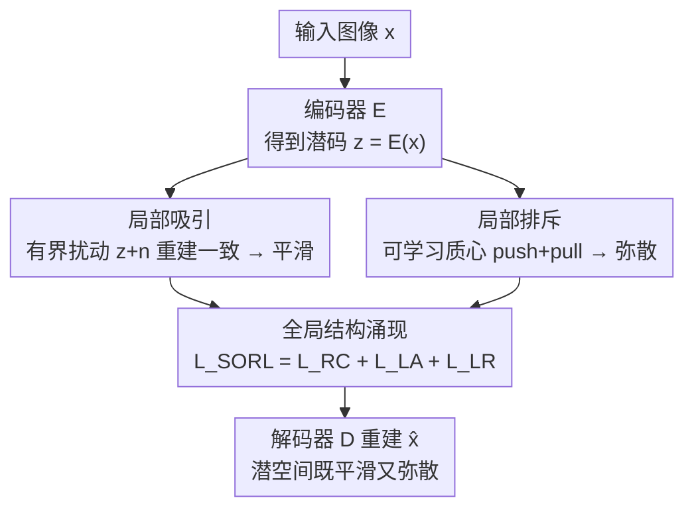

# When Local Rules Create Global Order: Self-Organized Representation Learning for Latent Diffusion Models

**会议**: CVPR 2026  
**论文**: [CVF Open Access](https://openaccess.thecvf.com/content/CVPR2026/html/Lian_When_Local_Rules_Create_Global_Order_Self-Organized_Representation_Learning_for_CVPR_2026_paper.html)  
**代码**: 待确认  
**领域**: 扩散模型 / 表示学习  
**关键词**: 潜在扩散模型, 自组织, 表示学习, 局部吸引与排斥, VAE 潜空间

## 一句话总结
本文指出潜在扩散模型（LDM）的好坏取决于其 VAE 潜空间是否同时满足「局部平滑」与「全局弥散」，并提出 SORL——一种自下而上的训练范式，只用「局部吸引」和「局部排斥」两条简单局部规则，让这两种全局结构自发涌现，从而同时提升重建保真度与生成多样性。

## 研究背景与动机

**领域现状**：LDM 先用自编码器（通常是 VAE）把图像压到一个紧凑潜空间，再在潜空间里跑扩散来生成。这个潜空间的几何结构同时决定了重建保真度和生成质量，因此近年大量工作都在「整理」这个潜空间：用 KL 散度配高斯先验、用等变约束（EQ-VAE）强制图像变换与潜变量变换几何一致、用预训练视觉编码器（DINO 等）做语义对齐（VA-VAE）。

**现有痛点**：这些方法几乎都在做同一件事——把潜空间变「平滑」。但作者用感知路径长度（PPL）和插值的四分位距（IQR）实测发现：VAE、RV-VAE、VA-VAE 虽然插值平滑，但 IQR 很小，意味着大部分潜码被压进了少数狭窄的高密度区域。平滑是局部平滑，代价是潜空间的大片体积被闲置。更尖锐的证据是：这些模型在分布内（ID）数据上重建得越好，到分布外（OOD）数据上反而掉得越狠（图 2），说明它们学到的是「局部特化」而非「全局可泛化」的表示。

**核心矛盾**：重建与生成之间存在一个长期的优化困境——更强的平滑/正则（如 β-VAE 里更大的 β）提升重建与生成稳定性，却把多样输入压缩到紧凑区域，削弱生成多样性；而弱正则虽保留细节却让潜空间不规则、难采样。问题的根本在于：现有方法只优化了「平滑」这一维，却忽略了「弥散」这一维。

**本文目标**：找到一种机制，让潜空间**既局部平滑又全局弥散**，从而同时支撑高保真重建和多样化生成。

**切入角度**：作者不再往外加约束（高斯先验、预训练编码器都是「自上而下」的外部规则），而是借鉴复杂系统中的**自组织**思想——自组织地图（SOM）告诉我们，全局有序结构可以从简单的局部交互中自发涌现，不需要中心化的顶层设计。作者把深度生成模型的潜空间重新诠释为一个自组织系统。

**核心 idea**：不直接强加「平滑」和「弥散」这两个全局属性，而是设计两条互补的局部规则——**局部吸引**让邻近潜码产生一致重建（平滑由此涌现），**局部排斥**阻止潜码塌缩成密集簇（弥散由此涌现）——让全局结构在训练中作为大量局部交互的累积效应自然生成。

## 方法详解

### 整体框架
SORL（Self-Organized Representation Learning）是一个加在 VAE 训练目标上的「内部力场」。给定图像 $x$，编码器 $E$ 把它映到潜码 $z=E(x)$，解码器 $D$ 重建出 $\hat{x}=D(z)$。SORL 不改网络结构，而是把潜空间的演化交给三条局部交互原则——**自治（Autonomy）**、**水平性（Horizontality）**、**全局结构（Global Structure）**——分别对应两个可优化目标和一个涌现结果：自治用「局部吸引」保证重建保真与局部平滑；水平性用「局部排斥」推开拥挤的潜码、保证全局弥散；二者在训练中相互拮抗，最终让一个既平滑又弥散的潜流形「涌现」出来。整体训练目标是三项相加：$L_\text{SORL}=L_\text{RC}+L_\text{LA}+L_\text{LR}$。

### 关键设计

**1. 局部吸引：有界扰动下的重建自调节，让平滑「就地」涌现**

痛点是：仅靠重建一致性确实能带来一定平滑，但前人发现单纯依赖它会导致弱连续性、出现走样（aliasing）或纹理粘连。SORL 的「自治」原则主张：每个潜码的移动主要由它自己的重建需求决定。具体做法是给潜码加一个**有界**的均匀噪声 $n\sim U(-c,c)$（满足 $\|n\|_\infty\le c$），要求扰动后仍能重建出原图：

$$L_\text{LA}=\mathbb{E}_{n\sim U(-c,c)}\big[\|x-D(z+n)\|_2^2\big]$$

这里的关键不是「加噪声做数据增强」，而是那个**严格的边界 $c$**：它强制结构的形成完全来自局部交互——只要求潜码在自己周围的小邻域内保持重建一致，而不去匹配任何全局先验。作者指出这种「严格局部」的正则恰好能避免后验塌缩（posterior collapse）。换句话说，平滑不是被外部高斯先验「压」出来的，而是每个潜码各自维护自己小邻域稳定性的副产品。

**2. 局部排斥：可学习质心的「推-拉」机制，让弥散「自下而上」铺开**

只有平滑还不够——一个平滑但全局紧凑的潜空间表达力有限、生成多样性差。「水平性」原则引入一个排斥机制，把潜码从拥挤区域推开。SORL 在潜空间里维护一组 $K$ 个**可学习质心** $C=\{\hat{z}_1,\dots,\hat{z}_K\}$，每个潜码 $z_t=E(x_t)$ 被指派到最近的质心 $\hat{z}_{c_t}$（$c_t=\arg\min_k\|z_t-\hat{z}_k\|_2^2$），质心用滑动平均更新以保证训练稳定。局部排斥损失由两部分构成：

$$L_\text{LR}=L_\text{push}+\lambda_\text{pull}L_\text{pull}=\Big(-\min_{i\ne j}\|\hat{z}_i-\hat{z}_j\|_2^2\Big)+\lambda_\text{pull}\,\mathbb{E}_{z_k\sim Z}\|z_t-\hat{z}_{c_t}\|_2^2$$

其中 **Centroid Push**（$L_\text{push}$）最大化质心之间的最小两两距离——把这些「结构锚点」尽量摊开；**Assignment Pull**（$L_\text{pull}$）拉近每个潜码与其所属质心的距离——让编码器跟着这个被摊开的结构走。这两个力一推一拉：push 负责让骨架占满整个潜空间，pull 负责让真实潜码贴合这个骨架，于是「全局占满潜空间容量」这件事就从局部的指派-排斥交互里涌现出来，而不需要任何全局的弥散约束。作者还给出一个收敛性 Remark：在这套规则下，系统会收敛到所有质心最小间距相等（$d_i=d_j$）的均匀稳定构型。

**3. 全局结构涌现：拮抗的局部规则收敛成平滑且弥散的流形**

第三条「全局结构」原则本身不是一个新损失，而是前两条规则共同作用的结果，作者把它写进总目标：$L_\text{SORL}=L_\text{RC}+L_\text{LA}+L_\text{LR}$，其中重建一致性项 $L_\text{RC}=L_\text{mse}+L_\text{perc}+\lambda_\text{adv}L_\text{adv}$（均方误差 + 感知损失 + 对抗损失）。关键洞察在于：局部吸引（让潜码内聚）和局部排斥（让潜码外散）是一对**拮抗**的力——单独用任何一个都会失衡（消融里 attraction-only 多样性差、repulsion-only 保真差），但二者叠加后会在潜空间里达到一个动态平衡，自发形成一个既局部平滑、又全局弥散的潜流形。整个过程是「自治的」（不需外部先验）、「水平的」（动力学来自局部交互）、且「收敛的」（局部交互导向稳定全局结构），这正是把潜空间当作自组织系统来看的核心价值。

### 损失函数 / 训练策略
总目标 $L_\text{SORL}=L_\text{RC}+L_\text{LA}+L_\text{LR}$。所有模型把 $256\times256$ 图像压成 $64\times64$ 潜表示（下采样因子 $f=4$）。优化器 AdamW（$\beta_1=0.9,\beta_2=0.95$），基础学习率 $2\times10^{-6}$，$\lambda_\text{adv}=0.8$；ablation 给出 $\lambda_\text{pull}=10^{-2}$ 最优，质心数 $K$ 在 8,192~16,384 区间稳定。重建训练在 ADE20K/CelebA-HQ 上 80 epoch、FFHQ 40 epoch、LSUN-Churches 20 epoch；生成训练 200 epoch；8×RTX 3090。

## 实验关键数据

### 主实验

重建质量（四个数据集，节选 CelebA-HQ / FFHQ）：

| 数据集 | 指标 | VAE | RV-VAE | EQ-VAE | VA-VAE | 本文 |
|--------|------|------|--------|--------|--------|------|
| CelebA-HQ | PSNR↑ | 28.40 | 29.74 | 29.57 | 28.28 | **31.51** |
| CelebA-HQ | SSIM↑ | 0.80 | 0.85 | 0.84 | 0.80 | **0.89** |
| CelebA-HQ | LPIPS↓ | 0.081 | 0.058 | 0.065 | 0.110 | **0.049** |
| FFHQ | PSNR↑ | 28.95 | 28.63 | 28.89 | 27.20 | **29.70** |
| FFHQ | LPIPS↓ | 0.058 | 0.051 | 0.057 | 0.105 | **0.042** |

CelebA-HQ 无条件生成（FID / IS / 精度 / 召回）：

| 方法 | FID↓ | IS↑ | Prec.↑ | Recall↑ |
|------|------|------|--------|---------|
| VAE | 13.02 | 3.30 | 0.33 | 0.63 |
| RV-VAE | 16.21 | 3.19 | 0.22 | 0.62 |
| EQ-VAE | 15.80 | 3.20 | 0.21 | 0.64 |
| VA-VAE | 53.15 | 3.18 | 0.22 | 0.38 |
| **本文** | **9.74** | **3.34** | **0.47** | **0.65** |

在 CelebA-HQ 上 PSNR 比 VAE 基线高 3 dB 以上，且 FID 从 13.02 降到 9.74，同时 IS、Precision、Recall 全面最优——说明一个良态潜流形不仅改善重建，也直接提升生成的多样性与保真度。

### 跨域 / 跨分辨率泛化
所有模型在 ADE20K（$256\times256$）训练，到 MS-COCO / LSDIR / DIV2K 上测：

| 方法 | MS-COCO PSNR↑ | LSDIR PSNR↑ | DIV2K PSNR↑ |
|------|---------------|-------------|-------------|
| VAE | 26.22 | 21.71 | 21.15 |
| VA-VAE | 24.16 | 19.81 | 20.27 |
| **本文** | **26.91** | **21.96** | **21.44** |

跨分辨率（DIV2K 多分辨率重建）本文在 128×80 到 1024×640 全部最优；尤其 VA-VAE 在高分辨率下急剧退化（1024×640 仅 21.94 PSNR），而本文保持 26.75，印证「全局弥散」带来的潜空间确实更可泛化、可缩放。

### 消融实验

| 配置 | FID↓ | IS↑ | Prec.↑ | Recall↑ | 说明 |
|------|------|------|--------|---------|------|
| Baseline ($L_\text{RC}$) | 80.02 | 3.13 | 0.21 | 0.19 | 只有重建一致性 |
| + $L_\text{LA}$ | 45.54 | 3.19 | 0.42 | 0.41 | 加局部吸引：保真升、多样性受限 |
| + $L_\text{LR}$ | 98.82 | 4.28 | 0.29 | 0.36 | 只加局部排斥：IS 高但 FID 崩 |
| + $L_\text{LA}$ & $L_\text{LR}$（本文） | **23.55** | 3.23 | **0.52** | **0.54** | 二者拮抗，取得最佳平衡 |

潜空间结构度量（CelebA-HQ）：

| 方法 | 密度 std.↓ | Gini 系数↓ | Mean PPL↓ | Median PPL↓ |
|------|-----------|-----------|-----------|-------------|
| VAE | 1.70e-5 | 0.109 | 13.72 | 11.90 |
| VA-VAE | 9.91e-5 | 0.349 | 30.55 | 14.74 |
| **本文** | **1.41e-5** | **0.084** | **10.58** | **8.54** |

### 关键发现
- **两条规则缺一不可**：单加 $L_\text{LA}$ 把流形压得过紧、多样性差（Recall 0.41）；单加 $L_\text{LR}$ 虽 IS 飙到 4.28 但流形不规则、FID 崩到 98.82。只有联合优化才把 FID 从 80.02 砍到 23.55，同时 Precision/Recall 翻倍——直接证明「平滑」与「弥散」是一对必须同时满足的拮抗目标。
- **质心数 $K$ 鲁棒**：$K$ 在 8,192~16,384 区间 FID 稳定在 23~25；太小（1024，FID 28.86）会限制弥散，太大则收益递减。
- **拉力权重 $\lambda_\text{pull}$ 敏感**：$10^{-2}$ 最优（FID 23.55），过大（=1，FID 45.97）会把潜码拉得太死、Recall 掉到 0.37。
- **可扩展性**：在 ImageNet 上用 SiT-XL/2 跑 100K 步（iREPA 协议），本文重建 PSNR 26.43、生成 FID 15.12，均优于 SiT-XL（FID 19.06）和 +iREPA（FID 16.96），初步显示大规模可扩展性。

## 亮点与洞察
- **「自下而上涌现」替代「自上而下强加」**：最让人「啊哈」的是，作者没有给「平滑」和「弥散」各写一个直接的全局损失，而是设计了两条局部规则让它们涌现。这种把复杂系统自组织思想（SOM、复杂系统三原则：自治/水平性/全局结构）形式化成可优化目标的做法，思路很新。
- **诊断比方法更有说服力**：图 1/图 2 用 PPL+IQR 揭示「平滑 ≠ 好潜空间」、用 ID vs OOD 重建差距揭示「局部特化」，把领域里「重建好就够了」的隐含假设直接证伪——这个 ID/OOD 对照实验本身就是可复用的诊断工具。
- **可学习质心的 push-pull 可迁移**：用一组可学习质心做「骨架」、push 摊开骨架 + pull 贴合骨架的设计，本质是一种轻量的全局结构正则，可迁移到任何需要「占满表示空间、防塌缩」的表示学习/对比学习任务。
- **收敛性 Remark 给了理论底气**：质心最小间距趋于相等（$d_i=d_j$）的均匀构型，让「弥散」不只是经验观察，而有了一个明确的收敛目标。

## 局限与展望
- 作者承认：SORL 主要塑造**几何**组织，不显式建模**语义**层面的因子，在复杂场景下可解释性可能受限。把这套局部规则扩展到文本引导扩散（text-guided diffusion）是明确的未来方向。
- 自己发现的局限：生成实验主要在 CelebA-HQ（人脸）这类相对单一域上做无条件生成；ImageNet 只是 100K 步的「初步」实验，是否在大规模类条件/文生图设定下仍稳定，证据尚不充分。
- 引入 $K$ 个可学习质心 + 最近邻指派带来额外训练开销与一个新超参 $K$；虽然作者说 $K$ 鲁棒，但跨数据集是否需要重调 $\lambda_\text{pull}$、质心滑动平均的更新细节对稳定性的影响，论文着墨不多。

## 相关工作与启发
- **vs EQ-VAE（等变正则）**: EQ-VAE 强制图像变换与潜变量变换几何一致来保证局部平滑，是一种「自上而下」的外部约束；本文只用局部重建一致性（有界扰动）做平滑，且额外补上 EQ-VAE 没有的「弥散」维度，因此在 OOD/跨分辨率上泛化更好。
- **vs VA-VAE（语义对齐）**: VA-VAE 用预训练视觉编码器（DINO 等）的语义先验对齐潜空间；本文认为这种固定外部先验会限制对连续潜空间内在结构的刻画，转而让结构从数据自身的局部交互中涌现。实验中 VA-VAE 在跨分辨率下严重退化（1024×640 PSNR 仅 21.94），反衬本文的全局弥散更稳。
- **vs VAE / β-VAE（高斯先验 + KL）**: 传统 VAE 用 KL 把后验匹配到固定高斯先验，是典型的顶层约束，容易把多样输入压进高密度区；本文去掉固定全局先验，用「局部排斥」动态摊开潜码，缓解了重建-生成的优化困境。
- **vs 自组织地图（SOM）**: 经典 SOM 只能做浅层聚类/可视化；本文把 SOM 的「局部竞争→全局拓扑」原则重新诠释进深度生成模型的潜空间，是对这一经典思想的现代化、可微化复活。

## 评分
- 新颖性: ⭐⭐⭐⭐⭐ 把复杂系统自组织三原则形式化成两条可微局部规则、让全局潜空间结构涌现，视角清新且有理论支撑
- 实验充分度: ⭐⭐⭐⭐ 四数据集重建 + 生成 + 跨域 + 跨分辨率 + 多组消融很扎实，但大规模/类条件生成仅初步
- 写作质量: ⭐⭐⭐⭐⭐ 诊断动机（PPL/IQR、ID vs OOD）层层递进，方法与原则一一对应，逻辑非常清晰
- 价值: ⭐⭐⭐⭐ 给「如何训练更好的 LDM 潜空间」提供了即插即用、可迁移到表示学习的新范式

<!-- RELATED:START -->

## 相关论文

- [\[CVPR 2026\] MPDiT: Multi-Patch Global-to-Local Transformer Architecture for Efficient Flow Matching](mpdit_multi-patch_global-to-local_transformer_architecture_for_efficient_flow_ma.md)
- [\[CVPR 2026\] SRA 2: Variational Autoencoder Self-Representation Alignment for Efficient Diffusion Training](sra_2_variational_autoencoder_self-representation_alignment_for_efficient_diffus.md)
- [\[ICLR 2026\] When One Modality Rules Them All: Backdoor Modality Collapse in Multimodal Diffusion Models](../../ICLR2026/image_generation/when_one_modality_rules_them_all_backdoor_modality_collapse_in_multimodal_diffus.md)
- [\[CVPR 2026\] Self-Corrected Image Generation with Explainable Latent Rewards](self-corrected_image_generation_with_explainable_latent_rewards.md)
- [\[CVPR 2026\] 2ndMatch: Finetuning Pruned Diffusion Models via Second-Order Jacobian Matching](2ndmatch_finetuning_pruned_diffusion_models_via_second-order_jacobian_matching.md)

<!-- RELATED:END -->
