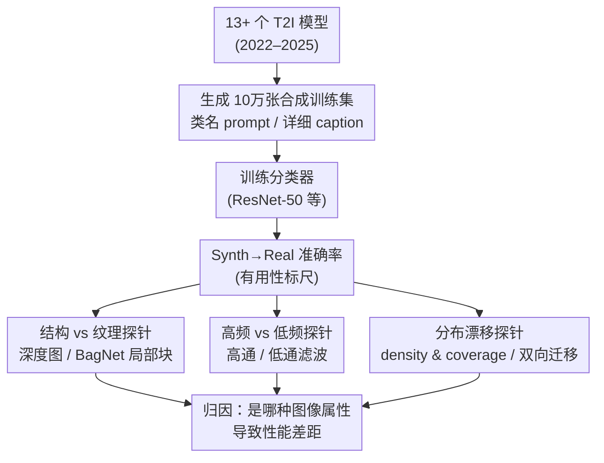

# When Pretty Isn't Useful: Investigating Why Modern Text-to-Image Models Fail as Reliable Training Data Generators

**会议**: CVPR 2026  
**论文**: [CVF Open Access](https://openaccess.thecvf.com/content/CVPR2026/html/Adamkiewicz_When_Pretty_Isnt_Useful_Investigating_Why_Modern_Text-to-Image_Models_Fail_CVPR_2026_paper.html)  
**代码**: 待确认  
**领域**: 图像生成 / 合成数据  
**关键词**: 文生图, 合成训练数据, 分布坍缩, 频谱分析, density-coverage

## 一句话总结
作者把 2022–2025 年间发布的十多个开源 T2I 扩散模型当成"合成训练数据发生器"，用它们造图训练分类器、再到真实测试集上评估，发现一个反直觉的规律：模型越新、画面越漂亮、prompt 跟随越好，造出来的数据反而越没用——Synth→Real 准确率随时间持续下滑，根因是新模型把分布坍缩到一个狭窄的"审美中心"流形，丢掉了纹理与高频细节、牺牲了多样性。

## 研究背景与动机
**领域现状**：数据的质量、数量和分布是深度学习泛化能力的根本决定因素，但真实数据的采集、标注、去偏越来越贵，在隐私敏感、样本稀缺或强域偏移的场景里尤其是瓶颈。于是"用 T2I 扩散模型批量造合成数据来替代真实数据"成了一个很诱人的方向，已有不少工作报告在分类、检测、对比学习、姿态估计等任务上，纯合成数据训练能逼近甚至追平真实数据。

**现有痛点**：这些乐观结论几乎都建立在**早期**扩散模型（SD1.5、SD2.1 这一代）之上。而这两三年 T2I 领域进步飞快——更大的网络、互联网级数据、更高分辨率的隐空间、更强的文本条件——这些新进展在"合成数据质量"这个维度上到底意味着什么，几乎没人系统测过。

**核心矛盾**：业界默认存在一条直觉链——**视觉保真度 ↑ ⟹ 数据有用性 ↑**。既然新模型图更清晰、更逼真、更听话，那它造的训练数据理应更好用。本文要质疑的正是这条链：**生成真实感（generative realism）的进步，是否等价于数据真实感（data realism）的进步？**

**本文目标**：把这个问题拆成两层——(1) 横跨时间地量化"T2I 进步是否换来更好的合成训练数据"；(2) 如果没有，定位是哪些图像属性（纹理 / 结构 / 频谱 / 分布）在拖后腿。

**切入角度**：作者刻意把**样本真实感**（单张图看起来真不真）和**分布真实感**（整个数据集是否覆盖真实分布）拆开分析。前者是人眼和常规生成指标在乎的，后者才是分类器泛化真正依赖的——这条裂缝正是全文的解释主线。

**核心 idea**：不造新模型、不提新方法，而是做一个**跨年代的大规模实证基准 + 受控探针实验**，用"训练在合成、测试在真实"的迁移精度作为唯一的"有用性"标尺，再用结构/纹理空间、高/低频滤波、density-coverage 三组探针把性能差异归因到具体的图像属性上。

## 方法详解
这是一篇分析/实证研究，没有提出新模型，"方法"指的是**研究设计**和**归因分析框架**。整体逻辑是：先用一个干净的 ImageNet 子集设定把"T2I 进步 vs 合成数据有用性"的趋势画出来（发现反相关），再用三组受控变换把"为什么变差"逐一拆开。

### 整体框架
核心实验范式很统一：对每个 T2I 模型，用它生成一个 10 万张的合成训练集 → 从零训练一个标准分类器（主力 ResNet-50）→ 在**真实** ImageNet-1k 验证集上测准确率，这个 Synth→Real 准确率就是该生成器作为"数据发生器"的有用性得分。基线是用真实数据训练的同款分类器（ResNet-50 上为 0.73）。

在这个范式之上，作者并行挂了三条归因探针。其思路是"做减法"：把图像里某一类信息（纹理 / 高频 / …）抹掉或放大，看 Synth→Real 的性能差距是缩小还是扩大——如果抹掉某种信息后差距缩小，说明这种信息正是合成数据的"病灶"。

### 关键设计

**1. 跨年代的有用性基准：用 Synth→Real 迁移精度量化"T2I 进步是否有用"**

这篇文章最关键的设计不是某个模块，而是一个干净到能下结论的实验设定。作者选了十三个（结论里也提到"fourteen generators"，含蒸馏变体）开源 T2I 模型，按发布时间从 SD1.5（2022）一路排到 Qwen-Image、Lumina 2.0（2025），涵盖 SDXL、SD3.5、Sana、FLUX 及其 turbo/schnell 蒸馏版。为压低生成成本，训练任务固定为 ImageNet-1k 的 200 类子集、每类 500 张共 10 万张；生成时统一用 CFG=2.0、50 步去噪（turbo 模型 4 步），图像下采样到 $256\times256$；分类器训练 80 epoch、batch 1024、Adam + cosine 退火，并以"在同域验证集上 loss 最低"的 checkpoint 去测真实数据。

把这条流水线对所有模型固定下来，唯一变量就是"T2I 模型"本身，于是"模型越新越好用吗"这个问题就有了可比的答案。结果（Figure 1）非常干脆：以类名为 prompt 时，Synth→Real 准确率随模型发布时间**单调下滑**，与真实数据基线 0.73 的差距越拉越大。这就把全文要解释的现象牢牢钉死了。

**2. 把生成质量指标和有用性对立起来：揭示 prompt-following 与数据质量的 trade-off**

光说"新模型差"还不够，作者进一步把它和业界常用的对齐/质量指标挂钩。用 GenEval（衡量颜色、位置、数量等细粒度属性是否被正确生成）和 CLIPScore（衡量图文在 CLIP 空间的整体对齐）给每个模型打分，再把这些分数与 Synth→Real 准确率画在一起（Figure 3）。

结论是一条刺眼的**反相关**：GenEval / CLIPScore 越高的模型，作为训练数据发生器反而越差。也就是说，"prompt 跟随得越好"和"造的数据越有用"在类名 prompt 场景下是**互相打架**的。而且这个反相关在 ResNet-50、ViT-Ti、ConvNeXt-Ti、Swin-Ti 四种架构上都成立，排除了"只是某个 backbone 的怪癖"。这条设计把"漂亮 ≠ 有用"从一句口号变成了可量化的负斜率。

**3. 结构/纹理 与 高频/低频 双探针：把性能差距归因到具体图像属性**

要回答"为什么变差"，作者用两组"信息消融"探针。**结构 vs 纹理**：训练一个只看结构的 ResNet-50（输入是 Depth Anything V2 估出的深度图，抹掉所有颜色和纹理）和一个只看纹理的 BagNet（感受野只有 $9\times9$ 的局部块，看不到全局结构）。如果纹理才是病灶，那么在结构空间里 Synth→Real 的差距应该明显缩小。**高频 vs 低频**：自然图像的幅度谱大致服从幂律 $S(f)\propto f^{-\alpha}$，而扩散模型常在高频段偏离这一分布；于是分别在高通（保留 $f\le 0.2\,f_N$）和低通（保留 $f\ge 0.8\,f_N$，$f_N$ 为 Nyquist 频率）滤波后的图上训练评估，看哪一段的差距更大。

两组探针给出一致的画像：**结构和低频被合成图忠实保留，纹理和高频被系统性破坏**——而且越新的"好"模型，高频/纹理的退化越明显。更关键的是，用详细 caption 能明显改善结构和低频，却几乎救不了纹理和高频，说明高频缺陷与文本输入基本**解耦**，光靠提示词工程治不好。

**4. density-coverage + 双向迁移：诊断分布坍缩，分离样本真实感与分布真实感**

第三条探针针对"分布"。作者借用 Naeem 等人的 density 和 coverage 指标（用 CLIP-ViT-L 视觉特征、10 万随机样本估计）：density 数的是"生成样本落进真实图局部邻域的数量"，coverage 数的是"有至少一个生成样本落在其邻域里的真实图比例"。**高 density + 低 coverage** 意味着样本挤在少数审美模式上、流形坍缩；**density 和 coverage 双低**则意味着发生了明显的域漂移。

为把这件事和迁移性能联系起来，作者再加一个**双向迁移对照**：Real→Synth（真实数据训练、合成数据测试）vs Synth→Real。结果出现强烈的不对称——真实训练的模型很容易分类合成图（Real→Synth 高），但合成训练的模型迁移到真实数据很差（Synth→Real 低）。这恰好印证了"**样本真实感尚在、分布真实感崩了**"：单张合成图够真、好分类，但整个数据集形成的是过于可分的窄簇，捕捉不到真实数据复杂的决策边界。在类名 prompt 下，主导因素是高 density 代表的坍缩；在详细 caption 下，主导因素转为低 coverage 代表的分布偏移。

## 实验关键数据

### 主实验：T2I 进步 vs 合成数据有用性（类名 prompt）

| 设定 | Synth→Real 准确率（趋势） | 真实数据基线 |
|------|---------------------------|--------------|
| ResNet-50，老模型（SD1.5 一代） | 较高 | 0.73 |
| ResNet-50，新模型（FLUX / Qwen-Image / Lumina） | **随时间持续下滑** | 0.73 |
| ViT-Ti | 同样下滑趋势 | 0.42 |
| ConvNeXt-Ti | 同样下滑趋势 | 0.68 |
| Swin-Ti | 同样下滑趋势 | 0.50 |

> 关键点：在四种架构上，**GenEval / CLIPScore 越高的模型，Synth→Real 越低**（Figure 1、Figure 3），即"生成质量指标"与"训练有用性"反相关。

### 归因实验：哪种图像属性在拖后腿

| 探针维度 | 受损情况 | 详细 caption 能否修复 |
|----------|----------|------------------------|
| 结构（深度图） | 几乎不受损，差距小 | 能进一步改善 |
| 纹理（BagNet 局部块） | **显著受损**，差距大 | 几乎无改善 |
| 低频（低通） | 紧跟 RGB，保留良好 | 能改善 |
| 高频（高通） | **显著受损**，差距大 | 几乎无改善 |
| 分布（density/coverage） | 高 density、低 coverage（坍缩） | caption 提升 coverage、降低 density |

### 关键发现
- **"漂亮"和"有用"是反的**：视觉保真度 / prompt 跟随越强的新模型，作为训练数据发生器越差，这一反相关跨四种分类架构稳定成立——说明它不是某个 backbone 的偶然。
- **病灶是纹理与高频，不是结构与低频**：合成图能学好全局构图与布局，却丢掉了神经网络泛化所依赖的细粒度纹理变化和高频统计。
- **提示词工程治标不治本**：详细 caption 能救结构和低频、提升 coverage，但纹理和高频的退化与文本输入解耦，几乎救不回来；而且"用真实图重新打 caption"本身在纯合成数据场景里不现实（原图通常不可得，且为大数据集逐图打 caption 成本高昂）。
- **样本真实 ≠ 分布真实**：Real→Synth 与 Synth→Real 的强不对称揭示，单张合成图够真，但数据集整体坍缩到狭窄审美模式、覆盖不了真实分布——这才是迁移崩盘的根因。

## 亮点与洞察
- **"做减法"的归因范式很干净**：与其去定义复杂的图像质量度量，作者用"抹掉某类信息后差距是缩小还是扩大"来定位病灶——结构空间在对角线之上、纹理空间在对角线之下，一眼就能读出"纹理是病灶"。这个思路可迁移到任何"想知道是哪种特征在影响下游"的分析任务。
- **把两个常被混为一谈的概念拆开**：样本真实感 vs 分布真实感。生成社区长期用 FID / GenEval / 人眼来追"更真"，但这些几乎都偏向样本级；本文用 density-coverage + 双向迁移把"分布级真实感"单独拎出来量化，指出它才是训练有用性的瓶颈。
- **一条可直接落地的评测建议**：未来报告 T2I 进展时，除了感知质量，应同时给出 density-coverage、频段迁移、以及"训合成测真实"的 learnability 检查——把"有用性"当成一等公民来汇报，而不是默认它跟着保真度一起涨。
- **反直觉结论本身有警示价值**：它直接挑战了"生成越逼真、合成数据越好用"这条在视觉研究里悄悄流行的假设，提醒大量依赖合成数据的下游工作重新审视自己用的是哪一代生成器。

## 局限与展望
- **任务和规模有限**：实验只覆盖 ImageNet-1k 的 200 类分类子集，是在规模和算力之间折中的选择。检测、分割等其他任务，或更大的训练集下，趋势是否一致仍待验证（作者自己也承认）。
- **只测开源模型**：评估局限在公开可用的 T2I 模型上，闭源/商用模型可能给出不同曲线；但作者也指出闭源模型受限于大规模推理的可及性，对社区做大规模数据合成意义有限。
- **"最佳情况"的 caption 不可复现**：详细 caption 是用 GPT-4.1-nano 对**真实图**重新描述得到的，属于理想上界；真实的纯合成数据生成场景里根本没有原图可参照，所以这条"caption 能部分救场"的结论在实践中打折扣。
- **结论是诊断而非药方**：文章定位到了病灶（纹理/高频退化、分布坍缩），但没给出修复生成器的具体方法。作者把方向留给未来：训练时显式奖励多样性与自然频谱统计、把 learnability 检查纳入评测、让轻量分类信号反向塑造生成过程。

## 相关工作与启发
- **vs 早期"合成数据能追平真实数据"的乐观工作（Tian、Lomurno、Hammoud 等）**：那些结论多建立在 SD1.5 一代或小规模、低分辨率域上。本文证明这条乐观假设**没有随 T2I 进步而延续**——新模型不仅没继续逼近，反而越来越差，把"合成数据可用性"的故事从"会越来越好"修正为"正在变坏"。
- **vs Geng 等人的合成 vs 检索对照**：Geng 等人发现来自 SD 的合成数据稳定不如真实数据。本文与之一致，但更进一步指出这道鸿沟在**最新 SOTA 模型上不仅没被填平、反而被拉大**，并给出了纹理/高频/分布三条具体归因。
- **vs Caption-in-Prompt（CiP）这类提示词工程**：CiP 通过给类名加描述性 caption 来提升合成数据质量。本文承认这能改善结构和分布覆盖，但揭示了它的天花板——纹理和高频缺陷与文本输入解耦，提示词再好也救不回来。
- **vs GLaD / LD3M / D4M 等带生成先验的数据蒸馏**：那些方法显式为"数据有用性"优化，而本文评估的是为"视觉真实感"优化的现成 T2I 模型。作者预期同样的多样性坍缩问题会在数据蒸馏方向浮现，呼吁以 learnability 为中心来设计和评估。

## 评分
- 新颖性: ⭐⭐⭐⭐ 不提新模型，但用干净的跨年代基准 + 三探针归因，得出"生成进步≠数据进步"的反直觉结论，视角新。
- 实验充分度: ⭐⭐⭐⭐ 13+ 个生成器 × 4 种分类架构 × 三组归因探针 + 双向迁移，证据链完整；局限在单一分类任务、单一数据集。
- 写作质量: ⭐⭐⭐⭐ 主线（样本真实 vs 分布真实）清晰，图表与论证一一对应。
- 价值: ⭐⭐⭐⭐⭐ 直接挑战"合成数据越来越好用"的流行假设，给出可落地的评测建议，对所有依赖 T2I 造数据的下游工作都有警示意义。

<!-- RELATED:START -->

## 相关论文

- [\[CVPR 2026\] The Drift Kernel: Why Diffusion Models Change Even When Told Not To](the_drift_kernel_why_diffusion_models_change_even_when_told_not_to.md)
- [\[CVPR 2026\] When Anonymity Breaks: Identifying Models Behind Text-to-Image Leaderboards](when_anonymity_breaks_identifying_models_behind_text-to-image_leaderboards.md)
- [\[CVPR 2026\] Black-box Membership Inference Attacks on the Pre-training Data of Image-generation Models](black-box_membership_inference_attacks_on_the_pre-training_data_of_image-generat.md)
- [\[CVPR 2026\] CSF: Black-box Fingerprinting via Compositional Semantics for Text-to-Image Models](csf_black-box_fingerprinting_via_compositional_semantics_for_text-to-image_model.md)
- [\[ICCV 2025\] TRCE: Towards Reliable Malicious Concept Erasure in Text-to-Image Diffusion Models](../../ICCV2025/image_generation/trce_towards_reliable_malicious_concept_erasure_in_text-to-image_diffusion_model.md)

<!-- RELATED:END -->
