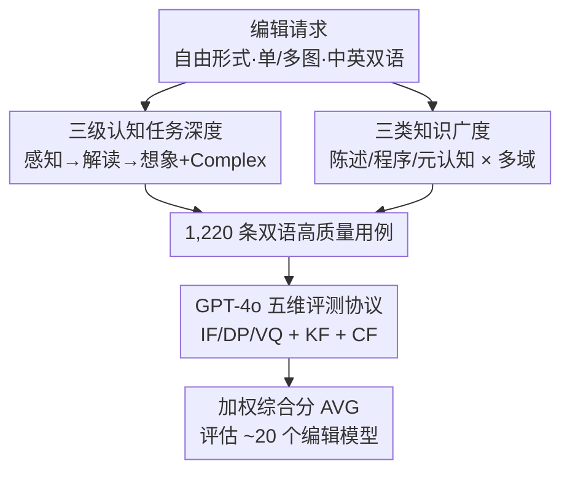

# WiseEdit: Benchmarking Cognition- and Creativity-Informed Image Editing

**会议**: CVPR 2026  
**论文**: [CVF Open Access](https://openaccess.thecvf.com/content/CVPR2026/html/Pan_WiseEdit_Benchmarking_Cognition-_and_Creativity-Informed_Image_Editing_CVPR_2026_paper.html)  
**代码**: https://github.com/beepkh/WiseEdit （数据集见 HuggingFace `123123chen/WiseEdit-Benchmark`）  
**领域**: 图像编辑 / 评测基准 / 多模态生成  
**关键词**: 图像编辑, 认知与创造力, 知识密集型评测, 多图输入, GPT-4o 评测

## 一句话总结
WiseEdit 把指令式图像编辑拆成「感知—解读—想象」三级认知步骤、配上「陈述性/程序性/元认知」三类知识，构建了 1,220 条中英双语、含 26% 多图输入的高难度评测集，用 GPT-4o 在五个维度（含自创的知识保真度 KF 与创造性融合 CF）打分，系统地暴露出当前 SOTA 编辑模型在知识推理与组合创作上的短板。

## 研究背景与动机
**领域现状**：指令式图像编辑近两年从早期只能做「加帽子/删物体」这类局部简单编辑，进化到由 MLLM + 大扩散模型驱动的「推理式编辑」。开源的 Bagel、Qwen-Image-Edit、OmniGen2 把视觉理解与生成统一进单一模型，闭源的 GPT-image-1、Nano Banana 更进一步，号称能做「认知与创造力驱动」的智能编辑——理解隐含意图、做多概念组合创作。

**现有痛点**：模型能力跑得很快，但评测基准跟不上。多数老 benchmark（MagicBrush、AnyEdit 类）用「一张图 + 一条直白指令明确说改哪个物体」的单一模板，几乎不需要任何认知或创造力；即便是较新的 KrisBench、RiseBench、IntelligentBench 引入了世界知识，也只是单图输入、只测「解读」这一环、不测元认知知识、且只有英文。

**核心矛盾**：一个真正的智能编辑过程需要走完「先看懂改哪 → 再想清怎么改 → 最后画出来」整条链，并且要调用不同层次的知识；而现有基准在**任务深度**（只覆盖中间一环）和**知识广度**（缺元认知、缺多语、缺多图组合）两个维度上都太窄，导致无法真实衡量模型的高阶能力。

**本文目标**：造一个同时具备高任务深度和宽知识广度的知识密集型基准，把编辑能力的各个面切开来逐一考查。

**切入角度**：类比人类的认知与创作过程，把编辑工作流分解为三个互相衔接的步骤——感知（Awareness，建立选择性视觉注意、定位修改目标）、解读（Interpretation，把指令解析成可执行的感知级视觉变化）、想象（Imagination，高保真渲染出创造性结果）；再正交叠加心理学里的三类知识。

**核心 idea**：用「三步认知分解 × 三类知识」的二维坐标系来设计任务，每一步都设计专门「卡住该步」的高难度题，并新增 KF/CF 两个针对知识与创造力的评测维度，从而把过去被一锅端的「编辑能力」拆解成可度量的子能力。

## 方法详解

### 整体框架
WiseEdit 不是一个模型而是一套评测基准，整体可以看成「沿两条正交坐标轴造题 → 汇成 1,220 条双语用例 → 用 GPT-4o 在五个维度打分 → 加权成总分」的流水线。第一条坐标轴是**任务深度**：把编辑拆成感知/解读/想象三步，再为每步单独造「让模型在这一步就栽跟头」的难题，外加一个三步都难的 WiseEdit-Complex。第二条坐标轴是**知识广度**：每条用例背后挂着陈述性/程序性/元认知三类知识之一，并横跨文化常识、自然科学、时空逻辑等多个领域。题目输入是自由形式（free-form），允许多图（用「第一张/第二张」这类序数词指代不同图、且不同图扮演「编辑目标」或「属性参考」的不同角色），并提供中英双语版本。最后用统一评测协议把每个模型的输出打成一个 0–100 的综合分。

### 关键设计

**1. 三级认知分解 + 四类任务：让每一步都成为独立考点**

针对老基准「只考解读、且解读也很浅」的痛点，WiseEdit 把编辑显式切成三步，并为每步造专门难题：**感知任务**不给明确空间线索，逼模型靠比较推理（「移除最开心的那个人」）、间接指代（「在地图上标出莎士比亚的故乡」）或跨图视觉对应来定位目标；**解读任务**的指令往往不直接说怎么改，要模型用世界知识把隐含意图翻成可执行动作（如纠错、做时间推移、预判一条看似简单指令引发的级联反应）；**想象任务**聚焦主体驱动的高难生成，要在保持主体身份的前提下改服装/姿态/视角、做多物体组合，甚至反直觉创作。在此之上再叠一个 **WiseEdit-Complex**——三步都不能轻松完成，必须把复杂推理和创造性生成揉在一起。这样的好处是，模型在哪一环掉链子能被精确定位，而不是只得到一个笼统的「编辑分」。WiseEdit-Complex 的多图占比也最高（整库 26% 用例为多图输入），显著拉高了组合难度。

**2. 三类知识体系 + 多域多语：把「知道什么/怎么做/何时用」都纳入考查**

这是 WiseEdit 相对 KrisBench 等的关键扩展。它把编辑所需的世界知识按认知心理学分成三层：**陈述性知识**（knowing what，事实与概念，如「中国国宝级动物」要知道指熊猫）、**程序性知识**（knowing how，把任务拆成多步流程的技能，如系统地把水彩画转成线稿）、**元认知知识**（knowing about knowing，自我调控——知道何时该调用陈述性还是程序性知识、怎么组合它们，典型是带条件分支的复杂指令「让女孩拿第二张图里最长的物体；若该物体能用来刷牙就面向镜头，否则背对镜头」）。其中元认知是几乎所有旧基准都漏掉的一层。这三类知识又横跨文化常识、自然科学、时空逻辑三大领域，且每条用例都给出中英两个版本，用来额外考查跨语言指令跟随能力。

**3. 五维评测协议 + KF/CF 新指标：用 GPT-4o 把知识与创造力单独量化**

针对「过去只看指令跟随/细节保持/画质，量不出知识对不对、创造力够不够」的痛点，WiseEdit 用 GPT-4o 作为评测器，在传统三项之外新增两个维度。三项传统指标是：指令跟随 **IF**（是否准确执行编辑请求）、细节保持 **DP**（与指令无关的部分是否被忠实保留）、视觉质量 **VQ**（自然度、有无瑕疵）。两项新指标是：**知识保真度 KF**（编辑结果是否符合真实世界逻辑与知识——物理/生物/化学/文化/常识正确性，评测时还会给一条 knowledge hint 作参照）、**创造性融合 CF**（相对原图的概念新颖性、表达变换与想象深度，衡量类人创造力）。每项按精心设计的 prompt 在 1–10 打分。综合分按任务自适应加权：

$$\text{AVG} = \frac{\text{IF} + \text{DP} + \text{VQ} + \alpha \cdot \text{KF} + \beta \cdot \text{CF}}{3 + \alpha + \beta}$$

其中 $\alpha,\beta\in\{0,1\}$——KF 只在感知/解读/Complex 任务上启用（$\alpha=1$），CF 只在想象/Complex 任务上启用（$\beta=1$），其余置 0。这样每个维度只在「该考它」的任务上参与计分，避免给纯生成题硬塞知识分或给纯感知题硬塞创造分。最终把 1–10 线性映射到 0–100 区间汇报。

## 实验关键数据

### 主实验
评测约 20 个主流编辑模型（论文 intro 称 21 个、17 开源 + 4 闭源；4.1 节写 20 个，⚠️ 以原文为准），覆盖纯扩散模型（MagicBrush、FLUX.1/2 Kontext 等）、统一理解-生成模型（Bagel、Qwen-Image-Edit、OmniGen2、DreamOmni2 等）与闭源模型（Nano Banana、Seedream 4.0、GPT-image-1、Nano Banana Pro）。下表为 WiseEdit 英文版总分（0–100，节选代表性模型）：

| 模型 | 类型 | 感知 AVG | 解读 AVG | 想象 AVG | 总分 AVG |
|------|------|---------|---------|---------|---------|
| MagicBrush | 扩散 | 37.8 | 38.1 | 30.5 | 35.5 |
| FLUX.2 Dev | 扩散 | 59.4 | 58.4 | 67.5 | 61.8 |
| Qwen-Image-Edit | 统一 | 62.5 | 54.1 | 63.8 | 60.2 |
| DreamOmni2 | 统一 | 63.5 | 60.0 | 58.2 | 60.6 |
| Nano Banana | 闭源 | 79.6 | 75.3 | 70.2 | 75.0 |
| GPT-image-1 | 闭源 | 83.3 | 74.9 | 77.6 | 77.6 |
| Nano Banana Pro | 闭源 | 87.3 | 83.3 | 76.6 | **82.4** |

WiseEdit-Complex（仅多图模型参与）整体更难，分数普遍跳水：

| 模型 | 英文 AVG | 中文 AVG | 总分 AVG |
|------|---------|---------|---------|
| AnyEdit | 8.7 | 8.2 | 8.5 |
| Qwen-Image-Edit | 53.8 | 53.4 | 53.6 |
| Bagel | 54.5 | 54.7 | 54.6 |
| Nano Banana | 69.6 | 66.6 | 68.1 |
| GPT-image-1 | 71.0 | 71.4 | 71.2 |
| Nano Banana Pro | 75.5 | 78.7 | **77.1** |

### 消融实验
论文用几组对照分析来验证「视觉理解驱动生成」并检验评测协议本身：

| 配置 / 分析 | 关键指标 | 说明 |
|------|---------|------|
| 评测协议 vs 人评（Pearson） | GPT-ours 相关性最高 | 比 GPT-Kris、Gemini-ours、Qwen-ours 都更贴近人评 |
| 关闭统一模型的 thinking | 全面显著掉分 | Bagel/DreamOmni2 去掉内置思考后在两套测试上都明显下降 |
| 单图 vs 多图输入 | 多图平均分显著更低 | 多图组合是拖累总分的主要场景 |
| 指令改写（注入知识提示，Bagel） | KF 50.2→78.4 (+28.2)，总分 51.3→65.8 (+14.5) | 开源模型靠外部知识提示能补齐推理短板 |
| 指令改写（GPT-image-1） | 总分 68.2→74.2 (+6.0) | 闭源模型增益小，因内部已具备相应知识 |

### 关键发现
- **闭源对开源仍是碾压级差距**：在三类任务、两种语言下，每个闭源模型都全面压制所有开源模型，连最弱的闭源模型都比最强开源模型在总分上高出近 15 分——反驳了某些基准上「开源已超闭源」的说法。
- **统一理解-生成架构是分水岭**：统一视觉理解+生成的模型普遍显著优于纯扩散模型（FLUX.2 Dev 是个例外的强扩散），且闭源强模型同样采用统一架构，说明强视觉理解与推理是实现高阶编辑的前提。
- **两大公认短板：知识保真度与创造性融合**。KF 反过来还会拖累 IF；元认知知识用例的表现明显弱于陈述性/程序性知识；想象任务上所有模型 CF 和 DP 都不过 80，细粒度主体驱动生成仍是未解问题。
- **「会想但不会做」现象**：部分闭源模型在 Complex 任务上 KF/CF 反而比简单任务更高，但 IF 大幅下滑——它们理解了意图、抓住了创意，却在执行层「有心无力」，牺牲了基本的指令跟随；逻辑类题（如火柴棍问题）是所有模型共同的能力边界。
- **顶级模型跨语言鲁棒**：尽管中文训练数据有限，头部统一/闭源模型在中英指令上表现相当，得益于强大的内置视觉理解模块带来的多语对齐。

## 亮点与洞察
- **把「编辑能力」做了可度量的解耦**：用「三步认知 × 三类知识」的二维坐标系造题，让一个模型在哪一环、哪类知识上掉链子可被精确定位，比一个笼统总分有用得多——这种「按能力维度切基准」的思路可迁移到视频编辑、3D 生成等任务。
- **KF / CF 两个新指标补上了知识与创造力的量化空白**，并用任务自适应加权 ($\alpha,\beta$) 只在合适的任务上启用，避免无意义打分；评测器选型还用人评 Pearson 相关性做了背书，比直接拍脑袋用某个 VLM 更可信。
- **指令改写实验是一个很有洞察的探针**：开源模型靠注入知识提示就能涨 ~15 分总分（KF +30），而闭源几乎不涨——干净地说明开源的瓶颈不在生成而在「内部推理/知识调用」，为后续工作指出了发力点。
- **多图 + 角色推断的任务设计贴近真实需求**：用序数词指代、不同图扮演目标/参考的不同角色，逼模型从指令里推断每张图的用途，这是单图基准测不到的。

## 局限与展望
- **依赖 GPT-4o 作为唯一评测器**：虽然做了人评相关性验证，但用一个闭源 VLM 给一堆生成模型打分，存在评测器自身偏好、对自家系列（GPT-image-1）潜在偏置以及版本漂移导致复现困难的风险。
- **模型数量统计前后不一致**（intro 21 个 vs 4.1 节 20 个），且评测的是各模型某一时间快照，结论随模型迭代会很快过时。
- **新指标 KF/CF 的打分仍是 prompt 工程驱动的软评估**，1–10 的分辨率和 prompt 设计对结果影响大，论文把细节放在附录，正文难以完全判断稳健性。
- **只诊断不给解法**：作为基准论文这无可厚非，但「会想不会做」「多图拖后腿」这些现象更深层的成因（是数据、架构还是对齐问题）留待后续；可改进方向是配套发布带细分能力标签的训练/诊断子集。

## 相关工作与启发
- **vs KrisBench / RiseBench / IntelligentBench**：它们也测知识驱动的推理编辑，但都是单图输入、火力集中在「解读」一环、不评元认知、且仅英文；WiseEdit 在任务深度（补齐感知+想象+Complex）、知识广度（补元认知 + 多域）、输入形态（多图，26% 占比）和语言（中英双语）四个维度上做了系统扩展。
- **vs MagicBrush / AnyEdit / UltraEdit 等老基准**：它们用「单图 + 直白指令」模板，几乎不需认知/创造力；WiseEdit 的「难例」专门设计成在某一认知步就卡住模型，难度与诊断粒度完全不同。
- **对编辑模型研发的启发**：结果强烈支持「统一理解-生成架构 + 强视觉理解」的技术路线；指令改写实验提示，短期内给开源模型外挂一个「知识/意图改写器」是性价比很高的补能力手段，而长期目标是把这种推理内化进模型本身。

## 评分
- 新颖性: ⭐⭐⭐⭐⭐ 首次把编辑拆成三级认知步骤并叠加三类知识造题，KF/CF 指标与多图/双语设计都是实打实的增量
- 实验充分度: ⭐⭐⭐⭐⭐ 覆盖约 20 个开闭源模型、中英双版、四类任务，含评测器对比/thinking 消融/指令改写等多角度分析
- 写作质量: ⭐⭐⭐⭐ 框架清晰、动机扎实，但模型数量前后不一致、KF/CF 实现细节多压在附录
- 价值: ⭐⭐⭐⭐⭐ 给智能图像编辑提供了一把能精确定位短板的「认知尺」，对评测与模型研发都有长期参考价值

<!-- RELATED:START -->

## 相关论文

- [\[CVPR 2026\] Omni IIE Bench: Benchmarking the Practical Capabilities of Image Editing Models](omni_iie_bench_benchmarking_the_practical_capabilities_of_image_editing_models.md)
- [\[CVPR 2026\] CompBench: Benchmarking Complex Instruction-guided Image Editing](compbench_benchmarking_complex_instruction-guided_image_editing.md)
- [\[CVPR 2025\] GRADE: Benchmarking Discipline-Informed Reasoning in Image Editing](../../CVPR2025/image_generation/grade_benchmarking_discipline-informed_reasoning_in_image_editing.md)
- [\[CVPR 2026\] Leveraging Verifier-Based Reinforcement Learning in Image Editing](leveraging_verifier-based_reinforcement_learning_in_image_editing.md)
- [\[CVPR 2026\] ChordEdit: One-Step Low-Energy Transport for Image Editing](chordedit_one-step_low-energy_transport_for_image_editing.md)

<!-- RELATED:END -->
