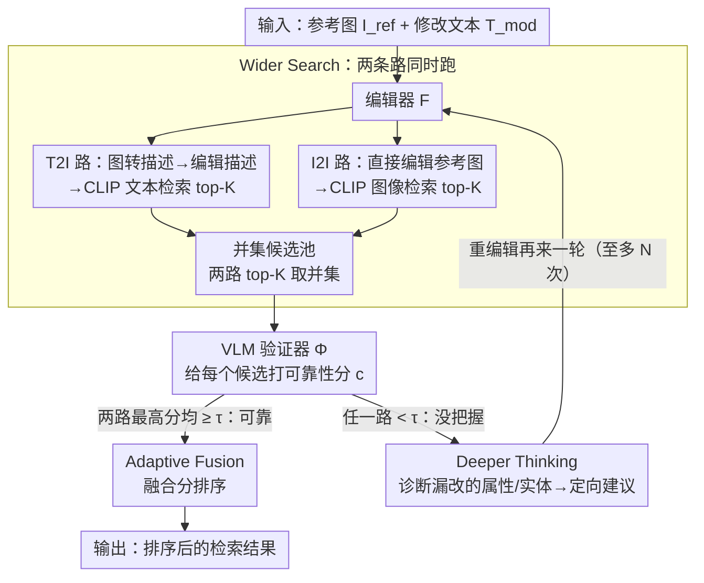

# WISER: Wider Search, Deeper Thinking, and Adaptive Fusion for Training-Free Zero-Shot Composed Image Retrieval

**会议**: CVPR 2026  
**arXiv**: [2602.23029](https://arxiv.org/abs/2602.23029)  
**代码**: [https://github.com/Physicsmile/WISER](https://github.com/Physicsmile/WISER)  
**领域**: 图像生成  
**关键词**: 组合图像检索, 零样本, T2I+I2I融合, 自反思精化, VLM验证, CLIP

## 一句话总结

提出 WISER，一个无训练的零样本组合图像检索（ZS-CIR）框架，通过"检索–验证–精化"迭代循环统一 T2I 和 I2I 双路径检索，利用 VLM 验证器显式建模意图感知和不确定性感知，实现自适应融合与结构化自反思精化。在 CIRCO mAP@5 上相对提升 45%，CIRR Recall@1 上相对提升 57%，甚至超越许多训练式方法。

## 研究背景与动机

**任务定义**：组合图像检索（CIR）给定参考图像 $I_{\text{ref}}$ + 修改文本 $T_{\text{mod}}$，检索匹配的目标图像。ZS-CIR 不依赖标注三元组，利用预训练模型的泛化能力。

**两大范式**：
   - **T2I 范式**（Text-to-Image retrieval）：将参考图像描述为文本，结合修改文本生成编辑描述，用文本向量做检索。擅长复杂语义修改，但丢失细粒度视觉细节。
   - **I2I 范式**（Image-to-Image retrieval）：用图像编辑模型直接编辑参考图像，用图像向量检索。保留视觉细节更好，但处理复杂组合编辑或模糊意图时表现差。

**核心矛盾**：现实查询意图多样，仅靠单一范式不够。已有融合方法（如 CIG、IP-CIR）存在两个关键缺陷：
   - **意图感知缺失**：采用静态固定权重融合，无法适应不同查询意图
   - **不确定性感知缺失**：忽略了各分支候选结果的可靠性差异

**本文方案**：设计"检索→验证→精化"的迭代闭环，用 VLM 验证器评估候选质量，对不确定结果触发结构化自反思精化，对可靠结果做自适应多层融合。全程无训练，模块化即插即用。

## 方法详解

### 整体框架

WISER 要解决的是组合图像检索里两条路各有死穴的老问题：T2I 范式能改复杂语义却丢视觉细节，I2I 范式能保细节却啃不动复杂组合，而已有融合方法（CIG、IP-CIR）用一套固定权重把两路硬拼，既不看查询意图、也不管候选可不可靠。WISER 的破法是把"检索"从一锤子买卖改成一个"检索→验证→精化"的迭代闭环——先把两条路一起跑、把召回面铺宽，再用一个 VLM 验证器给每个候选打可靠性分；可靠的就按分数自适应融合排序，不可靠的就反过来诊断哪里没改对、生成改进建议重编辑再来一轮。全程不训练任何参数，编辑器、验证器、精化器都是即插即用的现成模型。

形式化地，给定参考图像 $I_{\text{ref}}$ 和修改文本 $T_{\text{mod}}$，编辑器 $\mathcal{F}$ 分别产出编辑描述 $C_{\text{edit}}$ 和编辑图像 $I_{\text{edit}}$，再由 CLIP 的视觉/文本编码器 $E_{\text{img}}$、$E_{\text{txt}}$ 编码成查询向量 $q_v$、$q_t$，在数据库 $\mathcal{D}$ 里按余弦相似度各自检索。后续三个关键设计正好对应论文标题里的三个词：Wider Search 把候选面铺宽、Adaptive Fusion 做验证引导的融合排序、Deeper Thinking 对没把握的检索做自反思精化。

### 关键设计

**1. Wider Search：两条路同时跑，先把召回面铺宽**

单一范式总有盲区——T2I 改得动语义却丢细节，I2I 保得住细节却改不动复杂组合，到底哪条路对取决于这次查询的意图，事先没法定。WISER 干脆不二选一，而是让编辑器 $\mathcal{F}$ 同时走两条路。文本侧先用 BLIP-2 把参考图转成描述 $C_{\text{ref}}$，再融合修改文本生成编辑描述去做 T2I 检索；图像侧直接编辑参考图去做 I2I 检索：

$$C_{\text{edit}} = \mathcal{F}_{\text{txt}}(C_{\text{ref}}, T_{\text{mod}}), \qquad I_{\text{edit}} = \mathcal{F}_{\text{img}}(I_{\text{ref}}, T_{\text{mod}})$$

两条路各取 top-$K$ 候选 $\mathcal{R}_p = \{I_p^1, \ldots, I_p^K\}$（$p \in \{\text{T2I}, \text{I2I}\}$），并集成扩展候选池 $\mathcal{R}_{\text{union}} = \mathcal{R}_{\text{T2I}} \cup \mathcal{R}_{\text{I2I}}$。取并集而非二选一的意义在于：正确目标只要落进任意一条路的 top-$K$ 就不会被漏掉，召回上限被两条路的并集托住，把"选对路"这个难题推迟到后面有了验证信号再解决。

**2. Adaptive Fusion：先验证候选靠不靠谱，再决定怎么融**

这是 WISER 和 CIG / IP-CIR 这类固定权重融合拉开差距的核心。问题出在"靠谱"二字：两条路的候选质量是浮动的，一律等权平均会让某条路的噪声直接污染排序——消融里固定权重 AVG 的 CIRCO mAP@5 只有 13.53，比 T2I 单路的 17.28 还低，就是被这么拖垮的。WISER 的对策是先给每个候选量一个可靠性，再分两个粒度去用它。

可靠性来自一个 VLM 验证器 $\Phi$（Qwen2.5-VL-7B）：把三元组 $(I_{\text{ref}}, T_{\text{mod}}, I_p^k)$ 喂给它，问"这个候选是不是对参考图的正确修改"，取 yes/no 两个 token 的 logits 做 softmax 当置信度：

$$c_p^k = \frac{\exp(\ell_{p,k}^{(\text{yes})})}{\exp(\ell_{p,k}^{(\text{yes})}) + \exp(\ell_{p,k}^{(\text{no})})}$$

有了 $c_p^k$，融合分两层走。Branch 层管"要不要信这条路"：每条路取最高置信候选当伪目标 $I_p^* = \arg\max_k c_p^k$，把这个最高分 $r_p = \max_k c_p^k$ 当整条路的可靠性，只要 $\min(r_{\text{T2I}}, r_{\text{I2I}}) < \tau$（任一路没把握）就转交 Deeper Thinking 去精化。Candidate 层管"可靠时怎么排"：对两条路都过关的检索，把同一候选在两路的置信度相加得融合分 $c_{\text{fused}}^k = c_{\text{T2I}}^k + c_{\text{I2I}}^k$，再按字典序三元键排序：

$$\Psi(I^k) = \left(-c_{\text{fused}}^k, \ -\max(c_{\text{T2I}}^k, c_{\text{I2I}}^k), \ -c_{\text{T2I}}^k\right)$$

主键是融合分，意味着两条路都认可的候选自然排最前（语义为主的编辑 T2I 给分高、视觉为主的 I2I 给分高，两边都高的才是真正对齐意图的那个）；平局时再用单路最高分、最后用 T2I 分逐级消歧。两个粒度各管一件正交的事——Branch 层判不确定性、Candidate 层对意图——恰好是固定权重融合一次性丢掉的两个信息。

**3. Deeper Thinking：没把握时，像人一样回头找哪里改错了**

当某条路 $r_p < \tau$、检索没把握时，WISER 不认栽，而是触发一个 LLM 精化器（默认 GPT-4o）做三步结构化自反思。第一步**找该改什么**：拿 $C_{\text{ref}}$ 和 $T_{\text{mod}}$ 对照，把预期修改拆成结构化短语——属性变化（"红→蓝"）和实体增删（"加一顶帽子"）。第二步**看结果错在哪**：取伪目标 $I_p^*$ 的描述，和第一步的修改短语逐条比对，挑出漏掉或改错的点。第三步**给针对性建议**：对没满足的修改生成改进意见，T2I 侧去增强编辑描述、I2I 侧去补视觉指导，把建议拼到修改文本后面重新送进编辑器，再跑一轮，直到达到最大迭代次数 $N$。它有效是因为把"重试"从盲目重采样换成了有诊断的定向修正——验证器先告诉它哪条路没把握，精化器再具体指出是哪个属性/实体没改到位，下一轮编辑就有了明确靶子，而这一切不需要任何训练数据。

### 一个完整示例

设想查询「一张红色连衣裙的图 + 把裙子改成蓝色并加一条腰带」，看候选怎么一步步收敛到正确目标（置信度为示意值，仅用于看清流程）：

1. **Wider Search**：T2I 路把参考图描述成"红色连衣裙"，融合修改文本生成"蓝色连衣裙配腰带"的编辑描述去检索；I2I 路直接把图编辑成蓝裙加腰带去检索。两路各取 $K=50$ 个候选，并集得到约 $50\sim100$ 个候选。
2. **验证评分**：验证器对每个候选回答"是否正确修改"。比如"蓝裙但没腰带"那张，T2I 给 $c=0.55$、I2I 给 $c=0.82$；"蓝裙带腰带"那张两路都给到 0.9 上下。
3. **Branch 层判可靠性**：若两条路的最高置信度都 $\ge \tau=0.7$，说明这次检索靠谱，直接进融合；若 I2I 最高分掉到 0.6 < 0.7，就触发 Deeper Thinking。
4. **Candidate 层融合排序**（可靠分支）："蓝裙带腰带"那张融合分 $0.9+0.9=1.8$，排到"蓝裙没腰带"那张 $0.55+0.82=1.37$ 前面，正确目标升到 top-1。
5. **Deeper Thinking**（不可靠时，默认 $N=1$ 一轮）：精化器对比后发现"腰带"这个实体没被加上，于是建议 T2I 描述强调"with a belt"、I2I 提供加腰带的视觉指导，重编辑后再检索一轮。

实际中 Deeper Thinking 只对低置信样本触发，精化率低于 30%，绝大多数查询走完前四步就结束。

### 实现细节

| 组件 | 具体模型 |
|------|---------|
| 编辑器 $\mathcal{F}$ | BAGEL（统一文本编辑 + 图像编辑） |
| 验证器 $\Phi$ | Qwen2.5-VL-7B |
| 精化器 Refiner | GPT-4o |
| Captioner | BLIP-2 |
| 检索模型 | CLIP ViT-B/32 / ViT-L/14 / ViT-G/14 |

候选池大小 $K=50$，可靠性阈值 $\tau=0.7$，精化迭代 $N=1$（默认一轮）。单卡 NVIDIA H20 上每 1% 性能提升约需 0.5 GPU 小时；由于 Deeper Thinking 只对低置信样本触发，整体精化率低于 30%，额外开销可控。

## 实验

### 主实验 — CIRCO 和 CIRR 基准（Table 1）

| 方法 | Backbone | Free | CIRCO mAP@5 | CIRCO mAP@25 | CIRR R@1 | CIRR R@5 | CIRR R_sub@1 |
|------|----------|------|-------------|-------------|----------|----------|-------------|
| CIReVL | ViT-L/14 | ✓ | 18.57 | 20.89 | 24.55 | 52.31 | 59.54 |
| LDRE | ViT-L/14 | ✓ | 23.35 | 26.44 | 26.53 | 55.57 | 60.43 |
| IP-CIR | ViT-L/14 | ✓ | 26.43 | 29.87 | 29.76 | 58.82 | 62.48 |
| CoTMR | ViT-L/14 | ✓ | 27.61 | 30.61 | 35.02 | 64.75 | 69.39 |
| **WISER** | **ViT-L/14** | **✓** | **35.10** | **38.46** | **49.23** | **76.72** | **77.81** |
| CoTMR | ViT-G/14 | ✓ | 32.23 | 35.60 | 36.36 | 67.52 | 71.19 |
| IP-CIR | ViT-G/14 | ✓ | 32.75 | 36.86 | 39.25 | 70.07 | 69.95 |
| **WISER** | **ViT-G/14** | **✓** | **36.53** | **40.46** | **49.54** | **77.40** | **78.10** |

### 主实验 — Fashion-IQ 基准（Table 2, ViT-L/14）

| 方法 | Free | Shirt R@10 | Dress R@10 | Toptee R@10 | Avg R@10 | Avg R@50 |
|------|------|-----------|-----------|------------|---------|---------|
| CIReVL | ✓ | 29.49 | 24.79 | 31.36 | 28.55 | 48.57 |
| LDRE | ✓ | 31.04 | 22.93 | 31.57 | 28.51 | 50.54 |
| CoTMR | ✓ | 35.43 | 31.18 | 38.55 | 35.05 | 57.09 |
| **WISER** | **✓** | **43.13** | **38.42** | **45.39** | **42.17** | **58.51** |

### 消融实验 — 核心组件效果（Table 3, ViT-B/32）

| T2I | I2I | Deeper Thinking | Fusion | FIQ Avg R@10 | CIRCO mAP@5 |
|-----|-----|----------------|--------|-------------|-------------|
| ✗ | ✓ | ✗ | — | 22.65 | 7.00 |
| ✗ | ✓ | ✓ | — | 23.58 | 7.57 |
| ✓ | ✗ | ✗ | — | 28.59 | 17.28 |
| ✓ | ✗ | ✓ | — | 29.22 | 17.64 |
| ✓ | ✓ | ✗ | AVG（固定权重） | 33.40 | 13.53 |
| ✓ | ✓ | ✗ | ADA（自适应） | 40.83 | 31.32 |
| ✓ | ✓ | ✓ | ADA（完整 WISER） | **41.99** | **32.23** |

### 模块兼容性消融（Table 4, CIRCO, ViT-B/32）

| Editor | Verifier | Refiner | mAP@5 | mAP@25 |
|--------|----------|---------|-------|--------|
| BAGEL | Qwen2.5-VL-7B | Qwen-Turbo | 32.80 | 35.21 |
| BAGEL | Qwen2.5-VL-7B | GPT-3.5-Turbo | 32.57 | 35.13 |
| BAGEL | Qwen2.5-VL-7B | GPT-4o | 32.23 | 34.82 |
| BAGEL | Qwen2-VL-7B | GPT-4o | 25.50 | 28.41 |
| BAGEL | Qwen2.5-VL-3B | GPT-4o | 27.50 | 30.16 |
| BAGEL | Qwen2.5-VL-32B | GPT-4o | 31.69 | 34.22 |
| GPT4o+OmniGen2 | Qwen2.5-VL-7B | GPT-4o | 31.18 | 33.82 |
| GPT4o+Step1X-Edit | Qwen2.5-VL-7B | GPT-4o | 31.91 | 34.92 |

### 关键发现

1. **WISER 大幅领先所有无训练方法**：CIRCO mAP@5 从 CoTMR 的 27.61→35.10（ViT-L/14, +27%），CIRR R@1 从 35.02→49.23（+41%）
2. **超越大量训练式方法**：如 LinCIR、IP-CIR（trained）、AutoCIR 等需要训练的方法也被无训练的 WISER 超过
3. **朴素融合有害**：固定权重 AVG 融合的 CIRCO mAP@5 仅 13.53，反而**低于 T2I 单路径的 17.28**，说明噪声干扰导致朴素融合退化
4. **自适应融合是核心贡献**：ADA 从 AVG 的 13.53 跃升至 31.32（+131%），验证引导融合远优于固定权重
5. **Deeper Thinking 稳定提升**：完整模型比去掉精化的版本高约 1 个 mAP 点，且对单路径也有帮助
6. **模块可替换性强**：更换 refiner 性能差异极小（32.21-32.80），验证即插即用特性
7. **验证器规模并非越大越好**：Qwen2.5-VL-32B 反而略低于 7B（31.69 vs 32.23），可能存在 overthinking
8. **一轮精化即够**：$N=1$ 获得大部分收益，继续迭代收益递减
9. **跨 backbone 一致优势**：ViT-B/32 到 ViT-G/14 均大幅领先，方法泛化性强

## 亮点与洞察

- **"检索-验证-精化"迭代范式**：将组合图像检索从一次性查询升级为可迭代闭环思考，模拟人类"尝试-评估-改进"的认知模式
- **VLM 验证器的创新用法**：不只用 VLM 做检索或生成，还用其 logits 做二元判断来估计候选可靠性，将判断能力转化为不确定性信号
- **反直觉发现揭示问题本质**：固定权重平均融合比单路径更差的现象，深刻揭示了 T2I/I2I 两条路径存在噪声冲突，自适应融合不是锦上添花而是必需品
- **多层融合设计精巧**：Branch-level 判断路径可靠性 + Candidate-level 融合分排序，两个粒度分别解决不确定性和意图匹配两个正交问题
- **完全无训练+模块化**：所有组件均可替换为更强的现成模型，框架具有持续进化能力

## 局限与展望

1. **推理延迟较大**：每次查询需调用 captioner+editor+dual retrieval+VLM verifier+可能的 refiner，延迟远高于单路径方法
2. **依赖闭源 API**：refiner 默认使用 GPT-4o，增加成本和部署复杂度（虽然 Qwen-Turbo 也可用）
3. **验证器二元判断粒度粗**：yes/no 的 logits 对微妙视觉差异可能不够敏感
4. **精化依赖 caption 而非图像**：refiner 分析基于伪目标的 caption 描述而非直接分析图像，caption 的信息损失可能导致精化方向偏差
5. **大规模数据库效率未验证**：当前最大数据库约 12 万图像（CIRCO），百万级数据库的效率未知
6. **阈值 $\tau$ 需手动设定**：虽然 0.5-0.7 范围内稳定，但最优值随数据集变化

## 评分

- 新颖性: ⭐⭐⭐⭐ "检索-验证-精化"的迭代范式新颖，多层融合策略精巧，但单个组件均为现有模型的组合
- 实验充分度: ⭐⭐⭐⭐⭐ 3个基准×3个backbone、消融覆盖组件/模块选择/阈值/迭代次数、与训练式方法全面对比
- 写作质量: ⭐⭐⭐⭐ 框架图清晰，T2I/I2I 互补性分析逻辑自洽，定量结果与定性 case 配合好
- 价值: ⭐⭐⭐⭐ 强大的无训练 ZS-CIR 新基线，"验证引导融合"思路可推广到其他多模态检索，但推理延迟限制实际部署

<!-- RELATED:START -->

## 相关论文

- [\[NeurIPS 2025\] Instance-Level Composed Image Retrieval](../../NeurIPS2025/image_generation/instance-level_composed_image_retrieval.md)
- [\[CVPR 2026\] RAISE: Requirement-Adaptive Evolutionary Refinement for Training-Free Text-to-Image Alignment](raise_requirement-adaptive_evolutionary_refinement_for_training-free_text-to-ima.md)
- [\[CVPR 2026\] CaReFlow: Cyclic Adaptive Rectified Flow for Multimodal Fusion](careflow_cyclic_adaptive_rectified_flow_for_multimodal_fusion.md)
- [\[CVPR 2026\] TAP: A Token-Adaptive Predictor Framework for Training-Free Diffusion Acceleration](tap_a_token-adaptive_predictor_framework_for_training-free_diffusion_acceleratio.md)
- [\[CVPR 2026\] Taming Video Models for 3D and 4D Generation via Zero-Shot Camera Control](taming_video_models_for_3d_and_4d_generation_via_zero-shot_camera_control.md)

<!-- RELATED:END -->
