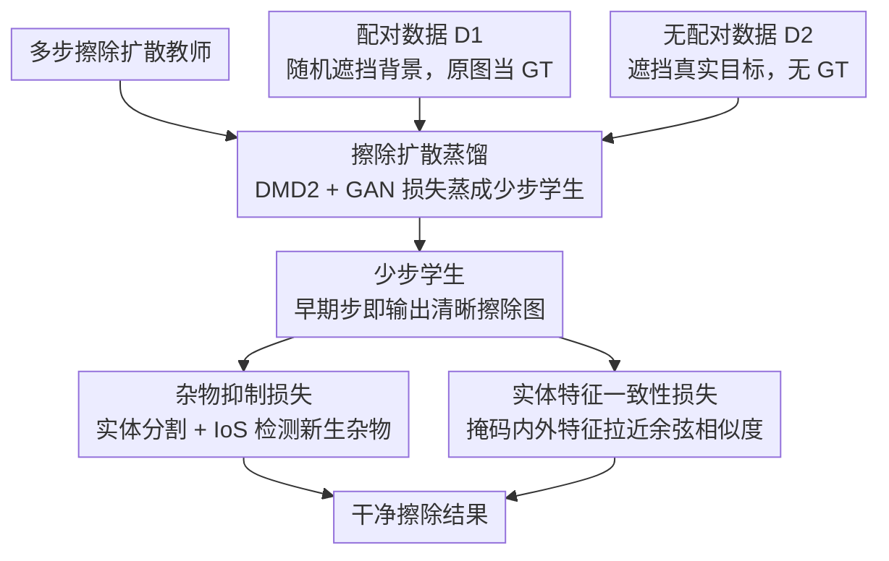

# YOEO: You Only Erase Once - Erasing Anything without Bringing Unexpected Content

**会议**: CVPR 2026  
**arXiv**: [2603.27599](https://arxiv.org/abs/2603.27599)  
**代码**: [https://zyxunh.github.io/YOEO-ProjectPage/](https://zyxunh.github.io/YOEO-ProjectPage/)  
**领域**: 图像生成 / 图像编辑  
**关键词**: 目标擦除, 扩散蒸馏, 幻觉抑制, 实体一致性, 无配对训练

## 一句话总结

YOEO 提出一个单次擦除框架，通过将多步扩散模型蒸馏为少步模型实现高效推理，并设计杂物抑制损失（基于实体分割检测新生成的不应出现的物体）和实体特征一致性损失（确保擦除区域与周围语义一致），解决扩散模型在目标擦除中的幻觉问题。

## 研究背景与动机

扩散模型在图像修复方面表现优异，但用于目标擦除时常"画蛇添足"——移除目标物体后在掩码区域生成不应存在的新物体。现有闭源方案（ChatGPT、Nano Banana）效果好但计算开销大，不适合边缘设备部署。

**两个根本原因**：(1) 缺乏真实擦除数据——合成配对数据（随机遮挡+原图做GT）不能代表真实擦除场景；(2) SFT 只教模型"去噪"而非"擦除"——像素级重建损失不包含"不应生成新物体"的约束。

## 方法详解

### 整体框架

YOEO 要解决的是扩散擦除模型"移除目标却又凭空补出新物体"的幻觉问题，而且要做到边缘可部署的高效推理。整体思路是：先拿一个预训练的多步擦除扩散模型当教师，把它蒸馏成只跑少数几步的学生模型；然后在学生模型上叠加两个专门针对"幻觉"的损失。训练同时喂两类数据——配对数据 $\mathcal{D}_1$ 随机遮挡背景区域、用原图当 GT，负责保住基本的修复能力；无配对数据 $\mathcal{D}_2$ 直接遮挡真实目标物体、没有 GT，靠后面两个损失提供监督信号。关键的串接点在于：蒸馏让少步学生在很早的去噪步就能吐出清晰图，于是"这张擦除结果里有没有冒出杂物、填得和周围搭不搭"才有得评估，无配对数据的端到端监督也才跑得通。

### 关键设计

**1. 擦除扩散蒸馏：把多步教师压成少步，顺便打通无配对监督**

边缘部署要求推理快，所以第一步是把多步扩散模型蒸馏成少步学生，框架沿用 DMD2 加 GAN 损失。但这里蒸馏不只是为了提速——更要紧的副作用是，多步扩散在早期去噪步输出的是一张模糊的中间态，根本没法判断"擦干净了没""有没有多长出东西"；而少步学生在头几步就能给出清晰结果。正是这个清晰的早期输出，才让后面的杂物检测和一致性评估有了可评估的对象，把无配对数据的端到端监督从"不可能"变成"可能"。

**2. 杂物抑制损失（Sundries Suppression Loss）：让模型知道"什么不该出现"**

像素级重建损失只会教模型"把图补得像原图"，却完全不懂"擦除区域里不该有独立物体"这条擦除任务最核心的约束。这个损失的做法是：拿一个预训练实体分割模型去切擦除结果，对每个切出来的实体 $S_i$ 算它和修复掩码 $M$ 的 IoS（Intersection over Segment，交集占实体自身的比例）：

$$\text{IoS}(S_i, M) = \frac{|S_i \cap M|}{|S_i|}$$

> ⚠️ IoS 的精确定义式以原文为准。

一旦某个实体的 IoS 超过阈值 $\lambda$，就说明它主要落在本该被擦空的掩码里，判定为新冒出来的"杂物"，据此构造损失去惩罚。这等于把"擦除区域不应存在独立实体"这条人类先验，外包给一个现成的分割器自动检测，比手写规则更鲁棒也更通用。

**3. 实体特征一致性损失（Entity Feature Coherence Loss）：填进去的内容要和周围搭**

就算没冒出杂物，如果掩码里填的内容在风格/语义上和周围环境格格不入，这次擦除照样算失败。于是再从预训练分割网络里抽特征，比较掩码内生成区域和掩码外原始区域的特征——若两者语义一致，它们应当聚向同一个表示中心，体现为高余弦相似度；损失就去拉近这两组特征。这一项补的是杂物抑制管不到的"和谐感"，确保擦完之后那块区域看起来像原本就属于这张图。

### 损失函数 / 训练策略

总损失把 LPIPS 蒸馏损失、DMD 损失、GAN 损失、杂物抑制损失和实体特征一致性损失加在一起；训练时配对数据 $\mathcal{D}_1$ 与无配对数据 $\mathcal{D}_2$ 交替投喂——前者守住修复质量，后者靠两个幻觉损失把"别乱补东西"教进去。

## 实验关键数据

### 主实验

| 方法 | 擦除干净度 | 语义一致性 | 推理速度 | 说明 |
|------|-----------|-----------|---------|------|
| SmartEraser | 低 | 低 | 慢 | 容易生成杂物 |
| ASUKA | 中 | 中 | 慢 | MAE+扩散 |
| **YOEO** | **高** | **高** | **快（少步）** | 单次干净擦除 |

YOEO 在定量和定性指标上全面超越现有方法。

### 消融实验

| 配置 | 杂物率↓ | 一致性↑ | 说明 |
|------|--------|---------|------|
| 仅蒸馏 | 高 | 低 | 和教师模型一样有幻觉 |
| + 杂物抑制损失 | 显著降低 | 低 | 有效减少杂物 |
| + 实体一致性损失 | 显著降低 | 高 | 语义一致性增强 |
| 完整 YOEO | 最低 | 最高 | 两个损失互补 |

### 关键发现

- 蒸馏为少步模型是启用无配对监督的前提——多步扩散的中间状态太模糊无法做有意义的评估
- 杂物抑制损失的贡献最大，说明"不生成新物体"是擦除任务最核心的约束
- 实体特征一致性提供了"和谐感"，防止填充区域与周围环境格格不入

## 亮点与洞察

- **从"去噪"到"擦除"的认知转变**：传统像素级重建损失只教模型"修复图像"，YOEO 通过杂物检测和一致性约束显式教模型"什么不该做"
- **蒸馏的意外价值**：蒸馏不仅加速推理，更启用了之前不可能的端到端无配对训练——这一洞察可迁移到其他需要端到端评估的生成任务
- **实体分割作为通用评估器**：用预训练分割模型自动检测"不该出现的东西"，比人工设计规则更鲁棒更通用

## 局限与展望

- 依赖实体分割模型的质量——如果分割模型漏检或误检会影响损失准确性
- 单次擦除对极大面积的擦除区域可能不够
- 少步蒸馏可能损失部分生成细节
- 未来可探索视频中的目标擦除（时序一致性）

## 相关工作与启发

- **vs SmartEraser**: SmartEraser 合成配对数据+目标prompt，YOEO 无需配对数据且不需要显式prompt
- **vs ASUKA**: ASUKA 用MAE+扩散减少幻觉，YOEO 用杂物抑制损失更直接
- **vs TurboFill**: TurboFill 专注于高效扩散修复，但没有擦除专用的约束

## 评分

- 新颖性: ⭐⭐⭐⭐ 杂物抑制损失和蒸馏启用无配对训练的思路有创意
- 实验充分度: ⭐⭐⭐⭐ 对比充分，定性结果有说服力
- 写作质量: ⭐⭐⭐⭐ 问题分析透彻
- 价值: ⭐⭐⭐⭐ 实际编辑应用价值高

<!-- RELATED:START -->

## 相关论文

- [\[CVPR 2026\] You Only Erase Once: Erasing Anything without Bringing Unexpected Content](you_only_erase_once_erasing_anything_without_bringing_unexpected_content.md)
- [\[CVPR 2026\] WaDi: Weight Direction-aware Distillation for One-step Image Synthesis](wadi_weight_direction-aware_distillation_for_one-step_image_synthesis.md)
- [\[CVPR 2026\] DUO-VSR: Dual-Stream Distillation for One-Step Video Super-Resolution](duo-vsr_dual-stream_distillation_for_one-step_video_super-resolution.md)
- [\[CVPR 2026\] PortraitDirector: A Hierarchical Disentanglement Framework for Controllable and Real-time Facial Reenactment](portraitdirector_a_hierarchical_disentanglement_framework_for_controllable_and_r.md)
- [\[CVPR 2026\] MRT: Masked Region Transformer for Layered Image Generation and Editing at Scale](mrt_masked_region_transformer_for_layered_image_generation_and_editing_at_scale.md)

<!-- RELATED:END -->
