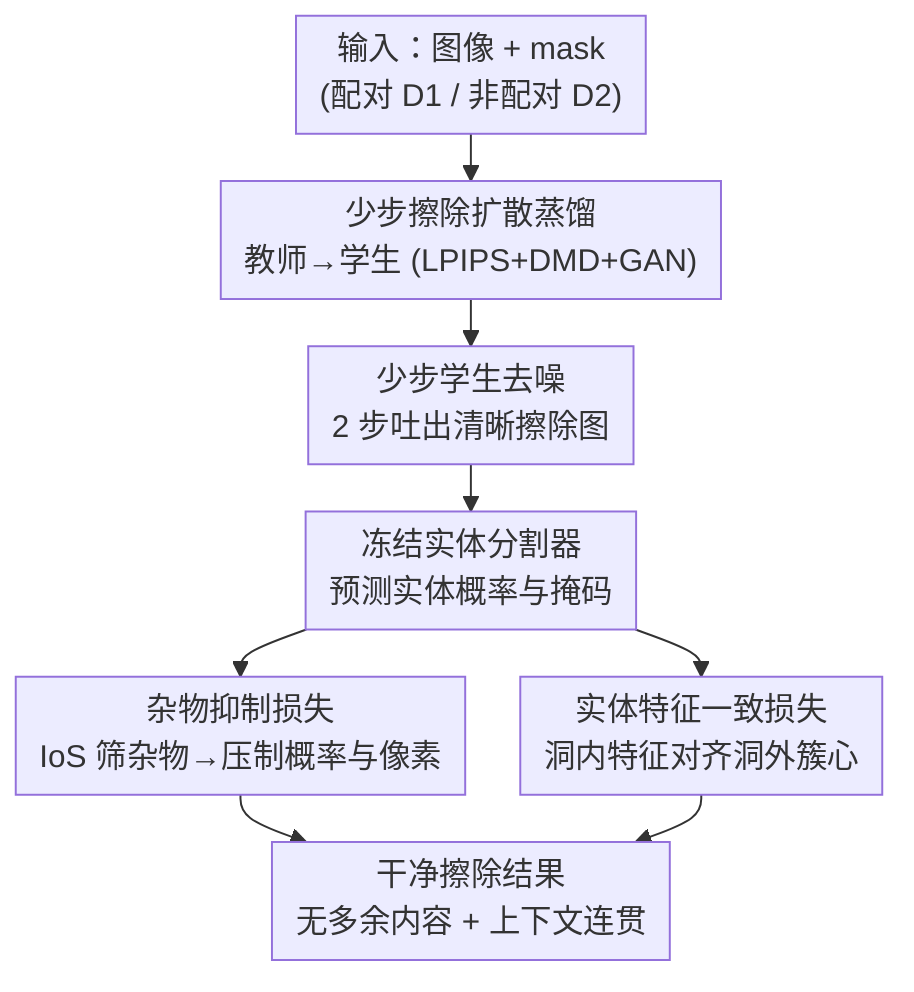

# You Only Erase Once: Erasing Anything without Bringing Unexpected Content

**会议**: CVPR 2026  
**论文**: [CVF Open Access](https://openaccess.thecvf.com/content/CVPR2026/html/Zhu_You_Only_Erase_Once_Erasing_Anything_without_Bringing_Unexpected_Content_CVPR_2026_paper.html)  
**代码**: https://zyxunh.github.io/YOEO-ProjectPage/ (有)  
**领域**: 扩散模型 / 图像编辑 / 物体擦除  
**关键词**: 物体擦除, 扩散蒸馏, 非配对监督, 杂物抑制, 实体一致性

## 一句话总结
YOEO 用一个**仅靠真实图像、没有"擦除后真值"的非配对数据**训练出来的少步扩散擦除模型，靠"杂物检测器 + 实体一致性"两个无需配对的监督信号，把物体一次性干净擦掉而不冒出多余内容，参数只有 860M 却在杂物指标上把 12B 的 Flux 系方法甩开一大截。

## 研究背景与动机

**领域现状**：物体擦除（object erasure）是图像编辑的基础能力——给一张图和一个 mask，要把 mask 里的物体抹掉并把空洞补成自然背景。早期靠 GAN inpainting，纹理糊、有伪影；如今主流换成文生图扩散模型做迭代去噪，细节真实得多，成了事实标准。

**现有痛点**：扩散擦除有个顽固毛病——**幻觉**：把目标物体去掉后，模型常在原地"脑补"出一个新物体或一团伪影（图 1 里 SmartEraser、ASUKA 都在 mask 区域生成了不该有的东西），结果与上下文不一致。闭源大模型（ChatGPT、Nano Banana）擦得干净，但参数巨大、推理昂贵，没法部署到边缘设备。

**核心矛盾**：作者把幻觉归到两个根因。其一，几乎所有扩散擦除模型都只在**合成配对数据**上训——把干净图随机挖洞或贴物体，再拿原图当真值。但真实世界里"擦除后的真值"根本不存在，这种合成数据无法表达真实擦除场景。其二，现有方法只用 **SFT**（监督微调），让模型从噪声里重建干净图、用 MSE/LPIPS 这类像素损失。这只教会了模型"去噪"，从没教它"擦除"这个任务目标本身——去掉物体的同时保持上下文连贯。于是模型学到的是 denoise，而不是 erase。

**本文目标**：造一个专用擦除模型，既要擦得比 SOTA 干净，又要参数少、延迟低；关键是要能利用真实图像训练，绕开"配对真值不存在"这个死结。

**切入角度**：既然没有真值，那就不要监督"擦成什么样"，而是监督"擦得对不对"。作者借鉴 reward-based 思路，引入一个**杂物检测器**自动判断生成图里有没有冒出多余物体；再用预训练实体分割模型抽特征，衡量补全区域和周围是否语义连贯。这两个信号都不需要配对真值。

**核心 idea**：用"杂物抑制 + 实体特征一致"这种 **pair-free（免配对）的擦除导向监督**，配合少步扩散蒸馏，让模型在真实非配对数据上学会"干净地擦"而非"重建"。

## 方法详解

### 整体框架

YOEO 给定一个预训练擦除扩散模型 $G_{init}$ 当教师，把它微调蒸馏成一个少步学生模型 $G_\theta$。训练数据分两份：合成配对集 $D_1=\{(X^i, Y^i, M^i)\}$（随机挖洞、原图当真值，提供像素级对应）和真实非配对集 $D_2=\{(X^j, M^j)\}$（mask 直接取自图中真实实体掩码，**没有**擦除真值）。整套方法分两条监督线并行：一条是 **Erasure Diffusion Distillation**，用 LPIPS / DMD / GAN 三个蒸馏损失把多步教师压成少步学生；另一条是 **Entity-Coherent Erasure**，用一个冻结的实体分割器同时驱动"杂物抑制损失 $\mathcal{L}_{SS}$"和"实体特征一致损失 $\mathcal{L}_{EFC}$"，专门治幻觉。

为什么非要先做少步蒸馏？因为杂物检测器要在生成图上跑分割，可标准多步扩散在去噪早期产出的是糊成一团的中间图，根本看不清有没有杂物，没法把检测器的反馈端到端回传。先蒸馏成少步学生（推理 2 步），让模型在很早就吐出清晰结果，才能把"杂物感知"的梯度直接灌进训练。整个 pipeline 如下：

### 关键设计

**1. 双数据集 + 免配对监督：把"没有擦除真值"这个死结绕开**

这是全文的根。配对集 $D_1$ 通过 $X^i = (1-M^i)\odot Y^i$ 随机遮挡背景区域构造，有真值，用来先把教师微调到擦除域、并稳定地蒸馏学生。但 $D_1$ 是合成的、不代表真实擦除。真正的创新在 $D_2$：它的 mask 直接采样自原图里的真实实体掩码 $M^{entity}$，目标是擦掉这些真实物体——可这些物体擦掉后长什么样**没有任何真值**。作者的办法是：对 $D_2$ 不用像素重建损失，改用后面两个 pair-free 损失来判"擦得对不对"。这样模型第一次能在大规模真实图像（基于 Open Images 的 1.75M 图）上学擦除，而不是被困在合成洞里学去噪。

**2. 杂物抑制损失 $\mathcal{L}_{SS}$：用 IoS 自动认出"擦完冒出来的多余物体"并打压**

针对的痛点是幻觉——擦完原地生出新物体。怎么定义"多余物体（sundry）"？把学生生成图 $\hat{X}$ 喂给预训练 Mask2Former 分割器 $S_\theta$，得到每个实体的概率 $P=\{(p_0^i,p_1^i)\}$ 和掩码 $M$。一个实体如果**几乎整个落在 mask 内部**，就八成是擦除时新冒出来的，用 Intersection over Self（IoS）来量化：

$$\text{IoS}(m^i, m_{in}) = \frac{|m^i \cap m_{in}|}{|m^i|}$$

杂物集合判定为 $I=\{i \mid \text{IoS}(m^i,m_{in})>\lambda,\ p_1^i>\tau\}$（取 $\lambda=0.9$，$\tau=0.2$）。认出杂物后，损失一边逼模型抬高"非杂物"概率 $p_0^i$，一边直接压低预测杂物掩码上的像素激活：

$$\mathcal{L}_{SS} = \sum_{i\in I}\left[-\alpha_i \log p_0^i - \sum_{x,y}\frac{\log(1-m_{x,y}^i)}{h\times w}\right]$$

其中 $\alpha_i$ 按该实体占图面积加权。它有效是因为反馈精准到"哪块是杂物"，而不是像 MSE 那样笼统地压整张图——等于给了模型一个明确的"别在这儿造东西"的信号。

**3. 实体特征一致损失 $\mathcal{L}_{EFC}$：让补出来的内容和周围"是同一个东西"**

只压杂物还不够，补全区域还得和周围背景/相邻物体语义连贯。作者利用一个观察：现代分割器（如 Mask2Former）用最后一层特征生成掩码，**同一实体的像素特征天然聚成一簇**。于是对每个实体，在洞外可见区域 $R^i_{out}=m_{out}\odot m^i_{entity}$ 上取平均特征当作该实体的簇心：

$$f^i = \frac{1}{N_{pix}}\sum_{(x,y)\in R^i_{out}} F^{seg}_{x,y}$$

再让洞内区域 $R^i_{in}=m_{in}\odot m^i_{entity}$ 的特征用余弦相似度对齐到这个簇心：

$$\mathcal{L}_{EFC} = -\sum_i \sum_{(x,y)\in R^i_{in}} \frac{F^{seg}_{x,y}\cdot f^i}{\|F^{seg}_{x,y}\|\,\|f^i\|}$$

直觉很顺：如果擦除区被正确地补成了背景或相邻物体的延续，它在分割器眼里就应该和洞外那块属于同一簇。用特征对齐而非像素对齐，正好规避了"没有像素真值"的问题。

**4. 少步擦除扩散蒸馏：把多步教师压成 2 步清晰学生，才让前两个损失跑得起来**

这一步既是效率手段，更是让杂物检测可行的前提。框架基于 Flash Diffusion，学生 $G_\theta$ 从教师 $G_{init}$ 初始化、共享结构。蒸馏损失先让学生单步输出对齐教师多步预测 $\mathcal{L}_{distill}=\mathbb{E}[d(\text{ODE}(x_t,G_{init},t,c), G_\theta(x_t,t,c))]$（$d$ 默认用 LPIPS）；再加 DMD 用 KL 散度对齐师生分布，$\nabla\mathcal{L}_{DMD}=\mathbb{E}[-(s_{real}(y)-s_{fake}(y))\nabla G_\theta(x_t,t,c)]$；最后在隐空间加 GAN 损失提质。压成少步后，学生在去噪极早期就能吐出清晰图，分割器才看得清杂物、$\mathcal{L}_{SS}$ 的梯度才能端到端回传——这正是标准多步扩散做不到的（早期中间图太糊）。

### 损失函数 / 训练策略

总损失把蒸馏和擦除监督合在一起：

$$\mathcal{L} = \lambda_1\mathcal{L}_{distill} + \lambda_2\mathcal{L}_{DMD} + \lambda_3\mathcal{L}_{GAN} + \lambda_{SS}\mathcal{L}_{SS} + \lambda_{EFC}\mathcal{L}_{EFC}$$

经验取 $\lambda_1=1,\lambda_2=0.7,\lambda_3=0.3,\lambda_{SS}=\lambda_{EFC}=0.5$；$\mathcal{L}_{SS}$、$\mathcal{L}_{EFC}$ 用 VAE 训练里的梯度归一化策略动态调权以稳住训练。基座是 Stable Diffusion Inpainting 1.5，AdamW（lr $1\times10^{-5}$，weight decay 0.01），推理用 LCM scheduler、步数 2，单张 A100。训练分三阶段：① 教师在合成配对集上微调（batch 1000，800 iter）；② 学生从教师拷权重，用配对数据蒸馏（教师 DPMSolver++ 20 步，timestep 在 249/499/749/999 附近采样、warm-up 渐增高噪概率，batch 8，15000 iter）；③ 联合训练，配对+非配对一起上，非配对数据在 step 999 喂纯噪声并引入 pair-free 损失——EFC 用于两个数据集，SS 只用于真实数据（batch 7，3600 iter）。

## 实验关键数据

评测在 COCO val2017（3985 样本）和 Entity Segmentation 测试集（670 样本）上，都只用 "thing"（物体）掩码做擦除。由于真实数据没有擦除真值，全用 pair-free 指标：**MSN**（平均杂物数）、**MARS**（杂物平均面积比）衡量"有没有冒出多余物体"，**CFD** 衡量上下文一致性（还能测幻觉），**FID** 衡量整体生成质量。

### 主实验

| 数据集 | 指标 | YOEO(860M) | EntityErasure(2.6B) | OmniPaint(11.9B Flux) | ASUKA(11.9B Flux) |
|--------|------|-----------|---------------------|----------------------|-------------------|
| EntitySeg | MSN↓ | **0.049** | 0.122 | 0.336 | 0.699 |
| EntitySeg | MARS↓ | **0.005** | 0.037 | 0.045 | 0.233 |
| EntitySeg | CFD↓ | **0.311** | 0.363 | 0.407 | 0.565 |
| COCO | MSN↓ | **0.22** | 0.51 | 1.47 | 1.49 |
| COCO | MARS↓ | **0.017** | 0.086 | 0.111 | 0.318 |
| COCO | CFD↓ | **0.528** | 0.584 | 0.705 | 0.794 |
| - | 推理时间(s)↓ | **0.21** | 2.38 | 14.0 | 8.01 |

在杂物指标 MSN/MARS 上 YOEO 几乎是数量级领先：COCO 上 MARS 0.017，比 12B 的 OmniPaint（0.111）低近 7 倍；CFD（上下文一致性）也全面最低。FID 上 YOEO（COCO 22.7、EntitySeg 58.8）略逊于 Flux 系（FID 是整体图像质量，与"是否冒杂物"不完全同向），作者解释 SD-1.5 基座指令跟随能力本就弱于 12B Flux，但仍以远少的参数拿到更一致的擦除。推理 0.21s，比 OmniPaint 快约 67 倍。

### 消融实验

| EFC | SS | D2(真实非配对) | MSN↓ | MARS↓ | CFD↓ |
|-----|----|----------------|------|-------|------|
| ✗ | ✗ | ✗ | 0.330 | 0.0883 | 0.434 |
| ✓ | ✗ | ✗ | 0.193 | 0.0525 | 0.367 |
| ✓ | ✗ | ✓ | 0.079 | 0.0174 | 0.350 |
| ✗ | ✓ | ✓ | 0.136 | 0.0168 | 0.354 |
| ✓ | ✓ | ✓ | **0.049** | **0.0050** | **0.311** |

### 关键发现
- **三个组件缺一不可，且 SS+EFC+D2 协同才达到最优**：纯蒸馏 baseline（全 ✗）MSN 0.330；只加 EFC 降到 0.193；再叠 SS 与真实数据 D2 后骤降到 0.049、MARS 到 0.005。EFC 让补全语义连贯、先压一波杂物；SS 用预测杂物掩码精准打压、把杂物指标再砍一大截。
- **真实非配对数据 D2 是放大器**：只在合成配对 D1 上用 SS/EFC 提升有限，加入 D2 后 MSN/MARS/CFD 同步显著下降——印证了"在真实图像上学擦除"才是关键，合成洞撑不起真实场景。
- **跨域泛化强**：在动画、水彩、素描、海报等非自然图上同样擦得干净（图 6），多物体擦除也稳。
- **对比条件引导式方法更鲁棒**：EntityErasure/GeoRemover 先预测擦后分割/深度再生成，初始条件预测不准就连带失败（蛋挞例子里残留轮廓）；YOEO 把实体分割只当"评估器"、把引导融进生成训练，反而擦得掉。

## 亮点与洞察
- **把"没有真值"从绊脚石变成设计前提**：核心洞见是不监督"擦成什么"，而监督"擦得对不对"（有没有冒杂物、是否与周围同簇），这让真实图像首次可用于训练擦除模型——思路可迁移到任何"逆向编辑、真值不可得"的任务（去水印、去阴影、去反光）。
- **少步蒸馏是杂物检测的使能前提，而不只是提速**：先把模型压清晰，检测器才看得清、reward 才回传得了。"想用感知模型当 reward，就得先让生成器早期输出可被感知"这个因果链很值得记。
- **用现成分割器一鱼两吃**：同一个冻结 Mask2Former，既靠 IoS 当杂物检测器（$\mathcal{L}_{SS}$），又靠它最后一层特征"同实体聚簇"的性质当一致性度量（$\mathcal{L}_{EFC}$），零额外标注。
- **小模型打赢大模型的样本**：860M 的 SD-1.5 在杂物/一致性指标上压过 12B Flux 系和闭源多模态大模型，说明擦除这类受限编辑任务，专用 reward 设计比堆参数更划算。

## 局限与展望
- 作者承认：在物体密集、交互复杂的场景，杂物仍可能残留（EFC 单独时尤其）。
- FID（整体生成质量）略逊于 Flux 系，受限于 SD-1.5 基座的指令跟随与生成上限；想兼顾极致画质可能要换更强基座。
- 杂物判定强依赖 IoS 阈值 $\lambda=0.9$、$\tau=0.2$ 与实体分割器质量：若分割器漏检/误检，SS 监督会跟着失真；对分割器训练分布外的物体类别可能失效。
- $\mathcal{L}_{SS}$ 假设"几乎全落在 mask 内的实体"就是杂物，但若用户本意是擦掉前景、露出一个本就该出现在洞里的背景小物体，这一假设可能误伤——擦除"意图"无法从 IoS 区分。

## 相关工作与启发
- **vs EntityErasure / GeoRemover（条件引导式）**：它们先显式预测擦后实体分割 / 深度图再据此生成，把分割/深度当"前置条件"；YOEO 把实体分割降级为训练期的"评估器/reward"，引导直接进生成过程。区别在于：前者一旦条件预测错就连环失败，后者更鲁棒（蛋挞例子）。
- **vs SmartEraser**：SmartEraser 靠"贴物体"合成配对数据、把被擦物体当 prompt 显式指明；YOEO 不依赖合成配对，转而用真实非配对数据 + pair-free reward，更贴近真实擦除分布。
- **vs ASUKA**：ASUKA 用 MAE + 扩散减少幻觉、但参数达 12B；YOEO 用 SS 损失显式打压杂物，860M 即超越。
- **vs 扩散蒸馏（DMD2 / Flash Diffusion / TurboFill）**：这些是通用提速蒸馏，YOEO 在 Flash Diffusion 基座上**加进擦除专属的 pair-free 监督**，把"快"和"擦得干净"统一在一次蒸馏里。

## 评分
- 新颖性: ⭐⭐⭐⭐⭐ "免配对的杂物抑制 + 实体一致"重定义了擦除监督，绕开真值不可得的死结，思路有迁移性。
- 实验充分度: ⭐⭐⭐⭐ 两数据集、9 个 baseline、清晰的三因子消融，跨域泛化也验了；超参敏感性放在补材稍可惜。
- 写作质量: ⭐⭐⭐⭐ 动机—根因—对策链条清楚，公式与图配合到位。
- 价值: ⭐⭐⭐⭐⭐ 860M 干净擦除、0.21s 推理、压过 12B 模型，部署友好且方法可复用。

<!-- RELATED:START -->

## 相关论文

- [\[CVPR 2026\] YOEO: You Only Erase Once - Erasing Anything without Bringing Unexpected Content](yoeo_you_only_erase_once_erasing_anything_without_bringing_unexpected_content.md)
- [\[CVPR 2026\] PortraitDirector: A Hierarchical Disentanglement Framework for Controllable and Real-time Facial Reenactment](portraitdirector_a_hierarchical_disentanglement_framework_for_controllable_and_r.md)
- [\[CVPR 2026\] MRT: Masked Region Transformer for Layered Image Generation and Editing at Scale](mrt_masked_region_transformer_for_layered_image_generation_and_editing_at_scale.md)
- [\[CVPR 2026\] WaDi: Weight Direction-aware Distillation for One-step Image Synthesis](wadi_weight_direction-aware_distillation_for_one-step_image_synthesis.md)
- [\[CVPR 2026\] DUO-VSR: Dual-Stream Distillation for One-Step Video Super-Resolution](duo-vsr_dual-stream_distillation_for_one-step_video_super-resolution.md)

<!-- RELATED:END -->
