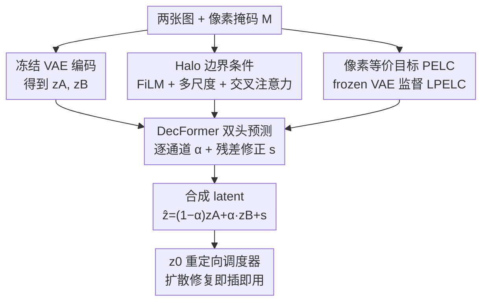

# Your Latent Mask is Wrong: Pixel-Equivalent Latent Compositing for Diffusion Models

**会议**: CVPR 2026  
**论文**: [CVF Open Access](https://openaccess.thecvf.com/content/CVPR2026/html/Bradbury_Your_Latent_Mask_is_Wrong_Pixel-Equivalent_Latent_Compositing_for_Diffusion_CVPR_2026_paper.html)  
**关键词**: 潜空间合成, 扩散修复, VAE, 软掩码, 即插即用

## 一句话总结
这篇论文指出"在 VAE 潜空间里按掩码线性插值两个 latent"这个被广泛使用的修复/编辑套路在数学上是错的，提出"潜空间合成应当与像素空间合成等价（Pixel-Equivalent）"的原则，并用一个仅 7.7M 参数、不动主干的 transformer（DecFormer）学出这个等价算子，把掩码边界误差降低最多 53%，且 FLOP 开销仅约 3.5%。

## 研究背景与动机

**领域现状**：现代图像生成几乎都是潜空间扩散模型（LDM），在一个 8 倍下采样的预训练 VAE 的 latent 空间里去噪。做带掩码的生成任务（inpainting、局部编辑）时，主流做法是把 latent 当成"伪像素"——把像素掩码 $M$ 下采样到 latent 分辨率得到 $m$，然后在每个采样步对新旧 latent 做凸组合 $z_{t-1}=(1-m)\odot\hat z+m\odot z^{orig}$。这套路在 Diffusers、商业产品、学术 pipeline 里几乎是默认操作。

**现有痛点**：这种"像混像素一样混 latent"的启发式（heuristic blending）会在掩码缝处产生明显的光晕（halo）、颜色漂移和模糊；更糟的是论文发现**离掩码很远的背景区域**也会被全局性地劣化、变色。同时把像素掩码下采样 8 倍会丢掉细结构——启发式掩码根本无法表达比 $1/8$ 分辨率更细的边界，高分辨率修复因此发虚。

**核心矛盾**：根本原因是现代 VAE 解码器 $D$ 是**非线性、空间纠缠**的，不是"把 latent 当下采样图像"那么简单。论文用有效感受野（ERF）分析量化了这点：Flux VAE 的 latent 不只覆盖对齐的 $8\times8$ patch，编码器单个 latent 位置感受野约 217 像素、解码器单个 latent 的"影响域"约 536 像素，能量曲线呈"尖核 + 长尾"。因此线性混 latent **不保证**等于按掩码混像素：

$$E(x_A\oplus_M x_B)\neq (1-m)\cdot E(x_A)+m\cdot E(x_B)$$

论文进一步证明：对非线性解码器，存在 $z_A,z_B,M$ 使得**任何** $\alpha\in[0,1]$ 的凸插值都无法做到像素等价。而且软掩码场景下，超过一半的 voxel 需要落在 $[0,1]$ 之外的混合系数才能还原真值编码——凸插值在原理上就不够用。

**本文目标 / 切入角度**：与其去训练一个巨大的、感知掩码的去噪主干（ControlNet、BrushNet、Flux-Fill 这类动辄上亿到 120 亿参数、要多卡训练），作者把问题重新定义为"修掉融合算子本身"——掩码几何的拼接质量应该由一个轻量、可即插即用的 latent 算子负责，语义内容仍交给原主干。

**核心 idea**：把"潜空间合成应当像素等价"形式化为可训练目标，用冻结的 VAE 做像素级监督，学出一个真正等价的 latent 合成算子，从而无需微调主干就拿到全分辨率掩码控制和真·软边界 alpha 合成。

## 方法详解

### 整体框架

方法分两层。**原则层 PELC**：定义"什么样的 latent 算子才算对"——对任意像素操作 $F$，其 latent 对应算子 $C_F$ 应满足解码等价（DE）与编码等价（EE）：

$$D(C_F(z))=F(D(z)),\qquad C_F(E(x))=E(F(x))$$

修复就是 $F(x_A,x_B,M)=(1-M)\odot x_A+M\odot x_B$ 这个特例。**实例层 DecFormer**：一个 7.7M 参数的 transformer，吃进两张图的 latent $(z_A,z_B)$ 和像素掩码 $M$，输出**逐通道混合权重** $\alpha$ 和一个**残差修正** $s$，预测合成 latent $\hat z=(1-\alpha)z_A+\alpha z_B+s$。训练时用冻结 VAE 把"像素合成结果"编码成目标 latent $z_T=E(F(x_1,x_2,M))$ 来监督，让"先合成再解码"逼近"像素空间直接合成"。整条 pipeline 对扩散主干即插即用、不微调主干、推理时只是替换掉那一步启发式 blending。

### 关键设计

**1. 像素等价目标 PELC：把"latent 算子对不对"变成可优化的监督信号**

痛点是没人定义过"latent 合成什么时候算正确"，于是大家默认线性插值，错而不自知。PELC 给出判据：合成后解码要等于像素空间合成（DE），编码合成图要等于合成编码（EE）。训练目标把两边都管住：

$$\mathcal L_{PELC}=\lambda_E\,\mathcal L_E+\mathcal L_D,\quad \mathcal L_E=\mathbb E\,\|\hat z-z_T\|_2^2,\quad \mathcal L_D=\mathbb E\big[\mathcal L_{LPIPS}(\hat x,x_T)+\lambda_H\,\mathcal L_{Halo\text{-}L1}(\hat x,x_T)\big]$$

其中 $z_T=E(F(x_1,x_2,M))$ 是"像素合成→再编码"得到的目标 latent，$\hat x=D(\hat z)$、$x_T=D(z_T)$。这里有个关键 trick：监督用的目标是**编码-解码后的**像素 $x_T=D(z_T)$ 而非原始像素合成图，这样 VAE 自身的重建误差在两边相消、不会污染目标。之所以有效，是因为它直接逼着模型去满足"解码后逐像素对齐"，而不是去满足"latent 数值接近"这种与人眼无关的代理目标——后者正是线性插值出问题的根源。

**2. α 与残差 s 的双头分解：用凸混合扛大头、用残差修非线性弯曲**

痛点是单纯学一个混合权重不够（凸插值原理上做不到等价），但完全自由地预测整张 latent 又重又难训。作者观察到启发式广播掩码的误差**高度集中在掩码边界**，于是把合成算子分解成两部分：逐通道、全 latent 分辨率的混合权重 $\alpha\in[0,1]^{C\times h\times w}$ 负责回收绝大部分合成信号，残差 $s\in\mathbb R^{C\times h\times w}$ 负责补上解码器曲率带来的"离轴"修正：

$$\hat z=(1-\alpha)z_A+\alpha z_B+s$$

注意 $\alpha$ 是**逐通道**而非广播单通道掩码——这恰好对应"现代 VAE 通道异质"的事实。论文给出 $(\alpha^*,s^*)$ 的闭式分解，消融（Table 1）显示去掉残差 $s$（只留无约束 $\alpha$）会让所有指标显著变差（LPIPS 0.030→0.051）。这套分解的好处是把"能线性的地方就线性、难啃的边界才动用残差"显式拆开，既轻量又可分阶段训练，可视化也证实模型确实主要在边界和软掩码区才大量启用 $s$。

**3. Halo 边界条件 + 多尺度架构：把算力精准砸在会出错的缝隙上**

痛点是误差因通道纠缠而集中在掩码边缘，均匀对待整图既浪费又修不准。作者沿掩码边界算一条约 8 像素宽、softly 衰减的"halo"带。它有双重身份：一是通过 FiLM 直接条件化 $\alpha$ 和 $s$，让两个头都"知道"自己在不在边界附近；二是当作损失加权，把误差权重压在朴素插值最容易翻车的区域。架构上，DecFormer 每个 block 喂进一个丰富特征栈——$(z_A,z_B)$、当前 $(\alpha,s)$、以及误差线索 $\|z^{(t)}-z_A\|$、$\|z^{(t)}-z_B\|$；多尺度 patch 尺寸 $[4,2,1,1]$ 让粗尺度便宜地收集全局上下文、patch=1 细化像素级边界，unpatch 后再用局部卷积压掉 1–2 像素光晕。交叉注意力（对掩码 token）只放在 patch=1 的细尺度 block——全局 block 已能通过 FiLM 拿到粗掩码嵌入，唯有像素级编辑需要注意力提供的精确空间对齐，这样既省算力又保边界保真。

**4. z0 重定向调度器：把"在 z0 上训练的合成器"无缝插进逐步去噪**

痛点是 DecFormer 是在**无噪 latent** $z_0$ 上训练的，可扩散采样每一步面对的是带噪 $z_t$，不能直接套用。作者把调度步改写成"先预测干净、在干净处合成、再重新加噪"三步：(A) 由速度场预测 $z_0^\theta=z_t-t\,v_\theta(z_t,t)$；(B) 在 $z_0$ 上用 DecFormer 合成 $z_0^\star=(1-\alpha)\odot z_0^\theta+\alpha\odot z_0^{ref}+s$；(C) 把速度重定向到落在合成后的 $z_0^\star$ 上并步进一步：

$$v^\star=\frac{z_t-z_0^\star}{t},\qquad z_{t'}=z_t+(t'-t)\,v^\star$$

这样 DecFormer 就成了采样过程中启发式 blending 的直接替身，每步都在语义正确的干净 latent 上做几何正确的合成，而不是在带噪 latent 上盲混。

### 损失函数 / 训练策略
- 损失见上：latent MSE（$\mathcal L_E$）+ 像素 LPIPS + halo 加权 L1（$\mathcal L_D$）。
- **Alpha-Shift 分阶段**：先只训 $\alpha$，等其收敛后再逐步打开残差头 $s$，并渐进引入 halo 加权损失专注边界残差——避免两个头互相干扰。
- 训练：H100，batch 8，约 $8\times10^4$ 步（约 128 epoch）；多分辨率 256–384、宽高比 $[0.5,2.0]$；掩码做边缘检测（0–15%）与羽化增强；AdamW + 余弦 SGDR 热重启。
- 数据：Flickr30k 3 万张自然图 + WikiArt 1 万张 + 10 万张内部高分辨率图；掩码取自 P3M、GFM 与程序化随机形状。

## 实验关键数据

### 主实验：合成保真度（1024px，COCO-2017 + Compositions-1k 掩码）

| 掩码类型 | 方法 | SSIM ↑ | PSNR ↑ | LPIPS ↓ | Halo L1 ↓ |
|----------|------|--------|--------|---------|-----------|
| 软掩码 σ=21 | DecFormer | **0.985** | **41.3** | **0.027** | **0.018** |
| 软掩码 σ=21 | Heuristic | 0.941 | 32.9 | 0.088 | 0.050 |
| 二值 | DecFormer | **0.964** | **35.7** | **0.045** | **0.060** |
| 二值 | Heuristic | 0.913 | 28.4 | 0.110 | 0.141 |
| 原始 | DecFormer | **0.968** | **38.6** | **0.049** | **0.037** |
| 原始 | Heuristic | 0.918 | 31.1 | 0.104 | 0.080 |
| 细掩码 | DecFormer | **0.967** | **34.7** | **0.045** | **0.073** |
| 细掩码 | Heuristic | 0.920 | 27.3 | 0.111 | 0.174 |

四类掩码、全分辨率下 DecFormer 全面胜出，边界 Halo L1 普遍腰斩（如细掩码 0.174→0.073），PSNR 提升 6–8 dB。

### 作为扩散修复先验（COCO-2017 val，掩码面积 > 15%）

| 方法 | SSIM ↑ | PSNR ↑ | LPIPS ↓ | FID ↓ |
|------|--------|--------|---------|-------|
| Heuristic（启发式） | 0.643 | 13.58 | 0.354 | 23.51 |
| DecFormer（主干冻结） | 0.682 | 13.94 | 0.314 | 20.56 |
| LoRA only（无合成器） | 0.653 | 14.16 | 0.331 | 21.52 |
| Flux.1-Fill（全量微调参考） | 0.681 | 16.75 | 0.313 | 19.34 |
| DecFormer + LoRA | 0.680 | 14.23 | **0.303** | **19.28** |

不动主干的 DecFormer 在各项上都优于启发式基线；再加一个轻量 LoRA，感知质量（LPIPS/FID）已能比肩甚至略超全量微调的 Flux.1-Fill（120 亿参数专用修复模型），但像素级 PSNR 仍弱于后者。

### 消融实验（Table 1，80k 步，3 seed）

| 配置 | Halo L1 ↓ | LPIPS ↓ | MSE ↓ | 说明 |
|------|-----------|---------|-------|------|
| Baseline（α+s+halo） | 0.0829 | 0.0303 | 0.0303 | 完整模型 |
| 去掉 Halo L1 损失 | 0.0973 | 0.0299 | 0.0297 | 全局指标持平，但边界质量变差 |
| 无约束 α、去掉残差 s | 0.1079 | 0.0514 | 0.0331 | 所有指标显著恶化 |

### 关键发现
- **残差头 $s$ 是不可省的**：去掉后 LPIPS 从 0.030 暴涨到 0.051、Halo L1 升到 0.108——印证"凸插值原理上做不到像素等价"，必须有离流形修正。
- **Halo 损失专修边界**：去掉它全局 LPIPS/MSE 几乎不变，但 Halo L1 明显变差，说明它的作用精准落在边缘而非全图。
- **误差来源在边界**：用符号距离场（SDF）分析发现启发式基线在距离=0 处有显著误差尖峰且衰减很慢，DecFormer 峰值更低、衰减更陡；可视化显示模型确实在边缘/软掩码区才大量启用残差 $s$。
- **DecFormer 与 LoRA 互补**：LoRA 管掩码内部"画什么"（语义合理性），DecFormer 管"怎么缝"（边界几何），两者正交叠加。
- **PELC 可泛化到非合成编辑**：在 gamma/对比度/亮度复合的参数化色彩变换上，PELC 训练的算子能高保真复现目标变换，而直接在 latent 上施加该变换会灾难性劣化——证明像素等价是个通用配方，不止用于合成。

## 亮点与洞察
- **"指出一个被默认的错误"本身就很有价值**：几乎所有 inpainting pipeline 都在做的"latent 按掩码线性插值"被严格证明在现代 VAE 上不成立，这种"皇帝新衣"式的洞察比堆指标更有冲击力。
- **用冻结 VAE 自监督构造目标**，监督信号取自 $D(E(\cdot))$ 而非原图，让 VAE 重建误差两边相消——这个细节是让目标"干净"的关键，可迁移到任何"想在 latent 空间复刻某个像素操作"的任务。
- **α（凸混合）+ s（残差）的分解**优雅地把"能线性的部分"和"非线性弯曲修正"解耦，既轻量又可分阶段训练，是把"原理上不可能完美"转化为"工程上够用"的典型手法。
- **极致性价比**：7.7M 参数（主干的 0.07%）、3.5% FLOP 开销，却把边界误差降 53%——与 ControlNet/Flux-Fill 这类重量级方案形成鲜明对比，思路是"修融合算子"而非"重训生成"。

## 局限与展望
- **只修融合、不管语义**：PELC 解决的是"怎么缝"，大范围、依赖上下文的语义编辑仍需感知掩码的去噪主干，DecFormer 无能为力。
- **像素等价原理上不可达**：VAE 有损压缩 + 有限 latent 分辨率，残差误差只能最小化不能消除；表现为 DecFormer+LoRA 的 PSNR 仍明显低于全量微调的 Flux-Fill。
- **VAE 覆盖面有限**：主要在 Flux VAE 上验证（附录补了 Qwen Image VAE），更广泛 VAE 上的泛化仍需检验。
- **可扩展方向**：作者提出把 PELC 推广到空间形变、时序一致的视频编辑等更多 latent 算子，以及"把 PELC 放进 ControlNet/inpainting 模型的训练回路里"以降低任务难度、加速收敛。

## 相关工作与启发
- **vs Flux-Fill / SD-inpaint / BrushNet / PowerPaint**: 它们靠新增上亿参数、多卡微调主干来教会模型掩码感知；本文反过来"修融合算子"，主干冻结、只加 7.7M 参数即插即用，维护成本和算力都低一个量级。
- **vs SDEdit / DiffEdit / Blended Diffusion（轨迹级编辑）**: 这些方法在去噪轨迹里拼接/调制 latent，但每步仍用单通道下采样掩码合成，解码器非局部感受野照样耦合改动与未改动区、产生光晕；本文从原理上强制像素等价，直击这个共性病根。
- **vs Differential Diffusion**: 它把软插值换成时序调度的硬交换，但仍在下采样、广播掩码下改动子集 latent，边界伪影类别相同；DecFormer 是逐通道、全分辨率 + 残差，跳出了"广播单通道掩码"的框。
- **vs LatentPaint**: 减轻了训练负担但仍把缝合质量交给去噪器的广播 latent 掩码；本文把缝合质量从去噪器手里接管过来。

## 评分
- 新颖性: ⭐⭐⭐⭐⭐ 把"latent 线性插值"这个全行业默认操作证伪并给出像素等价原则与轻量解，视角独到。
- 实验充分度: ⭐⭐⭐⭐ 多掩码类型 + 修复先验 + 色彩变换泛化 + SDF/ERF 分析齐全，但多在 Flux VAE 上，跨 VAE 验证偏少。
- 写作质量: ⭐⭐⭐⭐⭐ 从原理（DE/EE）到病理分析到方法到实验逻辑闭环，公式与图证一一对应。
- 价值: ⭐⭐⭐⭐⭐ 即插即用、开销极小、可比肩全量微调修复模型，对整个 LDM 编辑生态都有直接落地价值。

<!-- RELATED:START -->

## 相关论文

- [\[CVPR 2026\] SpeeDiff: Scalable Pixel-Anchored End-to-End Latent Diffusion Model](speediff_scalable_pixel-anchored_end-to-end_latent_diffusion_model.md)
- [\[CVPR 2026\] FlashDecoder: Real-Time Latent-to-Pixel Streaming Decoder with Transformers](flashdecoder_real-time_latent-to-pixel_streaming_decoder_with_transformers.md)
- [\[CVPR 2026\] Latent Diffusion Inversion Requires Understanding the Latent Space](latent_diffusion_inversion_requires_understanding_the_latent_space.md)
- [\[CVPR 2026\] LacTokGen: Latent Consistency Tokenizer for 1024-pixel Image Generation by 256 Tokens](lactokgen_latent_consistency_tokenizer_for_1024-pixel_image_generation_by_256_to.md)
- [\[CVPR 2026\] Vision Foundation Models Can Be Good Tokenizers for Latent Diffusion Models](vision_foundation_models_can_be_good_tokenizers_for_latent_diffusion_models.md)

<!-- RELATED:END -->
