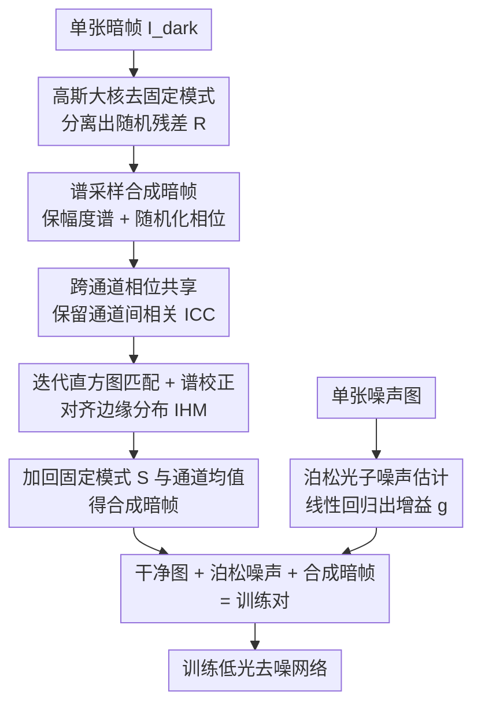

# 2-Shots in the Dark: Low-Light Denoising with Minimal Data Acquisition

**会议**: CVPR 2026  
**论文**: [CVF Open Access](https://openaccess.thecvf.com/content/CVPR2026/html/Lu_2-Shots_in_the_Dark_Low-Light_Denoising_with_Minimal_Data_Acquisition_CVPR_2026_paper.html)  
**代码**: https://github.com/IVRL/2-Shots-in-the-Dark  
**领域**: 图像恢复 / 低光去噪 / 噪声合成  
**关键词**: 低光去噪、传感器噪声合成、傅里叶谱采样、随机相位、暗帧

## 一句话总结
这篇论文提出一种"两张图就够"的传感器噪声合成方法——每个 ISO 只需一张噪声图 + 一张暗帧，用傅里叶域随机相位采样把信号无关噪声当作纹理来合成，配合迭代直方图匹配修正边缘分布，从而无需大规模配对数据就能生成无限多样的训练对，让去噪网络在多个低光基准上达到物理类方法的 SOTA。

## 研究背景与动机

**领域现状**：低光 RAW 图像因光子数少、传感器噪声强而极其嘈杂，学习型去噪器要训练就得有大量"干净-噪声"配对图像，而采集这种配对需要三脚架 + 遥控逐场景拍摄，极其费时。于是"噪声合成"成了主流替代路线：给一张干净图，合成出逼真的噪声版本，从而凭空造出训练对。

**现有痛点**：传感器噪声是多种噪声源之和，可拆成**信号相关**（主要是光子散粒噪声）和**信号无关**两部分。信号无关那部分最难——它混杂了暗电流噪声、热噪声、复位噪声、条带（banding）噪声等。已有路线各有硬伤：①参数化物理模型（ELD、SFRN）表达力不足，且要做繁琐的逐传感器多参数标定；②学习型模型（GAN、normalizing flow、扩散）虽更准，但 GAN 训练不稳、flow 表达力受架构限制、扩散生成慢，而且**全都仍然依赖大量真实配对数据**来学噪声分布。

**核心矛盾**：想要噪声建模"既准又省数据"——准就得放弃简化参数模型、转向数据驱动，但数据驱动又把"省数据"这个初衷给丢了。SFRN 试图折中（从 10 张暗帧里裁 patch 采样信号无关噪声），但 10 张暗帧裁出来的噪声样本多样性有限。

**本文目标**：把信号无关噪声的合成压到极致——每 ISO 只用**一张**暗帧 + 一张噪声图，既不依赖配对数据也不做参数标定，却能生成多样且统计逼真的噪声。

**切入角度**：作者把"从单张暗帧造出无限多样噪声"重新解读为**纹理合成**问题。关键观察是：暗帧在去掉固定模式噪声（FPN）后，其信号无关噪声近似**平稳随机过程**——而平稳随机纹理恰好可以用经典的随机相位噪声（Random Phase Noise, RPN）算法合成：保留傅里叶幅度谱、随机化相位即可生成新实现。

**核心 idea**：用"保幅度谱、随机相位"的傅里叶域采样代替参数化噪声模型来合成信号无关噪声，再用迭代直方图匹配补回边缘分布，信号相关部分仍用泊松模型，从而把训练数据采集成本降到"每 ISO 两张图"。

## 方法详解

### 整体框架
方法的输入是每个 ISO 设置下的**一张真实暗帧** $I_{dark}$（盖镜头在全黑环境拍的）和**一张真实噪声图**；输出是任意数量的合成暗帧，叠加到干净图上即可造出无限多的"干净-噪声"训练对。整条管线分两支：信号无关噪声走"谱采样"主线（去固定模式 → 取幅度谱 → 随机相位 → 迭代直方图/谱精修 → 加回结构），信号相关噪声走泊松估计支线（从单张噪声图线性回归出增益 $g$）。两者在训练时叠加：干净图先加泊松噪声，再随机选一张同 ISO 的合成暗帧加上去。

### 关键设计

**1. 谱采样合成暗帧：把单张暗帧当纹理，靠随机相位造出无限多样噪声**

痛点是参数化模型既要逐传感器标定又表达力不足，而"从单张暗帧裁 patch"（SFRN）多样性又太差。作者借随机相位噪声（RPN）的思想绕开这两难：对于平稳随机纹理，傅里叶**幅度谱**编码了空间相关与频率成分，**相位**主要决定空间定位——所以保住幅度谱、把相位随机化，就能在不改变频率特性的前提下生成全新的噪声实现。

具体三步。第一步**去固定模式**：暗帧里混着低频结构（bias shading、FPN），直接做谱分析会被这些低频成分主导而偏掉统计量，所以先用大核高斯模糊估出固定模式 $S = G_\omega * I_{dark}$，相减得随机残差 $R' = I_{dark} - S$，再逐通道去均值 $R = R' - \mu_R$。第二步**取谱先验**：对零均值残差做 2D DFT $\hat{R} = \mathcal{F}\{R\}$，其幅度谱 $|\hat{R}|$ 就是后续合成要保住的传感器噪声"指纹"。第三步**相位随机化**：从均匀分布 $[-\pi,\pi]$ 采一个随机相位偏移 $\xi$，构造新谱

$$\hat{N} = |\hat{R}| \odot \exp\!\big(i(\theta_{\hat{R}} + \xi)\big),$$

再逆变换得到一张全新噪声实现 $N^{(0)} = \frac{1}{\sqrt{HW}}\mathcal{F}^{-1}\{\hat{N}\}$。因为幅度谱被原样保留、只动相位，所以每换一个 $\xi$ 就得到一张"频率特性不变但空间排布全新"的噪声，从一张暗帧出发即可无限采样。

**2. 跨通道相位共享：用同一份随机相位保住通道间相关（ICC）**

这是论文一个"细微但关键"的设计。真实传感器噪声里某些成分（尤其是条带噪声）在 RGB 通道间有强相关，如果对每个通道独立采相位偏移，就会把这种跨通道相关打破，合成出来的噪声变得各通道独立、不真实，用它训出来的去噪器会在图像上留下残余条带伪影。作者的做法是：先采一张**单通道**随机相位图 $\xi_0 \sim \mathcal{U}[-\pi,\pi]$，再把它**复制到所有通道** $\xi = \text{replicate}(\xi_0, C)$，让各通道共享同一份相位扰动，从而天然维持住通道间相关。消融里"Ours w/o ICC"会退化成近似对角的相关矩阵（虚假独立），而完整方法能复现出真实噪声的跨通道相关——这一点对压制条带噪声至关重要。

**3. 迭代直方图匹配 + 谱校正：补回相位随机化丢掉的边缘分布**

相位随机化保住了幅度谱和通道相关，却**不保证**合成噪声的直方图与真实一致。真实传感器噪声常是非高斯的——有不对称、重尾特性，光靠幅度谱抓不住其均值/方差/偏度/峰度，而这些矩对训练鲁棒去噪器很关键。作者引入一个迭代精修过程，在两个互补约束间交替 $K$ 次：每轮先做**直方图匹配** $N'^{(k)}_{hist} = \mathcal{H}(N^{(k)}, R)$ 把边缘分布对齐到真实残差；但直方图匹配会扰乱频率内容和通道相关，于是紧接着**重施谱约束**——去均值后做 DFT，把幅度替换回参考幅度谱 $|\hat{R}|$、只保留直方图匹配样本的相位，再逆变换并加回均值：

$$\hat{N}^{(k)}_{corrected} = |\hat{R}| \odot \exp\!\big(i\,\theta_{\hat{N}^{(k)}_{hist}}\big).$$

如此交替，让合成噪声**同时**满足"逐像素边缘分布"和"频率/空间相关"两套统计。$K$ 次迭代后再加回固定模式 $S$ 和通道均值 $\mu_R$：$\tilde{I}_{dark} = N^{(K)} + S + \mu_R$，得到既有结构偏置又有真实随机性的合成暗帧。论文取 $K=10$ 平衡质量与开销；去掉 IHM 会出现分布失配，进而让下游去噪结果出现色彩失真。

**4. 泊松光子噪声单图估计：信号相关那半用一张噪声图线性回归搞定**

信号相关噪声由光子的量子特性决定，用泊松分布近似即可：$y = g\,\mathcal{P}(x) + n_{other}$，其中 $g$ 是系统增益。由泊松性质，噪声观测方差与放大后的干净信号成线性关系 $\text{Var}(y) = g(gx) + \text{Var}(n_{other})$，因此对 $g$ 做线性回归就能估出来。难点是没有干净图怎么办——作者用小图块内的**均值强度**近似一个"伪干净信号"，再用噪声图与伪干净图的配对像素拟合上述线性关系，从而**只凭单张噪声图**估出 $g$。这样信号相关与信号无关两条线都做到了"每 ISO 一张图"。

### 一个完整示例
以 SID 数据集的 Sony A7S2 相机、某个 ISO 为例：取 LLD 数据集里**一张**该 ISO 的暗帧 + SID 训练集里**一张**该 ISO 的噪声图。先对暗帧高斯模糊去固定模式得残差 $R$ → DFT 取幅度谱 → 用 400 个不同的随机相位 $\xi$（每个跨通道复制）各跑一遍"相位随机化 + 10 轮 IHM + 加回 $S,\mu_R$"，于是从这**一张**暗帧合成出 **400 张**各不相同的合成暗帧；同时从那张噪声图线性回归出增益 $g$。训练时，取 SID 干净图，先按 $g$ 加泊松噪声，再随机抽一张同 ISO 的合成暗帧叠上去，就得到一对训练样本——配对数据量不再受真实采集限制，可无限生成。

## 实验关键数据

### 主实验
在 SID 与 ELD 测试集上比 PSNR/SSIM。本文（Non-learning、0 配对、每 ISO 仅 1 张暗帧）在物理类方法中全面领先，逼近甚至超过用真实配对训练的结果；只有依赖大量配对 + 慢速扩散的学习型 NoiseDiff 在 SID 上略高。

| 数据集 (Ratio) | 真实配对 | ELD | SFRN | PMN | NoiseDiff(学习) | 本文 |
|--------|------|------|------|------|------|------|
| SID ×100 | 42.95 / 0.958 | 41.95 / 0.953 | 42.81 / 0.957 | 43.47 / 0.961 | **43.92** / 0.961 | 43.57 / 0.961 |
| SID ×250 | 40.27 / 0.943 | 39.44 / 0.931 | 40.18 / 0.934 | 41.04 / 0.947 | **41.28** / 0.946 | 41.24 / 0.945 |
| SID ×300 | 37.32 / 0.928 | 36.36 / 0.911 | 37.09 / 0.918 | 37.87 / 0.934 | **37.90** / 0.929 | 37.77 / 0.929 |
| ELD ×100 | 45.52 / 0.977 | 45.45 / 0.975 | 46.38 / 0.979 | 46.99 / 0.984 | 46.95 / 0.978 | **47.13** / **0.986** |
| ELD ×200 | 41.70 / 0.912 | 43.43 / 0.954 | 44.38 / 0.965 | 44.85 / 0.969 | **45.11** / **0.971** | 44.89 / 0.969 |

数据量对比（SID，每 ISO）：LRD/NoiseDiff/PMN 都要 1865 对真实配对、数百张暗帧；ELD 0 配对但需数张暗帧 + 多参数标定；SFRN 0 配对 + 10 张暗帧；**本文 0 配对 + 仅 1 张暗帧**。

### 消融实验
跨通道相关（ICC）与迭代直方图匹配（IHM）的消融（SID，PSNR/SSIM）：

| 配置 | SID ×100 | SID ×250 | SID ×300 | 说明 |
|------|---------|---------|---------|------|
| w/o ICC | 43.63 / 0.959 | 40.94 / 0.935 | 37.51 / 0.917 | 去跨通道相关，SID 全档掉点，留残余条带 |
| w/o IHM | 43.55 / 0.952 | 40.75 / 0.926 | 37.39 / 0.911 | 去直方图匹配，掉点更多、下游出现色彩失真 |
| 完整模型 | **43.72** / **0.961** | **41.30** / **0.944** | **37.86** / **0.929** | — |

"如何利用单张暗帧"三策略对比（相对 DirectAdd 的 ΔPSNR）：①DirectAdd（直接加同一张暗帧，所有样本噪声模式相同）为基线；②RandomCrop（SFRN 式裁 patch）只带来轻微提升；③本文谱采样带来明显提升，尤其在高曝光比下。

### 关键发现
- **ICC 与 IHM 各司其职且都必要**：去 ICC 主要导致条带伪影、SID 上稳定掉点；去 IHM 主要导致边缘分布失配 → 下游色彩失真，掉点比去 ICC 更大。ELD 测试集上两者数值差异较小，但论文指出 ICC 在压制条带上仍关键（细节在附录）。
- **跨传感器泛化**：换到 Redmi K30（IMX686 传感器）的 LRID 数据集，仍只用 1 噪声图 + 1 暗帧，Indoor 全面领先、Outdoor 有竞争力；Outdoor 上 PMN 更高，但它用了数百张暗帧估暗影 + 大量真实配对训练，并非公平的"省数据"对照。
- **合成数据真实性验证**：用"全部真实暗帧"训一个网络，再用"同等数据量的合成暗帧"训另一个，性能无下降——说明合成噪声足够逼真。
- **多样性来源**：相比裁 patch，谱采样从一张暗帧就能造出大量频率特性一致但空间排布各异的样本，多样性优势在高曝光比下更明显。

## 亮点与洞察
- **跨领域类比很漂亮**：把"信号无关噪声合成"重述为"平稳纹理合成"，直接复用经典 RPN（保幅度谱、随机相位）——这是全文最"啊哈"的一步，用一个老算法绕开了参数标定与数据依赖。
- **"两张图"的工程价值极高**：把噪声建模的数据采集从"上千配对 + 数百暗帧"压到"每 ISO 两张图"，对没有标定条件的实际相机/手机厂商非常实用。
- **跨通道相位共享是个可复用 trick**：当用频域随机相位做多通道合成时，"独立采相位会破坏通道相关"是个隐蔽坑，复制单通道相位即可保住相关——这一招可迁移到任何需要保跨通道/跨视图统计的频域合成任务。
- **交替约束投影的思路通用**：相位随机化保谱、直方图匹配保边缘分布，两者互相破坏 → 交替迭代各自重投影，这种"在两个约束集间交替投影"的范式可迁移到其他"既要满足谱约束又要满足分布约束"的合成问题。

## 局限与展望
- **作者承认的局限**：信号无关噪声的部分成分还受 ISO 以外因素影响（传感器温度、曝光时长、读出时序）——如暗电流随温度升、黑电平误差会随传感器升温漂移。当前方法假设成像条件稳定、只按 ISO 建模噪声变化，未显式建模温度/曝光时间。
- **自己发现的局限**：方法核心依赖"去 FPN 后噪声近似平稳"这个假设⚠️——对平稳性差的传感器或强结构化噪声，谱采样的有效性可能下降；增益 $g$ 用单张噪声图的"伪干净信号"估计，论文也承认相比 16 对配对估计会有轻微掉点（主结果用单图估计、消融为公平起见统一用 16 对）。
- **改进思路**：把温度/曝光时间作为条件变量纳入谱先验或增益估计，做成"条件化噪声合成"；或对非平稳噪声分块/分区域做局部谱采样。

## 相关工作与启发
- **vs ELD（参数化物理模型）**：ELD 用 Tukey-Lambda 等参数分布建模读噪声，需 flat-field/dark frame 做多参数标定，仍偏简化；本文不做任何参数标定，直接从单张暗帧的谱里"学"出噪声特性，跨通道相关也是自然保留而非显式假设。
- **vs SFRN（裁 patch 采样暗帧）**：两者都把信号相关/无关分开、且信号无关都从真实暗帧采样；区别在 SFRN 从 10 张暗帧裁 patch、多样性受限，本文用谱采样从 1 张暗帧生成无限多样实现，暗帧需求从 10 降到 1。
- **vs PMN（暗影校正 + 配对增强）**：PMN 平均数百张暗帧估暗影 + 大量真实配对做散粒噪声增强，数据成本高；本文在仅 1 暗帧约束下用高斯平滑近似暗影图，数据成本极低，多数档位仍能追平或超过。
- **vs 学习型（GAN/Flow/Diffusion，如 LRD/NoiseDiff）**：它们更准但都依赖大量真实配对、且各有训练不稳/表达力弱/生成慢的问题；本文不需任何配对数据、计算轻量，性能逼近 NoiseDiff。

## 评分
- 新颖性: ⭐⭐⭐⭐⭐ 把噪声合成重述为纹理合成、用 RPN + 跨通道相位共享 + 交替投影精修，角度新且自洽
- 实验充分度: ⭐⭐⭐⭐ SID/ELD/LRID 多数据集 + 跨传感器 + ICC/IHM/三策略消融 + 真实性验证，较充分（部分细节在附录）
- 写作质量: ⭐⭐⭐⭐⭐ 动机—方法—消融逻辑清晰，公式与图示完整
- 价值: ⭐⭐⭐⭐⭐ "每 ISO 两张图"的极简数据需求 + SOTA 级效果，工程落地价值很高

<!-- RELATED:START -->

## 相关论文

- [\[CVPR 2026\] Efficient Real-Time Raw-to-Raw Denoising for Extreme Low-Light Ultra HD Video on Mobile Devices](efficient_real-time_raw-to-raw_denoising_for_extreme_low-light_ultra_hd_video_on.md)
- [\[CVPR 2026\] Bi-Bridge: Bidirectional Diffusion Bridges for Low-Light Image Enhancement](bi-bridge_bidirectional_diffusion_bridges_for_low-light_image_enhancement.md)
- [\[CVPR 2026\] Multinex: Lightweight Low-light Image Enhancement via Multi-prior Retinex](multinex_lightweight_low-light_image_enhancement_via_multi-prior_retinex.md)
- [\[CVPR 2026\] UDAPose: Unsupervised Domain Adaptation for Low-Light Human Pose Estimation](udapose_unsupervised_domain_adaptation_for_low_light_human_pose_estimation.md)
- [\[CVPR 2026\] VSRELL: A Simple Baseline for Video Super-Resolution and Enhancement in Low-Light Environment](vsrell_a_simple_baseline_for_video_super-resolution_and_enhancement_in_low-light.md)

<!-- RELATED:END -->
