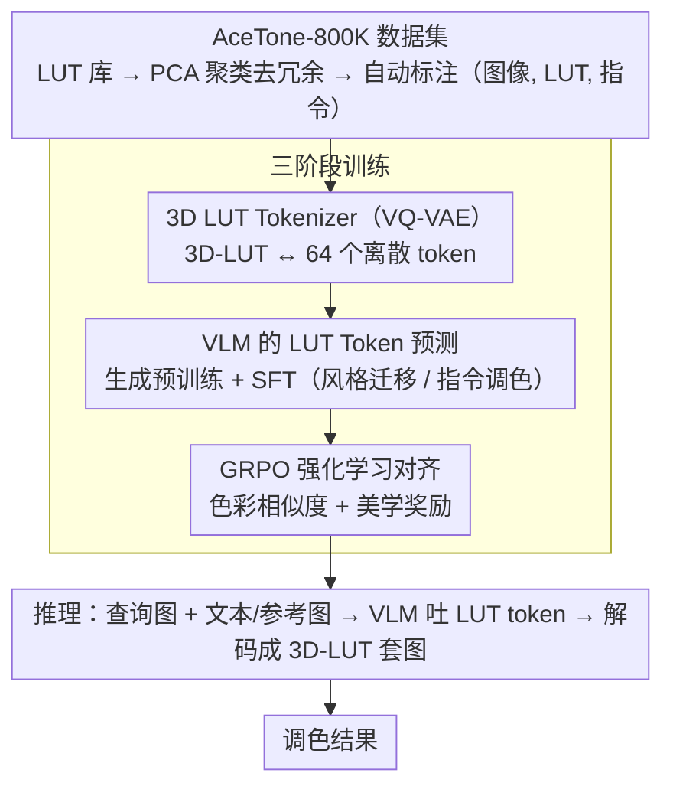

# AceTone: Bridging Words and Colors for Conditional Image Grading

**会议**: CVPR 2026  
**arXiv**: [2604.00530](https://arxiv.org/abs/2604.00530)  
**代码**: [https://github.com/martian422/AceTone](https://github.com/martian422/AceTone)  
**领域**: 图像修复  
**关键词**: 色彩调色, 3D-LUT, VQ-VAE tokenizer, VLM, GRPO强化学习

## 一句话总结
提出AceTone，首个支持文本和参考图像多模态条件色彩调色的统一框架，通过VQ-VAE将3D-LUT压缩为64个离散token，训练VLM预测LUT token序列，再用GRPO强化学习对齐色彩相似度和美学偏好，在风格迁移和指令调色上LPIPS改善50%。

## 研究背景与动机

**领域现状**：色彩调色（toning/grading）对图像风格和情感至关重要。现有方法要么依赖预定义滤镜库的权重组合，要么用CNN逐patch重着色。参考图风格迁移和文本指令调色两个任务使用不兼容的模型。

**现有痛点**：(1) 现有方法表达能力或效率不足；(2) 对抗损失（GAN）训练不稳定、模式崩溃；(3) 缺乏与人类审美偏好的对齐机制；(4) 参考迁移和文本调色需要独立模型。

**核心矛盾**：色彩调色既需要精确的色彩控制（LUT的优势），又需要理解复杂的语义指令（VLM的优势），但两者未被有效结合。

**切入角度**：将LUT作为色彩变换的原子操作token化，让VLM来生成这些token。

**核心idea**：(1) VQ-VAE tokenizer把 $3 \times 32^3$ 的LUT压缩为64个离散token；(2) VLM预测LUT token序列；(3) GRPO用色彩相似度+美学评分做奖励对齐。

## 方法详解

### 整体框架
AceTone 要解决的核心难题是：色彩调色既要 LUT 那种精确、无损的全局色彩控制，又要 VLM 那种理解复杂语义指令的能力，而过去这两者各管一摊、模型互不兼容。它的破局思路是把 LUT 本身变成 VLM 能"说"的语言——先用一个 VQ-VAE 把 3D-LUT 压成 64 个离散 token，再训练 VLM 像写句子一样自回归地预测这串 token，最后用强化学习把输出拉向人类审美。

整个流程分三阶段训练：先训 LUT Tokenizer（VQ-VAE）让 LUT 和 token 之间可逆互转，再做生成预训练让 VLM 学会预测 LUT token，最后做后训练（SFT 适配具体任务 + GRPO 对齐偏好）。推理时，把查询图连同文本指令或参考图喂给 VLM，它吐出一串 LUT token，解码成 3D-LUT 后直接套到图像上完成调色。

### 关键设计

**1. 3D LUT Tokenizer：把连续的颜色映射体积压成离散 token，才能让 VLM "生成" LUT**

VLM 天生只会生成离散 token，而一个 $3 \times 32 \times 32 \times 32$ 的 LUT 是连续的高维体积，二者语言不通，这是统一框架最先要跨过的坎。AceTone 用一个 VQ-VAE 来搭桥：3D 卷积编码器把 LUT 逐步下采样到 $4 \times 4 \times 4 \times D$，经过一个 $K=256$ 码字的向量量化层离散化为 64 个 token，再由 3D 卷积解码器还原，训练目标为重建损失加码本承诺项 $\mathcal{L} = \mathcal{L}_{rec} + \beta \mathcal{L}_{commit}$。之所以选 VQ-VAE 而非直接回归，是因为 LUT 本质就是一个三维颜色映射体积，体积卷积加码本量化既能大幅压缩、又能把还原误差压到 $\Delta E < 2$（人眼几乎不可感知的色差），从而保证整条 pipeline 的精度底座不被 token 化牺牲。

**2. VLM 的 LUT Token 预测：把"参考迁移"和"文本调色"统一成同一个序列生成问题**

过去参考图风格迁移和文本指令调色要用两套互不兼容的模型，根源在于它们的条件形式不同。AceTone 把色彩变换统一形式化为给定视觉-文本条件下自回归预测 token 序列，于是两种任务只是条件 $c$ 不同、本质同一。它先用大量 (图像, LUT, prompt) 三元组做生成预训练，目标是最大化条件似然 $\mathcal{L}_{gen} = -\sum \log p_\theta(z_t \mid z_{<t}, I, L(I), c)$；再分别为两类任务做 SFT——风格迁移（PST）喂参考图加查询图，指令调色（IGG）则用 Qwen2.5-VL-32B 为每个 (图像, LUT) 对自动生成编辑指令作监督。这样一个模型就能同时吃参考图和自然语言两种条件，复杂指令也能被 VLM 真正理解而非退化成几个关键词。

**3. GRPO 强化学习对齐：绕开 GAN 的不稳定，先建稳定似然模型再用 RL 拉向审美**

仅靠似然预训练只能学会"像训练集那样调色"，却没有任何机制把输出对齐到人类的美学偏好，而过去常用的对抗损失（GAN）训练不稳、易模式崩溃。AceTone 改走两步走：先有一个稳定的生成模型，再用 GRPO 在其上做偏好对齐。奖励由两项构成——色彩相似度奖励 $r_{color} = \frac{1}{\max(2, \Delta E) - 1}$（当 $\Delta E < 2$ 时拿满分，逼输出贴近目标色），以及美学奖励 $r_{aes}$（用预训练 DeQA 模型打视觉愉悦度分）。训练沿标准 GRPO：对一个条件采样 $G$ 个候选 LUT，算各自奖励，做组内归一化得到优势，再更新策略并加 KL 正则防止跑偏。这种"先似然后 RL"的顺序，既避开了 GAN 的训练不稳定，又能显式注入色彩准确与审美两个维度的偏好。

**4. AceTone-800K 数据集：为 token 化 + RL 训练量身造一套高质量 LUT 语料和基准**

上述训练高度依赖多样且优质的 (图像, LUT, 指令) 数据，而现成数据并不存在。作者从约 10K 个授权 LUT 滤镜库出发，叠加 PPR-10K 专家调色，再经 PCA 聚类挑出 8192 个核心 LUT 去冗余，最终自动标注出 800K 条 (图像, LUT, 指令) 元组。同时配套两个评测基准——AceTone-Bench Transfer（1024 样本）测风格迁移、AceTone-Bench Instruct（128 样本）测指令调色。消融也印证了数据多样性对 GRPO 阶段尤为关键：用全训练集和用子集的效果差异显著。

### 损失函数 / 训练策略
Tokenizer 用 MSE 重建损失加 commitment loss；生成预训练与 SFT 用交叉熵；RL 阶段用 GRPO 目标加 KL 正则。

## 实验关键数据

### 主实验（风格迁移PST-50）

| 方法 | Aes.↑ | PSNR↑ | LPIPS↓ | ΔE↓ |
|------|-------|-------|--------|-----|
| Neural Preset | 3.03 | 21.24 | 0.15 | 9.57 |
| SA-LUT | 3.07 | 21.64 | 0.16 | 9.01 |
| ModFlow | 3.08 | 20.13 | 0.16 | 10.62 |
| **AceTone** | **3.29** | **24.26** | **0.09** | **7.26** |

AceTone-Bench[Transfer]上LPIPS从0.22(SA-LUT)降至**0.11**（改善50%）。

### 消融实验

| 配置 | Aes.↑ | LPIPS↓ | 说明 |
|------|-------|--------|------|
| 仅预训练 | 基线 | 基线 | 基础LUT预测能力 |
| + SFT | +提升 | +提升 | 任务适配 |
| + GRPO | **最优** | **最优** | 美学对齐关键 |
| 无美学奖励 | 下降 | 不变 | 美学分对感知质量贡献大 |
| 无色彩奖励 | 不变 | 下降 | 色彩准确度需要色彩奖励保证 |

### 关键发现
- GRPO阶段的贡献主要体现在美学分提升和色彩一致性优化
- LUT tokenizer的保真度（ΔE<2）是整个pipeline精度的基础
- 数据多样性对GRPO训练至关重要——用全训练集vs子集的效果差异显著
- 首次证明VLM可以有效预测3D色彩变换的离散表示

## 亮点与洞察
- **LUT Token化的创新**：将3D-LUT从连续体积巧妙压缩为64个离散token，使色彩变换成为VLM的"语言"，打通了语言模型和色彩操作的边界
- **分阶段学习范式**：先似然预训练建立稳定基础，再RL对齐偏好的范式避免了GAN训练的不稳定性，为色彩调色的可扩展训练提供了新路径
- **统一多模态条件**：同一个模型同时支持参考图和文本指令两种调色模式

## 局限与展望
- LUT是全局色彩变换，无法处理局部调色（如仅调整天空颜色）
- 32^3分辨率的LUT精度有限（极端色彩变换可能出现量化伪影）
- GRPO训练需要大量采样和奖励计算，训练成本较高
- 美学评估模型(DeQA)自身的偏好可能会被"学习"到模型中

## 相关工作与启发
- **vs Neural Preset/SA-LUT**: 预定义LUT库的组合，表达能力有限。AceTone从零生成LUT
- **vs 扩散模型编辑**: 扩散模型可以重着色但延迟高且可能破坏结构。LUT应用是无损的
- **vs CLIP指导方法**: CLIP将文本映射到色彩操作但输入受限于几个词。VLM理解复杂指令

## 评分
- 新颖性: ⭐⭐⭐⭐⭐ LUT token化+VLM生成+GRPO对齐的完整创新链
- 实验充分度: ⭐⭐⭐⭐ 定量+用户研究，但数据集尚未公开
- 写作质量: ⭐⭐⭐⭐ 方法描述清晰，数据集构建细节完整
- 价值: ⭐⭐⭐⭐⭐ 开创了语言驱动色彩调色的新方向，对影视后期等行业有实际应用价值

<!-- RELATED:START -->

## 相关论文

- [\[CVPR 2026\] Bridging the Perception Gap in Image Super-Resolution Evaluation](bridging_the_perception_gap_in_image_super-resolution_evaluation.md)
- [\[ICML 2026\] One-shot Conditional Sampling: MMD meets Nearest Neighbors](../../ICML2026/image_restoration/one-shot_conditional_sampling_mmd_meets_nearest_neighbors.md)
- [\[CVPR 2026\] Beyond Ground-Truth: Leveraging Image Quality Priors for Real-World Image Restoration](beyond_ground-truth_leveraging_image_quality_priors_for_real-world_image_restora.md)
- [\[CVPR 2026\] Learning to Translate Noise for Robust Image Denoising](learning_to_translate_noise_for_robust_image_denoising.md)
- [\[CVPR 2026\] Beyond the Ground Truth: Enhanced Supervision for Image Restoration](beyond_the_ground_truth_enhanced_supervision_for_image_restoration.md)

<!-- RELATED:END -->
