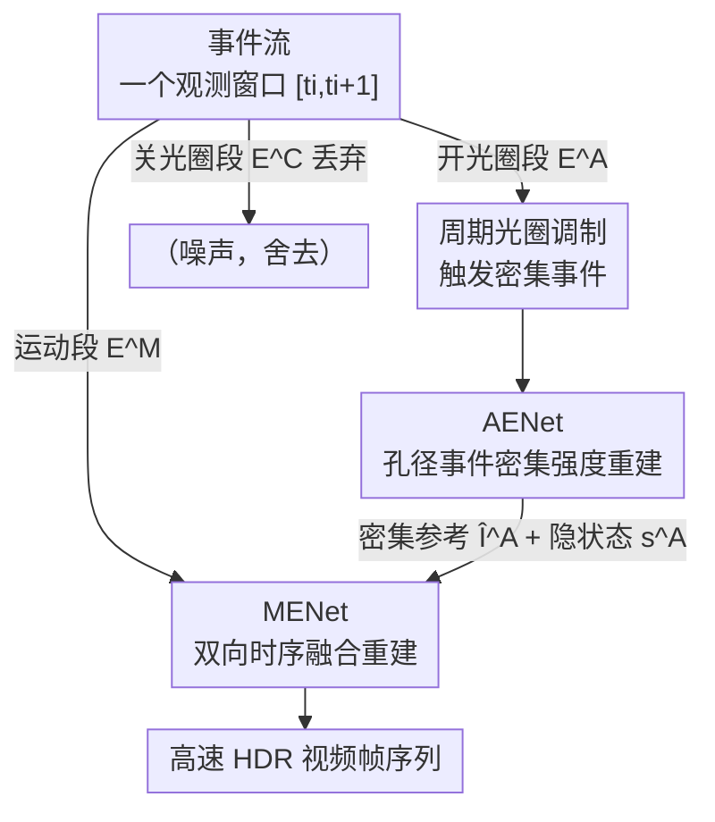

# AE2VID: Event-based Video Reconstruction via Aperture Modulation

**会议**: CVPR 2026  
**论文**: [CVF Open Access](https://openaccess.thecvf.com/content/CVPR2026/html/Bai_AE2VID_Event-based_Video_Reconstruction_via_Aperture_Modulation_CVPR_2026_paper.html)  
**代码**: https://github.com/a1henu/AE2VID/ （有，待开源）  
**领域**: 图像/视频恢复 · 事件相机  
**关键词**: 事件相机, 视频重建, 光圈调制, 双向循环网络, 高动态范围

## 一句话总结
针对事件相机视频重建只靠稀疏运动事件、静态区域和误差累积难以恢复的痛点，本文主动周期性开合光圈，让事件相机在静态区域也"被动触发"出密集事件，由此解析出密集强度参考图，再用双子网络（AENet 处理光圈事件、MENet 双向融合运动事件）重建出高速高动态范围视频，在 EvAid 上 MSE 较 SOTA 降低 27.4%。

## 研究背景与动机
**领域现状**：事件相机以微秒级延迟、超高动态范围记录像素的对数光强变化（event-to-video，简称 E2VID）。主流做法是把事件流喂给循环网络（E2VID、FireNet、V2V-E2VID、BDE2VID），从运动事件里逐帧滚动重建视频。

**现有痛点**：运动事件**只在物体边缘/有运动的地方**被触发，空间上极其稀疏，对静态背景几乎没有任何信号。这带来两个老大难：一是静态区域（背景墙面、铁丝网）无事件可依、重建糊成一团；二是循环网络从某个参考时刻一路滚动预测，**误差会随时间累积**，离参考帧越远越离谱。

**核心矛盾**：从纯运动事件重建视频本质是病态问题——事件只能告诉你光强的**相对变化** $\mathbf{S}(t_0,t)$，却给不出任何**绝对参考亮度** $\mathbb{I}(\mathbf{r},t_0)$；没有参考，静态像素的真实亮度就是个谜。

**本文目标**：在不增加额外相机、不依赖室内主动打光的前提下，给系统注入"密集的绝对强度参考"，同时定期重置参考以遏制误差累积。

**切入角度**：作者注意到光圈是几乎所有成像系统都自带、又最容易控制的部件。**主动调制光圈口径**就能改变每个像素接收到的辐照度，从而在静态区域也"逼出"事件——而且开光圈那一刻，第一个正事件（FPE）的触发时刻与像素本征亮度成反比，可以**直接解算出密集强度图**。

**核心 idea**：把"光圈调制触发的密集事件"作为运动事件的互补信号源，用专门的子网络解算密集强度参考，再融合进运动事件的循环重建里。

## 方法详解

### 整体框架
AE2VID 的核心是**两类事件、两个子网络、周期性复位**。系统周期性地把光圈从全闭打开再关上，间隔为 $\tau$。在每个观测窗口 $[t_i, t_{i+1}]$ 内，事件按时段被切成三段：开光圈阶段 $[t_i, t_i+\delta t]$ 产生**光圈调制事件** $\mathbb{E}^A_i$，中间稳定段 $[t_i+\delta t, t_{i+1}-\delta t]$ 产生**运动事件** $\mathbb{E}^M_i$，关光圈阶段产生 $\mathbb{E}^C_i$。作者实测关光圈事件又脏又没信息（初始电压未知、推导失效），直接丢弃，只用前两类。

光圈事件喂给 **AENet**，解算出密集强度参考 $\hat{\mathbb{I}}^A_i$ 和隐状态 $\mathrm{s}^A_i$；运动事件连同相邻两个窗口的参考 $\hat{\mathbb{I}}^A_i, \hat{\mathbb{I}}^A_{i+1}$ 和隐状态一起喂给 **MENet**，双向重建出该窗口内 $K$ 帧序列 $\{\hat{\mathbb{I}}^M_{i,k}\}$。每隔 $\tau$ 重新开一次光圈，相当于定期给循环网络"重置观测窗口、塞一张可靠参考帧"，从根上压住误差累积。

### 关键设计

**1. 周期光圈调制：用主动开合光圈"种"出密集强度参考**

这一设计直接打中"运动事件稀疏、静态区域无信号"的痛点。事件触发条件是对数辐照度变化超过阈值 $C$：$\left|\log\frac{\mathbb{I}(\mathbf{r},t)+I_{\mathrm{dark}}}{\mathbb{I}(\mathbf{r},t-\Delta t)+I_{\mathrm{dark}}}\right|\ge C$。当光圈从全闭（透过率 $\mathrm{TR}(0)=0$）开始打开，像素辐照度 $\mathbb{I}(\mathbf{r},t)=\mathbb{I}_{\max}(\mathbf{r})\cdot\mathrm{TR}(t)$ 从暗电流附近一路抬升，于是**几乎每个像素都会被触发一次正事件**——哪怕它在静态背景里。关键在于第一个正事件（FPE）的触发时刻 $t^\star(\mathbf{r})$ 携带了像素本征亮度信息：

$$\mathbb{I}_{\max}(\mathbf{r}) = \frac{(e^{C}-1)\cdot I_{\mathrm{dark}}}{\mathrm{TR}(t^\star(\mathbf{r}))} \propto \frac{1}{\mathrm{TR}(t^\star(\mathbf{r}))}$$

也就是说，**FPE 触发得越早（透过率越低就被触发）的像素越亮**。由此可从一次开光圈过程解算出整幅密集强度图，正好充当式 $\mathbb{I}(\mathbf{r},t)=\mathbb{I}(\mathbf{r},t_0)\cdot\exp(\mathbf{S}(t_0,t))$ 里缺失的绝对参考 $\mathbb{I}(\mathbf{r},t_0)$。相比额外加一台帧相机（会有时空对齐误差、成本高）或室内主动打光（户外不可用），调光圈是"自带硬件、户外可用、成本极低"的密集观测手段。而**周期性**（每隔 $\tau$ 开一次）则是为了对抗误差累积：单次开光圈只能给一个参考点，时间跨度越大预测越飘，定期重开等于反复"刷新"可靠锚点。⚠️ 关光圈触发的事件因初始电压未知、推导不成立，被明确排除在"光圈调制事件"之外。

**2. AENet：把含噪的 FPE 时序图净化成密集强度参考与隐状态**

光圈事件虽密集，但 FPE 时序矩阵噪声很大，直接当参考帧会污染下游。AENet 用三个模块依次处理：**FIR（FPE-based Intensity Reconstruction）** 先按上式从每个像素的 FPE 时刻搭出时序矩阵、解算初始强度图 $\hat{\mathbb{I}}^{FIR}_i$；**IDN（Image Denoising）** 用 SwinIR（载入文献[1]的预训练权重）把含噪初始图去噪成干净的 $\hat{\mathbb{I}}^A_i$（该权重自带超分效果，作者再下采样回原分辨率）；**HSG（Hidden State Generation）** 则为 MENet 提供可靠初始化——它把去噪帧 $\hat{\mathbb{I}}^A_i\in\mathbb{R}^{H\times W}$ 沿通道复制 $b$ 次拼成与事件 voxel 同形的帧体 $V^A_i\in\mathbb{R}^{b\times H\times W}$，再产出隐状态 $\mathrm{s}^A_i$。为了让 HSG 输出的隐状态和 MENet 的特征空间对齐，HSG 刻意复用 MENet 循环块前向 LSTM 的结构，并额外预测一张伪帧 $\hat{\mathbb{I}}^{A'}_i$ 用 $\ell_1$ 损失约束：$\{\hat{\mathbb{I}}^{A'}_i\},\mathrm{s}^A_i=\mathrm{HSG}(V^A_i)$。这样 MENet 一开始就拿到的是"对齐过的密集背景先验"，而非从零滚动。

**3. MENet：双向循环 + 逐像素 mixer，把稀疏运动事件和密集参考融成一致视频**

MENet 解决的是"如何把稀疏运动事件与 AENet 给的密集参考真正融起来、并保持长程时序一致"。骨干基于 E2VID 的卷积 LSTM，但作者发现单向循环在长程依赖下静态背景保真度明显下降，于是改成**双向**：在窗口内同时跑前向（从初始隐状态 $\mathrm{s}^A_i$ 出发）和反向（从末端隐状态 $\mathrm{s}^A_{i+1}$ 出发，事件 voxel 用 $\mathrm{rev}(\cdot)$ 翻转）两条循环，得到前向候选 $\hat{\mathbb{I}}^{M,\mathrm{fwd}}_{i,k}$ 和反向候选 $\hat{\mathbb{I}}^{M,\mathrm{bwd}}_{i,k}$。最后用一个轻量**逐像素 mixer** $\mathcal{M}$ 把"前向候选、反向候选、左参考 $\hat{\mathbb{I}}^A_i$、右参考 $\hat{\mathbb{I}}^A_{i+1}$"四路融合——它对每像素预测一组 softmax 权重 $\alpha_{i,k}\in[0,1]^{4\times H\times W}$：

$$\hat{\mathbb{I}}^M_{i,k}=\alpha^{(0)}_{i,k}\odot\hat{\mathbb{I}}^{M,\mathrm{fwd}}_{i,k}+\alpha^{(1)}_{i,k}\odot\hat{\mathbb{I}}^{M,\mathrm{bwd}}_{i,k}+\alpha^{(2)}_{i,k}\odot\hat{\mathbb{I}}^A_i+\alpha^{(3)}_{i,k}\odot\hat{\mathbb{I}}^A_{i+1}$$

逐像素加权的好处是**自适应**：运动剧烈、事件丰富的前景像素更信运动事件分支，静态背景像素更信密集参考分支，前后向也按各自可靠度分配。这正好把第 1、2 个设计的产物（密集参考）和运动事件的优势在像素粒度上各取所长。

### 损失函数 / 训练策略
总损失对单个窗口写（各窗口共享同一流程）：$\mathcal{L}=\lVert\hat{\mathbb{I}}^{A'}-\hat{\mathbb{I}}^A\rVert_1+\sum_{k}\mathcal{L}^k_{\mathrm{rec}}+\lambda_{\mathrm{TC}}\sum_{k=L_0}^{K}\mathcal{L}^k_{\mathrm{TC}}$。其中重建项 $\mathcal{L}^k_{\mathrm{rec}}=\lVert\hat{\mathbb{I}}^M_k-\mathbb{I}^M_k\rVert_1+\mathrm{LPIPS}(\hat{\mathbb{I}}^M_k,\mathbb{I}^M_k)$ 兼顾保真与感知；时序一致项 $\mathcal{L}_{\mathrm{TC}}$ 为避免"脏窗口"伪影**只施加在后半段帧**（$L_0=10$ 起）。设 $K=20$、$\lambda_{\mathrm{TC}}=1$。训练分两阶段：先冻结 MENet 单独微调 HSG 10 epoch（让隐状态对齐），再整体微调 10 epoch，均用余弦退火（$10^{-5}\to10^{-7}$）。HSG 与 MENet 循环块都用 V2V-E2VID 预训练权重初始化。数据用 ESIM 仿真的 1000 条 + 自建 Blender（前景物体随机运动、表面贴 MS-COCO 纹理）500 条，共 40 多分钟。

## 实验关键数据

### 主实验
在半真实数据 EvAid 与 HQF 上与 7 个 SOTA 对比（所有对比方法用官方代码与权重，仅吃运动事件）。AE2VID 在绝大多数指标领先，EvAid 上 MSE 较 SOTA 降低 **27.4%**：

| 数据集 | 指标 | 本文 | 之前最好 | 提升 |
|--------|------|------|----------|------|
| EvAid | MSE↓ | **0.037** | 0.051 (ETNet) | −27.4% |
| EvAid | SSIM↑ | **0.707** | 0.642 (V2V-E2VID) | +0.065 |
| EvAid | MS-SSIM↑ | **0.544** | 0.524 (V2V-E2VID) | +0.020 |
| EvAid | LPIPS↓ | 0.411 | **0.409** (V2V-E2VID) | 持平（次优） |
| HQF | MSE↓ | **0.039** | 0.041 (BDE2VID) | 小幅领先 |
| HQF | SSIM↑ | **0.585** | 0.523 (BDE2VID) | +0.062 |
| HQF | MS-SSIM↑ | **0.503** | 0.477 (BDE2VID) | +0.026 |
| HQF | LPIPS↓ | 0.352 | **0.272** (BDE2VID) | 次于 BDE2VID |

HQF 提升较小，因为它主要是全局运动场景、密集参考增益有限；EvAid 含大量局部运动，正是密集参考大显身手之处。

### 消融实验
（论文正文将完整消融放在补充材料，此处按正文与方法描述列出关键消融维度）

| 配置 | 关注点 | 说明 |
|------|--------|------|
| Full model | — | AENet + MENet + 双向 + 两阶段训练 |
| 单向 vs 双向 pipeline | 长程时序一致性 | 去掉反向循环，静态背景在长程依赖下保真度明显下降 |
| 两阶段 vs 单阶段训练 | 隐状态对齐 | 不先单独对齐 HSG，密集参考与 MENet 特征空间不匹配 |
| AENet 结构（FIR/IDN/HSG） | 密集参考质量 | 去 IDN 去噪则 FPE 噪声直接污染参考帧 |

### 关键发现
- **光圈控制参数有明显甜区**：最终口径 $A_E$ 太大或开光圈速度 $v_A$ 太慢会拉长开光圈过程、损伤运动线索；$A_E$ 太小则部分像素触发不了 FPE，$v_A$ 太快又会超出传感器事件率上限。作者实测取 $A_E=$ 最大口径的 1/4、$\delta t\approx0.13$ s、$\tau-2\delta t=5$ s。
- **增益高度依赖场景运动类型**：局部运动主导的场景（EvAid）密集参考价值最大；全局运动场景（HQF）增益相对小。
- **关光圈事件确实无用**：实测 $\mathbb{E}^C$ 既无密集强度也无运动线索，丢弃后用插值补帧反而更干净。

## 亮点与洞察
- **把"硬件被动器件"变成"主动信息编码器"**：光圈本是用来控曝光的，作者反手用它周期性开合，在静态区域"种"出密集事件——这是用最廉价的现成部件解决了"额外密集观测"这一硬约束，比加帧相机/主动打光都更实用。
- **FPE 时刻 ↔ 像素亮度的反比关系**很巧：开光圈这一物理过程天然把"亮度"编码进"第一个事件的时间戳"，等于免费拿到一张绝对强度图，正好补上 E2VID 缺失的参考锚点。
- **逐像素四路 softmax mixer** 是个可迁移的融合 trick：当你有多个互补来源（前向/反向/多个参考）且各自在不同区域可靠时，让网络逐像素学权重，比固定加权或单分支稳健得多。
- **周期性复位对抗误差累积**的思路，可推广到任何长程循环重建任务——定期注入一个可靠锚点比一味增大模型容量更治本。

## 局限与展望
- **硬件参数只能整段固定**：当前原型每次采集只能设一组固定 $A_E, v_A, \tau$，无法随光照/运动速度动态调整，限制了灵活性；作者认为动态调参有望进一步提升。
- **极端场景仍会退化**：高速运动、极低照度下重建质量会下降。
- ⚠️ **半真实评测有仿真成分**：EvAid/HQF 只有运动事件，光圈开光圈帧 $\hat{\mathbb{I}}^{FIR}$ 是按文献[1]的退化模型**合成**的（只替换 FIR 模块），真实采集的 AMED 又没有 GT、只能做定性对比——定量提升的可信度需结合这一点看待。
- **依赖外部预训练件**：IDN 用 SwinIR 文献[1] 权重、HSG/MENet 用 V2V-E2VID 权重初始化，独立从零训练的效果未充分展示。

## 相关工作与启发
- **vs 纯运动事件方法（E2VID/FireNet/BDE2VID/V2V-E2VID）**：它们只吃稀疏运动事件，静态区域无信号、误差随时间累积；本文额外引入光圈调制的密集事件作绝对参考，专治静态背景和误差累积，代价是需要可调光圈硬件与专门采集。
- **vs 加额外帧相机的方案**：帧相机能给密集强度但有时空对齐误差且成本高；光圈调制在同一传感器上拿密集观测，无对齐问题。
- **vs 主动打光调制（Chen/Han 等）**：主动打光只在室内可控环境可行；调光圈在户外同样适用。
- **vs 光圈/透过率静态成像（Bao 等 temporal mapping）**：他们也用 FPE 时间戳重建密集强度，但**只针对静态场景**、不融合运动事件；本文把这套密集强度解算嵌入视频重建管线，与运动事件双向融合，扩展到动态视频。

## 评分
- 新颖性: ⭐⭐⭐⭐⭐ 首个把主动光圈调制引入事件视频重建，用现成器件解决"密集观测"硬约束，角度新颖。
- 实验充分度: ⭐⭐⭐⭐ 半真实双数据集定量 + 真实 AMED 定性 + 参数甜区分析较完整，但核心消融在补充材料、真实数据缺 GT。
- 写作质量: ⭐⭐⭐⭐⭐ 物理推导（FPE↔亮度）到网络设计逻辑清晰，两子网络分工讲得明白。
- 价值: ⭐⭐⭐⭐ 提供新的传感范式 + 真实 AMED 数据集，对事件相机低层视觉社区有实用价值，受限于硬件灵活性。

<!-- RELATED:START -->

## 相关论文

- [\[CVPR 2026\] Time-Specialized Event-Image Alignment for Blur-to-Video Decomposition](time-specialized_event-image_alignment_for_blur-to-video_decomposition.md)
- [\[CVPR 2026\] LRHDR: Learning Representation-enhanced HDR Video Reconstruction](lrhdr_learning_representation-enhanced_hdr_video_reconstruction.md)
- [\[CVPR 2026\] One-Shot Flow, Any-Time Frame: A Bidirectional Warping Framework for Event-Based Video Frame Interpolation](one-shot_flow_any-time_frame_a_bidirectional_warping_framework_for_event-based_v.md)
- [\[CVPR 2026\] From Events to Clarity: The Event-Guided Diffusion Framework for Dehazing](from_events_to_clarity_the_event-guided_diffusion_framework_for_dehazing.md)
- [\[CVPR 2026\] Event-Based Motion Deblurring Using Task-Oriented 3D Gaussian Event Representations](event-based_motion_deblurring_using_task-oriented_3d_gaussian_event_representati.md)

<!-- RELATED:END -->
