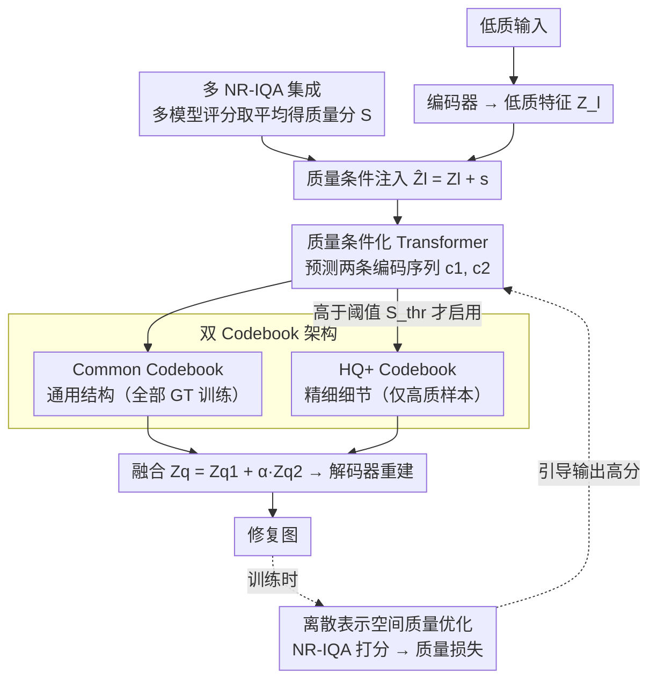

# Beyond Ground-Truth: Leveraging Image Quality Priors for Real-World Image Restoration

**会议**: CVPR 2026  
**arXiv**: [2603.29773](https://arxiv.org/abs/2603.29773)  
**代码**: [https://github.com/fengyang1399-pixel/IQPIR](https://github.com/fengyang1399-pixel/IQPIR)  
**领域**: 图像修复  
**关键词**: 图像修复, 图像质量先验, 双Codebook, NR-IQA, 质量条件化

## 一句话总结
提出IQPIR框架，引入预训练NR-IQA模型的图像质量先验(IQP)作为条件信号，通过质量条件化Transformer、双Codebook结构和离散表示空间质量优化三个机制，引导图像修复过程趋向最高感知质量，在盲人脸修复等任务上全面超越SOTA。

## 研究背景与动机

**领域现状**：真实世界图像修复旨在从复杂退化的低质输入恢复高质图像。基于Codebook的方法将修复转化为离散表示空间的编码预测问题，有效降低重建歧义。

**现有痛点**：所有方法都隐式假设GT是完美的唯一监督源。但如图1所示，GT数据集（如FFHQ）的感知质量不一致——多数GT质量分在5-8之间，极少达到9。模型会收敛到GT的**平均质量水平**而非最高可达质量。

**核心矛盾**：(1) 仅用最高质量GT训练→数据多样性不足→伪影和退化特征；(2) 用全部GT训练→被平均质量拉低。

**切入角度**：不同质量等级的GT提供不同功能——HQ+ GT擅长精细结构控制，平均GT更适合大面积模糊恢复。

**核心idea**：将NR-IQA分数作为条件信号注入修复模型，推理时设为最大值→引导网络产出最高质量；双Codebook分别学习通用结构和HQ+细节。

## 方法详解

### 整体框架
IQPIR 要解决的核心问题是：GT 本身质量参差不齐，直接拿它当唯一监督会把模型拉到 GT 的平均质量水平。IQPIR 的思路是把"质量"显式地变成一个可控的条件量，让网络在推理时被拉向最高质量而非平均质量。整套流程分两阶段。第一阶段学一组离散表示（双 Codebook），把"通用结构"和"高质量专属细节"拆到两本码本里；第二阶段冻结码本，训练一个质量条件化 Transformer，从低质输入预测两条编码序列、再分别查码本解码出修复图，训练时额外用 NR-IQA 给输出打分形成质量损失。推理时把质量条件直接拉满，网络就输出它能达到的最高感知质量。

### 关键设计

**1. 双 Codebook 架构：把"通用恢复能力"和"高质量细节"解耦到两本码本**

如果只用一本码本对所有 GT 训练，高质量 GT 里那些精细视觉细节（发丝端部、皮肤纹理）会被大量平庸 GT 稀释、学不进去；可只用高质 GT 又会导致退化覆盖不全。IQPIR 因此拆成两本：Common Codebook 对所有 GT 训练，负责广覆盖的结构与退化恢复；HQ+ Codebook 只在某张 GT 的质量分 $S > S_{thr}$ 时才参与量化，专门吃高质样本里的精细细节。编码器特征量化后按 $Z_q = Z_q^1 + \alpha Z_q^2$ 融合（当 $S \le S_{thr}$ 时退化为只用 $Z_q^1$），解码器从融合表示重建。这样通用码本保证什么退化都能恢复，HQ+ 码本则在样本够好时额外补上高频细节，两者各司其职、互不拖累。

**2. 质量条件化 Transformer：把 NR-IQA 分数当成可控旋钮注入预测**

第一阶段的码本只是"词典"，真正决定输出质量的是第二阶段预测哪些编码。IQPIR 让 NR-IQA 模型先给目标质量打分 $S$，嵌成与特征同形的向量 $\mathbf{s} \in \mathbb{R}^{h \times w \times c}$，直接加到低质特征上得到 $\hat{Z}_l = Z_l + \mathbf{s}$；Transformer 读 $\hat{Z}_l$ 预测两条编码序列 $\mathbf{c}_1, \mathbf{c}_2$，分别去查 Common 和 HQ+ 码本。这等价于一种类条件生成——训练阶段网络被迫学会"质量分→对应质量的图像"的映射，于是推理时只要把 $S$ 设成最大值，就能把输出引导到最高感知质量，而不再被 GT 的平均水平锁死。

**3. 离散表示空间的质量优化：用码本的离散性天然挡住"过度优化"**

光有质量条件还不够，还要用 IQA 直接把输出往高分推，于是训练时加一项质量损失 $\mathcal{L}_{quality}$，用 NR-IQA 给修复结果打分作为优化目标。问题在于，如果在连续像素/特征空间直接最大化 IQA 分数，模型很容易钻 IQA 指标的空子、生成讨好指标却带伪影的图。IQPIR 把这项优化放在离散表示空间——输出被限制在有限码本条目的组合里，搜索空间天然受约束，无法无限制地往奇异方向漂，从而在提质量的同时避免了连续空间常见的 reward hacking 式过度优化。

**4. 多 NR-IQA 集成定义质量分：用平均缓解单一指标偏好**

上面三处都依赖一个"质量分 $S$"，而单个 NR-IQA 模型各有风格偏好（有的偏好锐化、有的偏好平滑），直接拿一个模型的分会把它的偏见传给整套系统。IQPIR 因此把多个 NR-IQA 模型的评分取平均 $S = \frac{1}{n}\sum_{i=1}^{n} s_i$ 作为最终质量分，让条件信号更接近"公认的好"而非某一指标的偏好，从源头上让前面三个机制用的质量度量更稳。

### 损失函数 / 训练策略
Codebook 阶段用重建损失 + 量化承诺损失 + 感知损失联合学双码本；编码预测阶段用编码序列的交叉熵预测损失，叠加上面的质量优化损失 $\mathcal{L}_{quality}$ 一起训练。

## 实验关键数据

### 主实验（盲人脸修复，LFW-Test）

| 方法 | TOPIQ-G↑ | Musiq-G↑ | Q-Align↑ | CLIP-IQA↑ |
|------|----------|----------|----------|-----------|
| CodeFormer | 0.809 | 0.832 | 4.31 | 0.697 |
| DAEFR | 0.814 | 0.827 | 4.33 | 0.696 |
| WaveFace | 0.786 | 0.799 | 4.43 | 0.788 |
| Interlcm | 0.831 | 0.834 | 4.55 | 0.721 |
| **IQPIR (Ours)** | **0.861** | **0.878** | **4.67** | **0.790** |

WebPhoto-Test和WIDER-Test上同样全面领先。

### 消融实验

| 配置 | 主要指标 | 说明 |
|------|---------|------|
| 无质量条件 | 下降 | 证明IQP条件化的必要性 |
| 单Codebook | 下降 | HQ+ Codebook对精细细节很重要 |
| 连续空间质量优化 | 过度优化 | 离散空间的优势 |
| 单一IQA模型 | 略下降 | 多模型集成更鲁棒 |

### 关键发现
- **IQP是通用的质量提升策略**：将DifFace加上本文的质量条件方法(DifFace+)也能显著提升修复质量，证明了plug-and-play特性
- 双Codebook中HQ+ Codebook主要改善毛发端部、皮肤纹理等精细细节
- 推理时设质量分为最大值→感知质量显著超过GT平均水平

## 亮点与洞察
- **挑战GT完美假设**：首次系统地揭示了GT数据质量不一致对修复模型的影响，提出了"超越GT"的修复范式
- **质量条件化的plug-and-play特性**：IQP可以作为独立模块插入任何修复架构，无需结构修改
- **离散空间质量优化**：巧妙利用了VQ-VAE的离散性来避免连续空间中IQA奖励过度优化的问题

## 局限与展望
- NR-IQA模型自身也有偏差（某些模型可能偏好特定风格），虽然用集成缓解但不能完全消除
- $S_{thr}$ 阈值和 $\alpha$ 权重需要手动调整
- 当GT质量极低时，HQ+ Codebook能学到的内容有限
- 可探索将质量先验扩展到视频修复和3D修复

## 相关工作与启发
- **vs CodeFormer/DAEFR**: 它们假设GT完美，直接监督。本文引入质量维度突破这一限制
- **vs 基于GAN/扩散的修复**: 生成先验强大但可能产生幻觉。Codebook先验+质量先验更可控
- **vs NR-IQA研究**: 将IQA从评估工具转变为训练信号，拓展了IQA的应用边界

## 评分
- 新颖性: ⭐⭐⭐⭐⭐ 质量先验用于修复的思路新颖，双Codebook+条件化+离散优化的系统设计完整
- 实验充分度: ⭐⭐⭐⭐ 多数据集、多指标、消融充分，plug-and-play验证有说服力
- 写作质量: ⭐⭐⭐⭐ 动机图(GT质量分布)直观有力
- 价值: ⭐⭐⭐⭐⭐ 通用质量引导策略，对修复领域有广泛影响

<!-- RELATED:START -->

## 相关论文

- [\[CVPR 2026\] Beyond the Ground Truth: Enhanced Supervision for Image Restoration](beyond_the_ground_truth_enhanced_supervision_for_image_restoration.md)
- [\[CVPR 2026\] RAR: Restore, Assess, Repeat - A Unified Framework for Iterative Image Restoration](rar_restore_assess_repeat_a_unified_framework_for_iterative_image_restoration.md)
- [\[CVPR 2026\] Toward Real-world Infrared Image Super-Resolution: A Unified Autoregressive Framework and Benchmark Dataset](real_iisr_infrared_image_super_resolution_autoregressive.md)
- [\[CVPR 2026\] Disentangled Textual Priors for Diffusion-based Image Super-Resolution](disentangled_textual_priors_for_diffusion-based_image_super-resolution.md)
- [\[CVPR 2026\] TM-BSN: Triangular-Masked Blind-Spot Network for Real-World Self-Supervised Image Denoising](tm-bsn_triangular-masked_blind-spot_network_for_real-world_self-supervised_image.md)

<!-- RELATED:END -->
