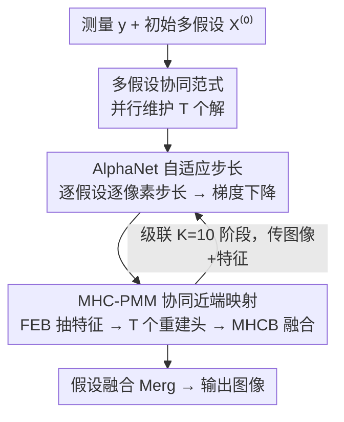

# Beyond Single Solution: Multi-Hypothesis Collaborative Deep Unfolding Network for Image Compressive Sensing

**会议**: CVPR 2026  
**arXiv**: [2606.03666](https://arxiv.org/abs/2606.03666)  
**代码**: 无（论文未提供）  
**领域**: 图像压缩感知 / 深度展开网络 / 图像重建  
**关键词**: 压缩感知, 深度展开, 多假设, 近端梯度下降, 协同优化

## 一句话总结
针对压缩感知（CS）问题"欠定、解不唯一"的本质，本文提出 MHC-DUN：把传统深度展开网络（DUN）里"只重建一个解"的范式扩展成"同时重建 $T$ 个假设解并让它们协同优化"，在梯度下降步用 AlphaNet 给每个假设预测逐像素自适应步长、在近端映射步用 MHCB 挖掘假设间相关性融合，在 Set11/Urban100/CS-MRI 上全面超过现有 SOTA（Set11 平均 PSNR 比 USB-Net 高 0.45 dB）。

## 研究背景与动机

**领域现状**：压缩感知从远少于奈奎斯特采样数的线性测量 $\mathbf{y}=\mathbf{A}\mathbf{x}$ 中恢复原信号 $\mathbf{x}$。深度学习时代主流分两类：直接黑箱网络（DBN）把测量映射到图像、简单但缺可解释性；深度展开网络（DUN）把 ISTA/AMP/PGD 等迭代优化算法"展开"成级联多阶段网络，每个阶段对应一次迭代，既有理论根基又可端到端训练，是近年 CS 的主流路线（OCTUF、CPP-Net、USB-Net 等）。

**现有痛点**：几乎所有 DUN 都在**单一解空间**里做推理——每个阶段只维护、只输出一个重建结果 $\mathbf{x}^{(k)}$。但 CS 的采样矩阵 $\mathbf{A}\in\mathbb{R}^{M\times N}$ 满足 $M\ll N$，由秩-零度定理 $\operatorname{rank}(\mathbf{A})+\operatorname{nullity}(\mathbf{A})=N$ 可得零空间维度 $\operatorname{nullity}(\mathbf{A})=N-r\ge N-M>0$，意味着满足 $\mathbf{A}\hat{\mathbf{x}}=\mathbf{y}$ 的解构成一个仿射子空间 $\mathcal{S}=\{\hat{\mathbf{x}}+\mathbf{z}\mid \mathbf{z}\in\operatorname{Null}(\mathbf{A})\}$——**数学上有无穷多个合法解**。强行把网络逼到"回归出唯一最优解"，反而加重了优化难度、限制了重建质量。

**核心矛盾**：单解范式与 CS 问题"内在多解"的本质相冲突。而且单解推理在单一特征域内做信息抽取与整合，**根本看不到多个潜在解之间的相关性**，错失了解与解之间互补、互校的信息。

**本文目标**：把"多解"这件被一直忽略的事显式建模进展开网络——既要并行维护一组假设解，又要让它们在梯度下降和近端映射两步里彼此协同、互相借力，最后融合成一个高质量结果。

**切入角度**：作者从 PGD（近端梯度下降）的两步迭代出发——梯度下降步 $\mathbf{r}^{(k)}=\mathbf{x}^{(k-1)}-\rho\mathbf{A}^{\rm T}(\mathbf{A}\mathbf{x}^{(k-1)}-\mathbf{y})$ 和近端映射步 $\mathbf{x}^{(k)}=\operatorname{prox}_\lambda(\mathbf{r}^{(k)})$——把标量解 $\mathbf{x}$ 换成假设集合 $\mathbf{X}=\{x_1,\dots,x_T\}$，两步都"集合化"。

**核心 idea**：用"协同优化一组多样化假设解"代替"回归单个解"，在解的歧义性里找互补信息，再融合成一个解。

## 方法详解

### 整体框架

MHC-DUN 要解决的是"CS 欠定、解不唯一"，整体思路是：把优化目标从求单个解改写成求一组假设解 $\tilde{\mathbf{X}}=\{x_1,\dots,x_T\}$ 并最终融合，

$$\tilde{\mathbf{X}}=\arg\min_{\mathbf{X}}\tfrac{1}{2}\|\mathbf{A}\mathbf{X}-\mathbf{y}\|_2^2+\lambda\mathbf{\Psi}(\mathbf{X}),\qquad \tilde{\mathbf{x}}=\operatorname{Merg}(\tilde{\mathbf{X}})$$

其中正则项 $\mathbf{\Psi}(\mathbf{X})$ 同时编码**假设内（intra）**先验和**假设间（inter）**相关先验，$\operatorname{Merg}(\cdot)$ 把多个假设聚合成最终图像。把这个多假设目标的近端梯度下降展开，就得到一个 $K=10$ 阶段级联的网络，每个阶段对应一次迭代、包含两个模块：

- **MHC-GDM（多假设协同梯度下降模块）**：执行 $\mathbf{R}^{(k)}=\mathbf{X}^{(k-1)}-\mathbf{P}^{(k)}\nabla f(\mathbf{X}^{(k-1)})$，其中步长矩阵 $\mathbf{P}^{(k)}$ 由 **AlphaNet** 为所有假设逐像素预测，让每个假设走自己的步长。
- **MHC-PMM（多假设协同近端映射模块）**：实现 $\mathbf{X}^{(k+1)}=\mathcal{H}_R^{(k)}(\mathbf{R}^{(k)})$，先用 FEB 抽取局部+非局部特征、再用 $T$ 个重建头独立生成 $T$ 个假设，最后用 **MHCB** 挖掘假设间相关性做协同融合。

阶段间传递的不只是重建图像，还有深度特征 $\mathbf{F}^{(k)}$，避免阶段间信息损失。训练用一个同时约束测量保真、假设多样性、重建精度的复合损失。

### 关键设计

**1. 多假设协同优化范式：把"求一个解"改成"协同求一组解"**

这一条直接针对"单解范式与 CS 内在多解本质冲突"的根本痛点。CS 的零空间维度恒为正，最优解附近躺着一整个仿射子空间的合法解，逼网络收敛到唯一点既难又浪费了解空间里的互补信息。本文的做法是在**每个展开阶段都并行维护 $T$ 个假设** $\mathbf{X}=\{x_1,\dots,x_T\}$，让 PGD 的梯度下降和近端映射两步都对整组假设同时进行（式 11–12），并在训练时显式鼓励假设之间"既各自合法、又彼此不同"。之所以有效：多个假设相当于在解的仿射子空间里撒下多个探针，近端映射步能借助假设间相关性互相校正误差，最终融合时不同假设在不同区域贡献各自更准的细节——消融显示假设数 $T$ 从 1 增到 16，平均 PSNR 提升 0.30 dB（36.42→36.72），证明多解确实带来增益而非冗余

**2. AlphaNet：为每个假设预测逐像素自适应步长，让梯度更新各走各路**

传统 PGD 用一个预设标量步长 $\rho$，即便可学习版 DUN 也多是每阶段一个标量 $\rho^{(k)}$——所有空间位置、所有假设共用同一步长，粒度太粗，无法让不同假设朝不同方向探索。AlphaNet 接收上一阶段的重建假设 $\mathbf{X}^{(k-1)}$ 和深度特征 $\mathbf{F}^{(k-1)}$（图像域+特征域双域信息），先用 $1\times1$ 卷积+ReLU 做通道级融合 $\mathbf{u}^{(k)}=\operatorname{ReLU}(\operatorname{Conv}(\operatorname{Cat}(\mathbf{F}^{(k-1)},\mathbf{X}^{(k-1)})))$，再经 Alpha-Block 的残差空间注意力 $\mathbf{v}^{(k)}=\mathbf{u}^{(k)}+\operatorname{Conv}(\mathbf{u}^{(k)})\odot\operatorname{Sigmoid}(\operatorname{Conv}(\mathbf{u}^{(k)}))$ 重标定空间响应，最后一层 $3\times3$ 卷积+Sigmoid 输出**步长图** $\mathbf{P}^{(k)}=\operatorname{Sigmoid}(\operatorname{Conv}(\mathbf{v}^{(k)}))$。这样每个假设、每个像素都有自己的步长，把"平坦区慢走、纹理区快走"和"不同假设走不同路线"都交给网络自适应——消融里去掉 AlphaNet 平均掉 0.21 dB，是三个组件里贡献最大的一个

**3. MHC-PMM + MHCB：用假设内+假设间双重先验协同做近端去噪**

近端映射步的难点在于：既要对每个假设单独去噪（intra 先验），又要让多个假设交换信息、互相校正（inter 先验），而单解 DUN 完全没有后者。MHC-PMM 先把梯度下降结果 $\mathbf{R}^{(k)}$ 与上阶段特征 $\mathbf{F}^{(k-1)}$ 双域拼接卷积成 $\mathbf{q}^{(k)}$，再过 $d=2$ 个 **FEB**（特征提取块）——每个 FEB 双分支并行，一支用卷积抓局部先验、一支用 Swin Transformer 建模非局部依赖，兼顾局部与全局。增强后的特征 $\mathbf{F}^{(k)}$ 喂给 $T$ 个独立重建头生成 $T$ 个假设 $\{\hat{x}_1^{(k)},\dots,\hat{x}_T^{(k)}\}$，最后用核心的 **MHCB（多假设协同块）** 把它们拼起来做融合：MHCB 用**通道注意力**做粗粒度融合、**空间注意力**做细粒度融合，同时建模假设内结构与假设间相关性，输出协同精修后的假设集 $\mathbf{X}^{(k)}=\operatorname{MHCB}(\operatorname{Cat}(\hat{x}_1^{(k)},\dots,\hat{x}_T^{(k)}))$。消融显示：去掉整个 MHCB 平均掉 0.17 dB；MHCB 内部去掉空间注意力掉 0.13 dB、去掉通道注意力掉 0.05 dB，说明空间注意力对捕捉细粒度假设间先验更关键

### 损失函数 / 训练策略

复合损失在每个展开阶段都施加，由三项构成：

$$\mathcal{L}(\mathbf{\Theta})=\frac{1}{K}\sum_{k=1}^{K}\big(\lambda_1\mathcal{L}_{data}^{(k)}+\lambda_2\mathcal{L}_{div}^{(k)}\big)+\mathcal{L}_{rec}$$

- **数据保真项** $\mathcal{L}_{data}^{(k)}=\frac{1}{T}\sum_{i=1}^T\|\mathbf{A}x_i^{(k)}-\mathbf{y}\|_2^2$：约束每个假设在压缩域都与观测一致。
- **多样性正则项** $\mathcal{L}_{div}^{(k)}=\frac{1}{T(T-1)}\sum_{i}\sum_{j\ne i}\frac{\langle x_i^{(k)},x_j^{(k)}\rangle}{\|x_i^{(k)}\|_2\|x_j^{(k)}\|_2}$：通过最小化假设间两两余弦相似度，惩罚雷同、鼓励互补——这是让"多假设不退化成多份同一个解"的关键。
- **重建损失** $\mathcal{L}_{rec}=\|\tilde{\mathbf{x}}-\mathbf{x}\|_2^2$：约束融合输出 $\tilde{\mathbf{x}}$ 逼近真值。

权重经验设为 $\lambda_1=0.50$、$\lambda_2=0.01$。训练用 WED 数据集、转灰度随机裁 $128\times128$ patch，Adam 优化，batch 16，初始学习率 1e-4 每 50 epoch 减半，训 600 epoch（共 60 万次迭代），单卡 RTX 3090。关键超参：阶段数 $K=10$、每阶段 FEB 数 $d=2$、假设数 $T=16$、特征通道 128；共享各阶段参数即得轻量变体 MHC-DUN\*。

## 实验关键数据

### 主实验

Set11 上不同采样率的平均 PSNR(dB)/SSIM 对比（节选代表性方法）：

| 方法 | R=0.01 | R=0.10 | R=0.25 | R=0.40 | 平均 |
|------|--------|--------|--------|--------|------|
| CSformer (TIP'23, DBN) | 21.63/0.5905 | 29.21/0.8784 | 33.36/0.9490 | 37.20/0.9679 | 31.29/0.8676 |
| NL-CSNet (TMM'23, DBN) | 21.96/0.6005 | 30.05/0.8995 | 34.45/0.9513 | 37.71/0.9753 | 31.97/0.8774 |
| CPP-Net (CVPR'24, DUN) | 22.19/0.6135 | 31.27/0.9135 | 36.35/0.9631 | 39.53/0.9781 | 33.38/0.8876 |
| USB-Net (TIP'25, DUN) | 22.29/0.6168 | 31.31/0.9149 | 36.42/0.9632 | 39.64/0.9785 | 33.46/0.8887 |
| **MHC-DUN\*** (共享权重) | 22.55/0.6387 | 31.82/0.9206 | 36.81/0.9646 | 40.04/0.9793 | 33.85/0.8947 |
| **MHC-DUN** | **22.63/0.6392** | **31.86/0.9208** | **36.87/0.9649** | **40.08/0.9796** | **33.91/0.8951** |

- 对最强 DBN：在 Set11 上比 NL-CSNet / CSformer 平均高 1.94 / 2.62 dB；Urban100 上高 1.57 / 2.13 dB。
- 对最强 DUN：在 Set11 上比 CPP-Net / USB-Net 平均高 0.53 / 0.45 dB；Urban100 上高 1.20 / 1.04 dB（Urban100 平均 31.90/0.8760 vs USB-Net 30.86/0.8652）。
- 跨任务泛化：扩展到 CS-MRI（Brain，采样算子 $\mathbf{\Phi}=\mathbf{SF}$），平均 38.03/0.9417，超过 USB-Net 的 37.90/0.9412。

复杂度（256×256 输入、CS 率 0.10）：

| 方法 | GPU(s) | 参数(M) | GFLOPs |
|------|--------|---------|--------|
| NesTD-Net | 0.1223 | 5.57 | 372.80 |
| CPP-Net | 0.1182 | 12.31 | 166.93 |
| USB-Net | 0.0554 | 15.47 | 95.89 |
| **MHC-DUN** | 0.0627 | 10.81 | 231.67 |
| **MHC-DUN\*** | **0.0512** | **3.68** | 231.67 |

MHC-DUN 虽然 10.81M 参数，GPU 推理仅 0.06s，比 NesTD-Net/CPP-Net 还快；共享权重的 MHC-DUN\* 压到 3.68M 参数、延迟最低，性能仅微降。

### 消融实验

三大组件（Set11 平均 PSNR）：

| 配置 | AlphaNet | MHCB | Loss | 平均 PSNR | 说明 |
|------|----------|------|------|-----------|------|
| (a) | ✗ | ✗ | ✗ | 35.86 | 全去掉的基线 |
| (b) | ✗ | ✓ | ✓ | 36.06 | 去 AlphaNet，掉 0.21 |
| (c) | ✓ | ✗ | ✓ | 36.10 | 去 MHCB，掉 0.17 |
| (d) | ✓ | ✓ | ✗ | 36.17 | 去复合 Loss，掉 0.10 |
| (e) | ✓ | ✓ | ✓ | **36.27** | 完整模型 |

假设数 $T$ 的影响（Set11 平均 PSNR）：

| $T$ | 1 | 4 | 8 | 16 | 32 |
|-----|------|------|------|------|------|
| 平均 PSNR | 36.42 | 36.53 | 36.63 | 36.72 | 36.74 |

### 关键发现
- **AlphaNet 贡献最大**：去掉它平均掉 0.21 dB，超过 MHCB（0.17）和损失（0.10），说明"逐假设逐像素自适应步长"是多假设协同梯度更新的核心。
- **多假设确有增益但会饱和**：$T$ 从 1→16 单调涨（增益 0.11/0.10/0.09 dB），但 16→32 仅 0.02 dB 边际几乎为零，故取 $T=16$ 平衡性能与开销。
- **MHCB 内空间注意力 > 通道注意力**：去空间注意力掉 0.13 dB、去通道注意力掉 0.05 dB，细粒度的空间级假设融合更关键。
- **采样率越高增益越明显**：在 R=0.40 上 MHC-DUN 比 USB-Net 高 0.44 dB（40.08 vs 39.64），低采样率（R=0.01）增益相对小但仍领先。

## 亮点与洞察
- **把 CS 的"病态"从缺陷变成资源**：传统视角里解不唯一是要被正则项压制的麻烦，本文反过来把"无穷多合法解"当成可挖掘的互补信息源，用秩-零度定理把"为什么该建多假设"讲成了一个干净的数学论证，立意巧妙。
- **多假设范式天然适配展开网络**：DUN 的级联结构正好为"每阶段协同精修一组假设"提供了载体，多样性正则 $\mathcal{L}_{div}$（最小化假设间余弦相似度）则是防止假设退化成同一个解的点睛之笔——这个"显式逼多样性"的思路可迁移到任何需要集成/多分支的重建任务。
- **双域信息贯穿始终**：AlphaNet 和 MHC-PMM 都把图像域与特征域拼接处理，阶段间同时传图像和特征，是近年高性能 DUN 的共性，本文用得很彻底。
- **共享权重变体很实用**：MHC-DUN\* 用 3.68M 参数拿到几乎同等性能，对部署友好，说明多假设带来的增益主要源于范式而非参数量堆叠。

## 局限与展望
- **多假设带来的算力成本**：维护 $T=16$ 个假设使 GFLOPs（231.67）显著高于 USB-Net（95.89），虽然 GPU 延迟靠并行掩盖了，但 FLOPs 翻倍在边缘/低功耗场景（CS 的典型应用如单像素相机）可能受限。
- **增益快速饱和**：$T>16$ 后几乎不再提升，说明当前协同机制对"更多假设"的利用效率有上限，融合方式（注意力加权）可能还没充分释放大量假设的潜力。
- **融合算子较简单**：最终 $\operatorname{Merg}$ 与 MHCB 主要靠通道/空间注意力，未显式建模"哪个假设在哪个区域更可信"的不确定性，引入逐区域置信度或证据式融合或许能进一步提升。
- **多样性正则较朴素**：余弦相似度只惩罚整体方向雷同，未必能保证假设在"易错区域"互补；面向误差分布的多样性约束值得探索。

## 相关工作与启发
- **vs 单解 DUN（OCTUF / CPP-Net / USB-Net）**：它们同样在阶段间传图像+特征做渐进精修，但全程只维护一个解；本文把每一步都"集合化"为多假设并显式建模假设间相关性，区别在于把 CS 的多解本质纳入了网络设计，Set11 平均高 0.45–0.53 dB。
- **vs 早期展开网络（ISTA-Net / AMP-Net）**：早期方法阶段间只传重建图像、信息损失大且仍是单解；MHC-DUN 既补了双域特征传递，又升级到多假设协同。
- **vs 传统多假设/多候选思想（如视频编码里的 multi-hypothesis prediction）**：本文把"多假设"这一经典思想搬进深度展开 CS，并用 PGD 的两步迭代给它一个可解释的优化骨架——梯度下降步管"各假设怎么走"、近端映射步管"假设间怎么互校"，是把老思想嫁接到新框架的范例。

## 评分
- 新颖性: ⭐⭐⭐⭐⭐ 用秩-零度定理论证多解本质、把单解 DUN 范式系统升级为多假设协同优化，立意与落地都扎实。
- 实验充分度: ⭐⭐⭐⭐ Set11/Urban100/CS-MRI 三数据集、5 个采样率、组件/子模块/假设数多维消融齐全；略缺对融合算子和多样性正则形式的更深探究。
- 写作质量: ⭐⭐⭐⭐ 动机推导（病态→多解→协同）逻辑清晰、公式与图配合到位；部分句式重复啰嗦。
- 价值: ⭐⭐⭐⭐ 在 CS 重建上稳定刷新 SOTA、且多假设协同的思路对其他病态逆问题（去模糊、超分、MRI）有迁移潜力。

<!-- RELATED:START -->

## 相关论文

- [\[CVPR 2026\] Multi-Scale Gradient-Guided Unrolling Architecture with Adaptive Mamba for Compressive Sensing](multi-scale_gradient-guided_unrolling_architecture_with_adaptive_mamba_for_compr.md)
- [\[CVPR 2026\] Dual Graph Regularized Deep Unfolding Network for Guided Depth Map Super-resolution](dual_graph_regularized_deep_unfolding_network_for_guided_depth_map_super-resolut.md)
- [\[CVPR 2026\] LightRR: A Lightweight Network for Single Image Reflection Removal](lightrr_a_lightweight_network_for_single_image_reflection_removal.md)
- [\[CVPR 2026\] Customized Fusion: A Closed-Loop Dynamic Network for Adaptive Multi-Task-Aware Infrared-Visible Image Fusion](customized_fusion_a_closed-loop_dynamic_network_for_adaptive_multi-task-aware_in.md)
- [\[CVPR 2026\] Gyro-based Deep Video Deblurring](gyro-based_deep_video_deblurring.md)

<!-- RELATED:END -->
