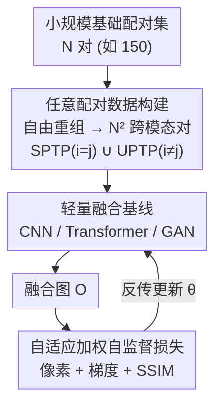

# Beyond Strict Pairing: Arbitrarily Paired Training for High-Performance Infrared and Visible Image Fusion

**会议**: CVPR 2026  
**论文**: [CVF Open Access](https://openaccess.thecvf.com/content/CVPR2026/html/Deng_Beyond_Strict_Pairing_Arbitrarily_Paired_Training_for_High-Performance_Infrared_and_CVPR_2026_paper.html)  
**代码**: https://github.com/yanglinDeng/IVIF_unpair （有）  
**领域**: 图像恢复 / 红外可见光图像融合  
**关键词**: 红外可见光融合, 任意配对训练, 无配对学习, 自监督融合, 自适应加权损失

## 一句话总结
本文挑战红外可见光图像融合（IVIF）必须用"严格对齐配对数据"训练的惯例，提出**任意配对训练范式（APTP）**——把 $N$ 对基础数据自由重组成 $N^2$ 个跨模态对，配上一套自适应加权的像素级自监督损失，在仅 150 对、内容不一致的数据上训练，就能逼近用 100 倍数据严格配对训练的融合性能。

## 研究背景与动机
**领域现状**：IVIF 要把红外的热辐射信息和可见光的颜色纹理融成一张图 $O=F(I_{ir}, I_{vis})$，主流方法（CNN / CNN-Transformer / GAN 三大类）几乎都默认一个前提：训练时必须喂**严格时空对齐的红外-可见光图像对**，靠这些对里"同一场景、同一内容"的一致性来学融合规则。

**现有痛点**：采集严格配对数据极其昂贵。不同天气下要同步两个传感器的空间/时间/设备参数，还要处理传感器标定误差、目标运动、热形变带来的配准问题；由于两个模态天然差异，做到"完美配准"几乎不可能。更隐蔽的代价是：一个数据集里能观察到的跨模态关系数量被数据集大小卡死（$N$ 对就是 $N$ 种关系），这个上界直接限制了模型能吸收的融合能力，泛化天花板很低。

**核心矛盾**：性能依赖数据量，但"既要大量、又要严格对齐"这两个要求互相打架——对齐越严苛，能收集到的数据越少；想多收数据，就得放弃严格对齐。

**切入角度**：作者抓住 IVIF 任务一个被忽视的本质——**它是像素级自监督任务，没有 ground-truth 融合图**。监督信号本来就是从源图像里抽的，而不是从某张"理想融合图"里抽的。既然如此，喂进去的两张源图是不是"同一场景对齐的"其实无关紧要——只要它们提供了可计算损失的像素关系即可。图像生成领域的无配对训练（如 CycleGAN）正是类似思路，但它需要一个明确的目标域，而 IVIF 没有"融合图域"，所以不能直接照搬。

**核心 idea**：放宽 SPTP 那个"内容严格一致"的学习目标，允许**任意跨模态像素组合**都能产生有效监督；并从概率独立性出发把优化目标从严格配对（$i=j$）扩展到任意配对（$\forall i,j$），论证 APTP 是无配对（UPTP）与严格配对（SPTP）的并集。

## 方法详解

### 整体框架
方法的核心不是设计一个新网络，而是**重新定义训练时的数据配对方式 + 配套一套不依赖内容一致性的自监督损失**。整条流程是：拿一个**很小**的基础严格配对集（如 150 对），把红外集 $\{x_{ir}^i\}$ 和可见光集 $\{x_{vis}^j\}$ 做笛卡尔式自由重组，得到最多 $N^2$ 个"任意配对"样本（其中 $i=j$ 是传统 SPTP，$i\neq j$ 是 UPTP）；这些任意对喂进一个**轻量融合基线**（作者用 CNN / Transformer / GAN 三种各做一个，验证范式与架构无关）；输出融合图 $O$ 后，用一套**自适应线性加权的像素/梯度/SSIM 损失**反传——这套损失只问"每个像素该更信哪个源、按什么比例融"，从不强制两张源图内容一致，因此任意配对照样能稳定收敛。

理论上作者还证明了：当源输入 $\{x_{ir}^i\}$ 与 $\{x_{vis}^j\}$ 相互独立时存在最优参数，且 $D_{APTP}=D_{SPTP}\cup D_{UPTP}$——凡是同时适配 SPTP 与 UPTP 的方法/策略，自动适配 APTP（反之不成立）。

### 关键设计

**1. 任意配对训练范式：用概率独立性把"严格配对"解耦成"自由重组"**

痛点直指 SPTP 的两个死结——采集成本高、可学关系被 $N$ 卡死。作者的做法是从优化目标层面动刀。先把 IVIF 写成最大似然：通过引入三个损失项的统计独立概率，联合概率正比于优化目标，再用贝叶斯定理拆成似然项+先验项，元素级形式为 $\arg\max_\theta \sum_{i=j} \big(\log p(x_{ir}^i, x_{vis}^j \mid o_{ij};\theta) + \log p(o_{ij};\theta)\big)$，这里 $i=j$ 正是严格配对的约束。关键一步：当红外、可见光图可以在不同地点/时间/设备下独立采集时，配对关系本质是随机的，联合分布可解耦为 $p(x_{ir}^i, x_{vis}^j)=p(x_{ir}^i)\cdot p(x_{vis}^j)$。代入后目标变成

$$\arg\max_{\theta'} \sum_{\forall i,j} \log p(o'_{ij}\mid x_{ir}^i, x_{vis}^j;\theta'),$$

约束从 $i=j$ 松绑为 $\forall i,j$。这带来两个理论结论：源输入独立时最优解存在；SPTP（$i=j$）与 UPTP（$i\neq j$）是 APTP 的互补子集。**为什么有效**：它不是推翻已有工作，而是把训练数据的可用关系从"一条对角线"扩展到"整个矩阵"，$N$ 对基础数据可重组出 $N^2$ 个可训练对（配对:无配对 = $1:(N-1)$），在数据量受限时尤其划算——既降采集成本，又靠关系多样性提升泛化和鲁棒性。

**2. 自适应线性加权自监督损失：让"内容不一致的任意对"也能产生稳定监督**

这是让 APTP 真正落地的关键——如果损失函数显式强制跨模态内容一致（或不一致），任意配对就训不动了。作者设计一个**通用线性加权函数**

$$W(a; a, b) = \frac{a}{a+b},$$

它在每个像素、每个信息维度（强度 / 梯度 / 结构）上自动决定哪张源图该占更大权重，并保留源像素的相对幅度避免失真，从而防止梯度爆炸/消失、稳住训练。基于它构造三类自适应权重：强度权 $P_{ir}=W(I_{ir};I_{ir},I_{vis})$、梯度权 $G_{ir}=W(\nabla I_{ir};\nabla I_{ir},\nabla I_{vis})$、结构权 $S_{ir}=W(\mathrm{SSIM}(I_{ir},O);\cdots)$（可见光同理）。对应三个损失：

$$L_{int}=\tfrac{1}{HW}\lVert O-(P_{ir}I_{ir}+P_{vis}I_{vis})\rVert_1,$$

$$L_{grad}=\tfrac{1}{HW}\lVert \nabla O-(G_{ir}\nabla I_{ir}+G_{vis}\nabla I_{vis})\rVert_1,$$

$$L_{ssim}=\lVert 1-(S_{ir}\,\mathrm{SSIM}(I_{ir},O)+S_{vis}\,\mathrm{SSIM}(I_{vis},O))\rVert_1.$$

CNN 与 Transformer 基线用 $L_C=L_T=L_{int}+\alpha L_{grad}+\beta L_{ssim}$；GAN 基线再减一项对抗损失 $-\lambda L_{adv}$。**为什么有效**：损失只衡量"输出像素是不是源像素的某个理想组合"，这个组合对不同损失项呈现不同的数据关系，无论源图对齐与否都能提供可训练的像素关系——因此严格对齐不再是必要条件。

**3. 三框架轻量基线：证明范式而非某个网络的功劳**

为了排除"是不是靠某个精巧网络才行"的质疑，作者刻意各搭一个**轻量基线**覆盖三大经典框架：CNN 擅长局部上下文、Transformer 擅长长程建模、GAN 走"生成-判别"模式。模型仅约 0.81MB（GAN 0.71MB），却在 SPTP / UPTP / APTP 三种范式下都能跑通且性能接近。**为什么有效**：三种架构同时成立，说明 APTP/UPTP 的可行性来自训练范式与损失设计本身，与具体网络无关，普适性更强；轻量也顺带验证了"复杂架构不是高性能的必要条件"这一观察。

### 损失函数 / 训练策略
超参全程固定：$\alpha=1$、$\beta=0.2$、$\lambda=0.01$。训练/评测数据集为 MSRS、M3FD、LLVIP、RoadScene、TNO；评测指标用一个无参考指标 EN（熵）和四个全参考指标 MI、VIFF、Q_{ab/f}、SSIM。一个反直觉的工程注意点：因为基线只有 0.88MB，**盲目增大可训练数据量反而会掉点**——容量与数据量要匹配。

## 实验关键数据

### 主实验（与 SOTA 对比，跨四数据集泛化）
仅用 MSRS+M3FD 的 150 对源图扩展到 15000 对训练，对比 9 个 SOTA（值越大越好；这里摘 LLVIP/MSRS 的 MI 与 SSIM）：

| 方法 | 来源 | LLVIP MI | LLVIP SSIM | MSRS MI | MSRS SSIM |
|------|------|----------|-----------|---------|-----------|
| SAGE | 25' CVPR | 1.81 | 0.81 | 2.23 | 0.88 |
| GIFNet | 25' CVPR | 1.56 | 0.74 | 1.36 | 0.85 |
| DCINN | 24' IJCV | 2.00 | 0.77 | 2.30 | 0.73 |
| **Ours (CNN)** | — | **2.54** | **0.91** | **2.69** | **1.00** |
| **Ours (Transf)** | — | **2.56** | **0.92** | **2.64** | **0.99** |
| **Ours (GAN)** | — | **2.51** | **0.92** | **2.56** | **1.01** |

三个轻量基线在四个数据集（含三个未见数据集 MSRS/RoadScene/TNO）上全面领先，模型却只有 ~0.81MB，体现强泛化 + 高效率。

### 消融 / 验证实验
核心验证 APTP 能否"以小博大"——同一 150 对基础集，扩到 15000 对（100×）后三范式对比（MSRS 上 CNN 基线）：

| 范式 | 配对量 | 是否扩展 | 可训练量 | MI | VIF | Qabf | SSIM |
|------|--------|---------|---------|----|-----|------|------|
| SPTP | 150 | ✗ | 150 | 2.57 | 0.88 | 0.60 | 0.96 |
| UPTP | 150 | ✗ | 150 | 2.62 | 0.90 | 0.61 | 0.97 |
| UPTP | 150 | ✓ | 15000 | 2.70 | 0.93 | 0.65 | 0.99 |
| SPTP | 15000 | ✗ | 15000 | 2.70 | 0.93 | 0.65 | 0.98 |
| APTP | 150 | ✓ | 15000 | 2.69 | 0.93 | 0.65 | 0.98 |

只用 150 对基础数据 + 重组，性能就追平了真·15000 对严格配对（100× 数据量）。另一组"不同基础配对量"实验显示 APTP 的相对增益随基础数据越小越显著：

| 基础量 | APTP 扩展量 | 平均提升 |
|--------|-----------|---------|
| 15 → | 225 | +8.89% |
| 30 → | 900 | +5.17% |
| 60 → | 3600 | +4.35% |
| 150 → | 22500 | +3.94% |

### 关键发现
- **UPTP 训练中间结果"视觉混乱"但不影响最终性能**：因为缺乏显式配对，UPTP 早期融合图很乱，但在配对测试图上评测时 SSIM 与 SPTP 相当甚至更好——证明模型学到的是内容无关的像素级关系，而非死记某个对齐场景。
- **EN 偶尔下降但其它指标继续涨**，作者解释为模型在过滤噪声、提升信息密度，是良性现象。
- **数据量并非越大越好**：受限于 0.88MB 的小模型容量，过度扩张可训练数据会掉点，存在容量-数据量匹配点。
- **跨数据集重组也有效**：用 M3FD 红外 + MSRS 可见光这类完全不同场景的跨库重组训练，多数配置仍一致提升，说明融合学的是 content-independent 的像素映射。

## 亮点与洞察
- **把"自监督无 GT"从缺点变成卖点**：正因为 IVIF 没有理想融合图、监督来自源图本身，所以"源图对不对齐"在损失计算上根本不重要——这个洞察是整篇论文的支点，简单却反直觉。
- **$N\to N^2$ 的数据关系放大**是个可迁移的视角：任何"配对成本高、但监督信号来自配对内部关系而非外部标签"的任务，都可能用类似的自由重组扩张训练关系。
- **用三种架构同时验证范式**，把"范式有效"和"某网络有效"干净地解耦，方法学上很扎实。
- $W(a;a,b)=\frac{a}{a+b}$ 这个朴素的线性加权同时充当了"自动选源 + 防梯度爆炸"的双重角色，是个简洁好复用的 trick。

## 局限与展望
- **强依赖小模型容量**：作者自己承认数据量过大反而掉点，方法的甜区与模型容量绑定，换大模型时 $N^2$ 扩张能否继续受益未知。
- **跨数据集重组有"次优组"**：Table 2 最后一组（MSRS↔M3FD 某方向）出现 EN/SSIM 下降、只换来 MI/VIF/Qabf 提升的 trade-off，说明并非任意跨库组合都安全，缺少"哪些组合该选"的判据。
- **理论独立性假设较强**：$p(x_{ir}^i,x_{vis}^j)=p(x_{ir}^i)p(x_{vis}^j)$ 假定模态间完全独立，但真实场景红外与可见光仍有统计相关性，这个理想化假设在实际数据上的偏差未充分讨论。⚠️ 部分公式细节（如 Eqn. 8/9 中 $\alpha,\beta$ 的位置）以原文为准。
- **下游任务未验证**：只报了融合图质量指标，没验证 APTP 训出的融合图在检测/分割等下游任务上的实际收益。

## 相关工作与启发
- **vs 严格配对 IVIF（CNN/Transformer/GAN 各类，如 SAGE、GIFNet）**：它们靠大量严格对齐对学融合，受限于固定配对结构的关系上界；本文用任意重组突破这个上界，150 对即可匹敌 100× 数据。
- **vs 图像生成的无配对训练（CycleGAN [57] 等）**：CycleGAN 需要明确的目标域 + 循环一致性；IVIF 没有"融合图域"，无法照搬。本文转而利用 IVIF 像素级自监督这一特性，在没有目标域的情况下实现无配对训练。
- **vs 配准类方法**：传统路线是"先配准再融合"对抗 misalignment；本文直接绕过配准需求，从训练范式层面消解对齐依赖，思路上更釜底抽薪。

## 评分
- 新颖性: ⭐⭐⭐⭐⭐ 把 IVIF 从"严格配对"解放到"任意配对"，并给出 SPTP∪UPTP=APTP 的理论刻画，视角新且自洽。
- 实验充分度: ⭐⭐⭐⭐ 三架构 × 五数据集 × 多范式对比扎实，但缺下游任务与大模型验证。
- 写作质量: ⭐⭐⭐⭐ 理论推导清晰、动机讲透；个别公式排版稍乱需对照原文。
- 价值: ⭐⭐⭐⭐⭐ 直击 IVIF 数据采集成本这一痛点，150 对追平 100× 数据，实用价值高。

<!-- RELATED:START -->

## 相关论文

- [\[CVPR 2026\] Bridging Human Evaluation to Infrared and Visible Image Fusion](bridging_human_evaluation_to_infrared_and_visible_image_fusion.md)
- [\[CVPR 2026\] RegionFuse: Region-Adaptive Pixel Distribution Learning for Infrared and Visible Image Fusion](regionfuse_region-adaptive_pixel_distribution_learning_for_infrared_and_visible_.md)
- [\[CVPR 2026\] Customized Fusion: A Closed-Loop Dynamic Network for Adaptive Multi-Task-Aware Infrared-Visible Image Fusion](customized_fusion_a_closed-loop_dynamic_network_for_adaptive_multi-task-aware_in.md)
- [\[CVPR 2026\] Degradation-Robust Fusion: An Efficient Degradation-Aware Diffusion Framework for Multimodal Image Fusion in Arbitrary Degradation Scenarios](degradation-robust_fusion_an_efficient_degradation-aware_diffusion_framework_for.md)
- [\[CVPR 2026\] Beyond the Ground Truth: Enhanced Supervision for Image Restoration](beyond_the_ground_truth_enhanced_supervision_for_image_restoration.md)

<!-- RELATED:END -->
