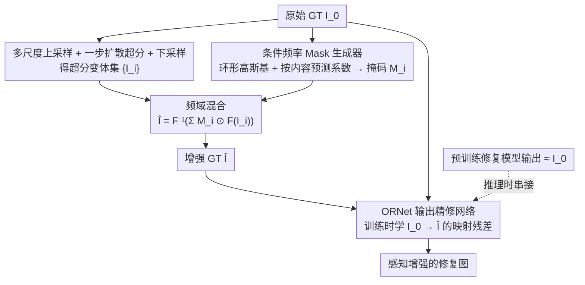

# Beyond the Ground Truth: Enhanced Supervision for Image Restoration

**会议**: CVPR 2026  
**arXiv**: [2512.03932](https://arxiv.org/abs/2512.03932)  
**代码**: [项目页](https://hij1112.github.io/beyond-the-ground-truth/)  
**领域**: 图像修复  
**关键词**: 监督增强, 频域混合, 超分辨率, 输出精修网络, 感知质量

## 一句话总结
提出通过超分辨率+频域自适应混合来增强现有数据集中次优GT图像的感知质量，并训练轻量级ORNet精修模块，无需修改预训练修复模型即可提升输出的感知质量。

## 研究背景与动机
**领域现状**：深度学习图像修复在有监督训练范式下取得巨大成功，但模型性能受限于GT图像的质量。

**核心痛点**：真实世界数据集中的GT图像由于采集限制往往**并非理想**：
   - 去模糊数据集（GoPro等）：GT选自视频序列，仍含微弱相机抖动
   - 去噪数据集（SIDD等）：GT由多帧噪声图像平均获得，导致模糊
   - 模型在次优GT上训练必然继承这些缺陷

**现有尝试**：扩散模型可提升感知质量，但推理开销大且易产生幻觉（hallucination）

**核心idea**：不改进模型架构，而是**增强监督信号本身**——在频域中自适应融合原始GT的语义结构和超分辨率变体的感知细节，产出"增强GT"

## 方法详解

### 整体框架

这篇论文不动修复模型，而是去改「监督信号」本身：既然数据集里的 GT 本身就不完美（GoPro 的 GT 仍带轻微抖动、SIDD 的 GT 由多帧平均而偏糊），那就先把 GT 升级成「增强 GT」，再让一个轻量模块学会把普通 GT 映射到增强 GT。整体分两阶段——监督增强阶段把原始 GT $I_0^{GT}$ 经多尺度双三次上采样、一步扩散超分、再下采样回原分辨率得到若干变体 $\{I_i^{GT}\}_{i=1}^N$，在频域里自适应混合成增强 GT $\hat{I}^{GT}$；输出精修阶段训练一个 ORNet 学习 $I_0^{GT} \to \hat{I}^{GT}$ 的映射，推理时直接串在任意预训练修复模型之后。

### 关键设计

**1. 频域混合：在频域里保语义、补细节，避开超分的幻觉**

直接在空间域把超分变体和原 GT 混在一起，很难同时保住高层语义结构又只增强细节。本文改在频域做混合：$\hat{I}^{GT} = \mathcal{F}^{-1}\left(\sum_{i=0}^{N} M_i \odot \mathcal{F}(I_i^{GT})\right)$，其中各频段掩码满足 $\sum_i M_i = 1$。这样可以精确分工——低频（语义）保留原始 GT，高频（细节）选择性地融入超分变体，从而在提升感知质量的同时绕开扩散超分常见的高频幻觉。

**2. 条件频率 Mask 生成器：让每张图自己决定各频段怎么混**

频域混合好不好，关键在掩码 $M_i$ 怎么来。本文预定义 $B$ 个环形高斯基础掩码 $R_b$，$(R_b)_{h,w} = \exp\!\big(-(d(h,w)-\mu_b)^2/2\sigma_b^2\big)$，用带通形状精确覆盖从低到高的各个频率，高斯的平滑过渡则避免频段切换处产生伪影；再由一个网络根据图像内容预测组合系数 $c_{i,b} = g(I_0^{GT}, \lambda)$，最终掩码为 $M_i = \text{softmax}_i\!\big(\sum_b c_{i,b} R_b\big)$。网络输入同时喂 RGB 和 FFT 表示，让它联合利用空间和频域信息来给每张图定制混合策略。

**3. ORNet 输出精修网络：一次训练，挂在谁后面都能用**

增强 GT 只在训练时存在，真正要让现有修复系统受益，还需要一个能在推理时复用的桥梁。ORNet 直接学 $I_0^{GT} \to \hat{I}^{GT}$ 的映射，训练目标为 $\mathcal{L}_{ref} = \|R_\theta(I_0^{GT}, \lambda) - \hat{I}^{GT}\|_2^2$；由于预训练修复模型已经满足 $R_\phi(I^{LQ}) \approx I_0^{GT}$，ORNet 实际只需补上「GT→增强 GT」这一小段残差。它与具体修复模型解耦，不改架构、不重训骨干，接在任意预训练修复模型后面即可，因此具备很强的即插即用价值。

### 损失函数 / 训练策略

Mask 生成器用保真-感知的加权损失训练：$\mathcal{L} = (1-\lambda)\mathcal{L}_{recon} + \lambda\mathcal{L}_{percep}$，其中 $\mathcal{L}_{recon} = \|\hat{I}^{GT} - I_0^{GT}\|_2^2$ 维持语义一致，$\mathcal{L}_{percep} = -\sum_k \text{IQA}_k(\hat{I}^{GT})$（用 MUSIQ/MANIQA/TOPIQ）提升感知质量，$\lambda$ 控制保真度与感知质量之间的平衡。

## 实验关键数据

### 主实验（GoPro去模糊 + SIDD去噪）

| 方法 | MUSIQ↑ | MANIQA↑ | TOPIQ↑ | LIQE↑ |
|------|--------|---------|--------|-------|
| AdaRevD | 45.49 | 0.5363 | 0.3393 | 1.566 |
| **+ORNet** | **64.25** | **0.5916** | **0.4880** | **2.429** |
| FFTformer | 46.47 | 0.5420 | 0.3456 | 1.613 |
| **+ORNet** | **64.57** | **0.5949** | **0.4924** | **2.466** |
| NAFNet (SIDD) | 22.73 | 0.3937 | 0.2458 | 1.219 |
| **+ORNet** | **35.87** | **0.4380** | **0.3776** | **1.959** |

### 消融实验 / OOD鲁棒性

| 场景 | 方法 | MUSIQ↑ | LPIPS↓ | 说明 |
|------|------|--------|--------|------|
| +高斯模糊σ=2.5 | FFTformer | 22.38 | 0.471 | OOD退化 |
| | +ORNet | **42.91** | **0.343** | 强鲁棒性 |
| +白噪声σ=9 | FFTformer | 30.14 | 0.446 | OOD退化 |
| | +ORNet | **41.88** | **0.407** | 能去除残余退化 |

### 关键发现
- ORNet在所有感知指标上带来**巨幅提升**（MUSIQ从45→64，提升40%+）
- 在OOD场景（训练时未见的退化类型）下仍然有效，说明ORNet学到了通用的感知增强能力
- VLM-based评估（VisualQuality-R1、Q-Insight）也确认了质量提升
- 用户研究进一步验证了增强GT和ORNet输出的感知优越性

## 亮点与洞察
- **视角新颖**：不改进模型而改进监督信号，是图像修复范式的重要补充
- 频域混合巧妙地避免了超分辨率的幻觉问题——低频保原始、高频选择性增强
- ORNet的模型无关特性极具实用价值：一次训练，适配所有修复模型
- OOD鲁棒性表明ORNet学到的不仅是特定退化的修复

## 局限与展望
- PSNR/SSIM等保真度指标可能略有下降（感知-失真trade-off）
- 依赖预训练超分辨率模型的质量
- 增强GT的"正确性"如何严格定义仍是开放问题
- 未探索视频修复等时序场景

## 相关工作与启发
- 与StableSR等扩散先验修复方法互补：后者替换整个修复流程，本文仅增强监督
- 频域混合思路可推广到其他监督学习任务（如医学图像分割的GT增强）
- 对数据集构建方法论有启发：GT质量可以通过后处理系统性提升

## 评分
- 新颖性: ⭐⭐⭐⭐ 监督增强视角新颖，频域混合设计精妙
- 实验充分度: ⭐⭐⭐⭐⭐ 多任务（去模糊+去噪）、多模型、OOD测试、用户研究全面
- 写作质量: ⭐⭐⭐⭐ 框架图清晰，方法描述详实
- 价值: ⭐⭐⭐⭐ 实用性强，ORNet可即插即用提升现有系统

<!-- RELATED:START -->

## 相关论文

- [\[CVPR 2026\] Beyond Ground-Truth: Leveraging Image Quality Priors for Real-World Image Restoration](beyond_ground-truth_leveraging_image_quality_priors_for_real-world_image_restora.md)
- [\[CVPR 2026\] ShiftLUT: Spatial Shift Enhanced Look-Up Tables for Efficient Image Restoration](shiftlut_spatial_shift_enhanced_look-up_tables_for_efficient_image_restoration.md)
- [\[CVPR 2026\] LRHDR: Learning Representation-enhanced HDR Video Reconstruction](lrhdr_learning_representation-enhanced_hdr_video_reconstruction.md)
- [\[CVPR 2026\] Blink: Dynamic Visual Token Resolution for Enhanced Multimodal Understanding](blink_dynamic_visual_token_resolution_for_enhanced_multimodal_understanding.md)
- [\[CVPR 2026\] Beyond Strict Pairing: Arbitrarily Paired Training for High-Performance Infrared and Visible Image Fusion](beyond_strict_pairing_arbitrarily_paired_training_for_high-performance_infrared_.md)

<!-- RELATED:END -->
