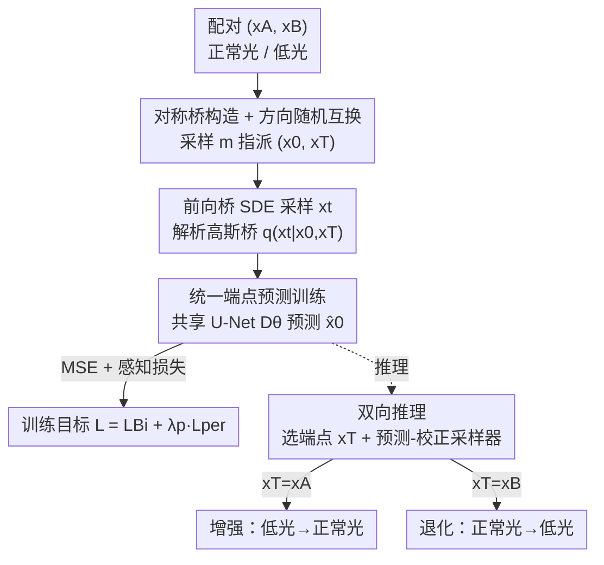

# Bi-Bridge: Bidirectional Diffusion Bridges for Low-Light Image Enhancement

**会议**: CVPR 2026  
**论文**: [CVF Open Access](https://openaccess.thecvf.com/content/CVPR2026/html/Hua_Bi-Bridge_Bidirectional_Diffusion_Bridges_for_Low-Light_Image_Enhancement_CVPR_2026_paper.html)  
**代码**: 未公开  
**领域**: 图像恢复 / 扩散模型  
**关键词**: 低光增强, 扩散桥, 双向一致性, DDBM, 内容保真  

## 一句话总结
把"低光→正常光"的增强和"正常光→低光"的退化塞进**同一个对称扩散桥**里、用一张共享 U-Net 同时学，靠这个双向一致性约束当隐式正则，让低光增强在保真度（PSNR/LPIPS）上显著超过现有 SOTA。

## 研究背景与动机
**领域现状**：低光图像增强（LLIE）本质是一个病态逆问题——暗区里纹理和颜色信息严重丢失，一张低光图可以对应多张"看起来都对"的正常光图（one-to-many）。主流做法分两类：① 回归式（CNN/Transformer，如 SNR-Aware、Retinexformer、CIDNet）学一个一对一映射；② 生成式扩散模型（"Noise-to-Image"，如 GSAD、ReDDiT）从随机噪声出发建模复原分布。

**现有痛点**：回归式方法面对 one-to-many 只能输出所有可能解的"平均预测"，结果纹理过度平滑、高频细节丢失；"Noise-to-Image"扩散从一个无信息的随机先验起步，要跨越巨大的 domain gap 才能回到源图的结构，往往保不住原图的内容与结构（content fidelity 差、颜色漂移）。即便是近年的"Image-to-Image"扩散桥（DDBM），它在数据域之间直接搭桥、缩小了 domain gap，但**只学了单向**——只盯着复原过程。

**核心矛盾**：现有 LLIE 范式几乎都是**非对称、单向**的，只建模"增强"这一个方向，丢掉了"光照变化天然是对称可逆的"这一物理先验。增强（变亮）和退化（变暗）共享同一套内容结构，单向训练学不到这种不变性，导致保真度上不去。

**本文目标**：能不能**把退化过程和增强过程一起学**，用这个对称性当约束来提升复原保真度？

**切入角度**：作者抓住 DDBM 一个被忽视的数学性质——它那个可解析的高斯桥分布，其**均值关于两个端点 $x_0$、$x_T$ 是结构对称的**。既然增强和退化只是端点角色互换，那就完全可以用同一个网络、同一套桥公式覆盖两个方向。

**核心 idea**：在 DDBM 之上引入**双向一致性约束**——训练时随机互换起点/终点角色，强迫一张共享 U-Net 学一个"与方向无关"的统一映射，让网络被迫把"内容"和"光照"解耦，从而当隐式正则大幅提升保真度。

## 方法详解

### 整体框架
Bi-Bridge 建立在 DDBM（Denoising Diffusion Bridge Model）之上。DDBM 不像标准扩散那样把图像腐蚀成纯噪声，而是用 Doob's h-transform 在**两个数据分布之间**（正常光 $x_0$ ↔ 低光 $x_T$）直接搭一条随机桥：前向 SDE 带一个引导项 $h(\cdot)=\nabla_{x_t}\log p(x_T\mid x_t)$ 保证轨迹精确落到指定端点；学习目标是去逼近反向过程的 score（通过 Denoising Bridge Score Matching）。

Bi-Bridge 的改动只在一处、却很关键：**不再为增强和退化各训一个模型**，而是用一张共享 U-Net $D_\theta$ 同时承担两个方向。训练时对每个配对 $(x_A,x_B)$ 随机采一个二值方向指示 $m$，动态决定谁当起点 $x_0$、谁当终点 $x_T$；网络只干一件事——在给定终点的条件下预测正确的起点。推理时则通过选择不同的条件端点 $x_T$，让同一条反向路径既能做增强（$x_A\to x_B$）也能做退化（$x_B\to x_A$）。

### 关键设计

**1. 对称桥构造 + 方向随机互换：用一张网络覆盖增强与退化两个方向**

单向 DDBM 要做双向就得训两个模型，既翻倍算力，更糟的是网络永远学不到"光照变化是对称的"这一内在关系，保真度被限死。作者发现 DDBM 的可解析高斯桥 $q(x_t\mid x_0,x_T)=\mathcal{N}(x_t;\hat\mu_t,\hat\sigma_t^2 I)$，其均值

$$\hat\mu_t=\alpha_t\Big(1-\tfrac{\mathrm{SNR}_T}{\mathrm{SNR}_t}\Big)x_0+\alpha_t\tfrac{\alpha_T}{\alpha_t}\tfrac{\mathrm{SNR}_T}{\mathrm{SNR}_t}x_T$$

对两个端点 $(x_0,x_T)$ 呈显式对称耦合（$\mathrm{SNR}_t=\alpha_t^2/\sigma_t^2$ 是信噪比）。既然公式本身对端点对称，那就可以让端点角色随机互换：对每个配对 $(x_A,x_B)$ 采二值变量 $m$，$m=0$ 时 $(x_0,x_T)=(x_A,x_B)$，$m=1$ 时 $(x_0,x_T)=(x_B,x_A)$。同一张网络一会儿学"从低光端点回到正常光起点"、一会儿学"从正常光端点回到低光起点"——这就是双向一致性约束的来源，它逼网络把会变的"光照"和不变的"内容"分开，本质是个强力隐式正则。

**2. 统一端点预测训练：用最朴素的 MSE 实现稳定的双向 score matching**

直接优化 score-matching 目标虽然理论成立，但训练不稳。作者沿用 pred-x 参数化：让统一网络**直接预测起点** $\hat x_0=D_\theta(x_t,x_T,t)$，再把这个预测代回去近似那个本来不可解的 score：

$$\nabla_{x_t}\log q(x_t\mid x_T)\approx s_\theta(x_t,x_T,t)=-\frac{x_t-\hat\mu_t(\hat x_0,x_T)}{\hat\sigma_t^2}$$

也就是把均值公式里的真值 $x_0$ 换成网络预测 $\hat x_0$。这样一来，训练就退化成一个极简的 MSE 回归目标：

$$\mathcal{L}_{Bi}=\mathbb{E}_{m,(x_A,x_B),t}\big[\lVert D_\theta(x_t,x_T,t)-x_0\rVert^2\big]$$

其中 $x_t\sim q(x_t\mid x_0,x_T)$。最小化这一个目标，就等价于在两个方向上同时做稳定的 score matching——共享预测器被迫"保住不变内容、灵活建模可变光照"。妙在整个双向能力没有引入任何新结构，只是改了训练时端点的指派方式。

**3. 双向推理 + 预测-校正混合采样器：同一模型按需做增强或退化**

训练好后，$D_\theta$ 可无缝用于两个任务，区别只在推理时选哪个端点当条件：增强时设 $x_T=x_A$（低光），从 $t=T$ 反向积分反向 SDE 生成正常光 $x_B$；退化时设 $x_T=x_B$ 生成低光 $x_A$。每一步要近似 SDE 的漂移项，由解析 h-transform 与 score $s_\theta$ 组合，而 score 又由当前预测 $\hat x_0$ 经上面的重参数化实时导出。为兼顾保真与采样效率，作者用一个高阶混合的预测-校正采样器：先走一步随机步（Euler-Maruyama）注入有益噪声以生成细粒度纹理，再走一步确定性校正步（Heun）做更稳更准的更新——在"随机性带来细节"和"ODE 求解的稳定性"之间取平衡。这也是 Bi-Bridge 仅用 10 NFE 就能逼平别的桥模型 80 NFE 的原因之一。

### 损失函数 / 训练策略
总目标在桥损失外再加一个辅助感知损失 $L_{per}$，惩罚预测 $\hat x_0$ 与真值 $x_0$ 在预训练网络深层特征上的 MSE：$L_{per}=\lVert\phi(\hat x_0)-\phi(x_0)\rVert_2^2$。最终目标为加权和

$$\mathcal{L}=\mathcal{L}_{Bi}+\lambda_p\mathcal{L}_{per}$$

$\lambda_p$ 平衡两项，感知损失主要帮结构与纹理细节更贴近人眼偏好。

## 实验关键数据

### 主实验
在 LOL-v1（485 训练对）和 LOL-v2（real / synthetic）三个配对基准上评测，指标 PSNR↑ / SSIM↑ / LPIPS↓。Bi-Bridge 在 PSNR 与 LPIPS 上全面领先，尤其相对自己的单向基线 DDBM 提升巨大。

| 数据集 | 指标 | 本文 Bi-Bridge | DDBM(单向基线) | 此前较优 | 提升(vs 基线) |
|--------|------|------|------|------|------|
| LOL-v2-Synthetic | PSNR / LPIPS | **31.019** / **0.025** | 27.872 / 0.079 | ReDDiT 30.166 / 0.028 | +3.15 dB / −0.05 |
| LOL-v2-Real | PSNR / LPIPS | **31.287** / **0.040** | 26.353 / 0.165 | PyDiff 29.629 / ReDDiT 0.040 | +4.93 dB / −0.12 |
| LOL-v1 | PSNR / LPIPS | 27.879 / **0.052** | 24.451 / 0.159 | CIDNet 28.141 / ReDDiT 0.052 | +3.43 dB / −0.11 |

相对回归式 SOTA CIDNet，在 LOL-v2-real 上 PSNR +2.894 dB；相对 Noise-to-Image 的 ReDDiT，感知指标更优。⚠️ 注意 SSIM 并非全面第一：LOL-v2-real 上本文 SSIM 0.841 仍低于 CIDNet(0.887)、ReDDiT(0.895)，论文的卖点集中在 PSNR/LPIPS 这两类保真度与感知指标。

无配对零样本泛化（在 LOL-v2-syn 上训练、直接测 5 个真实低光数据集，指标 NIQE↓）：

| 方法 | DICM | LIME | MEF | NPE | VV |
|------|------|------|------|------|------|
| CIDNet | 3.79 | 4.13 | 3.56 | 3.74 | **3.21** |
| ReDDiT | 3.62 | 3.45 | 3.93 | 3.24 | 3.00 |
| **Ours** | **3.35** | **3.14** | **3.11** | **3.11** | 3.19 |

5 个数据集里 4 个拿到最优 NIQE，无需任何微调，说明对称学习带来的鲁棒性。

### 消融实验
对照完整模型与三个削弱版（Baseline 单向 DDBM、去掉双向目标 w/o Bi-directional、去掉感知损失 w/o $L_{per}$），在不同 NFE 下比较（Figure 6，曲线无逐点数值）：

| 配置 | 相对表现 | 说明 |
|------|---------|------|
| Full (Ours) | 最优 | 双向 + 感知损失 |
| w/o $L_{per}$ | 次优 | 去感知损失略降，主要影响结构/纹理细节 |
| w/o Bi-directional | 中等 | 仅桥结构、无对称约束 |
| Baseline (单向 DDBM) | 最差 | 标准单向扩散桥 |

### 关键发现
- **双向一致性约束是性能主引擎**：w/o Bi-directional → Full 的大幅跃升，且这个跃升**完全不来自任何结构改动**，纯靠对称训练；作者据此论证它是把"内容"与"光照"解耦、抑制单向训练易学到的伪相关的关键。
- **采样效率约 4×**：20-NFE 的 Bi-Bridge 在 LOL-v2-real 上即可匹配甚至超过 80-NFE 的 Baseline；10-NFE 时已能超过 DDBM/I2SB 的 80-NFE PSNR，源于对称目标学到了更直接的增强路径。
- **退化方向的涌现优势**：双向训练出来的模型做"正常光→低光"退化时，竟然比**专门只训退化**的单向 DDBM 还保真（极暗阴影里保留更多纹理、颜色更真实），暗示对称学习学到了更本质、可迁移的光照变化表征，可用作高保真数据增广。

## 亮点与洞察
- **几乎零成本的强正则**：双向能力不靠新模块、不靠新损失项的堆叠，只是"训练时随机互换端点角色"这一行改动，却能换来 +4.9 dB PSNR——把数学性质（高斯桥均值对端点对称）直接翻译成训练技巧，非常优雅。
- **物理先验的工程化**：把"光照变化天然可逆对称"这个直觉，落到 DDBM 桥公式的对称结构上，是"对的先验 + 对的载体"的范例；通用双向框架 BDBM 没针对视觉任务，反而被这个更简单的专用设计超过。
- **可迁移思路**：凡是"正变换/逆变换共享同一内容、只换一个属性"的成对翻译任务（去雾/加雾、去噪/加噪、超分/降采样），都可以照搬"端点随机互换 + 共享预测器"来当隐式正则提保真。

## 局限与展望
- **迭代采样仍慢**：作者承认扩散桥的迭代本质对实时应用不友好，把推理加速列为未来方向（虽然 10-NFE 已经比同类省）。
- **SSIM 上不占优**（自己发现）：在 LOL-v2-real 等数据集 SSIM 落后于 CIDNet/ReDDiT，说明结构相似度上对称约束未必处处更好，论文叙事主要押在 PSNR/LPIPS。
- **数据合成只有定性评估**：退化方向"比专家模型还好"的结论靠可视化（缺标准定量指标），强度有限，⚠️ 这一观察的可重复性有待更系统的量化验证。
- **依赖配对数据训练**：核心训练目标是配对 MSE，对完全无配对场景的可扩展性论文未深入。

## 相关工作与启发
- **vs DDBM**：DDBM 是单向 Image-to-Image 扩散桥（固定 $x_0\to x_T$）。本文不改架构，只在其高斯桥对端点对称这一性质上加双向一致性约束，把它从"专家单向模型"升级成"统一双向模型"，是直接的超越式改进（同一基线 +4.9 dB）。
- **vs BDBM**：BDBM 也是双向桥，但建立在 Chapman-Kolmogorov 的通用数学理论上、面向任意分布，没为视觉任务的结构先验优化。本文走任务定向路线，用更简单的设计在 LLIE 上反超 BDBM。
- **vs LLFlow（Normalizing Flow）**：NF 的可逆性只是为精确似然训练服务的数学工具，并没显式学物理退化过程；本文显式让网络同时掌握增强与退化两个物理方向。
- **vs Noise-to-Image 扩散（GSAD/ReDDiT）**：它们从随机先验起步、要跨大 domain gap，难保内容；本文在数据域间直接搭桥并强制双向，从根上缓解保真问题。

## 评分
- 新颖性: ⭐⭐⭐⭐⭐ 把"高斯桥均值对端点对称"翻译成双向一致性约束，几乎零成本却换来大幅保真提升，视角巧妙。
- 实验充分度: ⭐⭐⭐⭐ 配对+无配对+效率+消融+数据合成五维覆盖，但消融仅给曲线无数值表，数据合成只定性。
- 写作质量: ⭐⭐⭐⭐⭐ 动机推导清晰，把"为什么对称有用"讲透，公式与叙事衔接好。
- 价值: ⭐⭐⭐⭐ LLIE 上刷新保真 SOTA 且采样更省，对称训练思路可迁移到其他成对复原任务。

<!-- RELATED:START -->

## 相关论文

- [\[CVPR 2026\] BiEvLight: Bi-level Learning of Task-Aware Event Refinement for Low-Light Image Enhancement](bievlight_bi-level_learning_of_task-aware_event_refinement_for_low-light_image_e.md)
- [\[CVPR 2026\] MR. Illuminate: Zero-Shot Low-Light Image Enhancement with Diffusion Prior](mr_illuminate_zero-shot_low-light_image_enhancement_with_diffusion_prior.md)
- [\[CVPR 2026\] Multinex: Lightweight Low-light Image Enhancement via Multi-prior Retinex](multinex_lightweight_low-light_image_enhancement_via_multi-prior_retinex.md)
- [\[CVPR 2026\] Residual Diffusion Bridge Model for Image Restoration](residual_diffusion_bridge_model_for_image_restoration.md)
- [\[CVPR 2026\] Event-Illumination Collaborative Low-light Image Enhancement with a High-resolution Real-world Dataset](event-illumination_collaborative_low-light_image_enhancement_with_a_high-resolut.md)

<!-- RELATED:END -->
