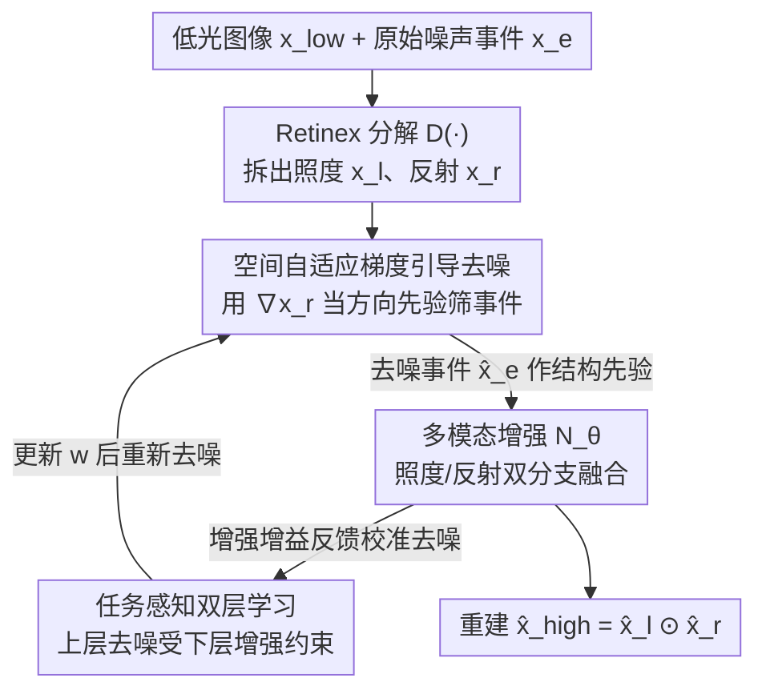

# BiEvLight: Bi-level Learning of Task-Aware Event Refinement for Low-Light Image Enhancement

**会议**: CVPR 2026  
**论文**: [CVF Open Access](https://openaccess.thecvf.com/content/CVPR2026/html/Yao_BiEvLight_Bi-level_Learning_of_Task-Aware_Event_Refinement_for_Low-Light_Image_CVPR_2026_paper.html)  
**代码**: https://github.com/iijjlk/BiEvlight  
**领域**: 图像恢复 / 低光增强 / 事件相机  
**关键词**: 低光图像增强, 事件相机, 事件去噪, 双层优化, 梯度引导

## 一句话总结
针对事件相机辅助低光增强中"事件流被 BA 噪声污染、去噪与增强割裂"的痛点，BiEvLight 把事件去噪从静态预处理改写成受增强任务约束的双层优化问题，让下层增强的增益反馈去校准上层去噪，再配一个用图像梯度引导的空间自适应去噪先验，在真实噪声数据集 SDE 上平均涨 1.30dB PSNR / 0.047 SSIM。

## 研究背景与动机
**领域现状**：事件相机有高动态范围、微秒级时间分辨率，能绕开传统帧相机在低光下的运动模糊和曝光困境，所以近年用事件辅助低光图像增强（LLIE）很火。主流做法几乎全在"怎么融合"上做文章——设计各种 event–image 的融合模块，把事件提供的高频边缘/时序信息塞进帧图像里。

**现有痛点**：但这些工作几乎都忽略了一件事——**低光下的事件数据本身就是脏的**。事件相机的内部电路随机涨落和暗电流会触发"背景活动噪声"（BA noise）；而低光场景为了捕捉微弱亮度变化往往要调低对比度阈值 $\epsilon$，这会把 BA 噪声急剧放大，导致事件流被噪声淹没，作为高频先验的可靠性大打折扣。现有的事件去噪方法（最近邻滤波、时间面 Time Surface）只靠事件单模态的时空局部相关性，在中低密度噪声下有效，但在极暗、高密度 BA 噪声场景下既压不干净噪声、又会把真实结构细节抹掉。

**核心矛盾**：问题有两层。其一，图像低 SNR + 事件 BA 噪声 = **双重退化**，融合时两路噪声耦合放大，成为性能瓶颈。其二，即便单独做事件去噪，把它当成"增强前的静态预处理"也注定有个 trade-off：去噪太狠会连真实结构一起删掉，去噪太软残留噪声会顺着融合阶段污染增强结果——而且这个去噪结果一旦固定，**根本无法适配下游具体增强目标的需求**，因为两个任务之间没有任何反馈或信息交换。

**本文目标**：把"先把事件去干净，再融合增强"这条串行流水线，换成两个任务互相校准的协同优化，让去噪学到的是"为这个增强目标量身定制"的事件表示。

**切入角度**：作者基于亮度恒常假设 + Retinex 理论推导出一个关键观察——**事件主要由物体边缘的运动触发，因此事件流在空间上与图像梯度强相关**（$\Delta J_\zeta(t) \approx -\nabla_R J_\zeta(t)\cdot v\Delta t$）。真实事件落在强梯度支撑上、与梯度方向对齐；而背景噪声与梯度无关、缺乏时空一致性。这就给了"用图像梯度当方向性先验去筛事件"的天然抓手。

**核心 idea**：用一句话概括就是——**把事件去噪重写成受增强任务约束的双层优化问题，再用反射分量的梯度做空间自适应去噪先验**，让"去噪 ↔ 增强"形成双向反馈而不是单向流水线。

## 方法详解

### 整体框架
BiEvLight 由两个核心子网络组成：**事件去噪网络** $N_w(\cdot)$（参数 $w$）和**多模态增强网络** $N_\theta(\cdot)$（参数 $\theta$），两者都用 encoder–decoder 做骨干。低光图像 $x_{low}$ 先经一个预训练分解网络 $D(\cdot)$ 拆成初始照度图 $x_l$ 和初始反射图 $x_r$；增强网络是双分支——照度分支 $N_l$ 单独增强 $x_l$，反射分支 $N_r$ 把反射图和去噪后的事件 $\hat{x}_e$ 一起喂进去增强细节，最终重建 $\hat{x}_{high} = \hat{x}_l \odot \hat{x}_r$。事件只进反射分支，因为反射代表物体的内在结构属性，正是事件高频边缘该补的地方。

整个方法的"魂"在于这两个网络**不是串行**的：去噪网络产出的 $\hat{x}_e$ 给增强网络当干净结构先验；反过来，增强任务的性能增益又通过双层优化的梯度反馈回去校准去噪网络。空间自适应梯度引导去噪负责"怎么去噪得准"，双层学习负责"去噪该往哪个方向去才对增强最有利"。

### 关键设计

**1. 空间自适应梯度引导去噪：用图像梯度当方向先验，把真实事件从 BA 噪声里挑出来**

单模态去噪在极暗高密度噪声下区分不开"稀疏真实事件"和"密集 BA 噪声"，要么残留噪声要么过度平滑。本文的解法直接落在前面那个观察上：既然事件由边缘运动触发、与图像梯度强相关，那就用反射分量的梯度 $\nabla\tilde{x}_r$ 来指导事件流去噪。去噪事件 $\tilde{x}_e = \{\tilde{e}_k\}$ 通过一个 mask $m_j$ 来筛——只保留落在强梯度支撑上的事件，其余置空。mask 的判据是

$$m_j = \begin{cases} \nabla\tilde{x}_{r,i}, & \nabla\tilde{x}_{r,i} \notin (q-\mu,\, q+\mu) \\ 0, & \text{otherwise} \end{cases}$$

其中 $\mu$ 是梯度监督水平，关键是阈值 $q$ 不是全局固定的，而是**空间自适应**的局部均值：

$$q = \frac{1}{|W|^2} \sum_{(x,y)\in W_s} |\nabla\tilde{x}_r(x,y)|$$

$W_s$ 是第 $s$ 个滑窗。为什么要自适应？因为事件分布有强空间异质性——平滑区和纹理区的梯度特征差很多，全局阈值没法同时"在平滑区保住稀疏真实事件、在纹理区压住噪声"。局部阈值能按区域梯度分布自动调去噪强度。最后用 $\tilde{x}_e$ 当 label，让网络从原始事件 $x_e$ 隐式学到事件与图像梯度之间复杂的非线性依赖关系。⚠️ 公式 (12)(13) 的具体记号以原文为准。

**2. 任务感知双层学习：让下层增强的增益反过来校准上层去噪**

这是全文最核心的设计，针对的就是"去噪当静态预处理"的两难。作者把去噪 $w$ 和增强 $\theta$ 写成一个双层优化：

$$\min_w \varphi\big(w, \theta^*(w)\big) \quad \text{s.t.} \quad \theta^*(w) \in \arg\min_\theta \psi(w,\theta)$$

上层目标 $\varphi = L_{den}(N_w(x_e), \tilde{x}_e) + L_{enh}(N_{\theta^*}(x_{low}, \hat{x}_e), x_{high})$，下层目标 $\psi = L_{enh}(N_\theta(x_{low}, \hat{x}_e), x_{high})$。注意上层去噪目标里**带了增强损失**——这就是反馈的来源：去噪不再只追求"像 label"，而是要让最终增强结果更好。直觉上，下层增强任务把它的性能增益反馈回去告诉上层"事件该怎么去噪"，去噪后的高 SNR 事件再回流给增强，两者形成双向校准，自适应地在"压噪声"和"保结构"之间找平衡，从而学到为低光增强量身定制的事件表示。

**3. 一步截断的双层梯度近似：避开 Hessian 求逆的计算爆炸**

双层优化的难点在于上层梯度要算 $\nabla_w\varphi + (\frac{d\theta^*(w)}{dw})^T \nabla_\theta\varphi$，那个 Jacobian $\frac{d\theta^*}{dw}$ 刻画去噪如何影响增强，通常要用 AID 或 ITD 估计，涉及高阶运算。作者用**一步截断 ITD**：先做一步下层迭代近似最优解 $\theta^*(w_k) \approx \theta_k - \eta_\theta\nabla_\theta\psi(w_k,\theta_k)$，代回上层后，再用**有限差分**近似那个 Hessian–向量积：

$$\nabla^2_{w\theta}\psi \cdot \nabla_{\theta'}\varphi \approx \frac{\nabla_w\psi(w_k,\theta^+) - \nabla_w\psi(w_k,\theta^-)}{2\epsilon}$$

其中 $\theta^\pm = \theta_k \pm \epsilon\nabla_\theta\varphi(w_k,\theta')$，$\epsilon = 0.01/\|\nabla_\theta\varphi\|_2$。这样既保留了双层耦合的梯度信息，又把显式 Hessian 求逆这种高阶开销摁了下去，让整个框架实际可训。完整流程见原文 Algorithm 1：每轮先更新下层 $\theta$，再算上层梯度更新去噪 $w$。

### 损失函数 / 训练策略
增强损失用 L1 重建 + 照度/反射两路约束：$L_{enh} = \|\hat{x}_{high} - x_{high}\|_1 + \alpha\|\hat{x}_l - \tilde{x}_l\|_1 + \beta\|\hat{x}_r - \tilde{x}_r\|_1$，其中 $\alpha=\beta=0.5$。事件去噪损失用交叉熵 $L = -\sum_{c=1}^{3} x_e^c \log(\hat{x}_e^c)$，把每个像素分成正事件 / 负事件 / 无事件三类。训练分两阶段：Stage 1 预训练事件去噪，Stage 2 在双层框架下协同优化增强（去噪网络的参数随上层目标被校准更新）。

## 实验关键数据

### 主实验
在真实噪声数据集 SDE（91 个 image–event 配对序列）和 SDSD（150 序列）上对比，分室内（-in）室外（-out）。指标含 PSNR、PSNR*（更看重结构恢复而非光照拟合）、SSIM。下表摘 SDE 和 SDSD 上 BiEvLight 与第二名 EvLight（CVPR'24）的对比：

| 任务 | 指标 | EvLight (CVPR'24) | BiEvLight | 提升 |
|------|------|-------------------|-----------|------|
| SDE-in | PSNR | 22.188 | **22.868** | +0.68 |
| SDE-in | PSNR* | 23.694 | **26.002** | +2.31 |
| SDE-in | SSIM | 0.7189 | **0.7750** | +0.056 |
| SDE-out | PSNR | 22.437 | **24.360** | +1.92 |
| SDE-out | PSNR* | 24.422 | **26.162** | +1.74 |
| SDE-out | SSIM | 0.7070 | **0.7451** | +0.038 |
| SDSD-in | PSNR | 29.356 | **30.758** | +1.41 |
| SDSD-out | PSNR | 26.741 | **27.411** | +0.67 |

在 SDE 上平均涨 1.30dB PSNR、2.03dB PSNR*、0.047 SSIM；PSNR* 的涨幅明显大于 PSNR，说明增益主要来自**结构细节恢复**而非简单的亮度拟合，正好印证"去噪保住了对增强有益的高频结构"。

### 消融实验
**事件去噪策略消融（Tab. 2，SDE）**：

| 配置 | SDE-in PSNR | SDE-in PSNR* | SDE-out PSNR | 说明 |
|------|-------------|--------------|--------------|------|
| Base | 21.430 | 21.941 | 21.893 | 无事件去噪 |
| Base + $x_{low}$ | 22.043 | 24.642 | 23.092 | 只用低光图反射梯度去噪 |
| Base + $x_{high}$ | 22.540 | 25.599 | 23.876 | 用更干净梯度 |
| BiEvLight | **22.868** | **26.002** | **24.360** | 空间自适应梯度引导 |

**双层学习方式消融（Tab. 3，SDE）**：

| 优化方式 | SDE-in PSNR | SDE-in PSNR* | SDE-out PSNR | 问题 |
|----------|-------------|--------------|--------------|------|
| Joint Learning | 21.981 | 24.231 | 22.816 | 两任务联合优化产生梯度冲突、收敛不稳 |
| Alternating Learning | 22.679 | 25.369 | 24.123 | 先训去噪再固定，缺乏任务交互 |
| BiEvLight (双层) | **22.868** | **26.002** | **24.360** | 双向反馈，最优 |

### 关键发现
- **去噪是增强的前提**：从 Base（21.43）到加去噪策略，PSNR/PSNR* 全线大涨，尤其 PSNR* 从 21.94→26.00，证明"先把事件去干净"确实是解锁事件融合潜力的前提，而非可有可无的预处理。
- **双层 > 交替 > 联合**：联合训练因两任务梯度冲突导致收敛不稳、谁都没练好；交替训练（去噪先训完冻结再训增强）缺乏任务间交互，性能受限；只有双向反馈的双层学习把两者都推到最优——直接验证了"任务交互"本身是收益来源。
- **可视化**：原始事件在放大区被噪声完全淹没、信息不可辨，BiEvLight 去噪后能清晰还原场景中的文字结构，定性印证去噪精度。

## 亮点与洞察
- **把"去噪→增强"的串行流水线改写成双层优化**是最漂亮的一笔：它不是又设计一个融合模块，而是从优化结构层面让下游任务反过来定义"什么叫去噪好"，绕开了"去噪当静态预处理"必然有的过/欠去噪 trade-off。这个"用下游任务约束上游预处理"的思路，可迁移到任何"预处理 + 下游"耦合的多模态任务（如去模糊+检测、去雾+分割）。
- **从物理推导出梯度先验**而非凭经验：用亮度恒常 + Retinex 推出"事件 ∝ 反射梯度"，让"用图像梯度筛事件"有了理论支撑，而不是拍脑袋设计 mask。空间自适应阈值 $q$ 解决了事件空间异质性，是个轻量但务实的 trick。
- **一步截断 ITD + 有限差分**让双层优化真正能跑：很多双层方法卡在 Hessian 求逆的计算量上，这里用一阶近似把它压下去，是把"理论上优雅"落到"工程上可训"的关键。

## 局限与展望
- **依赖预训练 Retinex 分解** $D(\cdot)$ 提供反射图，去噪先验质量受这步分解质量牵制；若分解本身在极暗下出错，梯度先验会带偏去噪。
- 评测的噪声事件是**事件模拟器合成**的，与真实相机 BA 噪声分布可能有 gap；虽然 SDE 是真实配对数据，但跨传感器泛化性未充分验证。⚠️ 这是笔者从实验设置推断的局限，原文未明确讨论。
- 双层优化即便做了一步截断，相比纯前馈方法训练开销仍更大；论文未报告训练时间/显存对比，实际部署成本不清楚。
- 一步截断 ITD 是近似，理论上与真双层最优解有偏差，在更深网络或更复杂耦合下近似误差是否仍可控未知。

## 相关工作与启发
- **vs EvLight (CVPR'24)**：EvLight 利用事件与帧不同的噪声分布来增强，但把事件去噪当固定预处理；BiEvLight 直接对事件 BA 噪声系统建模，并让去噪受增强任务约束动态调整，因此在 SDE/SDSD 全面超越（平均 +1.30dB）。
- **vs ELIE (TMM'23)**：ELIE 用跨模态残差缩小域差、用对比分布函数减小感知差异，本质还是融合策略；BiEvLight 的区别在于先正视"事件本身脏"这个被忽略的前提，把重心从"怎么融合"挪到"怎么把事件去对"。
- **vs 传统事件去噪（最近邻滤波 / 时间面）**：这些方法只靠事件单模态时空局部性，在高密度 BA 噪声下压不干净；BiEvLight 引入图像梯度做跨模态方向先验，把去噪从单模态升级成图像引导，这是它在极暗场景能保住结构的根本原因。

## 评分
- 新颖性: ⭐⭐⭐⭐⭐ 把事件去噪重构成受增强约束的双层优化，是该领域少见的从优化结构层面破局，而非又加一个融合模块。
- 实验充分度: ⭐⭐⭐⭐ 两数据集四设置 + 两组消融充分，但缺训练开销对比、且部分噪声为模拟器合成。
- 写作质量: ⭐⭐⭐⭐ 动机推导清晰、公式完整，双层优化部分逻辑顺，少量符号略密。
- 价值: ⭐⭐⭐⭐⭐ "下游任务约束上游预处理"的双层范式可迁移到一大类多模态恢复任务，且代码开源。

<!-- RELATED:START -->

## 相关论文

- [\[CVPR 2026\] Event-Illumination Collaborative Low-light Image Enhancement with a High-resolution Real-world Dataset](event-illumination_collaborative_low-light_image_enhancement_with_a_high-resolut.md)
- [\[CVPR 2026\] Bi-Bridge: Bidirectional Diffusion Bridges for Low-Light Image Enhancement](bi-bridge_bidirectional_diffusion_bridges_for_low-light_image_enhancement.md)
- [\[CVPR 2026\] Event-Based Motion Deblurring Using Task-Oriented 3D Gaussian Event Representations](event-based_motion_deblurring_using_task-oriented_3d_gaussian_event_representati.md)
- [\[CVPR 2026\] Human-Centric Multi-Exposure Fusion: Benchmark and Bi-level Cognition Distillation Framework](human-centric_multi-exposure_fusion_benchmark_and_bi-level_cognition_distillatio.md)
- [\[CVPR 2026\] Multinex: Lightweight Low-light Image Enhancement via Multi-prior Retinex](multinex_lightweight_low-light_image_enhancement_via_multi-prior_retinex.md)

<!-- RELATED:END -->
