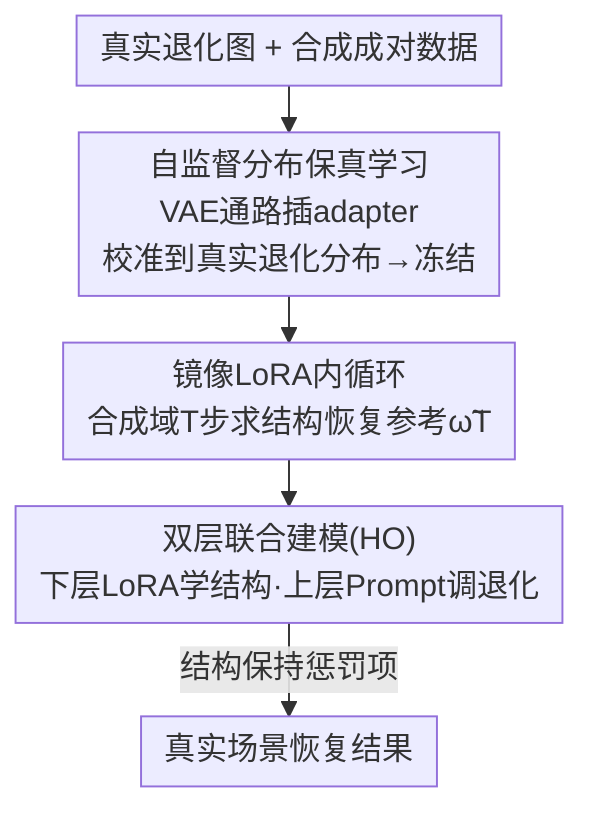

# BiProLoRA: Bilevel Prompt LoRA for Real Scene Recovery

**会议**: CVPR 2026  
**论文**: [CVF Open Access](https://openaccess.thecvf.com/content/CVPR2026/html/An_BiProLoRA_Bilevel_Prompt_LoRA_for_Real_Scene_Recovery_CVPR_2026_paper.html)  
**代码**: https://github.com/Defender0527/BiProLoRA  
**领域**: 图像恢复 / 扩散模型  
**关键词**: 真实场景恢复, 合成到真实适配, LoRA, 提示嵌入, 双层优化  

## 一句话总结
针对扩散大模型"训练于合成、泛化到真实"时退化严重的问题，BiProLoRA 先用自监督的分布保真学习把 VAE 自编码通路校准到真实退化分布，再把"LoRA 负责结构恢复、Prompt 负责退化感知调制"写成一个双层（超参数优化）问题联合训练，只用合成数据 10% 量级的真实数据就在低光/去雾/水下五个无参考指标上全面超过 SOTA。

## 研究背景与动机

**领域现状**：真实场景恢复（低光增强、去雾、水下复原）近年主流是用扩散大模型（如 Stable Diffusion 系列）做生成式恢复，典型范式是"在合成成对数据上训练、再迁移到真实场景测试"，并配一些简单的适配策略（直接 LoRA 微调、或加 prompt 调一调）。

**现有痛点**：这套范式在真实场景里有两个具体毛病。其一，真实退化观测的分布几乎没被利用——预训练自编码通路（VAE）从没见过真实退化分布，导致重建纹理失真、恢复结果"不忠实"。其二，模型在合成域学到的结构恢复与退化处理能力被塞进同一个参数空间过拟合，遇到训练时没见过的退化（unseen degradation）就适配不动、泛化很弱。

**核心矛盾**：根本原因是把"学结构恢复"和"适配真实退化"耦合在了同一组权重里。LoRA 容量足、能学好结构映射，但低秩更新一旦也去拟合真实退化，权重就被牢牢绑死在训练分布上；prompt embedding 天生擅长学新退化、且不动核心权重，但它缺乏算子级的精细控制、会同时影响很多层，单独用又恢复不好结构。两者各有所长却互相掣肘。

**本文目标**：设计一个真实场景适配方案，既要分布忠实（纹理可信），又要对未见退化稳健泛化。拆成两个子问题——(1) 怎么把自编码通路校准到真实退化分布；(2) 怎么让结构恢复与退化适配解耦又互相促进。

**切入角度**：作者观察到 LoRA 与 prompt 存在天然互补性——LoRA 提供"在可控监督下学到的、可复用的结构恢复能力"，prompt 提供"面对多样未见退化时调制这套能力如何被激活的轻量机制"。把 prompt 当作调制 LoRA 的"超参数"，正好对应超参数优化（HO）的双层结构。

**核心 idea**：用"分布保真预校准 + 双层（LoRA 为下层、Prompt 为上层）联合建模"代替"直接 LoRA/prompt 微调"，让结构学习与真实退化适配各管一摊、相互促进。

## 方法详解

### 整体框架
BiProLoRA 以效率导向的单步扩散模型 SD-Turbo 为底座，分两步把它适配到真实场景。第一步是**自监督分布保真学习（DFL）**：暂时把 UNet 摘掉，只在 VAE 自编码通路（编码器 $V_e$、解码器 $V_d$）上插入轻量 adapter，用真实退化数据自监督地把潜空间校准到真实退化分布，校准完即冻结。第二步是**双层 Prompt LoRA 联合建模**：在已校准的潜空间上，把"LoRA 学结构恢复（下层，吃合成成对数据）"与"Prompt 学退化感知调制（上层，吃真实数据）"写成一个双层优化问题，通过一个"镜像 LoRA 内循环 + 主参数外循环"的惩罚式求解器联合训练，最终得到 prompt 参数 $\theta^*$、LoRA 参数 $\omega^*$、adapter 参数 $\pi^*$。

### 关键设计

**1. 自监督分布保真学习（DFL）：恢复前先把潜空间校准到真实退化分布**

痛点是预训练 VAE 从没"见过"真实退化分布，潜空间是偏向干净/合成图的，扩散去噪在这种潜空间里跑出来纹理必然失真。DFL 的做法是：暂时摘掉 UNet $U$，在 VAE 自编码通路里插入带参数 $\pi$ 的轻量 adapter $A_\pi$（实现为两层 zero-convolution 模块，插在 $V_e$ 与 $V_d$ 的特征之间、以及输入输出之间），给定真实退化图直接用 $L_1$ 重建损失 $\ell_1$ 自监督训练 adapter（Alg.1：$\pi_{n+1}\leftarrow\pi_n-\delta\nabla_\pi\ell_1(\pi_n)$，训 $N$ 步后冻结）。

它和已有 VAE 分支策略的关键区别在于两点：一是**同时在特征级和像素级**约束（不只挂在特征层），二是**直接用真实退化数据 $D_{real}$** 优化、而不是用理想干净图或其退化变体。这样 adapter 被迫把"与任务无关的真实退化分布"编码进潜表示，而不是被推向干净/合成分布；后续扩散恢复就运行在一个已对齐真实退化的潜空间里，纹理才忠实。注意 DFL 在这里被当作**预训练**用（消融里"pretrain-only"优于"pretrain+finetune"，见下）。

**2. 把"LoRA↔Prompt 互补"写成双层（超参数优化）联合建模：结构与退化适配解耦**

这是全文核心。作者把 LoRA 与 prompt 的互补性形式化为一个双层规划：上层在真实退化数据上优化 prompt，下层在合成成对数据上优化 LoRA，

$$\min_{\theta}\ \ell_{real}\big(\theta,\omega^*(\theta);D_{real}\big),\quad \text{s.t.}\ \ \omega^*(\theta)\in\arg\min_{\omega}\ \ell_{syn}(\omega,\theta;D_{syn}),$$

其中 $\theta$ 是可学 prompt 嵌入 $P_\theta$ 的参数、$\omega$ 是 LoRA $R_\omega$ 的参数。直观上：下层让 LoRA 在可靠的合成成对数据上学到"受当前 prompt 引导的通用结构恢复能力"，上层则用"合成训练出的 LoRA 在真实世界的表现"反过来更新 prompt——即把 prompt 当作引导下层训练的超参数，去寻找能让 LoRA 行为对齐复杂真实退化的最优调制。这样就把"学结构"和"适配真实未见退化"在优化结构上彻底分开，为稳健的合成到真实适配打底。

**3. 结构保持惩罚 + 镜像 LoRA 求解：让 prompt 调制 LoRA 而不是把它"调坏"**

双层问题直接解代价高，作者借鉴惩罚式双层优化把 Eq.(1) 重写成单层惩罚目标：

$$\min_{\theta,\omega}\ \ell_{real}(\theta,\omega)+\lambda\big(\ell_{syn}(\theta,\omega)-v(\theta)\big),\quad v(\theta):=\min_{\omega}\ell_{syn}(\theta,\omega),$$

$v(\theta)$ 是下层值函数，$\lambda$ 平衡"真实适配"与"对下层最优解的一致性"。求解分内外两层。**内循环（镜像 LoRA）**：复制一份临时 LoRA 参数 $\tilde\omega_0=\omega_k$，在合成数据上快走 $T$ 步 $\tilde\omega_{t+1}\leftarrow\tilde\omega_t-\alpha\nabla_{\tilde\omega}\ell_{syn}(\tilde\omega_t,\theta)$，得到的 $\tilde\omega_T$ 是"当前 prompt 下 LoRA 理应达到的结构恢复参考"，它只作参考、不直接更新 $\omega$。**外循环**更新主 LoRA 与 prompt：

$$g_\omega=\nabla_\omega\ell_{real}(\theta,\omega)+\lambda\nabla_\omega\ell_{syn}(\theta,\omega),$$
$$g_\theta=\nabla_\theta\ell_{real}(\theta,\omega)+\lambda\big(\nabla_\theta\ell_{syn}(\theta,\omega)-\nabla_\theta\ell_{syn}(\theta,\tilde\omega_T)\big).$$

LoRA 更新以合成数据为主做强正则、真实数据轻度引导，保证它"不忘记"结构恢复主业、纹理才忠实；prompt 更新以真实场景目标为主驱动，惩罚项 $\nabla_\theta\ell_{syn}(\theta,\tilde\omega_T)$ 阻止 prompt 选择一种"严重破坏 LoRA 达到其合成最优参考 $\tilde\omega_T$ 能力"的配置——即确保 prompt 是在**调制** LoRA 的能力，而不是把它**破坏**掉。这正是"结构保持"的含义：LoRA 守住可复用结构、prompt 当调节器去适配复杂真实退化。

### 损失函数 / 训练策略
合成域用 $L_2$ 损失 $\ell_2$ 加感知损失 LPIPS $\ell_{lpips}$：$\ell_{syn}=\ell_2+\ell_{lpips}$。真实域是无参考的，用基于 CLIP 的对比目标：把真实退化图 $x_D$、真实干净图 $x_C$ 分别当正/负样本，随机初始化正/负 prompt，用 CLIP 图像/文本编码器编码后通过最大化文图余弦相似度并最小化二元交叉熵来训 prompt；拿到学好的 prompt 后，直接用恢复结果 $z_D$ 与 prompt 的文图余弦相似度作为真实域目标

$$\ell_{real}=\frac{e^{\cos(G_{image}(z_D),G_{text}(t_D))}}{\sum_{i\in\{D,C\}}e^{\cos(G_{image}(z_D),G_{text}(t_i))}}.$$

训练超参：DFL 用 Adam（$\delta=2\times10^{-5}$）；BiProLoRA 用三个 Adam，镜像 LoRA 与 LoRA 学习率 $\alpha=\beta=2\times10^{-5}$、prompt 学习率 $\gamma=1\times10^{-5}$。每个场景仅取 500 合成对 + 50 真实图训练、500 真实图测试（真实数据约为合成的 10%），单卡 RTX 5090。

## 实验关键数据

### 主实验
低光场景在 DARKFACE（seen）+ ExDark / NOD（unseen）上评测，用五个无参考指标。下表摘取代表性方法在三个数据集上的 NIQE（越低越好）与 MUSIQ（越高越好）：

| 数据集 | 指标 | BiProLoRA | ReDDiT (CVPR25) | LightenDiff (ECCV24) |
|--------|------|-----------|-----------------|----------------------|
| DARKFACE | NIQE↓ | **2.971** | 3.864 | 3.582 |
| DARKFACE | MUSIQ↑ | **61.33** | 54.08 | 49.90 |
| ExDark | NIQE↓ | **3.806** | 4.223 | 4.088 |
| NOD | NIQE↓ | **3.119** | 3.244 | 3.664 |

去雾与水下场景（NIQE↓ / MUSIQ↑）同样领先：

| 场景 | 方法 | NIQE↓ | MUSIQ↑ |
|------|------|-------|--------|
| Hazy | C2PNet | 4.295 | 57.43 |
| Hazy | WeaDiff | 4.332 | 56.62 |
| Hazy | **BiProLoRA** | **3.972** | **61.79** |
| Underwater | WF-Diff | 3.735 | 43.06 |
| Underwater | **BiProLoRA** | **3.514** | **45.99** |

下游夜间目标检测（在恢复图上跑检测器）进一步验证恢复有助于实用任务：

| 方法 | mAP↑ | AP50↑ | AP75↑ |
|------|------|-------|-------|
| Baseline | 37.5 | 63.8 | 39.4 |
| ReDDiT | 36.9 | 65.4 | 36.8 |
| **BiProLoRA** | **40.9** | **67.4** | **44.2** |

值得注意的是其它恢复方法（Di-Retinex/LightenDiff/ReDDiT）的 mAP 反而比不恢复的 Baseline 还低（37.5→36 左右），说明"增强"未必利于下游；BiProLoRA 是少数把 mAP 真正抬上去的。

### 消融实验
Table 4（算法分析）以 NIQE/LIQE/DE 拆解各组件。DFL 列分 Pretrain / Finetune 两种用法，Joint Modeling 列分 LoRA / Prompt / Naive（朴素拼接）/ HO（本文双层）：

| 配置 | DFL | 联合方式 | NIQE↓ | 说明 |
|------|-----|----------|-------|------|
| Sa | 无 | 仅 LoRA | 4.145 | 只 LoRA：结构尚可 |
| Sb | 无 | 仅 Prompt | 6.972 | 只 Prompt：恢复极差 |
| Sc | 无 | LoRA+Prompt(Naive) | 3.967 | 朴素拼接 |
| Sd | 无 | LoRA+Prompt(HO) | 3.403 | 双层优于朴素 |
| Sg | Pretrain+Finetune | Naive | 3.734 | DFL 两用法都开 |
| Sh | Pretrain+Finetune | HO | 3.607 | 仍逊于仅 pretrain |
| Sk | Pretrain | Naive | 3.716 | — |
| **Ours** | **Pretrain** | **HO** | **2.971** | 完整模型 |

### 关键发现
- **LoRA 与 Prompt 的互补被实证**：单用 Prompt（Sb NIQE 6.972）几乎不能恢复，单用 LoRA（Sa 4.145）结构尚可但适配弱；二者组合才有意义，印证了"LoRA 管结构、Prompt 管退化调制"的假设。
- **双层（HO）显著优于朴素拼接**：同样 LoRA+Prompt，Naive 拼接（Sc 3.967 / Sk 3.716）明显差于 HO（Sd 3.403 / Ours 2.971），说明把互补关系写成双层优化、用结构保持惩罚去协调，比简单一起训有效得多。
- **DFL 当"预训练"比"边训边调"更好**：仅 pretrain（Ours 2.971）优于 pretrain+finetune（Sh 3.607），也优于完全不要 DFL（Sd 3.403）——把真实分布校准固化下来再冻结，比让它和适配过程纠缠更稳。
- **数据效率高**：真实数据仅为合成数据的约 10%（每场景 50 真实图）即取得全面增益。

## 亮点与洞察
- **把适配难题映射成超参数优化（HO）**：这是最"啊哈"的一步——prompt 与 LoRA 的"一个调制、一个执行"关系恰好同构于"超参数 vs 模型参数"，于是双层规划这套成熟工具直接可用，给"如何协调两类适配机制"一个有原则的框架，而不是拍脑袋拼。
- **结构保持惩罚项 $\nabla_\theta\ell_{syn}(\theta,\tilde\omega_T)$ 的设计很巧**：用一份"镜像 LoRA"快走出的合成最优参考来约束 prompt，明确防止 prompt"为了适配真实退化而把 LoRA 的结构能力调坏"，把"调制 vs 破坏"这条界限显式写进了梯度里。
- **DFL 与扩散解耦、可复用**：先在 VAE 通路上做分布校准、再冻结，本身是个轻量 zero-conv 模块，几乎零额外开销，这种"先校准潜空间再恢复"的思路可迁移到其它"合成训练-真实部署"的低层视觉任务。
- **下游检测验证"忠实恢复"而非"好看"**：很多增强方法 mAP 反掉，本文反升，提醒评估真实恢复应看下游任务而不只是无参考美学分。

## 局限与展望
- 真实域目标完全依赖 CLIP 文图相似度，正/负 prompt 随机初始化——⚠️ 这套对比信号的稳定性与对某些退化（如强色偏水下）的判别力存疑，原文未深入讨论其失败模式。
- 训练规模偏小（每场景 500 合成 + 50 真实），虽证明数据效率，但在更大规模、更复杂混合退化下的可扩展性未验证。
- 全程用无参考指标（NIQE/LIQE/DE/MUSIQ/ARNIQ）评测，缺乏成对真值上的 PSNR/SSIM——⚠️ 真实场景确实难有真值，但无参考指标与人眼/下游一致性有限，结论需谨慎。
- 双层优化引入镜像 LoRA 内循环（每外步 $T$ 步），训练成本高于单纯 LoRA 微调；论文未给出训练耗时对比。
- 改进方向：把 HO 求解器的内循环步数 $T$、惩罚权重 $\lambda$ 做自适应；或把 DFL 扩展到处理空间非均匀退化。

## 相关工作与启发
- **vs 直接 LoRA 微调**：LoRA 把结构恢复与真实退化适配耦合进同一参数空间，过拟合训练分布、对未见退化乏力；本文把 LoRA 降为"下层只学结构"，退化适配交给上层 prompt，解耦后泛化更强（消融 Sa vs Ours：4.145→2.971）。
- **vs Prompt/文本嵌入微调**：单纯调 prompt 缺算子级控制、结构恢复差（Sb 6.972）；本文不抛弃 prompt 而是用它去"调制"LoRA，取二者之长。
- **vs 已有 VAE 分支策略（如 QuadPrior 等用干净图/特征级约束）**：DFL 改为特征+像素双级、且直接用真实退化数据，迫使潜空间编码真实分布而非被推向干净分布，纹理更忠实。
- **vs ReDDiT / DiffLL / LightenDiff 等扩散恢复 SOTA**：它们仍在"合成训练-简单适配"范式内，本文用"预校准 + 双层联合"系统化解决分布鸿沟与未见退化，跨低光/去雾/水下三类场景一致领先。

## 评分
- 新颖性: ⭐⭐⭐⭐⭐ 把 LoRA↔Prompt 互补形式化为双层超参数优化、配结构保持惩罚，是真实场景适配的新范式。
- 实验充分度: ⭐⭐⭐⭐ 跨三类退化 + 下游检测 + 细致消融，但只用无参考指标、训练规模偏小、缺成本对比。
- 写作质量: ⭐⭐⭐⭐ 动机—互补性分析—双层建模逻辑清晰，公式完整；个别记号（HO/镜像 LoRA）需对照算法才好懂。
- 价值: ⭐⭐⭐⭐ 数据高效、即插即用于扩散恢复，对"合成训练-真实部署"低层视觉很有实用与迁移价值。

<!-- RELATED:START -->

## 相关论文

- [\[CVPR 2026\] PNG: Diffusion-Based sRGB Real Noise Generation via Prompt-Driven Noise Representation Learning](diffusion-based_srgb_real_noise_generation_via_prompt-driven_noise_representatio.md)
- [\[CVPR 2026\] Gaussian Splatting-based Low-Rank Tensor Representation for Multi-Dimensional Image Recovery](gaussian_splatting-based_low-rank_tensor_representation_for_multi-dimensional_im.md)
- [\[CVPR 2026\] Restore Text First, Enhance Image Later: Two-Stage Scene Text Image Super-Resolution with Glyph Structure Guidance](restore_text_first_enhance_image_later_two-stage_scene_text_image_super-resoluti.md)
- [\[CVPR 2026\] Real-Time Neural Video Compression with Unified Intra and Inter Coding](real-time_neural_video_compression_with_unified_intra_and_inter_coding.md)
- [\[CVPR 2026\] One-Step Diffusion Transformer for Controllable Real-World Image Super-Resolution](one-step_diffusion_transformer_for_controllable_real-world_image_super-resolutio.md)

<!-- RELATED:END -->
