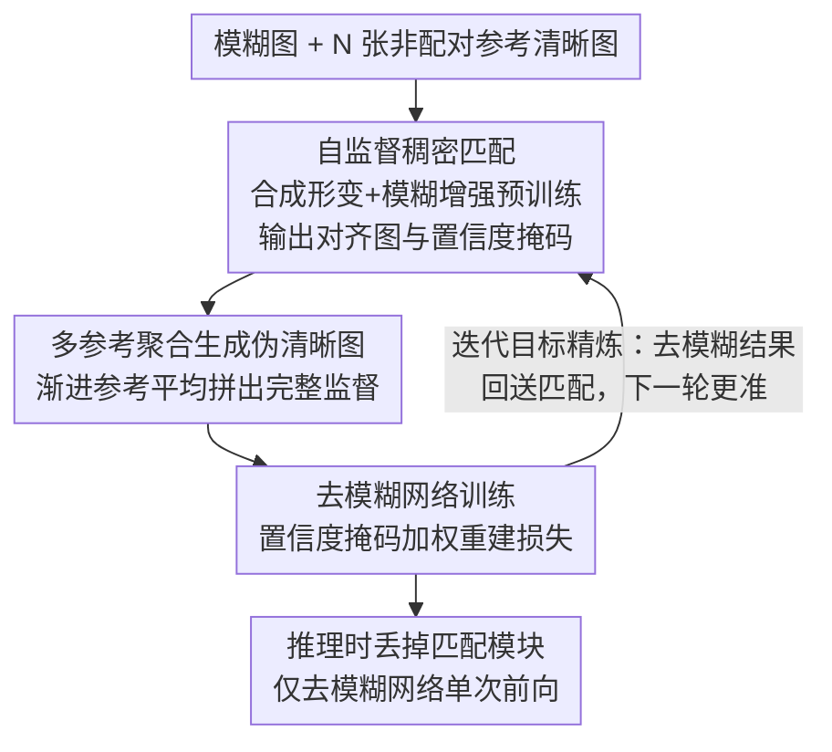

# BluRef: Unsupervised Image Deblurring with Dense-Matching References

**会议**: CVPR 2026  
**arXiv**: [2603.14176](https://arxiv.org/abs/2603.14176)  
**代码**: [项目主页](https://qualcomm-ai-research.github.io/BluRef/)  
**领域**: 图像复原  
**关键词**: 无监督去模糊, 稠密匹配, 伪清晰图像生成, 参考图像, 迭代优化

## 一句话总结

提出 BluRef，首个利用非配对参考清晰图像通过稠密匹配生成伪 ground truth 来训练去模糊网络的无监督框架，性能逼近甚至超越有监督方法。

## 研究背景与动机

**运动模糊普遍存在**：图像/视频中运动模糊会严重降低视觉质量并影响下游视觉任务的性能，可靠的去模糊技术具有重要实用价值。

**配对数据采集代价极高**：当前主流有监督方法依赖配对的模糊-清晰训练数据，但获取这些数据需要分光器、多相机同步等复杂设备，大多数拍摄场景（如行车记录仪、执法记录仪）几乎不可能搭建这样的采集系统。

**Reblurring 方法存在域间差异**：如 Blur2Blur 等方法通过将未知模糊映射到已有配对数据的中间模糊域来间接去模糊，但寻找合适的中间域本身就很困难，域间不匹配会导致性能下降，且多阶段流程增加计算开销。

**域间差距是根本瓶颈**：无论是有监督方法的训练-测试域差异，还是 reblurring 方法的中间域匹配问题，domain gap 始终制约无监督去模糊的性能上限。

**非配对参考图像容易获取**：同一场景在不同时刻可能同时存在模糊帧和清晰帧，这些非配对的同场景图像大量可得，是天然的训练资源。

**现有参考图像方法仍依赖有监督训练**：先前的参考增强去模糊方法（如 Lai 等人的双相机人脸增强）仍需配对数据训练，未真正解决无监督学习的核心挑战。

## 方法详解

### 整体框架

BluRef 是一个迭代优化框架，包含两个交替执行的步骤：(1) **伪清晰图像生成**——利用稠密匹配模型在当前去模糊结果与非配对参考清晰图之间建立对应关系，生成伪 ground truth；(2) **去模糊网络训练**——以伪清晰图为监督目标更新去模糊网络参数。每个 epoch 中，改进的去模糊结果又反馈给稠密匹配模块，使伪清晰图逐步趋近真实清晰图像。推理时仅需去模糊网络的单次前向传播，无需稠密匹配模块。

### 关键设计

**1. 自监督稠密匹配：在没有真实模糊配对的前提下学会跨清晰-模糊域的像素对应**

要用清晰参考图"补"出伪 ground truth，第一步得有一个能在模糊目标图和清晰参考图之间建立稠密对应的匹配模型 $\mathcal{DM}$，它输出对齐后的图像 $I_{\text{trans}}$ 和置信度掩码 $M_{\text{conf}}$。BluRef 用纯自监督的方式训练它：对一张清晰图施加随机单应性变换和 TPS 变换得到几何形变对，再对形变图做模糊/噪声增强（借鉴 BSRGAN 的退化建模），这样模型见过的"目标-参考"对天然横跨清晰与模糊两个域，骨干沿用 PDC-Net+ 与 GLU-Net-GOCor。关键之处在于这些合成数据只用于匹配模型预训练、完全不触碰真实模糊样本，因此整个去模糊框架仍是严格无监督的；而模糊增强又让匹配器在面对真实模糊输入时不至于失准。

**2. 多参考聚合生成伪清晰图：单张参考覆盖不全，就让多张参考互补拼出完整监督**

一张参考清晰图和模糊图往往只在不到 40% 的区域能匹配上，直接拿来当 ground truth 会大面积缺监督。BluRef 给定 $N$ 张参考图，通过稠密匹配把各自匹配上的区域聚合成一张完整伪清晰图，并比较了三种聚合策略：**加权平均**对各参考独立匹配后按置信度加权，最简单但区域衔接生硬；**序列累积**用上一步的拼接结果作为下一步匹配输入，能保持细节连续；**渐进参考平均**每轮只对尚未匹配的区域引入新参考、再融合所有迭代结果，既不重复匹配已覆盖区域、也不丢信息，兼顾覆盖率和细节，实验里表现最好。

**3. 迭代目标精炼：让去模糊网络和伪清晰图在训练中互相喂养、一起变好**

初始时模糊图和参考图的匹配质量有限，伪 ground truth 也粗糙。BluRef 把生成和训练拆成交替的两步循环：第 $k$ 轮的去模糊结果 $I_{\text{deblur}}^{(k)}$ 送回稠密匹配，因为它比原始模糊图更清晰，匹配会更准、产出更干净的 $I_{\text{pseudo}}^{(k)}$；用它当监督训练出更强的网络参数 $\Theta^{(k+1)}$，下一轮又得到更好的去模糊结果。第一轮没有去模糊结果可用，就直接拿模糊图作匹配输入冷启动。这个正反馈让伪 ground truth 的质量随训练单调爬升——即便参考帧时间距离拉大到 Δ=20、匹配率掉到 25-28%，性能仍几乎不降，实验里 PSNR 也在约 100K 迭代后明显收敛。

**4. 推理时丢掉匹配模块：参考图只在训练期需要，部署时回到标准去模糊网络**

稠密匹配和伪清晰图生成都只服务于"造监督数据"这一训练目的。训练一旦完成，这些模块连同对参考图的依赖全部丢弃，推理只跑去模糊网络的单次前向，成本与任何标准去模糊骨干完全一致。更进一步，造好的伪配对数据可以反复用来训练不同容量的网络——包括适合移动端的轻量模型，一次生成、多个模型受益，让框架在保持零额外推理开销的同时扩展了落地价值。

### 损失函数 / 训练策略

去模糊网络的训练目标是置信度掩码加权的重建损失：

$$\Theta^{(k+1)} := \arg\min_{\Theta} \mathcal{L}\left(\mathcal{D}(I_{\text{blur}};\Theta) * \bar{M}^{(k)}_{\text{pseudo}},\; I^{(k)}_{\text{pseudo}} * \bar{M}^{(k)}_{\text{pseudo}}\right)$$

其中 $\bar{M}^{(k)}_{\text{pseudo}}$ 是阈值 0.7 二值化后的置信度掩码，$\mathcal{L}$ 可选 $L_1$、$L_2$ 或 PSNR loss。掩码让网络只在高置信区域学习，把匹配错误区域的噪声监督屏蔽掉，避免错误伪 GT 污染训练。

## 实验

**表1：GoPro 与 RB2V 数据集上的定量对比（PSNR/SSIM）**

| 方法 | GoPro Δ=1 | GoPro Δ=10 | GoPro Δ=20 | RB2V Δ=1 | RB2V Δ=10 | RB2V Δ=20 |
|---|---|---|---|---|---|---|
| DualGAN | 22.23/0.721 | 22.10/0.719 | 21.24/0.702 | 21.01/0.512 | 20.87/0.500 | 20.92/0.505 |
| UID-GAN | 23.42/0.732 | 23.18/0.724 | 22.38/0.724 | 22.22/0.578 | 22.01/0.551 | 22.13/0.569 |
| UAUD | 24.25/0.792 | 24.02/0.750 | 23.77/0.745 | 22.87/0.590 | 22.29/0.581 | 22.28/0.581 |
| NAFNet-BluRef (Prog.) | **31.94/0.960** | **31.87/0.955** | **31.52/0.947** | **27.87/0.821** | **27.72/0.820** | **27.24/0.812** |
| Restormer-BluRef (Prog.) | 31.02/0.950 | 30.97/0.949 | 30.95/0.938 | 26.82/0.839 | 26.76/0.832 | 26.13/0.829 |
| NAFNet (有监督上界) | 33.32/0.962 | — | — | 28.54/0.824 | — | — |

BluRef 在 GoPro 上达到 31.94 dB（vs 有监督 33.32 dB），在 RB2V 上 Restormer 骨干甚至超越有监督上界（27.87 vs 27.43）。Δ 从 1 增大到 20 时性能仅轻微下降，说明对参考帧时间距离鲁棒。

**表2：BluRef + Blur2Blur 组合在真实场景下的表现（NIQE↓/FID↓）**

| 方法 | NIQE/FID |
|---|---|
| BSRGAN | 13.34/10.25 |
| Blur2Blur (GoPro) | 12.01/8.93 |
| Blur2Blur (RSBlur) | 10.07/6.28 |
| BluRef | 10.43/6.45 |
| **BluRef + Blur2Blur (RSBlur)** | **8.47/5.62** |

在无配对 ground truth 的 PhoneCraft 真实数据集上，BluRef 与 Blur2Blur 结合后在 NIQE 和 FID 上均显著优于单独方法。此外，BluRef 生成的伪配对数据训练的去模糊模型与真实 ground truth 训练的模型性能差距 < 1 dB PSNR（RB2V 上 27.73 vs 28.54）。

**表3：参考图像数量消融（GoPro, NAFNet, Δ=1）**

| 参考帧数 | 4 | 6 | 8 | 10 |
|---|---|---|---|---|
| PSNR/SSIM | 31.42/0.942 | **31.94/0.960** | 31.93/0.961 | 31.05/0.924 |

6-8 帧为最优区间，过少覆盖不足，过多引入冗余/强不对齐内容。

## 亮点

1. **首个非配对参考引导的无监督去模糊框架**：完全消除对配对训练数据和预训练去模糊网络的依赖，仅需同场景非配对视频帧。
2. **性能逼近/超越有监督方法**：在 RB2V 真实模糊数据集上超越有监督 Restormer 上界（27.87 vs 27.43），在 GoPro 上与有监督仅差 ~1.4 dB。
3. **推理零额外开销**：训练时的稠密匹配和伪 GT 生成模块在推理时全部丢弃，推理成本等同于标准去模糊骨干网络。
4. **伪配对数据可复用**：生成的伪配对可训练任意容量的网络（含移动端轻量模型），一次训练多模型受益。
5. **对参考帧时间距离鲁棒**：Δ=20 时匹配率仅 25-28%，但性能下降极小，展现强鲁棒性。

## 局限性

1. **依赖同场景参考图**：需要获取与模糊图相同或相似场景的清晰参考图，对于无法获取参考图的孤立图像场景不适用。
2. **稠密匹配模型的预训练成本**：虽然使用合成数据训练，但 PDC-Net+ 的训练和推理仍有一定计算开销，限制了 BluRef 在大规模数据上的训练效率。
3. **伪 GT 质量上限**：当参考图与模糊图覆盖区域极少（如大幅度运动或场景切换）时，伪清晰图质量受限，可能影响训练效果。
4. **无端到端联合优化**：稠密匹配模型与去模糊网络分开训练、交替迭代，未实现端到端联合优化，可能存在次优解。

## 相关工作

- **无监督去模糊**：DualGAN、UID-GAN、UAUD 等基于 CycleGAN 或自增强的方法，性能远低于 BluRef（PSNR 差距 7-9 dB）。
- **Reblurring 方法**：Blur2Blur 通过域转换间接去模糊，依赖中间域的选择质量，可与 BluRef 互补组合使用。
- **参考图像增强去模糊**：Xiang 等人利用参考视频增强去模糊网络，Zou 等人和 Liu 等人也做过参考增强，但均在有监督框架下工作。
- **稠密匹配**：DGC-Net、GLU-Net、PDC-Net+ 等方法被本文创新性地用于跨清晰-模糊域的语义对应。

## 评分

- 新颖性: ⭐⭐⭐⭐ — 首次将稠密匹配+非配对参考引入无监督去模糊，框架设计新颖且直觉清晰
- 实验充分度: ⭐⭐⭐⭐ — 涵盖合成/真实数据集、多骨干网络、多策略消融、与有监督上界和组合方法的全面对比
- 写作质量: ⭐⭐⭐⭐ — 行文结构清晰，问题动机阐述充分，图表信息量大
- 价值: ⭐⭐⭐⭐ — 极大降低去模糊训练数据门槛，伪配对数据复用机制扩展了实用价值

<!-- RELATED:START -->

## 相关论文

- [\[CVPR 2026\] Rethinking Diffusion Model-Based Video Super-Resolution: Leveraging Dense Guidance from Aligned Features](rethinking_diffusion_model-based_video_super-resolution_leveraging_dense_guidanc.md)
- [\[CVPR 2026\] Gyro-based Deep Video Deblurring](gyro-based_deep_video_deblurring.md)
- [\[CVPR 2026\] UDAPose: Unsupervised Domain Adaptation for Low-Light Human Pose Estimation](udapose_unsupervised_domain_adaptation_for_low_light_human_pose_estimation.md)
- [\[CVPR 2026\] SelfHVD: Self-Supervised Handheld Video Deblurring](selfhvd_self-supervised_handheld_video_deblurring.md)
- [\[CVPR 2026\] MAD-Avatar: Motion-Aware Animatable Gaussian Avatars Deblurring](motionaware_animatable_gaussian_avatars_deblurring.md)

<!-- RELATED:END -->
